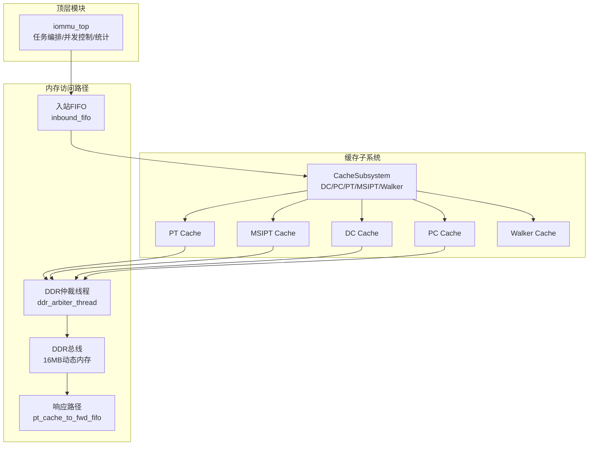
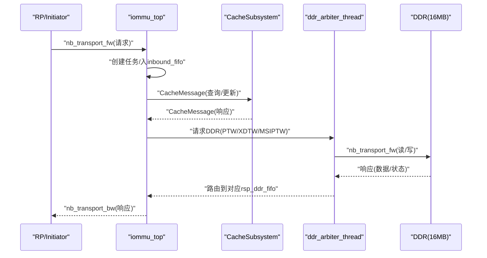
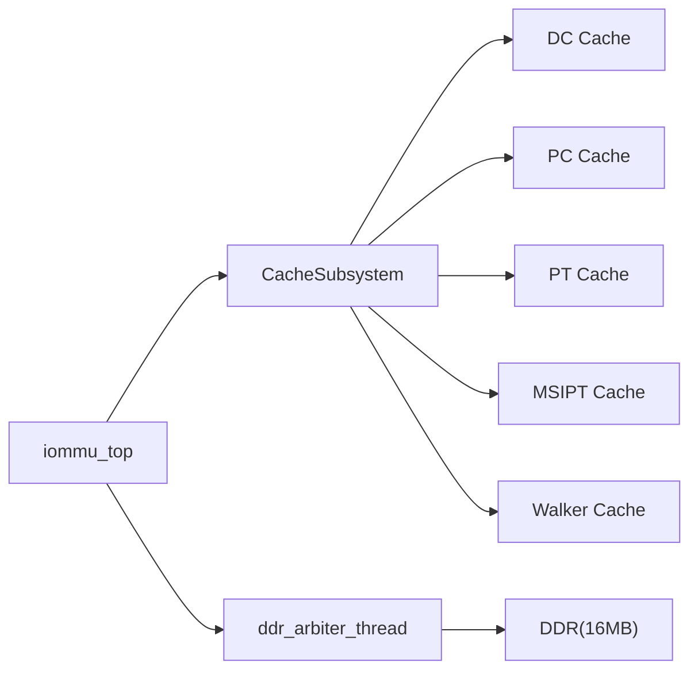

# 内存管理

<cite>
**本文档引用的文件**
- [iommu_top.cc](file://iommu/iommu_top.cc)
- [iommu_top.hh](file://iommu/iommu_top.hh)
- [iommu_task.hh](file://iommu/include/iommu_task.hh)
- [iommu_struct.hh](file://iommu/include/iommu_struct.hh)
- [types.h](file://iommu/cache_src/common/types.h)
- [dedup_buffer.h](file://iommu/cache_src/common/dedup_buffer.h)
- [cache_subsystem.h](file://iommu/cache_src/subsystem/cache_subsystem.h)
- [iommu_dedup_params.hh](file://iommu/include/iommu_dedup_params.hh)
- [iommu_perf_params.hh](file://iommu/iommu_perf_model/iommu_perf_params.hh)
- [test_ddr.cc](file://ddr/test_ddr.cc)
- [test_ddr.hh](file://ddr/test_ddr.hh)
</cite>

## 更新摘要
**所做更改**
- 更新了DDR内存分配策略章节，反映从静态1MB到动态16MB的改进
- 新增了内存边界检查逻辑章节，说明改进后的地址验证机制
- 更新了SystemC大对象栈溢出问题的解决方案
- 增强了内存管理性能优化最佳实践部分

## 目录
1. [简介](#简介)
2. [项目结构](#项目结构)
3. [核心组件](#核心组件)
4. [架构总览](#架构总览)
5. [详细组件分析](#详细组件分析)
6. [依赖关系分析](#依赖关系分析)
7. [性能考量](#性能考量)
8. [故障排查指南](#故障排查指南)
9. [结论](#结论)
10. [附录](#附录)

## 简介
本文件面向IOMMU内存管理系统，围绕内存分配策略、缓冲区管理与资源池设计展开，重点解释以下方面：
- FIFO队列容量设计原理与动态调整机制
- 内存访问的并发控制与互斥锁机制（含sc_mutex使用场景与性能影响）
- 内存使用统计与监控（outstanding计数器与峰值跟踪）
- 内存泄漏检测与资源回收策略
- 内存性能优化最佳实践

## 项目结构
IOMMU内存管理涉及SystemC管道、缓存子系统、DDR仲裁与响应路径、以及统计与峰值跟踪等模块。顶层模块iommu_top负责任务编排、FIFO队列、并发控制与统计。

**图表来源**
- [iommu_top.cc:279-404](file://iommu/iommu_top.cc#L279-L404)
- [cache_subsystem.h:21-93](file://iommu/cache_src/subsystem/cache_subsystem.h#L21-L93)
- [test_ddr.cc:14-17](file://ddr/test_ddr.cc#L14-L17)

**章节来源**
- [iommu_top.cc:19-780](file://iommu/iommu_top.cc#L19-L780)
- [iommu_top.hh:44-500](file://iommu/iommu_top.hh#L44-L500)

## 核心组件
- 顶层编排模块：负责任务生命周期、FIFO队列、并发控制、统计与峰值跟踪、DDR仲裁与响应路由。
- 缓存子系统：统一的CacheMessage接口，支持查询、更新、失效，并提供统计收集与任务跟踪。
- 缓冲区与资源池：DedupBuffer用于PT Cache去重与预取的占位链表管理；多处sc_mutex保护共享状态。
- FIFO队列：覆盖Parser到Collector、Cache查询/更新、Walker请求/响应、PT Cache到Forwarder、以及DDR请求/响应等全链路。
- **新增** DDR内存管理：采用动态16MB内存分配，解决SystemC大对象栈溢出问题。

**章节来源**
- [iommu_top.hh:68-496](file://iommu/iommu_top.hh#L68-L496)
- [cache_subsystem.h:21-189](file://iommu/cache_src/subsystem/cache_subsystem.h#L21-L189)
- [dedup_buffer.h:61-126](file://iommu/cache_src/common/dedup_buffer.h#L61-L126)
- [test_ddr.hh:24-25](file://ddr/test_ddr.hh#L24-L25)

## 架构总览
IOMMU内存管理采用"任务驱动"的SystemC管道架构，通过多级FIFO解耦各模块，配合缓存子系统与DDR仲裁实现高吞吐与低延迟的地址翻译与数据传输。

**图表来源**
- [iommu_top.cc:140-201](file://iommu/iommu_top.cc#L140-L201)
- [iommu_top.cc:206-274](file://iommu/iommu_top.cc#L206-L274)
- [iommu_top.cc:279-404](file://iommu/iommu_top.cc#L279-L404)
- [test_ddr.cc:34-46](file://ddr/test_ddr.cc#L34-L46)

## 详细组件分析

### FIFO队列容量设计与动态调整
- 容量设计原则
  - 端口带宽与延迟：基于端口频率、位宽与延迟公式（delay_ns = 1000·size·8 / bandwidth_mbps）进行带宽控制与排队长度估算。
  - 并发上限：各模块outstanding计数器限制（如PTW、XDTW、Collector、AXI Master等），确保不会超过DDR或端口并发上限。
  - 流水线深度：Cache命中/miss响应、Walker请求/响应、Forwarder输出等均设置合理FIFO深度，避免阻塞与饥饿。
- 动态调整机制
  - 流控事件：当pending队列或outstanding达到阈值时，通过sc_event等待槽位释放后再继续推进。
  - 优先级仲裁：DDR仲裁采用"控制路径优先 + 轮询"策略，保障关键路径低延迟。
  - 带宽控制：在入站与出站路径引入基于带宽的等待延迟，平滑突发流量。

**章节来源**
- [iommu_top.cc:144-149](file://iommu/iommu_top.cc#L144-L149)
- [iommu_top.cc:282-302](file://iommu/iommu_top.cc#L282-L302)
- [iommu_top.cc:389-393](file://iommu/iommu_top.cc#L389-L393)
- [iommu_perf_params.hh:84-108](file://iommu/iommu_perf_model/iommu_perf_params.hh#L84-L108)
- [iommu_perf_params.hh:102-125](file://iommu/iommu_perf_model/iommu_perf_params.hh#L102-L125)

### 内存分配策略与缓冲区管理
- DedupBuffer（PT Cache去重+预取）
  - 顺序分配：线性扫描空闲Entry，按0..255顺序分配，支持链表挂接与尾指针记录。
  - 链表结构：支持将多个等待PTW完成的任务挂接到同一Buffer Entry链上，减少重复翻译。
  - 反压机制：当Buffer满时，可通过free_event通知等待者，避免无界增长。
- 缓冲区容量与参数
  - 固定容量：256个Entry，满足典型预取与去重需求。
  - 参数开关：去重与预取深度可通过配置项控制（如PT_DEDUP_PREFETCH_DEPTH）。

**章节来源**
- [dedup_buffer.h:61-126](file://iommu/cache_src/common/dedup_buffer.h#L61-L126)
- [types.h:519-560](file://iommu/cache_src/common/types.h#L519-L560)
- [iommu_dedup_params.hh:10-43](file://iommu/include/iommu_dedup_params.hh#L10-L43)

### 资源池设计与任务上下文
- 任务结构（iommu_task_t）
  - 包含设备/进程上下文、翻译阶段信息、Walker上下文、去重链头索引、状态机与TLM payload指针。
  - Walker上下文支持预取深度、批量更新、Burst预取等高级特性。
- 缓存消息（CacheMessage）
  - 统一的查询/更新/失效消息结构，支持批量更新与去重Buffer索引传递。
  - 带时序信息（timestamp、latency）便于性能建模与统计。

**章节来源**
- [iommu_task.hh:184-280](file://iommu/include/iommu_task.hh#L184-L280)
- [types.h:467-560](file://iommu/cache_src/common/types.h#L467-L560)

### 并发控制与互斥锁机制（sc_mutex）
- 关键保护对象
  - ddr_queue_mtx：保护DDR pending队列的入队/出队。
  - task_id_mtx：保护任务ID递增的原子性。
  - pt_cache_mtx：保护PT Cache挂起任务映射。
  - collector_mtx：保护Collector挂起任务表。
  - va_dedup_mtx：保护VA去重表。
  - pt_dedup_buffer_mtx：保护DedupBuffer分配/释放。
  - 各模块内部互斥：如xdtw_walks_mtx、ptw_walks_mtx、msiptw_walks_mtx等。
- 性能影响
  - 适度使用互斥可避免竞态，但过度串行化会降低吞吐；建议将临界区最小化，必要时拆分锁粒度。
  - 对于高频访问的共享状态（如outstanding计数），可考虑无锁或细粒度锁策略。

**章节来源**
- [iommu_top.hh:105-151](file://iommu/iommu_top.hh#L105-L151)
- [iommu_top.cc:99-101](file://iommu/iommu_top.cc#L99-L101)
- [iommu_top.cc:211-221](file://iommu/iommu_top.cc#L211-L221)

### 内存访问的并发控制与outstanding管理
- 全局outstanding
  - 入口Parser申请，重排序输出后释放，上限由IOMMU_GLOBAL_MAX_OUTSTANDING限制。
- 各模块outstanding
  - PTW、XDTW DC/PC、Collector DC/PC、AXI Master 1（DDR）、AXI Master 0（出口）均有独立峰值跟踪。
- 流控与事件
  - 当达到并发上限时，通过axi_master_1_slot_freed_event、ddr_pending_freed_event等事件等待槽位释放。

**章节来源**
- [iommu_top.hh:292-295](file://iommu/iommu_top.hh#L292-L295)
- [iommu_top.hh:212-221](file://iommu/iommu_top.hh#L212-L221)
- [iommu_perf_params.hh:140-145](file://iommu/iommu_perf_model/iommu_perf_params.hh#L140-L145)

### DDR内存管理重大改进
**更新** 从静态1MB分配改为动态16MB分配，解决SystemC大对象栈溢出问题

- **内存分配策略**
  - **动态分配**：采用动态内存分配（new unsigned char[DDR_MEMORY_SIZE]）而非静态数组，避免SystemC大对象栈溢出问题。
  - **容量扩展**：内存容量从1MB增加到16MB，满足更大的页表存储需求（特别是2MB GPA_stride页面表）。
  - **内存初始化**：构造函数中动态分配内存并清零，提供明确的内存大小报告。

- **SystemC大对象栈溢出解决方案**
  - **问题背景**：静态内存分配可能导致SystemC大对象栈溢出，特别是在复杂仿真环境中。
  - **解决方案**：使用动态内存分配，将大型内存块移动到堆内存而非栈内存。
  - **性能影响**：动态分配可能带来轻微的性能开销，但换来的是稳定的内存管理。

- **内存边界检查逻辑改进**
  - **地址验证**：新增完整的地址范围检查，确保访问地址不超过内存边界。
  - **错误处理**：当地址超出范围时返回TLM_ADDRESS_ERROR_RESPONSE，提供清晰的错误信息。
  - **调试支持**：详细的错误日志包含地址、长度和内存大小信息，便于问题诊断。

- **内存使用统计**
  - **容量报告**：构造函数中打印内存分配大小（16MB），便于监控和调试。
  - **访问统计**：通过process_memory_access函数统计读写操作，支持性能分析。

**章节来源**
- [test_ddr.cc:14-17](file://ddr/test_ddr.cc#L14-L17)
- [test_ddr.cc:141-146](file://ddr/test_ddr.cc#L141-L146)
- [test_ddr.hh:24-25](file://ddr/test_ddr.hh#L24-L25)

### 内存使用统计与监控（outstanding与峰值）
- 统计维度
  - Cache命中/缺失计数（DC/PC/PT/MSIPT）与命中率统计。
  - PTW任务IOPS、平均/最大/最小执行时延、平均/最大/最小DDR访问时延。
  - 各端口累计字节数与平均带宽。
  - 各模块outstanding峰值与理论峰值对比。
- 报告输出
  - 通过print_cache_statistics集中打印，包含稳态IOPS测量窗口（跳过前后10%）。

**章节来源**
- [iommu_top.cc:554-780](file://iommu/iommu_top.cc#L554-L780)
- [iommu_top.cc:560-667](file://iommu/iommu_top.cc#L560-L667)

### 内存泄漏检测与资源回收策略
- 泄漏检测
  - 通过outstanding计数与峰值跟踪识别异常堆积；检查各模块FIFO是否持续增长。
  - 统一日志输出（如DDR响应处理、任务完成）辅助定位卡点。
- 资源回收
  - DedupBuffer：任务完成后释放Entry，free_event通知等待者。
  - TLM payload：在DDR响应回调中释放临时分配的payload与数据缓冲。
  - 重排序缓冲：任务输出后释放全局outstanding，避免悬挂。

**章节来源**
- [iommu_top.cc:252-257](file://iommu/iommu_top.cc#L252-L257)
- [iommu_top.cc:264-268](file://iommu/iommu_top.cc#L264-L268)
- [iommu_top.cc:497-500](file://iommu/iommu_top.cc#L497-L500)

### 内存性能优化最佳实践
- 队列深度与并发上限
  - 基于带宽与延迟公式设置FIFO深度，避免溢出与饥饿。
  - 合理设置各模块outstanding上限，结合事件驱动的反压机制。
- 预取与去重
  - 启用PT Cache去重与预取（D>0）可显著减少PTW任务数与DDR访问。
  - 控制预取深度，避免过度预取导致缓存污染。
- 缓存一致性
  - 使用CacheMessage统一接口，减少分支与状态不一致风险。
  - 合理使用批量更新（batch_updates）提升PT Cache更新效率。
- 互斥锁优化
  - 将临界区最小化，避免在FIFO写入/读取路径中持有锁。
  - 对高频共享状态采用细粒度锁或无锁结构。
- **新增** 动态内存管理
  - 采用动态内存分配策略，避免SystemC大对象栈溢出。
  - 合理设置内存容量，平衡性能与资源消耗。
  - 实施完整的内存边界检查，确保访问安全性。

**章节来源**
- [iommu_perf_params.hh:116-121](file://iommu/iommu_perf_model/iommu_perf_params.hh#L116-L121)
- [types.h:535-560](file://iommu/cache_src/common/types.h#L535-L560)
- [dedup_buffer.h:71-104](file://iommu/cache_src/common/dedup_buffer.h#L71-L104)
- [test_ddr.cc:14-17](file://ddr/test_ddr.cc#L14-L17)

## 依赖关系分析
- 顶层模块依赖缓存子系统提供的统一接口，通过FIFO连接各模块。
- DDR仲裁线程依赖各Walker模块（XDTW/PTW/MSIPTW）产生的请求，受全局outstanding与端口并发限制。
- 统计模块依赖各模块的计数器与事件，形成闭环监控。

**图表来源**
- [iommu_top.cc:279-404](file://iommu/iommu_top.cc#L279-L404)
- [cache_subsystem.h:21-93](file://iommu/cache_src/subsystem/cache_subsystem.h#L21-L93)
- [test_ddr.cc:34-46](file://ddr/test_ddr.cc#L34-L46)

**章节来源**
- [iommu_top.cc:279-404](file://iommu/iommu_top.cc#L279-L404)
- [cache_subsystem.h:21-189](file://iommu/cache_src/subsystem/cache_subsystem.h#L21-L189)

## 性能考量
- 带宽与延迟平衡：通过延迟补偿与FIFO深度控制，使端口利用率接近理论峰值。
- 并发与背压：利用事件驱动的反压与优先级仲裁，避免拥塞与死锁。
- 统计与稳态：通过稳态窗口（跳过前后10%）评估真实性能，避免启动/结束阶段干扰。
- **新增** 内存性能优化：16MB动态内存分配提供充足的页表存储空间，支持更大规模的内存访问模式。

## 故障排查指南
- 常见问题
  - FIFO溢出：检查FIFO深度与生产/消费速率，确认是否存在阻塞。
  - 并发超限：核对各模块outstanding上限与事件通知是否正常。
  - 资源泄漏：检查TLM payload释放与DedupBuffer Entry释放逻辑。
  - **新增** 内存访问错误：检查地址范围是否超出16MB内存边界。
- 排查步骤
  - 启用详细统计与任务跟踪，定位瓶颈模块。
  - 观察峰值outstanding与端口利用率，判断是否需要增大FIFO或降低并发。
  - 检查互斥锁持有时间，避免长临界区。
  - **新增** 验证内存分配：确认动态内存分配成功且容量正确。

**章节来源**
- [iommu_top.cc:554-780](file://iommu/iommu_top.cc#L554-L780)
- [iommu_top.cc:252-257](file://iommu/iommu_top.cc#L252-L257)
- [test_ddr.cc:141-146](file://ddr/test_ddr.cc#L141-L146)

## 结论
IOMMU内存管理系统通过清晰的管道化架构、严格的并发控制与完善的统计监控，实现了高吞吐、低延迟的地址翻译与数据传输。合理的FIFO深度、并发上限与预取/去重策略是性能优化的关键；而严格的资源回收与互斥锁使用则确保了系统的稳定性与可维护性。**最新的16MB动态内存分配改进有效解决了SystemC大对象栈溢出问题，提供了更安全、更可靠的内存管理机制。**

## 附录
- 关键参数与配置
  - FIFO深度与缓存参数：参见iommu_perf_params.hh
  - 去重与预取参数：参见iommu_dedup_params.hh
  - 缓存消息与数据结构：参见types.h与iommu_task.hh
  - **新增** DDR内存配置：参见test_ddr.hh中的DDR_MEMORY_SIZE常量

**章节来源**
- [iommu_perf_params.hh:6-161](file://iommu/iommu_perf_model/iommu_perf_params.hh#L6-L161)
- [iommu_dedup_params.hh:1-92](file://iommu/include/iommu_dedup_params.hh#L1-L92)
- [types.h:14-628](file://iommu/cache_src/common/types.h#L14-L628)
- [iommu_task.hh:1-378](file://iommu/include/iommu_task.hh#L1-L378)
- [test_ddr.hh:24-25](file://ddr/test_ddr.hh#L24-L25)