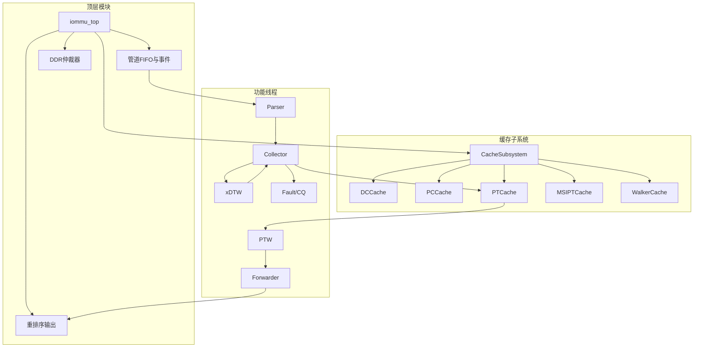
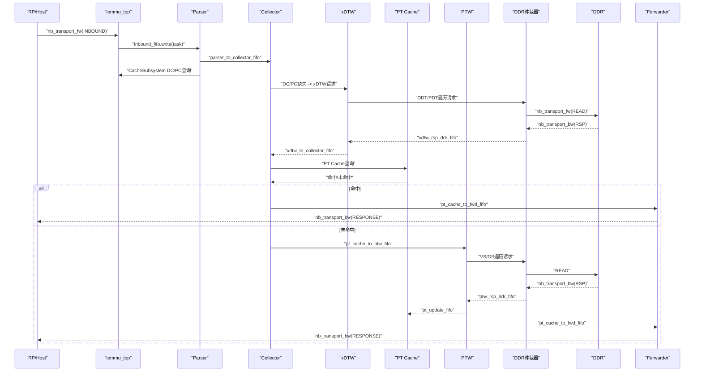
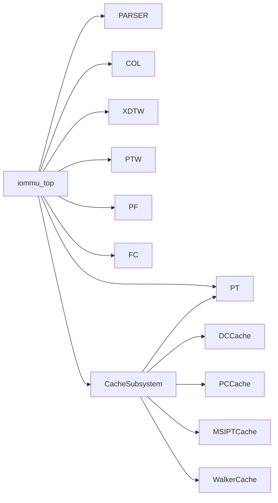

# 核心架构

<cite>
**本文档引用的文件**
- [iommu_top.cc](file://iommu/iommu_top.cc)
- [iommu_top.hh](file://iommu/iommu_top.hh)
- [cache_subsystem.h](file://iommu/cache_src/subsystem/cache_subsystem.h)
- [pt_cache.h](file://iommu/cache_src/cache/pt_cache.h)
- [dc_cache.h](file://iommu/cache_src/cache/dc_cache.h)
- [pc_cache.h](file://iommu/cache_src/cache/pc_cache.h)
- [walker_cache.h](file://iommu/cache_src/cache/walker_cache.h)
- [iommu_task.hh](file://iommu/include/iommu_task.hh)
- [iommu_req_rsp.hh](file://iommu/include/iommu_req_rsp.hh)
- [iommu_perf_parser.cc](file://iommu/iommu_perf_model/iommu_perf_parser.cc)
- [iommu_perf_collector.cc](file://iommu/iommu_perf_model/iommu_perf_collector.cc)
- [iommu_perf_xdtw.cc](file://iommu/iommu_perf_model/iommu_perf_xdtw.cc)
- [iommu_perf_ptw.cc](file://iommu/iommu_perf_model/iommu_perf_ptw.cc)
- [iommu_perf_forwarder_fault_cq.cc](file://iommu/iommu_perf_model/iommu_perf_forwarder_fault_cq.cc)
</cite>

## 目录
1. [简介](#简介)
2. [项目结构](#项目结构)
3. [核心组件](#核心组件)
4. [架构总览](#架构总览)
5. [详细组件分析](#详细组件分析)
6. [依赖分析](#依赖分析)
7. [性能考虑](#性能考虑)
8. [故障排查指南](#故障排查指南)
9. [结论](#结论)

## 简介
本文件面向RISC-V IOMMU SystemC模型，聚焦顶层模块的设计理念与架构模式，阐述模块化、分层与事件驱动机制；详解Parser、Collector、CacheSubsystem、PT Cache、PTW、xDTW等关键模块的职责与交互；给出系统数据流与控制流图示；说明SystemC TLM协议的使用方式与模块间通信机制；并总结架构决策的技术考量与设计权衡。

## 项目结构
该IOMMU模型采用“顶层模块 + 分层子系统”的组织方式：
- 顶层模块 iommu_top：负责系统初始化、TLM端口绑定、全局FIFO与事件、DDR仲裁、重排序输出、统计与可观测性。
- CacheSubsystem：统一管理DC/PC/PT/MSIPT/Walker缓存子系统，提供请求/响应/更新/失效的解耦通道。
- 功能线程：Parser、Collector、xDTW、PTW、Forwarder、Fault/CQ等，分别承担解析、路由、设备/进程上下文定位、页表遍历、转发与故障处理。
- 数据结构：iommu_task_t承载贯穿全链路的任务状态机与上下文，walk_context_t描述遍历过程。

图表来源
- [iommu_top.hh:44-496](file://iommu/iommu_top.hh#L44-L496)
- [cache_subsystem.h:21-184](file://iommu/cache_src/subsystem/cache_subsystem.h#L21-L184)

章节来源
- [iommu_top.hh:44-496](file://iommu/iommu_top.hh#L44-L496)
- [cache_subsystem.h:21-184](file://iommu/cache_src/subsystem/cache_subsystem.h#L21-L184)

## 核心组件
- 顶层模块 iommu_top
  - 初始化与能力声明、寄存器访问b_transport回调、AT nb_transport回调、DDR响应处理、全局统计与可观测性。
  - 维护大量sc_fifo作为管道缓冲，以及outstanding计数与事件，保障背压与吞吐。
- CacheSubsystem
  - 面向外部提供请求/响应/更新/失效的独立FIFO通道，内部封装各缓存实例与失效流水线。
  - 提供Walker Cache统一调度线程，避免互锁死锁。
- Parser/Collector/xDTW/PTW/Forwarder/Fault/CQ
  - Parser：解析输入事务、分类与属性抽取、基础模式判断、分流至Collector与缓存查询。
  - Collector：汇聚DC/PC缓存结果，做策略决策，必要时发起xDTW遍历，再进入PT Cache查询或直接转发。
  - xDTW：设备/进程上下文定位，生成DC/PC上下文并回填。
  - PT Cache：页表缓存，支持去重与预取，加速PTW路径。
  - PTW：两阶段地址翻译，Walker Cache协同，处理A/D位更新与GS隐式/显式遍历。
  - Forwarder：根据路径与标志将结果回传给上游或IMSIC/DDR。
  - Fault/CQ：故障记录与命令队列处理。

章节来源
- [iommu_top.cc:19-780](file://iommu/iommu_top.cc#L19-L780)
- [cache_subsystem.h:21-184](file://iommu/cache_src/subsystem/cache_subsystem.h#L21-L184)
- [iommu_perf_parser.cc:9-123](file://iommu/iommu_perf_model/iommu_perf_parser.cc#L9-L123)
- [iommu_perf_collector.cc:14-457](file://iommu/iommu_perf_model/iommu_perf_collector.cc#L14-L457)
- [iommu_perf_xdtw.cc:12-370](file://iommu/iommu_perf_model/iommu_perf_xdtw.cc#L12-L370)
- [iommu_perf_ptw.cc:41-800](file://iommu/iommu_perf_model/iommu_perf_ptw.cc#L41-L800)
- [iommu_perf_forwarder_fault_cq.cc:13-179](file://iommu/iommu_perf_model/iommu_perf_forwarder_fault_cq.cc#L13-L179)

## 架构总览
系统采用事件驱动与流水线并行的分层架构：
- 输入侧通过AT nb_transport_fw进入，Parser线程消费inbound_fifo，同时注册到重排序缓冲并申请全局outstanding槽。
- Parser将任务分流至Collector与CacheSubsystem的DC/PC查询通道。
- Collector汇聚DC/PC结果，依据策略决定是否需要xDTW遍历，或直接进入PT Cache查询。
- PT Cache命中则直接进入Forwarder；未命中则进入PTW，PTW通过DDR仲裁器访问内存，Walker Cache参与中间结果缓存。
- Forwarder将PA写回payload并通过nb_transport_bw回传给上游；Fault/CQ负责故障记录与响应生成。

图表来源
- [iommu_top.cc:137-274](file://iommu/iommu_top.cc#L137-L274)
- [iommu_perf_parser.cc:9-123](file://iommu/iommu_perf_model/iommu_perf_parser.cc#L9-L123)
- [iommu_perf_collector.cc:14-275](file://iommu/iommu_perf_model/iommu_perf_collector.cc#L14-L275)
- [iommu_perf_xdtw.cc:12-370](file://iommu/iommu_perf_model/iommu_perf_xdtw.cc#L12-L370)
- [iommu_perf_ptw.cc:41-800](file://iommu/iommu_perf_model/iommu_perf_ptw.cc#L41-L800)
- [iommu_perf_forwarder_fault_cq.cc:13-114](file://iommu/iommu_perf_model/iommu_perf_forwarder_fault_cq.cc#L13-L114)

## 详细组件分析

### 顶层模块 iommu_top
- 设计理念
  - 以事件驱动与背压控制为核心，通过大量sc_fifo实现模块解耦；通过outstanding计数与事件实现流量整形。
  - 采用SystemC TLM 2.0 nb_transport接口实现高性能数据路径，b_transport仅保留寄存器访问等非性能路径。
- 关键职责
  - 初始化与能力声明、寄存器访问回调、AT回调、DDR响应处理、全局统计与可观测性。
  - 维护Parser/Collector/xDTW/PTW/Forwarder/Fault/CQ等线程生命周期与同步事件。
- 通信机制
  - AT端口：nb_transport_fw用于高性能请求进入，nb_transport_bw用于DDR响应回传。
  - FIFO：大量命名FIFO承载跨线程/跨模块的数据交换。
  - 事件：outstanding完成事件、重排序完成事件、各模块完成事件等。

章节来源
- [iommu_top.cc:19-780](file://iommu/iommu_top.cc#L19-L780)
- [iommu_top.hh:44-496](file://iommu/iommu_top.hh#L44-L496)

### CacheSubsystem
- 设计理念
  - 将DC/PC/PT/MSIPT/Walker缓存抽象为统一子系统，对外暴露请求/响应/更新/失效的独立FIFO，避免串行瓶颈。
  - Walker Cache采用统一调度线程，按lookup/update/invalidation轮询，降低死锁风险。
- 关键职责
  - 为上层提供CacheMessage请求/响应通道，内部维护各缓存实例与失效流水线。
  - 提供去重与预取支持（PT Cache），并统计PT调度空闲时间。
- 通信机制
  - 外部通过dc_request_fifo/pc_request_fifo/pt_request_fifo等进入，响应通过dc_response_fifo/pc_response_fifo/pt_hit/miss_response_fifo等返回。
  - 更新与失效通过各自update/invalidation FIFO进入内部流水线。

章节来源
- [cache_subsystem.h:21-184](file://iommu/cache_src/subsystem/cache_subsystem.h#L21-L184)
- [pt_cache.h:8-85](file://iommu/cache_src/cache/pt_cache.h#L8-L85)
- [dc_cache.h:8-36](file://iommu/cache_src/cache/dc_cache.h#L8-L36)
- [pc_cache.h:8-38](file://iommu/cache_src/cache/pc_cache.h#L8-L38)
- [walker_cache.h:15-141](file://iommu/cache_src/cache/walker_cache.h#L15-L141)

### Parser（解析器）
- 设计理念
  - 快速分类与属性抽取，避免串行延时，瓶颈由并发outstanding与下游模块决定。
- 关键职责
  - 模式判定（Off/Bare）、DDI提取、设备ID宽度校验、分流至Collector与CacheSubsystem查询。
  - 在Bare模式下直接生成转发结果，在Off模式下直接进入故障路径。
- 数据流
  - 从inbound_fifo读取任务，写入parser_to_collector_fifo与CacheSubsystem DC/PC查询FIFO。

章节来源
- [iommu_perf_parser.cc:9-123](file://iommu/iommu_perf_model/iommu_perf_parser.cc#L9-L123)
- [iommu_task.hh:20-48](file://iommu/include/iommu_task.hh#L20-L48)

### Collector（收集器）
- 设计理念
  - 并发汇聚DC/PC缓存结果，基于策略进行路由决策，必要时启动xDTW遍历。
- 关键职责
  - DC/PC命中路径：EN_ATS/PDTV/ENS等检查，配置iosatp/iohgatp，进入PT Cache查询。
  - DC/PC缺失路径：启动xDTW遍历，完成后回填DC/PC并继续策略流程。
- 数据流
  - 从parser_to_collector_fifo与cache_sub.*_response_fifo汇聚，写入collector_to_xdtw_*_fifo或pt_cache_to_ptw_fifo。

章节来源
- [iommu_perf_collector.cc:14-457](file://iommu/iommu_perf_model/iommu_perf_collector.cc#L14-L457)
- [iommu_task.hh:82-182](file://iommu/include/iommu_task.hh#L82-L182)

### xDTW（设备/进程上下文定位）
- 设计理念
  - DDT/PDT两级目录树遍历，支持隐式/显式G-stage转换，严格的状态机推进。
- 关键职责
  - 初始化遍历上下文，发送首块读请求，逐级解析目录项，最终读取DC/PC并校验配置。
- 数据流
  - 从collector_to_xdtw_dc_fifo或collector_to_xdtw_pc_fifo读取任务，写入xdtw_req_ddr_fifo，响应写入xdtw_rsp_ddr_fifo，最终回写collector_to_xdtw_to_collector_fifo。

章节来源
- [iommu_perf_xdtw.cc:12-370](file://iommu/iommu_perf_model/iommu_perf_xdtw.cc#L12-L370)
- [iommu_task.hh:82-182](file://iommu/include/iommu_task.hh#L82-L182)

### PT Cache（页表缓存）
- 设计理念
  - 高速页表缓存，支持去重与预取，减少PTW访问频率；提供占位CL与批量更新机制。
- 关键职责
  - 查询页表项，命中则直接生成PA；未命中则进入PTW；支持按VMA/GVMA失效。
- 数据流
  - 从collector_to_pt_cache_query_fifo读取任务，写入pt_cache_to_ptw_fifo（未命中）或pt_cache_to_fwd_fifo（命中）。

章节来源
- [pt_cache.h:8-85](file://iommu/cache_src/cache/pt_cache.h#L8-L85)
- [iommu_perf_collector.cc:14-275](file://iommu/iommu_perf_model/iommu_perf_collector.cc#L14-L275)

### PTW（页表遍历）
- 设计理念
  - 两阶段地址翻译：VS-stage与G-stage，支持Walker Cache中间结果缓存、A/D位硬件更新、GS隐式/显式转换。
- 关键职责
  - 初始化VS-stage遍历，必要时触发GS隐式/显式遍历；处理合并Burst读与预取；更新Walker Cache。
- 数据流
  - 从pt_cache_to_ptw_fifo读取任务，写入ptw_req_ddr_fifo，响应写入ptw_rsp_ddr_fifo，最终写入ptw_to_pt_cache_fifo与pt_cache_to_fwd_fifo。

章节来源
- [iommu_perf_ptw.cc:41-800](file://iommu/iommu_perf_model/iommu_perf_ptw.cc#L41-L800)
- [walker_cache.h:15-141](file://iommu/cache_src/cache/walker_cache.h#L15-L141)

### Forwarder/Fault/CQ
- 设计理念
  - Forwarder负责将PA写回payload并回传；Fault/CQ负责故障记录与响应生成；三者共享重排序缓冲，确保写请求保序。
- 关键职责
  - Forwarder：PT路径与MSIPT路径分别路由到不同端口；MSI路径根据标志选择IMSIC或DMA路径。
  - Fault/CQ：根据cause分类生成响应状态，记录故障并处理命令队列。
- 数据流
  - PT路径：pt_cache_to_fwd_fifo -> Forwarder -> nb_transport_bw
  - MSIPT路径：msipt_cache_to_fwd_fifo -> Forwarder -> nb_transport_bw 或 axi_stream_socket
  - 故障路径：collector_to_fault_fifo -> Fault/CQ -> nb_transport_bw

章节来源
- [iommu_perf_forwarder_fault_cq.cc:13-179](file://iommu/iommu_perf_model/iommu_perf_forwarder_fault_cq.cc#L13-L179)
- [iommu_perf_collector.cc:121-275](file://iommu/iommu_perf_model/iommu_perf_collector.cc#L121-L275)

## 依赖分析
- 模块耦合
  - iommu_top对各线程具有强耦合（注册、事件、统计），但通过FIFO与事件实现逻辑解耦。
  - CacheSubsystem对上层屏蔽内部实现细节，仅暴露统一的请求/响应通道。
- 外部依赖
  - SystemC与TLM库；JSON配置文件；DDR仲裁器与物理内存接口。
- 潜在循环依赖
  - 通过FIFO与事件避免直接循环调用；Walker Cache统一调度线程避免互锁。

图表来源
- [iommu_top.hh:305-496](file://iommu/iommu_top.hh#L305-L496)
- [cache_subsystem.h:21-184](file://iommu/cache_src/subsystem/cache_subsystem.h#L21-L184)

章节来源
- [iommu_top.hh:305-496](file://iommu/iommu_top.hh#L305-L496)
- [cache_subsystem.h:21-184](file://iommu/cache_src/subsystem/cache_subsystem.h#L21-L184)

## 性能考虑
- 流水线与并行
  - Parser/Collector/xDTW/PTW/Forwarder均采用独立线程，配合FIFO实现并行处理。
  - PEQ用于PTW请求/响应的非阻塞延迟建模，提升并发度。
- 背压与限流
  - 全局outstanding与各模块outstanding上限控制内存带宽与并发度。
  - DDR仲裁器按优先级与轮询策略调度，避免饥饿。
- 缓存优化
  - CacheSubsystem将查询/更新/失效通道分离，减少串行瓶颈。
  - Walker Cache中间结果缓存与PT Cache去重/预取显著降低PTW访问次数。
- 统计与可观测性
  - 提供详细的IOPS、DDR访问统计、outstanding峰值、吞吐效率等指标。

章节来源
- [iommu_top.cc:279-404](file://iommu/iommu_top.cc#L279-L404)
- [iommu_perf_ptw.cc:41-800](file://iommu/iommu_perf_model/iommu_perf_ptw.cc#L41-L800)
- [cache_subsystem.h:83-184](file://iommu/cache_src/subsystem/cache_subsystem.h#L83-L184)

## 故障排查指南
- 常见故障类型
  - Off/Bare模式违规、DDI宽度超限、EN_ATS/ENS配置不当、PTE合法性与权限检查失败、A/D位更新失败、Misaligned superpage等。
- 定位方法
  - 查看Parser/Collector/PTW/Fault线程打印与统计，结合walk_ctx.ddr_log记录定位具体访问点。
  - 检查outstanding计数与事件是否正确触发，确认背压是否导致延迟。
- 处理建议
  - 调整配置参数（如outstanding上限、预取深度）以平衡吞吐与资源占用。
  - 开启/关闭Walker Cache与PT Cache去重以评估性能收益。

章节来源
- [iommu_perf_parser.cc:34-121](file://iommu/iommu_perf_model/iommu_perf_parser.cc#L34-L121)
- [iommu_perf_collector.cc:111-275](file://iommu/iommu_perf_model/iommu_perf_collector.cc#L111-L275)
- [iommu_perf_ptw.cc:10-800](file://iommu/iommu_perf_model/iommu_perf_ptw.cc#L10-L800)
- [iommu_perf_forwarder_fault_cq.cc:121-179](file://iommu/iommu_perf_model/iommu_perf_forwarder_fault_cq.cc#L121-L179)

## 结论
该IOMMU SystemC模型通过事件驱动与分层架构实现了高并发、可扩展的地址翻译流水线。顶层模块以FIFO与事件为核心实现模块解耦，CacheSubsystem提供统一缓存抽象，Parser/Collector/xDTW/PTW/Forwarder/Fault/CQ各司其职，配合DDR仲裁与统计机制，形成完整的性能与可靠性保障体系。架构决策在并行度、缓存命中率、背压控制与可观测性之间取得良好平衡，适合进一步扩展与优化。