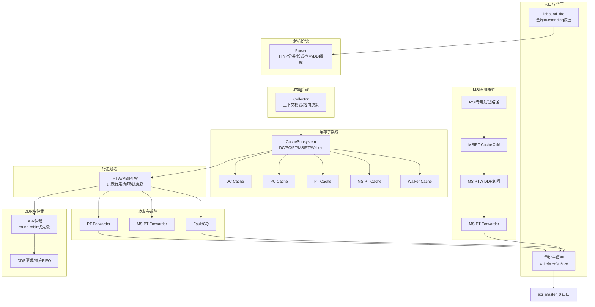
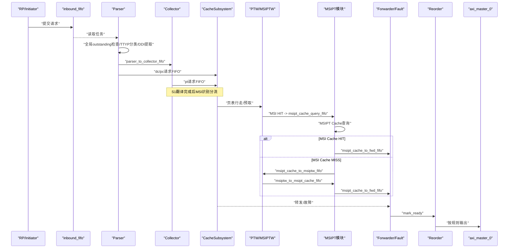
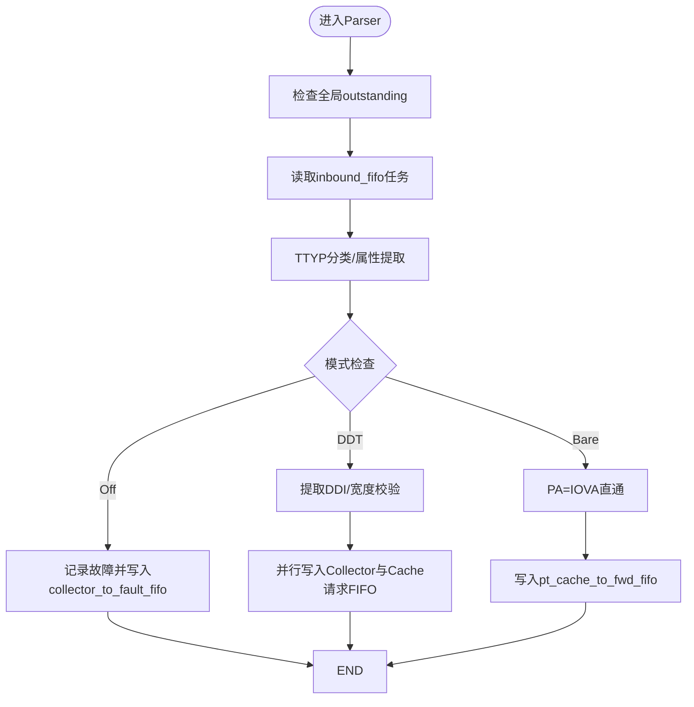
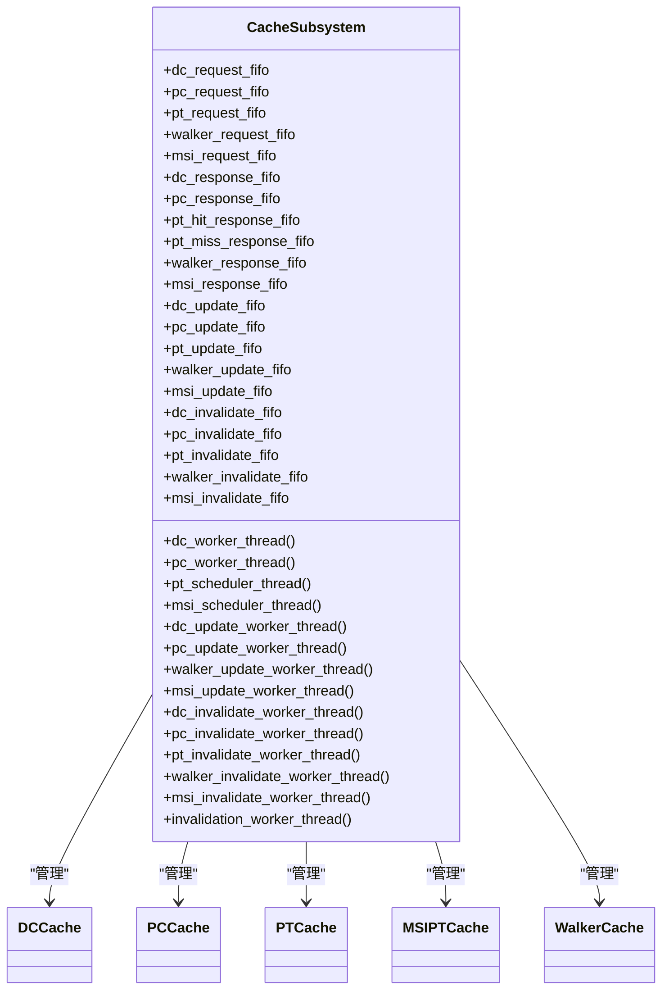
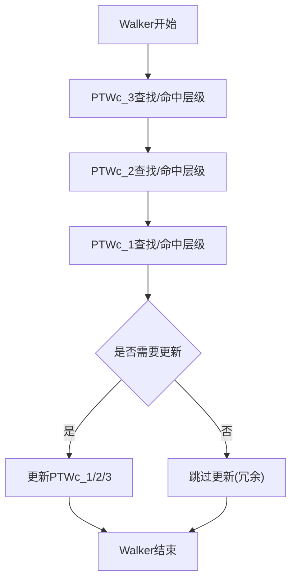
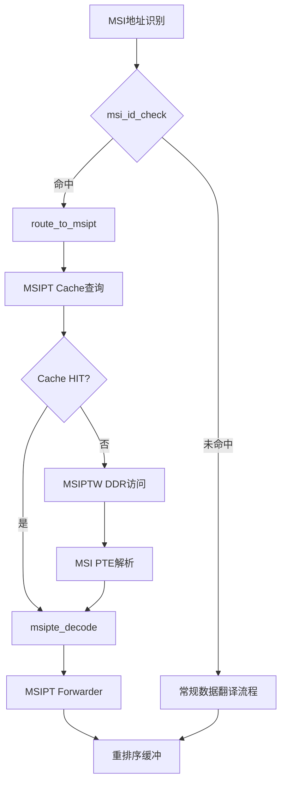
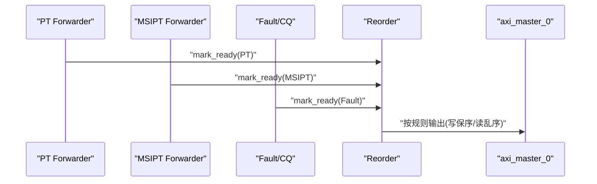
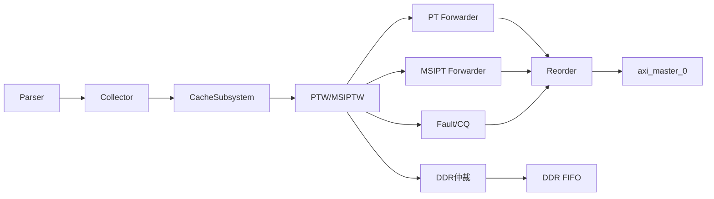

# 流水线架构

<cite>
**本文档引用的文件**
- [iommu_perf_msipt_cache.cc](file://iommu/iommu_perf_model/iommu_perf_msipt_cache.cc)
- [iommu_msi_trans.cc](file://iommu/iommu_fun_model/iommu_msi_trans.cc)
- [iommu_top.cc](file://iommu/iommu_top.cc)
- [iommu_top.hh](file://iommu/iommu_top.hh)
- [cache_subsystem.h](file://iommu/cache_src/subsystem/cache_subsystem.h)
- [cache_subsystem.cpp](file://iommu/cache_src/subsystem/cache_subsystem.cpp)
- [msipt_cache.h](file://iommu/cache_src/cache/msipt_cache.h)
- [msipt_cache.cpp](file://iommu/cache_src/cache/msipt_cache.cpp)
- [types.h](file://iommu/cache_src/common/types.h)
- [dc_cache.h](file://iommu/cache_src/cache/dc_cache.h)
- [walker_cache.h](file://iommu/cache_src/cache/walker_cache.h)
- [iommu_task.hh](file://iommu/include/iommu_task.hh)
- [iommu_dedup_params.hh](file://iommu/include/iommu_dedup_params.hh)
- [iommu_perf_forwarder_fault_cq.cc](file://iommu/iommu_perf_model/iommu_perf_forwarder_fault_cq.cc)
- [iommu_perf_reorder.cc](file://iommu/iommu_perf_model/iommu_perf_reorder.cc)
- [iommu_perf_ptw.cc](file://iommu/iommu_perf_model/iommu_perf_ptw.cc)
- [PTW_RESPONSE_ANALYSIS_20260609.md](file://PTW_RESPONSE_ANALYSIS_20260609.md)
- [PTW_MONITOR_ANALYSIS_20260609.md](file://PTW_MONITOR_ANALYSIS_20260609.md)
</cite>

## 更新摘要
**变更内容**
- 新增MSI专用处理路径章节，详细说明S1翻译完成后分流到MSIPT模块的机制
- 更新架构图和数据流图以反映MSI专用通路
- 增强Cache子系统分析，包含MSIPT Cache集成
- 完善Forwarder与Fault/CQ部分，增加MSIPT Forwarder说明
- 更新性能考量和故障排查指南，涵盖MSI相关优化和问题

## 目录
1. [简介](#简介)
2. [项目结构](#项目结构)
3. [核心组件](#核心组件)
4. [架构总览](#架构总览)
5. [详细组件分析](#详细组件分析)
6. [依赖关系分析](#依赖关系分析)
7. [性能考量](#性能考量)
8. [故障排查指南](#故障排查指南)
9. [结论](#结论)
10. [附录](#附录)

## 简介
本文件面向IOMMU多级流水线架构，系统性阐述Parser、Collector、Cache、Walker、Forwarder等阶段的功能划分、数据流转与并行处理机制。重点覆盖：
- 多级流水线设计原理与实现机制
- MSI专用处理路径与数据翻译流程的兼容性设计
- 并行处理能力、背压控制与缓冲区管理策略
- sc_fifo队列设计目的、容量配置与阶段间同步
- 典型请求在流水线中的处理路径与时序图
- 性能优化策略与瓶颈分析方法

## 项目结构
IOMMU性能模型采用SystemC模块化设计，以"入口—解析—收集—缓存—查询—行走—转发/故障—重排序—出口"的多阶段流水线组织。**新增MSI专用处理路径**后，架构支持两种并行的翻译流程：
- 常规数据翻译路径：PT Cache → Walker → PTW → Forwarder
- **MSI专用路径**：MSIPT Cache → MSIPTW → MSIPT Forwarder

关键模块与职责如下：
- 入口与背压：inbound_fifo、全局outstanding反压、重排序缓冲
- 解析阶段：Parser负责分类、模式检查、设备ID提取、写入Collector与Cache请求队列
- 收集阶段：Collector进行上下文校验与路由决策
- 缓存子系统：DC/PC/PT/**MSIPT**/Walker多级缓存，独立FIFO解耦，轮询调度
- Walker：PTW各级页表行走，Walker Cache中间结果缓存
- **MSI专用模块**：MSIPT Cache查询、MSIPTW DDR访问、MSIPT Forwarder响应生成
- 转发与故障：Forwarder直通与MSI路径，Fault记录与命令队列处理
- DDR仲裁与背压：round-robin优先级、全局outstanding与AXI端口并发控制

**图表来源**
- [iommu_perf_parser.cc:9-122](file://iommu/iommu_perf_model/iommu_perf_parser.cc#L9-L122)
- [iommu_top.cc:137-201](file://iommu/iommu_top.cc#L137-L201)
- [cache_subsystem.h:21-189](file://iommu/cache_src/subsystem/cache_subsystem.h#L21-L189)
- [iommu_perf_msipt_cache.cc:139-189](file://iommu/iommu_perf_model/iommu_perf_msipt_cache.cc#L139-L189)
- [iommu_perf_forwarder_fault_cq.cc:13-114](file://iommu/iommu_perf_model/iommu_perf_forwarder_fault_cq.cc#L13-L114)
- [iommu_perf_reorder.cc:91-152](file://iommu/iommu_perf_model/iommu_perf_reorder.cc#L91-L152)

**章节来源**
- [iommu_top.cc:137-201](file://iommu/iommu_top.cc#L137-L201)
- [iommu_top.hh:84-411](file://iommu/iommu_top.hh#L84-L411)
- [cache_subsystem.h:21-189](file://iommu/cache_src/subsystem/cache_subsystem.h#L21-L189)

## 核心组件
- Parser线程：负责全局outstanding反压、任务分类、模式检查、设备ID提取，并向Collector与Cache子系统发出查询请求。
- Collector线程：进行上下文合法性检查、路由决策、预取使能与PT Cache批量更新准备。
- Cache子系统：对外暴露独立请求/响应FIFO，内部按lookup/update/invalidation轮询调度，避免互锁。
- Walker Cache：三层子表（PTWc_1/2/3），支持中间结果缓存与更新统计。
- **MSIPT Cache**：专用缓存存储MSI PTE映射，支持Flat和MRIF两种模式。
- **MSIPTW**：MSI页表行走器，独立于PTW处理MSI地址翻译。
- Forwarder/Fault/CQ：分别处理PT/MSI路径响应生成与故障记录、命令队列处理。
- DDR仲裁：round-robin优先级控制XDTW/PTW/**MSIPTW**，配合全局outstanding与AXI端口并发限制。

**章节来源**
- [iommu_perf_parser.cc:9-122](file://iommu/iommu_perf_model/iommu_perf_parser.cc#L9-L122)
- [cache_subsystem.h:21-189](file://iommu/cache_src/subsystem/cache_subsystem.h#L21-L189)
- [walker_cache.h:11-104](file://iommu/cache_src/cache/walker_cache.h#L11-L104)
- [msipt_cache.h:8-31](file://iommu/cache_src/cache/msipt_cache.h#L8-L31)
- [iommu_perf_msipt_cache.cc:139-358](file://iommu/iommu_perf_model/iommu_perf_msipt_cache.cc#L139-L358)
- [iommu_perf_forwarder_fault_cq.cc:13-114](file://iommu/iommu_perf_model/iommu_perf_forwarder_fault_cq.cc#L13-L114)
- [iommu_top.cc:279-404](file://iommu/iommu_top.cc#L279-L404)

## 架构总览
IOMMU流水线以SystemC sc_fifo为数据通道，通过严格的阶段边界与背压控制实现高并行度与稳定性。**新增MSI专用处理路径**后，系统支持两种并行的翻译流程，保持与现有数据翻译流程的兼容性。关键特性：
- 阶段解耦：Parser/Collector/Cache/Walker/MSIPT/Forwarder/Fault各自独立，通过FIFO连接
- 并行化：Cache子系统内部轮询调度，避免串行化瓶颈；DDR仲裁round-robin保障公平
- 背压：全局outstanding、AXI端口并发计数、FIFO可用空间共同构成多层反压
- 同步：重排序缓冲确保写请求保序，读请求乱序输出；DDR响应通过FIFO回注
- **MSI分流**：S1=Bare时直接识别MSI地址，非Bare时在PTW完成后识别并分流

**图表来源**
- [iommu_perf_parser.cc:16-121](file://iommu/iommu_perf_model/iommu_perf_parser.cc#L16-L121)
- [iommu_top.cc:437-475](file://iommu/iommu_top.cc#L437-L475)
- [cache_subsystem.h:34-66](file://iommu/cache_src/subsystem/cache_subsystem.h#L34-L66)
- [iommu_perf_msipt_cache.cc:139-189](file://iommu/iommu_perf_model/iommu_perf_msipt_cache.cc#L139-L189)
- [iommu_perf_forwarder_fault_cq.cc:13-53](file://iommu/iommu_perf_model/iommu_perf_forwarder_fault_cq.cc#L13-L53)
- [iommu_perf_reorder.cc:91-152](file://iommu/iommu_perf_model/iommu_perf_reorder.cc#L91-L152)

## 详细组件分析

### Parser阶段
- 功能要点
  - 全局outstanding反压：在进入解析前检查并等待
  - TTYP分类与访问属性提取：依据请求类型与特权级别确定事务类别
  - 模式检查：Off/Bare/DDT宽度校验，非法直接进入故障路径
  - 设备ID提取：根据寄存器配置提取DDI字段
  - 并行写入：同时向Collector与Cache子系统发出查询请求
- 并行与背压
  - 解析阶段本身无串行延时，瓶颈由并发outstanding与下游模块决定
  - 通过全局outstanding上限与FIFO可用空间实现背压
- 关键FIFO
  - parser_to_collector_fifo、dc_request_fifo、pc_request_fifo

**图表来源**
- [iommu_perf_parser.cc:9-122](file://iommu/iommu_perf_model/iommu_perf_parser.cc#L9-L122)
- [iommu_perf_model.hh:9-55](file://iommu/iommu_perf_model/iommu_perf_model.hh#L9-L55)

**章节来源**
- [iommu_perf_parser.cc:9-122](file://iommu/iommu_perf_model/iommu_perf_parser.cc#L9-L122)
- [iommu_perf_model.hh:9-55](file://iommu/iommu_perf_model/iommu_perf_model.hh#L9-L55)

### Collector阶段
- 功能要点
  - 上下文合法性检查：进程ID宽度、ATS/T2GPA组合等
  - 路由决策：根据上下文与预取配置，决定是否进入PT Cache或直接转发
  - 预取使能：基于配置参数启用/禁用预取与预取深度
  - PT Cache批量更新准备：保存原始任务，便于响应相关性匹配
- 关键路径
  - 直通路径：Bare/Translated+T2GPA=0等场景
  - PT Cache路径：进入PT Cache查询与预取

**章节来源**
- [iommu_top.cc:437-475](file://iommu/iommu_top.cc#L437-L475)
- [iommu_perf_collector.cc:141-169](file://iommu/iommu_perf_model/iommu_perf_collector.cc#L141-L169)

### Cache子系统
- 设计原则
  - 外部接口：每个缓存独立的请求/响应FIFO，避免共用FIFO造成串行化
  - 内部调度：轮询调度lookup→update→invalidate，避免互锁死锁
  - 级联失效：DC/PC失效后产生关联失效消息，推送至PT/Walker/MSIPT失效通道
- 组件关系
  - DCCache/PCache/PTCache/**MSIPTCache**/WalkerCache五类缓存
  - Walker Cache三层子表（PTWc_1/2/3），支持中间结果缓存与更新统计
  - **MSIPT Cache**：存储MSI PTE映射，支持device_id + msi_index索引
- 关键FIFO
  - dc_request_fifo/pc_request_fifo/pt_request_fifo/walker_request_fifo/**msi_request_fifo**
  - 对应响应FIFO与更新/失效通道

**图表来源**
- [cache_subsystem.h:21-189](file://iommu/cache_src/subsystem/cache_subsystem.h#L21-L189)
- [dc_cache.h:8-31](file://iommu/cache_src/cache/dc_cache.h#L8-L31)
- [walker_cache.h:11-104](file://iommu/cache_src/cache/walker_cache.h#L11-L104)
- [msipt_cache.h:8-31](file://iommu/cache_src/cache/msipt_cache.h#L8-L31)

**章节来源**
- [cache_subsystem.h:21-189](file://iommu/cache_src/subsystem/cache_subsystem.h#L21-L189)
- [types.h:78-106](file://iommu/cache_src/common/types.h#L78-L106)

### Walker与PT Cache
- Walker Cache
  - 三层子表：PTWc_1（直接映射）、PTWc_2（2路组相联）、PTWc_3（4路组相联）
  - 中间结果缓存：walk过程中各级PPN缓存，最终一次性更新
  - 更新统计：PTWC_1_2_3/2_3/3与NONE（冗余更新避免）计数
- PT Cache与去重/预取
  - 占位CL（Placeholder）与Buffer链表：支持主任务占位与预取占位
  - 去重Buffer容量与反压：满时阻塞等待，避免丢弃
  - 预取深度：D=0关闭，D>0启用，支持Burst合并读取
- PTW响应与监控
  - 响应顺序：当前实现存在顺序问题，建议重构为FIFO机制
  - 监控与批更新：等待Burst完成后统一通知Monitor，批量更新PT Cache

**图表来源**
- [walker_cache.h:11-104](file://iommu/cache_src/cache/walker_cache.h#L11-L104)
- [cache_subsystem.cpp:698-723](file://iommu/cache_src/subsystem/cache_subsystem.cpp#L698-L723)

**章节来源**
- [walker_cache.h:11-104](file://iommu/cache_src/cache/walker_cache.h#L11-L104)
- [cache_subsystem.cpp:698-723](file://iommu/cache_src/subsystem/cache_subsystem.cpp#L698-L723)
- [PTW_RESPONSE_ANALYSIS_20260609.md:235-266](file://PTW_RESPONSE_ANALYSIS_20260609.md#L235-L266)
- [PTW_MONITOR_ANALYSIS_20260609.md:441-459](file://PTW_MONITOR_ANALYSIS_20260609.md#L441-L459)

### MSI专用处理路径
**新增** MSI专用处理路径实现了与现有数据翻译流程完全兼容的MSI地址翻译机制。该路径在S1翻译完成后识别MSI地址，并分流到独立的MSIPT模块处理。

- **MSI地址识别**：`msi_id_check()`函数检查GPA是否命中虚拟interrupt file页，设置task->is_msi标志
- **分流决策**：`configure_and_route()`中，S1=Bare时直接识别MSI地址，非Bare时在PTW完成后识别
- **MSIPT Cache查询**：`msipt_cache_query_thread()`处理MSI PTE缓存查询，HIT直接解码，MISS触发MSIPTW
- **MSIPTW DDR访问**：`msiptw_req_thread()`计算MSI PTE地址，发起16字节DDR读请求
- **MSI PTE解码**：`msipte_decode()`解析16字节MSI PTE，支持Flat(M=3)和MRIF(M=1)两种模式
- **MSIPT Forwarder**：将MSI翻译结果发送到重排序缓冲，与普通PT Forwarder共享出口

**图表来源**
- [iommu_top.cc:531-554](file://iommu/iommu_top.cc#L531-L554)
- [iommu_perf_msipt_cache.cc:22-52](file://iommu/iommu_perf_model/iommu_perf_msipt_cache.cc#L22-L52)
- [iommu_perf_msipt_cache.cc:139-189](file://iommu/iommu_perf_model/iommu_perf_msipt_cache.cc#L139-L189)
- [iommu_perf_msipt_cache.cc:227-284](file://iommu/iommu_perf_model/iommu_perf_msipt_cache.cc#L227-L284)
- [iommu_perf_msipt_cache.cc:291-358](file://iommu/iommu_perf_model/iommu_perf_msipt_cache.cc#L291-L358)

**章节来源**
- [iommu_top.cc:531-554](file://iommu/iommu_top.cc#L531-L554)
- [iommu_perf_msipt_cache.cc:22-358](file://iommu/iommu_perf_model/iommu_perf_msipt_cache.cc#L22-L358)
- [iommu_msi_trans.cc:20-294](file://iommu/iommu_fun_model/iommu_msi_trans.cc#L20-L294)

### Forwarder与Fault/CQ
- PT Forwarder：从pt_cache_to_fwd_fifo读取，直接设置PA并交由重排序缓冲
- **MSIPT Forwarder**：根据MSI/MRIF标志路由至IMSIC或DMA路径，与普通PT Forwarder共享重排序缓冲
- Fault/CQ：记录故障、分类响应类型（ATS/非ATS），统一进入重排序缓冲
- 重排序：写请求按task_id保序，读请求乱序输出；出口速率受axi_master_0并发限制

**图表来源**
- [iommu_perf_forwarder_fault_cq.cc:13-114](file://iommu/iommu_perf_model/iommu_perf_forwarder_fault_cq.cc#L13-L114)
- [iommu_perf_reorder.cc:91-152](file://iommu/iommu_perf_model/iommu_perf_reorder.cc#L91-L152)

**章节来源**
- [iommu_perf_forwarder_fault_cq.cc:13-114](file://iommu/iommu_perf_model/iommu_perf_forwarder_fault_cq.cc#L13-L114)
- [iommu_perf_reorder.cc:91-152](file://iommu/iommu_perf_model/iommu_perf_reorder.cc#L91-L152)

### DDR仲裁与背压
- 仲裁策略：控制路径优先，随后round-robin轮询XDTW/PTW/**MSIPTW**
- 全局outstanding：限制pending队列长度，避免内存溢出
- AXI端口并发：master_1（DDR）与master_0（出口）分别计数与反压
- 响应回注：根据source_module路由到对应rsp_ddr_fifo

**章节来源**
- [iommu_top.cc:279-404](file://iommu/iommu_top.cc#L279-L404)

## 依赖关系分析
- Parser依赖：全局outstanding、ttyp分类与DDI提取工具函数
- Collector依赖：上下文合法性检查、路由决策与预取配置
- Cache子系统依赖：独立FIFO接口、轮询调度线程、级联失效机制
- Walker Cache依赖：三层子表、中间结果缓存与更新统计
- **MSIPT模块依赖**：MSI地址识别、MSI PTE解码、MSIPT Cache管理
- Forwarder/Fault依赖：重排序缓冲、响应生成与命令队列处理
- DDR仲裁依赖：全局outstanding、AXI端口并发计数与FIFO可用空间

**图表来源**
- [iommu_perf_parser.cc:16-121](file://iommu/iommu_perf_model/iommu_perf_parser.cc#L16-L121)
- [cache_subsystem.h:34-66](file://iommu/cache_src/subsystem/cache_subsystem.h#L34-L66)
- [iommu_perf_msipt_cache.cc:139-189](file://iommu/iommu_perf_model/iommu_perf_msipt_cache.cc#L139-L189)
- [iommu_perf_forwarder_fault_cq.cc:13-114](file://iommu/iommu_perf_model/iommu_perf_forwarder_fault_cq.cc#L13-L114)
- [iommu_perf_reorder.cc:91-152](file://iommu/iommu_perf_model/iommu_perf_reorder.cc#L91-L152)
- [iommu_top.cc:279-404](file://iommu/iommu_top.cc#L279-L404)

**章节来源**
- [iommu_perf_parser.cc:9-122](file://iommu/iommu_perf_model/iommu_perf_parser.cc#L9-L122)
- [cache_subsystem.h:21-189](file://iommu/cache_src/subsystem/cache_subsystem.h#L21-L189)
- [iommu_perf_msipt_cache.cc:139-358](file://iommu/iommu_perf_model/iommu_perf_msipt_cache.cc#L139-L358)
- [iommu_perf_forwarder_fault_cq.cc:13-114](file://iommu/iommu_perf_model/iommu_perf_forwarder_fault_cq.cc#L13-L114)
- [iommu_perf_reorder.cc:91-152](file://iommu/iommu_perf_model/iommu_perf_reorder.cc#L91-L152)
- [iommu_top.cc:279-404](file://iommu/iommu_top.cc#L279-L404)

## 性能考量
- 并行度优化
  - Cache子系统内部轮询调度，避免串行化瓶颈
  - Parser/Collector/Cache/Walker/**MSIPT**/Forwarder/Fault阶段独立，最大化并行
  - **MSI专用路径**与常规数据翻译路径并行执行，互不干扰
- 背压与缓冲
  - 全局outstanding上限、AXI端口并发计数、FIFO可用空间三重背压
  - 去重Buffer满时阻塞等待，避免丢弃请求
  - **MSIPTW outstanding限制**：MSIPTW_MAX_OUTSTANDING_TASKS防止过多并发
- 预取与批更新
  - 预取深度D可调，Burst合并读取减少DDR访问
  - PT Cache批量更新与Monitor统一通知，降低更新开销
  - **MSI PTE缓存**：Flat模式结果缓存，MRIF模式按规范不缓存
- 响应顺序与吞吐
  - 写保序/读乱序策略平衡吞吐与一致性
  - 控制路径优先的DDR仲裁提升关键路径性能
  - **MSI专用路径**减少常规PTW负载，提升整体吞吐

**章节来源**
- [cache_subsystem.h:108-132](file://iommu/cache_src/subsystem/cache_subsystem.h#L108-L132)
- [iommu_dedup_params.hh:10-43](file://iommu/include/iommu_dedup_params.hh#L10-L43)
- [iommu_perf_msipt_cache.cc:227-284](file://iommu/iommu_perf_model/iommu_perf_msipt_cache.cc#L227-L284)
- [PTW_RESPONSE_ANALYSIS_20260609.md:235-266](file://PTW_RESPONSE_ANALYSIS_20260609.md#L235-L266)
- [PTW_MONITOR_ANALYSIS_20260609.md:441-459](file://PTW_MONITOR_ANALYSIS_20260609.md#L441-L459)

## 故障排查指南
- 常见问题
  - Parser阶段：模式检查失败（Off/Bare/DDT宽度）直接进入故障路径
  - Collector阶段：进程ID超宽、ATS/T2GPA组合非法导致故障
  - **MSI路径**：MSI地址识别失败、MSI PTE无效、MSI PTE配置错误
  - DDR仲裁：outstanding超限导致阻塞，检查全局计数与AXI端口并发
  - PTW响应：当前实现响应顺序无法保证，建议重构为FIFO机制
- 排查步骤
  - 检查全局outstanding与AXI端口并发计数峰值
  - 核对Parser/Collector日志，定位故障原因
  - **关注MSI路径日志**：[MSI_ID]、[MSIPT_CACHE]、[MSIPTW_REQ]、[MSIPTW_RSP]
  - 关注PT Cache去重Buffer占用与阻塞情况
  - 验证预取组pending_tasks计数与Monitor通知时机

**章节来源**
- [iommu_perf_parser.cc:32-99](file://iommu/iommu_perf_model/iommu_perf_parser.cc#L32-L99)
- [iommu_perf_collector.cc:141-169](file://iommu/iommu_perf_model/iommu_perf_collector.cc#L141-L169)
- [iommu_perf_msipt_cache.cc:60-131](file://iommu/iommu_perf_model/iommu_perf_msipt_cache.cc#L60-L131)
- [iommu_top.cc:296-314](file://iommu/iommu_top.cc#L296-L314)
- [PTW_MONITOR_ANALYSIS_20260609.md:441-459](file://PTW_MONITOR_ANALYSIS_20260609.md#L441-L459)

## 结论
IOMMU流水线通过严格的阶段解耦、独立FIFO与轮询调度实现高并行度与稳定性。**新增的MSI专用处理路径**进一步增强了系统的灵活性和性能，通过S1翻译完成后的智能分流，将MSI地址翻译与常规数据翻译分离，保持了与现有数据翻译流程的完全兼容性。Parser/Collector/Cache/Walker/**MSIPT**/Forwarder/Fault各司其职，配合全局outstanding、AXI端口并发与FIFO可用空间形成多层背压。预取与批更新进一步提升吞吐，响应顺序与写保序策略兼顾一致性与性能。建议持续优化PTW响应顺序与Monitor机制，以提升整体稳定性与可观测性。

## 附录
- FIFO容量配置示例（来源于头文件与实现）
  - 入口FIFO：inbound_fifo（由调用方初始化）
  - Parser→Collector：parser_to_collector_fifo
  - Parser→Cache：dc_request_fifo、pc_request_fifo
  - Collector→PT Cache：pt_request_fifo
  - PT Cache↔PTW：pt_cache_to_ptw_fifo、ptw_to_pt_cache_fifo
  - PT Cache→Forwarder：pt_cache_to_fwd_fifo
  - **MSIPT Cache↔MSIPTW**：msipt_cache_to_msiptw_fifo、msiptw_to_msipt_cache_fifo
  - **MSIPT Cache→Forwarder**：msipt_cache_to_fwd_fifo
  - DDR请求/响应FIFO：xdtw_req_ddr_fifo、xdtw_rsp_ddr_fifo、ptw_req_ddr_fifo、ptw_rsp_ddr_fifo、**msiptw_req_ddr_fifo**、**msiptw_rsp_ddr_fifo**、ctrl_path_req_ddr_fifo
- 关键参数
  - 预取深度：DEFAULT_PREFETCH_DEPTH（默认8）
  - 去重Buffer容量：DEDUP_BUFFER_CAPACITY（256）
  - 去重Buffer满时反压：DEDUP_BUFFER_BACKPRESSURE（true）
  - **MSIPTW最大并发**：MSIPTW_MAX_OUTSTANDING_TASKS
- **MSI相关数据结构**
  - MSIPTData：存储MSI PTE映射信息，包括pte、pte_hi、spa、mrif_mode
  - MSIPTTag：MSI PTE缓存索引键，包含device_id和msi_index

**章节来源**
- [iommu_top.hh:84-411](file://iommu/iommu_top.hh#L84-L411)
- [iommu_dedup_params.hh:10-43](file://iommu/include/iommu_dedup_params.hh#L10-L43)
- [iommu_task.hh:92-182](file://iommu/include/iommu_task.hh#L92-L182)
- [types.h:178-184](file://iommu/cache_src/common/types.h#L178-L184)