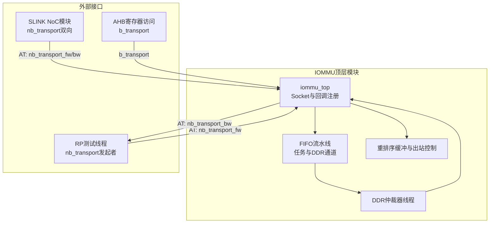
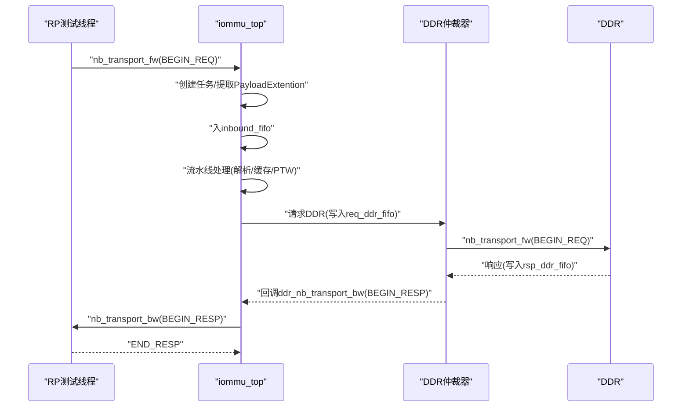
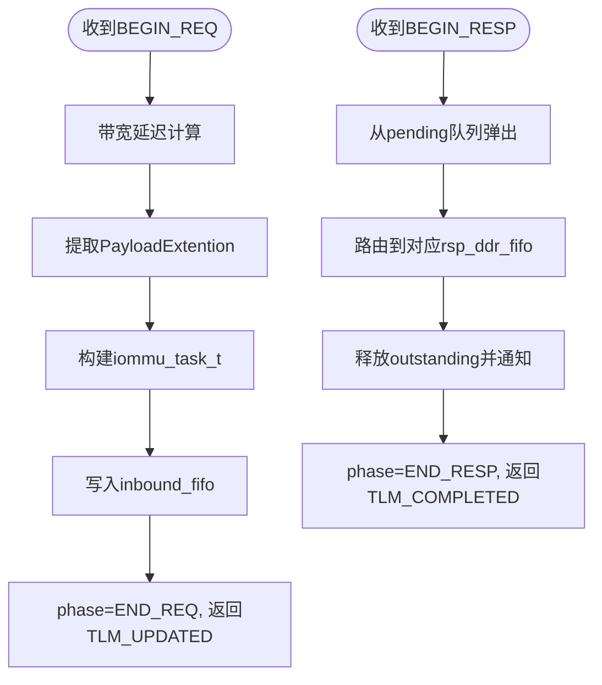
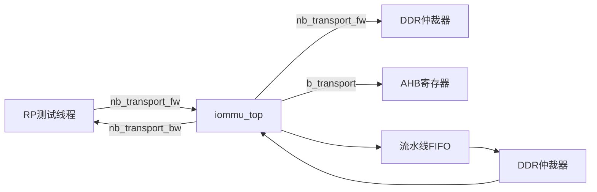

# 通信机制

<cite>
**本文引用的文件**
- [iommu_top.cc](file://iommu/iommu_top.cc)
- [iommu_top.hh](file://iommu/iommu_top.hh)
- [param_trans_def.hh](file://iommu/include/param_trans_def.hh)
- [iommu_req_rsp.hh](file://iommu/include/iommu_req_rsp.hh)
- [iommu_task.hh](file://iommu/include/iommu_task.hh)
- [iommu_perf_model.hh](file://iommu/iommu_perf_model/iommu_perf_model.hh)
- [test_rp_thread.cc](file://rp/test_rp_thread.cc)
- [test_rp.hh](file://rp/test_rp.hh)
- [test_slink.cc](file://slink/test_slink.cc)
</cite>

## 目录
1. [简介](#简介)
2. [项目结构](#项目结构)
3. [核心组件](#核心组件)
4. [架构总览](#架构总览)
5. [详细组件分析](#详细组件分析)
6. [依赖关系分析](#依赖关系分析)
7. [性能考量](#性能考量)
8. [故障排查指南](#故障排查指南)
9. [结论](#结论)

## 简介
本文件聚焦于IOMMU系统的通信机制，系统性阐述SystemC TLM（Transaction Level Modeling）协议在IOMMU中的使用与实现，重点覆盖：
- 非阻塞传输nb_transport回调的工作原理与数据流
- 各类socket接口的职责与交互（AXI主/从、PCIe、AHB）
- 阻塞传输b_transport与非阻塞传输的区别及适用场景
- 请求/响应的消息格式与数据结构定义
- 通信时序图与消息格式说明
- 性能优化策略与常见问题排查

## 项目结构
IOMMU通信相关的核心位于iommu模块，顶层封装了多个TLM socket，并通过多线程流水线处理请求。关键目录与文件如下：
- 顶层模块与socket定义：iommu_top.hh
- 顶层模块实现与回调：iommu/iommu_top.cc
- TLM扩展与消息封装：iommu/include/param_trans_def.hh
- 请求/响应数据结构：iommu/include/iommu_req_rsp.hh
- 任务与流水线数据结构：iommu/include/iommu_task.hh
- 性能模型与分类逻辑：iommu/iommu_perf_model/iommu_perf_model.hh
- 测试与验证（RP、SLINK）：rp/test_rp_thread.cc、rp/test_rp.hh、slink/test_slink.cc

图表来源
- [iommu_top.hh: 44-503:44-503](file://iommu/iommu_top.hh#L44-L503)
- [iommu_top.cc: 137-274:137-274](file://iommu/iommu_top.cc#L137-L274)
- [test_rp_thread.cc: 220-413:220-413](file://rp/test_rp_thread.cc#L220-L413)
- [test_slink.cc: 1-35:1-35](file://slink/test_slink.cc#L1-L35)

章节来源
- [iommu_top.hh: 44-503:44-503](file://iommu/iommu_top.hh#L44-L503)
- [iommu_top.cc: 137-274:137-274](file://iommu/iommu_top.cc#L137-L274)

## 核心组件
- Socket与回调
  - 入站AT回调：axi_slave_nb_transport_fw（RP -> IOMMU）
  - 出站AT回调：axi_slave_nb_transport_fw（IOMMU -> RP）
  - DDR响应回调：ddr_nb_transport_bw（DDR -> IOMMU）
  - 寄存器访问回调：ahb_slave_b_transport（AHB -> IOMMU）
- 任务与流水线
  - iommu_task_t：统一的任务上下文，承载请求元数据、解析结果、翻译状态等
  - 多条FIFO流水线：解析、缓存查询/更新、PTW、转发、故障处理等
- DDR仲裁与带宽控制
  - ddr_arbiter_thread：基于优先级与轮询的仲裁，控制全局与端口outstanding
  - 带宽延迟模拟：按长度与带宽计算延迟，实现流量整形
- 重排序与出站控制
  - reorder_buf：写请求保序，读请求乱序；完成或故障后统一释放outstanding

章节来源
- [iommu_top.hh: 44-503:44-503](file://iommu/iommu_top.hh#L44-L503)
- [iommu_task.hh: 184-280:184-280](file://iommu/include/iommu_task.hh#L184-L280)
- [iommu_top.cc: 276-404:276-404](file://iommu/iommu_top.cc#L276-L404)

## 架构总览
IOMMU采用SystemC TLM AT（Atomic Transaction）模型，以非阻塞回调为核心，配合FIFO与线程实现高吞吐的内存翻译与转发。外部RP通过nb_transport_fw发起请求，IOMMU在接收后创建iommu_task_t并推进流水线；DDR访问通过仲裁器统一调度；响应通过nb_transport_bw返回，或在特定路径下通过b_transport完成。

图表来源
- [iommu_top.cc: 140-201:140-201](file://iommu/iommu_top.cc#L140-L201)
- [iommu_top.cc: 206-274:206-274](file://iommu/iommu_top.cc#L206-L274)
- [iommu_top.cc: 279-404:279-404](file://iommu/iommu_top.cc#L279-L404)
- [test_rp_thread.cc: 248-250:248-250](file://rp/test_rp_thread.cc#L248-L250)

## 详细组件分析

### nb_transport回调与Phase流转
- 入站请求（RP -> IOMMU）
  - 触发点：axi_slave_nb_transport_fw(BEGIN_REQ)
  - 行为：带宽延迟模拟、提取PayloadExtention、构造iommu_task_t、写入inbound_fifo、返回END_REQ
- 出站响应（IOMMU -> RP）
  - 触发点：send_response_to_initiator
  - 行为：设置PA到tlm_generic_payload地址域，调用nb_transport_bw(BEGIN_RESP)
- DDR响应（DDR -> IOMMU）
  - 触发点：ddr_nb_transport_bw(BEGIN_RESP)
  - 行为：从pending队列取出对应任务，路由到相应rsp_ddr_fifo，释放outstanding并通知

图表来源
- [iommu_top.cc: 140-201:140-201](file://iommu/iommu_top.cc#L140-L201)
- [iommu_top.cc: 206-274:206-274](file://iommu/iommu_top.cc#L206-L274)

章节来源
- [iommu_top.cc: 140-201:140-201](file://iommu/iommu_top.cc#L140-L201)
- [iommu_top.cc: 206-274:206-274](file://iommu/iommu_top.cc#L206-L274)

### Socket接口与通信协议
- AXI主/从接口
  - axi_slave_from_pcie_noc_0_socket：RP发起请求的入口socket，注册nb_transport_fw回调
  - axi_master_0_to_pcie_noc_to_cmn_rni_socket：IOMMU向RP/NoC发送DMA数据的主socket
  - axi_master_1_to_cmn_rnd_socket：IOMMU向DDR发起读写的主socket，受仲裁器控制
  - axi_master_2_ats_msg_to_pcie_noc_socket：ATS消息回传socket
- AHB接口
  - ahb_slave_from_pcie_noc_1_socket：AHB寄存器访问socket，使用b_transport
- PCIe接口
  - 通过RP测试线程与IOMMU的AT socket进行通信，测试中直接调用nb_transport_fw

章节来源
- [iommu_top.hh: 47-55:47-55](file://iommu/iommu_top.hh#L47-L55)
- [iommu_top.hh: 456-464:456-464](file://iommu/iommu_top.hh#L456-L464)

### 阻塞传输与非阻塞传输
- 非阻塞传输（推荐）
  - 使用nb_transport_fw/nb_transport_bw，支持异步、可并行的事务处理
  - 适用于高性能I/O与内存访问，如RP测试线程直接调用nb_transport_fw
- 阻塞传输（保留）
  - 使用b_transport，适合简单场景与寄存器访问
  - AHB寄存器访问仍使用b_transport，保持向后兼容

章节来源
- [iommu_top.cc: 53-78:53-78](file://iommu/iommu_top.cc#L53-L78)
- [test_rp_thread.cc: 381-401:381-401](file://rp/test_rp_thread.cc#L381-L401)

### 请求与响应消息格式
- 请求结构
  - tlm_generic_payload：包含命令、地址、长度、数据指针、响应状态等
  - PayloadExtention扩展：携带设备ID、进程ID、访问属性、地址类型等
- 响应结构
  - tlm_generic_payload：返回翻译后的物理地址（PA）作为地址域
  - 状态码：TLM_OK_RESPONSE/TLM_GENERIC_ERROR_RESPONSE等

章节来源
- [param_trans_def.hh: 12-97:12-97](file://iommu/include/param_trans_def.hh#L12-L97)
- [iommu_req_rsp.hh: 29-49:29-49](file://iommu/include/iommu_req_rsp.hh#L29-L49)
- [iommu_req_rsp.hh: 77-103:77-103](file://iommu/include/iommu_req_rsp.hh#L77-L103)

### 任务状态机与流水线
- 任务状态枚举涵盖解析、缓存查询/命中/缺失、路由决策、PTW、转发、故障、完成等阶段
- 关键流水线：解析 -> 缓存查询/命中/缺失 -> PTW -> PT Cache更新 -> 转发 -> 重排序输出
- 预取与去重：支持PT Cache预取与VA去重，减少重复DDR访问

章节来源
- [iommu_task.hh: 21-48:21-48](file://iommu/include/iommu_task.hh#L21-L48)
- [iommu_task.hh: 82-182:82-182](file://iommu/include/iommu_task.hh#L82-L182)
- [iommu_top.cc: 437-475:437-475](file://iommu/iommu_top.cc#L437-L475)

### DDR仲裁与带宽控制
- 仲裁策略：控制路径优先，随后轮询xDTW、PTW、MSIPTW
- 流量控制：全局outstanding上限与端口outstanding上限，超限则等待事件
- 带宽建模：按数据长度与带宽计算延迟，模拟真实链路速率

章节来源
- [iommu_top.cc: 279-404:279-404](file://iommu/iommu_top.cc#L279-L404)

## 依赖关系分析
- 回调注册
  - 入站：axi_slave_from_pcie_noc_0_socket.register_nb_transport_fw(...)
  - 出站：axi_master_1_to_cmn_rnd_socket.register_nb_transport_bw(...)
  - 寄存器：ahb_slave_from_pcie_noc_1_socket.register_b_transport(...)
- 数据结构依赖
  - iommu_task_t依赖iommu_req_rsp.hh定义的请求/响应结构
  - 性能模型依赖iommu_perf_model.hh进行分类与参数提取
- 测试依赖
  - RP测试线程直接调用nb_transport_fw发起请求
  - SLINK模块展示标准AT回调的使用模式

图表来源
- [iommu_top.hh: 456-464:456-464](file://iommu/iommu_top.hh#L456-L464)
- [test_rp_thread.cc: 248-250:248-250](file://rp/test_rp_thread.cc#L248-L250)
- [test_slink.cc: 12-16:12-16](file://slink/test_slink.cc#L12-L16)

章节来源
- [iommu_top.hh: 456-464:456-464](file://iommu/iommu_top.hh#L456-L464)
- [test_rp_thread.cc: 248-250:248-250](file://rp/test_rp_thread.cc#L248-L250)
- [test_slink.cc: 12-16:12-16](file://slink/test_slink.cc#L12-L16)

## 性能考量
- 非阻塞回调优先：使用nb_transport避免阻塞，提升并发度
- 带宽建模与延迟：按长度与带宽计算延迟，模拟真实链路，避免过度注入
- 仲裁与outstanding控制：限制全局与端口并发，防止拥塞
- 预取与去重：PT Cache预取与VA去重降低重复DDR访问，提高吞吐
- 重排序与保序：写请求保序，读请求乱序，平衡吞吐与延迟

章节来源
- [iommu_top.cc: 144-149:144-149](file://iommu/iommu_top.cc#L144-L149)
- [iommu_top.cc: 299-300:299-300](file://iommu/iommu_top.cc#L299-L300)
- [iommu_top.cc: 355-356:355-356](file://iommu/iommu_top.cc#L355-L356)

## 故障排查指南
- 常见问题
  - DDR响应未达：检查ddr_pending_queue是否为空，确认回调路径正确
  - 响应未返回：确认phase流转是否正确，BEGIN_RESP后必须返回END_RESP
  - 死锁/卡住：检查outstanding计数与事件通知，确保释放路径可达
  - b_transport兼容：若使用b_transport，注意同步等待与完成信号
- 排查步骤
  - 打印关键路径日志（任务ID、时间戳、状态）
  - 校验PayloadExtention字段完整性
  - 检查FIFO深度与背压事件
  - 验证仲裁器事件与outstanding计数一致性

章节来源
- [iommu_top.cc: 209-218:209-218](file://iommu/iommu_top.cc#L209-L218)
- [iommu_top.cc: 126-131:126-131](file://iommu/iommu_top.cc#L126-L131)

## 结论
IOMMU系统通过SystemC TLM AT模型实现了高并发、可扩展的通信机制。非阻塞回调与FIFO流水线相结合，辅以仲裁、带宽建模与重排序，既满足性能需求，又保证了时序与一致性。PayloadExtention扩展提供了丰富的请求元信息，使IOMMU能够根据设备ID、进程ID、访问属性等进行精确的翻译与转发。结合预取与去重策略，系统在复杂工作负载下仍能保持稳定的吞吐与低延迟。