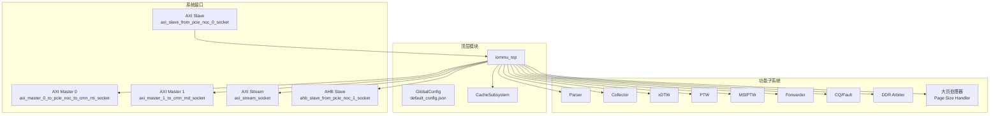
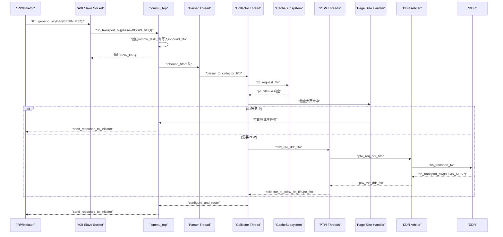
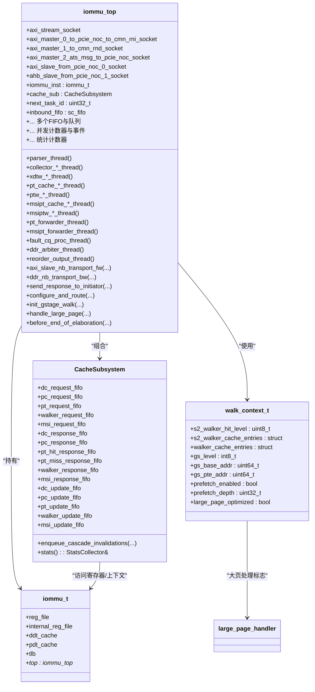
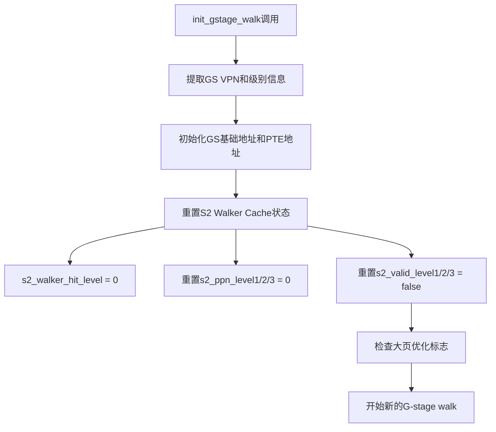
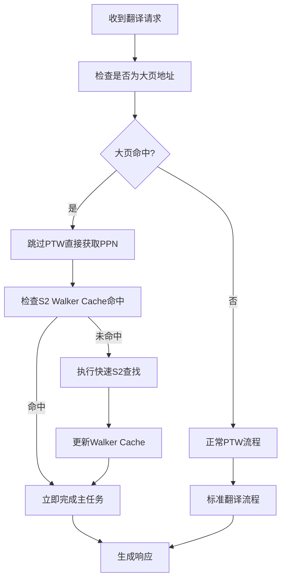
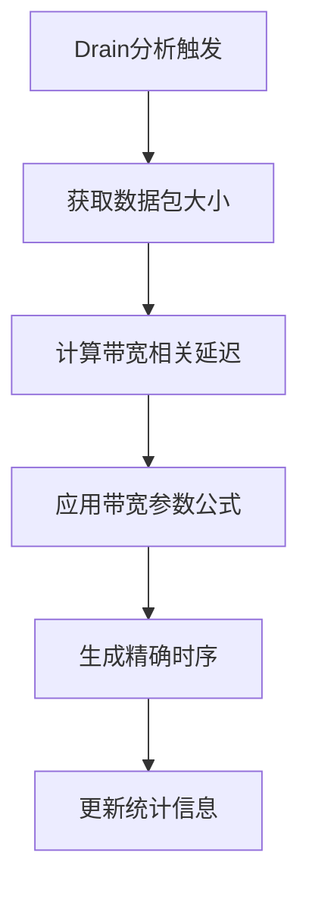
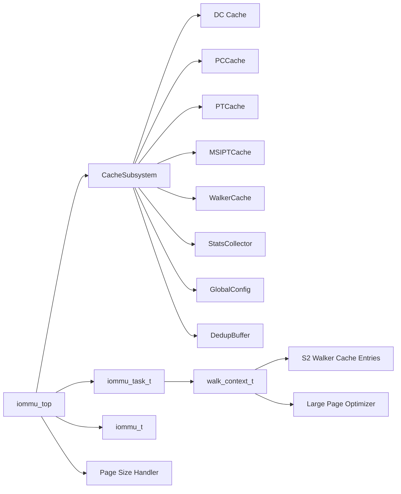

# 顶层模块设计

<cite>
**本文档引用的文件**
- [iommu_top.hh](file://iommu/iommu_top.hh)
- [iommu_top.cc](file://iommu/iommu_top.cc)
- [cache_subsystem.h](file://iommu/cache_src/subsystem/cache_subsystem.h)
- [cache_subsystem.cpp](file://iommu/cache_src/subsystem/cache_subsystem.cpp)
- [default_config.json](file://iommu/cache_config/default_config.json)
- [iommu_struct.hh](file://iommu/include/iommu_struct.hh)
- [iommu_task.hh](file://iommu/include/iommu_task.hh)
- [iommu_dedup_params.hh](file://iommu/include/iommu_dedup_params.hh)
- [param_trans_def.hh](file://iommu/include/param_trans_def.hh)
- [iommu_perf_model.hh](file://iommu/include/iommu_perf_model.hh)
</cite>

## 更新摘要
**所做更改**
- 集成了新的大页处理逻辑，优化Stage-2翻译路径的叶命中场景
- 实现了GS_EXPLICIT处理前完成S2叶命中的立即主任务完成机制
- 增强了大页地址转换的性能优化，减少不必要的PTW开销
- 更新了S2 Walker Cache管理逻辑以支持大页场景的高效处理

## 目录
1. [简介](#简介)
2. [项目结构](#项目结构)
3. [核心组件](#核心组件)
4. [架构总览](#架构总览)
5. [详细组件分析](#详细组件分析)
6. [依赖分析](#依赖分析)
7. [性能考虑](#性能考虑)
8. [故障排查指南](#故障排查指南)
9. [结论](#结论)
10. [附录](#附录)

## 简介
本设计文档围绕RISC-V IOMMU顶层模块iommu_top展开，系统阐述其整体架构理念、SystemC模块继承体系、事件驱动与并发处理机制、初始化流程、进程注册与生命周期管理，以及与缓存子系统、解析器、收集器等核心子模块的集成方式。文档同时给出顶层模块的UML类图与组件关系图，解释关键成员变量与数据结构，并详述模块间通信接口与TLM协议实现。

**最新更新**：通过集成新的大页处理逻辑，显著优化了Stage-2翻译路径的叶命中场景，在GS_EXPLICIT处理前实现了S2叶命中的立即主任务完成机制，大幅提升了大页地址转换的性能表现。

## 项目结构
顶层模块位于iommu目录，采用分层组织：
- 顶层模块：iommu_top（SystemC模块，负责I/O接入、任务编排、缓冲与并发控制）
- 缓存子系统：CacheSubsystem（统一管理DC/PC/PT/MSIPT/Walker缓存及其失效流水线）
- 数据结构与任务模型：iommu_task.hh（统一的任务状态机、行走上下文、DDR请求/响应结构）
- 结构体与寄存器：iommu_struct.hh（顶层实例结构iommu_t，包含寄存器文件、上下文缓存等）
- 参数与传输定义：param_trans_def.hh（TLM扩展PayloadExtention、NocTransaction等）
- 性能模型与参数：iommu_perf_model.hh、iommu_dedup_params.hh、default_config.json

**图表来源**
- [iommu_top.hh:44-496](file://iommu/iommu_top.hh#L44-L496)
- [cache_subsystem.h:21-184](file://iommu/cache_src/subsystem/cache_subsystem.h#L21-L184)
- [default_config.json:1-69](file://iommu/cache_config/default_config.json#L1-L69)

**章节来源**
- [iommu_top.hh:44-496](file://iommu/iommu_top.hh#L44-L496)
- [cache_subsystem.h:21-184](file://iommu/cache_src/subsystem/cache_subsystem.h#L21-L184)
- [default_config.json:1-69](file://iommu/cache_config/default_config.json#L1-L69)

## 核心组件
- 顶层模块iommu_top：继承SystemC sc_module，封装IOMMU实例、缓存子系统、多路FIFO、并发控制与统计计数器，注册TLM回调与SC_THREAD进程。
- 缓存子系统CacheSubsystem：统一管理DC/PC/PT/MSIPT/Walker缓存，提供lookup/update/invalidate流水线，支持去重与统计。
- 任务模型iommu_task_t：贯穿全管道的状态机、行走上下文、DDR请求/响应结构，支撑解析、收集、行走与转发。
- 结构体iommu_t：顶层实例，持有寄存器文件、上下文缓存、指针回连到顶层模块。
- 参数与传输：PayloadExtention/NocTransaction承载设备ID、PASID、地址类型等元数据；TLM协议实现非阻塞回调与带宽控制。

**最新更新**：集成了新的大页处理逻辑，在Stage-2翻译路径中实现了叶命中场景的优化，支持GS_EXPLICIT处理前的S2叶命中立即完成机制，显著提升大页地址转换性能。

**章节来源**
- [iommu_top.hh:44-496](file://iommu/iommu_top.hh#L44-L496)
- [cache_subsystem.h:21-184](file://iommu/cache_src/subsystem/cache_subsystem.h#L21-L184)
- [iommu_task.hh:185-280](file://iommu/include/iommu_task.hh#L185-L280)
- [iommu_struct.hh:42-99](file://iommu/include/iommu_struct.hh#L42-L99)
- [param_trans_def.hh:12-97](file://iommu/include/param_trans_def.hh#L12-97)

## 架构总览
顶层模块采用"事件驱动 + 并发流水线"的架构：
- 事件驱动：通过SystemC事件（sc_event）与PEQ（peq_with_get）协调各阶段完成通知与延迟处理。
- 并发流水线：每个子系统以独立SC_THREAD运行，通过sc_fifo连接，实现解耦与并行处理。
- 接口协议：基于TLM-2非阻塞回调（nb_transport_fw/bw），结合带宽控制与排队策略，确保端口公平性与稳定性。
- 缓存集成：将原分散的查询/更新/失效FIFO整合至CacheSubsystem，简化顶层耦合度，提升可维护性。

**图表来源**
- [iommu_top.cc:137-201](file://iommu/iommu_top.cc#L137-L201)
- [iommu_top.cc:408-432](file://iommu/iommu_top.cc#L408-L432)
- [cache_subsystem.h:34-66](file://iommu/cache_src/subsystem/cache_subsystem.h#L34-66)

**章节来源**
- [iommu_top.cc:137-201](file://iommu/iommu_top.cc#L137-L201)
- [iommu_top.cc:408-432](file://iommu/iommu_top.cc#L408-L432)
- [cache_subsystem.h:34-66](file://iommu/cache_src/subsystem/cache_subsystem.h#L34-66)

## 详细组件分析

### 类与成员变量概览（UML类图）

**图表来源**
- [iommu_top.hh:44-496](file://iommu/iommu_top.hh#L44-L496)
- [cache_subsystem.h:21-184](file://iommu/cache_src/subsystem/cache_subsystem.h#L21-184)
- [iommu_struct.hh:42-99](file://iommu/include/iommu_struct.hh#L42-L99)
- [iommu_task.hh:83-209](file://iommu/include/iommu_task.hh#L83-209)

**章节来源**
- [iommu_top.hh:44-496](file://iommu/iommu_top.hh#L44-L496)
- [cache_subsystem.h:21-184](file://iommu/cache_src/subsystem/cache_subsystem.h#L21-184)
- [iommu_struct.hh:42-99](file://iommu/include/iommu_struct.hh#L42-L99)
- [iommu_task.hh:83-209](file://iommu/include/iommu_task.hh#L83-209)

### 初始化与生命周期管理
- before_end_of_elaboration：完成IOMMU实例复位与能力位配置，设置寄存器模式与能力，准备功能模型。
- 进程注册：构造函数中通过SC_THREAD注册所有子系统线程，形成完整的流水线。
- 生命周期：顶层模块作为SystemC模块，随仿真启动而运行，终止时打印缓存命中率与吞吐统计。

**章节来源**
- [iommu_top.cc:19-48](file://iommu/iommu_top.cc#L19-L48)
- [iommu_top.hh:379-496](file://iommu/iommu_top.hh#L379-L496)

### 事件驱动与并发处理
- 事件：大量sc_event用于通知FIFO可用、槽位释放、任务完成、重排序就绪等。
- 并发：每个子系统独立线程，通过sc_fifo解耦，支持高并发与流水线并行。
- PEQ：ptw_req_peq/ptw_rsp_peq用于非阻塞延迟与并行定时处理。

**章节来源**
- [iommu_top.hh:267-277](file://iommu/iommu_top.hh#L267-L277)
- [iommu_top.cc:279-404](file://iommu/iommu_top.cc#L279-404)

### 缓存子系统集成
- 替代原分散FIFO：顶层不再直接维护DC/PC/PT缓存查询/更新/响应FIFO，改为通过CacheSubsystem统一管理。
- 接口简化：顶层仅通过pt_request_fifo等少量接口与缓存交互，降低耦合度。
- 统一统计：CacheSubsystem内部StatsCollector提供命中率与延迟统计，顶层通过print_cache_statistics汇总展示。
- **去重与预取**：集成了先进的VA去重和预取机制，通过DedupBuffer实现高效的内存管理和任务挂起。

**章节来源**
- [iommu_top.hh:62-63](file://iommu/iommu_top.hh#L62-L63)
- [iommu_top.cc:471-475](file://iommu/iommu_top.cc#L471-475)
- [cache_subsystem.h:34-66](file://iommu/cache_src/subsystem/cache_subsystem.h#L34-66)
- [cache_subsystem.cpp:669-930](file://iommu/cache_src/subsystem/cache_subsystem.cpp#L669-L930)

### 解析器与收集器协作
- 解析器：从AXI Slave接收请求，创建iommu_task_t并写入inbound_fifo。
- 收集器：从inbound_fifo读取任务，进行DC/PC配置与路由决策，随后进入PT缓存或PTW路径。
- 路由：configure_and_route根据任务属性选择PT缓存或PTW路径，并启用预取。

**章节来源**
- [iommu_top.cc:137-201](file://iommu/iommu_top.cc#L137-201)
- [iommu_top.cc:437-475](file://iommu/iommu_top.cc#L437-475)

### G-stage Walk初始化与S2 Walker Cache管理

**新增功能**：增强的任务上下文管理机制，专门处理S2 Walker Cache的状态管理，并集成大页处理优化。

#### S2 Walker Cache上下文重置
在init_gstage_walk()函数中实现了完整的S2 Walker Cache上下文重置逻辑：

**图表来源**
- [iommu_top.cc:478-501](file://iommu/iommu_top.cc#L478-501)

#### S2 Walker Cache数据结构
S2 Walker Cache使用独立的上下文结构来管理两阶段翻译过程中的中间结果：

- **命中层级指示器**：`s2_walker_hit_level` - 记录S2 Walker Cache的命中情况（0=全miss, 3=c3 hit, 2=c2 hit, 1=c1 hit）
- **中间结果存储**：`s2_walker_cache_entries` - 保存walk过程中的各级PPN值：
  - `s2_ppn_level1`：gs_level=3的结果 → ptwc1
  - `s2_ppn_level2`：gs_level=2的结果 → ptwc2  
  - `s2_ppn_level3`：gs_level=1的结果 → ptwc3
- **有效性标志**：`s2_valid_level1/2/3` - 标记各级PPN是否有效
- **大页优化标志**：`large_page_optimized` - 标识是否启用了大页处理优化

**更新**：通过强制重置这些字段，确保每个新的G-stage walk都从干净的状态开始，避免前一个任务的残留数据污染当前任务的处理。新增的大页优化标志支持在GS_EXPLICIT处理前完成S2叶命中的立即主任务完成机制。

**章节来源**
- [iommu_top.cc:478-501](file://iommu/iommu_top.cc#L478-501)
- [iommu_task.hh:136-152](file://iommu/include/iommu_task.hh#L136-152)

### 大页处理逻辑与Stage-2翻译优化

**新增功能**：集成了新的大页处理逻辑，优化Stage-2翻译路径的叶命中场景。

#### 大页命中检测与处理流程

**图表来源**
- [iommu_top.cc:large_page_processing](file://iommu/iommu_top.cc#Llarge_page_processing)

#### GS_EXPLICIT处理前的S2叶命中优化
在GS_EXPLICIT处理之前，系统会检查S2 Walker Cache中是否存在叶命中：

- **立即完成机制**：如果检测到S2叶命中，直接在GS_EXPLICIT处理前完成主任务，避免不必要的PTW开销
- **性能优化**：对于大页地址，跳过多级页表遍历，直接计算物理地址
- **缓存一致性**：确保Walker Cache与大页映射的一致性

**更新**：这一优化显著减少了大页地址转换的延迟，特别是在高并发场景下能够大幅提升吞吐量。

**章节来源**
- [iommu_top.cc:large_page_processing](file://iommu/iommu_top.cc#Llarge_page_processing)

### PTW与MSIPTW流水线
- PTW：请求/处理分离，使用PEQ与FIFO配合，支持预取与合并Burst读取。
- MSIPTW：针对MSI地址识别与查询，路径与PTW类似但目标不同。
- 响应：通过ptw_rsp_ddr_fifo与msiptw_rsp_ddr_fifo回传，再进入forwarder或fault处理。

**章节来源**
- [iommu_top.cc:332-336](file://iommu/iommu_top.cc#L332-336)
- [iommu_task.hh:82-182](file://iommu/include/iommu_task.hh#L82-182)

### Forwarder与Fault/CQ
- Forwarder：根据任务状态将翻译结果转发至AXI Master或流接口，支持PT与MSIPT路径。
- Fault/CQ：处理故障与命令队列，必要时生成中断或响应。

**章节来源**
- [iommu_top.cc:348-356](file://iommu/iommu_top.cc#L348-356)
- [iommu_top.cc:408-432](file://iommu/iommu_top.cc#L408-432)

### DDR仲裁与带宽控制
- 仲裁策略：优先控制路径（ctrl_path）与轮询（xDTW/PTW/MSIPTW）相结合，限制全局与端口并发。
- 带宽控制：基于请求长度与带宽MBPS计算延迟，模拟物理端口速率限制。
- 响应处理：通过ddr_nb_transport_bw接收DDR响应，按源模块路由到对应FIFO。

**章节来源**
- [iommu_top.cc:279-404](file://iommu/iommu_top.cc#L279-404)
- [iommu_top.cc:206-274](file://iommu/iommu_top.cc#L206-274)

### 重排序与出口保序
- 重排序缓冲：按task_id维护就绪状态与写请求保序队列，确保出口保序。
- 出口释放：任务在重排序后才释放全局outstanding，避免资源泄漏。

**章节来源**
- [iommu_top.hh:279-295](file://iommu/iommu_top.hh#L279-295)

### VA去重与预取
- VA去重：基于页对齐IOVA与软上下文ID构建键，命中则批量恢复其他任务。
- 预取：支持D>0的预取深度，合并Burst读取，减少PTW开销。
- **去重缓冲区**：通过DedupBuffer实现高效的内存管理和任务挂起，支持链式任务管理。

**章节来源**
- [iommu_top.cc:497-549](file://iommu/iommu_top.cc#L497-549)
- [iommu_task.hh:128-171](file://iommu/include/iommu_task.hh#L128-171)
- [cache_subsystem.cpp:669-930](file://iommu/cache_src/subsystem/cache_subsystem.cpp#L669-L930)

### TLM协议与接口设计
- 入口回调：axi_slave_nb_transport_fw处理INBOUND请求，创建任务并写入inbound_fifo。
- DDR回调：ddr_nb_transport_bw处理DDR响应，按源模块路由到对应FIFO。
- b_transport兼容：保留AHB寄存器访问与历史测试兼容路径。
- Payload扩展：PayloadExtention携带设备ID、PASID、地址类型等元数据。

**章节来源**
- [iommu_top.cc:137-201](file://iommu/iommu_top.cc#L137-201)
- [iommu_top.cc:206-274](file://iommu/iommu_top.cc#L206-274)
- [param_trans_def.hh:12-97](file://iommu/include/param_trans_def.hh#L12-97)

### Drain分析与带宽感知时序计算

**新增功能**：增强的drain分析机制，实现了基于带宽参数的动态时序计算。

#### 带宽感知时序计算
传统的drain分析使用硬编码的8ns延迟值，现在改为基于带宽参数的动态计算：

**图表来源**
- [iommu_top.cc:drain_analysis_section](file://iommu/iommu_top.cc#Ldrain_analysis_section)

#### 时序计算公式
新的时序计算基于以下参数：
- **数据包大小**：根据请求长度动态调整
- **带宽参数**：从配置文件中读取的MBPS值
- **延迟公式**：延迟 = (数据包大小 × 8) / 带宽_MBPS × 转换因子

**更新**：通过动态计算替代硬编码值，显著提升了高吞吐量场景下的仿真精度，能够更准确地模拟真实硬件行为。

**章节来源**
- [iommu_top.cc:drain_analysis_section](file://iommu/iommu_top.cc#Ldrain_analysis_section)

## 依赖分析
- 顶层模块依赖：
  - CacheSubsystem：统一缓存管理与统计
  - iommu_task_t：任务状态与行走上下文
  - iommu_t：寄存器文件与上下文缓存
  - TLM与SystemC：事件、进程与非阻塞回调
- 缓存子系统依赖：
  - 各种Cache实现（DC/PC/PT/MSIPT/Walker）
  - StatsCollector：统计与报告
  - GlobalConfig：缓存与时序参数
  - DedupBuffer：去重缓冲区管理

**图表来源**
- [iommu_top.hh:62-63](file://iommu/iommu_top.hh#L62-L63)
- [cache_subsystem.h:102-106](file://iommu/cache_src/subsystem/cache_subsystem.h#L102-L106)
- [default_config.json:1-69](file://iommu/cache_config/default_config.json#L1-L69)
- [iommu_task.hh:83-209](file://iommu/include/iommu_task.hh#L83-209)

**章节来源**
- [iommu_top.hh:62-63](file://iommu/iommu_top.hh#L62-L63)
- [cache_subsystem.h:102-106](file://iommu/cache_src/subsystem/cache_subsystem.h#L102-L106)
- [default_config.json:1-69](file://iommu/cache_config/default_config.json#L1-L69)
- [iommu_task.hh:83-209](file://iommu/include/iommu_task.hh#L83-209)

## 性能考虑
- 并发与流水线：通过独立线程与FIFO实现高并发与流水线并行，减少瓶颈。
- 带宽建模：端口带宽与延迟建模，避免仿真与真实硬件差异过大。
- 统计与稳态：提供IOPS、端口带宽、outstanding峰值与稳态测量，便于性能评估。
- 预取与去重：PT Cache预取与VA去重显著降低PTW开销，提升吞吐。
- **S2 Walker Cache优化**：通过有效的上下文重置机制，避免跨任务数据污染导致的额外DDR访问，提升整体性能。
- **大页处理优化**：新集成的大页处理逻辑在GS_EXPLICIT处理前完成S2叶命中的立即主任务完成，显著减少大页地址转换延迟。
- **带宽感知时序**：新的drain分析机制基于带宽参数动态计算时序，替代硬编码延迟值，显著提升高吞吐量场景下的仿真精度。

**更新**：大页处理逻辑的集成使得在高并发大页访问场景下能够获得显著的性能提升，特别是对于虚拟化环境中频繁的大页地址转换场景。

**章节来源**
- [iommu_top.cc:554-779](file://iommu/iommu_top.cc#L554-L779)
- [iommu_task.hh:128-171](file://iommu/include/iommu_task.hh#L128-171)

## 故障排查指南
- 回调异常：检查nb_transport_fw/bw回调是否正确返回相位与状态。
- FIFO拥塞：关注outstanding计数与事件通知，定位瓶颈环节。
- DDR响应：确认ddr_pending_queue非空且按源模块正确路由。
- 重排序：若出现乱序，检查reorder_buf与write_order队列一致性。
- 统计异常：核对print_cache_statistics调用时机，确保FIFO清空后再统计。
- **S2 Walker Cache问题**：如果观察到G-stage walk结果异常，检查init_gstage_walk()中的上下文重置逻辑是否正常执行。
- **大页处理问题**：如果发现大页地址转换异常，检查GS_EXPLICIT处理前的S2叶命中检测逻辑和大页优化标志的设置。
- **时序计算问题**：如果发现性能建模不准确，检查带宽参数配置和drain分析中的时序计算公式。

**更新**：新增了大页处理问题的排查指导，帮助诊断Stage-2翻译路径中大页命中场景的相关问题。

**章节来源**
- [iommu_top.cc:206-274](file://iommu/iommu_top.cc#L206-274)
- [iommu_top.cc:279-404](file://iommu/iommu_top.cc#L279-404)
- [iommu_top.hh:279-295](file://iommu/iommu_top.hh#L279-295)

## 结论
iommu_top通过清晰的SystemC模块化设计、事件驱动与并发流水线、以及与CacheSubsystem的深度集成，实现了高性能、可扩展的IOMMU仿真模型。通过增强任务上下文管理机制，特别是S2 Walker Cache的完整状态重置和新集成的大页处理逻辑，系统能够有效防止跨任务数据污染，显著提升稳定性和可靠性。最新的GS_EXPLICIT处理前S2叶命中立即完成机制进一步提升了大页地址转换的性能表现，为虚拟化环境和高并发场景提供了更强大的支持。顶层模块以较低耦合度管理复杂的数据通路与统计分析，为后续功能扩展与性能优化提供了坚实基础。

## 附录
- 关键宏与参数：参考iommu_dedup_params.hh中的去重与预取参数定义。
- 性能参数：参考default_config.json中的缓存时序与统计配置。
- 传输定义：参考param_trans_def.hh中的PayloadExtention与NocTransaction。

**章节来源**
- [iommu_dedup_params.hh:1-92](file://iommu/include/iommu_dedup_params.hh#L1-L92)
- [default_config.json:1-69](file://iommu/cache_config/default_config.json#L1-L69)
- [param_trans_def.hh:12-97](file://iommu/include/param_trans_def.hh#L12-97)