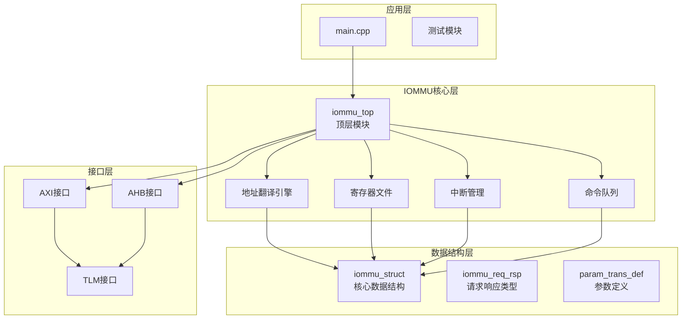
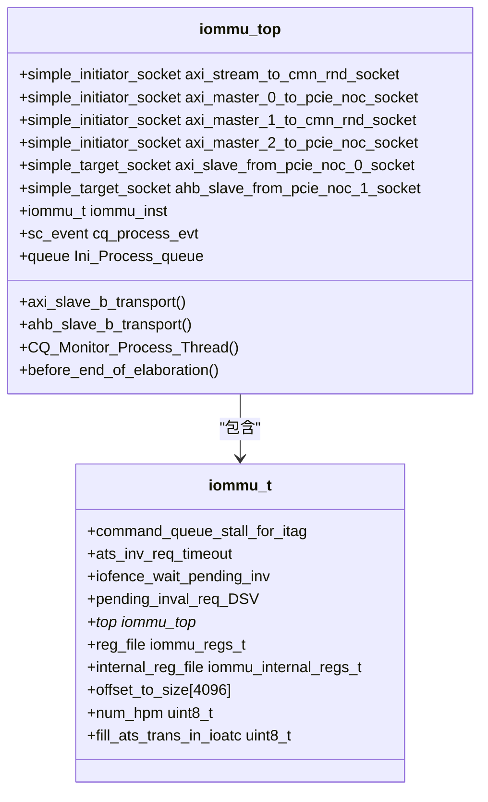
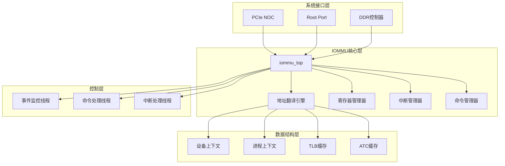
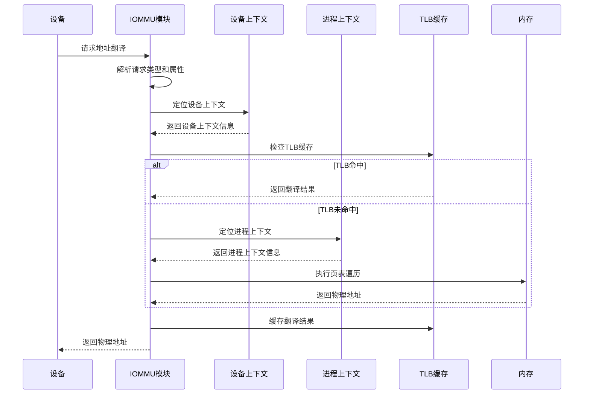
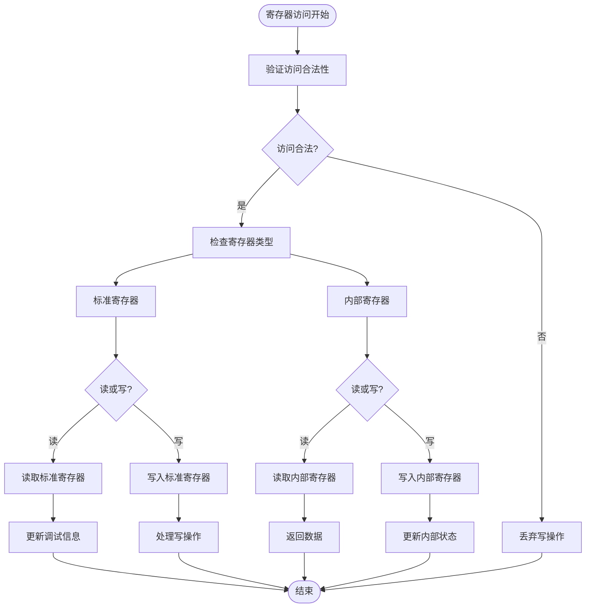
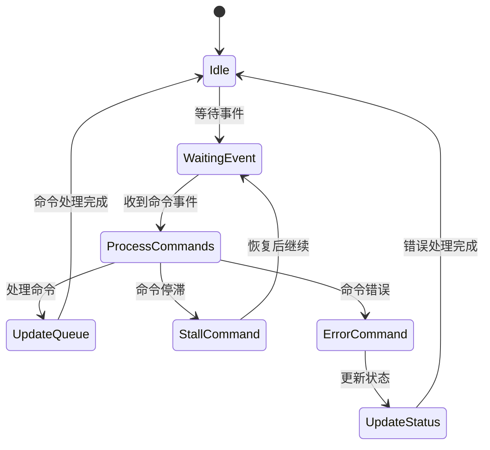
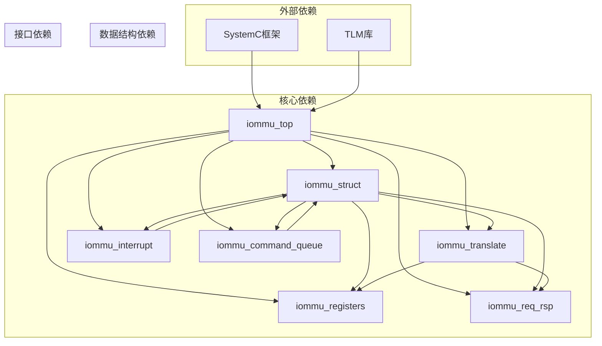

# IOMMU顶层模块

<cite>
**本文档引用的文件**
- [iommu_top.hh](file://iommu/iommu_top.hh)
- [iommu_top.cc](file://iommu/iommu_top.cc)
- [iommu_struct.hh](file://iommu/iommu_struct.hh)
- [iommu_registers.hh](file://iommu/iommu_registers.hh)
- [iommu_reg.cc](file://iommu/iommu_reg.cc)
- [iommu_translate.hh](file://iommu/iommu_translate.hh)
- [iommu_translate.cc](file://iommu/iommu_translate.cc)
- [iommu_req_rsp.hh](file://iommu/iommu_req_rsp.hh)
- [iommu_interrupt.hh](file://iommu/iommu_interrupt.hh)
- [iommu_command_queue.hh](file://iommu/iommu_command_queue.hh)
- [param_trans_def.hh](file://iommu/param_trans_def.hh)
- [main.cpp](file://main.cpp)
</cite>

## 目录
1. [简介](#简介)
2. [项目结构](#项目结构)
3. [核心组件](#核心组件)
4. [架构概览](#架构概览)
5. [详细组件分析](#详细组件分析)
6. [依赖关系分析](#依赖关系分析)
7. [性能考虑](#性能考虑)
8. [故障排除指南](#故障排除指南)
9. [结论](#结论)
10. [附录](#附录)

## 简介

IOMMU（输入/输出内存管理单元）顶层模块是RISC-V平台中负责设备地址翻译和内存保护的核心组件。该模块实现了SystemC TLM（事务级建模）接口，提供了完整的PCIe ATS（地址转换服务）和PRI（页面请求接口）支持。

本模块的主要功能包括：
- AXI和AHB总线接口的统一管理
- 设备上下文和进程上下文的地址翻译
- MSI（消息信号中断）地址翻译
- 命令队列监控和事件驱动机制
- 寄存器映射和中断处理

## 项目结构

基于提供的代码库，IOMMU系统采用模块化设计，主要分为以下几个层次：



**图表来源**
- [main.cpp:38-87](file://main.cpp#L38-L87)
- [iommu_top.hh:19-57](file://iommu/iommu_top.hh#L19-L57)
- [iommu_struct.hh:42-102](file://iommu/iommu_struct.hh#L42-L102)

**章节来源**
- [main.cpp:1-87](file://main.cpp#L1-L87)
- [iommu_top.hh:1-57](file://iommu/iommu_top.hh#L1-L57)

## 核心组件

### iommu_top类架构

iommu_top类是整个IOMMU系统的核心，继承自SystemC的sc_module基类，实现了完整的IOMMU功能。



**图表来源**
- [iommu_top.hh:19-57](file://iommu/iommu_top.hh#L19-L57)
- [iommu_struct.hh:42-102](file://iommu/iommu_struct.hh#L42-L102)

### 总线接口配置

IOMMU模块提供了多种总线接口以适应不同的系统架构需求：

| Socket名称 | 接口类型 | 功能描述 | 连接目标 |
|------------|----------|----------|----------|
| axi_stream_to_cmn_rnd_socket | AXI Initiator | MSI数据传输到IMSIC | DDR模块 |
| axi_master_0_to_pcie_noc_socket | AXI Initiator | DMA数据访问和RP通信 | DDR模块 |
| axi_master_1_to_cmn_rnd_socket | AXI Initiator | 访问DDT/PDT/CQ/FQ/PQ/MRIF | DDR模块 |
| axi_master_2_to_pcie_noc_socket | AXI Initiator | 发送ATS消息回RP | RP模块 |
| axi_slave_from_pcie_noc_0_socket | AXI Target | 接收PCIe NOC的AXI事务 | PCIe NOC |
| ahb_slave_from_pcie_noc_1_socket | AHB Target | 接收PCIe NOC的AHB事务 | PCIe NOC |

**章节来源**
- [iommu_top.hh:22-28](file://iommu/iommu_top.hh#L22-L28)
- [param_trans_def.hh:10](file://iommu/param_trans_def.hh#L10)

## 架构概览

IOMMU系统采用分层架构设计，实现了从硬件抽象到系统级集成的完整解决方案：



**图表来源**
- [main.cpp:38-87](file://main.cpp#L38-L87)
- [iommu_top.cc:6-36](file://iommu/iommu_top.cc#L6-L36)
- [iommu_struct.hh:42-102](file://iommu/iommu_struct.hh#L42-L102)

## 详细组件分析

### 地址翻译处理机制

IOMMU的核心功能是处理设备的地址翻译请求，支持多种翻译模式：



**图表来源**
- [iommu_translate.cc:8-731](file://iommu/iommu_translate.cc#L8-L731)
- [iommu_translate.hh:95-130](file://iommu/iommu_translate.hh#L95-L130)

### 寄存器映射和访问

IOMMU实现了完整的寄存器映射，支持标准的RISC-V IOMMU规范：



**图表来源**
- [iommu_reg.cc:11-26](file://iommu/iommu_reg.cc#L11-L26)
- [iommu_reg.cc:39-73](file://iommu/iommu_reg.cc#L39-L73)
- [iommu_reg.cc:75-106](file://iommu/iommu_reg.cc#L75-L106)

### 命令队列监控线程

IOMMU实现了事件驱动的命令队列监控机制：



**图表来源**
- [iommu_top.cc:215-222](file://iommu/iommu_top.cc#L215-L222)
- [iommu_command_queue.hh:1-125](file://iommu/iommu_command_queue.hh#L1-L125)

**章节来源**
- [iommu_top.cc:215-222](file://iommu/iommu_top.cc#L215-L222)
- [iommu_reg.cc:909-1056](file://iommu/iommu_reg.cc#L909-L1056)

## 依赖关系分析

IOMMU模块的依赖关系体现了清晰的分层设计：



**图表来源**
- [iommu_top.hh:8-16](file://iommu/iommu_top.hh#L8-L16)
- [iommu_struct.hh:26-38](file://iommu/iommu_struct.hh#L26-L38)

**章节来源**
- [iommu_top.hh:1-57](file://iommu/iommu_top.hh#L1-L57)
- [iommu_struct.hh:1-102](file://iommu/iommu_struct.hh#L1-L102)

## 性能考虑

IOMMU模块在设计时充分考虑了性能优化：

### 缓存策略
- **TLB缓存**：实现多级TLB缓存，支持快速地址翻译
- **ATC缓存**：缓存MSI地址翻译结果，减少重复计算
- **LRU替换算法**：确保缓存的有效性和性能

### 并发处理
- **事件驱动架构**：使用SystemC事件机制实现非阻塞处理
- **多线程支持**：命令队列监控和中断处理分离
- **流水线设计**：地址翻译和内存访问并行处理

### 内存管理
- **页表缓存**：缓存常用的页表项，减少内存访问
- **预取机制**：预测性地加载可能需要的页表项
- **内存对齐**：优化内存访问模式，提高带宽利用率

## 故障排除指南

### 常见问题诊断

1. **地址翻译失败**
   - 检查设备上下文配置
   - 验证进程上下文有效性
   - 确认页表项权限设置

2. **寄存器访问异常**
   - 验证寄存器偏移地址对齐
   - 检查访问长度是否符合要求
   - 确认寄存器状态是否正确

3. **中断处理问题**
   - 检查中断向量配置
   - 验证中断掩码设置
   - 确认中断优先级处理

**章节来源**
- [iommu_reg.cc:11-26](file://iommu/iommu_reg.cc#L11-L26)
- [iommu_translate.cc:97-113](file://iommu/iommu_translate.cc#L97-L113)

## 结论

IOMMU顶层模块展现了现代系统级建模的最佳实践，通过清晰的模块化设计、完善的接口抽象和高效的事件驱动机制，实现了复杂的IOMMU功能。该模块不仅满足了RISC-V IOMMU规范的要求，还提供了良好的可扩展性和维护性。

模块的关键优势包括：
- **完整的功能覆盖**：支持所有主要的IOMMU特性
- **高性能设计**：优化的缓存策略和并发处理
- **易于集成**：标准化的SystemC接口和TLM协议
- **可维护性**：清晰的代码结构和详细的文档

## 附录

### 系统集成示例

以下是一个完整的SystemC集成示例：

```cpp
// 创建IOMMU顶层模块实例
iommu_top* iommu = new iommu_top("iommu");

// 创建DDR模块实例
DDR_Module* ddr = new DDR_Module("ddr");

// 创建RP模块实例
RP_Module* rp = new RP_Module("rp", iommu, ddr);

// 创建PCIENOC模块实例
PCIENOC_Module* pcienoc = new PCIENOC_Module("pcienoc");

// 绑定IOMMU的initiator sockets到DDR模块的target sockets
iommu->axi_stream_to_cmn_rnd_socket.bind(ddr->axi_slave_from_cmn_rnd_socket);
iommu->axi_master_0_to_pcie_noc_socket.bind(ddr->axi_slave_from_pcie_noc_0_socket);
iommu->axi_master_1_to_cmn_rnd_socket.bind(ddr->axi_slave_from_cmn_rnd_1_socket);

// 绑定RP模块的initiator socket到IOMMU的target socket
rp->axi_master_to_pcie_noc_0_socket.bind(iommu->axi_slave_from_pcie_noc_0_socket);

// 绑定PCIENOC模块的initiator socket到IOMMU的target socket
pcienoc->ahb_master_to_pcie_noc_1_socket.bind(iommu->ahb_slave_from_pcie_noc_1_socket);
```

**章节来源**
- [main.cpp:48-74](file://main.cpp#L48-L74)