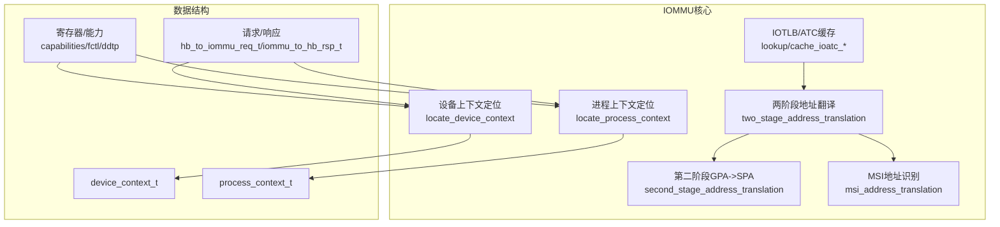
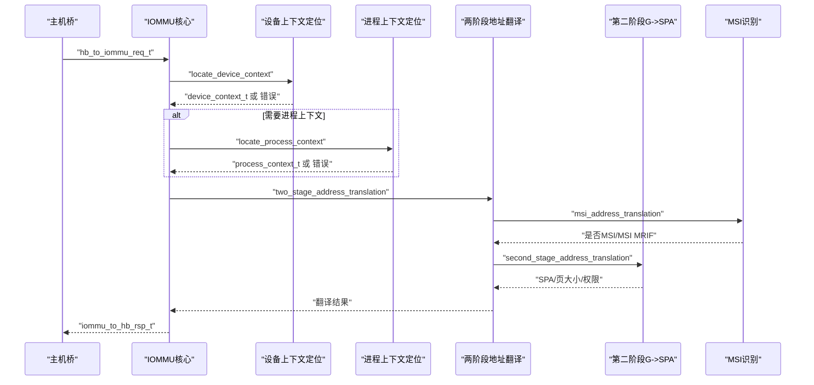
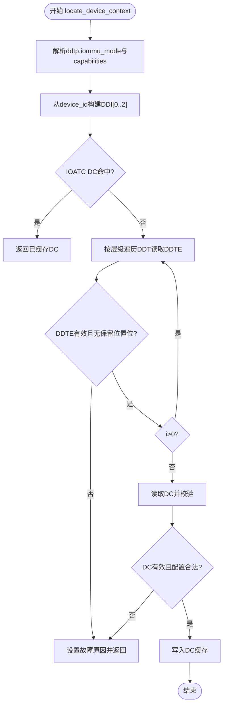
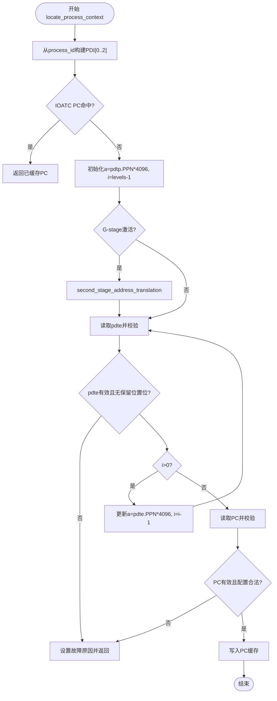
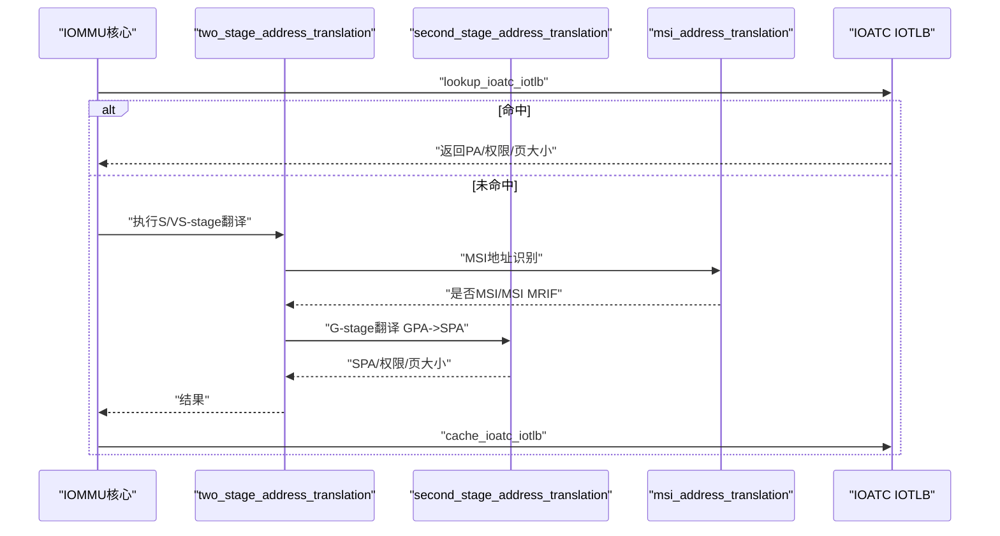
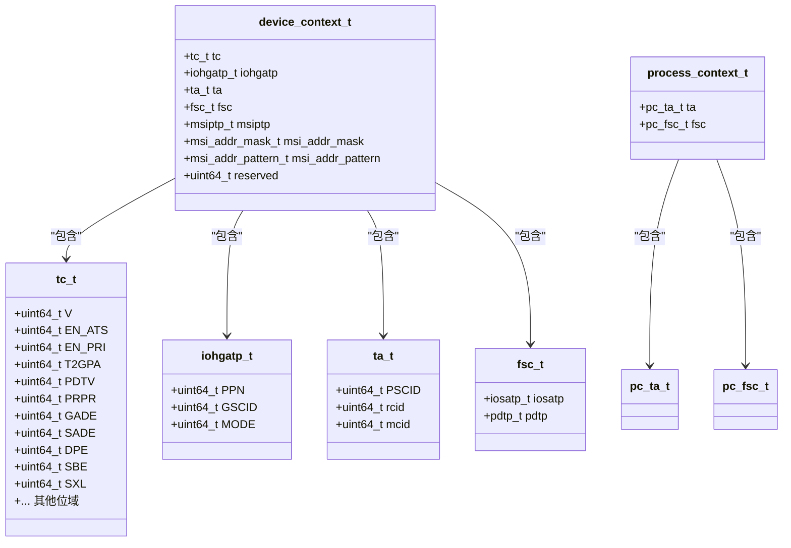
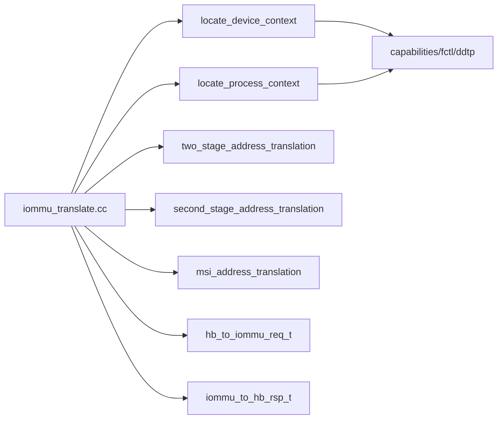

# 上下文管理系统

<cite>
**本文档引用的文件**
- [iommu_device_context.cc](file://iommu/iommu_device_context.cc)
- [iommu_process_context.cc](file://iommu/iommu_process_context.cc)
- [iommu_struct.hh](file://iommu/iommu_struct.hh)
- [iommu_data_structures.hh](file://iommu/iommu_data_structures.hh)
- [iommu_translate.cc](file://iommu/iommu_translate.cc)
- [iommu_atc.hh](file://iommu/iommu_atc.hh)
- [iommu_translate.hh](file://iommu/iommu_translate.hh)
- [iommu_registers.hh](file://iommu/iommu_registers.hh)
- [iommu_req_rsp.hh](file://iommu/iommu_req_rsp.hh)
- [iommu_top.cc](file://iommu/iommu_top.cc)
- [iommu_utils.hh](file://iommu/iommu_utils.hh)
</cite>

## 目录
1. [引言](#引言)
2. [项目结构](#项目结构)
3. [核心组件](#核心组件)
4. [架构总览](#架构总览)
5. [详细组件分析](#详细组件分析)
6. [依赖关系分析](#依赖关系分析)
7. [性能考虑](#性能考虑)
8. [故障排查指南](#故障排查指南)
9. [结论](#结论)
10. [附录](#附录)

## 引言
本文件面向IOMMU上下文管理系统，聚焦设备上下文（Device Context, DC）与进程上下文（Process Context, PC）的设计原理、查找算法、ID映射关系与权限控制实现，以及上下文状态管理、生命周期与资源清理机制。同时给出上下文切换的性能优化策略与缓存机制说明，并通过序列图与类图展示关键流程与数据结构关系。

## 项目结构
该代码库围绕IOMMU核心模块组织，上下文管理主要分布在以下文件：
- 设备上下文定位与校验：iommu_device_context.cc
- 进程上下文定位与校验：iommu_process_context.cc
- 数据结构定义：iommu_data_structures.hh、iommu_struct.hh
- 地址翻译主控流程：iommu_translate.cc
- 缓存接口与TLB/ATC定义：iommu_atc.hh
- 寄存器能力与配置：iommu_registers.hh
- 请求/响应接口：iommu_req_rsp.hh
- 系统集成入口：iommu_top.cc
- 工具函数：iommu_utils.hh

**图表来源**
- [iommu_device_context.cc:9-229](file://iommu/iommu_device_context.cc#L9-L229)
- [iommu_process_context.cc:11-196](file://iommu/iommu_process_context.cc#L11-L196)
- [iommu_translate.cc:8-732](file://iommu/iommu_translate.cc#L8-L732)
- [iommu_atc.hh:38-95](file://iommu/iommu_atc.hh#L38-L95)
- [iommu_data_structures.hh:324-412](file://iommu/iommu_data_structures.hh#L324-L412)
- [iommu_registers.hh:185-330](file://iommu/iommu_registers.hh#L185-L330)
- [iommu_req_rsp.hh:36-102](file://iommu/iommu_req_rsp.hh#L36-L102)

**章节来源**
- [iommu_device_context.cc:9-229](file://iommu/iommu_device_context.cc#L9-L229)
- [iommu_process_context.cc:11-196](file://iommu/iommu_process_context.cc#L11-L196)
- [iommu_translate.cc:8-732](file://iommu/iommu_translate.cc#L8-L732)
- [iommu_atc.hh:38-95](file://iommu/iommu_atc.hh#L38-L95)
- [iommu_data_structures.hh:324-412](file://iommu/iommu_data_structures.hh#L324-L412)
- [iommu_registers.hh:185-330](file://iommu/iommu_registers.hh#L185-L330)
- [iommu_req_rsp.hh:36-102](file://iommu/iommu_req_rsp.hh#L36-L102)

## 核心组件
- 设备上下文（DC）：承载设备级的翻译控制、G-stage根指针、属性与第一阶段上下文信息；支持Base/Extended两种格式，尺寸分别为32/64字节。
- 进程上下文（PC）：承载进程级的S/VS-stage根页表指针与PSCID等，用于多进程场景下的地址空间隔离与权限控制。
- 上下文缓存（IOATC）：包含DC缓存、PC缓存与IOTLB，用于加速重复查找与翻译。
- 地址翻译主控：根据事务类型与上下文选择路径，执行两阶段地址翻译与MSI识别。
- 寄存器与能力：capabilities、fctl、ddtp等决定模式、端序、能力集与目录表层级。

**章节来源**
- [iommu_data_structures.hh:324-412](file://iommu/iommu_data_structures.hh#L324-L412)
- [iommu_atc.hh:38-95](file://iommu/iommu_atc.hh#L38-L95)
- [iommu_translate.cc:8-732](file://iommu/iommu_translate.cc#L8-L732)
- [iommu_registers.hh:185-330](file://iommu/iommu_registers.hh#L185-L330)

## 架构总览
IOMMU在收到主机桥请求后，先进行设备上下文定位，再依据是否启用多进程与进程ID选择进程上下文定位，随后进入两阶段地址翻译，期间可能触发MSI识别与GPA->SPA转换，最终将结果写入响应并可按需缓存到IOTLB。

**图表来源**
- [iommu_translate.cc:8-732](file://iommu/iommu_translate.cc#L8-L732)
- [iommu_device_context.cc:9-229](file://iommu/iommu_device_context.cc#L9-L229)
- [iommu_process_context.cc:11-196](file://iommu/iommu_process_context.cc#L11-L196)
- [iommu_translate.hh:95-129](file://iommu/iommu_translate.hh#L95-L129)

## 详细组件分析

### 设备上下文定位（DDT查找）
- 查找算法
  - 基于设备ID划分DDI索引，按DDT层级遍历，逐层读取DDTE，直至叶子节点定位DC。
  - 支持1/2/3级目录树，具体层级由ddtp.iommu_mode与capabilities决定。
  - 支持Base/Extended两种DC格式，尺寸不同。
- 校验规则
  - 对DDTE与DC进行有效性、保留位、模式兼容性检查，不满足则返回“DDT条目未有效/错误配置”等故障码。
- 缓存与命中
  - 若IOATC命中DC，则直接返回；否则定位后写入DC缓存。

**图表来源**
- [iommu_device_context.cc:9-229](file://iommu/iommu_device_context.cc#L9-L229)

**章节来源**
- [iommu_device_context.cc:9-229](file://iommu/iommu_device_context.cc#L9-L229)

### 进程上下文定位（PDT查找）
- 查找算法
  - 基于进程ID划分PDI索引，遍历PDT目录树，逐层读取pdte，直至叶子定位PC。
  - 当G-stage激活时，需要先进行G-stage地址翻译以获得SPA再继续后续访问。
- 校验规则
  - 对PC.ta与PC.fsc进行合法性检查，确保MODE编码与能力一致。
- 缓存与命中
  - 若IOATC命中PC，则直接返回；否则定位后写入PC缓存。

**图表来源**
- [iommu_process_context.cc:11-196](file://iommu/iommu_process_context.cc#L11-L196)

**章节来源**
- [iommu_process_context.cc:11-196](file://iommu/iommu_process_context.cc#L11-L196)

### 两阶段地址翻译与MSI识别
- 主流程
  - 根据DC/PC提供的iosatp/iohgatp与PSCID/GSCID，执行S/VS-stage与G-stage翻译。
  - 在IOTLB未命中时，执行页表遍历，结合SADE/GADE与SXL/SBE等控制位进行权限判定与原子更新。
  - 在GPA确定后，尝试MSI地址识别，若为MSI MRIF则按MRIF模式处理。
- 结果
  - 返回SPA、页大小、权限位与PBMT，必要时写入IOTLB缓存。

**图表来源**
- [iommu_translate.cc:332-492](file://iommu/iommu_translate.cc#L332-L492)
- [iommu_translate.hh:105-129](file://iommu/iommu_translate.hh#L105-L129)
- [iommu_atc.hh:70-95](file://iommu/iommu_atc.hh#L70-L95)

**章节来源**
- [iommu_translate.cc:332-492](file://iommu/iommu_translate.cc#L332-L492)
- [iommu_translate.hh:105-129](file://iommu/iommu_translate.hh#L105-L129)
- [iommu_atc.hh:70-95](file://iommu/iommu_atc.hh#L70-L95)

### 数据模型与关系图
- 设备上下文（DC）字段：tc（翻译控制）、iohgatp（G-stage根）、ta（属性）、fsc（第一阶段上下文），扩展格式含MSI相关字段。
- 进程上下文（PC）字段：ta（进程属性与PSCID）、fsc（S/VS-stage根与MODE）。
- 关系：DC决定是否启用多进程（PDTV），若启用则通过PDT选择对应PC；DC还携带G-stage根与端序/原子更新等控制位。

**图表来源**
- [iommu_data_structures.hh:324-412](file://iommu/iommu_data_structures.hh#L324-L412)

**章节来源**
- [iommu_data_structures.hh:324-412](file://iommu/iommu_data_structures.hh#L324-L412)

### 访问控制矩阵（概念示意）
- 控制位与能力约束
  - EN_ATS/EN_PRI/T2GPA/PRPR：影响事务类型与返回地址（GPA/SPA）。
  - SADE/GADE：控制A/D位原子更新。
  - SBE/SXL：控制端序与虚拟内存方案。
  - 能力位（Sv39/48/57、Sv39x4/48x4/57x4、MSI_FLAT/MRIF、ATS/T2GPA等）：决定MODE与行为。
- 权限与粒度
  - PSCID（进程软上下文ID）与GSCID（虚拟机软上下文ID）用于细粒度地址翻译与刷新。
  - SUM/EIS/ENS：控制特权访问与用户页访问。

[本图为概念示意，无需图表来源]

## 依赖关系分析
- 模块耦合
  - iommu_translate.cc作为主控，依赖locate_device_context、locate_process_context、two_stage_address_translation、second_stage_address_translation、msi_address_translation等。
  - DC/PC定位依赖寄存器能力与端序控制，同时受IOATC缓存影响。
- 外部依赖
  - 寄存器能力（capabilities）与控制（fctl/ddtp）决定模式与端序。
  - 请求/响应结构（hb_to_iommu_req_t/iommu_to_hb_rsp_t）贯穿整个流程。

**图表来源**
- [iommu_translate.cc:8-732](file://iommu/iommu_translate.cc#L8-L732)
- [iommu_device_context.cc:9-229](file://iommu/iommu_device_context.cc#L9-L229)
- [iommu_process_context.cc:11-196](file://iommu/iommu_process_context.cc#L11-L196)
- [iommu_translate.hh:95-129](file://iommu/iommu_translate.hh#L95-L129)
- [iommu_req_rsp.hh:36-102](file://iommu/iommu_req_rsp.hh#L36-L102)
- [iommu_registers.hh:185-330](file://iommu/iommu_registers.hh#L185-L330)

**章节来源**
- [iommu_translate.cc:8-732](file://iommu/iommu_translate.cc#L8-L732)
- [iommu_device_context.cc:9-229](file://iommu/iommu_device_context.cc#L9-L229)
- [iommu_process_context.cc:11-196](file://iommu/iommu_process_context.cc#L11-L196)
- [iommu_translate.hh:95-129](file://iommu/iommu_translate.hh#L95-L129)
- [iommu_req_rsp.hh:36-102](file://iommu/iommu_req_rsp.hh#L36-L102)
- [iommu_registers.hh:185-330](file://iommu/iommu_registers.hh#L185-L330)

## 性能考虑
- 缓存策略
  - IOATC DC/PC缓存：减少DDT/PDT遍历次数，提升重复查找性能。
  - IOTLB缓存：对Untranslated/ATS请求进行NAPOT格式缓存，避免重复页表遍历。
- 模式选择
  - 在不需要翻译时使用Bare模式可直接透传，降低开销。
  - 合理配置ddtp.iommu_mode与PDT层级，避免过深遍历。
- 原子更新与端序
  - SADE/GADE开启可减少多次访问导致的权限检查成本，但需权衡一致性与性能。
  - SBE与fctl.end共同决定内存访问端序，统一端序可减少额外转换。

[本节为通用指导，无需章节来源]

## 故障排查指南
- 常见故障与原因
  - DDT/PDT条目无效或配置错误：检查V位、保留位与MODE编码。
  - 访问/数据损坏：检查PMA/PMP与RAS能力。
  - 事务类型不允许：检查EN_ATS/EN_PRI/PDTV/进程ID宽度与模式匹配。
  - MSI MRIF冲突：MSI MRIF模式下禁止某些事务类型。
- 定位方法
  - 通过iotval/iotval2与cause码定位阶段与位置。
  - 利用调试输出（DEBUG_TRANSLATION宏）观察DDT/PDT遍历与G-stage翻译过程。
  - 检查寄存器状态（ddtp、capabilities、fctl）与上下文字段（tc、ta、fsc）。

**章节来源**
- [iommu_device_context.cc:128-228](file://iommu/iommu_device_context.cc#L128-L228)
- [iommu_process_context.cc:125-191](file://iommu/iommu_process_context.cc#L125-L191)
- [iommu_translate.cc:628-731](file://iommu/iommu_translate.cc#L628-L731)

## 结论
IOMMU上下文管理系统通过DC/PC两级上下文与IOATC缓存实现高效地址翻译，结合两阶段地址翻译与MSI识别，满足PCIe ATS/PRI、多进程与多VM场景需求。通过严格的配置校验与故障上报机制，保证系统稳定性与可诊断性。合理利用缓存与模式配置可显著提升性能。

## 附录

### 代码示例（操作流程路径）
- 创建/查询/销毁上下文的典型调用链
  - 设备上下文定位：[locate_device_context:9-229](file://iommu/iommu_device_context.cc#L9-L229)
  - 进程上下文定位：[locate_process_context:11-196](file://iommu/iommu_process_context.cc#L11-L196)
  - 两阶段地址翻译：[two_stage_address_translation:332-492](file://iommu/iommu_translate.cc#L332-L492)
  - 第二阶段G->SPA：[second_stage_address_translation:429-440](file://iommu/iommu_translate.cc#L429-L440)
  - MSI地址识别：[msi_address_translation:397-404](file://iommu/iommu_translate.cc#L397-L404)
  - 上下文缓存接口：[lookup/cache_ioatc_dc/pc:85-95](file://iommu/iommu_atc.hh#L85-L95)
  - IOTLB缓存接口：[lookup/cache_ioatc_iotlb:70-83](file://iommu/iommu_atc.hh#L70-L83)
- 请求/响应结构
  - 请求：[hb_to_iommu_req_t:36-49](file://iommu/iommu_req_rsp.hh#L36-L49)
  - 响应：[iommu_to_hb_rsp_t:77-102](file://iommu/iommu_req_rsp.hh#L77-L102)
- 寄存器能力与配置
  - 能力寄存器：[capabilities_t:185-249](file://iommu/iommu_registers.hh#L185-L249)
  - 功能控制寄存器：[fctl_t:255-271](file://iommu/iommu_registers.hh#L255-L271)
  - 设备目录表指针：[ddtp_t:286-330](file://iommu/iommu_registers.hh#L286-L330)

**章节来源**
- [iommu_device_context.cc:9-229](file://iommu/iommu_device_context.cc#L9-L229)
- [iommu_process_context.cc:11-196](file://iommu/iommu_process_context.cc#L11-L196)
- [iommu_translate.cc:332-492](file://iommu/iommu_translate.cc#L332-L492)
- [iommu_atc.hh:70-95](file://iommu/iommu_atc.hh#L70-L95)
- [iommu_req_rsp.hh:36-102](file://iommu/iommu_req_rsp.hh#L36-L102)
- [iommu_registers.hh:185-330](file://iommu/iommu_registers.hh#L185-L330)