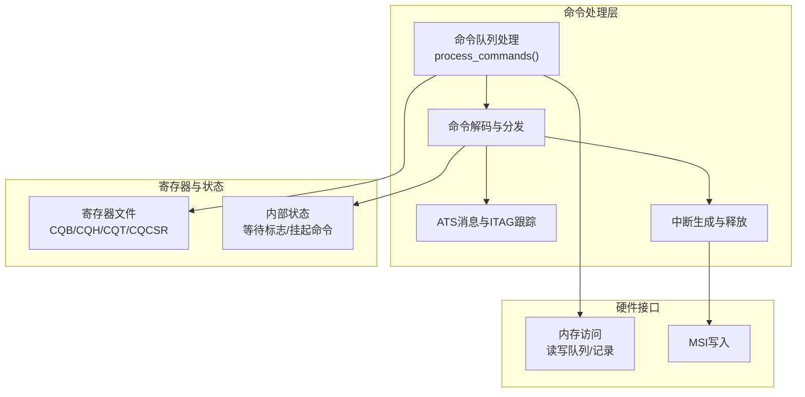
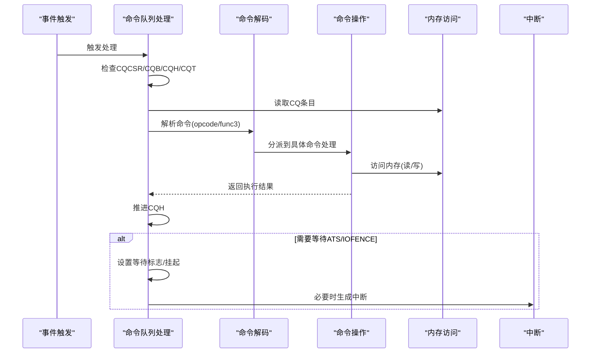
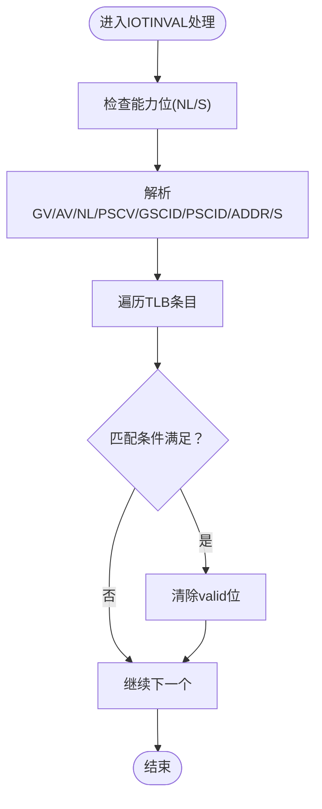
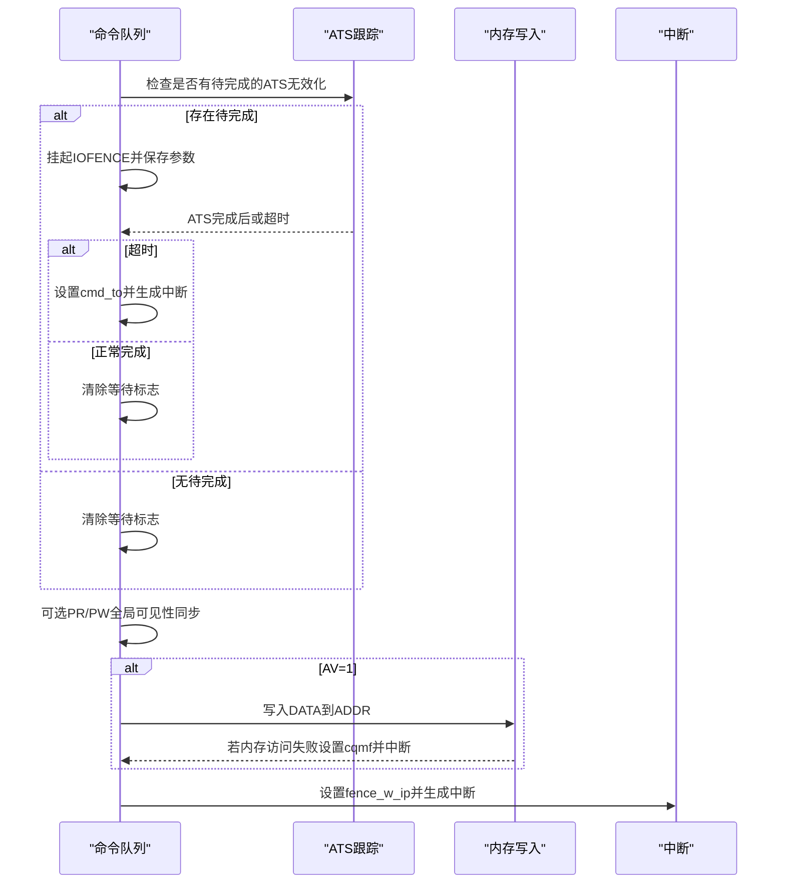
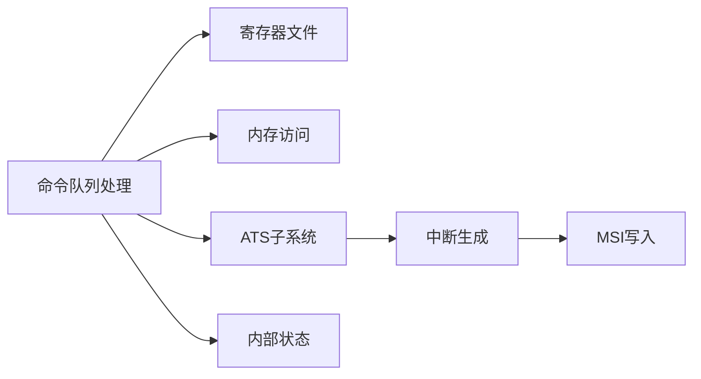

# 命令处理系统

<cite>
**本文档引用的文件**
- [iommu_command_queue.cc](file://iommu/iommu_command_queue.cc)
- [iommu_command_queue.hh](file://iommu/iommu_command_queue.hh)
- [iommu_registers.hh](file://iommu/iommu_registers.hh)
- [iommu_interrupt.hh](file://iommu/iommu_interrupt.hh)
- [iommu_interrupt.cc](file://iommu/iommu_interrupt.cc)
- [iommu_ats.hh](file://iommu/iommu_ats.hh)
- [iommu_ats.cc](file://iommu/iommu_ats.cc)
- [iommu_atc.hh](file://iommu/iommu_atc.hh)
- [iommu_struct.hh](file://iommu/iommu_struct.hh)
- [iommu_top.cc](file://iommu/iommu_top.cc)
- [iommu_top.hh](file://iommu/iommu_top.hh)
- [iommu_data_structures.hh](file://iommu/iommu_data_structures.hh)
- [iommu_utils.hh](file://iommu/iommu_utils.hh)
</cite>

## 目录
1. [引言](#引言)
2. [项目结构](#项目结构)
3. [核心组件](#核心组件)
4. [架构总览](#架构总览)
5. [详细组件分析](#详细组件分析)
6. [依赖关系分析](#依赖关系分析)
7. [性能考虑](#性能考虑)
8. [故障排查指南](#故障排查指南)
9. [结论](#结论)
10. [附录](#附录)

## 引言
本文件面向IOMMU命令处理系统，围绕命令队列（Command Queue, CQ）的架构与实现进行深入技术说明。内容涵盖命令接收、排队、调度与执行的完整流程；重点解析IOTINVAL、IOFENCE、IODIR、ATS等命令的处理逻辑；阐述命令状态管理、错误处理与超时机制；给出命令优先级与并发控制策略；并提供可定位到源码的调用路径与流程图，帮助读者快速理解与维护该子系统。

## 项目结构
IOMMU命令处理系统位于iommu目录下，主要由以下模块构成：
- 命令队列与命令解码：iommu_command_queue.cc/.hh
- 寄存器定义与CQ CSR：iommu_registers.hh
- 中断生成与释放：iommu_interrupt.hh/.cc
- ATS消息与ITAG跟踪：iommu_ats.hh/.cc
- 地址转换缓存（TLB/DC/PC）：iommu_atc.hh
- 结构体与全局状态：iommu_struct.hh
- 系统C++封装与事件驱动：iommu_top.cc/.hh
- 数据结构与设备上下文：iommu_data_structures.hh
- 工具函数：iommu_utils.hh

图表来源
- [iommu_command_queue.cc:7-276](file://iommu/iommu_command_queue.cc#L7-L276)
- [iommu_registers.hh:331-549](file://iommu/iommu_registers.hh#L331-L549)
- [iommu_interrupt.cc:27-106](file://iommu/iommu_interrupt.cc#L27-L106)
- [iommu_ats.cc:7-94](file://iommu/iommu_ats.cc#L7-L94)

章节来源
- [iommu_command_queue.cc:7-276](file://iommu/iommu_command_queue.cc#L7-L276)
- [iommu_registers.hh:331-549](file://iommu/iommu_registers.hh#L331-L549)
- [iommu_top.cc:215-222](file://iommu/iommu_top.cc#L215-L222)

## 核心组件
- 命令队列控制器：负责从CQB/CQH/CQT中读取命令，解码并分发到具体命令处理函数，推进CQH。
- 命令解码器：根据opcode与func3选择处理分支，校验保留位与能力位。
- ATS子系统：ITAG分配与跟踪，PCIe ATS消息发送与完成处理。
- 中断子系统：根据CQCSR状态生成MSI或线中断。
- 内存访问：统一通过read_memory/write_memory访问队列与记录，支持端序与PAS掩码检查。
- 全局状态：等待ATS完成、IOFENCE挂起、ITAG阻塞等标志位。

章节来源
- [iommu_command_queue.cc:7-276](file://iommu/iommu_command_queue.cc#L7-L276)
- [iommu_ats.cc:7-94](file://iommu/iommu_ats.cc#L7-L94)
- [iommu_interrupt.cc:27-106](file://iommu/iommu_interrupt.cc#L27-L106)
- [iommu_struct.hh:42-99](file://iommu/iommu_struct.hh#L42-L99)

## 架构总览
命令处理采用“轮询+事件驱动”的混合模式：
- 主循环在合适时机触发命令处理（SystemC线程事件），避免忙等。
- 命令处理函数按顺序从CQ读取命令，执行后推进CQH。
- 对于可能异步完成的命令（如ATS INVAL），通过ITAG跟踪与挂起状态协调后续处理。
- 错误与异常通过CQCSR状态位上报，并生成中断。

图表来源
- [iommu_command_queue.cc:7-276](file://iommu/iommu_command_queue.cc#L7-L276)
- [iommu_interrupt.cc:27-106](file://iommu/iommu_interrupt.cc#L27-L106)

## 详细组件分析

### 命令队列处理主流程
- 输入：iommu实例指针
- 关键步骤：
  - 校验CQCSR状态（cqon/cqen/cqmf/cmd_ill/cmd_to）、ITAG阻塞、IOFENCE等待
  - 若队列为空则直接返回
  - 从CQB基址与CQH索引计算物理地址，按端序读取16字节命令
  - 解码命令类型与功能码，调用对应处理函数
  - 执行成功后推进CQH至下一个位置
  - 非法命令设置cmd_ill并生成中断；内存访问失败设置cqmf并生成中断

章节来源
- [iommu_command_queue.cc:7-276](file://iommu/iommu_command_queue.cc#L7-L276)

### 命令格式与字段定义
命令结构体union包含iotinval/iofence/iodir/ats四类命令的字段布局，以及any通用字段。各字段用于表达命令的操作数与控制位，例如：
- IOTINVAL：GV/AV/NL/PSCV/GSCID/PSCID/ADDR/S等
- IOFENCE：PR/PW/AV/WI/PRG数据与地址
- IODIR：DV/DID/PID等
- ATS：PV/DSV/DSEG/RID/PID/Payload等

章节来源
- [iommu_command_queue.hh:38-109](file://iommu/iommu_command_queue.hh#L38-L109)

### IOTINVAL命令族（VMA/GVMA）
- 功能：使TLB中的地址翻译缓存失效，支持范围与非叶子PTE扩展（受能力位控制）
- 参数匹配：根据GV/PSCV/AV/S等参数决定匹配范围与粒度
- 实现要点：
  - 遍历TLB条目，按GV/GSCID/PSCV/PSCID/地址范围匹配
  - 清除匹配条目的valid位
  - 非叶子PTE缓存扩展在当前模型未实现，保留文档注释

图表来源
- [iommu_command_queue.cc:332-451](file://iommu/iommu_command_queue.cc#L332-L451)

章节来源
- [iommu_command_queue.cc:332-451](file://iommu/iommu_command_queue.cc#L332-L451)

### IODIR命令族（INVAL_DDT/INVAL_PDT）
- 功能：使DDT/PDT缓存失效，保证软件对目录表的修改被IOMMU观察到
- INVAL_DDT：按DV/DID匹配，清空对应DDT/PDT缓存项
- INVAL_PDT：仅支持DV=1且按DID/PID精确匹配

章节来源
- [iommu_command_queue.cc:278-329](file://iommu/iommu_command_queue.cc#L278-L329)

### IOFENCE命令族（IOFENCE_C）
- 功能：确保先前从CQ取出的命令已提交，可用于全局可见性同步与内存写入
- 关键行为：
  - 检查是否存在待完成的ATS无效化请求
  - 若存在则挂起自身，等待所有ATS完成或超时
  - 若ATS超时则设置cmd_to并生成中断
  - 可选PR/PW触发全局可见性同步
  - 当AV=1时向指定地址写入DATA（4字节对齐）
  - 完成后设置fence_w_ip并生成中断

图表来源
- [iommu_command_queue.cc:575-640](file://iommu/iommu_command_queue.cc#L575-L640)
- [iommu_ats.cc:34-94](file://iommu/iommu_ats.cc#L34-L94)

章节来源
- [iommu_command_queue.cc:575-640](file://iommu/iommu_command_queue.cc#L575-L640)
- [iommu_ats.cc:34-94](file://iommu/iommu_ats.cc#L34-L94)

### ATS命令族（INVAL/PRGR）
- INVAL：分配ITAG，向PCIe设备发送Invalidation Request消息；若无可用ITAG则阻塞CQ直至有空闲
- PRGR：发送Page Request Group Response消息
- ITAG跟踪：记录每个ITAG的忙碌状态、目标设备信息与完成计数

章节来源
- [iommu_command_queue.cc:541-573](file://iommu/iommu_command_queue.cc#L541-L573)
- [iommu_ats.cc:7-94](file://iommu/iommu_ats.cc#L7-L94)
- [iommu_ats.hh:47-96](file://iommu/iommu_ats.hh#L47-L96)

### 中断与错误处理
- 中断生成：当CQCSR中相应位被置位且未屏蔽时，生成MSI或线中断
- MSI写入：根据配置表写入MSI数据到目标地址，若访问失败报告特定故障
- 错误位：
  - cqmf：命令队列内存访问故障
  - cmd_to：命令执行超时（如ATS INVAL超时）
  - cmd_ill：非法或不支持的命令
  - fence_w_ip：IOFENCE.C完成标志

章节来源
- [iommu_interrupt.cc:27-106](file://iommu/iommu_interrupt.cc#L27-L106)
- [iommu_registers.hh:456-549](file://iommu/iommu_registers.hh#L456-L549)

### 并发控制与优先级
- 命令顺序：CQ按FIFO顺序取出命令，但执行可能乱序；CQH推进不代表已执行完成
- ATS并发：ITAG数量有限（当前实现为2），若无空闲ITAG则阻塞对应ATS命令
- IOFENCE挂起：当存在待完成ATS无效化请求时，IOFENCE会等待直至完成或超时
- 优先级策略：未发现显式优先级队列；当前实现以CQ顺序为主，ATS完成与IOFENCE完成作为异步屏障

章节来源
- [iommu_command_queue.cc:575-640](file://iommu/iommu_command_queue.cc#L575-L640)
- [iommu_ats.cc:34-94](file://iommu/iommu_ats.cc#L34-L94)

### 代码示例定位（调用路径）
- 命令处理入口：[process_commands:7-276](file://iommu/iommu_command_queue.cc#L7-L276)
- IOTINVAL处理：[do_iotinval_vma:332-451](file://iommu/iommu_command_queue.cc#L332-L451)、[do_iotinval_gvma:453-539](file://iommu/iommu_command_queue.cc#L453-L539)
- IODIR处理：[do_inval_ddt:278-306](file://iommu/iommu_command_queue.cc#L278-L306)、[do_inval_pdt:308-329](file://iommu/iommu_command_queue.cc#L308-L329)
- IOFENCE处理：[do_iofence_c:575-640](file://iommu/iommu_command_queue.cc#L575-L640)
- ATS消息发送：[do_ats_msg:541-573](file://iommu/iommu_command_queue.cc#L541-L573)、[send_msg_iommu_to_hb:149-200](file://iommu/iommu_ats.cc#L149-L200)
- 中断生成：[generate_interrupt:27-106](file://iommu/iommu_interrupt.cc#L27-L106)

## 依赖关系分析
- 命令队列处理依赖寄存器文件（CQB/CQH/CQT/CQCSR）与内存访问接口
- ATS子系统依赖ITAG跟踪与PCIe消息发送接口
- 中断子系统依赖MSI配置表与向桥接器发送消息的接口
- 全局状态结构体集中管理等待标志与挂起参数

图表来源
- [iommu_command_queue.cc:7-276](file://iommu/iommu_command_queue.cc#L7-L276)
- [iommu_ats.cc:149-200](file://iommu/iommu_ats.cc#L149-L200)
- [iommu_interrupt.cc:27-106](file://iommu/iommu_interrupt.cc#L27-L106)
- [iommu_struct.hh:42-99](file://iommu/iommu_struct.hh#L42-L99)

章节来源
- [iommu_command_queue.cc:7-276](file://iommu/iommu_command_queue.cc#L7-L276)
- [iommu_ats.cc:149-200](file://iommu/iommu_ats.cc#L149-L200)
- [iommu_interrupt.cc:27-106](file://iommu/iommu_interrupt.cc#L27-L106)
- [iommu_struct.hh:42-99](file://iommu/iommu_struct.hh#L42-L99)

## 性能考虑
- 命令队列大小：由CQB.log2szm1决定，队列越大对齐要求越高，需平衡带宽与延迟
- 内存访问：统一使用read_memory/write_memory，支持端序与PAS掩码检查，避免越界访问
- ATS并发：ITAG数量限制了并发无效化请求数量，建议合理规划设备与进程上下文
- IOFENCE开销：全局可见性同步与内存写入可能引入额外延迟，应尽量批量化
- 中断频率：频繁的错误位置位会导致中断风暴，应配合软件清理与重试策略

## 故障排查指南
- 命令队列内存故障（cqmf）：检查CQB基址对齐、页权限与PAS掩码；确认内存访问是否越界
- 命令超时（cmd_to）：关注ATS INVAL超时，检查设备可达性与PCIe链路稳定性
- 非法命令（cmd_ill）：核对保留位与能力位，确保命令编码符合规范
- IOFENCE未完成：检查是否存在待完成的ATS无效化请求，必要时延长超时或减少并发
- 中断未触发：确认CQCSR.cie与MSI配置表未屏蔽，检查MSI写入地址有效性

章节来源
- [iommu_registers.hh:456-549](file://iommu/iommu_registers.hh#L456-L549)
- [iommu_interrupt.cc:27-106](file://iommu/iommu_interrupt.cc#L27-L106)
- [iommu_command_queue.cc:575-640](file://iommu/iommu_command_queue.cc#L575-L640)

## 结论
IOMMU命令处理系统以CQ为核心，结合ATS与中断机制实现了可靠、有序的命令执行框架。通过严格的命令校验、内存访问保护与错误上报，系统在复杂I/O场景下具备良好的健壮性。建议在实际部署中：
- 合理配置CQ大小与对齐，避免内存访问异常
- 控制ATS并发与IOFENCE频率，降低全局同步开销
- 建立完善的错误恢复与重试策略，提升系统可用性

## 附录
- 关键数据结构与尺寸参考：
  - 命令条目大小：CQ_ENTRY_SZ（见头文件）
  - TLB/DC/PDT缓存大小：TLB_SIZE/DDT_CACHE_SIZE/PDT_CACHE_SIZE（见头文件）
  - ITAG最大数量：MAX_ITAGS（见头文件）

章节来源
- [iommu_command_queue.hh:111-124](file://iommu/iommu_command_queue.hh#L111-L124)
- [iommu_atc.hh:62-64](file://iommu/iommu_atc.hh#L62-L64)
- [iommu_ats.hh:93-93](file://iommu/iommu_ats.hh#L93-L93)