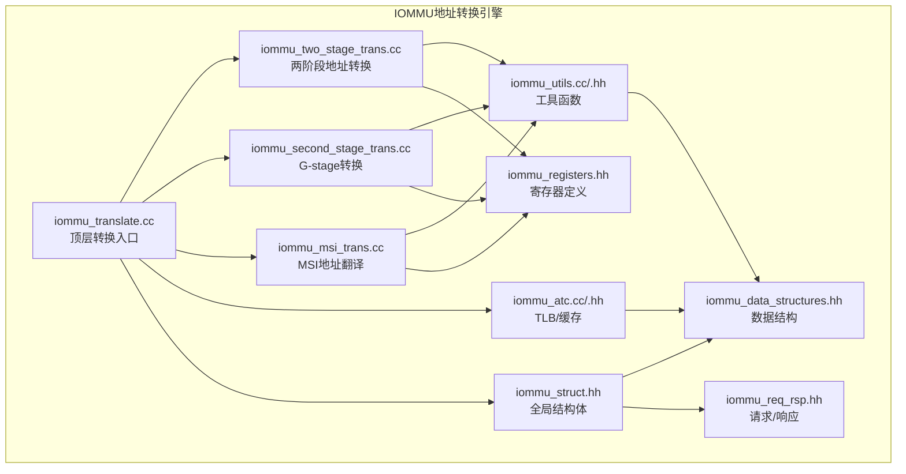
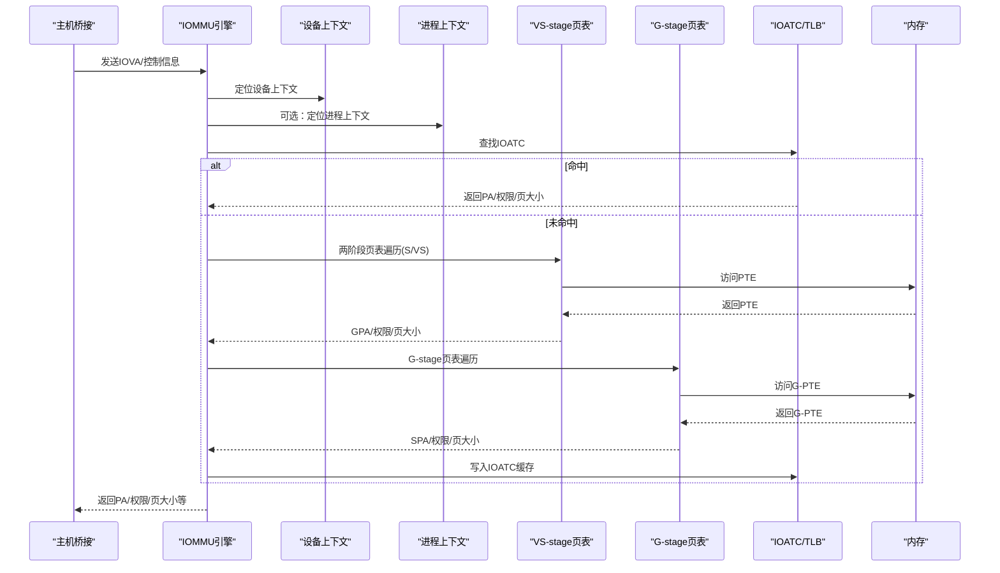
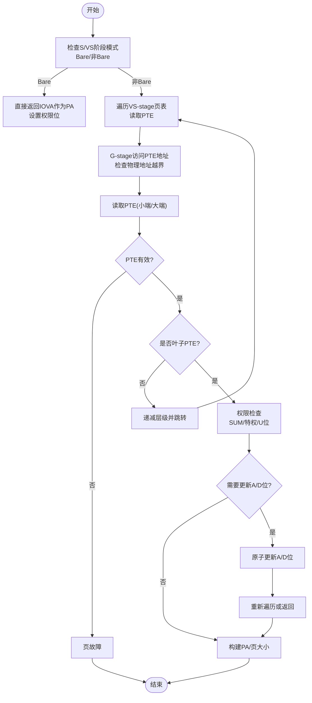
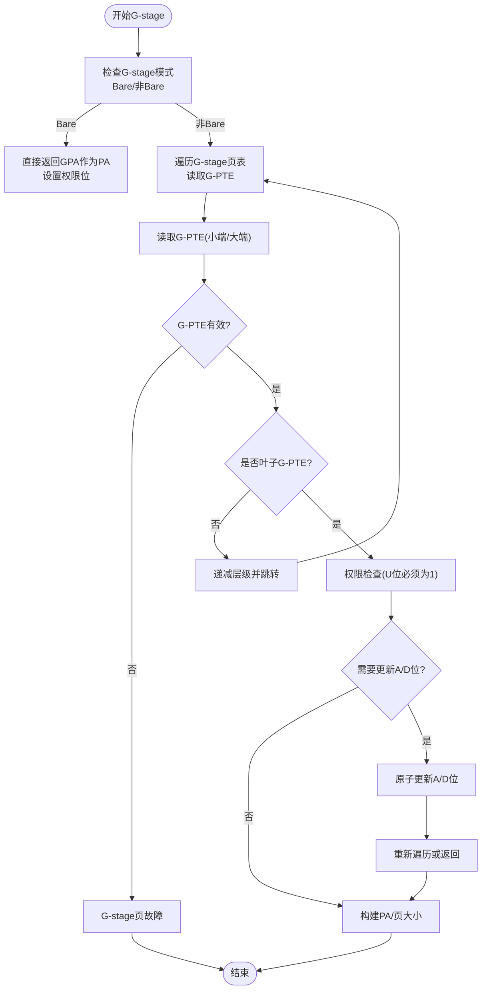
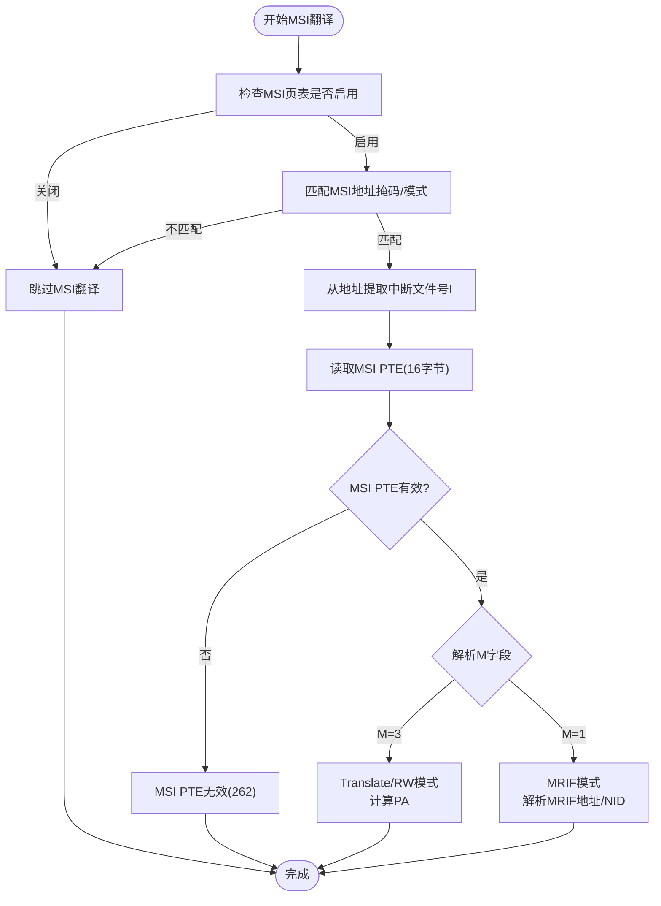
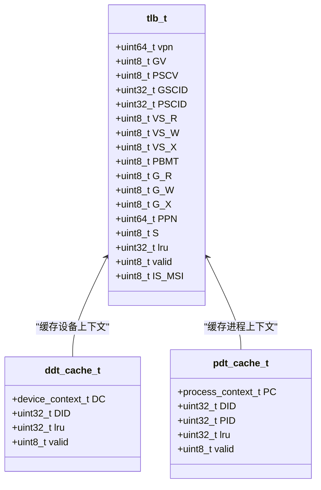
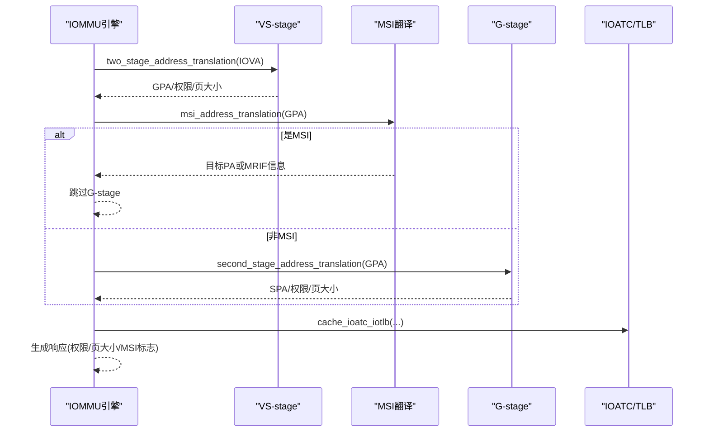
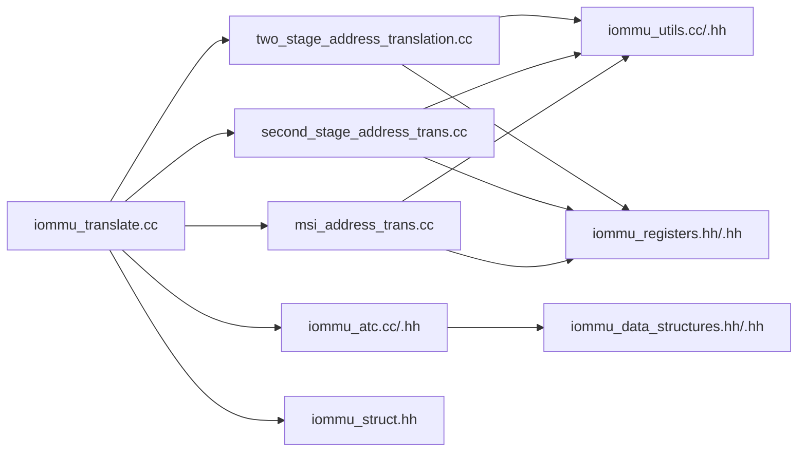

# 地址转换引擎

<cite>
**本文档引用的文件**
- [iommu_translate.cc](file://iommu/iommu_translate.cc)
- [iommu_translate.hh](file://iommu/iommu_translate.hh)
- [iommu_two_stage_trans.cc](file://iommu/iommu_two_stage_trans.cc)
- [iommu_second_stage_trans.cc](file://iommu/iommu_second_stage_trans.cc)
- [iommu_msi_trans.cc](file://iommu/iommu_msi_trans.cc)
- [iommu_atc.hh](file://iommu/iommu_atc.hh)
- [iommu_atc.cc](file://iommu/iommu_atc.cc)
- [iommu_utils.hh](file://iommu/iommu_utils.hh)
- [iommu_utils.cc](file://iommu/iommu_utils.cc)
- [iommu_struct.hh](file://iommu/iommu_struct.hh)
- [iommu_registers.hh](file://iommu/iommu_registers.hh)
- [iommu_data_structures.hh](file://iommu/iommu_data_structures.hh)
- [iommu_req_rsp.hh](file://iommu/iommu_req_rsp.hh)
</cite>

## 目录
1. [简介](#简介)
2. [项目结构](#项目结构)
3. [核心组件](#核心组件)
4. [架构总览](#架构总览)
5. [详细组件分析](#详细组件分析)
6. [依赖关系分析](#依赖关系分析)
7. [性能考虑](#性能考虑)
8. [故障排查指南](#故障排查指南)
9. [结论](#结论)
10. [附录](#附录)

## 简介
本技术文档面向IOMMU地址转换引擎，系统性阐述两阶段地址转换的实现原理与流程，包括VS-stage（S/VS）与G-stage的功能与转换过程；深入解析页表管理机制，覆盖Sv32/Sv39/Sv48/Sv57以及对应的G-stage模式Sv32x4/Sv39x4/Sv48x4/Sv57x4；详解MSI地址翻译的实现细节与应用场景；说明地址转换缓存机制、TLB管理与转换优化策略，并提供代码示例路径以展示地址转换函数的调用与配置。

## 项目结构
IOMMU地址转换引擎位于`iommu/`目录下，采用模块化设计：
- 核心转换逻辑：`iommu_translate.cc`（顶层入口）、`iommu_two_stage_trans.cc`（VS-stage/G-stage通用两阶段）、`iommu_second_stage_trans.cc`（G-stage专用）
- MSI翻译：`iommu_msi_trans.cc`
- 缓存与TLB：`iommu_atc.cc`/`iommu_atc.hh`
- 工具函数：`iommu_utils.cc`/`iommu_utils.hh`
- 数据结构与寄存器定义：`iommu_struct.hh`、`iommu_registers.hh`、`iommu_data_structures.hh`、`iommu_req_rsp.hh`

图表来源
- [iommu_translate.cc:1-732](file://iommu/iommu_translate.cc#L1-L732)
- [iommu_two_stage_trans.cc:1-600](file://iommu/iommu_two_stage_trans.cc#L1-L600)
- [iommu_second_stage_trans.cc:1-424](file://iommu/iommu_second_stage_trans.cc#L1-L424)
- [iommu_msi_trans.cc:1-294](file://iommu/iommu_msi_trans.cc#L1-L294)
- [iommu_atc.cc:1-233](file://iommu/iommu_atc.cc#L1-L233)
- [iommu_utils.cc:1-18](file://iommu/iommu_utils.cc#L1-L18)
- [iommu_struct.hh:1-102](file://iommu/iommu_struct.hh#L1-L102)
- [iommu_registers.hh:1-987](file://iommu/iommu_registers.hh#L1-L987)
- [iommu_data_structures.hh:1-415](file://iommu/iommu_data_structures.hh#L1-L415)
- [iommu_req_rsp.hh:1-105](file://iommu/iommu_req_rsp.hh#L1-L105)

章节来源
- [iommu_translate.cc:1-732](file://iommu/iommu_translate.cc#L1-L732)
- [iommu_struct.hh:1-102](file://iommu/iommu_struct.hh#L1-L102)

## 核心组件
- 顶层转换函数：`iommu_translate_iova()`负责设备上下文/进程上下文定位、两阶段转换、MSI翻译、G-stage转换、TLB缓存与响应生成。
- 两阶段转换：`two_stage_address_translation()`实现S/VS-stage页表遍历、权限检查、A/D位原子更新、NAPOT处理与超级页大小计算。
- G-stage转换：`second_stage_address_translation()`实现G-stage页表遍历、权限检查、A/D位原子更新、NAPOT处理与超级页大小计算。
- MSI翻译：`msi_address_translation()`识别MSI写入、解析MSI PTE（Translate/RW或MRIF模式），生成目标物理地址或MRIF信息。
- TLB/缓存：`lookup_ioatc_iotlb()`/`cache_ioatc_iotlb()`实现IOATC查找与缓存，支持NAPOT范围匹配与权限校验。
- 工具函数：`get_bits()`位提取、`match_address_range()`NAPOT范围匹配。

章节来源
- [iommu_translate.cc:8-732](file://iommu/iommu_translate.cc#L8-L732)
- [iommu_translate.hh:95-130](file://iommu/iommu_translate.hh#L95-L130)
- [iommu_two_stage_trans.cc:8-600](file://iommu/iommu_two_stage_trans.cc#L8-L600)
- [iommu_second_stage_trans.cc:7-424](file://iommu/iommu_second_stage_trans.cc#L7-L424)
- [iommu_msi_trans.cc:19-294](file://iommu/iommu_msi_trans.cc#L19-L294)
- [iommu_atc.cc:149-233](file://iommu/iommu_atc.cc#L149-L233)
- [iommu_utils.cc:7-18](file://iommu/iommu_utils.cc#L7-L18)

## 架构总览
IOMMU地址转换引擎遵循两阶段地址转换模型：
- VS-stage（S/VS）：根据设备/进程上下文选择S-stage或VS-stage页表，执行页表遍历与权限检查，必要时原子更新A/D位。
- G-stage：在两阶段模式下，将S/VS-stage输出的中间地址（GPA）进一步转换为SPA。
- MSI翻译：当检测到MSI写入时，使用MSI页表进行翻译，支持普通翻译模式与MRIF模式。
- TLB缓存：IOATC缓存已知的地址映射，命中则直接返回结果，未命中触发页表遍历。

图表来源
- [iommu_translate.cc:332-492](file://iommu/iommu_translate.cc#L332-L492)
- [iommu_two_stage_trans.cc:8-600](file://iommu/iommu_two_stage_trans.cc#L8-L600)
- [iommu_second_stage_trans.cc:7-424](file://iommu/iommu_second_stage_trans.cc#L7-L424)
- [iommu_atc.cc:149-233](file://iommu/iommu_atc.cc#L149-L233)

## 详细组件分析

### 两阶段地址转换（VS-stage/G-stage）
VS-stage与G-stage共享核心算法：页表遍历、权限检查、A/D位原子更新、NAPOT处理与超级页大小计算。区别在于根页表指针来源（VS-stage来自设备/进程上下文，G-stage来自设备上下文的G-stage配置）。

图表来源
- [iommu_two_stage_trans.cc:8-600](file://iommu/iommu_two_stage_trans.cc#L8-L600)

章节来源
- [iommu_two_stage_trans.cc:8-600](file://iommu/iommu_two_stage_trans.cc#L8-L600)

### G-stage地址转换（G-stage）
G-stage转换与VS-stage类似，但根页表由设备上下文的`iohgatp`决定，且G-stage PTE的U位始终要求为1，表示用户态访问权限。

图表来源
- [iommu_second_stage_trans.cc:7-424](file://iommu/iommu_second_stage_trans.cc#L7-L424)

章节来源
- [iommu_second_stage_trans.cc:7-424](file://iommu/iommu_second_stage_trans.cc#L7-L424)

### MSI地址翻译
MSI地址翻译用于识别设备发出的MSI写入，并将其路由到虚拟中断文件或MRIF。流程包括：识别MSI地址、提取中断文件号、读取MSI PTE、解析Translate/RW或MRIF模式并生成目标地址。

图表来源
- [iommu_msi_trans.cc:19-294](file://iommu/iommu_msi_trans.cc#L19-L294)

章节来源
- [iommu_msi_trans.cc:19-294](file://iommu/iommu_msi_trans.cc#L19-L294)

### TLB与缓存机制
IOATC/TLB缓存包含标签（VPN、GV/PSCV、GSCID/PSCID）、权限位（VS/G阶段R/W/X/D/U/G）、页属性（PPN、S、IS_MSI）。查找时进行NAPOT范围匹配与权限校验，命中后更新LRU；未命中触发页表遍历并写入缓存。

图表来源
- [iommu_atc.hh:9-51](file://iommu/iommu_atc.hh#L9-L51)
- [iommu_atc.cc:96-147](file://iommu/iommu_atc.cc#L96-L147)

章节来源
- [iommu_atc.hh:70-97](file://iommu/iommu_atc.hh#L70-L97)
- [iommu_atc.cc:96-233](file://iommu/iommu_atc.cc#L96-L233)
- [iommu_utils.cc:7-18](file://iommu/iommu_utils.cc#L7-L18)

### 页表管理与格式支持
引擎支持以下页表格式：
- VS-stage：Sv32（SXL=1时）、Sv39（SXL=0时）、Sv48（SXL=0时）、Sv57（SXL=0时）
- G-stage：Sv32x4（GXL=1时）、Sv39x4（GXL=0时）、Sv48x4（GXL=0时）、Sv57x4（GXL=0时）

页表遍历遵循RISC-V特权规范：逐级读取PTE、检查有效性与保留位、处理叶子PTE（权限、A/D位、NAPOT、超级页）、非叶子PTE（递减层级、全局标志传播）。

章节来源
- [iommu_two_stage_trans.cc:84-139](file://iommu/iommu_two_stage_trans.cc#L84-L139)
- [iommu_second_stage_trans.cc:77-113](file://iommu/iommu_second_stage_trans.cc#L77-L113)
- [iommu_registers.hh:194-249](file://iommu/iommu_registers.hh#L194-L249)

### 转换流程与响应生成
顶层函数`iommu_translate_iova()`按步骤执行：
1. 设备/进程上下文定位与事务类型分类
2. 模式检查（Off/Bare/1LVL/2LVL）
3. 两阶段地址转换（VS-stage）
4. MSI地址翻译（可选）
5. G-stage地址转换（若非MSI）
6. 权限合并与PBMT选择
7. TLB缓存写入（条件满足）
8. 响应生成（PA、权限、页大小、MSI/MRIF信息）

图表来源
- [iommu_translate.cc:332-492](file://iommu/iommu_translate.cc#L332-L492)
- [iommu_msi_trans.cc:19-294](file://iommu/iommu_msi_trans.cc#L19-L294)

章节来源
- [iommu_translate.cc:8-732](file://iommu/iommu_translate.cc#L8-L732)

## 依赖关系分析
- 头文件依赖：各源文件通过`iommu_struct.hh`统一包含寄存器、数据结构、请求/响应等头文件，形成清晰的模块边界。
- 函数依赖：
  - `iommu_translate.cc`依赖`two_stage_address_translation()`、`second_stage_address_translation()`、`msi_address_translation()`、`lookup_ioatc_iotlb()`、`cache_ioatc_iotlb()`。
  - `two_stage_address_translation()`与`second_stage_address_translation()`共享工具函数`get_bits()`与`match_address_range()`。
  - `msi_address_translation()`依赖设备上下文中的MSI配置字段。

图表来源
- [iommu_translate.cc:6-7](file://iommu/iommu_translate.cc#L6-L7)
- [iommu_two_stage_trans.cc:6-7](file://iommu/iommu_two_stage_trans.cc#L6-L7)
- [iommu_second_stage_trans.cc:6-7](file://iommu/iommu_second_stage_trans.cc#L6-L7)
- [iommu_msi_trans.cc:6-7](file://iommu/iommu_msi_trans.cc#L6-L7)
- [iommu_atc.cc:5-6](file://iommu/iommu_atc.cc#L5-L6)
- [iommu_utils.cc:5-6](file://iommu/iommu_utils.cc#L5-L6)
- [iommu_struct.hh:26-37](file://iommu/iommu_struct.hh#L26-L37)

章节来源
- [iommu_struct.hh:26-37](file://iommu/iommu_struct.hh#L26-L37)

## 性能考虑
- TLB命中优先：IOATC/TLB命中可避免页表遍历，显著降低延迟。可通过配置`fill_ats_trans_in_ioatc`控制ATS翻译缓存策略。
- A/D位原子更新：在SADE/GADE使能时，原子更新A/D位减少重复遍历与缓存失效开销。
- NAPOT与超级页：合理利用NAPOT与超级页可提升缓存效率与带宽利用率。
- 端序一致性：确保PTE访问端序与fctl配置一致，避免额外的转换开销。
- 事件计数：通过事件计数接口统计页表遍历次数与TLB缺失，辅助性能分析与优化。

## 故障排查指南
常见故障与处理：
- 页故障（Instruction/Read/Write/AMO page fault）：检查PTE有效性、权限位、地址对齐与NAPOT编码。
- 访问故障（Instruction/Read/Write/AMO access fault）：检查PMA/PMP限制与物理地址越界。
- G-stage页故障（Instruction/Read/Write/AMO guest page fault）：检查G-stagePTE有效性与U位要求。
- MSI相关故障（MSI PTE load/access fault、MSI PTE not valid、MSI PTE misconfigured、MSI PT data corruption）：核对MSI页表配置与PTE编码。
- ATS特殊处理：某些配置错误导致Unsupported Request或Completer Abort，需检查ATS相关寄存器与模式。

章节来源
- [iommu_translate.cc:504-731](file://iommu/iommu_translate.cc#L504-L731)
- [iommu_two_stage_trans.cc:504-599](file://iommu/iommu_two_stage_trans.cc#L504-L599)
- [iommu_second_stage_trans.cc:124-423](file://iommu/iommu_second_stage_trans.cc#L124-L423)
- [iommu_msi_trans.cc:136-293](file://iommu/iommu_msi_trans.cc#L136-L293)

## 结论
IOMMU地址转换引擎通过清晰的两阶段模型与完善的缓存机制，实现了高性能、可扩展的地址转换服务。VS-stage与G-stage分别承担S/VS与GPA到SPA的转换职责，MSI翻译提供了灵活的中断路由能力。通过TLB缓存、A/D位原子更新与NAPOT/超级页优化，系统在保证正确性的前提下兼顾了性能与可维护性。

## 附录
- 代码示例路径（仅列出路径，不展示具体代码内容）：
  - 两阶段地址转换入口：[iommu_translate.cc:8-732](file://iommu/iommu_translate.cc#L8-L732)
  - VS-stage页表遍历：[iommu_two_stage_trans.cc:8-600](file://iommu/iommu_two_stage_trans.cc#L8-L600)
  - G-stage页表遍历：[iommu_second_stage_trans.cc:7-424](file://iommu/iommu_second_stage_trans.cc#L7-L424)
  - MSI地址翻译：[iommu_msi_trans.cc:19-294](file://iommu/iommu_msi_trans.cc#L19-L294)
  - TLB查找与缓存：[iommu_atc.cc:149-233](file://iommu/iommu_atc.cc#L149-L233)
  - 工具函数：[iommu_utils.cc:7-18](file://iommu/iommu_utils.cc#L7-L18)
  - 数据结构与寄存器：[iommu_data_structures.hh:1-415](file://iommu/iommu_data_structures.hh#L1-L415)、[iommu_registers.hh:1-987](file://iommu/iommu_registers.hh#L1-L987)
  - 请求/响应结构：[iommu_req_rsp.hh:1-105](file://iommu/iommu_req_rsp.hh#L1-L105)