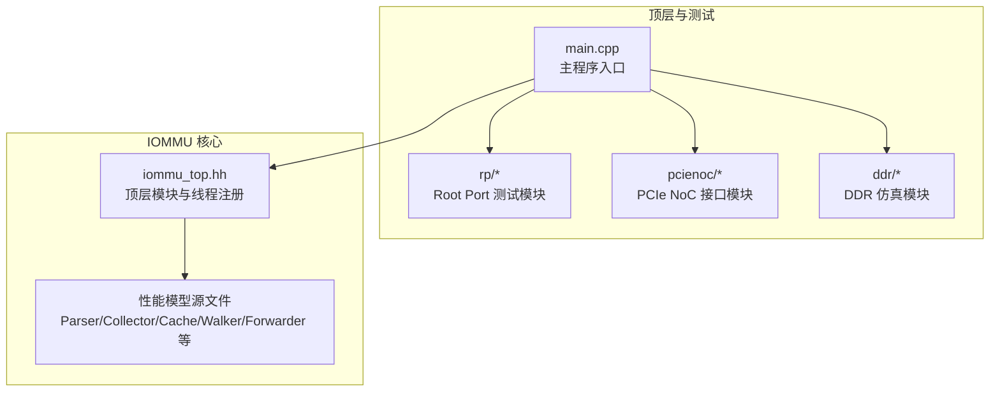
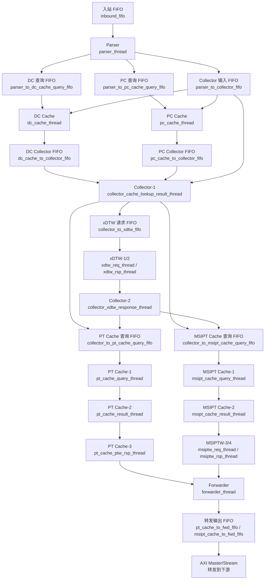
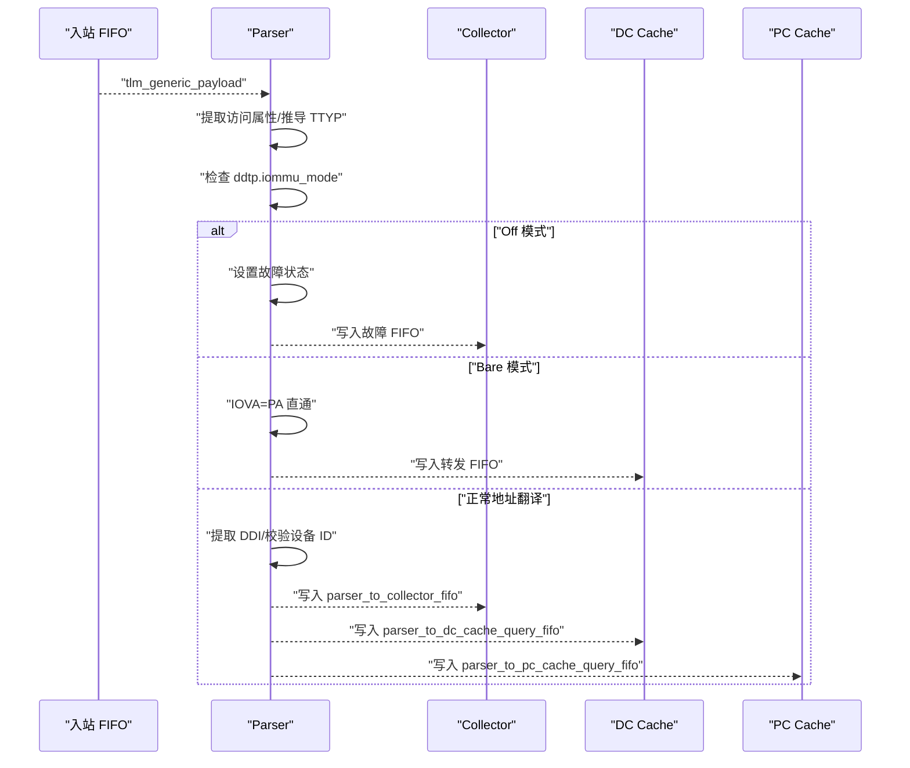
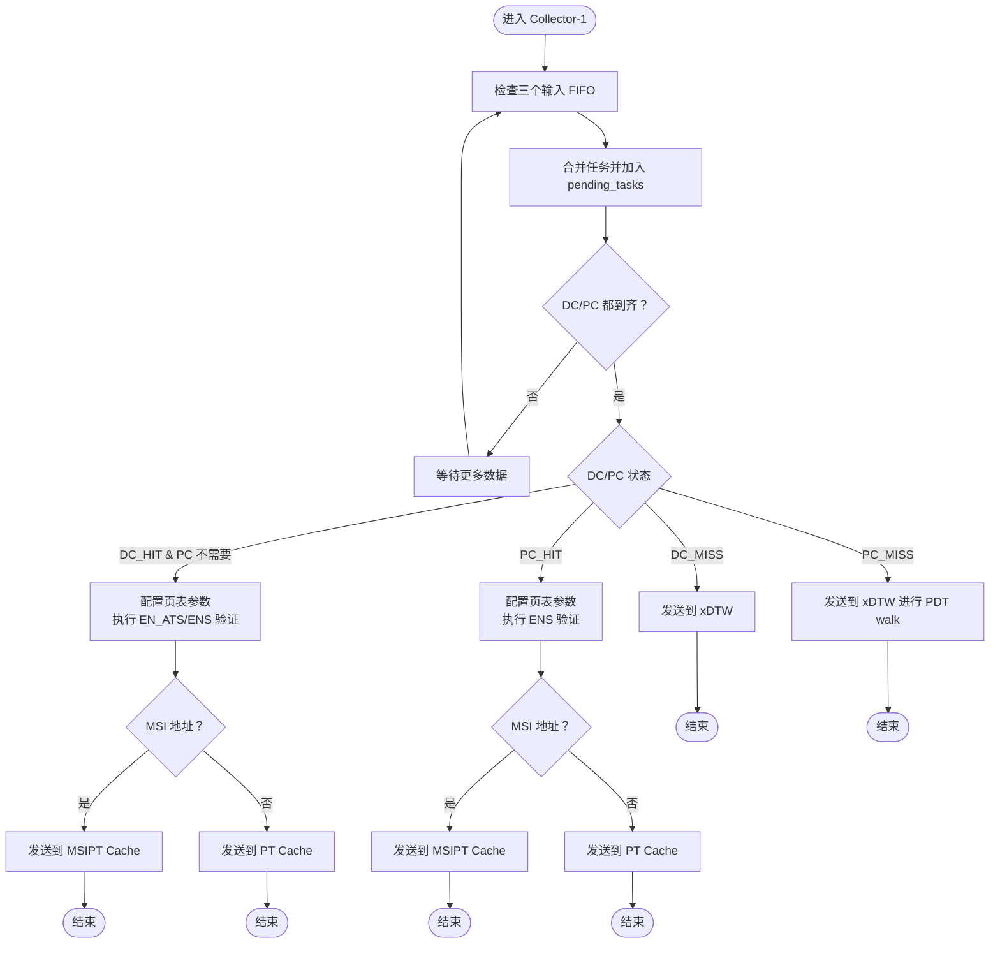
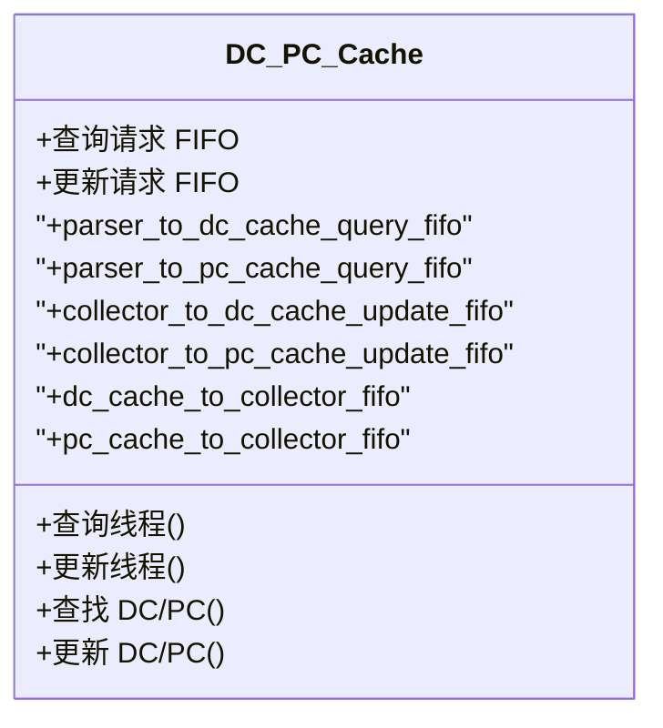
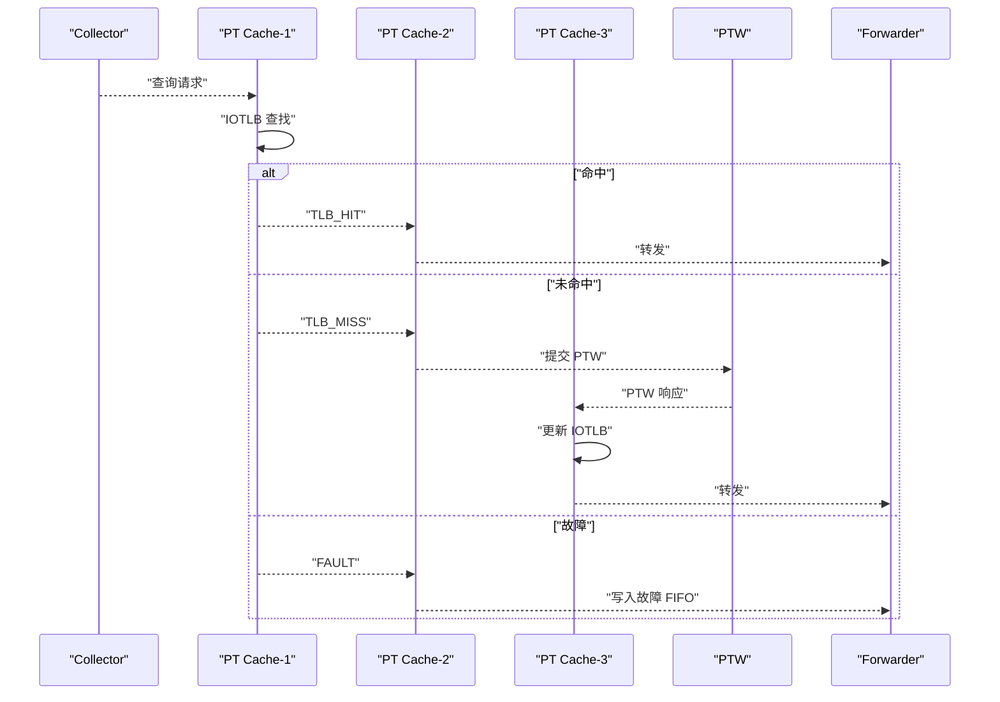
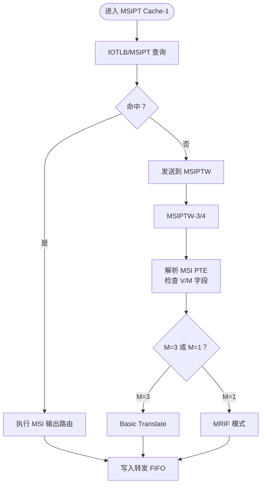
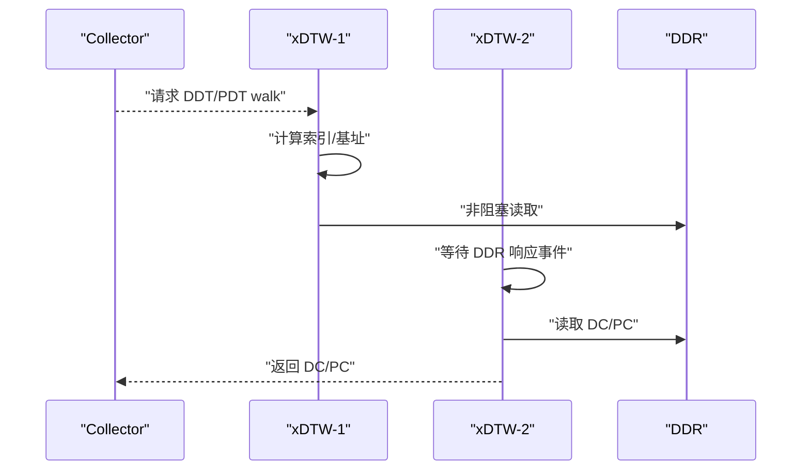
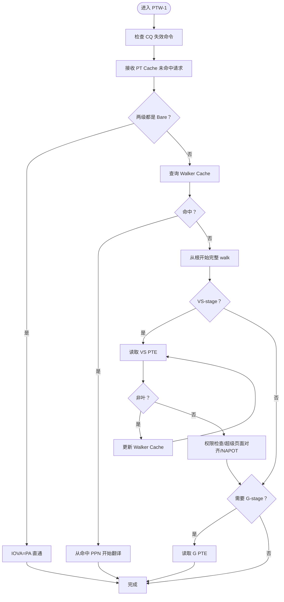
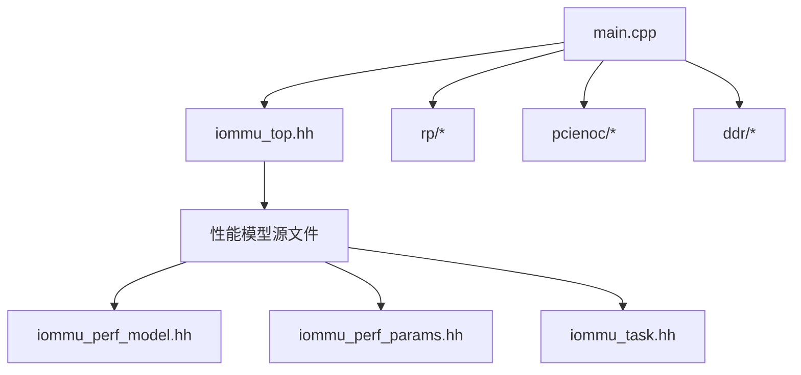

# 性能模型

<cite>
**本文引用的文件**   
- [README.md](file://README.md)
- [PERF_MODEL_IMPLEMENTATION.md](file://PERF_MODEL_IMPLEMENTATION.md)
- [Makefile](file://Makefile)
- [main.cpp](file://main.cpp)
- [iommu_top.hh](file://iommu/iommu_top.hh)
- [iommu_task.hh](file://iommu/iommu_task.hh)
- [iommu_perf_model.hh](file://iommu/iommu_perf_model.hh)
- [iommu_perf_params.hh](file://iommu/iommu_perf_params.hh)
- [iommu_perf_parser.cc](file://iommu/iommu_perf_parser.cc)
- [iommu_perf_collector.cc](file://iommu/iommu_perf_collector.cc)
- [iommu_perf_dc_pc_cache.cc](file://iommu/iommu_perf_dc_pc_cache.cc)
- [iommu_perf_pt_cache.cc](file://iommu/iommu_perf_pt_cache.cc)
- [iommu_perf_msipt_cache.cc](file://iommu/iommu_perf_msipt_cache.cc)
- [iommu_perf_xdtw.cc](file://iommu/iommu_perf_xdtw.cc)
- [iommu_perf_ptw.cc](file://iommu/iommu_perf_ptw.cc)
</cite>

## 目录
1. [简介](#简介)
2. [项目结构](#项目结构)
3. [核心组件](#核心组件)
4. [架构总览](#架构总览)
5. [详细组件分析](#详细组件分析)
6. [依赖关系分析](#依赖关系分析)
7. [性能考量](#性能考量)
8. [故障排查指南](#故障排查指南)
9. [结论](#结论)
10. [附录](#附录)

## 简介
本项目是一个基于 SystemC 的 RISC-V IOMMU（输入/输出内存管理单元）性能模型，严格遵循 SPEC v4 规范，实现了完整的地址翻译流水线，包括 Parser、Collector、DC/PC Cache、xDTW、PT Cache、PTW、MSIPT Cache、Forwarder/Fault/CQ 等模块。该模型采用多线程并行设计，通过 FIFO 通道连接各模块，支持非阻塞 DDR 访问、Walker Cache、MSI 地址翻译、两级地址翻译（VS-stage/G-stage）以及缓存失效机制，可用于评估 IOMMU 在不同工作负载下的性能表现。

## 项目结构
项目采用模块化组织方式，核心 IOMMU 实现位于 iommu 子目录，顶层模块负责系统级绑定与线程注册；测试模块位于 rp、pcienoc、ddr 目录；主程序入口位于根目录。

图表来源
- [main.cpp:38-99](file://main.cpp#L38-L99)
- [iommu_top.hh:126-207](file://iommu/iommu_top.hh#L126-L207)

章节来源
- [README.md:63-76](file://README.md#L63-L76)
- [Makefile:29-61](file://Makefile#L29-L61)

## 核心组件
- 顶层模块 iommu_top：负责所有线程的注册与调度、FIFO 声明、Socket 绑定、DDR 响应回调、AXI ID 分配器、Walker Cache 实例以及全局互斥锁。
- 任务上下文 iommu_task：封装一次翻译请求的完整生命周期，包含状态机、Walker 上下文、DDR 请求跟踪、MSI/MRIF 标志、故障信息等。
- 性能模型工具 iommu_perf_model：提供设备 ID 提取、DDT/PDT 索引计算、VPN 索引计算、MSI 地址判断、PTE 解析辅助等通用函数。
- 性能参数 iommu_perf_params：集中定义 FIFO 深度、缓存容量与关联度、AXI ID 数量、DDR 性能参数、模块处理延迟、系统上限等。

章节来源
- [iommu_top.hh:22-62](file://iommu/iommu_top.hh#L22-L62)
- [iommu_task.hh:98-208](file://iommu/iommu_task.hh#L98-L208)
- [iommu_perf_model.hh:16-150](file://iommu/iommu_perf_model.hh#L16-L150)
- [iommu_perf_params.hh:6-94](file://iommu/iommu_perf_params.hh#L6-L94)

## 架构总览
IOMMU 性能模型采用流水线式并行架构，请求从入站 FIFO 进入 Parser，随后并行查询 DC/PC Cache，并根据结果路由到 Collector。Collector 决策是否需要 xDTW（DDT/PDT walk）、PT Cache（IOTLB）或 MSIPT Cache。PT Cache 未命中则提交 PTW（含 Walker Cache），MSIPT Cache 未命中则提交 MSIPTW。最终翻译结果经 Forwarder 转发，故障经 Fault/CQ Proc 处理。

图表来源
- [iommu_top.hh:63-152](file://iommu/iommu_top.hh#L63-L152)
- [iommu_perf_parser.cc:13-199](file://iommu/iommu_perf_parser.cc#L13-L199)
- [iommu_perf_collector.cc:13-318](file://iommu/iommu_perf_collector.cc#L13-L318)
- [iommu_perf_dc_pc_cache.cc:13-141](file://iommu/iommu_perf_dc_pc_cache.cc#L13-L141)
- [iommu_perf_pt_cache.cc:13-169](file://iommu/iommu_perf_pt_cache.cc#L13-L169)
- [iommu_perf_msipt_cache.cc:14-234](file://iommu/iommu_perf_msipt_cache.cc#L14-L234)
- [iommu_perf_xdtw.cc:14-232](file://iommu/iommu_perf_xdtw.cc#L14-L232)
- [iommu_perf_ptw.cc:15-500](file://iommu/iommu_perf_ptw.cc#L15-L500)

## 详细组件分析

### Parser 组件
职责：解析入站请求，判断请求类型（PRI/Page Request）、检查 IOMMU 模式（Off/Bare）、提取 DDI 索引、校验设备 ID 宽度、构造任务上下文并分发到 Collector、DC/PC Cache 查询以及 PRI 队列。

图表来源
- [iommu_perf_parser.cc:13-199](file://iommu/iommu_perf_parser.cc#L13-L199)

章节来源
- [iommu_perf_parser.cc:13-199](file://iommu/iommu_perf_parser.cc#L13-L199)

### Collector 组件
职责：汇聚 DC/PC Cache 查询结果，判断是否需要 xDTW（DDT/PDT walk），执行配置验证（EN_ATS/ENS），判断 MSI 地址并路由到 MSIPT Cache 或 PT Cache；处理 xDTW 返回结果，更新 DC/PC Cache。

图表来源
- [iommu_perf_collector.cc:13-318](file://iommu/iommu_perf_collector.cc#L13-L318)

章节来源
- [iommu_perf_collector.cc:13-318](file://iommu/iommu_perf_collector.cc#L13-L318)

### DC/PC Cache 组件
职责：并行查询与更新 DC/PC Cache，命中/未命中分别标记任务状态并通过 FIFO 返回 Collector；支持查询与更新两条路径。

图表来源
- [iommu_perf_dc_pc_cache.cc:13-141](file://iommu/iommu_perf_dc_pc_cache.cc#L13-L141)
- [iommu_top.hh:69-81](file://iommu/iommu_top.hh#L69-L81)

章节来源
- [iommu_perf_dc_pc_cache.cc:13-141](file://iommu/iommu_perf_dc_pc_cache.cc#L13-L141)

### PT Cache（IOTLB）组件
职责：IOTLB 查询命中/未命中/故障处理；命中直接转发，未命中提交 PTW；接收 PTW 响应更新 IOTLB 并转发。

图表来源
- [iommu_perf_pt_cache.cc:13-169](file://iommu/iommu_perf_pt_cache.cc#L13-L169)
- [iommu_perf_ptw.cc:15-500](file://iommu/iommu_perf_ptw.cc#L15-L500)

章节来源
- [iommu_perf_pt_cache.cc:13-169](file://iommu/iommu_perf_pt_cache.cc#L13-L169)

### MSIPT Cache 组件
职责：MSI 页表缓存查询命中/未命中；命中直接转发，未命中提交 MSIPTW；解析 MSI PTE，判断 M 字段（Basic Translate 或 MRIF 模式）。

图表来源
- [iommu_perf_msipt_cache.cc:14-234](file://iommu/iommu_perf_msipt_cache.cc#L14-L234)

章节来源
- [iommu_perf_msipt_cache.cc:14-234](file://iommu/iommu_perf_msipt_cache.cc#L14-L234)

### xDTW 组件
职责：DDT/PDT radix tree walk，读取设备/进程上下文，返回 Collector 更新 DC/PC Cache 并继续后续翻译。

图表来源
- [iommu_perf_xdtw.cc:14-232](file://iommu/iommu_perf_xdtw.cc#L14-L232)

章节来源
- [iommu_perf_xdtw.cc:14-232](file://iommu/iommu_perf_xdtw.cc#L14-L232)

### PTW 组件（含 Walker Cache）
职责：VS-stage/G-stage 页表 walk，支持 Walker Cache（PTWc_1/2/3）命中加速；处理 PTE 叶/非叶节点、权限检查、超级页面对齐、NAPOT、嵌套 G-stage 翻译。

图表来源
- [iommu_perf_ptw.cc:15-500](file://iommu/iommu_perf_ptw.cc#L15-L500)

章节来源
- [iommu_perf_ptw.cc:15-500](file://iommu/iommu_perf_ptw.cc#L15-L500)

## 依赖关系分析
- 模块耦合：Parser 与 Collector 之间通过多个 FIFO 连接，实现解耦；Collector 与 DC/PC Cache、xDTW、PT Cache、MSIPT Cache 之间也通过 FIFO 解耦。
- 顶层绑定：main.cpp 中将 iommu_top 的 initiator sockets 与 DDR 模块的 target sockets 绑定，RP 与 PCIe NoC 模块同样绑定，形成端到端数据通路。
- 外部依赖：SystemC 2.3.x、GCC 7+（C++11 支持），Makefile 指定编译选项与链接库。

图表来源
- [main.cpp:38-99](file://main.cpp#L38-L99)
- [Makefile:29-61](file://Makefile#L29-L61)

章节来源
- [main.cpp:38-99](file://main.cpp#L38-L99)
- [Makefile:29-61](file://Makefile#L29-L61)

## 性能考量
- 并行度：Parser、Collector、DC/PC Cache、PT Cache、MSIPT Cache、xDTW、PTW、Forwarder/Fault/CQ Proc 共计 20 个线程，充分利用并发提升吞吐。
- 缓存层次：DC Cache（64 条目）、PC Cache（32 条目）、PT Cache（IOTLB 256 条目）、MSIPT Cache（16 条目），配合 Walker Cache（PTWc_1/2/3）降低页表 walk 成本。
- 非阻塞访问：所有 DDR 请求使用非阻塞接口，配合 outstanding 表与响应队列，最大化链路利用率。
- FIFO 深度：依据 SPEC v4 参数设定 FIFO 深度，平衡延迟与带宽，避免拥塞。
- 处理延迟：各模块延迟参数（ns）用于仿真精度控制，便于性能分析与优化。

章节来源
- [PERF_MODEL_IMPLEMENTATION.md:180-194](file://PERF_MODEL_IMPLEMENTATION.md#L180-L194)
- [iommu_perf_params.hh:69-87](file://iommu/iommu_perf_params.hh#L69-L87)

## 故障排查指南
- 调试开关：通过 DEBUG 宏开启详细日志输出，包括 Parser、Collector、DC/PC Cache、PT Cache、MSIPT Cache、xDTW、PTW、Forwarder、Fault/CQ Proc 等模块。
- 常见故障原因：
  - IOMMU 模式不支持：Off 模式下拒绝翻译请求；Bare 模式下不允许 Translated/ATS 请求。
  - 设备 ID 宽度超限：根据模式计算 DDI，超出范围触发故障。
  - DDT/PDT 无效：walk 返回 V=0 导致故障。
  - PTE 无效/权限不足：PTE V=0 或访问权限不满足导致故障。
  - MSI PTE 无效/模式非法：MSIPTW 返回 V=0 或 M 字段非法。
- 排查建议：
  - 启用相应模块 DEBUG 宏，观察任务状态流转与 FIFO 深度变化。
  - 检查 AXI ID 分配与释放，确保 outstanding 表一致性。
  - 核对 Walker Cache 命中情况，必要时清空缓存验证路径。

章节来源
- [PERF_MODEL_IMPLEMENTATION.md:167-179](file://PERF_MODEL_IMPLEMENTATION.md#L167-L179)
- [iommu_perf_parser.cc:102-168](file://iommu/iommu_perf_parser.cc#L102-L168)
- [iommu_perf_xdtw.cc:108-154](file://iommu/iommu_perf_xdtw.cc#L108-L154)
- [iommu_perf_ptw.cc:248-343](file://iommu/iommu_perf_ptw.cc#L248-L343)
- [iommu_perf_msipt_cache.cc:161-232](file://iommu/iommu_perf_msipt_cache.cc#L161-L232)

## 结论
本性能模型严格遵循 SPEC v4，实现了从请求解析到地址翻译再到转发/故障处理的完整流水线，具备良好的模块化与并行性。通过合理的 FIFO 深度、缓存层次与非阻塞访问策略，能够在保证正确性的前提下显著提升吞吐与降低延迟。建议在实际部署中结合具体工作负载调整参数（如 FIFO 深度、缓存容量、处理延迟），并完善调试与统计接口以支撑进一步优化。

## 附录
- 编译与运行：使用提供的编译脚本或 Makefile，在 WSL 环境下完成编译与运行。
- 代码统计：性能模型共 10 个模块，约 3000 行代码，20 个线程，符合 SPEC v4 要求。

章节来源
- [README.md:17-62](file://README.md#L17-L62)
- [PERF_MODEL_IMPLEMENTATION.md:180-227](file://PERF_MODEL_IMPLEMENTATION.md#L180-L227)