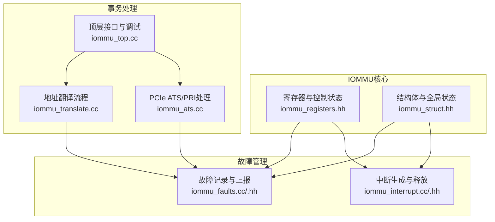
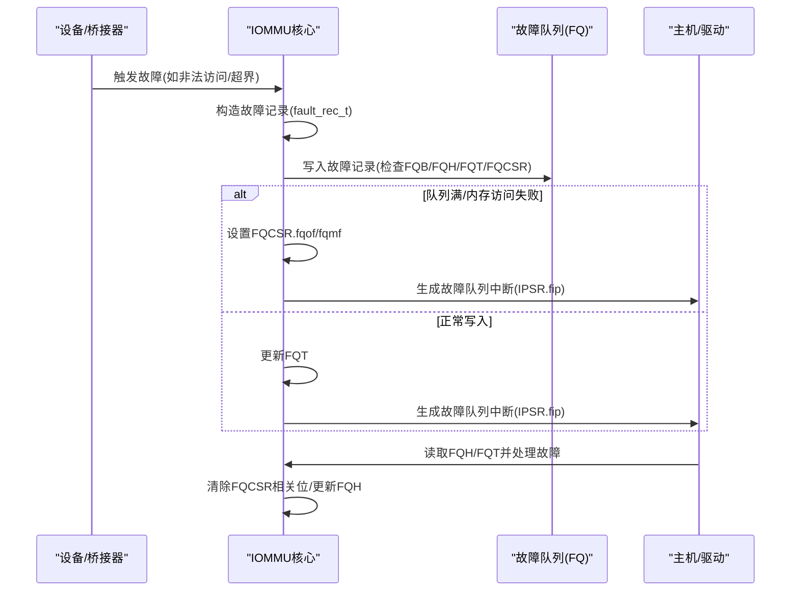
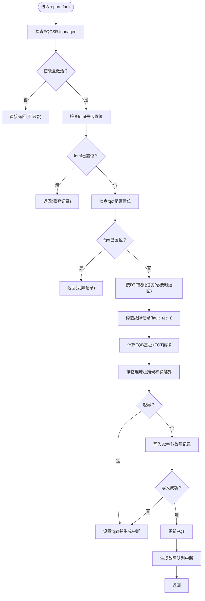
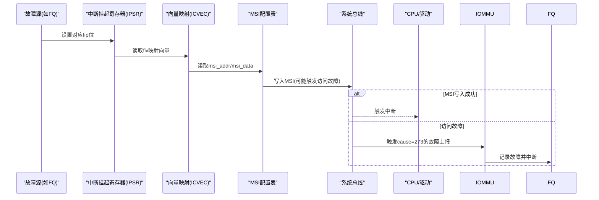
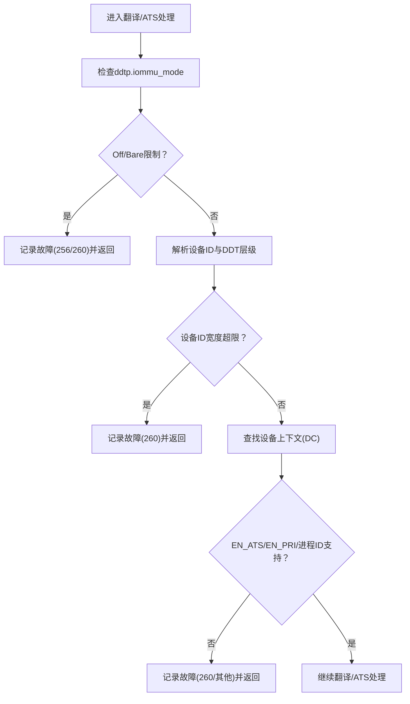
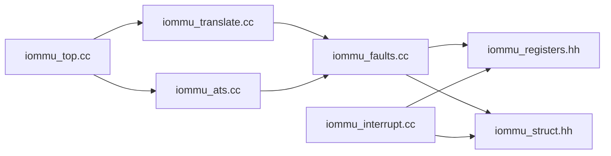

# 故障管理系统

<cite>
**本文引用的文件**
- [iommu_faults.cc](file://iommu/iommu_faults.cc)
- [iommu_fault.hh](file://iommu/iommu_fault.hh)
- [iommu_interrupt.cc](file://iommu/iommu_interrupt.cc)
- [iommu_interrupt.hh](file://iommu/iommu_interrupt.hh)
- [iommu_registers.hh](file://iommu/iommu_registers.hh)
- [iommu_struct.hh](file://iommu/iommu_struct.hh)
- [iommu_translate.cc](file://iommu/iommu_translate.cc)
- [iommu_ats.cc](file://iommu/iommu_ats.cc)
- [iommu_top.cc](file://iommu/iommu_top.cc)
</cite>

## 目录
1. [简介](#简介)
2. [项目结构](#项目结构)
3. [核心组件](#核心组件)
4. [架构总览](#架构总览)
5. [详细组件分析](#详细组件分析)
6. [依赖关系分析](#依赖关系分析)
7. [性能考量](#性能考量)
8. [故障排查指南](#故障排查指南)
9. [结论](#结论)
10. [附录](#附录)

## 简介
本技术文档围绕IOMMU故障管理系统展开，系统性阐述故障检测机制、故障类型与触发条件、故障源定位方法、故障记录格式与队列管理、故障状态跟踪、故障报告流程、中断生成与错误恢复策略，并给出故障处理的优先级与批量处理思路。文档同时提供关键流程图与诊断指南，帮助开发者快速定位问题并制定恢复策略。

## 项目结构
IOMMU故障管理相关代码主要位于iommu目录下，涉及故障记录、队列寄存器、中断生成与释放、翻译与ATS消息处理等模块。整体采用分层设计：上层通过寄存器接口访问底层数据结构；中层负责故障检测与记录；底层负责内存写入与中断生成。

**图表来源**
- [iommu_registers.hh](file://iommu/iommu_registers.hh)
- [iommu_struct.hh](file://iommu/iommu_struct.hh)
- [iommu_faults.cc](file://iommu/iommu_faults.cc)
- [iommu_interrupt.cc](file://iommu/iommu_interrupt.cc)
- [iommu_translate.cc](file://iommu/iommu_translate.cc)
- [iommu_ats.cc](file://iommu/iommu_ats.cc)
- [iommu_top.cc](file://iommu/iommu_top.cc)

**章节来源**
- [iommu_registers.hh](file://iommu/iommu_registers.hh)
- [iommu_struct.hh](file://iommu/iommu_struct.hh)
- [iommu_faults.cc](file://iommu/iommu_faults.cc)
- [iommu_interrupt.cc](file://iommu/iommu_interrupt.cc)
- [iommu_translate.cc](file://iommu/iommu_translate.cc)
- [iommu_ats.cc](file://iommu/iommu_ats.cc)
- [iommu_top.cc](file://iommu/iommu_top.cc)

## 核心组件
- 故障记录与上报：负责在检测到异常时构造故障记录并写入故障队列，同时生成相应中断。
- 中断子系统：根据中断源（命令队列、故障队列、页面请求队列、HPM）生成MSI或线中断，并支持挂起队列的延迟发送。
- 寄存器与状态：提供故障队列基址、头尾指针、控制与状态寄存器（FQCSR）、中断挂起寄存器（IPSR）等。
- 事务处理：在地址翻译与ATS消息处理过程中触发故障上报与中断。

**章节来源**
- [iommu_faults.cc](file://iommu/iommu_faults.cc)
- [iommu_fault.hh](file://iommu/iommu_fault.hh)
- [iommu_interrupt.cc](file://iommu/iommu_interrupt.cc)
- [iommu_interrupt.hh](file://iommu/iommu_interrupt.hh)
- [iommu_registers.hh](file://iommu/iommu_registers.hh)
- [iommu_struct.hh](file://iommu/iommu_struct.hh)

## 架构总览
IOMMU故障管理由“检测—记录—队列—中断—恢复”闭环构成。检测点覆盖翻译路径、ATS消息、MSI写入等；记录采用固定长度的故障记录项；队列采用环形缓冲并通过头尾指针管理；中断通过MSI配置表与向量映射产生；恢复由软件读取队列、清除状态位后继续处理。

**图表来源**
- [iommu_faults.cc](file://iommu/iommu_faults.cc)
- [iommu_registers.hh](file://iommu/iommu_registers.hh)
- [iommu_interrupt.cc](file://iommu/iommu_interrupt.cc)

## 详细组件分析

### 故障记录与上报（report_fault）
- 功能：在检测到故障时构造故障记录并写入故障队列，同时根据状态生成中断。
- 关键点：
  - 队列使能与激活检查：需满足FQCSR.fqon与fqen均有效。
  - 溢出与内存访问故障保护：若FQCSR.fqof或fqmf置位，则丢弃后续故障记录直至软件清除。
  - DTF过滤：当DC.tc.DTF为1时，仅报告特定非翻译类故障。
  - 记录字段：包含CAUSE、PID/PV/PRIV、TTYP、DID、iotval/iotval2等。
  - 写入校验：基于物理地址范围掩码判断是否越界，越界返回访问故障。
  - 头尾指针与环形队列：通过log2szm1计算容量，(fqt+1) mod N == fqh判定满。
  - 中断生成：成功写入或溢出/内存故障时均设置IPSR.fip并调用中断生成。

**图表来源**
- [iommu_faults.cc](file://iommu/iommu_faults.cc)
- [iommu_fault.hh](file://iommu/iommu_fault.hh)
- [iommu_registers.hh](file://iommu/iommu_registers.hh)

**章节来源**
- [iommu_faults.cc](file://iommu/iommu_faults.cc)
- [iommu_fault.hh](file://iommu/iommu_fault.hh)

### 故障记录格式与字段定义
- 固定长度：每条记录32字节，包含CAUSE、PID/PV/PRIV、TTYP、DID、自定义保留区域、iotval/iotval2。
- 字段用途：
  - CAUSE：故障原因编码，区分翻译类与非翻译类。
  - PID/PV/PRIV：进程上下文信息（当PV=1时有效）。
  - TTYP：事务类型，指示故障由何种入站事务引发。
  - DID：设备标识，用于定位故障源。
  - iotval/iotval2：辅助信息，如违规地址或消息载荷。

**章节来源**
- [iommu_fault.hh](file://iommu/iommu_fault.hh)

### 故障队列管理与状态跟踪
- 基址与容量：FQB.log2szm1决定队列容量，FQH/FQT为环形队列的读写索引。
- 状态寄存器：FQCSR.fqon/fqen/fqmf/fqof/busy/custom等位提供运行状态与错误标志。
- 满/空判定：(fqt + 1) mod N == fqh表示满；fqh == fqt表示空。
- 越界/内存故障：写入前按物理地址掩码校验，越界或数据损坏则置fqmf并中断。

**章节来源**
- [iommu_registers.hh](file://iommu/iommu_registers.hh)
- [iommu_faults.cc](file://iommu/iommu_faults.cc)

### 中断生成与释放（MSI）
- 中断源：命令队列、故障队列、页面请求队列、HPM。
- 向量映射：ICVEC.fiv将故障源映射到具体向量；MSI配置表按向量索引读取目标地址与数据。
- 掩码控制：MSI向量控制寄存器的掩码位为1时，该向量被屏蔽；挂起队列保存待发送的MSI，待掩码清除后释放。
- MSI写入：写入目标地址时若发生访问故障，会触发“IOMMU MSI写入访问故障”(cause 273)的故障上报。

**图表来源**
- [iommu_interrupt.cc](file://iommu/iommu_interrupt.cc)
- [iommu_interrupt.hh](file://iommu/iommu_interrupt.hh)
- [iommu_registers.hh](file://iommu/iommu_registers.hh)

**章节来源**
- [iommu_interrupt.cc](file://iommu/iommu_interrupt.cc)
- [iommu_interrupt.hh](file://iommu/iommu_interrupt.hh)

### 故障检测触发点与故障源定位
- 地址翻译路径：
  - Off/Bare模式限制：在Off模式下所有入站事务禁止；在Bare模式下不允许翻译类请求，ATS请求也受限。
  - 设备ID宽度与模式匹配：超出当前DDT层级支持的设备ID宽度将触发“事务类型不允许”。
  - ATS/PRI能力：若DC.tc.EN_ATS/EN_PRI为0，对应请求将被拒绝并记录故障。
  - DPE默认进程ID：无进程ID时可使用默认值0（若启用DPE）。
- ATS消息处理：
  - Off/Bare模式下，PCIe“Page Request”消息被拒绝并记录故障。
  - 队列溢出/内存故障时，部分消息可能被静默丢弃或自动回复“Page Request Group Response”。

**图表来源**
- [iommu_translate.cc](file://iommu/iommu_translate.cc)
- [iommu_ats.cc](file://iommu/iommu_ats.cc)

**章节来源**
- [iommu_translate.cc](file://iommu/iommu_translate.cc)
- [iommu_ats.cc](file://iommu/iommu_ats.cc)

### 故障报告流程、优先级与批量处理
- 报告流程：检测→构造记录→写入队列→更新指针→生成中断→软件轮询处理。
- 优先级排序：
  - 队列溢出(fqof)/内存故障(fqmf)具有最高优先级，会阻断新故障记录并触发中断。
  - 其他故障按源类型与cause编码排队，通常以FQH/FQT顺序处理。
- 批量处理：
  - 软件可在一次轮询中读取多个连续记录，批量更新FQH以提升吞吐。
  - 对于MSI写入失败导致的故障，建议先清理fqmf再继续处理。

**章节来源**
- [iommu_faults.cc](file://iommu/iommu_faults.cc)
- [iommu_interrupt.cc](file://iommu/iommu_interrupt.cc)

### 代码示例路径
- 故障记录函数实现入口：[report_fault](file://iommu/iommu_faults.cc)
- 故障记录数据结构与字段定义：[fault_rec_t与枚举](file://iommu/iommu_fault.hh)
- 中断生成与MSI写入：[generate_interrupt/do_msi](file://iommu/iommu_interrupt.cc)
- 地址翻译中的故障触发点：[翻译流程中的故障上报](file://iommu/iommu_translate.cc)
- ATS消息处理中的故障触发点：[ATS处理中的故障上报](file://iommu/iommu_ats.cc)

## 依赖关系分析
- 组件耦合：
  - 故障记录依赖寄存器文件（FQB/FQH/FQT/FQCSR）与全局状态（端序、QoS ID）。
  - 中断生成依赖向量映射与MSI配置表，且与IPSR状态位协同工作。
  - 事务处理模块在翻译与ATS路径中调用故障上报，形成跨模块协作。
- 外部依赖：
  - 内存写入接口用于队列与MSI写入，失败时触发访问故障。
  - SystemC顶层模块提供AXI/TLM接口，便于仿真与调试。

**图表来源**
- [iommu_translate.cc](file://iommu/iommu_translate.cc)
- [iommu_ats.cc](file://iommu/iommu_ats.cc)
- [iommu_faults.cc](file://iommu/iommu_faults.cc)
- [iommu_interrupt.cc](file://iommu/iommu_interrupt.cc)
- [iommu_registers.hh](file://iommu/iommu_registers.hh)
- [iommu_struct.hh](file://iommu/iommu_struct.hh)
- [iommu_top.cc](file://iommu/iommu_top.cc)

**章节来源**
- [iommu_translate.cc](file://iommu/iommu_translate.cc)
- [iommu_ats.cc](file://iommu/iommu_ats.cc)
- [iommu_faults.cc](file://iommu/iommu_faults.cc)
- [iommu_interrupt.cc](file://iommu/iommu_interrupt.cc)
- [iommu_registers.hh](file://iommu/iommu_registers.hh)
- [iommu_struct.hh](file://iommu/iommu_struct.hh)
- [iommu_top.cc](file://iommu/iommu_top.cc)

## 性能考量
- 队列容量与对齐：FQB基址与容量需满足对齐要求，避免额外页内碎片与访问开销。
- 批量写入：在保证正确性的前提下，尽量批量写入减少中断次数。
- MSI写入可靠性：MSI写入失败会触发额外故障，应优先修复内存/地址问题。
- DTF过滤：合理使用DTF可减少大量翻译类故障噪声，聚焦关键错误。

## 故障排查指南
- 常见现象与定位步骤：
  - 队列溢出：FQCSR.fqof置位，FQT不再前进；检查FQH是否滞后，确认软件处理速度。
  - 内存访问故障：FQCSR.fqmf置位，MSI写入失败时会记录cause 273；检查目标地址与权限。
  - ATS/PRI异常：EN_ATS/EN_PRI未启用或设备ID越界；核对DC配置与消息格式。
  - Off/Bare模式误用：在Off/Bare模式下出现翻译/ATS请求；调整IOMMU模式或修改上游行为。
- 恢复建议：
  - 清理FQCSR相关位后重试；确保FQB/FQH/FQT配置正确。
  - 若MSI写入失败，修正目标地址或权限后再尝试。
  - 优化软件轮询频率，避免频繁中断影响吞吐。

**章节来源**
- [iommu_faults.cc](file://iommu/iommu_faults.cc)
- [iommu_interrupt.cc](file://iommu/iommu_interrupt.cc)
- [iommu_ats.cc](file://iommu/iommu_ats.cc)
- [iommu_translate.cc](file://iommu/iommu_translate.cc)

## 结论
IOMMU故障管理系统通过严格的队列管理、明确的故障记录格式与中断机制，实现了从检测到恢复的完整闭环。合理利用DTF过滤、队列容量规划与MSI可靠性保障，可显著提升系统稳定性与可观测性。建议在实际部署中结合硬件特性与平台需求，制定标准化的故障处理流程与应急预案。

## 附录
- 关键寄存器与字段速查：
  - FQB/FQH/FQT：故障队列基址、头、尾指针
  - FQCSR：故障队列控制与状态（fqon/fqen/fqmf/fqof）
  - IPSR：中断挂起状态（fip/pip/cip/pmip）
  - ICVEC：中断向量映射（fiv）
  - MSI配置表：msi_addr/msi_data/msi_vec_ctrl
- 顶层调试接口：
  - SystemC模块提供AXI/TLM接口，便于注入请求与观察响应。

**章节来源**
- [iommu_registers.hh](file://iommu/iommu_registers.hh)
- [iommu_struct.hh](file://iommu/iommu_struct.hh)
- [iommu_top.cc](file://iommu/iommu_top.cc)