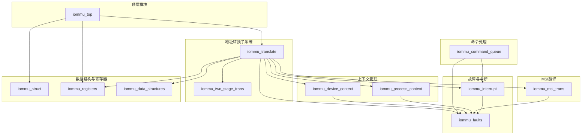
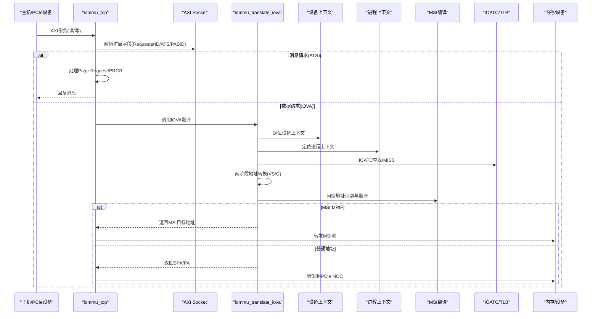
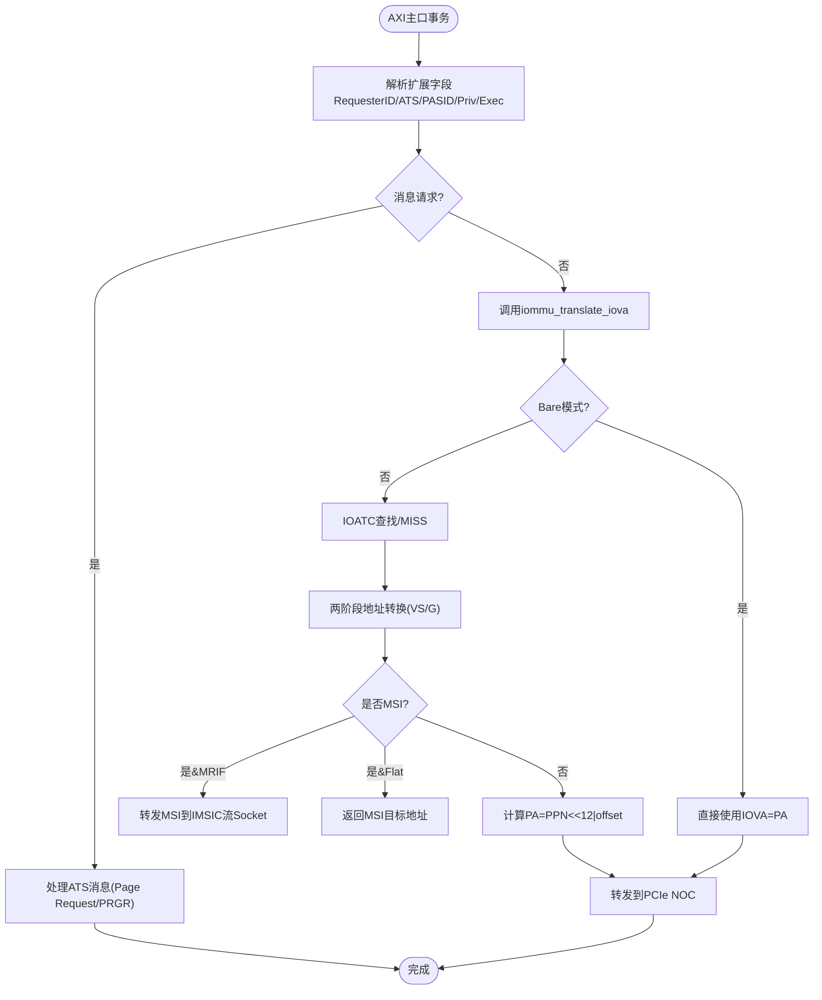
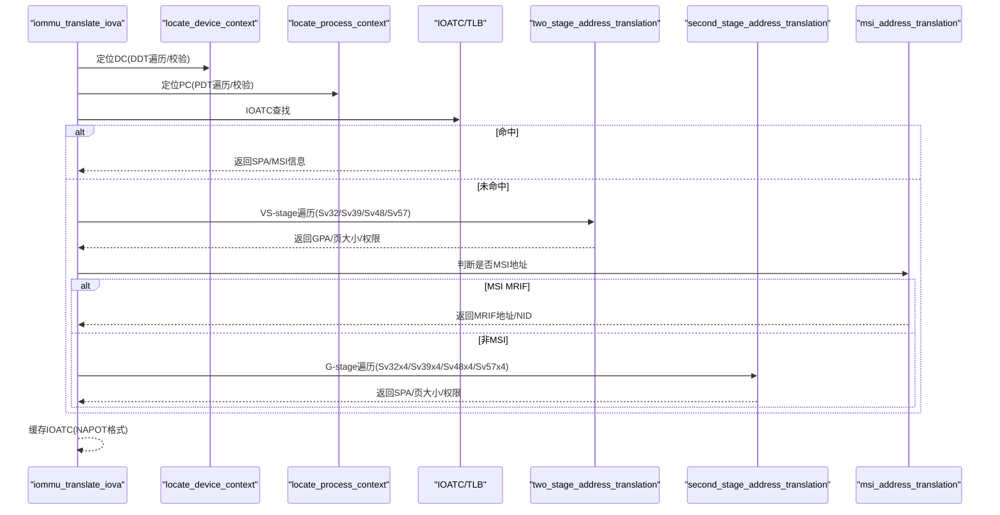
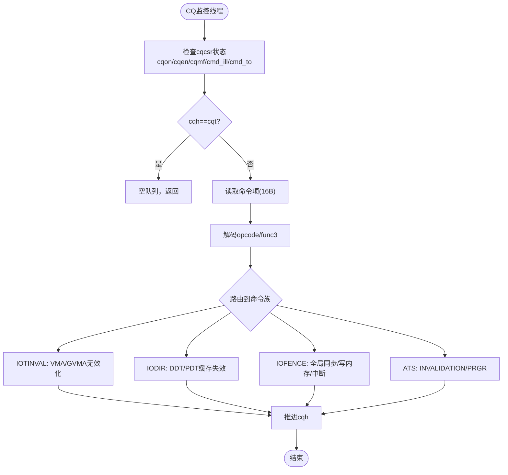
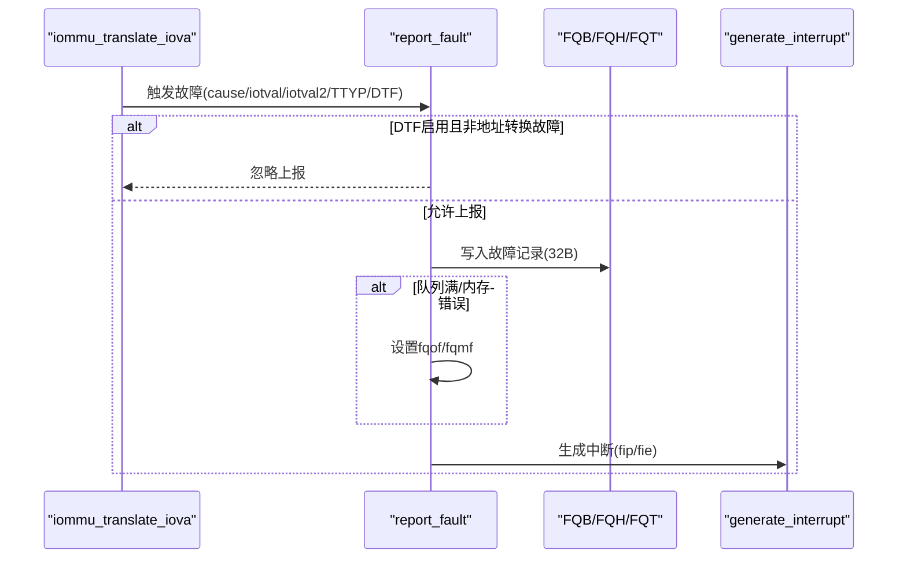
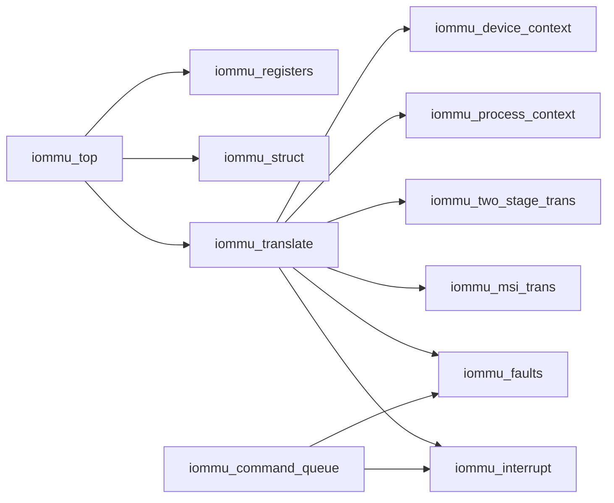

# 核心模块详解

<cite>
**本文档引用的文件**
- [iommu_top.cc](file://iommu/iommu_top.cc)
- [iommu_top.hh](file://iommu/iommu_top.hh)
- [iommu_translate.cc](file://iommu/iommu_translate.cc)
- [iommu_translate.hh](file://iommu/iommu_translate.hh)
- [iommu_two_stage_trans.cc](file://iommu/iommu_two_stage_trans.cc)
- [iommu_command_queue.cc](file://iommu/iommu_command_queue.cc)
- [iommu_command_queue.hh](file://iommu/iommu_command_queue.hh)
- [iommu_device_context.cc](file://iommu/iommu_device_context.cc)
- [iommu_process_context.cc](file://iommu/iommu_process_context.cc)
- [iommu_faults.cc](file://iommu/iommu_faults.cc)
- [iommu_msi_trans.cc](file://iommu/iommu_msi_trans.cc)
- [iommu_interrupt.cc](file://iommu/iommu_interrupt.cc)
- [iommu_struct.hh](file://iommu/iommu_struct.hh)
- [iommu_registers.hh](file://iommu/iommu_registers.hh)
- [iommu_data_structures.hh](file://iommu/iommu_data_structures.hh)
</cite>

## 目录
1. [简介](#简介)
2. [项目结构](#项目结构)
3. [核心组件](#核心组件)
4. [架构总览](#架构总览)
5. [详细组件分析](#详细组件分析)
6. [依赖关系分析](#依赖关系分析)
7. [性能考虑](#性能考虑)
8. [故障排查指南](#故障排查指南)
9. [结论](#结论)
10. [附录](#附录)

## 简介
本文件面向IOMMU核心模块，系统化梳理顶层模块iommu_top的设计与实现，深入解析Socket接口、事件处理机制、地址转换引擎（两阶段地址转换VS-stage + G-stage）、页表管理、MSI地址翻译、命令处理系统（命令队列、解析与执行）、设备/进程上下文管理以及故障管理系统（检测、记录与上报）。文档提供模块间交互关系图与数据流分析，并给出配置参数说明与使用模式，帮助读者快速理解与正确使用该IOMMU参考模型。

## 项目结构
IOMMU核心位于iommu目录下，采用按功能分层的组织方式：
- 顶层模块：iommu_top.cc/.hh，封装SystemC Socket接口与顶层控制流
- 地址转换：iommu_translate.cc/.hh、iommu_two_stage_trans.cc，实现两阶段地址转换与页表遍历
- 上下文管理：iommu_device_context.cc、iommu_process_context.cc
- 命令处理：iommu_command_queue.cc/.hh
- MSI翻译：iommu_msi_trans.cc
- 故障与中断：iommu_faults.cc、iommu_interrupt.cc
- 结构与寄存器：iommu_struct.hh、iommu_registers.hh、iommu_data_structures.hh

**图表来源**
- [iommu_top.cc:1-222](file://iommu/iommu_top.cc#L1-L222)
- [iommu_translate.cc:1-732](file://iommu/iommu_translate.cc#L1-L732)
- [iommu_two_stage_trans.cc:1-600](file://iommu/iommu_two_stage_trans.cc#L1-L600)
- [iommu_command_queue.cc:1-676](file://iommu/iommu_command_queue.cc#L1-L676)
- [iommu_msi_trans.cc:1-294](file://iommu/iommu_msi_trans.cc#L1-L294)
- [iommu_faults.cc:1-160](file://iommu/iommu_faults.cc#L1-L160)
- [iommu_interrupt.cc:1-121](file://iommu/iommu_interrupt.cc#L1-L121)
- [iommu_struct.hh:1-102](file://iommu/iommu_struct.hh#L1-L102)
- [iommu_registers.hh:1-987](file://iommu/iommu_registers.hh#L1-L987)
- [iommu_data_structures.hh:1-415](file://iommu/iommu_data_structures.hh#L1-L415)

**章节来源**
- [iommu_top.cc:1-222](file://iommu/iommu_top.cc#L1-L222)
- [iommu_top.hh:1-57](file://iommu/iommu_top.hh#L1-L57)

## 核心组件
- 顶层模块iommu_top：封装AXI/PCIe Socket接口，实现寄存器读写桥接、AXI事务到IOVA翻译的入口、ATS消息处理与MSI转发、命令队列监控线程等。
- 地址转换引擎：统一入口iommu_translate_iova，协调设备/进程上下文定位、IOATC查找、两阶段地址转换、MSI地址翻译与TLB缓存。
- 命令处理系统：命令队列CQ解析与执行，支持IOTINVAL、IODIR、IOFENCE、ATS等命令族。
- 设备/进程上下文：DDT/PDT树遍历与校验，确保DC/PC配置合法且与能力集匹配。
- 故障与中断：故障记录入队、溢出/内存访问错误处理、MSI中断生成与挂起队列恢复。
- 寄存器与数据结构：capabilities、fctl、ddtp、cqb/cqh/cqt、fqb/fqh/fqt、pqb/pqh/pqt、cqcsr/fqcsr/pqcsr、ipsr、msi_cfg_table等。

**章节来源**
- [iommu_translate.cc:1-732](file://iommu/iommu_translate.cc#L1-L732)
- [iommu_command_queue.cc:1-676](file://iommu/iommu_command_queue.cc#L1-L676)
- [iommu_device_context.cc:1-419](file://iommu/iommu_device_context.cc#L1-L419)
- [iommu_process_context.cc:1-236](file://iommu/iommu_process_context.cc#L1-L236)
- [iommu_faults.cc:1-160](file://iommu/iommu_faults.cc#L1-L160)
- [iommu_interrupt.cc:1-121](file://iommu/iommu_interrupt.cc#L1-L121)
- [iommu_registers.hh:1-987](file://iommu/iommu_registers.hh#L1-L987)
- [iommu_data_structures.hh:1-415](file://iommu/iommu_data_structures.hh#L1-L415)

## 架构总览
顶层模块通过SystemC TLM Socket接收来自PCIe NOC或AHB的事务请求，根据请求类型进行分流：
- 寄存器访问：走AXI从口，映射到IOMMU寄存器空间
- 数据访问：走AXI主口，触发IOVA翻译；若为MSI地址翻译且MRIF模式，则转发至IMSIC流Socket；否则计算物理地址后转发至PCIe NOC

**图表来源**
- [iommu_top.cc:41-210](file://iommu/iommu_top.cc#L41-L210)
- [iommu_translate.cc:8-732](file://iommu/iommu_translate.cc#L8-L732)
- [iommu_msi_trans.cc:1-294](file://iommu/iommu_msi_trans.cc#L1-L294)

**章节来源**
- [iommu_top.cc:1-222](file://iommu/iommu_top.cc#L1-L222)
- [iommu_translate.cc:1-732](file://iommu/iommu_translate.cc#L1-L732)

## 详细组件分析

### 顶层模块iommu_top：Socket接口与事件处理
- AXI从口b_transport：处理寄存器读写，offset由IOMMU_BASE_ADDR对齐，支持字节使能与长度裁剪
- AXI主口b_transport：处理数据访问，解析扩展字段（RequesterID、ATS类型、PASID、执行/特权属性），区分消息请求与IOVA翻译请求
- ATS消息处理：识别Page Request/PRGR，构造ATS消息并通过HB Socket发送
- IOVA翻译：调用iommu_translate_iova，处理Bare模式、MSI MRIF、页大小编码与NAPOT格式
- 物理地址计算：根据S位与页大小，将PPN与页内偏移组合成PA；Bare模式下PPN即为PA右移12位
- 命令队列监控：CQ_Monitor_Process_Thread等待事件，预留process_commands调用点

**图表来源**
- [iommu_top.cc:41-210](file://iommu/iommu_top.cc#L41-L210)
- [iommu_translate.cc:332-532](file://iommu/iommu_translate.cc#L332-L532)

**章节来源**
- [iommu_top.cc:1-222](file://iommu/iommu_top.cc#L1-L222)
- [iommu_top.hh:1-57](file://iommu/iommu_top.hh#L1-L57)

### 地址转换引擎：两阶段地址转换(VS/G)与页表管理
- 统一入口：iommu_translate_iova，负责分类事务类型、统计事件计数、提取权限属性、判定模式（Off/Bare/Translated/ATS）
- 设备上下文定位：DDT radix树遍历，支持1/2/3级目录，Base/Extended DC格式，校验DC配置合法性
- 进程上下文定位：PDT radix树遍历，支持PD8/PD17/PD20三级，两阶段GPA到SPA转换
- IOATC/TLB：IOVA命中则直接返回；未命中则执行两阶段页表遍历，支持NAPOT、A/D原子更新、全局映射位传播
- 权限检查：基于PTE R/W/X/U/G与SUM/ENS/SXL约束，执行/读/写分别对应不同页错误码
- 页大小选择：根据VS/G阶段最小页大小决定最终返回范围大小编码S位

**图表来源**
- [iommu_translate.cc:8-732](file://iommu/iommu_translate.cc#L8-L732)
- [iommu_two_stage_trans.cc:8-600](file://iommu/iommu_two_stage_trans.cc#L8-L600)
- [iommu_device_context.cc:9-229](file://iommu/iommu_device_context.cc#L9-L229)
- [iommu_process_context.cc:11-196](file://iommu/iommu_process_context.cc#L11-L196)
- [iommu_msi_trans.cc:19-294](file://iommu/iommu_msi_trans.cc#L19-L294)

**章节来源**
- [iommu_translate.cc:1-732](file://iommu/iommu_translate.cc#L1-L732)
- [iommu_two_stage_trans.cc:1-600](file://iommu/iommu_two_stage_trans.cc#L1-L600)
- [iommu_device_context.cc:1-419](file://iommu/iommu_device_context.cc#L1-L419)
- [iommu_process_context.cc:1-236](file://iommu/iommu_process_context.cc#L1-L236)
- [iommu_msi_trans.cc:1-294](file://iommu/iommu_msi_trans.cc#L1-L294)

### MSI地址翻译：Flat与MRIF模式
- Flat模式：MSI PTE为Translate/RW，直接返回SPA=PPN<<12|A[11:0]，权限等同R/W/U=1,X=0
- MRIF模式：MSI PTE为MRIF，解析MRIF地址、Notice MSI的NID与NPPN，返回Notice MSI目标地址与NID
- 访问权限：MSI翻译不支持执行，执行访问将导致指令访问错误
- 错误处理：MSI PTE加载访问错误、无效、配置错误、数据损坏均产生相应故障码

**章节来源**
- [iommu_msi_trans.cc:1-294](file://iommu/iommu_msi_trans.cc#L1-L294)

### 命令处理系统：命令队列管理、解析与执行
- 队列状态：cqb/cqh/cqt三寄存器构成环形队列，支持16字节命令项
- 启停控制：cqcsr.cqen/cqon/cqmf/cmd_to/cmd_ill/fence_w_ip等位控制与状态上报
- 命令族：
  - IOTINVAL：VMA/GVMA无效化，支持范围无效化与非叶PTE无效化扩展
  - IODIR：DDT/PDT缓存失效，同步软件写入与隐式读取一致性
  - IOFENCE：全局观察性同步、内存写入、向量中断通知
  - ATS：INVALIDATION/PRGR消息，ITAG跟踪与挂起队列
- 执行流程：读取命令、解码、参数校验、调用具体函数、推进cqh、必要时挂起等待ATS完成或超时

**图表来源**
- [iommu_command_queue.cc:7-276](file://iommu/iommu_command_queue.cc#L7-L276)
- [iommu_command_queue.hh:1-125](file://iommu/iommu_command_queue.hh#L1-L125)

**章节来源**
- [iommu_command_queue.cc:1-676](file://iommu/iommu_command_queue.cc#L1-L676)
- [iommu_command_queue.hh:1-125](file://iommu/iommu_command_queue.hh#L1-L125)

### 设备上下文与进程上下文管理
- 设备上下文DC：
  - DDT radix树遍历，Base/Extended格式，校验V、保留位、能力匹配、端序、SADE/GADE、SXL等
  - 支持Bare/多级目录模式，根PPN受G-stage影响时需先G-stage转换
- 进程上下文PC：
  - PDT radix树遍历，支持PD8/PD17/PD20，PC.fsc可为iosatp或iovsatp
  - 校验V、保留位、SXL与能力匹配
- 缓存：DC/PC/IOATC均有LRU时间戳，支持缓存命中与失效

**章节来源**
- [iommu_device_context.cc:1-419](file://iommu/iommu_device_context.cc#L1-L419)
- [iommu_process_context.cc:1-236](file://iommu/iommu_process_context.cc#L1-L236)

### 故障管理系统：检测、记录与报告
- 故障入队：满足条件时写入FQ，支持溢出(fqof)与内存访问错误(fqmf)，并触发中断
- DTF控制：禁用地址转换过程中的故障上报，但不影响设备错误响应
- 故障记录格式：包含DID/PID/PV/PRIV/TTYP/CAUSE/iotval/iotval2等字段
- 中断生成：根据ipsr与icvec映射，MSI向量表按向量索引生成MSI写入

**图表来源**
- [iommu_faults.cc:8-159](file://iommu/iommu_faults.cc#L8-L159)
- [iommu_interrupt.cc:27-121](file://iommu/iommu_interrupt.cc#L27-L121)

**章节来源**
- [iommu_faults.cc:1-160](file://iommu/iommu_faults.cc#L1-L160)
- [iommu_interrupt.cc:1-121](file://iommu/iommu_interrupt.cc#L1-L121)

## 依赖关系分析
- 模块耦合：
  - iommu_top依赖translate、interrupt、registers、struct等
  - translate依赖device_context、process_context、two_stage_trans、msi_trans、faults、interrupt
  - command_queue依赖faults、interrupt、registers、struct
- 数据结构依赖：
  - iommu_struct聚合reg_file、internal_reg_file、TLB/缓存、ITAG追踪、MSI挂起向量
  - registers/data_structures定义了所有寄存器布局与上下文结构体

**图表来源**
- [iommu_top.cc:1-222](file://iommu/iommu_top.cc#L1-L222)
- [iommu_translate.cc:1-732](file://iommu/iommu_translate.cc#L1-L732)
- [iommu_command_queue.cc:1-676](file://iommu/iommu_command_queue.cc#L1-L676)
- [iommu_struct.hh:42-99](file://iommu/iommu_struct.hh#L42-L99)
- [iommu_registers.hh:1-987](file://iommu/iommu_registers.hh#L1-L987)
- [iommu_data_structures.hh:1-415](file://iommu/iommu_data_structures.hh#L1-L415)

**章节来源**
- [iommu_struct.hh:1-102](file://iommu/iommu_struct.hh#L1-L102)

## 性能考虑
- IOATC/TLB缓存：优先命中可避免昂贵的页表遍历与G-stage转换
- NAPOT格式：在页表项中编码范围大小，减少缓存条目数量
- A/D原子更新：SADE/GADE开启可减少多次写回，降低延迟
- 命令队列并发：CQ并发处理与IOFENCE全局同步，注意cmd_to与cqmf对吞吐的影响
- MSI MRIF：MSI MRIF路径较短，适合高频MSI场景

## 故障排查指南
- 常见故障码定位：
  - 页错误：1/5/7/12/13/15/20/21/23（指令/读/写/页/客页）
  - 配置错误：256/257/258/259/260（全部禁止/DDT访问/无效/配置错误/类型不允许）
  - 数据结构错误：261/262/263/265/266/267/268/269/270/271/272/273/274（MSI/PT/PDT/数据损坏/内部路径/MSI写访问/PT数据损坏）
- 排查步骤：
  1) 检查cqcsr.cqon/cqen/cqmf/cmd_ill/cmd_to，确认命令队列状态
  2) 检查fqcsr.fqon/fqen/fqof/fqmf，确认故障队列状态
  3) 查看ipsr中断挂起位与icvec映射，确认中断向量
  4) 根据cause与iotval/iotval2定位具体阶段与地址
  5) 使用调试输出（DEBUG_*宏）定位translate/twostage/msi路径

**章节来源**
- [iommu_faults.cc:1-160](file://iommu/iommu_faults.cc#L1-L160)
- [iommu_command_queue.cc:1-676](file://iommu/iommu_command_queue.cc#L1-L676)

## 结论
本IOMMU核心模块以清晰的分层架构实现了从Socket接口到地址转换、上下文管理、命令处理与故障中断的完整链路。两阶段地址转换与MSI翻译遵循RISC-V规范，支持多种页表模式与端序配置；命令队列提供灵活的设备管理能力；故障与中断机制保证了可观测性与可靠性。建议在实际部署中结合DEBUG输出与性能监控，优化TLB命中率与命令队列吞吐。

## 附录

### 关键配置参数说明（寄存器）
- capabilities：能力位集合，如Sv32/Sv39/Sv48/Sv57、Sv32x4/Sv39x4/Sv48x4/Sv57x4、Svpbmt、MSI_FLAT/MRI、ATS/T2GPA、END、IGS、HPM、DBG、PAS、PD8/PD17/PD20、QOSID、NL/S等
- fctl：端序控制、中断方式选择、GXL等
- ddtp：设备目录表指针，支持Off/Bare/1LVL/2LVL/3LVL
- cqb/cqh/cqt：命令队列基址、头尾指针
- fqb/fqh/fqt：故障队列基址、头尾指针
- pqb/pqh/pqt：页面请求队列基址、头尾指针
- cqcsr/fqcsr/pqcsr：队列控制与状态寄存器
- ipsr：中断挂起状态
- icvec：中断向量映射
- msi_cfg_table：MSI向量配置表

**章节来源**
- [iommu_registers.hh:172-987](file://iommu/iommu_registers.hh#L172-L987)

### 使用模式示例（路径引用）
- 顶层初始化与模式设置：[iommu_top.cc:6-36](file://iommu/iommu_top.cc#L6-L36)
- AXI从口寄存器读写：[iommu_top.cc:41-72](file://iommu/iommu_top.cc#L41-L72)
- AXI主口数据访问与MSI转发：[iommu_top.cc:77-210](file://iommu/iommu_top.cc#L77-L210)
- IOVA统一翻译入口：[iommu_translate.cc:9-11](file://iommu/iommu_translate.cc#L9-L11)
- 两阶段地址转换主流程：[iommu_two_stage_trans.cc:9-17](file://iommu/iommu_two_stage_trans.cc#L9-L17)
- 命令队列处理与解析：[iommu_command_queue.cc:7-276](file://iommu/iommu_command_queue.cc#L7-L276)
- 设备上下文定位与校验：[iommu_device_context.cc:9-229](file://iommu/iommu_device_context.cc#L9-L229)
- 进程上下文定位与校验：[iommu_process_context.cc:11-196](file://iommu/iommu_process_context.cc#L11-L196)
- MSI地址翻译（Flat/MRIF）：[iommu_msi_trans.cc:19-294](file://iommu/iommu_msi_trans.cc#L19-L294)
- 故障记录与中断生成：[iommu_faults.cc:8-159](file://iommu/iommu_faults.cc#L8-L159), [iommu_interrupt.cc:27-121](file://iommu/iommu_interrupt.cc#L27-L121)