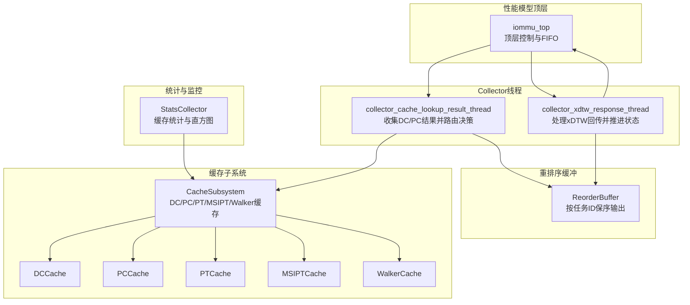
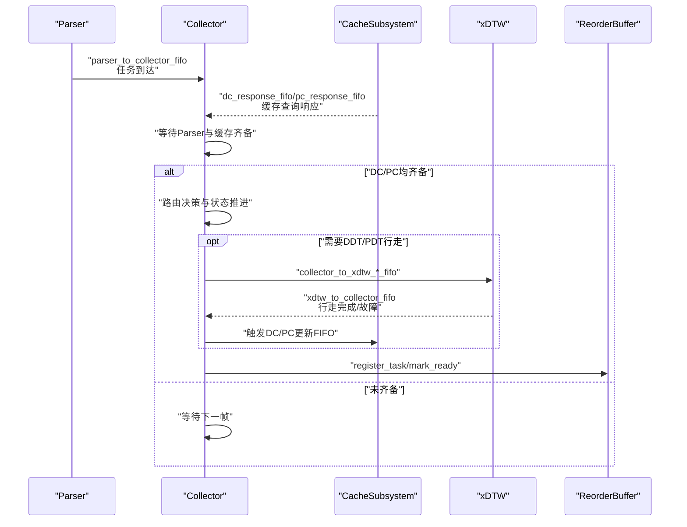
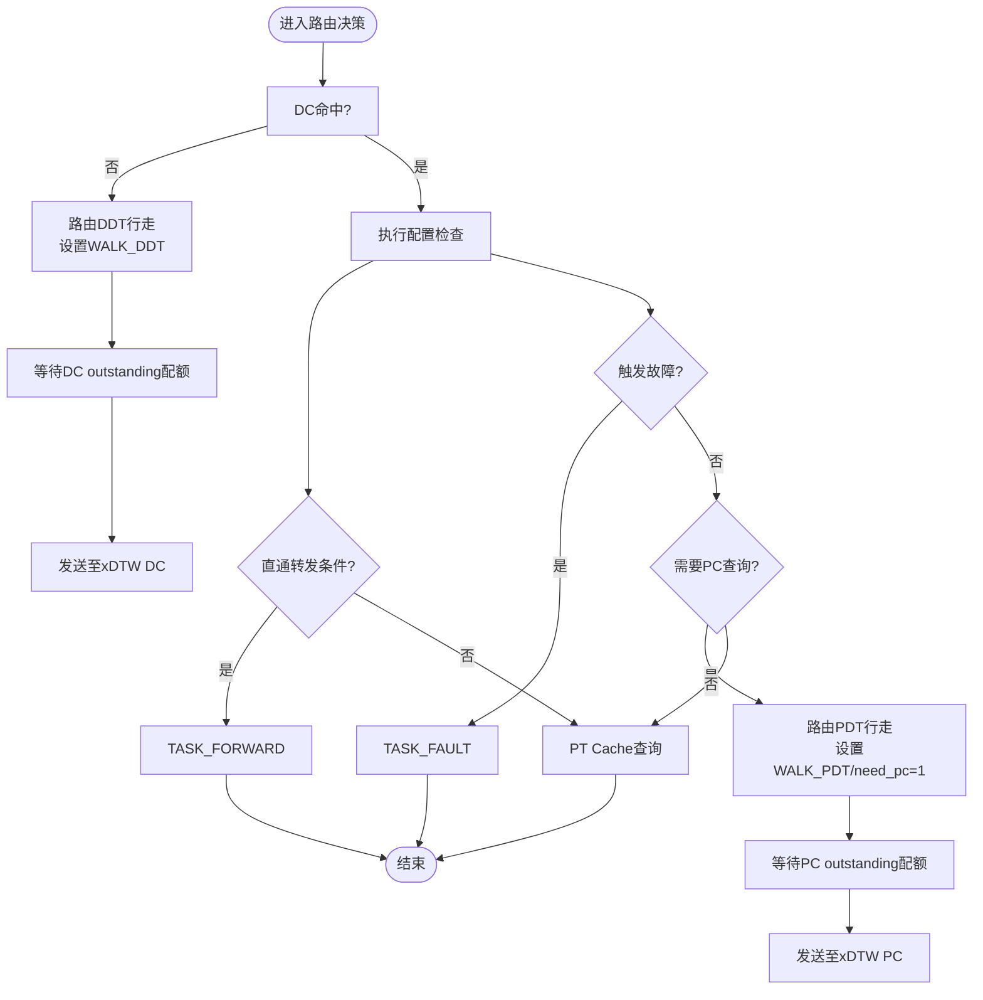
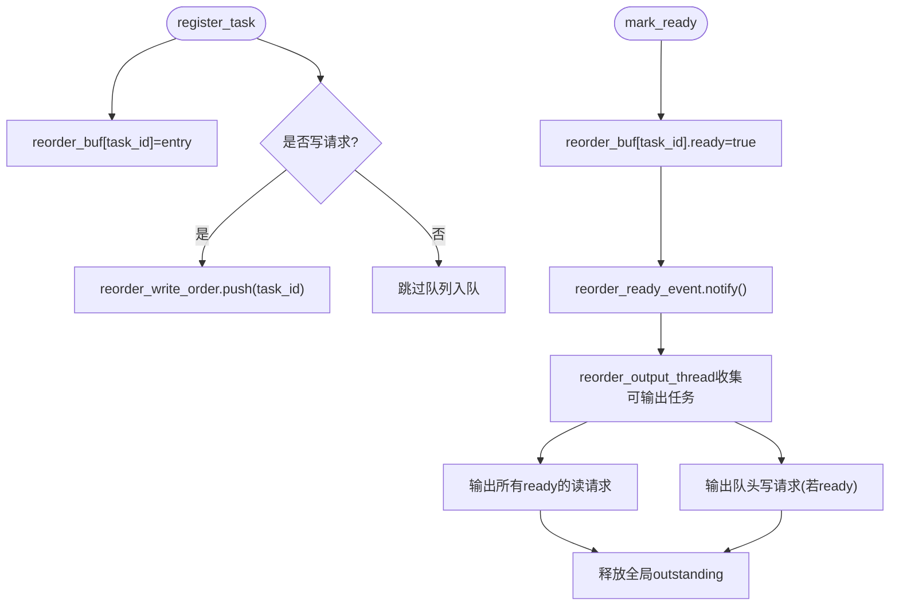
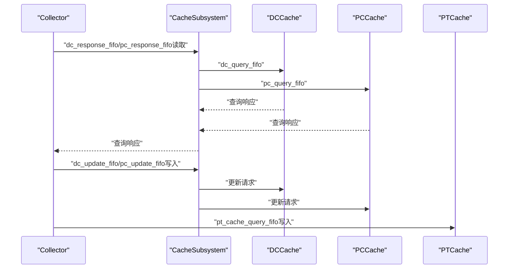
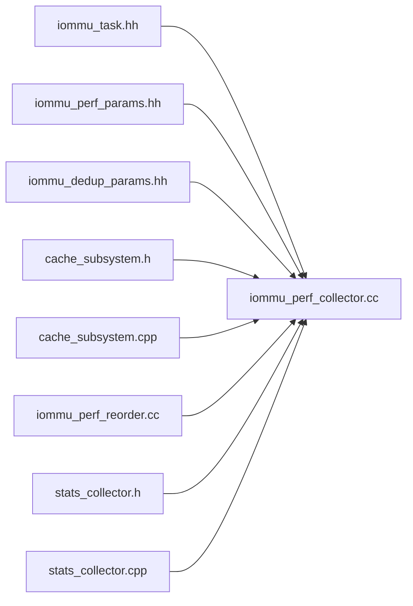

# Collector收集器模块

<cite>
**本文档引用的文件**
- [iommu_perf_collector.cc](file://iommu/iommu_perf_model/iommu_perf_collector.cc)
- [iommu_perf_reorder.cc](file://iommu/iommu_perf_model/iommu_perf_reorder.cc)
- [iommu_task.hh](file://iommu/include/iommu_task.hh)
- [iommu_perf_params.hh](file://iommu/iommu_perf_model/iommu_perf_params.hh)
- [iommu_dedup_params.hh](file://iommu/include/iommu_dedup_params.hh)
- [cache_subsystem.h](file://iommu/cache_src/subsystem/cache_subsystem.h)
- [cache_subsystem.cpp](file://iommu/cache_src/subsystem/cache_subsystem.cpp)
- [stats_collector.h](file://iommu/cache_src/common/stats_collector.h)
- [stats_collector.cpp](file://iommu/cache_src/common/stats_collector.cpp)
</cite>

## 目录
1. [简介](#简介)
2. [项目结构](#项目结构)
3. [核心组件](#核心组件)
4. [架构概览](#架构概览)
5. [详细组件分析](#详细组件分析)
6. [依赖关系分析](#依赖关系分析)
7. [性能考量](#性能考量)
8. [故障排查指南](#故障排查指南)
9. [结论](#结论)
10. [附录](#附录)

## 简介
本文件面向IOMMU性能模型中的Collector收集器模块，系统性阐述其任务调度与优先级管理机制、reorder buffer的实现与任务注册流程、对各缓存模块查询请求的协调方式、并发执行的处理策略，并给出在整体流水线中的关键作用与性能瓶颈识别方法，以及配置参数与调优建议。

## 项目结构
Collector位于IOMMU性能模型子目录中，与缓存子系统、任务数据结构、统计收集器协同工作。关键文件分布如下：
- 任务与上下文定义：iommu_task.hh
- Collector线程实现：iommu_perf_collector.cc
- 输出重排序缓冲：iommu_perf_reorder.cc
- 缓存子系统接口：cache_subsystem.h/.cpp
- 统计收集器：stats_collector.h/.cpp
- 参数配置：iommu_perf_params.hh、iommu_dedup_params.hh

**图表来源**
- [iommu_perf_collector.cc:14-275](file://iommu/iommu_perf_model/iommu_perf_collector.cc#L14-L275)
- [iommu_perf_reorder.cc:26-198](file://iommu/iommu_perf_model/iommu_perf_reorder.cc#L26-L198)
- [cache_subsystem.h:71-102](file://iommu/cache_src/subsystem/cache_subsystem.h#L71-L102)
- [stats_collector.h:107-191](file://iommu/cache_src/common/stats_collector.h#L107-L191)

**章节来源**
- [iommu_task.hh:185-280](file://iommu/include/iommu_task.hh#L185-L280)
- [iommu_perf_collector.cc:14-275](file://iommu/iommu_perf_model/iommu_perf_collector.cc#L14-L275)
- [iommu_perf_reorder.cc:26-198](file://iommu/iommu_perf_model/iommu_perf_reorder.cc#L26-L198)
- [cache_subsystem.h:71-102](file://iommu/cache_src/subsystem/cache_subsystem.h#L71-L102)

## 核心组件
- 任务数据结构与上下文：包含任务标识、设备/进程上下文、翻译结果字段、行走上下文、去重链头索引等，支撑Collector进行路由与状态推进。
- Collector线程：
  - 结果收集线程：汇聚Parser、DC/PC缓存查询结果，完成多源数据齐备后的路由决策。
  - xDTW回传线程：处理xDTW行走完成/故障回传，推进DC/PC有效性与后续路由。
- Reorder Buffer：统一注册/标记就绪/按规则输出，保证写请求保序、读请求乱序可达。
- 缓存子系统：提供DC/PC/PT/MSIPT/Walker缓存查询与更新的FIFO接口，支持去重与级联失效。
- 统计收集器：记录缓存访问、延迟、阶段时间戳等，支撑性能分析与瓶颈定位。

**章节来源**
- [iommu_task.hh:185-280](file://iommu/include/iommu_task.hh#L185-L280)
- [iommu_perf_collector.cc:14-275](file://iommu/iommu_perf_model/iommu_perf_collector.cc#L14-L275)
- [iommu_perf_reorder.cc:26-198](file://iommu/iommu_perf_model/iommu_perf_reorder.cc#L26-L198)
- [cache_subsystem.h:71-102](file://iommu/cache_src/subsystem/cache_subsystem.h#L71-L102)
- [stats_collector.h:107-191](file://iommu/cache_src/common/stats_collector.h#L107-L191)

## 架构概览
Collector在IOMMU性能模型流水线中承担“多源聚合、状态推进、路由决策”的关键角色。其输入来自Parser与缓存子系统的查询响应，输出通过ReorderBuffer保序/乱序下发至转发器或故障处理路径。

**图表来源**
- [iommu_perf_collector.cc:14-275](file://iommu/iommu_perf_model/iommu_perf_collector.cc#L14-L275)
- [cache_subsystem.h:71-102](file://iommu/cache_src/subsystem/cache_subsystem.h#L71-L102)
- [iommu_perf_reorder.cc:26-198](file://iommu/iommu_perf_model/iommu_perf_reorder.cc#L26-L198)

## 详细组件分析

### Collector任务调度与优先级管理
- 多源聚合与齐备检查：Collector维护pending_tasks映射，分别记录Parser到达、DC查询完成、PC查询完成三类事件；仅当三项齐备才进入路由决策阶段。
- 路由决策与状态推进：
  - DC缺失：路由至xDTW DDT行走，设置walk_ctx.walk_type=WALK_DDT，同时受collector_dc_walk_outstanding上限保护。
  - DC命中：执行一系列配置检查（EN_ATS、PDTV、进程ID宽度等），根据条件选择直通转发或PT Cache查询。
  - PC缺失：路由至xDTW PDT行走，设置need_pc=1，同时受collector_pc_walk_outstanding上限保护。
  - PC命中：执行ENS检查与上下文配置，最终路由至PT Cache查询。
- 并发度控制：通过outstanding计数器与事件通知实现背压，避免xDTW侧过载。

**图表来源**
- [iommu_perf_collector.cc:87-272](file://iommu/iommu_perf_model/iommu_perf_collector.cc#L87-L272)

**章节来源**
- [iommu_perf_collector.cc:14-275](file://iommu/iommu_perf_model/iommu_perf_collector.cc#L14-L275)
- [iommu_perf_params.hh:122-124](file://iommu/iommu_perf_model/iommu_perf_params.hh#L122-L124)

### Reorder Buffer实现与任务注册
- 任务注册：parser_thread在inbound_fifo读取任务后调用register_task，将任务按task_id登记到reorder_buf，写请求入reorder_write_order队列，全局outstanding计数+1。
- 就绪标记：forwarder/fault线程将翻译完成的任务标记为ready，触发输出线程通知。
- 输出策略：
  - 读请求：所有ready的读请求立即输出（乱序可达）。
  - 写请求：严格按reorder_write_order队头保序输出。
  - 出口带宽控制：通过master_0端口并发与带宽延迟模拟真实出口速率。
- 释放与统计：输出后释放全局outstanding并统计端到端延迟、IOPS等指标。

**图表来源**
- [iommu_perf_reorder.cc:26-198](file://iommu/iommu_perf_model/iommu_perf_reorder.cc#L26-L198)

**章节来源**
- [iommu_perf_reorder.cc:26-198](file://iommu/iommu_perf_model/iommu_perf_reorder.cc#L26-L198)

### Collector对缓存模块查询请求的协调
- 查询接口：Collector通过CacheSubsystem提供的FIFO与线程化worker协调DC/PC查询与更新，避免直接耦合具体缓存实现。
- 去重与级联失效：缓存子系统支持PT Cache去重与级联失效队列，Collector仅需关注任务状态与路由，不关心底层替换策略。
- 一致性保障：DC/PC命中后，Collector将相应更新请求写入cache_sub.*_update_fifo，确保缓存一致性。

**图表来源**
- [cache_subsystem.h:71-102](file://iommu/cache_src/subsystem/cache_subsystem.h#L71-L102)
- [cache_subsystem.cpp:154-175](file://iommu/cache_src/subsystem/cache_subsystem.cpp#L154-L175)
- [iommu_perf_collector.cc:36-69](file://iommu/iommu_perf_model/iommu_perf_collector.cc#L36-L69)

**章节来源**
- [cache_subsystem.h:71-102](file://iommu/cache_src/subsystem/cache_subsystem.h#L71-L102)
- [cache_subsystem.cpp:154-175](file://iommu/cache_src/subsystem/cache_subsystem.cpp#L154-L175)
- [iommu_perf_collector.cc:36-69](file://iommu/iommu_perf_model/iommu_perf_collector.cc#L36-L69)

### 任务注册过程与去重链
- 任务注册：parser_thread调用reorder_register_task，按任务类型登记到reorder_buf，并维护写请求队列。
- 去重链：任务上下文中包含dedup_head_index，指向去重Buffer链表头；去重Buffer容量与反压策略在iommu_dedup_params.hh中定义。
- Collector与去重：Collector在任务状态推进过程中，结合去重链与PT Cache去重功能，减少重复DDR访问。

**章节来源**
- [iommu_task.hh:245-247](file://iommu/include/iommu_task.hh#L245-L247)
- [iommu_dedup_params.hh:10-14](file://iommu/include/iommu_dedup_params.hh#L10-L14)
- [cache_subsystem.cpp:170-174](file://iommu/cache_src/subsystem/cache_subsystem.cpp#L170-L174)

## 依赖关系分析
- Collector依赖：
  - 任务数据结构：iommu_task.hh
  - 缓存子系统接口：cache_subsystem.h/.cpp
  - 参数配置：iommu_perf_params.hh、iommu_dedup_params.hh
  - 统计收集器：stats_collector.h/.cpp
- 关键依赖链：
  - Collector线程依赖CacheSubsystem的查询/更新FIFO与线程化worker。
  - ReorderBuffer依赖Collector的注册/标记接口与顶层的出口带宽模型。
  - 统计收集器贯穿于各模块，提供性能指标与直方图。

**图表来源**
- [iommu_task.hh:185-280](file://iommu/include/iommu_task.hh#L185-L280)
- [iommu_perf_collector.cc:14-275](file://iommu/iommu_perf_model/iommu_perf_collector.cc#L14-L275)
- [iommu_perf_params.hh:118-136](file://iommu/iommu_perf_model/iommu_perf_params.hh#L118-L136)
- [iommu_dedup_params.hh:10-92](file://iommu/include/iommu_dedup_params.hh#L10-L92)
- [cache_subsystem.h:71-102](file://iommu/cache_src/subsystem/cache_subsystem.h#L71-L102)
- [cache_subsystem.cpp:154-175](file://iommu/cache_src/subsystem/cache_subsystem.cpp#L154-L175)
- [iommu_perf_reorder.cc:26-198](file://iommu/iommu_perf_model/iommu_perf_reorder.cc#L26-L198)
- [stats_collector.h:107-191](file://iommu/cache_src/common/stats_collector.h#L107-L191)
- [stats_collector.cpp:13-17](file://iommu/cache_src/common/stats_collector.cpp#L13-L17)

**章节来源**
- [iommu_task.hh:185-280](file://iommu/include/iommu_task.hh#L185-L280)
- [iommu_perf_collector.cc:14-275](file://iommu/iommu_perf_model/iommu_perf_collector.cc#L14-L275)
- [iommu_perf_params.hh:118-136](file://iommu/iommu_perf_model/iommu_perf_params.hh#L118-L136)
- [cache_subsystem.h:71-102](file://iommu/cache_src/subsystem/cache_subsystem.h#L71-L102)
- [iommu_perf_reorder.cc:26-198](file://iommu/iommu_perf_model/iommu_perf_reorder.cc#L26-L198)
- [stats_collector.h:107-191](file://iommu/cache_src/common/stats_collector.h#L107-L191)

## 性能考量
- Collector并发度控制：
  - DC/PC行走outstanding上限：COLLECTOR_MAX_DC_WALK_OUTSTANDING、COLLECTOR_MAX_PC_WALK_OUTSTANDING，避免xDTW侧拥塞。
  - 通过事件通知实现背压，提升吞吐稳定性。
- ReorderBuffer性能：
  - 读请求乱序输出降低排队延迟；写请求保序确保正确性。
  - 出口带宽与并发槽控制模拟真实下游限制，避免过度背压。
- 统计与观测：
  - 统计收集器提供缓存命中率、执行/排队延迟、阶段时间戳、IOPS等指标，便于定位瓶颈。
  - PT Cache阶段时间戳与任务放大系数可用于评估任务并发与RAM端口利用率。

**章节来源**
- [iommu_perf_params.hh:122-136](file://iommu/iommu_perf_model/iommu_perf_params.hh#L122-L136)
- [iommu_perf_reorder.cc:136-172](file://iommu/iommu_perf_model/iommu_perf_reorder.cc#L136-L172)
- [stats_collector.cpp:227-538](file://iommu/cache_src/common/stats_collector.cpp#L227-L538)

## 故障排查指南
- 常见故障路径：
  - EN_ATS/PDTV/ENS等配置检查失败：直接进入TASK_FAULT并写入fault FIFO。
  - xDTW行走返回故障：减少outstanding计数并通知，随后进入故障处理。
- 观测手段：
  - 开启任务跟踪与统计输出，结合直方图定位异常延迟峰值。
  - 检查reorder_buf未注册任务的旁路输出，确认b_transport路径的正确性。
- 调试要点：
  - 分析Collector线程的齐备等待与路由决策分支，确认DC/PC命中路径是否符合预期。
  - 监控outstanding计数与事件通知频率，避免Collector成为瓶颈。

**章节来源**
- [iommu_perf_collector.cc:111-131](file://iommu/iommu_perf_model/iommu_perf_collector.cc#L111-L131)
- [iommu_perf_collector.cc:287-300](file://iommu/iommu_perf_model/iommu_perf_collector.cc#L287-L300)
- [iommu_perf_reorder.cc:57-82](file://iommu/iommu_perf_model/iommu_perf_reorder.cc#L57-L82)

## 结论
Collector作为IOMMU性能模型的核心协调者，通过多源聚合、严格的路由决策与并发度控制，实现了高效稳定的地址翻译流水线。配合ReorderBuffer的有序输出与统计收集器的全面观测，能够快速定位瓶颈并指导调优。合理配置outstanding上限、出口带宽与预取参数，可在保证正确性的前提下最大化吞吐。

## 附录

### Collector配置参数与调优建议
- 并发度参数
  - DC行走outstanding上限：COLLECTOR_MAX_DC_WALK_OUTSTANDING
  - PC行走outstanding上限：COLLECTOR_MAX_PC_WALK_OUTSTANDING
  - 建议：根据xDTW访问延迟与下游带宽动态调整，避免频繁等待。
- 处理延迟参数
  - 各模块处理延迟（ns）：PARSER_DELAY、COLLECTOR_DELAY、DC/PC/PT/MSIPT命中延迟、xDTW/PTW/MSIPTW每次DDR访问延迟
  - 建议：在仿真精度与性能之间权衡，适当降低非关键路径延迟以提升吞吐。
- 去重与预取
  - PT去重Buffer容量与预取深度：PT_DEDUP_BUFFER_SIZE、PT_DEDUP_PREFETCH_DEPTH
  - 建议：根据工作负载的重复访问模式调整D值，避免过度预取导致内存压力。
- FIFO深度
  - 各FIFO深度参数：FIFO_DEPTH_COLLECTOR_TO_XDTW等
  - 建议：结合outstanding上限与任务到达率，避免FIFO溢出或空转。

**章节来源**
- [iommu_perf_params.hh:118-136](file://iommu/iommu_perf_model/iommu_perf_params.hh#L118-L136)
- [cache_subsystem.cpp:154-175](file://iommu/cache_src/subsystem/cache_subsystem.cpp#L154-L175)