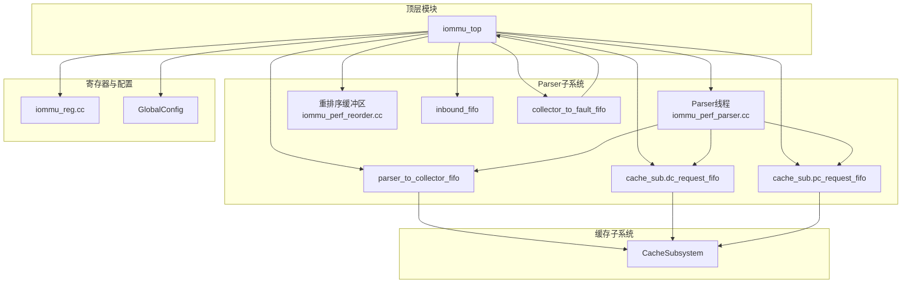
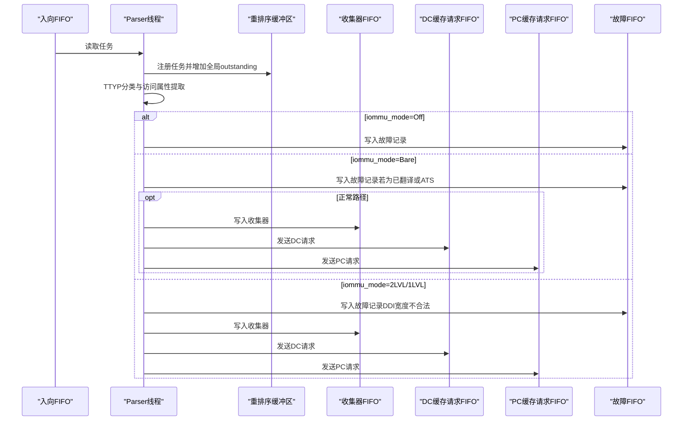
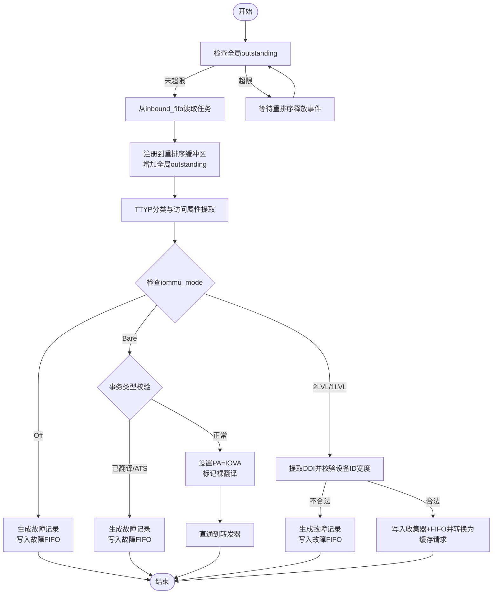
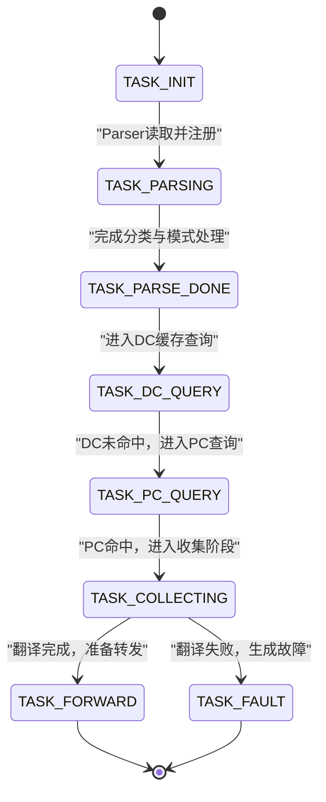
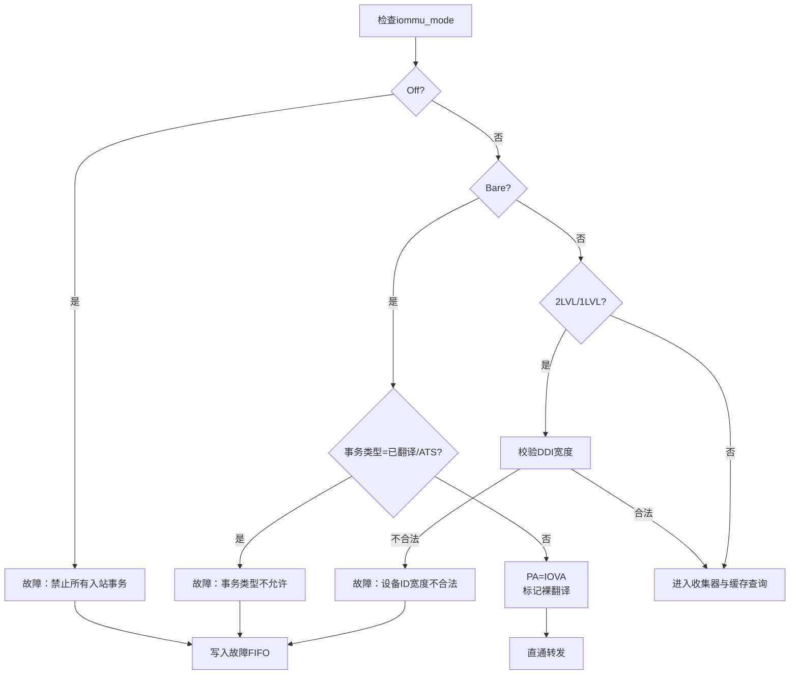
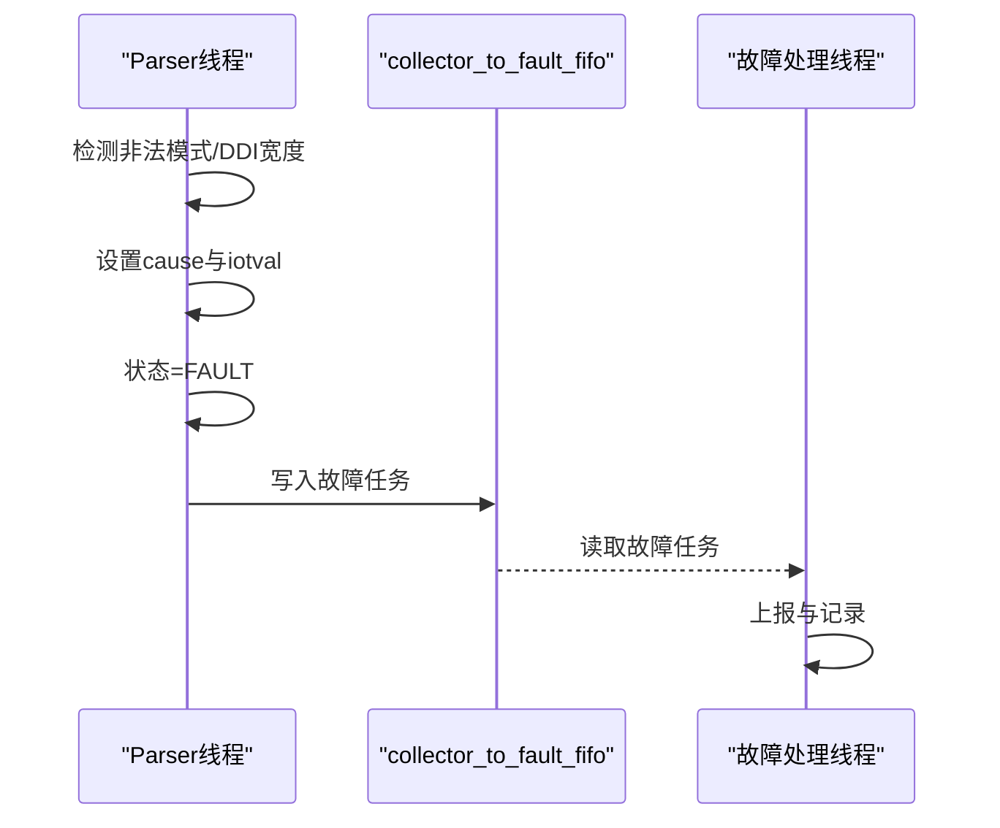
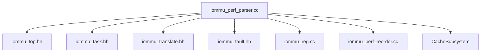

# Parser解析器模块

<cite>
**本文档引用的文件**
- [iommu_perf_parser.cc](file://iommu/iommu_perf_model/iommu_perf_parser.cc)
- [iommu_top.hh](file://iommu/iommu_top.hh)
- [iommu_task.hh](file://iommu/include/iommu_task.hh)
- [iommu_translate.hh](file://iommu/include/iommu_translate.hh)
- [iommu_fault.hh](file://iommu/include/iommu_fault.hh)
- [iommu_perf_reorder.cc](file://iommu/iommu_perf_model/iommu_perf_reorder.cc)
- [iommu_reg.cc](file://iommu/iommu_perf_model/iommu_reg.cc)
- [param_trans_def.hh](file://iommu/include/param_trans_def.hh)
</cite>

## 目录
1. [简介](#简介)
2. [项目结构](#项目结构)
3. [核心组件](#核心组件)
4. [架构概览](#架构概览)
5. [详细组件分析](#详细组件分析)
6. [依赖关系分析](#依赖关系分析)
7. [性能考虑](#性能考虑)
8. [故障排查指南](#故障排查指南)
9. [结论](#结论)

## 简介
本文件面向Parser解析器模块的技术文档，系统阐述其在IOMMU性能模型中的职责与实现细节。Parser线程负责从入向FIFO读取任务、进行全局outstanding反压控制、TTYP分类与访问属性提取、根据IOMMU模式（Off、Bare、2LVL、1LVL）进行分流处理，并将任务分发至收集器与缓存子系统。同时，文档详细说明了任务状态转换、重排序缓冲区管理、不同IOMMU模式下的处理流程、故障检测与处理机制，以及性能优化与调试方法。

## 项目结构
Parser解析器模块位于IOMMU性能模型子系统中，与缓存子系统、重排序缓冲区、故障处理等模块协同工作。关键文件与职责如下：
- iommu_perf_parser.cc：Parser线程主体实现，包含任务读取、反压控制、TTYP分类、模式判断与分发逻辑。
- iommu_top.hh：顶层SystemC模块声明，包含Parser线程声明、FIFO管道、重排序缓冲区、全局outstanding计数器等。
- iommu_task.hh：任务数据结构定义，包含任务状态枚举、行走上下文、去重相关字段等。
- iommu_translate.hh：地址翻译接口与数据结构定义，为Parser提供模式判断与访问属性提取的支撑。
- iommu_fault.hh：故障编码与记录格式定义，用于Parser在非法情况下生成故障记录。
- iommu_perf_reorder.cc：重排序缓冲区实现，负责按规则输出响应并释放全局outstanding。
- iommu_reg.cc：寄存器行为与模式合法性检查，确保ddtp.iommu_mode写入的合法性。
- param_trans_def.hh：传输参数与扩展载荷定义，为Parser提供设备ID、事务类型等输入信息。

**图表来源**
- [iommu_perf_parser.cc:9-122](file://iommu/iommu_perf_model/iommu_perf_parser.cc#L9-L122)
- [iommu_top.hh:72-121](file://iommu/iommu_top.hh#L72-L121)
- [iommu_perf_reorder.cc:26-198](file://iommu/iommu_perf_model/iommu_perf_reorder.cc#L26-L198)
- [iommu_reg.cc:236-953](file://iommu/iommu_perf_model/iommu_reg.cc#L236-L953)

**章节来源**
- [iommu_perf_parser.cc:9-122](file://iommu/iommu_perf_model/iommu_perf_parser.cc#L9-L122)
- [iommu_top.hh:72-121](file://iommu/iommu_top.hh#L72-L121)
- [iommu_perf_reorder.cc:26-198](file://iommu/iommu_perf_model/iommu_perf_reorder.cc#L26-L198)
- [iommu_reg.cc:236-953](file://iommu/iommu_perf_model/iommu_reg.cc#L236-L953)

## 核心组件
- Parser线程：负责从入向FIFO读取任务、执行全局outstanding反压、TTYP分类与访问属性提取、模式判断与分发。
- 重排序缓冲区：维护任务就绪状态与输出顺序，保障写请求保序、读请求乱序输出，并在输出后释放全局outstanding。
- 缓存子系统：接收Parser转换后的CacheMessage，查询DC/PC缓存并返回结果。
- 故障通道：当Parser检测到非法模式或设备ID宽度不合法时，生成故障记录并写入故障FIFO。
- 寄存器与配置：提供ddtp.iommu_mode、能力与限制等参数，确保模式切换的合法性与正确性。

**章节来源**
- [iommu_perf_parser.cc:9-122](file://iommu/iommu_perf_model/iommu_perf_parser.cc#L9-L122)
- [iommu_top.hh:279-295](file://iommu/iommu_top.hh#L279-L295)
- [iommu_task.hh:20-48](file://iommu/include/iommu_task.hh#L20-L48)
- [iommu_fault.hh:26-77](file://iommu/include/iommu_fault.hh#L26-L77)

## 架构概览
Parser线程作为IOMMU性能模型的入口阶段，承担以下职责：
- 全局outstanding反压：在进入任务处理前检查全局并发度，超过阈值则等待重排序释放事件。
- 任务读取与注册：从inbound_fifo读取任务，注册到重排序缓冲区并增加全局outstanding计数。
- TTYP分类与访问属性提取：识别事务类型、读/写/执行权限、特权级别等。
- IOMMU模式处理：
  - Off：直接报告故障，禁止所有入站事务。
  - Bare：校验事务类型，若为已翻译或ATS请求则故障；否则直通物理地址并标记为裸翻译。
  - 2LVL/1LVL：提取设备ID（DDI）并验证设备ID宽度合法性，不合法则故障。
- 分发与状态转换：将任务写入收集器FIFO，并转换为DC/PC缓存请求消息，进入后续翻译阶段。

**图表来源**
- [iommu_perf_parser.cc:9-122](file://iommu/iommu_perf_model/iommu_perf_parser.cc#L9-L122)
- [iommu_perf_reorder.cc:26-49](file://iommu/iommu_perf_model/iommu_perf_reorder.cc#L26-L49)

**章节来源**
- [iommu_perf_parser.cc:9-122](file://iommu/iommu_perf_model/iommu_perf_parser.cc#L9-L122)
- [iommu_perf_reorder.cc:26-49](file://iommu/iommu_perf_model/iommu_perf_reorder.cc#L26-L49)

## 详细组件分析

### Parser线程实现原理与工作流程
- 全局outstanding反压：Parser在处理任务前检查全局并发计数，超过上限则等待重排序释放事件，避免系统过载。
- 任务读取与注册：从inbound_fifo读取任务，记录入口时间戳，注册到重排序缓冲区并增加全局outstanding。
- TTYP分类与访问属性提取：依据事务类型、读/写/执行、特权级别等提取访问属性，供后续阶段使用。
- IOMMU模式处理：
  - Off：禁止所有入站事务，生成故障记录并写入故障FIFO。
  - Bare：若事务类型为已翻译或ATS请求则故障；否则设置物理地址为IOVA，标记裸翻译并直通。
  - 2LVL/1LVL：提取DDI并校验设备ID宽度，不合法则故障；合法则进入后续翻译阶段。
- 分发与状态转换：将任务写入收集器FIFO，并转换为DC/PC缓存请求消息，进入后续翻译阶段。

**图表来源**
- [iommu_perf_parser.cc:9-122](file://iommu/iommu_perf_model/iommu_perf_parser.cc#L9-L122)
- [iommu_perf_reorder.cc:26-49](file://iommu/iommu_perf_model/iommu_perf_reorder.cc#L26-L49)

**章节来源**
- [iommu_perf_parser.cc:9-122](file://iommu/iommu_perf_model/iommu_perf_parser.cc#L9-L122)
- [iommu_perf_reorder.cc:26-49](file://iommu/iommu_perf_model/iommu_perf_reorder.cc#L26-L49)

### 任务状态转换与重排序缓冲区管理
- 任务状态：Parser线程将任务状态推进到TASK_PARSING、TASK_PARSE_DONE等阶段，最终由重排序缓冲区统一输出。
- 重排序规则：
  - 读请求：到达即输出，支持乱序。
  - 写请求：按task_id单调保序输出，使用队列维护写请求到达顺序。
- 全局outstanding释放：重排序缓冲区在真正下发响应后释放全局outstanding，并通知Parser继续处理新任务。

**图表来源**
- [iommu_task.hh:20-48](file://iommu/include/iommu_task.hh#L20-L48)
- [iommu_perf_reorder.cc:91-198](file://iommu/iommu_perf_model/iommu_perf_reorder.cc#L91-L198)

**章节来源**
- [iommu_task.hh:20-48](file://iommu/include/iommu_task.hh#L20-L48)
- [iommu_perf_reorder.cc:91-198](file://iommu/iommu_perf_model/iommu_perf_reorder.cc#L91-L198)

### IOMMU模式处理详解（Off、Bare、2LVL、1LVL）
- Off模式：禁止所有入站事务，直接生成故障记录并写入故障FIFO。
- Bare模式：若事务类型为已翻译或ATS请求则故障；否则设置物理地址为IOVA，标记裸翻译并直通。
- 2LVL/1LVL模式：提取DDI并校验设备ID宽度，不合法则故障；合法则进入后续翻译阶段。

**图表来源**
- [iommu_perf_parser.cc:32-99](file://iommu/iommu_perf_model/iommu_perf_parser.cc#L32-L99)

**章节来源**
- [iommu_perf_parser.cc:32-99](file://iommu/iommu_perf_model/iommu_perf_parser.cc#L32-L99)

### 故障检测与处理机制
- 故障编码：Parser在检测到非法模式或设备ID宽度不合法时，设置cause与iotval，并将任务状态置为TASK_FAULT。
- 故障记录：故障记录包含CAUSE、PID、PV、PRIV、TTYP、DID、iotval等字段，用于后续上报与诊断。
- 故障通道：Parser将故障任务写入collector_to_fault_fifo，交由故障处理线程进一步处理。

**图表来源**
- [iommu_fault.hh:52-77](file://iommu/include/iommu_fault.hh#L52-L77)
- [iommu_perf_parser.cc:35-44](file://iommu/iommu_perf_model/iommu_perf_parser.cc#L35-L44)

**章节来源**
- [iommu_fault.hh:52-77](file://iommu/include/iommu_fault.hh#L52-L77)
- [iommu_perf_parser.cc:35-44](file://iommu/iommu_perf_model/iommu_perf_parser.cc#L35-L44)

### 访问属性提取与TTYP分类
- TTYP分类：Parser根据事务类型（未翻译读/写/执行、已翻译读/写/执行、PCIe ATS请求、消息请求等）进行分类。
- 访问属性：提取读/写/执行权限、特权级别、SUM等属性，供后续阶段进行访问权限检查与翻译决策。

**章节来源**
- [iommu_translate.hh:26-49](file://iommu/include/iommu_translate.hh#L26-L49)
- [iommu_perf_parser.cc:28-30](file://iommu/iommu_perf_model/iommu_perf_parser.cc#L28-L30)

## 依赖关系分析
Parser解析器模块与以下组件存在紧密依赖关系：
- 顶层模块（iommu_top）：提供Parser线程、FIFO管道、重排序缓冲区、全局outstanding计数器等基础设施。
- 缓存子系统：Parser将任务转换为CacheMessage并写入DC/PC请求FIFO，依赖缓存子系统的查询与更新机制。
- 寄存器模块：Parser依赖ddtp.iommu_mode与能力参数，确保模式切换的合法性与正确性。
- 任务数据结构：Parser操作iommu_task_t结构，依赖其状态枚举、行走上下文与去重相关字段。

**图表来源**
- [iommu_perf_parser.cc:5-7](file://iommu/iommu_perf_model/iommu_perf_parser.cc#L5-L7)
- [iommu_top.hh:44-64](file://iommu/iommu_top.hh#L44-L64)
- [iommu_task.hh:185-280](file://iommu/include/iommu_task.hh#L185-L280)
- [iommu_translate.hh:95-130](file://iommu/include/iommu_translate.hh#L95-L130)
- [iommu_fault.hh:52-77](file://iommu/include/iommu_fault.hh#L52-L77)
- [iommu_reg.cc:236-953](file://iommu/iommu_perf_model/iommu_reg.cc#L236-L953)
- [iommu_perf_reorder.cc:26-49](file://iommu/iommu_perf_model/iommu_perf_reorder.cc#L26-L49)

**章节来源**
- [iommu_perf_parser.cc:5-7](file://iommu/iommu_perf_model/iommu_perf_parser.cc#L5-L7)
- [iommu_top.hh:44-64](file://iommu/iommu_top.hh#L44-L64)
- [iommu_task.hh:185-280](file://iommu/include/iommu_task.hh#L185-L280)
- [iommu_translate.hh:95-130](file://iommu/include/iommu_translate.hh#L95-L130)
- [iommu_fault.hh:52-77](file://iommu/include/iommu_fault.hh#L52-L77)
- [iommu_reg.cc:236-953](file://iommu/iommu_perf_model/iommu_reg.cc#L236-L953)
- [iommu_perf_reorder.cc:26-49](file://iommu/iommu_perf_model/iommu_perf_reorder.cc#L26-L49)

## 性能考虑
- 并发控制：Parser在进入任务处理前进行全局outstanding反压，避免系统过载；重排序缓冲区在输出后释放outstanding，形成闭环控制。
- 流水线设计：Parser无需串行延时，瓶颈由并发outstanding数与下游模块决定，提升整体吞吐。
- 带宽控制：重排序输出阶段引入带宽延迟模拟，避免出口端口拥塞。
- 统计与监控：顶层模块提供端到端延时统计、稳态IOPS测量、各模块峰值outstanding跟踪等指标，便于性能分析与优化。

**章节来源**
- [iommu_perf_parser.cc:11-26](file://iommu/iommu_perf_model/iommu_perf_parser.cc#L11-L26)
- [iommu_perf_reorder.cc:135-172](file://iommu/iommu_perf_model/iommu_perf_reorder.cc#L135-L172)
- [iommu_top.hh:203-246](file://iommu/iommu_top.hh#L203-L246)

## 故障排查指南
- 模式合法性检查：确保ddtp.iommu_mode写入符合规范，非法值会被忽略或保留当前合法值。
- 设备ID宽度校验：2LVL模式下DDI[2]必须为0；1LVL模式下DDI[2]与DDI[1]均须为0，否则产生故障。
- ATS与Off模式：在Off模式下，ATS请求应报告UNSUPPORTED_REQUEST类型的故障。
- 重排序异常：若重排序缓冲区出现队列与buf不一致的情况，将记录警告并丢弃异常队头，确保系统稳定性。

**章节来源**
- [iommu_reg.cc:250-257](file://iommu/iommu_perf_model/iommu_reg.cc#L250-L257)
- [iommu_perf_parser.cc:34-44](file://iommu/iommu_perf_model/iommu_perf_parser.cc#L34-L44)
- [iommu_perf_parser.cc:81-99](file://iommu/iommu_perf_model/iommu_perf_parser.cc#L81-L99)
- [iommu_perf_reorder.cc:112-118](file://iommu/iommu_perf_model/iommu_perf_reorder.cc#L112-L118)

## 结论
Parser解析器模块在IOMMU性能模型中承担入口过滤与分流的关键角色。通过严格的全局outstanding反压、精确的TTYP分类与访问属性提取、严谨的IOMMU模式处理与故障检测，Parser确保了系统的稳定性与正确性。配合重排序缓冲区的有序输出与缓存子系统的高效查询，Parser为整个IOMMU流水线提供了坚实的基础。建议在实际部署中关注模式合法性检查、设备ID宽度约束与重排序异常处理，以获得最佳性能与可靠性。