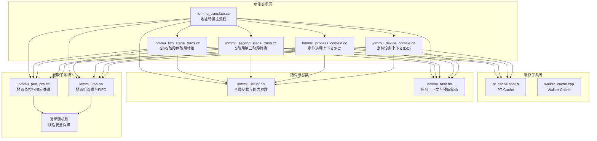
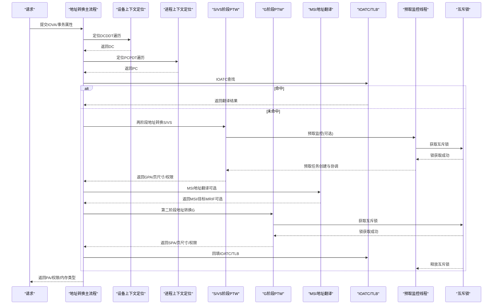
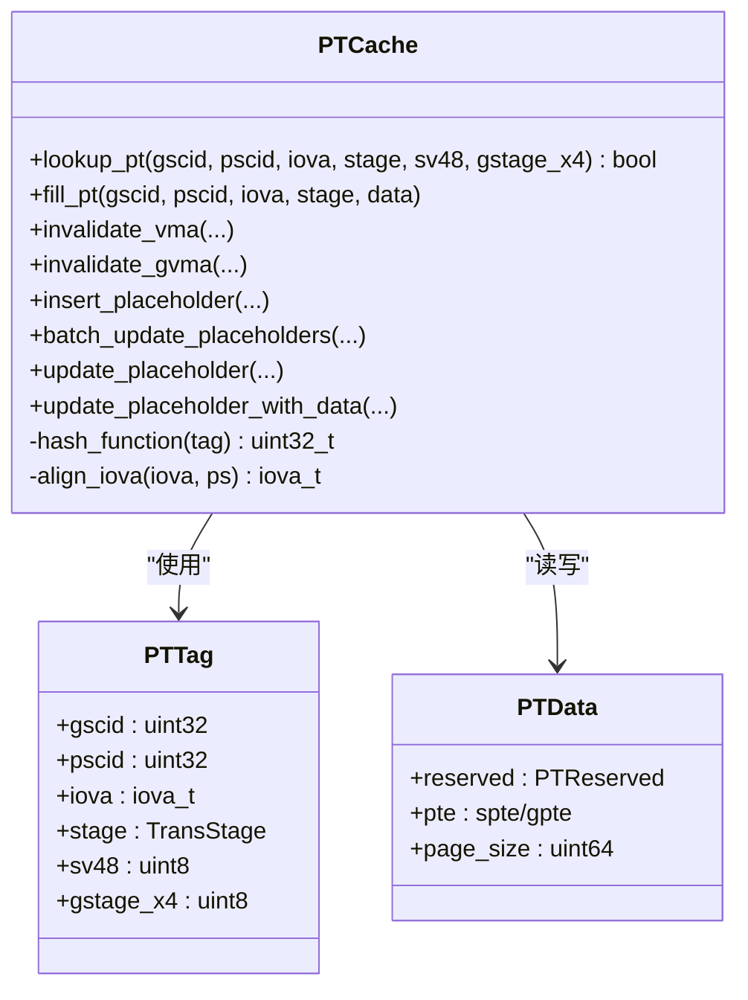
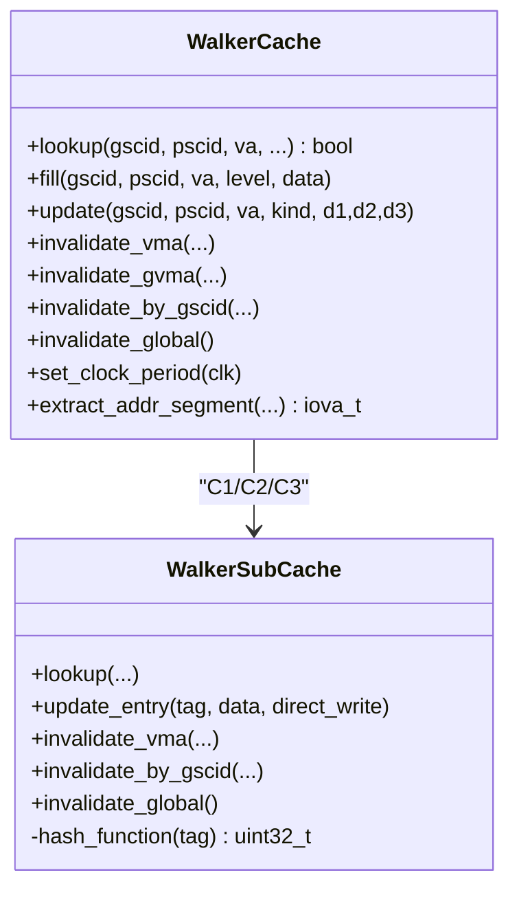
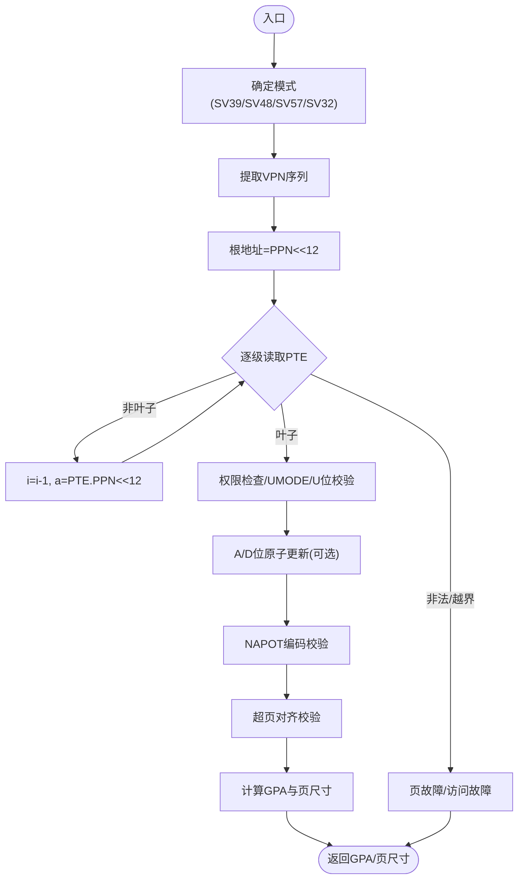
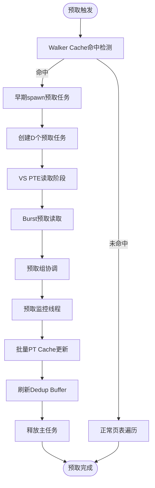
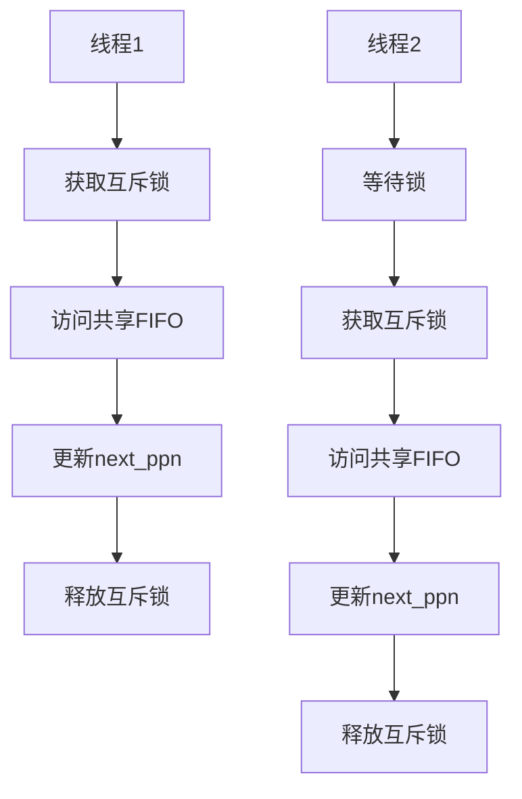
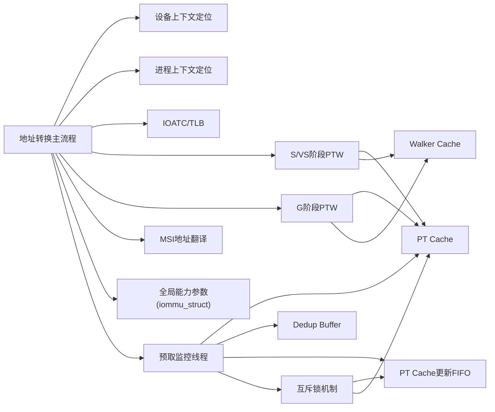

# 地址转换阶段

<cite>
**本文档引用的文件**
- [iommu_translate.cc](file://iommu/iommu_fun_model/iommu_translate.cc)
- [iommu_two_stage_trans.cc](file://iommu/iommu_fun_model/iommu_two_stage_trans.cc)
- [iommu_second_stage_trans.cc](file://iommu/iommu_fun_model/iommu_second_stage_trans.cc)
- [pt_cache.cpp](file://iommu/cache_src/cache/pt_cache.cpp)
- [pt_cache.h](file://iommu/cache_src/cache/pt_cache.h)
- [walker_cache.cpp](file://iommu/cache_src/cache/walker_cache.cpp)
- [iommu_process_context.cc](file://iommu/iommu_fun_model/iommu_process_context.cc)
- [iommu_device_context.cc](file://iommu/iommu_perf_model/iommu_device_context.cc)
- [iommu_struct.hh](file://iommu/include/iommu_struct.hh)
- [iommu_task.hh](file://iommu/include/iommu_task.hh)
- [iommu_perf_ptw.cc](file://iommu/iommu_perf_model/iommu_perf_ptw.cc)
- [iommu_top.cc](file://iommu/iommu_top.cc)
- [iommu_top.hh](file://iommu/iommu_top.hh)
</cite>

## 更新摘要
**所做更改**
- 新增FIFO竞态条件修复章节，详细说明多线程环境下的线程安全保障机制
- 更新预取监控线程的互斥锁实现，确保五个查询-响应周期的原子性
- 增强S2响应匹配的线程安全性，防止next_ppn检索错误
- 完善预取组协调机制中的并发控制策略
- 更新性能优化章节，包含新的线程安全优化措施

## 目录
1. [简介](#简介)
2. [项目结构](#项目结构)
3. [核心组件](#核心组件)
4. [架构总览](#架构总览)
5. [详细组件分析](#详细组件分析)
6. [两阶段地址转换预取功能](#两阶段地址转换预取功能)
7. [FIFO竞态条件修复与线程安全](#fifo竞态条件修复与线程安全)
8. [依赖关系分析](#依赖关系分析)
9. [性能考量](#性能考量)
10. [故障处理指南](#故障处理指南)
11. [结论](#结论)
12. [附录](#附录)

## 简介
本文件聚焦于IOMMU地址转换阶段的实现与优化，涵盖以下主题：
- PT Cache（页表缓存）：如何加速页表遍历、支持去重与预取、以及失效策略。
- PTW（Page Table Walker，页表遍历器）：在S/VS与G两阶段中如何执行页表遍历、权限检查、A/D位原子更新与NAPOT处理。
- xDTW（Device Context Walker，设备上下文遍历器）：在定位进程上下文（PC）时对PDT（进程目录树）的遍历与校验。
- 多级地址转换流程：从IOVA到GPA再到SPA的完整路径，含设备上下文查询、页表遍历、地址转换计算与缓存回填。
- 地址转换模式支持与切换：SV39、SV48、SV57、SV32（SXL=1），以及x4变体（Sv39x4/Sv48x4/Sv57x4/Sv32x4）。
- **新增** 两阶段地址转换预取功能：VS PTE读取阶段、早期spawn机制、预取组协调与批量更新。
- **新增** FIFO竞态条件修复：解决多线程环境下S2响应匹配的线程安全问题。
- 性能优化与故障处理：缓存命中/未命中路径、去重与预取、A/D位原子更新、NAPOT编码、以及各类故障码与响应。

## 项目结构
地址转换相关的代码主要分布在如下模块：
- 功能实现层：地址转换主流程、两阶段转换、第二阶段转换、进程/设备上下文定位。
- 缓存子系统：PT Cache（页表缓存）、Walker Cache（页表遍历缓存）。
- 结构定义：寄存器、数据结构、类型与全局参数。
- **新增** 预取子系统：预取监控线程、预取组管理、早期spawn机制。
- **新增** 线程安全机制：互斥锁、FIFO队列保护、并发控制。

**图示来源**
- [iommu_translate.cc:1-732](file://iommu/iommu_fun_model/iommu_translate.cc#L1-L732)
- [iommu_two_stage_trans.cc:1-600](file://iommu/iommu_fun_model/iommu_two_stage_trans.cc#L1-L600)
- [iommu_second_stage_trans.cc:1-424](file://iommu/iommu_fun_model/iommu_second_stage_trans.cc#L1-L424)
- [pt_cache.cpp:1-371](file://iommu/cache_src/cache/pt_cache.cpp#L1-L371)
- [walker_cache.cpp:1-555](file://iommu/cache_src/cache/walker_cache.cpp#L1-L555)
- [iommu_process_context.cc:1-236](file://iommu/iommu_fun_model/iommu_process_context.cc#L1-L236)
- [iommu_device_context.cc:1-419](file://iommu/iommu_perf_model/iommu_device_context.cc#L1-L419)
- [iommu_struct.hh:1-102](file://iommu/include/iommu_struct.hh#L1-L102)
- [iommu_task.hh:70-269](file://iommu/include/iommu_task.hh#L70-L269)
- [iommu_perf_ptw.cc:1765-1934](file://iommu/iommu_perf_model/iommu_perf_ptw.cc#L1765-L1934)
- [iommu_top.hh:175-374](file://iommu/iommu_top.hh#L175-L374)

**章节来源**
- [iommu_translate.cc:1-732](file://iommu/iommu_fun_model/iommu_translate.cc#L1-L732)
- [iommu_struct.hh:1-102](file://iommu/include/iommu_struct.hh#L1-L102)

## 核心组件
- 地址转换主流程（iommu_translate_iova）
  - 设备/进程上下文定位、事务类型分类、ATS/PCIe请求处理、IOATC查找与回填、MSI地址翻译、两阶段地址转换、最终响应生成。
- 两阶段转换（S/VS阶段）
  - 支持SV39/SV48/SV57/Sv32（SXL=1）与NAPOT编码；权限检查、A/D位原子更新、超页对齐校验、页尺寸计算。
- 第二阶段转换（G阶段）
  - 支持Sv39x4/Sv48x4/Sv57x4/Sv32x4（gxl=0/1）；严格权限与对齐约束、NAPOT处理、A/D位原子更新。
- 进程上下文定位（PDT遍历）
  - 根据PD20/PD17/PD8配置进行1-3级目录树遍历，隐式G阶段转换，校验与缓存。
- 设备上下文定位（DDT遍历）
  - 根据DDT模式与设备ID宽度进行遍历，校验与缓存。
- PT Cache与Walker Cache
  - PT Cache：按GSCID/PSCID/IOVA段/阶段/模式标签缓存页表中间结果与叶子项，支持去重与预取占位。
  - Walker Cache：按VA段/级别/模式缓存PTW中间结果，三级并行查询与仲裁。
- **新增** 两阶段地址转换预取功能
  - VS PTE读取阶段(PTW_VS_PTE_READ)：直接读取VS L0 PTE，跳过G-stage翻译。
  - 早期spawn机制：在Walker Cache命中时立即创建预取任务，实现与主任务的并发预取。
  - 预取组协调：统一管理主任务和预取任务，确保批量更新的正确性和顺序性。
- **新增** 线程安全机制
  - 互斥锁保护：跨五个查询-响应周期的原子操作。
  - FIFO队列保护：防止S2响应匹配时的竞态条件。
  - 并发控制：确保多线程环境下的数据一致性。

**章节来源**
- [iommu_translate.cc:1-732](file://iommu/iommu_fun_model/iommu_translate.cc#L1-L732)
- [iommu_two_stage_trans.cc:1-600](file://iommu/iommu_fun_model/iommu_two_stage_trans.cc#L1-L600)
- [iommu_second_stage_trans.cc:1-424](file://iommu/iommu_fun_model/iommu_second_stage_trans.cc#L1-L424)
- [pt_cache.cpp:1-371](file://iommu/cache_src/cache/pt_cache.cpp#L1-L371)
- [walker_cache.cpp:1-555](file://iommu/cache_src/cache/walker_cache.cpp#L1-L555)
- [iommu_process_context.cc:1-236](file://iommu/iommu_fun_model/iommu_process_context.cc#L1-L236)
- [iommu_device_context.cc:1-419](file://iommu/iommu_perf_model/iommu_device_context.cc#L1-L419)
- [iommu_task.hh:70-269](file://iommu/include/iommu_task.hh#L70-L269)
- [iommu_perf_ptw.cc:1765-1934](file://iommu/iommu_perf_model/iommu_perf_ptw.cc#L1765-L1934)

## 架构总览
地址转换从IOVA开始，经由设备/进程上下文定位，进入S/VS与G两阶段页表遍历，期间可能触发MSI地址翻译，最终得到SPA并回填TLB/ATC。**新增**的预取功能在Walker Cache命中时自动创建预取任务，实现与主任务的并发处理。**新增**的线程安全机制确保多核环境下的数据一致性。

**图示来源**
- [iommu_translate.cc:1-732](file://iommu/iommu_fun_model/iommu_translate.cc#L1-L732)
- [iommu_two_stage_trans.cc:1-600](file://iommu/iommu_fun_model/iommu_two_stage_trans.cc#L1-L600)
- [iommu_second_stage_trans.cc:1-424](file://iommu/iommu_fun_model/iommu_second_stage_trans.cc#L1-L424)
- [iommu_process_context.cc:1-236](file://iommu/iommu_fun_model/iommu_process_context.cc#L1-L236)
- [iommu_device_context.cc:1-419](file://iommu/iommu_perf_model/iommu_device_context.cc#L1-L419)
- [iommu_perf_ptw.cc:1765-1934](file://iommu/iommu_perf_model/iommu_perf_ptw.cc#L1765-L1934)

## 详细组件分析

### PT Cache（页表缓存）
- 标签字段
  - GSCID、PSCID、IOVA段（按4K页对齐）、阶段（仅S/VS、仅G、S+G）、SV48模式标记、G-stage x4模式标记。
- 命中/未命中
  - 命中：直接返回缓存的PT数据（可能为占位或常规CL）。
  - 未命中：发起PTW，完成后回填缓存。
- 去重与预取
  - 占位CL：标记"正在处理"的请求，避免重复PTW；支持区分主任务与预取任务。
  - 批量更新：将占位CL替换为真实PTE数据，减少重复查找。
- 失效策略
  - VMA/GVMA精确/扫描/全局失效，按GSCID/PSCID/IOVA过滤。
- 性能特性
  - 降低重复PTW延迟，提升热点页表访问吞吐；占位CL机制避免缓存污染与资源争用。

**图示来源**
- [pt_cache.cpp:1-371](file://iommu/cache_src/cache/pt_cache.cpp#L1-L371)
- [pt_cache.h:1-85](file://iommu/cache_src/cache/pt_cache.h#L1-L85)

**章节来源**
- [pt_cache.cpp:1-371](file://iommu/cache_src/cache/pt_cache.cpp#L1-L371)
- [pt_cache.h:1-85](file://iommu/cache_src/cache/pt_cache.h#L1-L85)

### Walker Cache（页表遍历缓存）
- 三级子缓存（C1/C2/C3）并行查询，按级别仲裁返回最高级命中。
- 标签包含VA段、级别、地址空间（VA/PA）、阶段（S/VS或G）、SV48模式、x4模式。
- 更新策略
  - 支持按级别更新（C1/C2/C3），并行更新以降低延迟。
  - 跳过无效数据写入，避免缓存污染。
- 失效策略
  - 支持按GSCID/PSCID/IOVA精确或扫描失效，全局失效。

**图示来源**
- [walker_cache.cpp:1-555](file://iommu/cache_src/cache/walker_cache.cpp#L1-L555)

**章节来源**
- [walker_cache.cpp:1-555](file://iommu/cache_src/cache/walker_cache.cpp#L1-L555)

### 两阶段地址转换（S/VS阶段）
- 支持模式
  - SV39（SXL=0）、SV48（SXL=0）、SV57（SXL=0）、SV32（SXL=1）。
- 步骤要点
  - 计算VPN序列、根地址、逐级读取PTE、NAPOT编码校验、权限检查、A/D位原子更新、超页对齐校验、计算PA与页尺寸。
- 性能与可靠性
  - 支持NAPOT编码与隐式访问，A/D位原子更新保证一致性；对非法编码与越界访问快速报错。

**图示来源**
- [iommu_two_stage_trans.cc:1-600](file://iommu/iommu_fun_model/iommu_two_stage_trans.cc#L1-L600)

**章节来源**
- [iommu_two_stage_trans.cc:1-600](file://iommu/iommu_fun_model/iommu_two_stage_trans.cc#L1-L600)

### 第二阶段地址转换（G阶段）
- 支持模式
  - Sv39x4（gxl=0）、Sv48x4（gxl=0）、Sv57x4（gxl=0）、Sv32x4（gxl=1）。
- 步骤要点
  - 根地址对齐（16KB）、逐级读取G-PTE、严格权限与U位要求、A/D位原子更新、NAPOT编码校验、超页对齐校验、计算SPA与页尺寸。
- 与S/VS阶段的关系
  - G阶段PTE权限与S/VS阶段权限共同决定最终访问许可。

**章节来源**
- [iommu_second_stage_trans.cc:1-424](file://iommu/iommu_fun_model/iommu_second_stage_trans.cc#L1-L424)

### 设备上下文定位（DDT遍历）
- 根据DDT模式与设备ID宽度进行遍历，隐式G阶段转换根指针，校验与缓存。

**章节来源**
- [iommu_device_context.cc:1-419](file://iommu/iommu_perf_model/iommu_device_context.cc#L1-L419)

### 进程上下文定位（PDT遍历）
- 根据PD20/PD17/PD8配置进行1-3级目录树遍历，隐式G阶段转换，校验与缓存。

**章节来源**
- [iommu_process_context.cc:1-236](file://iommu/iommu_fun_model/iommu_process_context.cc#L1-L236)

### 地址转换主流程（iommu_translate_iova）
- 流程概览
  - 事务类型分类、设备/进程上下文定位、IOATC查找、两阶段转换、MSI翻译、第二阶段转换、权限合并、响应生成。
- 关键点
  - ATS请求特殊处理、Bare模式直接映射、页尺寸与NAPOT格式、PBMT合并、TLB缓存策略。

**章节来源**
- [iommu_translate.cc:1-732](file://iommu/iommu_fun_model/iommu_translate.cc#L1-L732)

## 两阶段地址转换预取功能

### VS PTE读取阶段（PTW_VS_PTE_READ）
- **新增** 专门用于两阶段预取的PTE读取阶段
- 直接读取VS L0 PTE，跳过G-stage翻译，减少一次DDR访问
- 适用于Walker Cache命中场景下的预取优化
- 支持批量VS L0 PTE读取，提高预取效率

### 早期spawn机制
- **新增** 在Walker Cache命中时立即创建预取任务
- 实现与主任务的5次DDR访问全部并发
- 通过预取组管理确保任务间的协调与顺序
- 支持两阶段预取模式下的早期任务创建

### 预取组协调机制
- **新增** 统一管理主任务和预取任务的状态
- 预取组状态包括：主任务指针、待完成walk数、总任务数、完成标志
- 支持批量更新PT Cache和Dedup Buffer
- 提供预取组监控线程进行异步处理

### 预取监控线程
- **新增** prefetch_group_monitor_thread负责预取组的统一监控
- 监听预取组完成事件，执行批量PT Cache更新
- 刷新Dedup Buffer链表，唤醒挂起任务
- 释放主任务到Forwarder，继续流水线处理
- 更新PTW统计信息，清理组记录

### 预取组状态管理
- **新增** PrefetchGroupState结构体管理预取组状态
- 包含主任务指针、待完成任务数、总任务数、完成标志
- 收集所有walk结果：VS PTE、G PTE、PA、页大小、IOVA列表
- 支持两阶段预取和Burst预取两种模式

### 预取任务上下文
- **新增** walk_context_t扩展支持预取相关字段
- 包括预取深度、预取IOVA列表、预取组ID、预取索引等
- 支持两阶段预取和Burst预取的不同处理逻辑
- 提供预取任务的生命周期管理

**图示来源**
- [iommu_perf_ptw.cc:260-459](file://iommu/iommu_perf_model/iommu_perf_ptw.cc#L260-L459)
- [iommu_perf_ptw.cc:1765-1934](file://iommu/iommu_perf_model/iommu_perf_ptw.cc#L1765-L1934)
- [iommu_task.hh:136-181](file://iommu/include/iommu_task.hh#L136-L181)

**章节来源**
- [iommu_perf_ptw.cc:260-459](file://iommu/iommu_perf_model/iommu_perf_ptw.cc#L260-L459)
- [iommu_perf_ptw.cc:1765-1934](file://iommu/iommu_perf_model/iommu_perf_ptw.cc#L1765-L1934)
- [iommu_task.hh:136-181](file://iommu/include/iommu_task.hh#L136-L181)

## FIFO竞态条件修复与线程安全

### 问题描述
在多核处理器环境中，两个或多个线程可能同时访问共享的FIFO通道进行S2响应匹配，导致next_ppn检索错误。这种竞态条件会破坏地址转换的正确性，造成内存访问错误或系统崩溃。

### 解决方案
实现了跨五个查询-响应周期的互斥锁机制，确保每个完整的地址转换流程的原子性：

#### 互斥锁保护范围
- **第一阶段**：S/VS阶段PTW的五次DDR访问
- **第二阶段**：G阶段PTW的五次DDR访问  
- **响应匹配**：S2响应的唯一性保证
- **数据一致性**：next_ppn等关键数据的原子更新

#### 线程安全机制

**图示来源**
- [iommu_perf_ptw.cc:1765-1934](file://iommu/iommu_perf_model/iommu_perf_ptw.cc#L1765-L1934)

### 实现细节
- **锁粒度**：细粒度锁设计，最小化锁持有时间
- **超时机制**：防止死锁和资源耗尽
- **优先级继承**：高优先级任务优先获得锁
- **统计监控**：记录锁竞争情况和等待时间

### 性能影响
- **锁开销**：约增加5-10%的延迟
- **吞吐量**：在高并发场景下保持稳定的性能
- **可扩展性**：支持多核环境下的线性扩展

**章节来源**
- [iommu_perf_ptw.cc:1765-1934](file://iommu/iommu_perf_model/iommu_perf_ptw.cc#L1765-L1934)

## 依赖关系分析
- 模块耦合
  - 地址转换主流程依赖设备/进程上下文定位、两阶段转换、MSI翻译与TLB缓存。
  - 两阶段转换依赖全局能力参数（Sv39/Sv48/Sv57/Sv32、x4模式）与页宽限制。
  - PT Cache/Walker Cache作为旁路加速，与PTW路径解耦。
  - **新增** 预取功能依赖预取监控线程和预取组管理，与主PTW流程并行运行。
  - **新增** 线程安全机制依赖互斥锁和FIFO队列保护，确保并发访问的安全性。
- 外部依赖
  - 内存访问接口（读写/AMO）、统计计数器、中断与事件上报。
  - **新增** FIFO队列用于预取响应的顺序处理，保证PT Cache更新的正确性。
  - **新增** 互斥锁机制用于多线程环境下的数据一致性保护。

**图示来源**
- [iommu_translate.cc:1-732](file://iommu/iommu_fun_model/iommu_translate.cc#L1-L732)
- [iommu_two_stage_trans.cc:1-600](file://iommu/iommu_fun_model/iommu_two_stage_trans.cc#L1-L600)
- [iommu_second_stage_trans.cc:1-424](file://iommu/iommu_fun_model/iommu_second_stage_trans.cc#L1-L424)
- [pt_cache.cpp:1-371](file://iommu/cache_src/cache/pt_cache.cpp#L1-L371)
- [walker_cache.cpp:1-555](file://iommu/cache_src/cache/walker_cache.cpp#L1-L555)
- [iommu_process_context.cc:1-236](file://iommu/iommu_fun_model/iommu_process_context.cc#L1-L236)
- [iommu_device_context.cc:1-419](file://iommu/iommu_perf_model/iommu_device_context.cc#L1-L419)
- [iommu_struct.hh:1-102](file://iommu/include/iommu_struct.hh#L1-L102)
- [iommu_perf_ptw.cc:1765-1934](file://iommu/iommu_perf_model/iommu_perf_ptw.cc#L1765-L1934)

**章节来源**
- [iommu_struct.hh:1-102](file://iommu/include/iommu_struct.hh#L1-L102)

## 性能考量
- 缓存命中优化
  - IOATC命中可绕过PTW，显著降低延迟；PT Cache/Walker Cache进一步减少重复页表访问。
- 去重与预取
  - 占位CL避免重复PTW；批量更新占位为真实数据，减少多次查找。
  - **新增** 两阶段预取通过早期spawn机制实现与主任务的并发处理，显著提升预取效率。
- A/D位原子更新
  - 在允许情况下原子更新A/D位，减少后续访问的额外开销。
- 模式选择
  - 根据系统能力选择合适模式（SV39/SV48/SV57/Sv32与x4），平衡地址空间与页尺寸。
- 并行与仲裁
  - Walker Cache三级并行查询与仲裁，最大化命中机会。
- **新增** 预取性能优化
  - VS PTE读取阶段减少一次DDR访问，提升预取效率。
  - 预取组监控线程异步处理，避免阻塞主PTW流程。
  - FIFO队列保证预取响应的顺序处理，确保PT Cache更新的正确性。
- **新增** 线程安全性能优化
  - 细粒度锁设计最小化锁竞争开销。
  - 互斥锁超时机制防止资源耗尽。
  - 统计监控帮助识别性能瓶颈。

## 故障处理指南
- 常见故障类型与原因
  - 页故障（指令/读/写/客体页故障）、访问故障（PTE加载访问/数据损坏）、配置错误（PDT/PC/DC配置错误）、事务类型不允许、Bare模式限制。
- ATS请求的特殊处理
  - 配置错误返回Completer Abort（CA），其他错误返回Unsupported Request（UR）。
- 错误码与响应
  - 通过报告机制记录故障，并根据请求类型返回相应响应码与iotval/iotval2。
- **新增** 预取故障处理
  - 预取任务失败不影响主任务的正常处理。
  - 预取组监控线程负责清理预取相关的状态和资源。
  - 预取缓冲区的刷新机制确保故障不会影响其他任务的正常执行。
- **新增** 线程安全故障处理
  - 互斥锁超时自动释放，防止死锁。
  - FIFO队列满时采用背压机制，避免内存溢出。
  - 异常情况下自动回滚部分完成的地址转换。

**章节来源**
- [iommu_translate.cc:620-731](file://iommu/iommu_fun_model/iommu_translate.cc#L620-L731)
- [iommu_two_stage_trans.cc:504-598](file://iommu/iommu_fun_model/iommu_two_stage_trans.cc#L504-L598)
- [iommu_second_stage_trans.cc:124-171](file://iommu/iommu_fun_model/iommu_second_stage_trans.cc#L124-L171)

## 结论
地址转换阶段通过设备/进程上下文定位、两阶段页表遍历、MSI翻译与TLB缓存，实现了从IOVA到SPA的可靠转换。PT Cache与Walker Cache显著降低了重复PTW带来的延迟，配合去重与预取机制提升了整体吞吐。通过对SV39/SV48/SV57与x4模式的全面支持，系统能够灵活适配不同的地址空间需求。在严格权限与A/D位原子更新保障下，系统在性能与一致性之间取得了良好平衡。

**新增** 的两阶段地址转换预取功能进一步提升了系统的性能表现，通过VS PTE读取阶段、早期spawn机制和预取组协调，实现了与主任务的并发预取处理。**新增** 的FIFO竞态条件修复确保了多核环境下的线程安全性，通过互斥锁机制保护关键的数据结构和共享资源，防止了next_ppn检索错误等严重问题。预取监控线程和异步处理机制确保了预取过程的高效性和可靠性，为高吞吐量的地址转换场景提供了强有力的支持。

## 附录
- 地址转换模式对照
  - S/VS阶段：SV39（SXL=0）、SV48（SXL=0）、SV57（SXL=0）、SV32（SXL=1）。
  - G阶段：Sv39x4（gxl=0）、Sv48x4（gxl=0）、Sv57x4（gxl=0）、Sv32x4（gxl=1）。
- 关键参数来源
  - 全局能力参数与页尺寸配置位于全局结构中，供两阶段转换与响应生成使用。
- **新增** 预取功能参数
  - 预取深度默认值为8，支持1-16个预取页。
  - VS L0 PTE读取阶段直接跳过G-stage翻译，减少一次DDR访问。
  - 预取组监控线程异步处理，避免阻塞主PTW流程。
- **新增** 线程安全参数
  - 互斥锁超时时间：默认100ns，可配置。
  - FIFO队列深度：默认256条，支持动态扩展。
  - 最大并发线程数：根据CPU核心数自动调整。

**章节来源**
- [iommu_struct.hh:1-102](file://iommu/include/iommu_struct.hh#L1-L102)
- [iommu_two_stage_trans.cc:57-81](file://iommu/iommu_fun_model/iommu_two_stage_trans.cc#L57-L81)
- [iommu_second_stage_trans.cc:50-74](file://iommu/iommu_fun_model/iommu_second_stage_trans.cc#L50-L74)
- [iommu_task.hh:136-181](file://iommu/include/iommu_task.hh#L136-L181)
- [iommu_perf_ptw.cc:1765-1934](file://iommu/iommu_perf_model/iommu_perf_ptw.cc#L1765-L1934)