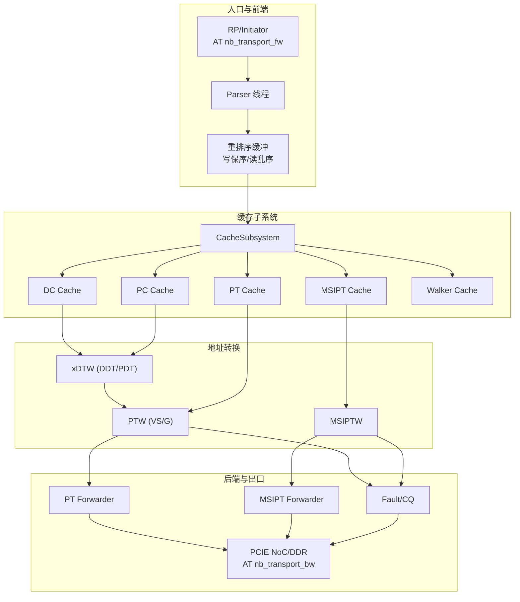
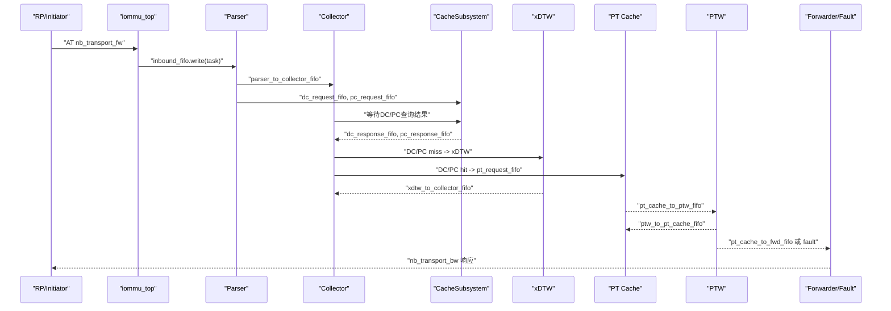
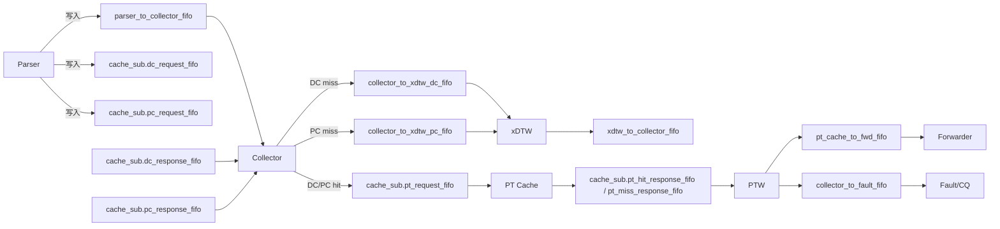
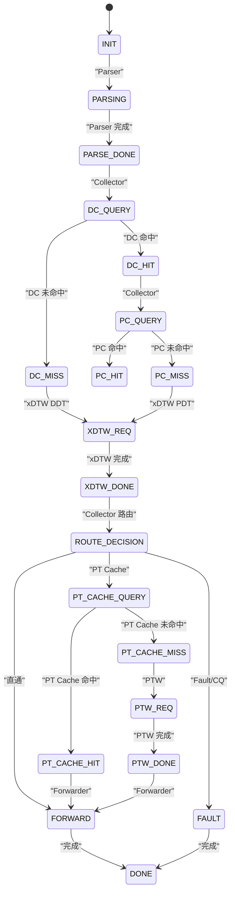

# 流水线设计

<cite>
**本文档引用的文件**
- [iommu_top.cc](file://iommu/iommu_top.cc)
- [iommu_top.hh](file://iommu/iommu_top.hh)
- [iommu_perf_parser.cc](file://iommu/iommu_perf_model/iommu_perf_parser.cc)
- [iommu_perf_model.hh](file://iommu/iommu_perf_model/iommu_perf_model.hh)
- [iommu_perf_collector.cc](file://iommu/iommu_perf_model/iommu_perf_collector.cc)
- [iommu_perf_dc_pc_cache.cc](file://iommu/iommu_perf_model/iommu_perf_dc_pc_cache.cc)
- [iommu_perf_pt_cache_response.cc](file://iommu/iommu_perf_model/iommu_perf_pt_cache_response.cc)
- [iommu_perf_forwarder_fault_cq.cc](file://iommu/iommu_perf_model/iommu_perf_forwarder_fault_cq.cc)
- [cache_subsystem.h](file://iommu/cache_src/subsystem/cache_subsystem.h)
- [iommu_task.hh](file://iommu/include/iommu_task.hh)
- [iommu_struct.hh](file://iommu/include/iommu_struct.hh)
- [iommu_req_rsp.hh](file://iommu/include/iommu_req_rsp.hh)
- [iommu_dedup_params.hh](file://iommu/include/iommu_dedup_params.hh)
</cite>

## 目录
1. [简介](#简介)
2. [项目结构](#项目结构)
3. [核心组件](#核心组件)
4. [架构总览](#架构总览)
5. [详细组件分析](#详细组件分析)
6. [依赖关系分析](#依赖关系分析)
7. [性能考量](#性能考量)
8. [故障排查指南](#故障排查指南)
9. [结论](#结论)
10. [附录](#附录)

## 简介
本文件系统性阐述 IOMMU 多阶段并行流水线设计，覆盖 Parser、Collector、缓存查询、地址转换、结果转发等阶段的流水线组织方式与数据依赖关系。重点说明：
- 各阶段并行度与并发控制（outstanding、FIFO 深度、仲裁）
- 阶段间数据依赖与同步机制（事件通知、重排序缓冲）
- 吞吐量优化策略（预取、去重、合并 burst、轮询调度）
- 任务调度与优先级管理（仲裁、优先级队列、稳态测量）
- 性能分析工具与调试方法（统计计数器、稳态窗口、延迟日志）

## 项目结构
IOMMU 性能模型采用 SystemC 并行线程模型，围绕 iommu_top 顶层模块构建多阶段流水线。关键目录与文件：
- 顶层与接口：iommu_top.{hh,cc}
- 性能模型线程：parser、collector、cache、xDTW、PT Cache、PTW、MSIPT Cache、Forwarder、Fault/CQ、DDR Arbiter、Reorder
- 缓存子系统：CacheSubsystem 封装 DC/PC/PT/MSIPT/Walker Cache 及其 lookup/update/invalidate 管线
- 任务与数据结构：iommu_task.hh、iommu_struct.hh、iommu_req_rsp.hh
- 参数与去重：iommu_dedup_params.hh

图表来源
- [iommu_top.hh:305-496](file://iommu/iommu_top.hh#L305-L496)
- [cache_subsystem.h:21-80](file://iommu/cache_src/subsystem/cache_subsystem.h#L21-L80)

章节来源
- [iommu_top.hh:44-502](file://iommu/iommu_top.hh#L44-L502)
- [cache_subsystem.h:1-189](file://iommu/cache_src/subsystem/cache_subsystem.h#L1-L189)

## 核心组件
- 顶层模块 iommu_top：负责 AT 回调、FIFO 管线、仲裁、重排序、统计计数、线程注册与生命周期管理
- CacheSubsystem：封装多类 Cache 的 lookup/update/invalidate 管线，提供独立响应出口，避免串行化
- 任务结构 iommu_task_t：贯穿全流水线的状态机、上下文、walk 上下文、去重与预取字段
- 关键参数 iommu_dedup_params.hh：去重缓冲容量、预取深度、页大小、PTE 有效性等

章节来源
- [iommu_top.cc:19-780](file://iommu/iommu_top.cc#L19-L780)
- [iommu_top.hh:44-502](file://iommu/iommu_top.hh#L44-L502)
- [cache_subsystem.h:21-189](file://iommu/cache_src/subsystem/cache_subsystem.h#L21-L189)
- [iommu_task.hh:184-378](file://iommu/include/iommu_task.hh#L184-L378)
- [iommu_dedup_params.hh:1-92](file://iommu/include/iommu_dedup_params.hh#L1-L92)

## 架构总览
IOMMU 流水线采用“阶段并行 + 管道解耦”的设计：
- Parser：解析请求属性、分类 TTYP、提取 DDI、生成任务并写入 Collector 与 Cache 请求 FIFO
- Collector：汇聚 Parser、DC/PC Cache 查询结果，进行路由决策（直通/走 xDTW/走 PT Cache）
- xDTW：执行 DDT/PDT 走访，回填 DC/PC 上下文并更新缓存
- PT Cache：查询 VS 页表，支持占位 CL、去重缓冲、预取与合并 burst
- PTW：执行 VS/G 两级页表遍历，支持预取、A/D 更新、Walker Cache 更新
- Forwarder/Fault/CQ：生成响应、重排序输出、故障上报与命令队列处理
- DDR Arbiter：多源请求仲裁（控制路径优先、轮询其他路径）、带宽控制与 outstanding 控制

图表来源
- [iommu_top.cc:140-201](file://iommu/iommu_top.cc#L140-L201)
- [iommu_perf_parser.cc:9-123](file://iommu/iommu_perf_model/iommu_perf_parser.cc#L9-L123)
- [iommu_perf_collector.cc:14-275](file://iommu/iommu_perf_model/iommu_perf_collector.cc#L14-L275)
- [cache_subsystem.h:34-66](file://iommu/cache_src/subsystem/cache_subsystem.h#L34-L66)
- [iommu_perf_forwarder_fault_cq.cc:13-179](file://iommu/iommu_perf_model/iommu_perf_forwarder_fault_cq.cc#L13-L179)

## 详细组件分析

### Parser 阶段
职责与流程
- 全局 outstanding 反压：超过阈值等待释放事件
- 注册重排序缓冲：记录入口时间戳，申请全局 outstanding
- TTYP 分类与访问属性提取
- 模式检查：Off/Bare 模式直接判定
- DDI 提取与宽度校验
- 并发写入 Collector 与 Cache 请求 FIFO

关键点
- 无串行延时，瓶颈由下游并发与 FIFO 深度决定
- 重排序注册确保出口保序

章节来源
- [iommu_perf_parser.cc:9-123](file://iommu/iommu_perf_model/iommu_perf_parser.cc#L9-L123)
- [iommu_top.cc:19-48](file://iommu/iommu_top.cc#L19-L48)

### Collector 阶段
职责与流程
- 汇聚 Parser 与 DC/PC Cache 查询结果，形成完整上下文
- 路由决策：
  - DC miss：走 xDTW DDT walk
  - DC hit：继续检查 EN_ATS、PDTV、T2GPA、PDTV、PID 等，决定是否走 PT Cache 或直通
  - PC miss：走 xDTW PDT walk
  - PC hit：基于 PC.fsc 配置，决定 iosatp/iohgatp/SXL/SADE/GADE，最终走 PT Cache
- xDTW 结果回填：更新 DC/PC 缓存并再次进行路由判断

并发与同步
- pending_tasks 映射聚合三路输入
- outstanding 计数器限制 xDTW 并发，完成事件通知释放

章节来源
- [iommu_perf_collector.cc:14-275](file://iommu/iommu_perf_model/iommu_perf_collector.cc#L14-L275)
- [iommu_perf_collector.cc:281-457](file://iommu/iommu_perf_model/iommu_perf_collector.cc#L281-L457)

### 缓存查询阶段（DC/PC/PT/MSIPT）
- CacheSubsystem 将不同 Cache 的查询与更新分离到独立 FIFO，避免串行化
- PT Cache 新增去重缓冲与预取支持，占位 CL 与常规 CL 区分处理
- Walker Cache 采用统一轮询调度，降低互锁风险

章节来源
- [cache_subsystem.h:21-189](file://iommu/cache_src/subsystem/cache_subsystem.h#L21-L189)
- [iommu_perf_dc_pc_cache.cc:11-123](file://iommu/iommu_perf_model/iommu_perf_dc_pc_cache.cc#L11-L123)
- [iommu_perf_pt_cache_response.cc:20-100](file://iommu/iommu_perf_model/iommu_perf_pt_cache_response.cc#L20-L100)

### 地址转换阶段（xDTW/PTW/MSIPTW）
- xDTW：DDT/PDT 两阶段遍历，支持读取 DC/PC 并回填上下文
- PTW：VS/G 两级页表遍历，支持预取、A/D 更新、合并 burst、Walker Cache 更新
- MSIPTW：MSI 地址识别与处理

章节来源
- [iommu_task.hh:82-182](file://iommu/include/iommu_task.hh#L82-L182)
- [iommu_perf_model.hh:57-108](file://iommu/iommu_perf_model/iommu_perf_model.hh#L57-L108)

### 结果转发与故障处理
- PT Forwarder：设置 PA 到 payload，标记重排序就绪
- MSIPT Forwarder：根据 is_msi/is_mrif 路由到 IMSIC 或 DMA
- Fault/CQ：记录故障、分类响应状态、统一进入重排序

章节来源
- [iommu_perf_forwarder_fault_cq.cc:13-179](file://iommu/iommu_perf_model/iommu_perf_forwarder_fault_cq.cc#L13-L179)

### 重排序与出口控制
- 写请求按 task_id 保序输出，读请求可乱序
- 重排序缓冲与全局 outstanding 计数联动，完成输出后释放

章节来源
- [iommu_top.hh:279-300](file://iommu/iommu_top.hh#L279-L300)

### DDR 仲裁与带宽控制
- 控制路径优先，其余路径轮询
- outstanding 与带宽延迟控制，避免拥塞

章节来源
- [iommu_top.cc:279-404](file://iommu/iommu_top.cc#L279-L404)

## 依赖关系分析

图表来源
- [iommu_top.hh:72-102](file://iommu/iommu_top.hh#L72-L102)
- [cache_subsystem.h:34-66](file://iommu/cache_src/subsystem/cache_subsystem.h#L34-L66)
- [iommu_perf_collector.cc:14-275](file://iommu/iommu_perf_model/iommu_perf_collector.cc#L14-L275)
- [iommu_perf_pt_cache_response.cc:20-100](file://iommu/iommu_perf_model/iommu_perf_pt_cache_response.cc#L20-L100)

章节来源
- [iommu_top.hh:72-102](file://iommu/iommu_top.hh#L72-L102)
- [cache_subsystem.h:34-66](file://iommu/cache_src/subsystem/cache_subsystem.h#L34-L66)

## 性能考量

吞吐量优化策略
- 并行度提升：Parser/Collector/xDTW/PT Cache/PTW/Forwarder/Fault/CQ/Arbiter 等多线程并行
- 去重与预取：PT Cache 去重缓冲与预取深度 D 控制，减少重复 PTW
- 合并 burst：PTW 支持合并读取，降低 DDR 访问次数
- 轮询调度：Walker Cache 统一轮询，避免死锁与饥饿
- 带宽与 outstanding 控制：DDR Arbiter 与端口 outstanding 限制，避免拥塞

瓶颈识别方法
- 统计计数器：IOPS、端口带宽、outstanding 峰值、PTW 任务延迟分布
- 稳态测量：设定稳态窗口（跳过 warmup/drain），计算稳态 IOPS 与效率
- 任务间隔分析：PT 调度器任务间隔 gap 报告，评估调度空闲时间

章节来源
- [iommu_top.cc:554-780](file://iommu/iommu_top.cc#L554-L780)
- [cache_subsystem.h:83-90](file://iommu/cache_src/subsystem/cache_subsystem.h#L83-L90)

## 故障排查指南

常见问题定位
- Parser/Collector 死锁：检查 pending_tasks 映射与三路输入事件
- PT Cache 命中异常：核对去重缓冲挂接与占位 CL 处理
- PTW 延迟过高：查看 DDR 访问次数与延迟统计、预取深度配置
- DDR 拥塞：检查 outstanding 峰值与仲裁策略
- 重排序乱序：确认写保序/读乱序语义与重排序缓冲状态

调试方法
- 启用任务跟踪与统计打印（CacheSubsystem 内部统计、PT 调度 gap 报告）
- 使用稳态窗口测量 IOPS 与效率，定位异常波动
- 观察各阶段 FIFO 可用/占用情况与事件触发

章节来源
- [cache_subsystem.h:75-84](file://iommu/cache_src/subsystem/cache_subsystem.h#L75-L84)
- [iommu_top.cc:554-780](file://iommu/iommu_top.cc#L554-L780)

## 结论
该 IOMMU 流水线通过“阶段并行 + 管线解耦 + 去重与预取 + 统一轮询调度 + 重排序与仲裁”的组合，在保证正确性的前提下最大化吞吐量。通过完善的统计与稳态测量机制，能够快速定位瓶颈并指导参数调优。

## 附录

### 任务状态机与阶段映射

图表来源
- [iommu_task.hh:20-48](file://iommu/include/iommu_task.hh#L20-L48)