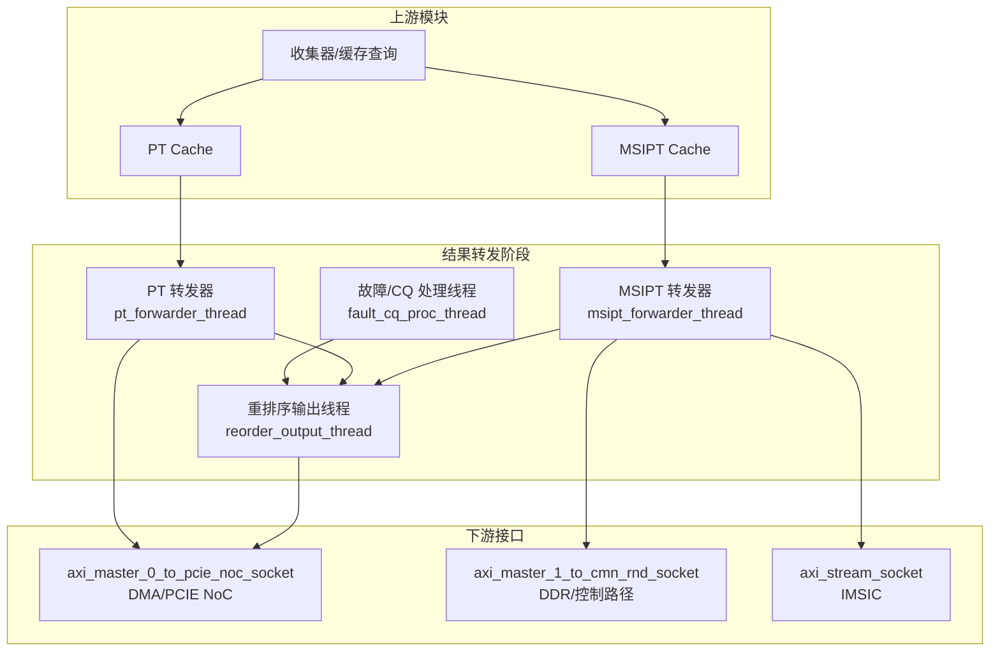
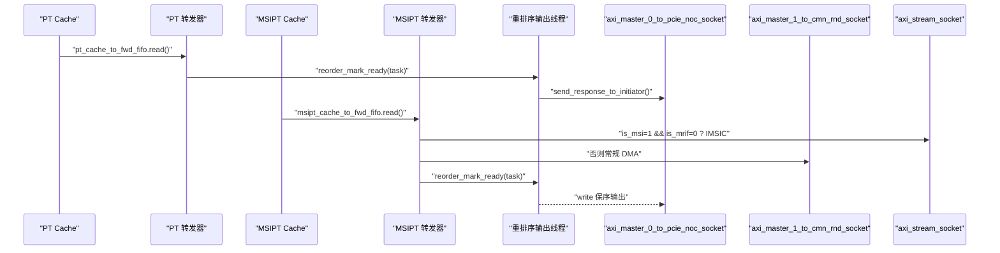
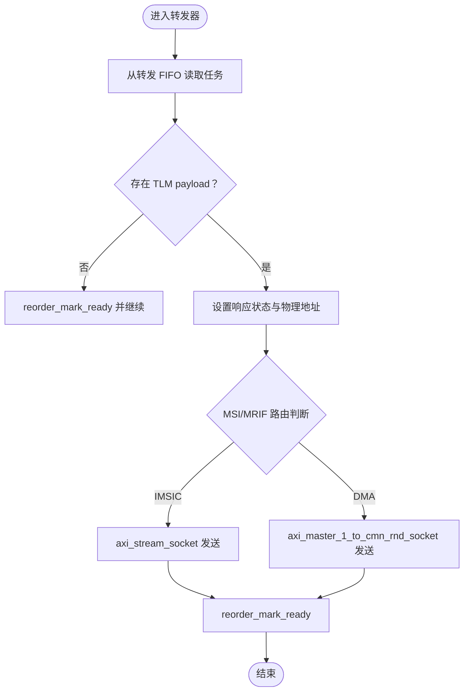
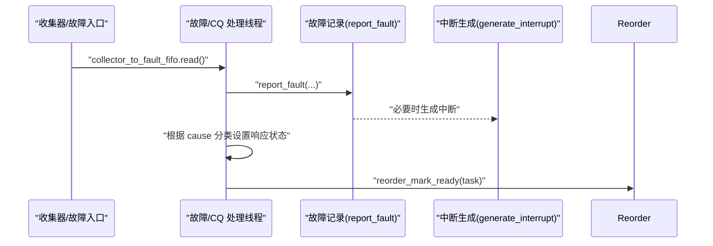
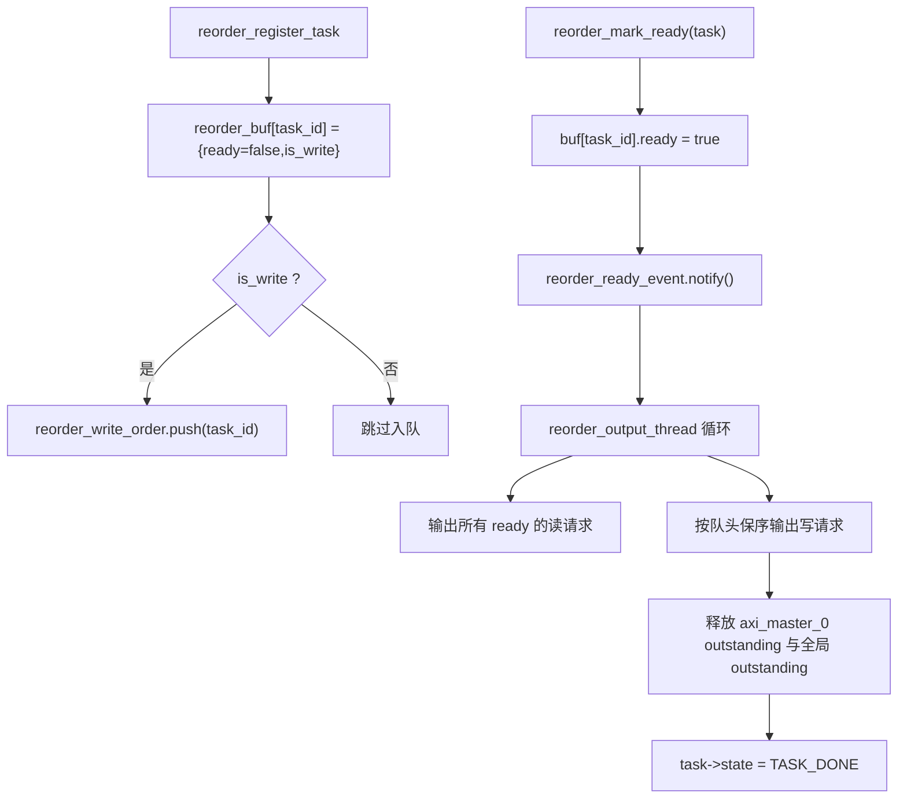
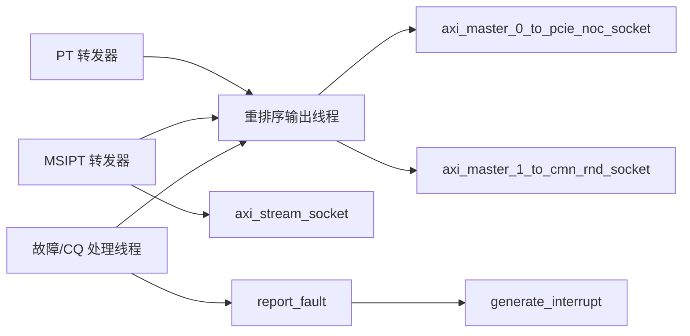

# 结果转发阶段

<cite>
**本文引用的文件**
- [iommu_perf_forwarder_fault_cq.cc](file://iommu/iommu_perf_model/iommu_perf_forwarder_fault_cq.cc)
- [iommu_top.hh](file://iommu/iommu_top.hh)
- [iommu_task.hh](file://iommu/include/iommu_task.hh)
- [iommu_perf_reorder.cc](file://iommu/iommu_perf_model/iommu_perf_reorder.cc)
- [iommu_faults.cc](file://iommu/iommu_fun_model/iommu_faults.cc)
- [iommu_interrupt.cc](file://iommu/iommu_fun_model/iommu_interrupt.cc)
- [iommu_command_queue.hh](file://iommu/include/iommu_command_queue.hh)
- [iommu_command_queue.cc](file://iommu/iommu_perf_model/iommu_command_queue.cc)
- [iommu_perf_model.hh](file://iommu/iommu_perf_model/iommu_perf_model.hh)
- [iommu_top.cc](file://iommu/iommu_top.cc)
- [GDB_DEBUG_GUIDE.md](file://GDB_DEBUG_GUIDE.md)
</cite>

## 目录
1. [简介](#简介)
2. [项目结构](#项目结构)
3. [核心组件](#核心组件)
4. [架构总览](#架构总览)
5. [详细组件分析](#详细组件分析)
6. [依赖关系分析](#依赖关系分析)
7. [性能考量](#性能考量)
8. [故障排查指南](#故障排查指南)
9. [结论](#结论)
10. [附录](#附录)

## 简介
本章节聚焦于 IOMMU 性能模型中的“结果转发阶段”，涵盖三类关键子系统：
- 转发器（Forwarder）：负责将 PT Cache 与 MSIPT Cache 的翻译结果转发至下游接口（DMA/PCIE NoC/IMSIC）。
- 故障处理与命令队列（Fault/CQ）：负责故障记录、分类与响应生成，并处理软件通过命令队列下发的缓存失效与同步等指令。
- 重排序缓冲与并发控制：通过统一的重排序缓冲保证写请求保序、读请求乱序输出，同时维护全局 outstanding 控制。

本章将深入解析各组件的数据流、处理逻辑、优先级与队列管理机制，并给出性能监控与调试方法。

## 项目结构
结果转发阶段位于 iommu/iommu_perf_model 子目录，主要涉及以下文件：
- 转发与故障处理线程：iommu_perf_forwarder_fault_cq.cc
- 重排序缓冲与输出线程：iommu_perf_reorder.cc
- IOMMU 顶层模块声明与 FIFO/线程注册：iommu_top.hh
- 任务与上下文数据结构：iommu_task.hh
- 故障记录与中断生成：iommu_faults.cc、iommu_interrupt.cc
- 命令队列接口与实现：iommu_command_queue.hh、iommu_command_queue.cc
- 性能模型辅助函数：iommu_perf_model.hh
- 顶层初始化与回调：iommu_top.cc
- 调试指南：GDB_DEBUG_GUIDE.md

图示来源
- [iommu_perf_forwarder_fault_cq.cc:13-114](file://iommu/iommu_perf_model/iommu_perf_forwarder_fault_cq.cc#L13-L114)
- [iommu_perf_reorder.cc:91-198](file://iommu/iommu_perf_model/iommu_perf_reorder.cc#L91-L198)
- [iommu_top.hh:48-51](file://iommu/iommu_top.hh#L48-L51)
- [iommu_top.hh:348-353](file://iommu/iommu_top.hh#L348-L353)

章节来源
- [iommu_top.hh:380-496](file://iommu/iommu_top.hh#L380-L496)
- [iommu_perf_forwarder_fault_cq.cc:13-179](file://iommu/iommu_perf_model/iommu_perf_forwarder_fault_cq.cc#L13-L179)
- [iommu_perf_reorder.cc:18-199](file://iommu/iommu_perf_model/iommu_perf_reorder.cc#L18-L199)

## 核心组件
- 转发器（Forwarder）
  - PT 转发器：从 PT Cache 转发 FIFO 读取任务，构造 TLM 响应（设置响应状态与物理地址），标记为可输出并交由重排序缓冲统一下发。
  - MSIPT 转发器：根据 MSI/MRIF 标志路由到 IMSIC（axi_stream_socket）或常规 DMA（axi_master_1_to_cmn_rnd_socket），同样通过重排序缓冲下发。
- 故障/CQ 处理线程
  - 从故障 FIFO 读取任务，调用故障记录函数写入故障队列并生成中断；依据 ATS/非 ATS 与故障原因码分类设置响应状态；最终标记为可输出。
  - 命令队列处理：解析并执行软件下发的 IOTINVAL/IODIR/IOFENCE/ATS 等命令，必要时阻塞或延迟处理。
- 重排序缓冲与输出
  - 所有完成翻译或故障的任务均通过重排序缓冲统一调度：读请求到达即输出；写请求严格按 task_id 保序；输出后释放全局 outstanding。

章节来源
- [iommu_perf_forwarder_fault_cq.cc:13-179](file://iommu/iommu_perf_model/iommu_perf_forwarder_fault_cq.cc#L13-L179)
- [iommu_perf_reorder.cc:26-198](file://iommu/iommu_perf_model/iommu_perf_reorder.cc#L26-L198)
- [iommu_command_queue.cc:7-276](file://iommu/iommu_perf_model/iommu_command_queue.cc#L7-L276)

## 架构总览
结果转发阶段采用“多线程 + FIFO”的流水线设计：
- 上游通过缓存查询与页表遍历得到翻译结果，分别进入 PT Cache 与 MSIPT Cache。
- 转发器线程从对应转发 FIFO 读取任务，生成响应并标记 ready。
- 重排序输出线程统一消费 ready 任务，按规则输出并释放 outstanding。
- 故障路径与正常路径共享重排序缓冲，确保写保序、读乱序的语义。

图示来源
- [iommu_perf_forwarder_fault_cq.cc:13-114](file://iommu/iommu_perf_model/iommu_perf_forwarder_fault_cq.cc#L13-L114)
- [iommu_perf_reorder.cc:91-198](file://iommu/iommu_perf_model/iommu_perf_reorder.cc#L91-L198)
- [iommu_top.hh:48-51](file://iommu/iommu_top.hh#L48-L51)

## 详细组件分析

### 转发器（Forwarder）
- PT 转发器
  - 从 pt_cache_to_fwd_fifo 等待并读取任务；若无 TLM payload，仍需标记 ready 以释放 reorder_buf/outstanding。
  - 设置响应状态为 OK，并将物理地址写回 TLM payload 地址域；标记 task->state 为 TASK_FORWARD，调用 reorder_mark_ready。
  - 输出路径：通过 axi_master_0_to_pcie_noc_socket 发送响应（性能模型中直接下发到发起者）。
- MSIPT 转发器
  - 从 msipt_cache_to_fwd_fifo 读取任务；根据 is_msi 与 is_mrif 决定路由：
    - is_msi=1 且 is_mrif=0：通过 axi_stream_socket 发送到 IMSIC；
    - 否则：通过 axi_master_1_to_cmn_rnd_socket 发送到 DDR/CMN。
  - 同样设置响应状态与物理地址，标记 ready 并交由重排序输出。

图示来源
- [iommu_perf_forwarder_fault_cq.cc:13-114](file://iommu/iommu_perf_model/iommu_perf_forwarder_fault_cq.cc#L13-L114)

章节来源
- [iommu_perf_forwarder_fault_cq.cc:13-114](file://iommu/iommu_perf_model/iommu_perf_forwarder_fault_cq.cc#L13-L114)

### 故障处理与命令队列（Fault/CQ）
- 故障记录与分类
  - 从 collector_to_fault_fifo 读取任务，调用 report_fault 写入故障队列并生成中断（若允许）。
  - 对非 ATS 请求：统一设置为 GENERIC_ERROR_RESPONSE。
  - 对 ATS 请求：根据 cause 分类：
    - 成功（R=W=0）：OK_RESPONSE；
    - Completer Abort：GENERIC_ERROR_RESPONSE；
    - 其他：UNSUPPORTED_REQUEST（GENERIC_ERROR_RESPONSE）。
  - 最终通过 reorder_mark_ready 进入重排序输出。
- 命令队列处理
  - process_commands 解析并执行命令：IOTINVAL/IODIR/IOFENCE/ATS 等。
  - IOTINVAL：支持 VMA/GVMA，范围与非叶子 PTE 选项受能力位控制。
  - IODIR：支持 DDT/PDT 无效化，校验 DID/PID 宽度。
  - IOFENCE：全局可见性同步（PR/PW），可选写内存（AV=1），生成中断。
  - ATS：INVL/PRGR，ITAG 分配与阻塞处理，等待设备响应或超时。
  - 队列状态：当 cqon/cqen/cqmf/cmd_ill/cmd_to 或 ITAG 资源不足时，停止处理。

图示来源
- [iommu_perf_forwarder_fault_cq.cc:121-178](file://iommu/iommu_perf_model/iommu_perf_forwarder_fault_cq.cc#L121-L178)
- [iommu_faults.cc:8-160](file://iommu/iommu_fun_model/iommu_faults.cc#L8-L160)
- [iommu_interrupt.cc:27-106](file://iommu/iommu_fun_model/iommu_interrupt.cc#L27-L106)
- [iommu_command_queue.cc:7-276](file://iommu/iommu_perf_model/iommu_command_queue.cc#L7-L276)

章节来源
- [iommu_perf_forwarder_fault_cq.cc:121-178](file://iommu/iommu_perf_model/iommu_perf_forwarder_fault_cq.cc#L121-L178)
- [iommu_faults.cc:8-160](file://iommu/iommu_fun_model/iommu_faults.cc#L8-L160)
- [iommu_interrupt.cc:27-106](file://iommu/iommu_fun_model/iommu_interrupt.cc#L27-L106)
- [iommu_command_queue.hh:23-124](file://iommu/include/iommu_command_queue.hh#L23-L124)
- [iommu_command_queue.cc:7-276](file://iommu/iommu_perf_model/iommu_command_queue.cc#L7-L276)

### 重排序缓冲与输出（Reorder）
- 注册阶段（parser_thread）
  - 在 reorder_buf 中注册条目（ready=false），写请求入队 reorder_write_order，全局 outstanding++。
- 标记就绪（forwarder/fault）
  - 将对应 task 标记 ready=true，通知重排序输出线程。
- 输出阶段（reorder_output_thread）
  - 读请求：所有 ready 的读请求直接输出（乱序）。
  - 写请求：严格按 task_id 队头保序输出；队头未 ready 则等待。
  - 输出后释放 axi_master_0 端口 outstanding，并减少全局 outstanding。
  - 统计：累计完成数、端到端延时、稳态 IOPS 采样等。

图示来源
- [iommu_perf_reorder.cc:26-198](file://iommu/iommu_perf_model/iommu_perf_reorder.cc#L26-L198)
- [iommu_top.hh:279-299](file://iommu/iommu_top.hh#L279-L299)

章节来源
- [iommu_perf_reorder.cc:26-198](file://iommu/iommu_perf_model/iommu_perf_reorder.cc#L26-L198)
- [iommu_top.hh:279-299](file://iommu/iommu_top.hh#L279-L299)

### MSI 中断发送
- generate_interrupt 根据中断源（故障队列/命令队列/HPM）设置 pending 位并选择向量。
- 若配置为 MSI（fctl.wsi=0），则通过 do_msi 将 MSI 数据写入目标地址，若写入发生访问故障则上报“IOMMU MSI 写入访问故障”。
- 支持向量掩码（msi_vec_ctrl.m）与挂起队列（msi_pending）机制，待掩码清除后重新发送。

章节来源
- [iommu_interrupt.cc:27-121](file://iommu/iommu_fun_model/iommu_interrupt.cc#L27-L121)
- [iommu_faults.cc:8-160](file://iommu/iommu_fun_model/iommu_faults.cc#L8-L160)

### 任务状态与上下文
- iommu_task_t 包含任务标识、分类（TTYP/is_read/is_write/is_exec/priv）、上下文（DC/PC/iosatp/iohgatp）、翻译结果（pa/gpa/page_sz/pte/is_msi/is_mrif）以及管道状态（state）。
- 任务状态机覆盖解析、缓存查询、页表遍历、MSI 查询、转发、故障、完成等阶段。

章节来源
- [iommu_task.hh:184-280](file://iommu/include/iommu_task.hh#L184-L280)

## 依赖关系分析
- 转发器依赖：
  - PT Cache/MSIPT Cache 的转发 FIFO；
  - 重排序缓冲（reorder_mark_ready/send_response_to_initiator）；
  - 下游 AXI/Stream 端口。
- 故障/CQ 线程依赖：
  - 故障记录（report_fault）与中断生成（generate_interrupt）；
  - 命令队列接口（process_commands/do_*）。
- 重排序缓冲：
  - 统一消费转发器与故障线程标记的 ready 任务；
  - 维护全局 outstanding 与端口 outstanding。

图示来源
- [iommu_perf_forwarder_fault_cq.cc:13-179](file://iommu/iommu_perf_model/iommu_perf_forwarder_fault_cq.cc#L13-L179)
- [iommu_perf_reorder.cc:91-198](file://iommu/iommu_perf_model/iommu_perf_reorder.cc#L91-L198)
- [iommu_faults.cc:8-160](file://iommu/iommu_fun_model/iommu_faults.cc#L8-L160)
- [iommu_interrupt.cc:27-106](file://iommu/iommu_fun_model/iommu_interrupt.cc#L27-L106)

章节来源
- [iommu_top.hh:348-353](file://iommu/iommu_top.hh#L348-L353)
- [iommu_perf_forwarder_fault_cq.cc:13-179](file://iommu/iommu_perf_model/iommu_perf_forwarder_fault_cq.cc#L13-L179)
- [iommu_perf_reorder.cc:91-198](file://iommu/iommu_perf_model/iommu_perf_reorder.cc#L91-L198)

## 性能考量
- 转发器与故障/CQ 线程均为无串行延时的快速路径，实际延迟由下游带宽与重排序输出速率决定。
- 重排序输出线程通过端口带宽模型（AXI_MASTER_0_BANDWIDTH_MBPS）与并发上限（AXI_MASTER_0_TO_PCIE_NOC_MAX_OUTSTANDING）控制输出速率，避免拥塞。
- 统计指标：
  - 端到端延时（iommu_total_e2e_latency_ns）、IOPS（iommu_total_completed）、稳态窗口采样（steady_start_ns/steady_end_ns）。
  - 各模块 outstanding 峰值（peak_*）与 DDR/出口字节计数（master_0_total_bytes/master_1_total_bytes/slave_0_total_bytes）。
- 去重与预取：
  - PT Cache 去重缓冲与预取组管理（flush_dedup_buffer_chain/flush_dedup_buffer_by_iova）减少重复翻译与 DRAM 访问。

章节来源
- [iommu_perf_reorder.cc:131-198](file://iommu/iommu_perf_model/iommu_perf_reorder.cc#L131-L198)
- [iommu_top.cc:14-14](file://iommu/iommu_top.cc#L14-L14)
- [iommu_top.hh:203-246](file://iommu/iommu_top.hh#L203-L246)

## 故障排查指南
- 常见问题定位
  - 转发器未输出：检查 pt_cache_to_fwd_fifo/msipt_cache_to_fwd_fifo 是否有数据；确认 reorder_mark_ready 是否被调用。
  - 重排序卡住：检查 reorder_buf 中是否存在未 ready 的写请求；核对 reorder_write_order 队列与 buf 一致性。
  - 故障未上报：确认故障队列使能（fqon/fqen）、溢出/内存访问故障标志（fqof/fqmf）；检查中断向量与掩码。
  - 命令队列停滞：检查 cqon/cqen/cqmf/cmd_ill/cmd_to 与 ITAG 资源占用；关注 pending IOFENCE 与 ATS 无效化等待。
- 调试方法
  - 使用 GDB 设置断点于关键函数：report_fault、generate_interrupt、process_commands、reorder_output_thread。
  - 观察关键寄存器与数据结构：ddtp/fctl/capabilities、cqh/cqt/fqb/fqcsr、msi_cfg_tbl、msi_pending。
  - 条件断点与自动命令：仅在特定设备 ID/IOVA 条件下中断，打印上下文并继续。

章节来源
- [GDB_DEBUG_GUIDE.md:74-203](file://GDB_DEBUG_GUIDE.md#L74-L203)
- [iommu_faults.cc:23-44](file://iommu/iommu_fun_model/iommu_faults.cc#L23-L44)
- [iommu_interrupt.cc:27-106](file://iommu/iommu_fun_model/iommu_interrupt.cc#L27-L106)
- [iommu_command_queue.cc:53-64](file://iommu/iommu_perf_model/iommu_command_queue.cc#L53-L64)

## 结论
结果转发阶段通过“转发器 + 重排序缓冲 + 故障/CQ 处理”的协同，实现了高效、有序的响应输出与故障处理。转发器专注于快速构建响应并交由重排序统一调度，故障/CQ 线程负责故障记录与命令执行，二者共享重排序缓冲以维持写保序与读乱序的正确性。配合完善的统计与调试手段，可在性能与可靠性之间取得平衡。

## 附录
- 关键 FIFO 与线程
  - 转发 FIFO：pt_cache_to_fwd_fifo、msipt_cache_to_fwd_fifo
  - 故障 FIFO：collector_to_fault_fifo
  - 线程：pt_forwarder_thread、msipt_forwarder_thread、fault_cq_proc_thread、reorder_output_thread
- 命令队列操作
  - IOTINVAL：VMA/GVMA 无效化，支持范围与非叶子 PTE 选项。
  - IODIR：DDT/PDT 无效化，校验 DID/PID 宽度。
  - IOFENCE：全局可见性同步与可选内存写，生成中断。
  - ATS：INVL/PRGR，ITAG 分配与阻塞处理。

章节来源
- [iommu_top.hh:348-353](file://iommu/iommu_top.hh#L348-L353)
- [iommu_command_queue.hh:23-124](file://iommu/include/iommu_command_queue.hh#L23-L124)
- [iommu_command_queue.cc:112-276](file://iommu/iommu_perf_model/iommu_command_queue.cc#L112-L276)