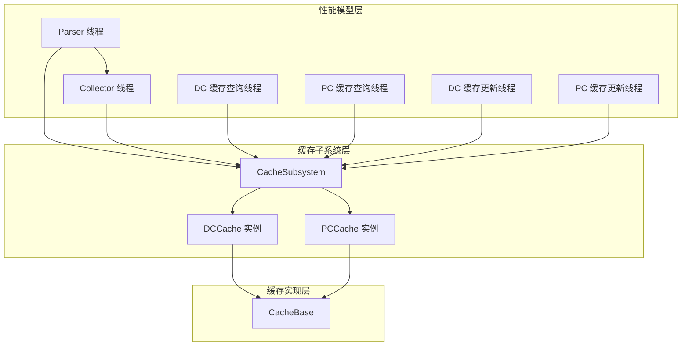
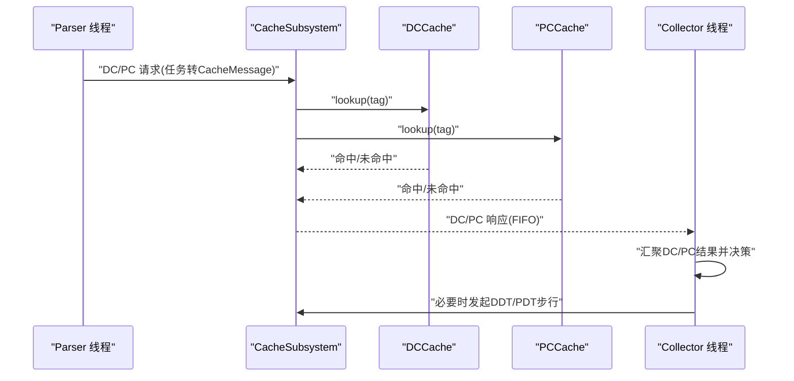
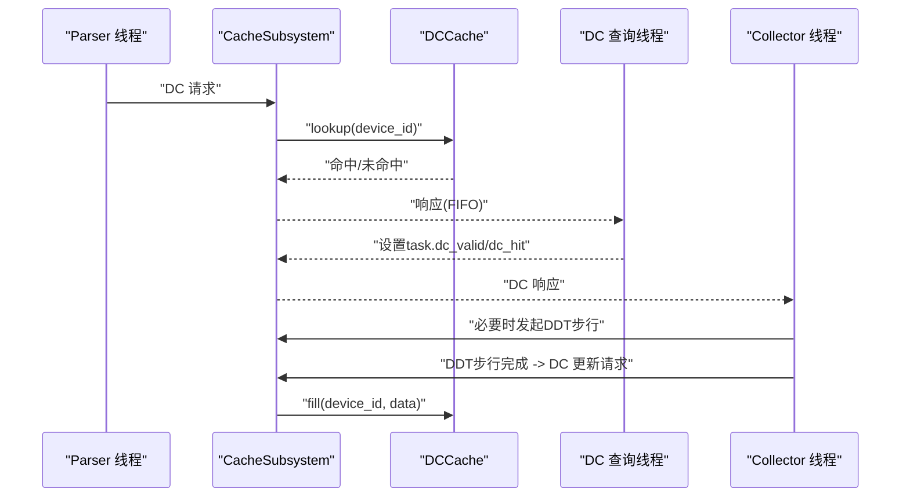
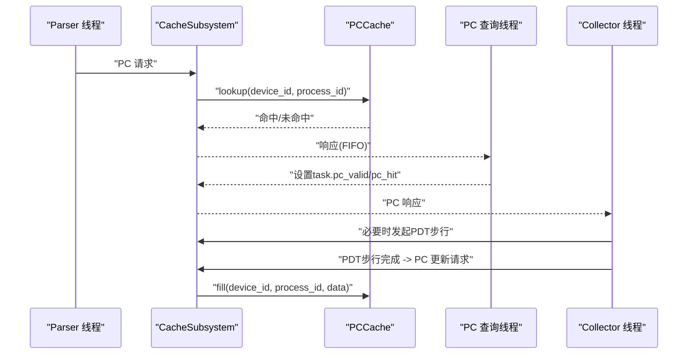
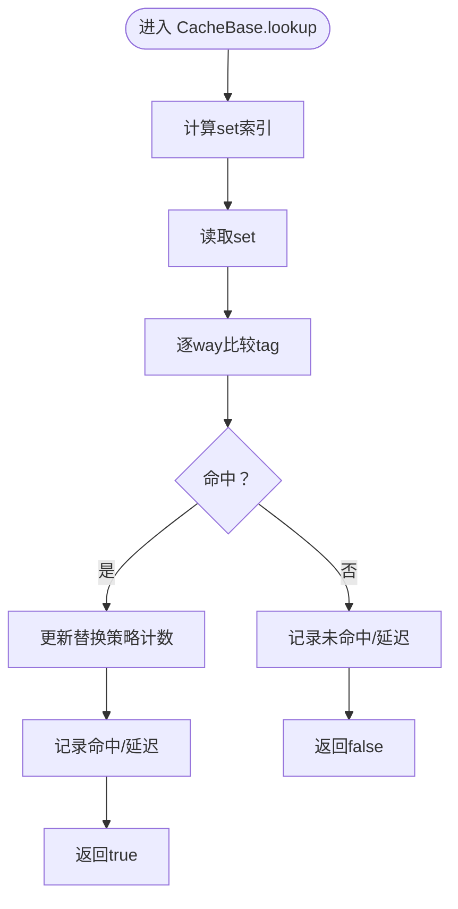
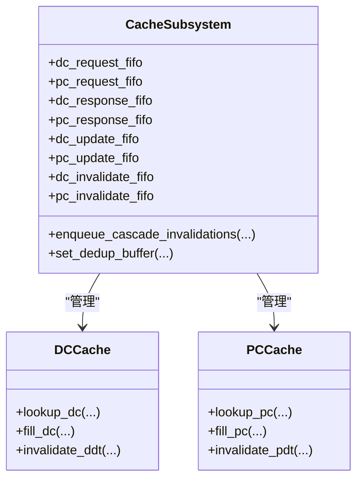
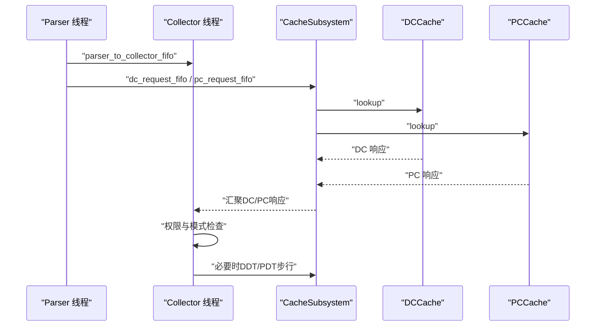
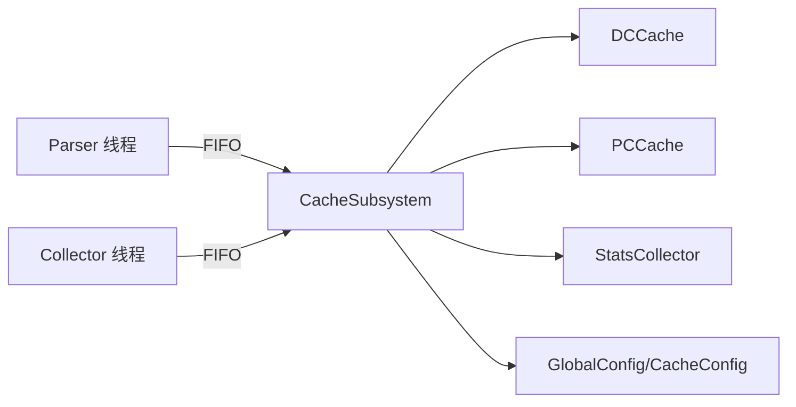

# 缓存查询阶段

<cite>
**本文档引用的文件**
- [dc_cache.h](file://iommu/cache_src/cache/dc_cache.h)
- [pc_cache.h](file://iommu/cache_src/cache	pc_cache.h)
- [cache_base.h](file://iommu/cache_src/cache/cache_base.h)
- [cache_line.h](file://iommu/cache_src/cache/cache_line.h)
- [types.h](file://iommu/cache_src/common/types.h)
- [cache_subsystem.h](file://iommu/cache_src/subsystem/cache_subsystem.h)
- [iommu_perf_dc_pc_cache.cc](file://iommu/iommu_perf_model/iommu_perf_dc_pc_cache.cc)
- [iommu_perf_parser.cc](file://iommu/iommu_perf_model/iommu_perf_parser.cc)
- [iommu_perf_collector.cc](file://iommu/iommu_perf_model/iommu_perf_collector.cc)
- [iommu_task_cache_convert.hh](file://iommu/iommu_perf_model/iommu_task_cache_convert.hh)
- [stats_collector.h](file://iommu/cache_src/common/stats_collector.h)
- [json_config.h](file://iommu/cache_src/common/json_config.h)
- [iommu_top.hh](file://iommu/iommu_top.hh)
</cite>

## 目录
1. [简介](#简介)
2. [项目结构](#项目结构)
3. [核心组件](#核心组件)
4. [架构总览](#架构总览)
5. [详细组件分析](#详细组件分析)
6. [依赖关系分析](#依赖关系分析)
7. [性能考量](#性能考量)
8. [故障排查指南](#故障排查指南)
9. [结论](#结论)
10. [附录](#附录)

## 简介
本文件聚焦于IOMMU模型中的“缓存查询阶段”，系统性阐述DC缓存与PC缓存的查询流程、命中/未命中处理、缓存更新策略、并行处理能力与性能优化方法，并说明其与Parser、Collector的协作机制及缓存失效与更新的处理流程。文档还提供调试工具与性能分析方法，帮助读者快速定位问题并优化系统性能。

## 项目结构
缓存查询阶段涉及以下关键层次：
- 缓存实现层：DC/PC缓存继承自统一的CacheBase模板，提供查找、填充、失效等通用能力。
- 缓存子系统层：CacheSubsystem对外暴露请求/响应FIFO，内部维护各缓存实例与调度线程。
- 性能模型层：Parser负责任务解析与分流，Collector负责汇聚DC/PC查询结果并驱动后续路径，DC/PC查询线程与更新线程分别处理查询与更新。
- 统计与配置层：StatsCollector提供统一统计接口，GlobalConfig/CacheConfig描述缓存参数。

图表来源
- [iommu_perf_parser.cc:9-122](file://iommu/iommu_perf_model/iommu_perf_parser.cc#L9-L122)
- [iommu_perf_collector.cc:14-275](file://iommu/iommu_perf_model/iommu_perf_collector.cc#L14-L275)
- [iommu_perf_dc_pc_cache.cc:11-122](file://iommu/iommu_perf_model/iommu_perf_dc_pc_cache.cc#L11-L122)
- [cache_subsystem.h:21-184](file://iommu/cache_src/subsystem/cache_subsystem.h#L21-L184)
- [cache_base.h:26-224](file://iommu/cache_src/cache/cache_base.h#L26-L224)

章节来源
- [iommu_perf_parser.cc:9-122](file://iommu/iommu_perf_model/iommu_perf_parser.cc#L9-L122)
- [iommu_perf_collector.cc:14-275](file://iommu/iommu_perf_model/iommu_perf_collector.cc#L14-L275)
- [iommu_perf_dc_pc_cache.cc:11-122](file://iommu/iommu_perf_model/iommu_perf_dc_pc_cache.cc#L11-L122)
- [cache_subsystem.h:21-184](file://iommu/cache_src/subsystem/cache_subsystem.h#L21-L184)
- [cache_base.h:26-224](file://iommu/cache_src/cache/cache_base.h#L26-L224)

## 核心组件
- DCCache/PCache：分别面向设备上下文与进程上下文的缓存，提供lookup/fill/invalidate等接口，并实现各自hash函数。
- CacheBase：通用缓存基类，封装查找、填充、失效、仲裁与延迟建模，支持替换策略与统计。
- CacheSubsystem：顶层模块，管理各缓存实例，提供请求/响应FIFO与调度线程，支持级联失效。
- Parser/Collector/DC/PC查询与更新线程：实现SPEC 12.1-12.7的流水线阶段，完成任务分流、结果汇聚与缓存更新。
- StatsCollector：统一统计采集，包含命中/未命中、替换、排队延迟、阶段延迟等指标。
- GlobalConfig/CacheConfig：描述缓存容量、组相联度、替换策略、延迟参数等。

章节来源
- [dc_cache.h:8-31](file://iommu/cache_src/cache/dc_cache.h#L8-L31)
- [pc_cache.h:8-33](file://iommu/cache_src/cache/pc_cache.h#L8-L33)
- [cache_base.h:26-224](file://iommu/cache_src/cache/cache_base.h#L26-L224)
- [cache_subsystem.h:21-184](file://iommu/cache_src/subsystem/cache_subsystem.h#L21-L184)
- [stats_collector.h:107-191](file://iommu/cache_src/common/stats_collector.h#L107-L191)
- [types.h:584-623](file://iommu/cache_src/common/types.h#L584-L623)

## 架构总览
缓存查询阶段遵循“Parser分流—缓存查询—Collector汇聚—必要时走DDT/PDT步行”的路径。DC/PC查询线程与更新线程并行工作，通过FIFO与CacheSubsystem解耦，提升整体吞吐。

图表来源
- [iommu_perf_parser.cc:101-121](file://iommu/iommu_perf_model/iommu_perf_parser.cc#L101-L121)
- [cache_subsystem.h:34-66](file://iommu/cache_src/subsystem/cache_subsystem.h#L34-L66)
- [iommu_perf_collector.cc:14-275](file://iommu/iommu_perf_model/iommu_perf_collector.cc#L14-L275)

章节来源
- [iommu_perf_parser.cc:9-122](file://iommu/iommu_perf_model/iommu_perf_parser.cc#L9-L122)
- [cache_subsystem.h:21-184](file://iommu/cache_src/subsystem/cache_subsystem.h#L21-L184)
- [iommu_perf_collector.cc:14-275](file://iommu/iommu_perf_model/iommu_perf_collector.cc#L14-L275)

## 详细组件分析

### DC缓存查询与更新
- 查询流程：Parser将任务转换为DC请求，经CacheSubsystem下发至DCCache；查询线程模拟命中/未命中延迟并回传结果给Collector。
- 命中/未命中处理：命中时设置dc_valid/dc_hit并携带DC数据；未命中时设置dc_valid=0，后续走DDT步行。
- 更新策略：DDT步行完成后，Collector将DC更新请求送入CacheSubsystem，DCCache进行填充或替换。

图表来源
- [iommu_perf_dc_pc_cache.cc:11-42](file://iommu/iommu_perf_model/iommu_perf_dc_pc_cache.cc#L11-L42)
- [cache_subsystem.h:119-125](file://iommu/cache_src/subsystem/cache_subsystem.h#L119-L125)
- [iommu_perf_collector.cc:302-316](file://iommu/iommu_perf_model/iommu_perf_collector.cc#L302-L316)

章节来源
- [iommu_perf_dc_pc_cache.cc:11-42](file://iommu/iommu_perf_model/iommu_perf_dc_pc_cache.cc#L11-L42)
- [cache_subsystem.h:119-125](file://iommu/cache_src/subsystem/cache_subsystem.h#L119-L125)
- [iommu_perf_collector.cc:302-316](file://iommu/iommu_perf_model/iommu_perf_collector.cc#L302-L316)

### PC缓存查询与更新
- 查询流程：与DC类似，Parser将任务转换为PC请求，经CacheSubsystem下发至PCCache；查询线程模拟命中/未命中延迟并回传结果。
- 命中/未命中处理：命中时设置pc_valid/pc_hit；未命中时走PDT步行。
- 更新策略：PDT步行完成后，Collector将PC更新请求送入CacheSubsystem，PCCache进行填充或替换。

图表来源
- [iommu_perf_dc_pc_cache.cc:70-101](file://iommu/iommu_perf_model/iommu_perf_dc_pc_cache.cc#L70-L101)
- [cache_subsystem.h:120-125](file://iommu/cache_src/subsystem/cache_subsystem.h#L120-L125)
- [iommu_perf_collector.cc:420-433](file://iommu/iommu_perf_model/iommu_perf_collector.cc#L420-L433)

章节来源
- [iommu_perf_dc_pc_cache.cc:70-101](file://iommu/iommu_perf_model/iommu_perf_dc_pc_cache.cc#L70-L101)
- [cache_subsystem.h:120-125](file://iommu/cache_src/subsystem/cache_subsystem.h#L120-L125)
- [iommu_perf_collector.cc:420-433](file://iommu/iommu_perf_model/iommu_perf_collector.cc#L420-L433)

### CacheBase通用机制
- 查找流程：计算set索引→读取set→逐way比较tag→命中则更新替换策略计数并返回，未命中则记录miss。
- 填充流程：先尝试更新（命中），再尝试空way插入，否则触发替换算法选择受害者way并写入。
- 失效流程：支持精确失效、扫描失效与全局失效，逐set串行扫描并统计受影响条目。
- 仲裁与延迟：采用WRR仲裁保障lookup/fill/invalidates公平性，引入仲裁阶段延迟与访问延迟建模。

图表来源
- [cache_base.h:267-306](file://iommu/cache_src/cache/cache_base.h#L267-L306)

章节来源
- [cache_base.h:267-306](file://iommu/cache_src/cache/cache_base.h#L267-L306)
- [cache_base.h:314-472](file://iommu/cache_src/cache/cache_base.h#L314-L472)
- [cache_base.h:474-604](file://iommu/cache_src/cache/cache_base.h#L474-L604)
- [cache_base.h:627-741](file://iommu/cache_src/cache/cache_base.h#L627-L741)

### CacheSubsystem与并行处理
- 并行线程：DC/PC查询与更新各两条线程，配合CacheSubsystem内部worker线程，最大化并行度。
- FIFO解耦：Parser/Collector与缓存查询通过FIFO解耦，避免阻塞；CacheSubsystem内部也通过多FIFO隔离不同阶段。
- 级联失效：DC/PC失效后可生成级联失效消息，推送至PT/Walker/MSIPT缓存，确保一致性。

图表来源
- [cache_subsystem.h:34-90](file://iommu/cache_src/subsystem/cache_subsystem.h#L34-L90)
- [dc_cache.h:12-27](file://iommu/cache_src/cache/dc_cache.h#L12-L27)
- [pc_cache.h:12-29](file://iommu/cache_src/cache/pc_cache.h#L12-L29)

章节来源
- [cache_subsystem.h:21-184](file://iommu/cache_src/subsystem/cache_subsystem.h#L21-L184)
- [dc_cache.h:8-31](file://iommu/cache_src/cache/dc_cache.h#L8-L31)
- [pc_cache.h:8-33](file://iommu/cache_src/cache/pc_cache.h#L8-L33)

### 与Parser/Collector的协作
- Parser：完成任务解析与分流，向Collector与CacheSubsystem分别发送任务与请求。
- Collector：汇聚DC/PC查询结果，结合任务状态与权限检查，决定是否需要DDT/PDT步行，或直接转发。
- 任务转换：提供task与CacheMessage之间的双向转换，确保缓存查询结果回填到任务结构。

图表来源
- [iommu_perf_parser.cc:101-121](file://iommu/iommu_perf_model/iommu_perf_parser.cc#L101-L121)
- [iommu_perf_collector.cc:14-275](file://iommu/iommu_perf_model/iommu_perf_collector.cc#L14-L275)
- [cache_subsystem.h:34-66](file://iommu/cache_src/subsystem/cache_subsystem.h#L34-L66)

章节来源
- [iommu_perf_parser.cc:9-122](file://iommu/iommu_perf_model/iommu_perf_parser.cc#L9-L122)
- [iommu_perf_collector.cc:14-275](file://iommu/iommu_perf_model/iommu_perf_collector.cc#L14-L275)
- [iommu_task_cache_convert.hh:8-38](file://iommu/iommu_perf_model/iommu_task_cache_convert.hh#L8-L38)

## 依赖关系分析
- 组件耦合：Parser/Collector与CacheSubsystem通过FIFO耦合，内部通过worker线程与缓存实例交互，降低耦合度。
- 外部依赖：SystemC TLM接口、FIFO、互斥锁与事件；统计模块依赖文件输出。
- 配置依赖：GlobalConfig/CacheConfig影响缓存容量、替换策略与延迟建模。

图表来源
- [iommu_perf_parser.cc:9-122](file://iommu/iommu_perf_model/iommu_perf_parser.cc#L9-L122)
- [iommu_perf_collector.cc:14-275](file://iommu/iommu_perf_model/iommu_perf_collector.cc#L14-L275)
- [cache_subsystem.h:21-184](file://iommu/cache_src/subsystem/cache_subsystem.h#L21-L184)
- [stats_collector.h:107-191](file://iommu/cache_src/common/stats_collector.h#L107-L191)
- [json_config.h:9-15](file://iommu/cache_src/common/json_config.h#L9-L15)

章节来源
- [iommu_top.hh:44-502](file://iommu/iommu_top.hh#L44-L502)
- [cache_subsystem.h:21-184](file://iommu/cache_src/subsystem/cache_subsystem.h#L21-L184)
- [stats_collector.h:107-191](file://iommu/cache_src/common/stats_collector.h#L107-L191)
- [json_config.h:9-15](file://iommu/cache_src/common/json_config.h#L9-L15)

## 性能考量
- 并行度：DC/PC查询与更新线程并行，CacheSubsystem内部worker线程进一步提升吞吐。
- 仲裁公平性：WRR权重均衡lookup/fill/invalidates，避免饥饿。
- 延迟建模：仲裁阶段延迟与访问延迟叠加，真实反映缓存端口竞争与访问开销。
- 统计指标：命中率、IOPS、排队延迟、阶段延迟、区间命中率等，支撑性能分析与优化。
- 预取与去重：PT Cache支持预取与去重缓冲，减少重复访问与替换压力（与DC/PC查询阶段协同）。

章节来源
- [cache_base.h:627-741](file://iommu/cache_src/cache/cache_base.h#L627-L741)
- [stats_collector.h:13-104](file://iommu/cache_src/common/stats_collector.h#L13-L104)
- [cache_subsystem.h:173-182](file://iommu/cache_src/subsystem/cache_subsystem.h#L173-L182)

## 故障排查指南
- 命中率异常：检查GlobalConfig/CacheConfig参数（容量、组相联度、替换策略），关注StatsCollector输出。
- 死锁/饥饿：确认仲裁权重与pending_ops状态，检查ram_port_busy_与arbiter_event_通知路径。
- 任务积压：核查Parser/Collector/CacheSubsystem各FIFO深度与背压信号，关注outstanding计数。
- 失效一致性：核对级联失效流程，确保DC/PC失效后正确推送至PT/Walker/MSIPT缓存。
- 调试输出：利用Parser/DC/PC查询线程打印的task_id、时间戳与命中/未命中信息定位问题。

章节来源
- [stats_collector.h:107-191](file://iommu/cache_src/common/stats_collector.h#L107-L191)
- [cache_base.h:627-741](file://iommu/cache_src/cache/cache_base.h#L627-L741)
- [cache_subsystem.h:86-90](file://iommu/cache_src/subsystem/cache_subsystem.h#L86-L90)
- [iommu_perf_parser.cc:9-122](file://iommu/iommu_perf_model/iommu_perf_parser.cc#L9-L122)
- [iommu_perf_dc_pc_cache.cc:11-122](file://iommu/iommu_perf_model/iommu_perf_dc_pc_cache.cc#L11-L122)

## 结论
缓存查询阶段通过DC/PC缓存与CacheSubsystem的协同，实现了高性能、可扩展的查询与更新路径。Parser/Collector流水线与并行线程设计提升了整体吞吐，而CacheBase的仲裁与延迟建模确保了仿真精度。借助完善的统计与调试手段，可快速定位性能瓶颈并进行针对性优化。

## 附录
- 关键接口路径
  - DC查询：[dc_cache.h:16-17](file://iommu/cache_src/cache/dc_cache.h#L16-L17)
  - PC查询：[pc_cache.h:16-19](file://iommu/cache_src/cache/pc_cache.h#L16-L19)
  - CacheBase查找/填充/失效：[cache_base.h:39-50](file://iommu/cache_src/cache/cache_base.h#L39-L50)
  - CacheSubsystem请求/响应FIFO：[cache_subsystem.h:34-66](file://iommu/cache_src/subsystem/cache_subsystem.h#L34-L66)
  - Parser分流与Collector汇聚：[iommu_perf_parser.cc:101-121](file://iommu/iommu_perf_model/iommu_perf_parser.cc#L101-L121), [iommu_perf_collector.cc:14-275](file://iommu/iommu_perf_model/iommu_perf_collector.cc#L14-L275)
  - 任务与消息转换：[iommu_task_cache_convert.hh:8-38](file://iommu/iommu_perf_model/iommu_task_cache_convert.hh#L8-L38)
  - 统计与配置：[stats_collector.h:107-191](file://iommu/cache_src/common/stats_collector.h#L107-L191), [json_config.h:9-15](file://iommu/cache_src/common/json_config.h#L9-L15)