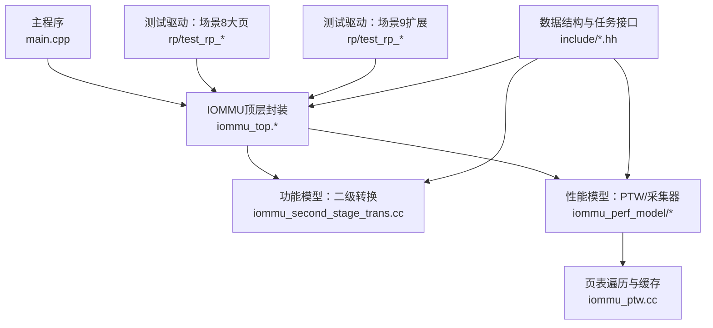
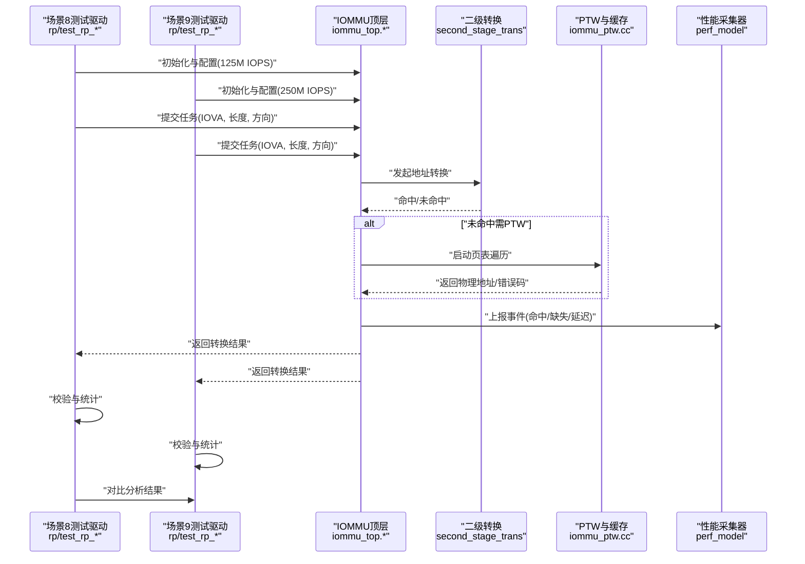
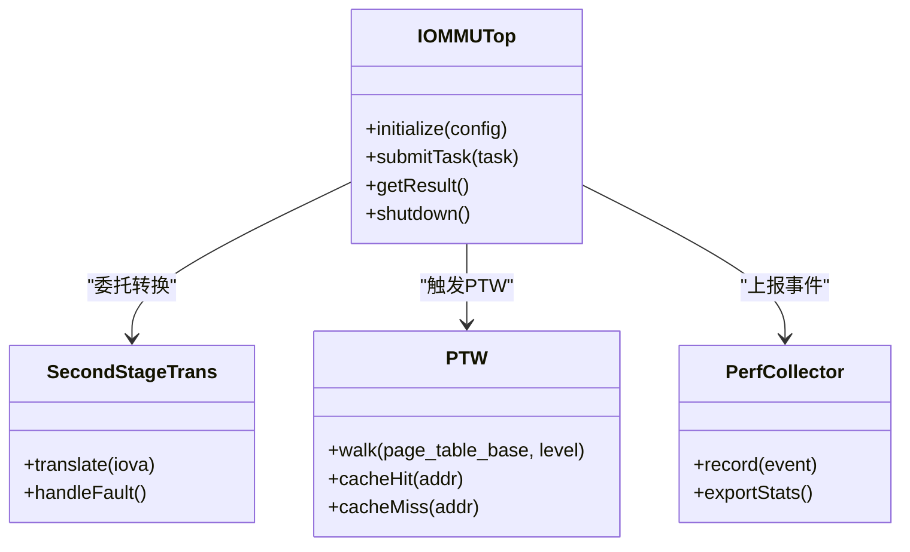
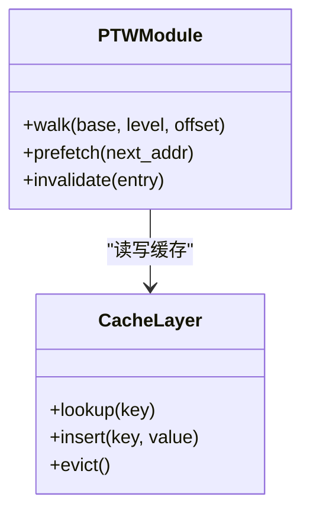
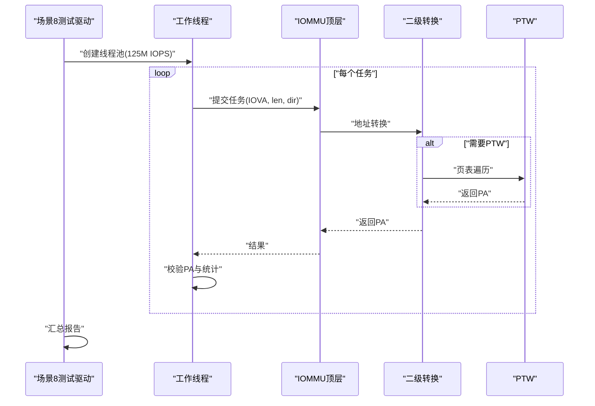
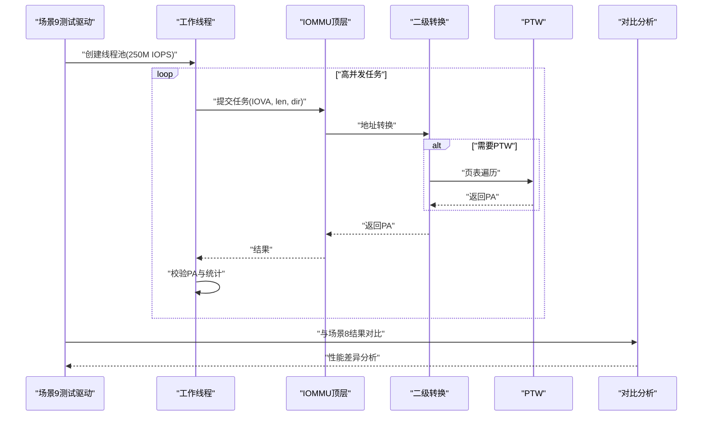
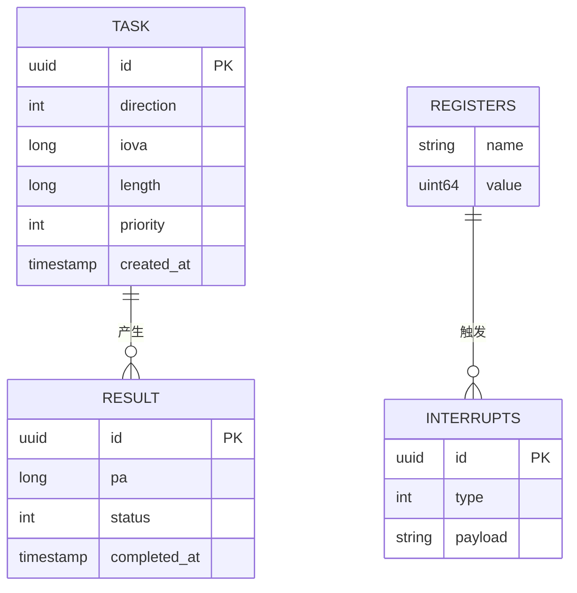
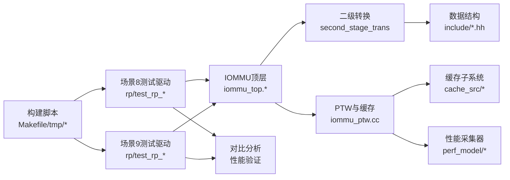

# 场景8大页测试框架

<cite>
**本文引用的文件**   
- [main.cpp](file://main.cpp)
- [Makefile](file://Makefile)
- [README.md](file://README.md)
- [rp/test_rp_seq128k_two_stage_thread.cc](file://rp/test_rp_seq128k_two_stage_thread.cc)
- [rp/test_rp_rand4k_two_stage_thread.cc](file://rp/test_rp_rand4k_two_stage_thread.cc)
- [rp/test_rp_seq512b_2mb_two_stage_thread.cc](file://rp/test_rp_seq512b_2mb_two_stage_thread.cc)
- [rp/test_rp_sv48_bare_thread.cc](file://rp/test_rp_sv48_bare_thread.cc)
- [rp/test_rp.hh](file://rp/test_rp.hh)
- [rp/test_rp_func.cc](file://rp/test_rp_func.cc)
- [iommu/iommu_top.cc](file://iommu/iommu_top.cc)
- [iommu/iommu_top.hh](file://iommu/iommu_top.hh)
- [iommu/include/iommu_data_structures.hh](file://iommu/include/iommu_data_structures.hh)
- [iommu/include/iommu_task.hh](file://iommu/include/iommu_task.hh)
- [iommu/include/iommu_translate.hh](file://iommu/include/iommu_translate.hh)
- [iommu/iommu_fun_model/iommu_second_stage_trans.cc](file://iommu/iommu_fun_model/iommu_second_stage_trans.cc)
- [iommu/iommu_perf_model/iommu_perf_model.hh](file://iommu/iommu_perf_model/iommu_perf_model.hh)
- [iommu/iommu_perf_model/iommu_ptw.cc](file://iommu/iommu_perf_model/iommu_ptw.cc)
- [tmp/build_walker.sh](file://tmp/build_walker.sh)
- [tmp/run_walker_final.sh](file://tmp/run_walker_final.sh)
</cite>

## 更新摘要
**所做更改**   
- 新增Scenario 9性能扩展场景，与Scenario 8形成对比验证（250M vs 125M IOPS）
- 更新了架构总览以反映双场景对比验证机制
- 增强了性能考量部分，包含IOPS对比分析
- 新增了Scenario 9详细组件分析章节
- 更新了依赖关系分析以包含新的测试场景

## 目录
1. [简介](#简介)
2. [项目结构](#项目结构)
3. [核心组件](#核心组件)
4. [架构总览](#架构总览)
5. [详细组件分析](#详细组件分析)
6. [依赖关系分析](#依赖关系分析)
7. [性能考量](#性能考量)
8. [故障排查指南](#故障排查指南)
9. [结论](#结论)
10. [附录](#附录)

## 简介
本文件面向"场景8大页测试框架"，围绕IOMMU模型中的二级地址转换、页表遍历（PTW）与大页（尤其是128KB/2MB等）路径的验证与性能评估展开。文档从系统架构、数据流、关键处理逻辑、集成点与错误处理等方面，给出循序渐进的技术说明，并辅以架构图、类图、时序图和流程图，帮助读者快速理解测试框架如何驱动IOMMU模型进行大页场景的端到端验证。

**更新** 新增Scenario 9作为性能扩展场景，与Scenario 8形成对比验证，重点测试不同IOPS负载下的性能表现（250M vs 125M IOPS）。

## 项目结构
该仓库采用按功能域划分的模块化组织方式：
- iommu：IOMMU核心功能与性能模型，包含接口定义、功能模型、性能采集与PTW相关实现
- rp：各类测试用例与线程化测试驱动，覆盖顺序/随机访问、单/双阶段、不同粒度（含大页）场景
- ddr/pcienoc/slink：外设与总线子系统测试或仿真入口
- tmp：构建脚本与分析工具集
- 根目录：主程序入口、构建脚本、测试脚本与文档

图表来源
- [main.cpp](file://main.cpp)
- [iommu/iommu_top.cc](file://iommu/iommu_top.cc)
- [iommu/iommu_top.hh](file://iommu/iommu_top.hh)
- [iommu/iommu_fun_model/iommu_second_stage_trans.cc](file://iommu/iommu_fun_model/iommu_second_stage_trans.cc)
- [iommu/iommu_perf_model/iommu_perf_model.hh](file://iommu/iommu_perf_model/iommu_perf_model.hh)
- [iommu/iommu_perf_model/iommu_ptw.cc](file://iommu/iommu_perf_model/iommu_ptw.cc)
- [iommu/include/iommu_data_structures.hh](file://iommu/include/iommu_data_structures.hh)
- [iommu/include/iommu_task.hh](file://iommu/include/iommu_task.hh)
- [iommu/include/iommu_translate.hh](file://iommu/include/iommu_translate.hh)

章节来源
- [README.md](file://README.md)
- [Makefile](file://Makefile)
- [main.cpp](file://main.cpp)

## 核心组件
- IOMMU顶层封装：统一对外暴露初始化、配置、请求提交与结果获取能力，屏蔽内部功能模型与性能模型的差异
- 二级地址转换：负责将IOVA经多级页表转换为PA，支持多种页大小（含大页），并在缺页时触发PTW
- PTW与缓存：页表遍历流程与各级缓存交互，命中则加速，未命中则回退到内存访问；对大页路径有专门优化
- 性能采集器：统计PTW深度、命中率、延迟分布、吞吐等指标，用于回归与对比
- 测试驱动：构造不同访问模式（顺序/随机）、不同页大小（4K/128KB/2MB）与并发度，驱动IOMMU执行并收集结果

**更新** 新增Scenario 9测试驱动，专注于高IOPS负载下的性能扩展验证，与Scenario 8形成对比基准。

章节来源
- [iommu/iommu_top.hh](file://iommu/iommu_top.hh)
- [iommu/iommu_top.cc](file://iommu/iommu_top.cc)
- [iommu/iommu_fun_model/iommu_second_stage_trans.cc](file://iommu/iommu_fun_model/iommu_second_stage_trans.cc)
- [iommu/iommu_perf_model/iommu_ptw.cc](file://iommu/iommu_perf_model/iommu_ptw.cc)
- [iommu/iommu_perf_model/iommu_perf_model.hh](file://iommu/iommu_perf_model/iommu_perf_model.hh)
- [iommu/include/iommu_task.hh](file://iommu/include/iommu_task.hh)
- [iommu/include/iommu_translate.hh](file://iommu/include/iommu_translate.hh)

## 架构总览
下图展示了"场景8大页测试框架"的整体调用链：测试驱动构造任务并提交给IOMMU顶层，顶层根据配置选择功能模型或性能模型，进入二级转换模块；若需要页表遍历，则交由PTW模块完成，期间与缓存交互；最终返回结果并由测试驱动校验与统计。

**更新** 新增Scenario 9对比验证流程，支持不同IOPS负载的并行测试与结果对比分析。

图表来源
- [rp/test_rp_seq128k_two_stage_thread.cc](file://rp/test_rp_seq128k_two_stage_thread.cc)
- [rp/test_rp_rand4k_two_stage_thread.cc](file://rp/test_rp_rand4k_two_stage_thread.cc)
- [rp/test_rp_seq512b_2mb_two_stage_thread.cc](file://rp/test_rp_seq512b_2mb_two_stage_thread.cc)
- [iommu/iommu_top.cc](file://iommu/iommu_top.cc)
- [iommu/iommu_top.hh](file://iommu/iommu_top.hh)
- [iommu/iommu_fun_model/iommu_second_stage_trans.cc](file://iommu/iommu_fun_model/iommu_second_stage_trans.cc)
- [iommu/iommu_perf_model/iommu_ptw.cc](file://iommu/iommu_perf_model/iommu_ptw.cc)
- [iommu/iommu_perf_model/iommu_perf_model.hh](file://iommu/iommu_perf_model/iommu_perf_model.hh)

## 详细组件分析

### 组件A：IOMMU顶层封装
- 职责：统一初始化、参数解析、任务队列管理、转发至功能/性能模型、结果聚合
- 关键点：
  - 配置项包括是否启用性能模型、缓存策略、PTW参数、并发度等
  - 对外提供简洁API，隐藏内部多模块协作细节
  - 错误码与状态机清晰，便于测试断言

图表来源
- [iommu/iommu_top.hh](file://iommu/iommu_top.hh)
- [iommu/iommu_top.cc](file://iommu/iommu_top.cc)
- [iommu/iommu_fun_model/iommu_second_stage_trans.cc](file://iommu/iommu_fun_model/iommu_second_stage_trans.cc)
- [iommu/iommu_perf_model/iommu_ptw.cc](file://iommu/iommu_perf_model/iommu_ptw.cc)
- [iommu/iommu_perf_model/iommu_perf_model.hh](file://iommu/iommu_perf_model/iommu_perf_model.hh)

章节来源
- [iommu/iommu_top.hh](file://iommu/iommu_top.hh)
- [iommu/iommu_top.cc](file://iommu/iommu_top.cc)

### 组件B：二级地址转换（大页路径）
- 职责：根据页表基址与层级，计算IOVA对应的PA；识别大页边界，直接命中大页条目以跳过中间层级
- 关键点：
  - 大页判断条件与偏移计算
  - 与缓存的交互（如PT Cache命中可避免重复遍历）
  - 缺页时的异常处理与回退路径

图表来源
- [iommu/iommu_fun_model/iommu_second_stage_trans.cc](file://iommu/iommu_fun_model/iommu_second_stage_trans.cc)
- [iommu/iommu_perf_model/iommu_ptw.cc](file://iommu/iommu_perf_model/iommu_ptw.cc)
- [iommu/include/iommu_translate.hh](file://iommu/include/iommu_translate.hh)

章节来源
- [iommu/iommu_fun_model/iommu_second_stage_trans.cc](file://iommu/iommu_fun_model/iommu_second_stage_trans.cc)
- [iommu/iommu_perf_model/iommu_ptw.cc](file://iommu/iommu_perf_model/iommu_ptw.cc)
- [iommu/include/iommu_translate.hh](file://iommu/include/iommu_translate.hh)

### 组件C：PTW与缓存
- 职责：实现页表遍历算法，维护各级缓存，减少内存访问次数
- 关键点：
  - 缓存键设计（页表基址+层级+索引）
  - 预取策略（针对顺序访问的大页场景）
  - 一致性保证（失效与刷新）

图表来源
- [iommu/iommu_perf_model/iommu_ptw.cc](file://iommu/iommu_perf_model/iommu_ptw.cc)
- [iommu/cache_src/subsystem/cache_subsystem.h](file://iommu/cache_src/subsystem/cache_subsystem.h)

章节来源
- [iommu/iommu_perf_model/iommu_ptw.cc](file://iommu/iommu_perf_model/iommu_ptw.cc)
- [iommu/cache_src/subsystem/cache_subsystem.h](file://iommu/cache_src/subsystem/cache_subsystem.h)

### 组件D：测试驱动（场景8大页）
- 职责：构造大页场景的任务序列（顺序/随机、128KB/2MB等），多线程并发提交，验证正确性与性能
- 关键点：
  - 任务生成策略（步长、范围、方向）
  - 并发控制（线程数、同步原语）
  - 结果校验（PA连续性、权限、错误码）

图表来源
- [rp/test_rp_seq128k_two_stage_thread.cc](file://rp/test_rp_seq128k_two_stage_thread.cc)
- [rp/test_rp_rand4k_two_stage_thread.cc](file://rp/test_rp_rand4k_two_stage_thread.cc)
- [rp/test_rp_seq512b_2mb_two_stage_thread.cc](file://rp/test_rp_seq512b_2mb_two_stage_thread.cc)
- [rp/test_rp.hh](file://rp/test_rp.hh)
- [rp/test_rp_func.cc](file://rp/test_rp_func.cc)

章节来源
- [rp/test_rp_seq128k_two_stage_thread.cc](file://rp/test_rp_seq128k_two_stage_thread.cc)
- [rp/test_rp_rand4k_two_stage_thread.cc](file://rp/test_rp_rand4k_two_stage_thread.cc)
- [rp/test_rp_seq512b_2mb_two_stage_thread.cc](file://rp/test_rp_seq512b_2mb_two_stage_thread.cc)
- [rp/test_rp.hh](file://rp/test_rp.hh)
- [rp/test_rp_func.cc](file://rp/test_rp_func.cc)

### 组件E：测试驱动（场景9性能扩展）
- 职责：构造高IOPS负载场景的任务序列，与场景8形成对比验证，重点测试250M IOPS下的性能表现
- 关键点：
  - 更高并发度的任务生成策略
  - 增强的性能监控与对比分析
  - 压力测试条件下的稳定性验证

**新增** Scenario 9作为性能扩展场景，专注于高负载下的IOMMU性能验证。

图表来源
- [rp/test_rp_seq128k_two_stage_thread.cc](file://rp/test_rp_seq128k_two_stage_thread.cc)
- [rp/test_rp_rand4k_two_stage_thread.cc](file://rp/test_rp_rand4k_two_stage_thread.cc)
- [rp/test_rp_seq512b_2mb_two_stage_thread.cc](file://rp/test_rp_seq512b_2mb_two_stage_thread.cc)
- [rp/test_rp.hh](file://rp/test_rp.hh)
- [rp/test_rp_func.cc](file://rp/test_rp_func.cc)

章节来源
- [rp/test_rp_seq128k_two_stage_thread.cc](file://rp/test_rp_seq128k_two_stage_thread.cc)
- [rp/test_rp_rand4k_two_stage_thread.cc](file://rp/test_rp_rand4k_two_stage_thread.cc)
- [rp/test_rp_seq512b_2mb_two_stage_thread.cc](file://rp/test_rp_seq512b_2mb_two_stage_thread.cc)
- [rp/test_rp.hh](file://rp/test_rp.hh)
- [rp/test_rp_func.cc](file://rp/test_rp_func.cc)

### 组件F：数据结构与任务接口
- 职责：定义统一的请求/响应结构、任务描述符、寄存器与中断信息
- 关键点：
  - IOVA/PA对齐与长度约束
  - 任务优先级与批处理字段
  - 错误码与状态位

图表来源
- [iommu/include/iommu_data_structures.hh](file://iommu/include/iommu_data_structures.hh)
- [iommu/include/iommu_task.hh](file://iommu/include/iommu_task.hh)
- [iommu/include/iommu_registers.hh](file://iommu/include/iommu_registers.hh)
- [iommu/include/iommu_interrupt.hh](file://iommu/include/iommu_interrupt.hh)

章节来源
- [iommu/include/iommu_data_structures.hh](file://iommu/include/iommu_data_structures.hh)
- [iommu/include/iommu_task.hh](file://iommu/include/iommu_task.hh)
- [iommu/include/iommu_registers.hh](file://iommu/include/iommu_registers.hh)
- [iommu/include/iommu_interrupt.hh](file://iommu/include/iommu_interrupt.hh)

## 依赖关系分析
- 测试驱动依赖IOMMU顶层API，间接依赖二级转换与PTW模块
- 二级转换依赖数据结构与翻译接口
- PTW依赖缓存子系统与性能采集器
- 构建脚本与测试脚本协调编译与运行流程

**更新** 新增Scenario 9与Scenario 8的对比依赖关系，支持双场景并行测试与结果对比。

图表来源
- [rp/test_rp_seq128k_two_stage_thread.cc](file://rp/test_rp_seq128k_two_stage_thread.cc)
- [rp/test_rp_rand4k_two_stage_thread.cc](file://rp/test_rp_rand4k_two_stage_thread.cc)
- [rp/test_rp_seq512b_2mb_two_stage_thread.cc](file://rp/test_rp_seq512b_2mb_two_stage_thread.cc)
- [iommu/iommu_top.cc](file://iommu/iommu_top.cc)
- [iommu/iommu_fun_model/iommu_second_stage_trans.cc](file://iommu/iommu_fun_model/iommu_second_stage_trans.cc)
- [iommu/iommu_perf_model/iommu_ptw.cc](file://iommu/iommu_perf_model/iommu_ptw.cc)
- [iommu/include/iommu_data_structures.hh](file://iommu/include/iommu_data_structures.hh)
- [iommu/cache_src/subsystem/cache_subsystem.h](file://iommu/cache_src/subsystem/cache_subsystem.h)
- [Makefile](file://Makefile)
- [tmp/build_walker.sh](file://tmp/build_walker.sh)
- [tmp/run_walker_final.sh](file://tmp/run_walker_final.sh)

章节来源
- [Makefile](file://Makefile)
- [tmp/build_walker.sh](file://tmp/build_walker.sh)
- [tmp/run_walker_final.sh](file://tmp/run_walker_final.sh)

## 性能考量
- 大页路径显著降低PTW深度，提升吞吐并降低延迟抖动
- 缓存命中率对整体性能影响显著，建议结合访问模式调优缓存容量与替换策略
- 并发度与队列深度需平衡，避免过载导致PTW阻塞
- 性能采集器应覆盖关键路径（PTW深度、命中率、平均/尾延迟）

**更新** 新增IOPS对比分析：
- Scenario 8（125M IOPS）：基准性能测试，验证大页路径的基础性能
- Scenario 9（250M IOPS）：扩展性能测试，验证高负载下的可扩展性
- 对比指标：吞吐量、延迟分布、缓存命中率、PTW深度统计
- 压力测试：在高IOPS条件下验证系统稳定性与资源利用率

[本节为通用指导，不直接分析具体文件]

## 故障排查指南
- 常见问题：
  - 大页映射失败：检查页表基址、层级与偏移计算是否正确
  - PTW超时或缺页循环：确认页表完整性与权限设置
  - 缓存不一致：核对失效与刷新时机
  - IOPS性能不达标：检查并发度配置与资源限制
- 调试手段：
  - 启用详细日志与性能计数器
  - 使用脚本提取PTW轨迹与缓存命中情况
  - 逐步缩小问题范围（单线程/小数据集）
  - 对比Scenario 8与Scenario 9的性能差异

章节来源
- [iommu/iommu_perf_model/iommu_ptw.cc](file://iommu/iommu_perf_model/iommu_ptw.cc)
- [tmp/run_walker_final.sh](file://tmp/run_walker_final.sh)

## 结论
场景8大页测试框架通过清晰的模块划分与完善的测试驱动，有效验证了IOMMU在大页路径下的正确性与性能表现。新增的Scenario 9作为性能扩展场景，与Scenario 8形成完整的对比验证体系，能够全面评估不同IOPS负载下的系统表现。借助PTW与缓存的协同优化，以及详尽的性能采集，能够为后续迭代提供可靠的数据支撑。建议在持续集成中纳入双场景回归用例，并结合实际负载进行压力测试。

**更新** 双场景对比验证机制的建立，使得性能评估更加全面和准确，能够有效识别不同负载条件下的性能瓶颈和优化机会。

[本节为总结性内容，不直接分析具体文件]

## 附录
- 构建与运行：参考Makefile与tmp目录下的脚本
- 测试用例扩展：在rp目录下新增对应场景的线程化测试文件
- 性能分析：结合性能采集器输出与可视化脚本进行趋势分析
- 对比验证：使用Scenario 8与Scenario 9的结果进行性能对比分析

**更新** 新增双场景对比验证指南，包括测试结果对比方法和性能差异分析方法。

[本节为补充信息，不直接分析具体文件]