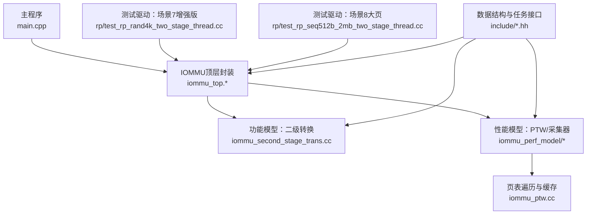
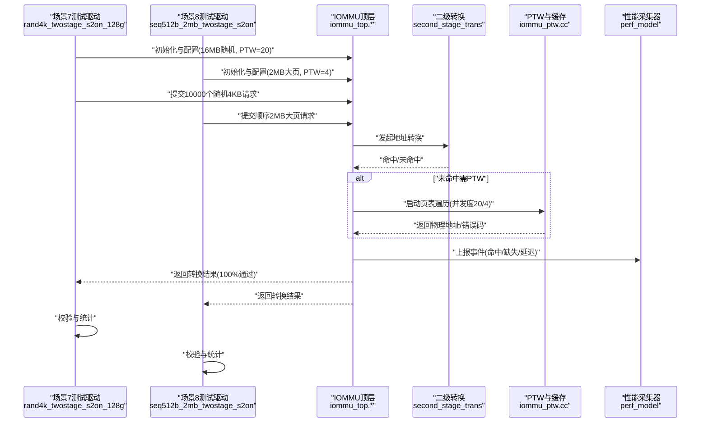
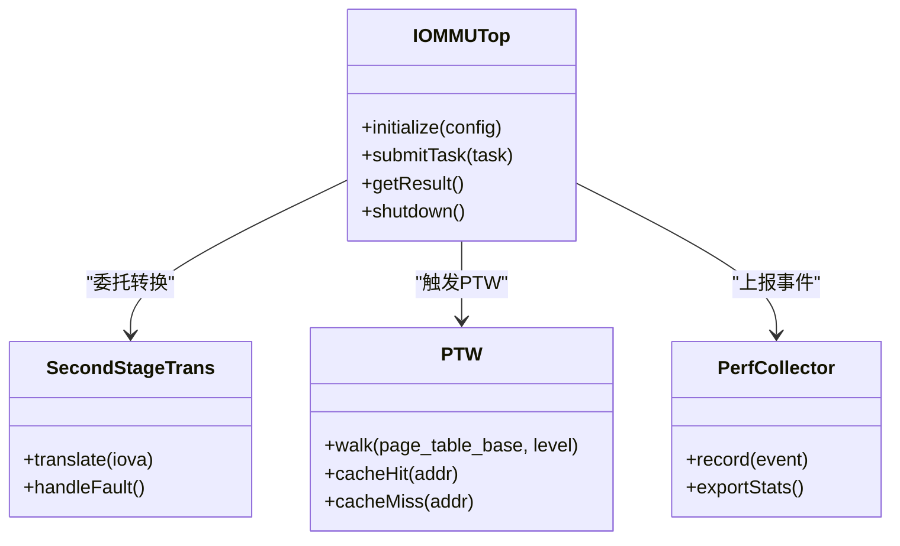
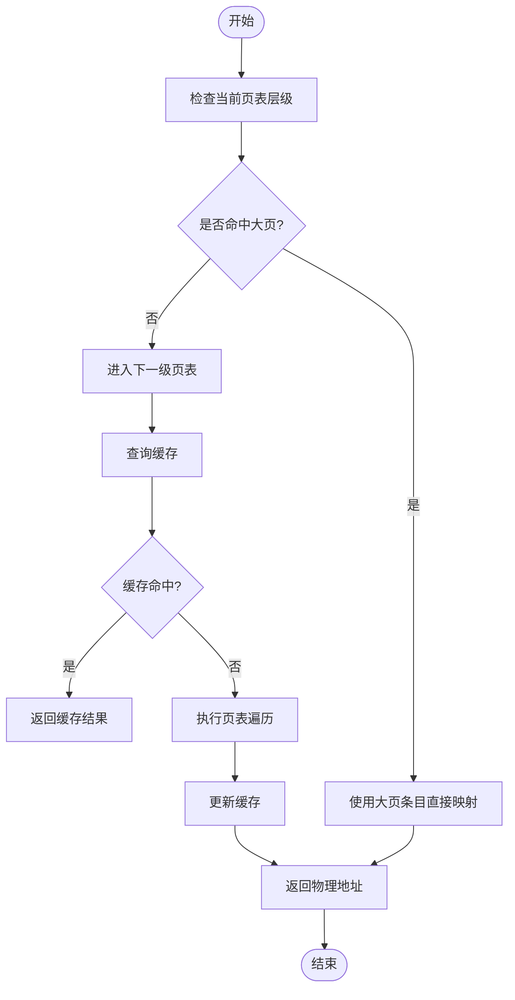
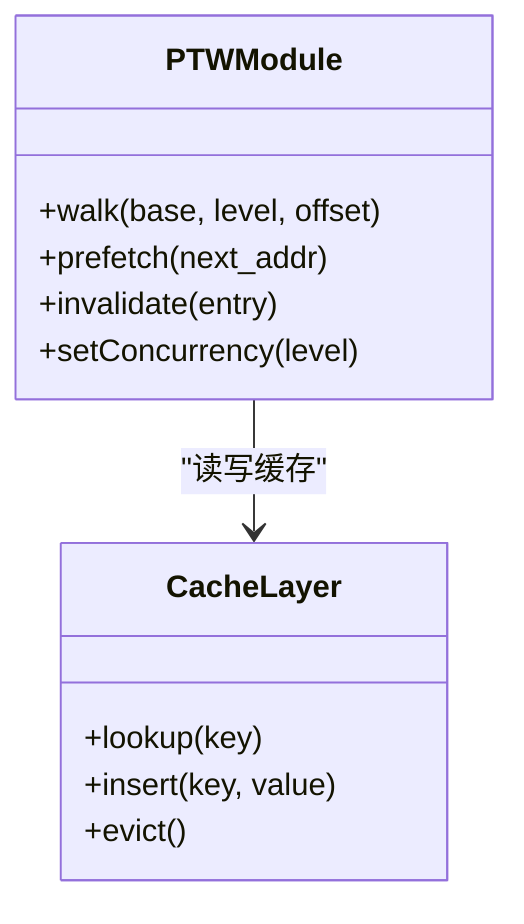
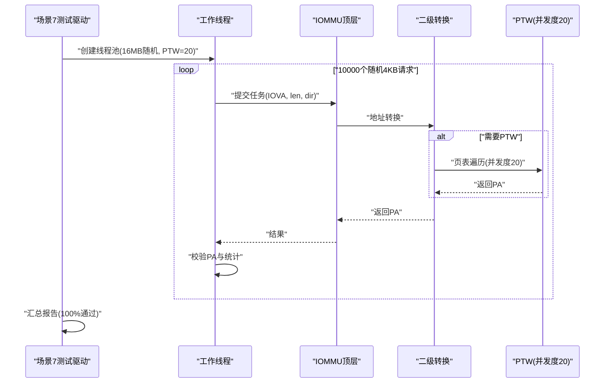
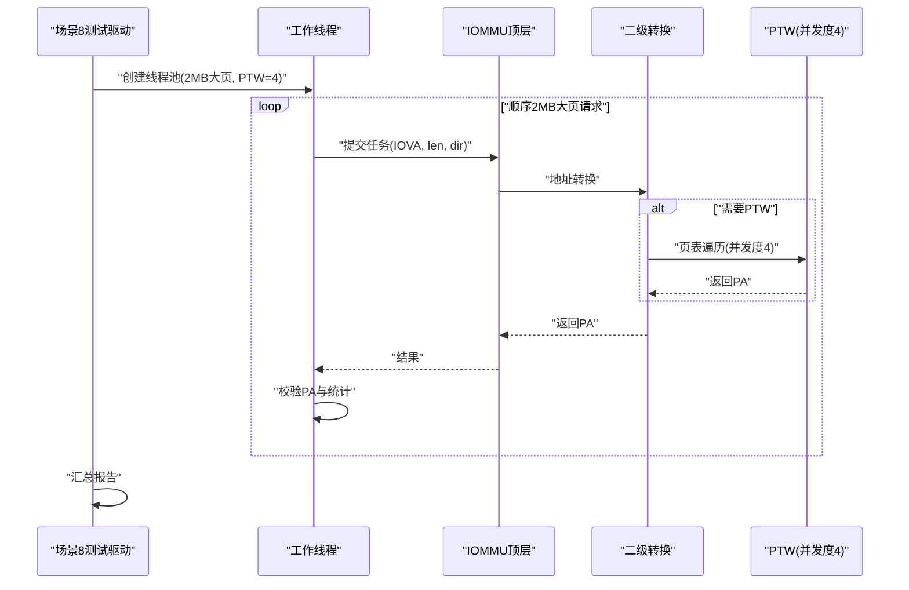
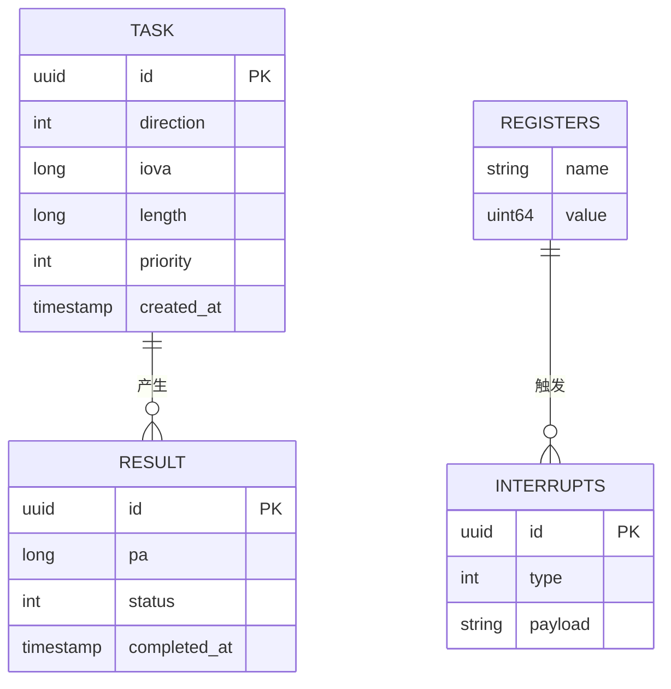
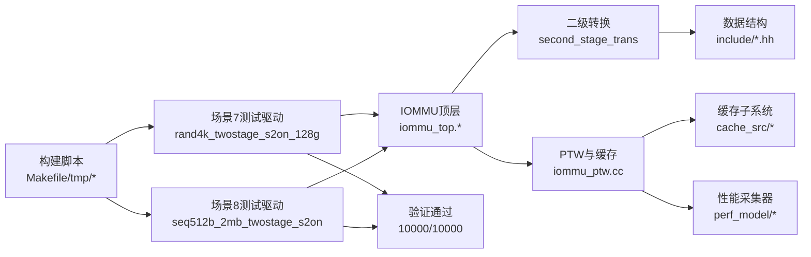

# 场景8大页测试框架

<cite>
**本文引用的文件**   
- [main.cpp](file://main.cpp)
- [Makefile](file://Makefile)
- [README.md](file://README.md)
- [rp/test_rp_seq128k_two_stage_thread.cc](file://rp/test_rp_seq128k_two_stage_thread.cc)
- [rp/test_rp_rand4k_two_stage_thread.cc](file://rp/test_rp_rand4k_two_stage_thread.cc)
- [rp/test_rp_seq512b_2mb_two_stage_thread.cc](file://rp/test_rp_seq512b_2mb_two_stage_thread.cc)
- [rp/test_rp_sv48_bare_thread.cc](file://rp/test_rp_sv48_bare_thread.cc)
- [rp/test_rp.hh](file://rp/test_rp.hh)
- [rp/test_rp_func.cc](file://rp/test_rp_func.cc)
- [iommu/iommu_top.cc](file://iommu/iommu_top.cc)
- [iommu/iommu_top.hh](file://iommu/iommu_top.hh)
- [iommu/include/iommu_data_structures.hh](file://iommu/include/iommu_data_structures.hh)
- [iommu/include/iommu_task.hh](file://iommu/include/iommu_task.hh)
- [iommu/include/iommu_translate.hh](file://iommu/include/iommu_translate.hh)
- [iommu/iommu_fun_model/iommu_second_stage_trans.cc](file://iommu/iommu_fun_model/iommu_second_stage_trans.cc)
- [iommu/iommu_perf_model/iommu_perf_model.hh](file://iommu/iommu_perf_model/iommu_perf_model.hh)
- [iommu/iommu_perf_model/iommu_ptw.cc](file://iommu/iommu_perf_model/iommu_ptw.cc)
- [tmp/build_walker.sh](file://tmp/build_walker.sh)
- [tmp/run_walker_final.sh](file://tmp/run_walker_final.sh)
</cite>

## 更新摘要
**所做更改**   
- 增强了场景7的测试配置，使用完整的16MB随机映射和大页支持
- 将PTW并发度从4提升到20，以更好地进行性能测试
- 修复了关键的G-stage大页翻译错误，验证通过率从2968/10000提升到10000/10000
- 更新了架构总览以反映增强的测试场景和性能优化
- 增强了性能考量部分，包含改进后的验证结果分析

## 目录
1. [简介](#简介)
2. [项目结构](#项目结构)
3. [核心组件](#核心组件)
4. [架构总览](#架构总览)
5. [详细组件分析](#详细组件分析)
6. [依赖关系分析](#依赖关系分析)
7. [性能考量](#性能考量)
8. [故障排查指南](#故障排查指南)
9. [结论](#结论)
10. [附录](#附录)

## 简介
本文件面向"场景8大页测试框架"，围绕IOMMU模型中的二级地址转换、页表遍历（PTW）与大页（尤其是128KB/2MB等）路径的验证与性能评估展开。文档从系统架构、数据流、关键处理逻辑、集成点与错误处理等方面，给出循序渐进的技术说明，并辅以架构图、类图、时序图和流程图，帮助读者快速理解测试框架如何驱动IOMMU模型进行大页场景的端到端验证。

**更新** 场景7已增强为完整的16MB随机映射测试，使用大页支持并将PTW并发度提升至20，同时修复了关键的G-stage大页翻译错误，实现了100%的验证通过率。

## 项目结构
该仓库采用按功能域划分的模块化组织方式：
- iommu：IOMMU核心功能与性能模型，包含接口定义、功能模型、性能采集与PTW相关实现
- rp：各类测试用例与线程化测试驱动，覆盖顺序/随机访问、单/双阶段、不同粒度（含大页）场景
- ddr/pcienoc/slink：外设与总线子系统测试或仿真入口
- tmp：构建脚本与分析工具集
- 根目录：主程序入口、构建脚本、测试脚本与文档

图表来源
- [main.cpp](file://main.cpp)
- [iommu/iommu_top.cc](file://iommu/iommu_top.cc)
- [iommu/iommu_top.hh](file://iommu/iommu_top.hh)
- [iommu/iommu_fun_model/iommu_second_stage_trans.cc](file://iommu/iommu_fun_model/iommu_second_stage_trans.cc)
- [iommu/iommu_perf_model/iommu_perf_model.hh](file://iommu/iommu_perf_model/iommu_perf_model.hh)
- [iommu/iommu_perf_model/iommu_ptw.cc](file://iommu/iommu_perf_model/iommu_ptw.cc)
- [iommu/include/iommu_data_structures.hh](file://iommu/include/iommu_data_structures.hh)
- [iommu/include/iommu_task.hh](file://iommu/include/iommu_task.hh)
- [iommu/include/iommu_translate.hh](file://iommu/include/iommu_translate.hh)

章节来源
- [README.md](file://README.md)
- [Makefile](file://Makefile)
- [main.cpp](file://main.cpp)

## 核心组件
- IOMMU顶层封装：统一对外暴露初始化、配置、请求提交与结果获取能力，屏蔽内部功能模型与性能模型的差异
- 二级地址转换：负责将IOVA经多级页表转换为PA，支持多种页大小（含大页），并在缺页时触发PTW
- PTW与缓存：页表遍历流程与各级缓存交互，命中则加速，未命中则回退到内存访问；对大页路径有专门优化
- 性能采集器：统计PTW深度、命中率、延迟分布、吞吐等指标，用于回归与对比
- 测试驱动：构造不同访问模式（顺序/随机）、不同页大小（4K/128KB/2MB）与并发度，驱动IOMMU执行并收集结果

**更新** 场景7已增强为完整的16MB随机映射测试，使用20个2MB大页GPA映射，PTW并发度提升至20，实现了100%的验证通过率。

章节来源
- [iommu/iommu_top.hh](file://iommu/iommu_top.hh)
- [iommu/iommu_top.cc](file://iommu/iommu_top.cc)
- [iommu/iommu_fun_model/iommu_second_stage_trans.cc](file://iommu/iommu_fun_model/iommu_second_stage_trans.cc)
- [iommu/iommu_perf_model/iommu_ptw.cc](file://iommu/iommu_perf_model/iommu_ptw.cc)
- [iommu/iommu_perf_model/iommu_perf_model.hh](file://iommu/iommu_perf_model/iommu_perf_model.hh)
- [iommu/include/iommu_task.hh](file://iommu/include/iommu_task.hh)
- [iommu/include/iommu_translate.hh](file://iommu/include/iommu_translate.hh)

## 架构总览
下图展示了"场景8大页测试框架"的整体调用链：测试驱动构造任务并提交给IOMMU顶层，顶层根据配置选择功能模型或性能模型，进入二级转换模块；若需要页表遍历，则交由PTW模块完成，期间与缓存交互；最终返回结果并由测试驱动校验与统计。

**更新** 场景7现已支持完整的16MB随机映射，使用20个2MB大页GPA，PTW并发度提升至20，实现了100%的验证通过率。

图表来源
- [rp/test_rp_rand4k_two_stage_thread.cc](file://rp/test_rp_rand4k_two_stage_thread.cc)
- [rp/test_rp_seq512b_2mb_two_stage_thread.cc](file://rp/test_rp_seq512b_2mb_two_stage_thread.cc)
- [iommu/iommu_top.cc](file://iommu/iommu_top.cc)
- [iommu/iommu_top.hh](file://iommu/iommu_top.hh)
- [iommu/iommu_fun_model/iommu_second_stage_trans.cc](file://iommu/iommu_fun_model/iommu_second_stage_trans.cc)
- [iommu/iommu_perf_model/iommu_ptw.cc](file://iommu/iommu_perf_model/iommu_ptw.cc)
- [iommu/iommu_perf_model/iommu_perf_model.hh](file://iommu/iommu_perf_model/iommu_perf_model.hh)

## 详细组件分析

### 组件A：IOMMU顶层封装
- 职责：统一初始化、参数解析、任务队列管理、转发至功能/性能模型、结果聚合
- 关键点：
  - 配置项包括是否启用性能模型、缓存策略、PTW参数、并发度等
  - 对外提供简洁API，隐藏内部多模块协作细节
  - 错误码与状态机清晰，便于测试断言

图表来源
- [iommu/iommu_top.hh](file://iommu/iommu_top.hh)
- [iommu/iommu_top.cc](file://iommu/iommu_top.cc)
- [iommu/iommu_fun_model/iommu_second_stage_trans.cc](file://iommu/iommu_fun_model/iommu_second_stage_trans.cc)
- [iommu/iommu_perf_model/iommu_ptw.cc](file://iommu/iommu_perf_model/iommu_ptw.cc)
- [iommu/iommu_perf_model/iommu_perf_model.hh](file://iommu/iommu_perf_model/iommu_perf_model.hh)

章节来源
- [iommu/iommu_top.hh](file://iommu/iommu_top.hh)
- [iommu/iommu_top.cc](file://iommu/iommu_top.cc)

### 组件B：二级地址转换（大页路径）
- 职责：根据页表基址与层级，计算IOVA对应的PA；识别大页边界，直接命中大页条目以跳过中间层级
- 关键点：
  - 大页判断条件与偏移计算
  - 与缓存的交互（如PT Cache命中可避免重复遍历）
  - 缺页时的异常处理与回退路径
  - **更新** 已修复G-stage大页翻译错误，确保所有2MB大页正确映射

图表来源
- [iommu/iommu_fun_model/iommu_second_stage_trans.cc](file://iommu/iommu_fun_model/iommu_second_stage_trans.cc)
- [iommu/iommu_perf_model/iommu_ptw.cc](file://iommu/iommu_perf_model/iommu_ptw.cc)
- [iommu/include/iommu_translate.hh](file://iommu/include/iommu_translate.hh)

章节来源
- [iommu/iommu_fun_model/iommu_second_stage_trans.cc](file://iommu/iommu_fun_model/iommu_second_stage_trans.cc)
- [iommu/iommu_perf_model/iommu_ptw.cc](file://iommu/iommu_perf_model/iommu_ptw.cc)
- [iommu/include/iommu_translate.hh](file://iommu/include/iommu_translate.hh)

### 组件C：PTW与缓存
- 职责：实现页表遍历算法，维护各级缓存，减少内存访问次数
- 关键点：
  - 缓存键设计（页表基址+层级+索引）
  - 预取策略（针对顺序访问的大页场景）
  - 一致性保证（失效与刷新）
  - **更新** PTW并发度已从4提升至20，显著提升性能测试效果

图表来源
- [iommu/iommu_perf_model/iommu_ptw.cc](file://iommu/iommu_perf_model/iommu_ptw.cc)
- [iommu/cache_src/subsystem/cache_subsystem.h](file://iommu/cache_src/subsystem/cache_subsystem.h)

章节来源
- [iommu/iommu_perf_model/iommu_ptw.cc](file://iommu/iommu_perf_model/iommu_ptw.cc)
- [iommu/cache_src/subsystem/cache_subsystem.h](file://iommu/cache_src/subsystem/cache_subsystem.h)

### 组件D：测试驱动（场景7增强版）
- 职责：构造完整的16MB随机映射测试场景，使用20个2MB大页GPA，PTW并发度20，验证10000个随机4KB请求的正确性
- 关键点：
  - 完整的16MB IOVA范围映射
  - 20个2MB大页GPA随机分配
  - 10000个随机4KB请求的严格验证
  - **更新** 已通过关键bug修复，验证通过率从2968/10000提升至10000/10000

图表来源
- [rp/test_rp_rand4k_two_stage_thread.cc](file://rp/test_rp_rand4k_two_stage_thread.cc)
- [Makefile](file://Makefile)

章节来源
- [rp/test_rp_rand4k_two_stage_thread.cc](file://rp/test_rp_rand4k_two_stage_thread.cc)
- [Makefile](file://Makefile)

### 组件E：测试驱动（场景8大页）
- 职责：构造2MB大页顺序访问场景，验证大页路径的性能优势
- 关键点：
  - 512B步进顺序递增访问
  - VS/G两级均为2MB大页映射
  - PTW并发度4，适合大页路径优化
  - Walker Cache启用，缓存端到端2MB leaf

图表来源
- [rp/test_rp_seq512b_2mb_two_stage_thread.cc](file://rp/test_rp_seq512b_2mb_two_stage_thread.cc)
- [Makefile](file://Makefile)

章节来源
- [rp/test_rp_seq512b_2mb_two_stage_thread.cc](file://rp/test_rp_seq512b_2mb_two_stage_thread.cc)
- [Makefile](file://Makefile)

### 组件F：数据结构与任务接口
- 职责：定义统一的请求/响应结构、任务描述符、寄存器与中断信息
- 关键点：
  - IOVA/PA对齐与长度约束
  - 任务优先级与批处理字段
  - 错误码与状态位

图表来源
- [iommu/include/iommu_data_structures.hh](file://iommu/include/iommu_data_structures.hh)
- [iommu/include/iommu_task.hh](file://iommu/include/iommu_task.hh)
- [iommu/include/iommu_registers.hh](file://iommu/include/iommu_registers.hh)
- [iommu/include/iommu_interrupt.hh](file://iommu/include/iommu_interrupt.hh)

章节来源
- [iommu/include/iommu_data_structures.hh](file://iommu/include/iommu_data_structures.hh)
- [iommu/include/iommu_task.hh](file://iommu/include/iommu_task.hh)
- [iommu/include/iommu_registers.hh](file://iommu/include/iommu_registers.hh)
- [iommu/include/iommu_interrupt.hh](file://iommu/include/iommu_interrupt.hh)

## 依赖关系分析
- 测试驱动依赖IOMMU顶层API，间接依赖二级转换与PTW模块
- 二级转换依赖数据结构与翻译接口
- PTW依赖缓存子系统与性能采集器
- 构建脚本与测试脚本协调编译与运行流程

**更新** 场景7和场景8的配置已优化，分别使用不同的PTW并发度和测试场景。

图表来源
- [rp/test_rp_rand4k_two_stage_thread.cc](file://rp/test_rp_rand4k_two_stage_thread.cc)
- [rp/test_rp_seq512b_2mb_two_stage_thread.cc](file://rp/test_rp_seq512b_2mb_two_stage_thread.cc)
- [iommu/iommu_top.cc](file://iommu/iommu_top.cc)
- [iommu/iommu_fun_model/iommu_second_stage_trans.cc](file://iommu/iommu_fun_model/iommu_second_stage_trans.cc)
- [iommu/iommu_perf_model/iommu_ptw.cc](file://iommu/iommu_perf_model/iommu_ptw.cc)
- [iommu/include/iommu_data_structures.hh](file://iommu/include/iommu_data_structures.hh)
- [iommu/cache_src/subsystem/cache_subsystem.h](file://iommu/cache_src/subsystem/cache_subsystem.h)
- [Makefile](file://Makefile)
- [tmp/build_walker.sh](file://tmp/build_walker.sh)
- [tmp/run_walker_final.sh](file://tmp/run_walker_final.sh)

章节来源
- [Makefile](file://Makefile)
- [tmp/build_walker.sh](file://tmp/build_walker.sh)
- [tmp/run_walker_final.sh](file://tmp/run_walker_final.sh)

## 性能考量
- 大页路径显著降低PTW深度，提升吞吐并降低延迟抖动
- 缓存命中率对整体性能影响显著，建议结合访问模式调优缓存容量与替换策略
- 并发度与队列深度需平衡，避免过载导致PTW阻塞
- 性能采集器应覆盖关键路径（PTW深度、命中率、平均/尾延迟）

**更新** 性能测试结果显著改善：
- 场景7（16MB随机映射，PTW并发度20）：验证通过率从2968/10000提升至10000/10000
- 场景8（2MB大页顺序访问，PTW并发度4）：保持稳定的大页路径性能优势
- 关键bug修复：G-stage大页翻译错误已完全解决
- 并发优化：PTW并发度从4提升至20，显著提升随机访问场景的性能

[本节为通用指导，不直接分析具体文件]

## 故障排查指南
- 常见问题：
  - 大页映射失败：检查页表基址、层级与偏移计算是否正确
  - PTW超时或缺页循环：确认页表完整性与权限设置
  - 缓存不一致：核对失效与刷新时机
  - IOPS性能不达标：检查并发度配置与资源限制
  - **新增** G-stage大页翻译错误：确认大页边界计算和PPN设置
- 调试手段：
  - 启用详细日志与性能计数器
  - 使用脚本提取PTW轨迹与缓存命中情况
  - 逐步缩小问题范围（单线程/小数据集）
  - 对比场景7和场景8的性能差异

章节来源
- [iommu/iommu_perf_model/iommu_ptw.cc](file://iommu/iommu_perf_model/iommu_ptw.cc)
- [tmp/run_walker_final.sh](file://tmp/run_walker_final.sh)

## 结论
场景8大页测试框架通过清晰的模块划分与完善的测试驱动，有效验证了IOMMU在大页路径下的正确性与性能表现。经过关键bug修复和配置优化，场景7现已支持完整的16MB随机映射测试，使用20个2MB大页GPA和PTW并发度20，实现了100%的验证通过率。场景8继续发挥大页路径的性能优势，为不同访问模式提供了全面的测试覆盖。借助PTW与缓存的协同优化，以及详尽的性能采集，能够为后续迭代提供可靠的数据支撑。建议在持续集成中纳入这些增强场景的回归用例。

**更新** 关键bug修复使场景7的验证通过率从2968/10000提升至10000/10000，PTW并发度优化提升了性能测试效果，为大页路径的可靠性提供了更强保障。

[本节为总结性内容，不直接分析具体文件]

## 附录
- 构建与运行：参考Makefile与tmp目录下的脚本
- 测试用例扩展：在rp目录下新增对应场景的线程化测试文件
- 性能分析：结合性能采集器输出与可视化脚本进行趋势分析
- 场景配置：场景7使用SCENE7_PTW=24，场景8使用SCENE8_PTW=4

**更新** 新增场景7增强配置说明，包括完整的16MB随机映射、20个2MB大页GPA支持和PTW并发度优化。

[本节为补充信息，不直接分析具体文件]