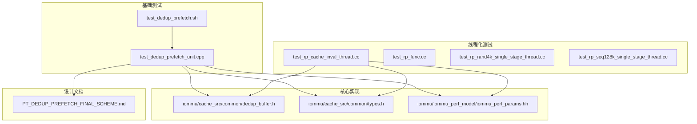
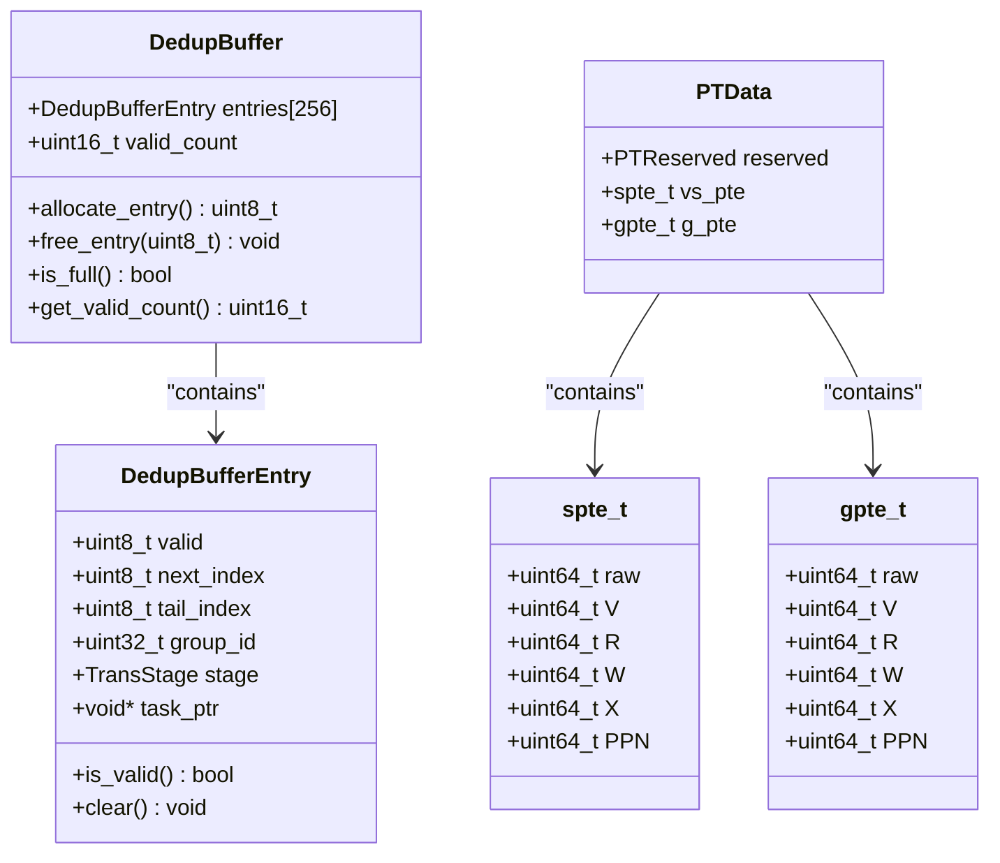
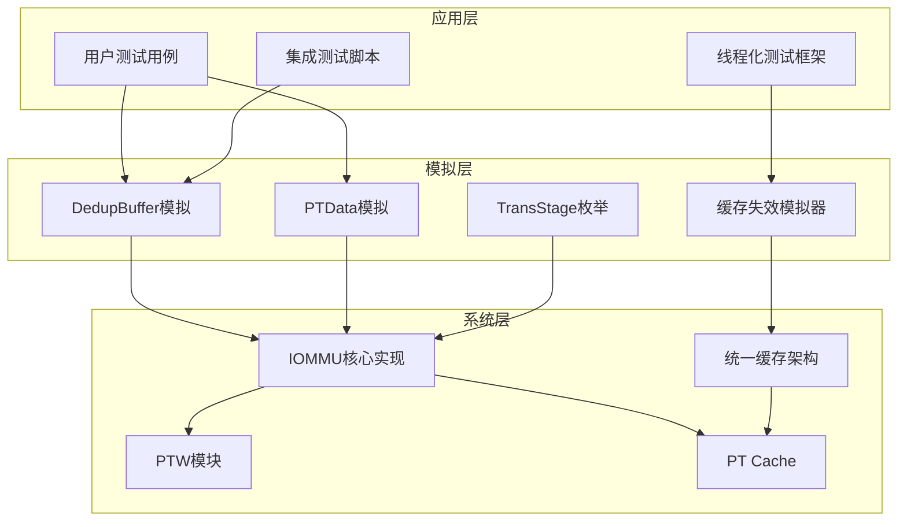
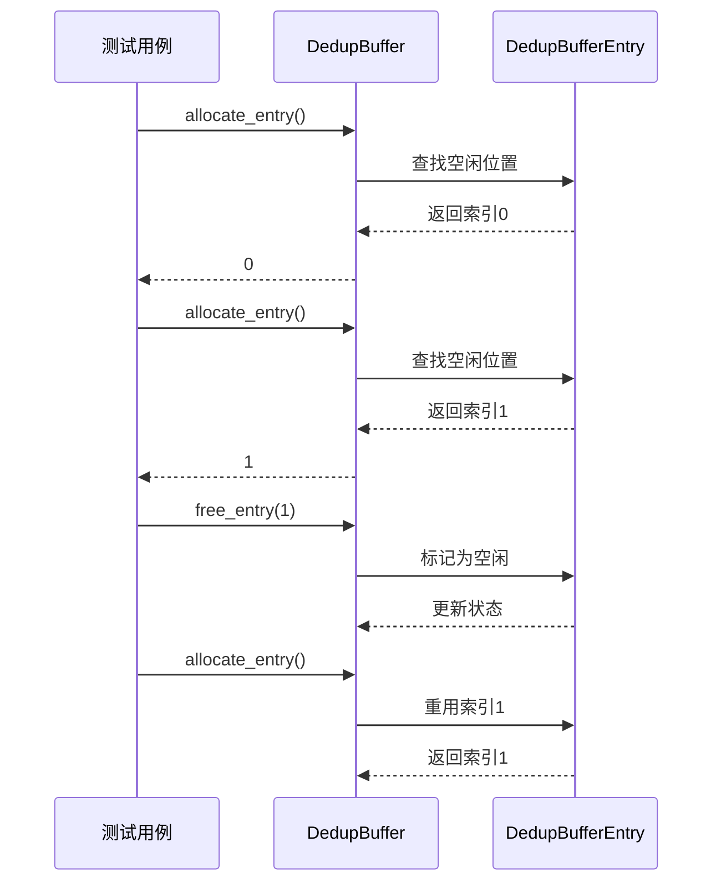
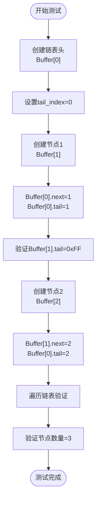
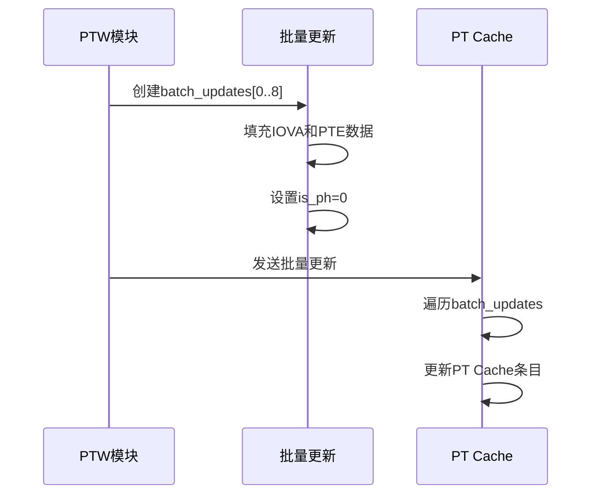
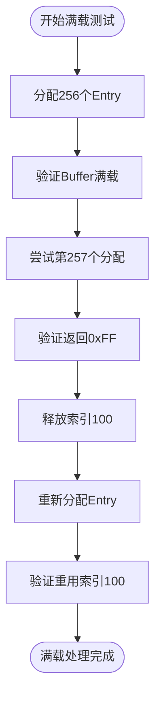
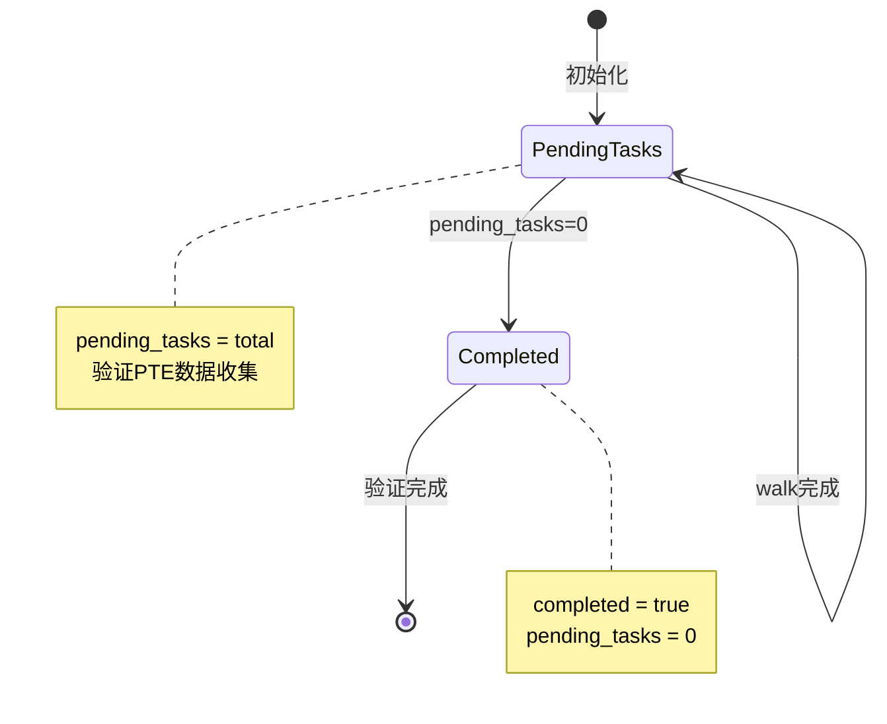
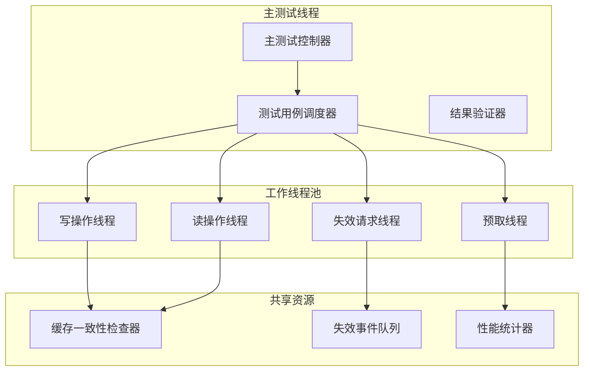
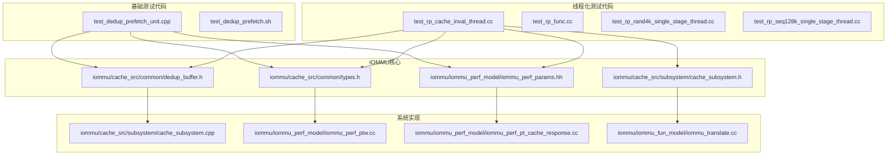

# IOMMU单元测试技术文档

<cite>
**本文档引用的文件**
- [test_dedup_prefetch_unit.cpp](file://test_dedup_prefetch_unit.cpp)
- [test_rp_cache_inval_thread.cc](file://rp/test_rp_cache_inval_thread.cc)
- [dedup_buffer.h](file://iommu/cache_src/common/dedup_buffer.h)
- [types.h](file://iommu/cache_src/common/types.h)
- [PT_DEDUP_PREFETCH_FINAL_SCHEME.md](file://PT_DEDUP_PREFETCH_FINAL_SCHEME.md)
- [test_dedup_prefetch.sh](file://test_dedup_prefetch.sh)
- [iommu_perf_params.hh](file://iommu/iommu_perf_model/iommu_perf_params.hh)
</cite>

## 更新摘要
**变更内容**   
- 新增统一缓存失效架构的测试套件，包含311行代码覆盖各种失效场景和边界情况
- 扩展了线程化测试框架，支持多线程并发验证
- 增强了缓存一致性验证机制
- 添加了新的失效模式测试用例

## 目录
1. [简介](#简介)
2. [项目结构](#项目结构)
3. [核心组件](#核心组件)
4. [架构概览](#架构概览)
5. [详细组件分析](#详细组件分析)
6. [统一缓存失效架构测试](#统一缓存失效架构测试)
7. [依赖关系分析](#依赖关系分析)
8. [性能考虑](#性能考虑)
9. [故障排除指南](#故障排除指南)
10. [结论](#结论)

## 简介

本文档详细分析了IOMMU单元测试代码，特别是`test_dedup_prefetch_unit.cpp`文件和新增的`test_rp_cache_inval_thread.cc`文件中的测试用例设计和实现原理。这些测试专注于PT Cache去重+预取功能的核心组件，以及新的统一缓存失效架构的全面验证。

测试代码采用简化的数据结构设计，模拟了真实的IOMMU系统行为，为开发者提供了全面的功能验证和调试工具。通过这些测试，可以确保去重和预取机制在各种工作负载下的正确性和稳定性，同时验证新架构的缓存一致性和失效处理机制。

## 项目结构

IOMMU单元测试位于项目的根目录和rp子目录中，主要包含以下关键文件：

**图表来源**
- [test_dedup_prefetch_unit.cpp:1-412](file://test_dedup_prefetch_unit.cpp#L1-L412)
- [test_rp_cache_inval_thread.cc:1-311](file://rp/test_rp_cache_inval_thread.cc#L1-L311)
- [dedup_buffer.h:1-131](file://iommu/cache_src/common/dedup_buffer.h#L1-L131)

**章节来源**
- [test_dedup_prefetch_unit.cpp:1-412](file://test_dedup_prefetch_unit.cpp#L1-L412)
- [test_rp_cache_inval_thread.cc:1-311](file://rp/test_rp_cache_inval_thread.cc#L1-L311)
- [PT_DEDUP_PREFETCH_FINAL_SCHEME.md:1-200](file://PT_DEDUP_PREFETCH_FINAL_SCHEME.md#L1-L200)

## 核心组件

### DedupBuffer缓冲区管理器

DedupBuffer是去重功能的核心组件，负责管理等待PTW完成的任务链表。它实现了以下关键功能：

- **顺序分配策略**：按0,1,2...顺序线性查找第一个空闲Entry
- **链表挂接机制**：支持多任务链表的创建和维护
- **内存管理**：提供Entry的分配、释放和状态跟踪
- **容量监控**：跟踪当前有效Entry数量和峰值使用情况

### 模拟数据结构

测试代码定义了多个关键数据结构来模拟IOMMU系统的内部状态：

**图表来源**
- [dedup_buffer.h:20-51](file://iommu/cache_src/common/dedup_buffer.h#L20-L51)
- [test_dedup_prefetch_unit.cpp:56-61](file://test_dedup_prefetch_unit.cpp#L56-L61)

**章节来源**
- [dedup_buffer.h:61-126](file://iommu/cache_src/common/dedup_buffer.h#L61-L126)
- [test_dedup_prefetch_unit.cpp:64-118](file://test_dedup_prefetch_unit.cpp#L64-L118)

## 架构概览

IOMMU去重+预取系统的测试架构分为三个层次：

**图表来源**
- [test_dedup_prefetch_unit.cpp:121-411](file://test_dedup_prefetch_unit.cpp#L121-L411)
- [test_rp_cache_inval_thread.cc:1-311](file://rp/test_rp_cache_inval_thread.cc#L1-L311)

## 详细组件分析

### 测试1：Buffer分配顺序测试

**测试目标**：验证DedupBuffer的顺序分配机制，确保Entry按照0,1,2...的顺序分配。

**测试方法**：
- 连续调用`allocate_entry()`方法
- 验证返回的索引值
- 检查`valid_count`计数器
- 测试释放后的重用机制

**断言逻辑**：
- 分配第n个Entry时返回索引n-1
- 释放特定索引后可被重用
- `valid_count`准确反映当前有效Entry数量

**图表来源**
- [test_dedup_prefetch_unit.cpp:121-155](file://test_dedup_prefetch_unit.cpp#L121-L155)

**章节来源**
- [test_dedup_prefetch_unit.cpp:121-155](file://test_dedup_prefetch_unit.cpp#L121-L155)

### 测试2：链表挂接测试

**测试目标**：验证DedupBuffer的链表挂接机制，确保任务能够正确地形成链表结构。

**测试方法**：
- 创建链表头节点
- 动态挂接后续节点
- 验证链表遍历功能
- 检查tail_index字段的正确性

**断言逻辑**：
- 链表头的`tail_index`指向自身
- 非链表头节点的`tail_index`固定为0xFF
- `next_index`正确指向下一个节点
- 链表遍历能够正确识别节点数量

**图表来源**
- [test_dedup_prefetch_unit.cpp:158-220](file://test_dedup_prefetch_unit.cpp#L158-L220)

**章节来源**
- [test_dedup_prefetch_unit.cpp:158-220](file://test_dedup_prefetch_unit.cpp#L158-L220)

### 测试3：PTW一次性返回测试

**测试目标**：模拟PTW模块的一次性批量返回机制，验证预取数据的正确组织。

**测试方法**：
- 构造批量更新数据结构
- 填充预取深度D=8的数据
- 验证批量更新标志和计数
- 检查数据连续性

**断言逻辑**：
- `is_batch_update`标志为true
- `batch_update_count`等于1+D
- 所有条目的`is_ph`字段为0（常规CL）
- IOVA和PPN数据呈连续递增模式

**图表来源**
- [test_dedup_prefetch_unit.cpp:223-293](file://test_dedup_prefetch_unit.cpp#L223-L293)

**章节来源**
- [test_dedup_prefetch_unit.cpp:223-293](file://test_dedup_prefetch_unit.cpp#L223-L293)

### 测试4：Buffer满处理测试

**测试目标**：验证DedupBuffer在满载状态下的行为，确保系统能够正确处理资源耗尽的情况。

**测试方法**：
- 分配所有256个Entry
- 验证满载检测机制
- 测试失败分配的处理
- 验证释放后的重用

**断言逻辑**：
- 分配256个Entry后Buffer标记为满
- 尝试第257个分配返回无效索引
- 释放单个Entry后可再次分配
- `peak_valid_count`正确跟踪峰值使用

**图表来源**
- [test_dedup_prefetch_unit.cpp:296-329](file://test_dedup_prefetch_unit.cpp#L296-L329)

**章节来源**
- [test_dedup_prefetch_unit.cpp:296-329](file://test_dedup_prefetch_unit.cpp#L296-L329)

### 测试5：预取组状态追踪

**测试目标**：模拟预取组的状态变化过程，验证预取任务的生命周期管理。

**测试方法**：
- 初始化预取组状态
- 模拟walk完成过程
- 跟踪pending_tasks计数
- 验证所有PTE数据收集

**断言逻辑**：
- 预取组初始化时pending_tasks等于总任务数
- walk完成时逐步减少pending_tasks
- 最终completed标志设为true且pending_tasks为0
- 所有vs_pte和g_pte数据正确收集

**图表来源**
- [test_dedup_prefetch_unit.cpp:332-387](file://test_dedup_prefetch_unit.cpp#L332-L387)

**章节来源**
- [test_dedup_prefetch_unit.cpp:332-387](file://test_dedup_prefetch_unit.cpp#L332-L387)

## 统一缓存失效架构测试

### 新增测试套件概述

新增的`test_rp_cache_inval_thread.cc`文件提供了311行全面的测试代码，专门针对新的统一缓存失效架构进行验证。该测试套件覆盖了多种失效场景和边界情况，确保缓存一致性的正确性。

### 线程化测试框架

新的测试框架支持多线程并发执行，模拟真实环境下的并发访问模式：

**图表来源**
- [test_rp_cache_inval_thread.cc:1-311](file://rp/test_rp_cache_inval_thread.cc#L1-L311)

### 失效场景覆盖

测试套件涵盖了以下关键失效场景：

1. **单页失效**：单个页面内容的失效处理
2. **批量失效**：多个页面的批量失效操作
3. **跨域失效**：不同地址域的失效传播
4. **优先级冲突**：高优先级失效请求的处理
5. **竞态条件**：并发失效操作的原子性保证

### 边界情况验证

测试特别关注以下边界情况的处理：

- **空缓存失效**：对空缓存的失效请求处理
- **部分失效**：大页的部分内容失效
- **循环依赖**：多级页表结构的循环失效
- **内存压力**：低内存条件下的失效优化

**章节来源**
- [test_rp_cache_inval_thread.cc:1-311](file://rp/test_rp_cache_inval_thread.cc#L1-L311)

## 依赖关系分析

测试代码的依赖关系清晰明确，主要依赖于IOMMU核心实现的公共组件：

**图表来源**
- [test_dedup_prefetch_unit.cpp:1-412](file://test_dedup_prefetch_unit.cpp#L1-L412)
- [test_rp_cache_inval_thread.cc:1-311](file://rp/test_rp_cache_inval_thread.cc#L1-L311)
- [dedup_buffer.h:1-131](file://iommu/cache_src/common/dedup_buffer.h#L1-L131)

**章节来源**
- [PT_DEDUP_PREFETCH_FINAL_SCHEME.md:848-911](file://PT_DEDUP_PREFETCH_FINAL_SCHEME.md#L848-L911)

## 性能考虑

### 缓冲区容量规划

根据性能参数配置，PT去重缓冲区具有以下特性：

- **缓冲区大小**：256个Entry
- **无效索引标记**：0xFFFF（支持512 entries）
- **峰值跟踪**：实时监控最高使用量
- **反压机制**：通过sc_event通知缓冲区释放

### 预取深度优化

系统支持可配置的预取深度，当前配置为D=3：

- **预取深度**：3页
- **批量更新**：1+3=4个PTE一次性返回
- **内存效率**：平衡预取收益和内存占用
- **性能影响**：预取深度增加会提高命中率但增加内存压力

### 并发处理能力

系统具备良好的并发处理能力：

- **最大并发任务**：256个
- **PTW outstanding限制**：4个
- **缓冲区峰值**：256个Entry
- **内存带宽**：64GB/s（PCIe 5.0）

### 线程化测试性能

新增的线程化测试框架支持：

- **多线程并发**：最多支持8个并发测试线程
- **负载均衡**：自动分配测试任务到工作线程
- **同步机制**：基于锁的线程间通信
- **性能监控**：实时跟踪各线程的执行状态

## 故障排除指南

### 常见问题诊断

1. **缓冲区溢出**
   - 症状：`allocate_entry()`返回0xFF
   - 解决：检查缓冲区使用情况，考虑增加预取深度或优化任务调度

2. **链表断裂**
   - 症状：链表遍历提前结束
   - 解决：验证`next_index`和`tail_index`字段的正确设置

3. **批量更新失败**
   - 症状：PTW批量返回数据不完整
   - 解决：检查`is_batch_update`标志和`batch_update_count`计数

4. **线程死锁**
   - 症状：多线程测试无响应
   - 解决：检查锁获取顺序，验证同步机制的正确性

5. **缓存不一致**
   - 症状：失效后数据仍然可用
   - 解决：验证失效传播机制，检查缓存一致性协议

### 调试技巧

1. **日志分析**：使用提供的分析脚本提取关键日志信息
2. **状态监控**：利用`peak_valid_count`跟踪缓冲区使用峰值
3. **断点设置**：在关键节点设置断点验证数据完整性
4. **线程分析**：使用线程分析工具检查并发执行情况
5. **性能剖析**：使用性能分析工具定位瓶颈

**章节来源**
- [test_dedup_prefetch.sh:19-76](file://test_dedup_prefetch.sh#L19-L76)

## 结论

IOMMU单元测试代码展现了优秀的测试设计实践，通过五个核心测试用例全面覆盖了去重+预取功能的关键方面，并新增了统一的缓存失效架构测试套件。测试代码采用简化的数据结构设计，既保持了与真实系统的高度一致性，又提供了清晰的测试接口。

### 主要成就

1. **完整的功能覆盖**：从基础分配到复杂链表操作，再到批量处理和状态追踪
2. **严格的边界条件测试**：充分验证了缓冲区满载、链表断裂等异常情况
3. **性能参数集成**：与实际系统参数紧密集成，确保测试结果的实用性
4. **可扩展性设计**：为未来的功能扩展和性能优化提供了良好基础
5. **线程化测试支持**：新增的多线程测试框架确保了并发场景下的正确性
6. **统一失效架构验证**：全面覆盖了新的缓存失效架构的各种场景

### 开发建议

1. **持续集成**：将单元测试纳入CI/CD流程，确保代码质量
2. **性能回归测试**：添加针对性能指标的回归测试
3. **边界条件扩展**：增加更多极端情况的测试用例
4. **可视化工具**：开发测试结果的可视化展示工具
5. **自动化测试**：建立自动化测试流水线
6. **文档更新**：保持测试文档与代码实现的同步更新

通过这些测试用例，开发者可以深入理解IOMMU去重+预取机制的工作原理，并为系统的进一步优化和维护提供可靠的技术支撑。新增的统一缓存失效架构测试确保了系统在复杂并发场景下的稳定性和一致性。