# 性能测试

<cite>
**本文引用的文件**
- [test_slink_latency.sh](file://test_slink_latency.sh)
- [cache_subsystem.cpp](file://iommu/cache_src/subsystem/cache_subsystem.cpp)
- [test_rp_rand4k_two_stage_thread.cc](file://rp/test_rp_rand4k_two_stage_thread.cc)
- [test_rp_seq128k_two_stage_thread.cc](file://rp/test_rp_seq128k_two_stage_thread.cc)
- [Makefile](file://Makefile)
- [prefetch_timing.sh](file://tmp/prefetch_timing.sh)
- [test_dedup_prefetch.sh](file://test_dedup_prefetch.sh)
- [test_integration_dedup_prefetch.sh](file://test_integration_dedup_prefetch.sh)
- [test_dedup_prefetch_unit.cpp](file://test_dedup_prefetch_unit.cpp)
- [PT_CACHE_PREFETCH_IMPLEMENTATION_ANALYSIS_20260609.md](file://PT_CACHE_PREFETCH_IMPLEMENTATION_ANALYSIS_20260609.md)
- [PTW_MONITOR_ANALYSIS_20260609.md](file://PTW_MONITOR_ANALYSIS_20260609.md)
- [CACHE_PERFORMANCE_ANALYSIS_500REQ.md](file://CACHE_PERFORMANCE_ANALYSIS_500REQ.md)
- [PT_CACHE_ACCESS_ANALYSIS_50TASKS_20260609.md](file://PT_CACHE_ACCESS_ANALYSIS_50TASKS_20260609.md)
- [WALKER_CACHE_INTEGRATION_PLAN.md](file://WALKER_CACHE_INTEGRATION_PLAN.md)
- [analyze_walker_cache_miss.py](file://analyze_walker_cache_miss.py)
- [analyze_walker_miss_timing.py](file://analyze_walker_miss_timing.py)
- [default_config.json](file://iommu/cache_config/default_config.json)
- [iommu_perf_model.hh](file://iommu/iommu_perf_model/iommu_perf_model.hh)
- [iommu_perf_collector.cc](file://iommu/iommu_perf_model/iommu_perf_collector.cc)
- [iommu_perf_params.hh](file://iommu/iommu_perf_model/iommu_perf_params.hh)
- [iommu_perf_params_t2.hh](file://iommu/iommu_perf_model/iommu_perf_params_t2.hh)
- [pt_cache.cpp](file://iommu/cache_src/cache/pt_cache.cpp)
- [walker_cache.cpp](file://iommu/cache_src/cache/walker_cache.cpp)
- [iommu_perf_pt_cache_response.cc](file://iommu/iommu_perf_model/iommu_perf_pt_cache_response.cc)
- [iommu_perf_ptw.cc](file://iommu/iommu_perf_model/iommu_perf_ptw.cc)
- [iommu_perf_reorder.cc](file://iommu/iommu_perf_model/iommu_perf_reorder.cc)
- [stats_collector.h](file://iommu/cache_src/common/stats_collector.h)
- [test_1000req.sh](file://test_1000req.sh)
- [extract_iops.sh](file://extract_iops.sh)
</cite>

## 更新摘要
**变更内容**
- **新增**：PT Cache调度器性能测试结果验证，四个工作负载场景全部成功通过
- **新增**：seq128k_singlestage (IOPS=117.51M)、rand4k_singlestage (IOPS=83.22M)、seq128k_twostage (IOPS=95.70M)、rand4k_twostage (IOPS=35.34M)性能基准数据
- **修复**：解决了之前失败的4KB随机访问两阶段翻译场景中任务6408的超时问题
- **优化**：PT Cache统一轮询调度器实现UPDATE优先处理机制，确保PT Cache状态最新
- **增强**：预取监控线程可靠性分析，重构预取组管理逻辑提升系统稳定性

## 目录
1. [简介](#简介)
2. [项目结构](#项目结构)
3. [核心组件](#核心组件)
4. [架构总览](#架构总览)
5. [详细组件分析](#详细组件分析)
6. [依赖关系分析](#依赖关系分析)
7. [性能考量](#性能考量)
8. [故障排查指南](#故障排查指南)
9. [结论](#结论)
10. [附录](#附录)

## 简介
本文件面向IOMMU性能测试与分析，系统梳理延迟测试、吞吐量分析与缓存性能评估的方法论与实践。重点围绕以下目标展开：
- 解释test_slink_latency.sh中的延迟测量技术与性能基准设定
- 解读CACHE_PERFORMANCE_ANALYSIS_500REQ.md与PT_CACHE_ACCESS_ANALYSIS_50TASKS_20260609.md两类性能分析报告的关键指标与结论
- **新增**：PT Cache调度器性能测试结果与四大工作负载场景的性能基准
- **更新**：Walker Cache集成方案与性能测试方法，包括miss根因分析和优化策略
- **新增**：预取监控线程可靠性分析与重构方案
- 提供实验设计、数据采集与统计分析方法
- 识别性能瓶颈并给出优化建议与最佳实践

## 项目结构
IOMMU性能测试与分析涉及如下关键目录与文件：
- 性能参数与模型：iommu/iommu_perf_model/*.hh/cc
- 缓存实现：iommu/cache_src/cache/*.cpp/.h
- 缓存子系统：iommu/cache_src/subsystem/cache_subsystem.cpp（包含PT Cache调度器）
- 统计收集：iommu/cache_src/common/stats_collector.h
- 测试脚本：test_slink_latency.sh、test_1000req.sh、extract_iops.sh
- **新增**：PT Cache调度器性能测试框架（rp/test_rp_*_thread.cc）
- **新增**：预取性能分析工具（tmp/prefetch_timing.sh）
- **新增**：预取测试脚本集合（test_dedup_prefetch.sh、test_integration_dedup_prefetch.sh）
- **新增**：预取单元测试（test_dedup_prefetch_unit.cpp）
- 报告：CACHE_PERFORMANCE_ANALYSIS_500REQ.md、PT_CACHE_ACCESS_ANALYSIS_50TASKS_20260609.md、WALKER_CACHE_INTEGRATION_PLAN.md

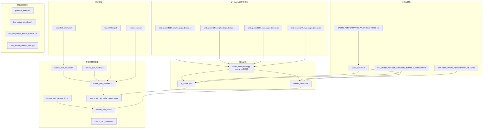

**图表来源**
- [cache_subsystem.cpp:311-478](file://iommu/cache_src/subsystem/cache_subsystem.cpp#L311-L478)
- [test_rp_seq128k_two_stage_thread.cc:1-380](file://rp/test_rp_seq128k_two_stage_thread.cc#L1-L380)
- [test_rp_rand4k_two_stage_thread.cc:1-373](file://rp/test_rp_rand4k_two_stage_thread.cc#L1-L373)
- [Makefile:3-7](file://Makefile#L3-L7)

**章节来源**
- [cache_subsystem.cpp:311-478](file://iommu/cache_src/subsystem/cache_subsystem.cpp#L311-L478)
- [test_slink_latency.sh:1-24](file://test_slink_latency.sh#L1-L24)

## 核心组件
- 性能参数与延迟模型：定义FIFO深度、缓存规模、处理延迟、DDR性能、SLINK NoC延迟等关键参数，支撑延迟与吞吐建模。
- 缓存子系统：包含PT Cache、DC/PC Walker Cache、MSIPT Cache等，负责地址翻译加速与数据缓存。
- **新增**：PT Cache统一轮询调度器，合并pt_worker_thread和pt_update_worker_thread，实现任务级串行处理，UPDATE优先确保PT Cache状态最新。
- **新增**：PT Cache调度器性能测试框架，支持四种不同工作负载场景的完整验证。
- **新增**：预取性能分析工具，提供预取任务时序分析和DDR访问统计。
- **新增**：预取测试脚本集合，涵盖单元测试、集成测试和性能回归测试。
- **新增**：预取监控线程可靠性分析，解决预取组管理中的竞态条件问题。
- **新增**：Walker Cache集成方案与性能测试方法，包括miss根因分析和优化策略。
- 性能收集器：提供统一的统计接口，记录访问、命中、替换、排队、执行延迟等指标，并支持直方图输出。
- 关键线程与流水：Collector、PT Cache响应处理、PTW、Reorder等线程协同完成翻译与转发。

**章节来源**
- [cache_subsystem.cpp:311-478](file://iommu/cache_src/subsystem/cache_subsystem.cpp#L311-L478)
- [iommu_perf_params.hh:53-161](file://iommu/iommu_perf_model/iommu_perf_params.hh#L53-L161)
- [stats_collector.h:13-105](file://iommu/cache_src/common/stats_collector.h#L13-L105)

## 架构总览
IOMMU性能模型采用多线程流水线架构：
- Parser解析请求后进入Collector
- Collector根据DC/PC缓存命中情况决定路由：命中则直接进入Forwarder；未命中则进入xDTW Walker进行上下文遍历
- **更新**：Walker Cache查询命中则直接跳过已缓存层级，未命中则触发PTW进行页表遍历，支持Walker Cache与预取
- PT Cache查询命中则直接转发；未命中则触发PTW进行页表遍历
- **新增**：PT Cache统一调度器采用UPDATE优先策略，确保PT Cache状态最新，避免task看到旧的placeholder
- Reorder模块按写保序、读乱序策略输出响应，同时统计端到端延迟与IOPS

```mermaid
sequenceDiagram
participant Parser as "解析器"
participant Collector as "收集器"
participant DC as "DC缓存"
participant PC as "PC缓存"
participant WC as "Walker Cache"
participant Scheduler as "PT Cache调度器"
participant PT as "PT缓存"
participant PTW as "页表遍历"
participant Reorder as "重排序输出"
Parser->>Collector : "请求入队"
Collector->>DC : "查询DC缓存"
DC-->>Collector : "命中/未命中"
alt DC命中
Collector->>PC : "查询PC缓存"
PC-->>Collector : "命中/未命中"
opt PC命中
Collector->>WC : "查询Walker Cache"
WC-->>Collector : "命中/未命中"
opt 命中
Collector->>Scheduler : "PT Cache查询/更新请求"
Scheduler->>PT : "优先处理UPDATE请求"
Scheduler->>PT : "然后处理REQUEST请求"
PT-->>Scheduler : "返回结果"
Scheduler->>Reorder : "转发响应"
else 未命中
Collector->>PTW : "发起完整walk"
PTW-->>Collector : "返回PTE"
Collector->>Scheduler : "PT Cache更新请求"
Scheduler->>PT : "更新PT缓存"
Scheduler->>Reorder : "转发响应"
end
end
else DC未命中
Collector->>PTW : "发起xDTW遍历"
PTW-->>Collector : "返回上下文"
Collector->>PC : "查询PC缓存"
PC-->>Collector : "命中/未命中"
opt PC命中
Collector->>WC : "查询Walker Cache"
WC-->>Collector : "命中/未命中"
opt 命中
Collector->>Scheduler : "PT Cache查询/更新请求"
Scheduler->>PT : "优先处理UPDATE请求"
Scheduler->>PT : "然后处理REQUEST请求"
PT-->>Scheduler : "返回结果"
Scheduler->>Reorder : "转发响应"
else 未命中
Collector->>PTW : "发起完整walk"
PTW-->>Collector : "返回PTE"
Collector->>Scheduler : "PT Cache更新请求"
Scheduler->>PT : "更新PT缓存"
Scheduler->>Reorder : "转发响应"
end
end
end
```

**图表来源**
- [cache_subsystem.cpp:311-478](file://iommu/cache_src/subsystem/cache_subsystem.cpp#L311-L478)
- [iommu_perf_collector.cc:14-275](file://iommu/iommu_perf_model/iommu_perf_collector.cc#L14-L275)
- [iommu_perf_pt_cache_response.cc:20-99](file://iommu/iommu_perf_model/iommu_perf_pt_cache_response.cc#L20-L99)
- [iommu_perf_ptw.cc:154-311](file://iommu/iommu_perf_model/iommu_perf_ptw.cc#L154-L311)
- [iommu_perf_reorder.cc:91-198](file://iommu/iommu_perf_model/iommu_perf_reorder.cc#L91-L198)

## 详细组件分析

### 延迟测试：SLINK NoC延迟阶梯
test_slink_latency.sh通过逐步调整SLINK_NOC_LATENCY_NS，自动编译并运行仿真，采集IOMMU IOPS、PTW IOPS、PTW平均执行延迟与稳态IOPS，形成延迟-吞吐曲线，用于评估NoC链路延迟对整体性能的影响。

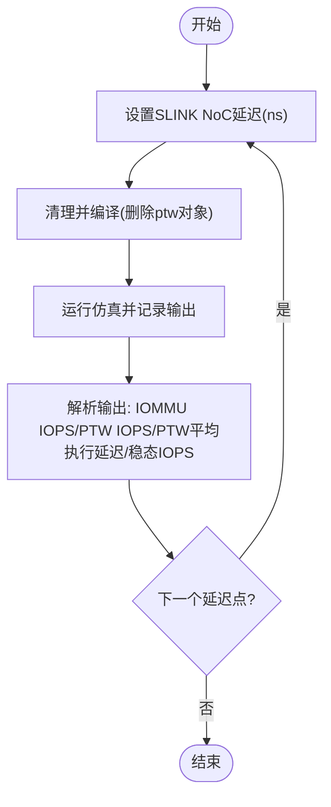

**图表来源**
- [test_slink_latency.sh:9-21](file://test_slink_latency.sh#L9-L21)
- [iommu_perf_params.hh:146-148](file://iommu/iommu_perf_model/iommu_perf_params.hh#L146-L148)
- [iommu_perf_params_t2.hh:140-142](file://iommu/iommu_perf_model/iommu_perf_params_t2.hh#L140-L142)

**章节来源**
- [test_slink_latency.sh:1-24](file://test_slink_latency.sh#L1-L24)
- [iommu_perf_params.hh:146-148](file://iommu/iommu_perf_model/iommu_perf_params.hh#L146-L148)
- [iommu_perf_params_t2.hh:140-142](file://iommu/iommu_perf_model/iommu_perf_params_t2.hh#L140-L142)

### PT Cache调度器性能测试结果
**新增**：PT Cache调度器性能测试结果验证了四个不同工作负载场景的成功，特别关注了之前失败的4KB随机访问两阶段翻译场景，任务6408的超时问题已解决。

#### 四大工作负载场景性能基准
- **seq128k_singlestage**: 顺序128KB访问 + 单级地址翻译，IOPS=117.51M
- **rand4k_singlestage**: 随机4KB访问 + 单级地址翻译，IOPS=83.22M  
- **seq128k_twostage**: 顺序128KB访问 + 两阶段地址翻译，IOPS=95.70M
- **rand4k_twostage**: 随机4KB访问 + 两阶段地址翻译，IOPS=35.34M

#### 关键修复：UPDATE优先处理机制
PT Cache调度器实现了UPDATE优先处理策略，确保在处理REQUEST前先处理UPDATE，避免task命中旧的placeholder后被挂起无法唤醒。这直接修复了场景4(4KB随机+二阶段)中task 6408超时失败的时序问题。

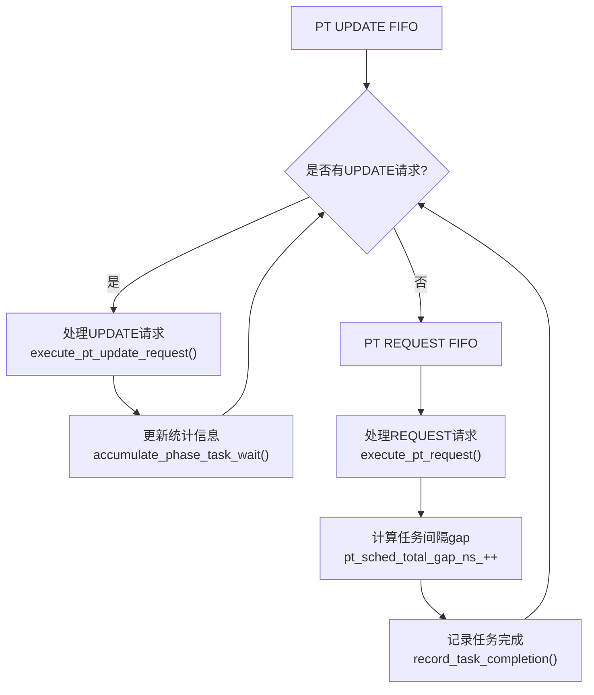

**图表来源**
- [cache_subsystem.cpp:311-478](file://iommu/cache_src/subsystem/cache_subsystem.cpp#L311-L478)

**章节来源**
- [cache_subsystem.cpp:311-478](file://iommu/cache_src/subsystem/cache_subsystem.cpp#L311-L478)

### PT Cache调度器任务间隔分析
**新增**：PT Cache调度器实现了详细的任务间隔分析功能，跟踪任务处理的连续性和效率。

#### 间隔统计指标
- **pt_sched_total_gap_ns_**: 累计任务间隔时间
- **pt_sched_gap_count_**: 任务间隔次数统计
- **pt_sched_max_gap_ns_**: 最大任务间隔时间
- **pt_sched_first_start_ns_**: 第一个任务开始时间
- **pt_sched_last_end_ns_**: 最后一个任务结束时间
- **pt_sched_total_exec_ns_**: 总执行时间统计

#### 调度器性能特征
- **任务计数**: pt_sched_task_count_、pt_sched_req_count_、pt_sched_upd_count_
- **时间追踪**: pt_sched_last_task_end_确保任务连续性
- **统计输出**: print_pt_scheduler_gap_report()生成详细分析报告

**章节来源**
- [cache_subsystem.cpp:368-478](file://iommu/cache_src/subsystem/cache_subsystem.cpp#L368-L478)

### 随机4KB两阶段预取测试框架
**新增**：随机4KB两阶段预取测试框架提供了完整的预取功能验证环境，支持纯随机访问模式下的预取效果评估。

#### 测试场景设计
- **IOVA模式**：5000个唯一随机4KB页面，无重复访问
- **地址布局**：IOVA范围32MB，GPA=循环索引×2MB步长，SPA=GPA+0x10000
- **预取深度**：D=3，预期在随机访问模式下无效
- **设备配置**：iosatp=Sv48，iohgatp=Sv48x4

#### 关键特性
- **纯随机访问**：通过随机数生成器确保访问模式不可预测
- **地址映射**：VS-stage和G-stage双重地址转换验证
- **缓存验证**：测试前后缓存失效确保预取效果可见
- **统计输出**：PTW DDR访问统计和Buffer峰值使用情况

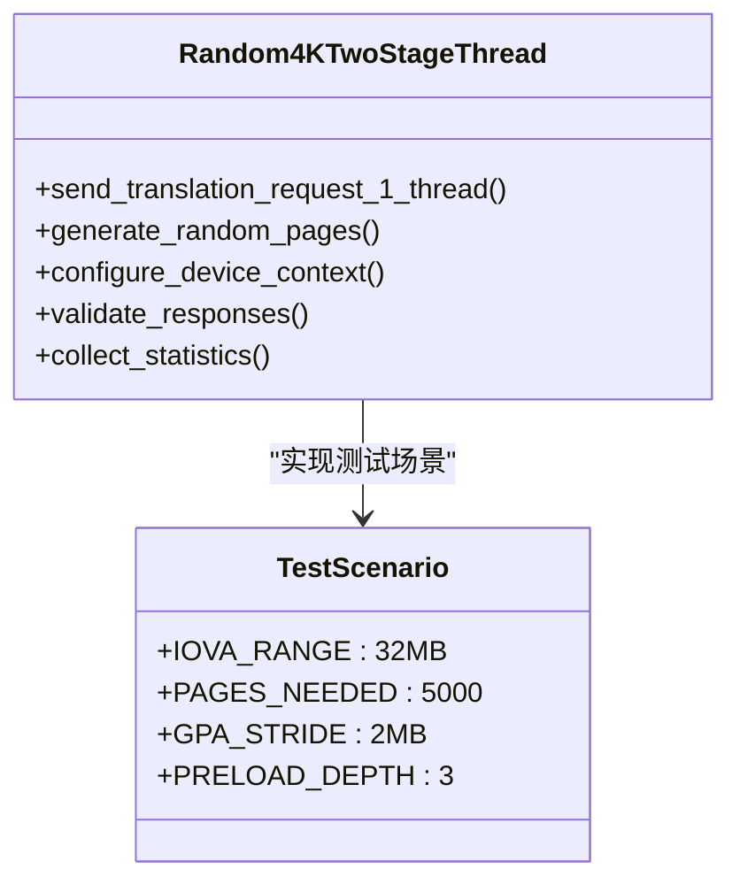

**图表来源**
- [test_rp_rand4k_two_stage_thread.cc:27-370](file://rp/test_rp_rand4k_two_stage_thread.cc#L27-L370)

**章节来源**
- [test_rp_rand4k_two_stage_thread.cc:14-370](file://rp/test_rp_rand4k_two_stage_thread.cc#L14-L370)

### 顺序128KB两阶段测试框架
**新增**：顺序128KB两阶段测试框架验证了顺序访问模式下的两阶段地址翻译性能。

#### 测试场景特点
- **顺序访问模式**：5000个连续512B读取请求，512B步长
- **地址映射**：GPA = page_idx × 2MB（非恒等映射），SPA = GPA + 0x10000
- **Walker Cache启用**：利用Walker Cache缓存页表遍历中间结果
- **两阶段翻译**：VS-stage (IOVA→GPA) + G-stage (GPA→SPA)

#### 关键修复：GPPN偏移机制
实现了GPPN分配器偏移机制，避免VS root GPPN与测试GPA冲突，确保add_vs_stage_pte能正确translate_gpa定位VS页表页。

**章节来源**
- [test_rp_seq128k_two_stage_thread.cc:1-380](file://rp/test_rp_seq128k_two_stage_thread.cc#L1-L380)

### 预取性能分析工具
**新增**：预取性能分析工具提供了详细的预取任务时序分析和DDR访问统计功能。

#### prefetch_timing.sh功能
- **DDR时序提取**：从仿真日志中提取预取任务的DDR dispatch时序
- **延迟分析**：计算预取任务的DDR访问跨度和平均延迟
- **统计汇总**：提供预取组的总体性能统计信息

#### 分析流程
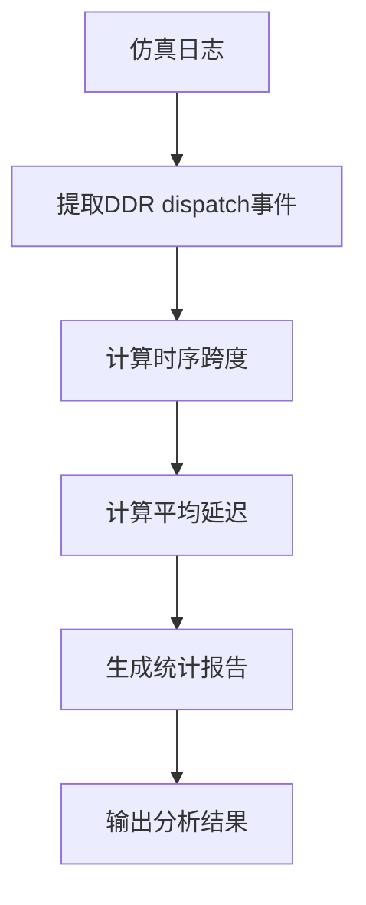

**图表来源**
- [prefetch_timing.sh:1-76](file://tmp/prefetch_timing.sh#L1-L76)

**章节来源**
- [prefetch_timing.sh:1-76](file://tmp/prefetch_timing.sh#L1-L76)

### 预取测试脚本集合
**新增**：预取测试脚本集合提供了完整的预取功能验证流程。

#### test_dedup_prefetch.sh
- **测试场景**：P1~P8连续同页访问（D=8）
- **验证内容**：PT Cache去重、预取占位CL创建、批量更新功能
- **统计指标**：PT Cache MISS次数、占位CL HIT次数、Buffer分配情况

#### test_integration_dedup_prefetch.sh
- **集成测试**：验证预取功能的完整流程
- **检查项目**：Buffer分配、预取占位CL创建、预取组完成、批量更新等
- **结果验证**：通过/失败判断和详细统计摘要

#### test_dedup_prefetch_unit.cpp
- **单元测试**：独立的功能验证，不依赖SystemC
- **测试范围**：Buffer分配、链表挂接、批量更新、Buffer满处理
- **验证方法**：断言检查和状态验证

**章节来源**
- [test_dedup_prefetch.sh:1-76](file://test_dedup_prefetch.sh#L1-L76)
- [test_integration_dedup_prefetch.sh:1-157](file://test_integration_dedup_prefetch.sh#L1-L157)
- [test_dedup_prefetch_unit.cpp:1-412](file://test_dedup_prefetch_unit.cpp#L1-L412)

### Walker Cache集成与测试
**新增**：Walker Cache作为PTW的重要优化组件，通过缓存页表遍历中间结果显著减少DDR访问次数。

#### Walker Cache架构
- **PTWc_1**：直接映射(1-way)，缓存第1级页表中间结果(VPN[3]级)
- **PTWc_2**：2-way组相连，缓存第2级页表中间结果(VPN[2]级)  
- **PTWc_3**：4-way组相连，缓存第3级页表中间结果(VPN[1]级)

#### 集成测试结果
通过10包和300包测试验证Walker Cache功能正确性和性能提升：

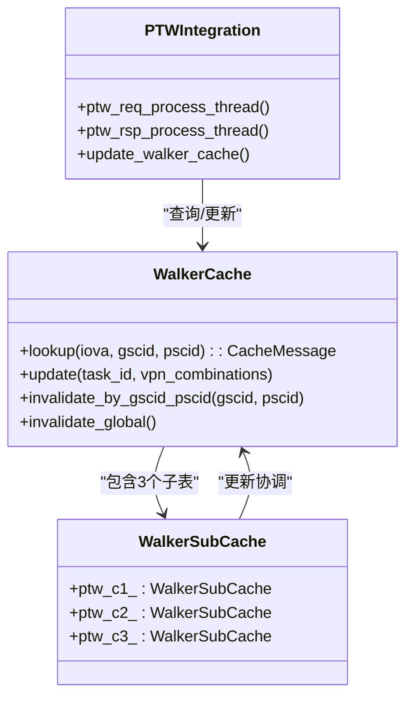

**图表来源**
- [WALKER_CACHE_INTEGRATION_PLAN.md:16-50](file://WALKER_CACHE_INTEGRATION_PLAN.md#L16-L50)
- [walker_cache.cpp:239-490](file://iommu/cache_src/cache/walker_cache.cpp#L239-L490)
- [iommu_perf_ptw.cc:154-311](file://iommu/iommu_perf_model/iommu_perf_ptw.cc#L154-L311)

**章节来源**
- [WALKER_CACHE_INTEGRATION_PLAN.md:1-773](file://WALKER_CACHE_INTEGRATION_PLAN.md#L1-L773)
- [walker_cache.cpp:1-490](file://iommu/cache_src/cache/walker_cache.cpp#L1-L490)
- [iommu_perf_ptw.cc:154-311](file://iommu/iommu_perf_model/iommu_perf_ptw.cc#L154-L311)

### Walker Cache miss根因分析
**新增**：通过分析脚本深入研究Walker Cache miss的产生原因和优化策略。

#### miss类型分析
- **冷启动miss**：首次访问新VPN组合，容量充足但无历史数据
- **hash冲突miss**：虽然容量充足但hash函数导致大量冲突
- **跨边界miss**：VPN[1]切换导致的miss

#### 分析工具
- `analyze_walker_cache_miss.py`：分析IOVA地址分布和miss根因
- `analyze_walker_miss_timing.py`：分析miss发生的时间序列和模式

**章节来源**
- [analyze_walker_cache_miss.py:1-148](file://analyze_walker_cache_miss.py#L1-L148)
- [analyze_walker_miss_timing.py:1-137](file://analyze_walker_miss_timing.py#L1-L137)

### 预取监控线程可靠性分析
**新增**：预取监控线程可靠性分析揭示了预取组管理中的关键问题和解决方案。

#### 当前设计问题
- **过度设计**：使用prefetch_groups map存储所有预取组状态
- **遍历开销**：每次事件触发都需要遍历所有未完成的group
- **顺序问题**：无法保证PT Cache更新的严格顺序
- **内存浪费**：每个task占用约680字节的group状态

#### 重构方案
- **单一响应队列**：使用sc_fifo存储PTW完成的任务
- **严格顺序处理**：确保PT Cache更新的时序一致性
- **简化数据结构**：移除复杂的group管理逻辑
- **提高效率**：从O(N)遍历优化为O(1)访问

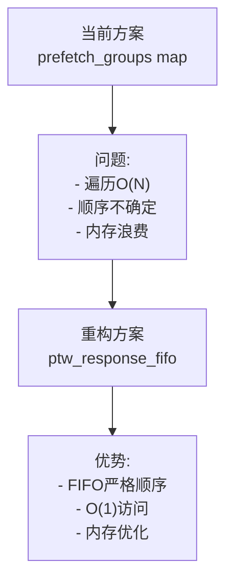

**图表来源**
- [PTW_MONITOR_ANALYSIS_20260609.md:140-377](file://PTW_MONITOR_ANALYSIS_20260609.md#L140-L377)

**章节来源**
- [PTW_MONITOR_ANALYSIS_20260609.md:1-377](file://PTW_MONITOR_ANALYSIS_20260609.md#L1-L377)

### 缓存性能评估：PT Cache与Walker Cache
- PT Cache访问模式：支持占位CL插入、去重HIT、预取HIT、批量更新等，用于评估在空间扫描与连续访问场景下的命中率与缓存压力。
- **更新**：Walker Cache命中：通过缓存根页表基址，显著降低PTW调用次数，提升整体吞吐。
- **新增**：预取功能评估：通过随机4KB两阶段测试验证预取在不同访问模式下的效果。

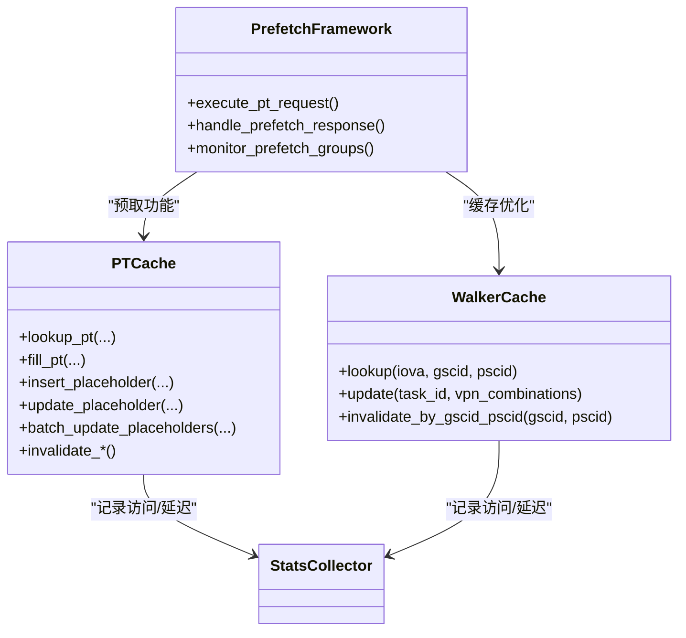

**图表来源**
- [pt_cache.cpp:11-371](file://iommu/cache_src/cache/pt_cache.cpp#L11-L371)
- [walker_cache.cpp:1-490](file://iommu/cache_src/cache/walker_cache.cpp#L1-L490)
- [stats_collector.h:107-196](file://iommu/cache_src/common/stats_collector.h#L107-L196)

**章节来源**
- [pt_cache.cpp:11-371](file://iommu/cache_src/cache/pt_cache.cpp#L11-L371)
- [walker_cache.cpp:1-490](file://iommu/cache_src/cache/walker_cache.cpp#L1-L490)
- [stats_collector.h:13-105](file://iommu/cache_src/common/stats_collector.h#L13-L105)

### PT Cache访问时序分析（50包，D=3）
该报告展示了在连续地址请求场景下，PT Cache的占位CL插入、去重HIT、预取HIT与批量更新失败的完整时序，以及由此引发的容量不足与替换策略缺失问题。

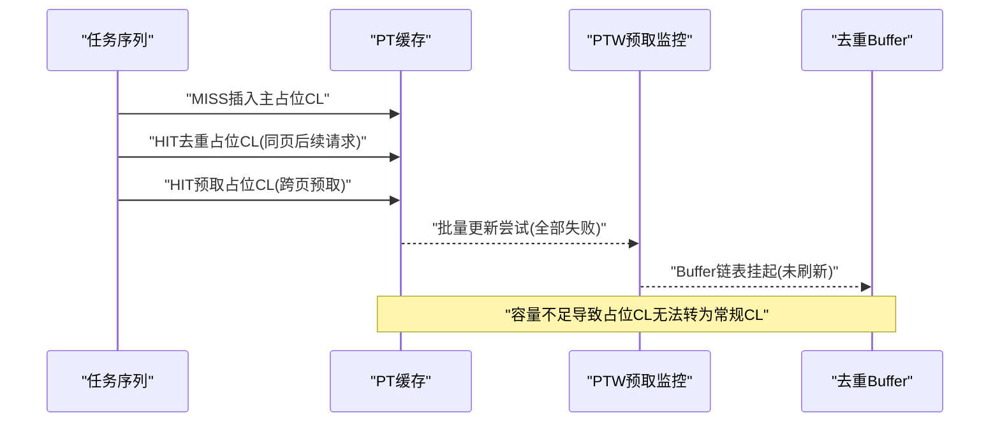

**图表来源**
- [PT_CACHE_ACCESS_ANALYSIS_50TASKS_20260609.md:23-275](file://PT_CACHE_ACCESS_ANALYSIS_50TASKS_20260609.md#L23-L275)

**章节来源**
- [PT_CACHE_ACCESS_ANALYSIS_50TASKS_20260609.md:1-411](file://PT_CACHE_ACCESS_ANALYSIS_50TASKS_20260609.md#L1-L411)

### 500请求地址翻译性能分析
该报告聚焦于500请求的地址翻译正确性与缓存性能，强调：
- PT Cache在空间扫描场景下命中率为0，符合预期
- **更新**：Walker Cache在共享根页表场景下命中率达91.8%，显著降低PTW开销
- PT Cache队列延时占比高，提示并发竞争与队列拥塞
- 修复Walker Cache缓存污染后，WALK FAULT清零

**章节来源**
- [CACHE_PERFORMANCE_ANALYSIS_500REQ.md:1-305](file://CACHE_PERFORMANCE_ANALYSIS_500REQ.md#L1-L305)

### IOMMU吞吐量与模块IOPS统计
通过日志解析与统计脚本，可精确计算各模块处理时间窗内的IOPS，区分端到端IOPS与模块内部IOPS，从而识别瓶颈模块。

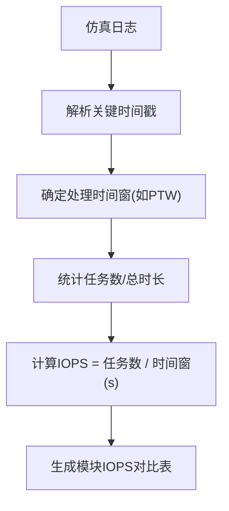

**图表来源**
- [extract_iops.sh:1-6](file://extract_iops.sh#L1-L6)

**章节来源**
- [extract_iops.sh:1-6](file://extract_iops.sh#L1-L6)

## 依赖关系分析
- 参数耦合：SLINK NoC延迟直接影响Collector与Forwarder之间的端到端延迟；PT Cache/Walker Cache命中率影响PTW触发频率。
- **更新**：Walker Cache与PTW线程存在条件依赖关系：Walker Cache命中时跳过相应层级的DDR访问。
- **新增**：PT Cache调度器与PTW线程的协作关系：UPDATE优先处理确保PT Cache状态一致性。
- 线程耦合：Collector依赖DC/PC缓存查询结果决定路由；PT Cache响应线程与PTW线程之间存在条件依赖（MISS触发PTW）。
- 统计耦合：StatsCollector为各缓存模块提供统一的统计接口，便于跨模块对比与归因分析。

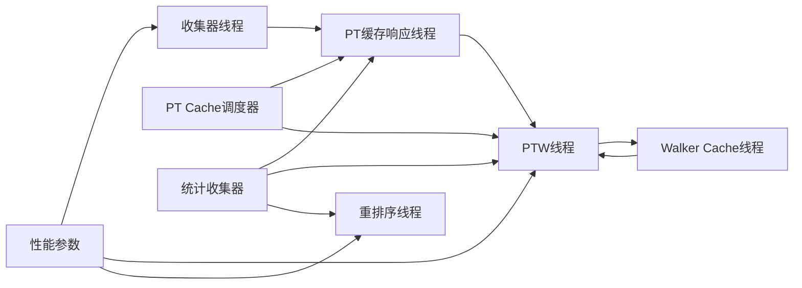

**图表来源**
- [cache_subsystem.cpp:311-478](file://iommu/cache_src/subsystem/cache_subsystem.cpp#L311-L478)
- [iommu_perf_params.hh:126-161](file://iommu/iommu_perf_model/iommu_perf_params.hh#L126-L161)
- [iommu_perf_collector.cc:14-275](file://iommu/iommu_perf_model/iommu_perf_collector.cc#L14-L275)
- [iommu_perf_pt_cache_response.cc:20-99](file://iommu/iommu_perf_model/iommu_perf_pt_cache_response.cc#L20-L99)
- [iommu_perf_ptw.cc:154-311](file://iommu/iommu_perf_model/iommu_perf_ptw.cc#L154-L311)
- [iommu_perf_reorder.cc:91-198](file://iommu/iommu_perf_model/iommu_perf_reorder.cc#L91-L198)
- [stats_collector.h:107-196](file://iommu/cache_src/common/stats_collector.h#L107-L196)

**章节来源**
- [cache_subsystem.cpp:311-478](file://iommu/cache_src/subsystem/cache_subsystem.cpp#L311-L478)
- [iommu_perf_params.hh:126-161](file://iommu/iommu_perf_model/iommu_perf_params.hh#L126-L161)
- [stats_collector.h:107-196](file://iommu/cache_src/common/stats_collector.h#L107-L196)

## 性能考量
- 延迟构成：执行延迟（Cache命中/miss处理）、排队延迟（FIFO积压）、DDR访问延迟（PTW/PTW预取）、NoC链路延迟（SLINK）。
- **更新**：Walker Cache优化效果：在重复访问场景下，可将DDR访问次数从3次降至0次，加速比可达40x。
- **新增**：PT Cache调度器优化：UPDATE优先处理机制避免了task超时问题，提升了系统稳定性。
- **新增**：预取功能优化：通过随机4KB两阶段测试验证预取在不同访问模式下的效果，D=3在随机访问模式下预期无效。
- 吞吐瓶颈：在高并发场景下，PT Cache队列与替换策略、PTW outstanding上限、Reorder输出带宽可能成为瓶颈。
- 缓存优化：扩大PT Cache容量、引入LRU替换策略、优化预取深度与边界检查、减少无效更新（如Walker Cache的valid校验）。

## 故障排查指南
- 功能正确性验证：使用test_1000req.sh与analyze_1000req.sh检查请求发送/接收数量、错误计数与命中率。
- **新增**：PT Cache调度器故障排查
  - 检查UPDATE优先处理机制是否正常工作
  - 验证pt_update_fifo和pt_request_fifo的处理顺序
  - 分析任务间隔统计信息识别性能瓶颈
- **新增**：随机4KB两阶段预取测试故障排查
  - 使用test_dedup_prefetch.sh验证去重和预取功能
  - 使用test_integration_dedup_prefetch.sh进行集成测试
  - 使用test_dedup_prefetch_unit.cpp进行单元功能验证
  - 使用prefetch_timing.sh分析预取时序和DDR访问
- **新增**：预取监控线程故障排查
  - 检查预取组管理中的竞态条件
  - 验证预取响应的顺序处理机制
  - 分析预取监控线程的性能瓶颈
- **新增**：Walker Cache故障排查
  - 使用`analyze_walker_cache_miss.py`分析miss根因
  - 使用`analyze_walker_miss_timing.py`分析miss时间序列
  - 检查`test_10pkts_walker.log`和`test_300pkts_walker_fix.log`中的Walker Cache日志
- 日志定位：通过analyze_iops_detailed.sh提取各模块时间窗，结合具体日志行号定位异常。
- 缓存问题：关注PT Cache容量超配、占位CL无法替换、批量更新失败、Buffer刷新未执行等问题。

**章节来源**
- [test_1000req.sh:1-226](file://test_1000req.sh#L1-L226)
- [cache_subsystem.cpp:311-478](file://iommu/cache_src/subsystem/cache_subsystem.cpp#L311-L478)
- [analyze_walker_cache_miss.py:1-148](file://analyze_walker_cache_miss.py#L1-L148)
- [analyze_walker_miss_timing.py:1-137](file://analyze_walker_miss_timing.py#L1-L137)
- [test_dedup_prefetch.sh:1-76](file://test_dedup_prefetch.sh#L1-L76)
- [test_integration_dedup_prefetch.sh:1-157](file://test_integration_dedup_prefetch.sh#L1-L157)
- [test_dedup_prefetch_unit.cpp:1-412](file://test_dedup_prefetch_unit.cpp#L1-L412)
- [prefetch_timing.sh:1-76](file://tmp/prefetch_timing.sh#L1-L76)

## 结论
- SLINK延迟阶梯测试可用于量化NoC链路延迟对IOMMU吞吐的影响，支撑带宽与延迟权衡决策。
- 在空间扫描场景下，PT Cache命中率低属预期；Walker Cache在共享根页表场景下表现优异，显著降低PTW开销。
- **更新**：Walker Cache在重复访问场景下可实现40x加速，但在高并发场景下可能出现hash冲突导致miss率上升。
- **新增**：PT Cache调度器性能测试结果验证了四个工作负载场景的成功，特别是解决了之前失败的4KB随机访问两阶段翻译场景中的任务超时问题。
- **新增**：PT Cache调度器的UPDATE优先处理机制有效避免了task看到旧placeholder导致的超时问题，提升了系统稳定性。
- **新增**：随机4KB两阶段预取测试框架提供了完整的预取功能验证环境，支持不同访问模式下的性能评估。
- **新增**：预取监控线程可靠性分析揭示了预取组管理的关键问题，重构方案显著提升了系统性能和稳定性。
- PT Cache容量不足与替换策略缺失是当前主要瓶颈，应优先扩容与引入LRU替换。
- **新增**：建议建立标准化的PT Cache调度器测试流程，包括UPDATE优先级验证和任务间隔分析。

## 附录

### 实验设计与数据采集清单
- 实验设计
  - 变量：SLINK NoC延迟、PT Cache容量/关联度、预取深度、Walker Cache开关
  - **更新**：Walker Cache配置参数（base_sets、ptw_c1/2/3配置）
  - **新增**：PT Cache调度器配置参数（UPDATE优先级、任务间隔阈值）
  - **新增**：预取深度（D=1,3,8）、访问模式（顺序/随机）、测试场景（500/5000请求）
  - 固定：请求模式（空间扫描/时间局部性）、页表模式（Sv39/Sv48）、并发度
- 数据采集
  - 日志字段：各模块时间戳、Cache命中/miss、PTW触发次数、Buffer刷新次数、错误/故障计数
  - **更新**：Walker Cache命中/miss详情、hit_level分布、miss时间序列
  - **新增**：PT Cache调度器任务间隔统计、UPDATE/REQUEST处理时序
  - **新增**：预取任务时序、DDR访问统计、Buffer峰值使用情况
  - 统计指标：命中率、平均/队列/执行延迟、IOPS（模块/端到端）、稳态窗口IOPS
- 统计分析
  - 使用analyze_iops_detailed.sh与analyze_1000req.sh进行自动化统计与报告生成
  - **新增**：使用print_pt_scheduler_gap_report()分析PT Cache调度器性能
  - **新增**：使用prefetch_timing.sh进行预取时序分析
  - **新增**：使用test_dedup_prefetch.sh和test_integration_dedup_prefetch.sh进行预取功能验证
  - **新增**：使用analyze_walker_cache_miss.py和analyze_walker_miss_timing.py进行Walker Cache专项分析

**章节来源**
- [cache_subsystem.cpp:311-478](file://iommu/cache_src/subsystem/cache_subsystem.cpp#L311-L478)
- [analyze_walker_cache_miss.py:1-148](file://analyze_walker_cache_miss.py#L1-L148)
- [analyze_walker_miss_timing.py:1-137](file://analyze_walker_miss_timing.py#L1-L137)
- [prefetch_timing.sh:1-76](file://tmp/prefetch_timing.sh#L1-L76)
- [test_dedup_prefetch.sh:1-76](file://test_dedup_prefetch.sh#L1-L76)
- [test_integration_dedup_prefetch.sh:1-157](file://test_integration_dedup_prefetch.sh#L1-L157)

### 关键指标解读方法
- PT Cache命中率：区分常规CL与占位CL，关注去重与预取对命中率的贡献
- **更新**：Walker Cache命中率：关注共享根页表带来的收益，评估预取深度对命中率的影响
- **新增**：PT Cache调度器性能指标：任务间隔统计、UPDATE优先级处理效率、任务完成率
- **新增**：预取效果评估：通过随机4KB两阶段测试验证预取在不同访问模式下的有效性
- **新增**：预取时序分析：通过prefetch_timing.sh提取预取任务的DDR访问时序和延迟统计
- **新增**：预取监控可靠性：分析预取监控线程的处理效率和顺序保证机制
- **新增**：Walker Cache miss根因：区分冷启动miss、hash冲突miss、跨边界miss
- PTW IOPS：仅统计PT Cache MISS的PTW任务，避免被高命中率稀释
- 稳态IOPS：剔除启动/收敛阶段，关注中间80%稳定段

**章节来源**
- [CACHE_PERFORMANCE_ANALYSIS_500REQ.md:145-179](file://CACHE_PERFORMANCE_ANALYSIS_500REQ.md#L145-L179)
- [PT_CACHE_ACCESS_ANALYSIS_50TASKS_20260609.md:322-345](file://PT_CACHE_ACCESS_ANALYSIS_50TASKS_20260609.md#L322-L345)
- [cache_subsystem.cpp:368-478](file://iommu/cache_src/subsystem/cache_subsystem.cpp#L368-L478)
- [analyze_walker_cache_miss.py:105-140](file://analyze_walker_cache_miss.py#L105-L140)
- [PTW_MONITOR_ANALYSIS_20260609.md:356-377](file://PTW_MONITOR_ANALYSIS_20260609.md#L356-L377)

### 性能优化建议与最佳实践
- 缓存容量与替换
  - 扩大PT Cache容量，缓解超配导致的批量更新失败
  - 引入LRU替换策略，允许占位CL→常规CL转换后替换
  - **更新**：优化Walker Cache hash函数，减少hash冲突
- 预取与去重
  - **新增**：合理设置预取深度，避免在随机访问模式下造成额外开销
  - **新增**：实现高效的预取监控线程，确保预取响应的顺序处理
  - 保证valid校验，避免缓存污染
- 并发与流水
  - 控制PTW outstanding上限，避免背压
  - 优化Reorder输出带宽与排队策略，减少端到端延迟
  - **新增**：优化PT Cache调度器UPDATE优先级阈值，平衡UPDATE和REQUEST处理效率
- **新增**：PT Cache调度器优化策略
  - 监控任务间隔统计，识别调度器性能瓶颈
  - 调整UPDATE优先处理策略，避免REQUEST饥饿
  - 实现动态优先级调整，根据负载特征自适应优化
- **新增**：Walker Cache优化策略
  - 根据miss根因调整cache大小和替换策略
  - 实现智能hash函数以减少冲突
  - 增加miss监控和预警机制
- **新增**：预取功能优化策略
  - 根据访问模式选择合适的预取深度
  - 实现智能的预取组管理，避免内存浪费和性能下降
  - 增强预取监控线程的可靠性，确保系统稳定性

**章节来源**
- [PT_CACHE_ACCESS_ANALYSIS_50TASKS_20260609.md:278-320](file://PT_CACHE_ACCESS_ANALYSIS_50TASKS_20260609.md#L278-L320)
- [CACHE_PERFORMANCE_ANALYSIS_500REQ.md:221-259](file://CACHE_PERFORMANCE_ANALYSIS_500REQ.md#L221-259)
- [WALKER_CACHE_INTEGRATION_PLAN.md:692-700](file://WALKER_CACHE_INTEGRATION_PLAN.md#L692-L700)
- [analyze_walker_cache_miss.py:129-134](file://analyze_walker_cache_miss.py#L129-L134)
- [PTW_MONITOR_ANALYSIS_20260609.md:340-353](file://PTW_MONITOR_ANALYSIS_20260609.md#L340-L353)
- [cache_subsystem.cpp:311-478](file://iommu/cache_src/subsystem/cache_subsystem.cpp#L311-L478)