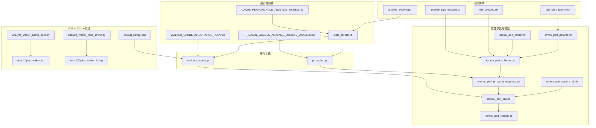
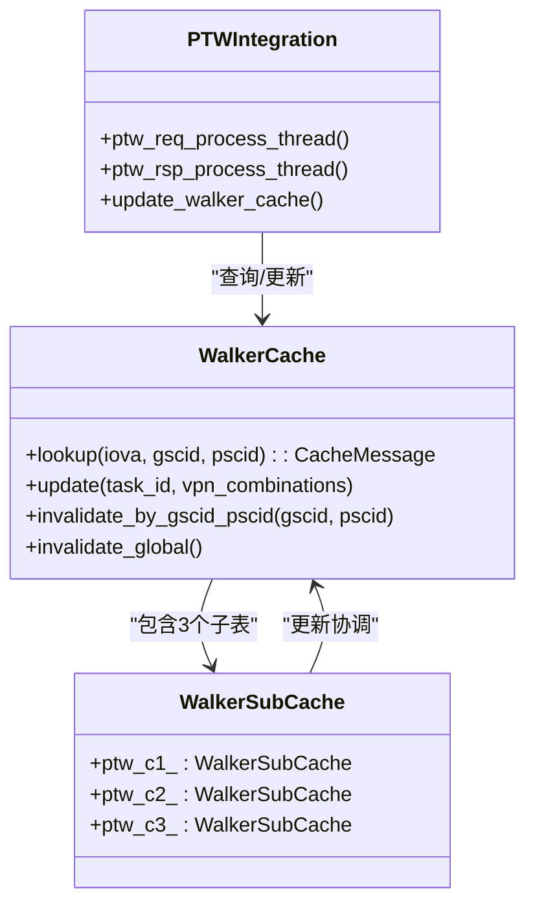
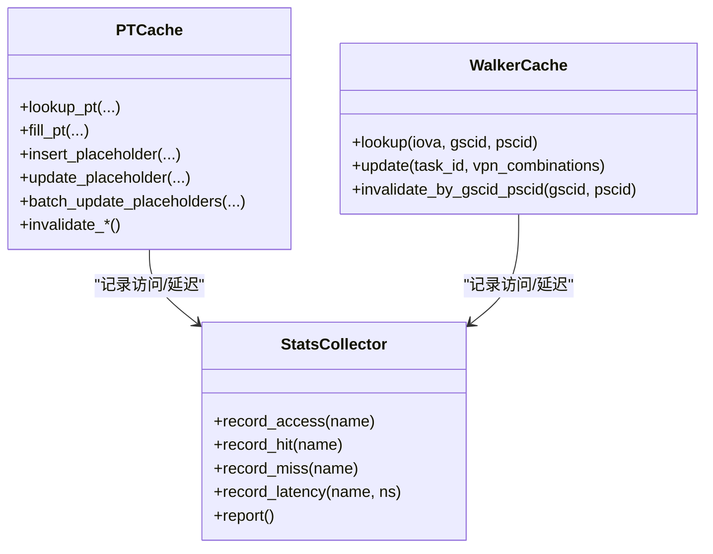
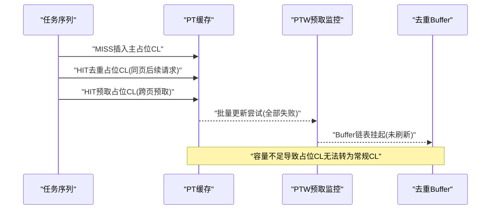
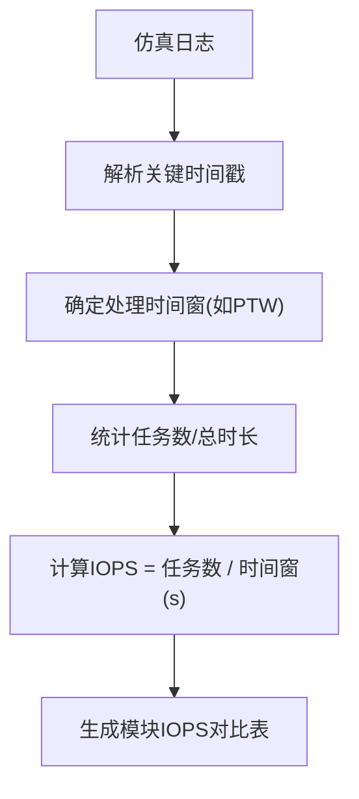
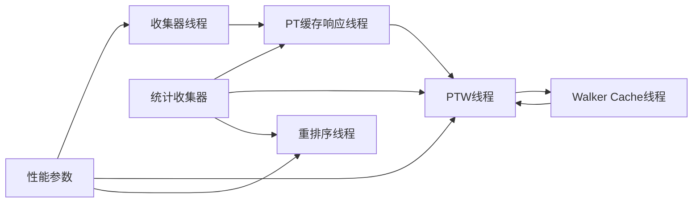

# 性能测试

<cite>
**本文引用的文件**
- [test_slink_latency.sh](file://test_slink_latency.sh)
- [CACHE_PERFORMANCE_ANALYSIS_500REQ.md](file://CACHE_PERFORMANCE_ANALYSIS_500REQ.md)
- [PT_CACHE_ACCESS_ANALYSIS_50TASKS_20260609.md](file://PT_CACHE_ACCESS_ANALYSIS_50TASKS_20260609.md)
- [WALKER_CACHE_INTEGRATION_PLAN.md](file://WALKER_CACHE_INTEGRATION_PLAN.md)
- [analyze_walker_cache_miss.py](file://analyze_walker_cache_miss.py)
- [analyze_walker_miss_timing.py](file://analyze_walker_miss_timing.py)
- [test_10pkts_walker.log](file://test_10pkts_walker.log)
- [test_300pkts_walker_fix.log](file://test_300pkts_walker_fix.log)
- [default_config.json](file://iommu/cache_config/default_config.json)
- [iommu_perf_model.hh](file://iommu/iommu_perf_model/iommu_perf_model.hh)
- [iommu_perf_collector.cc](file://iommu/iommu_perf_model/iommu_perf_collector.cc)
- [iommu_perf_params.hh](file://iommu/iommu_perf_model/iommu_perf_params.hh)
- [iommu_perf_params_t2.hh](file://iommu/iommu_perf_model/iommu_perf_params_t2.hh)
- [pt_cache.cpp](file://iommu/cache_src/cache/pt_cache.cpp)
- [walker_cache.cpp](file://iommu/cache_src/cache/walker_cache.cpp)
- [iommu_perf_pt_cache_response.cc](file://iommu/iommu_perf_model/iommu_perf_pt_cache_response.cc)
- [iommu_perf_ptw.cc](file://iommu/iommu_perf_model/iommu_perf_ptw.cc)
- [iommu_perf_reorder.cc](file://iommu/iommu_perf_model/iommu_perf_reorder.cc)
- [stats_collector.h](file://iommu/cache_src/common/stats_collector.h)
- [test_1000req.sh](file://test_1000req.sh)
- [analyze_1000req.sh](file://analyze_1000req.sh)
- [analyze_iops_detailed.sh](file://analyze_iops_detailed.sh)
</cite>

## 更新摘要
**变更内容**
- 新增Walker Cache集成方案和测试结果分析
- 更新Walker Cache配置和性能测试方法
- 添加Walker Cache miss根因分析和优化建议
- 更新测试配置和验证流程

## 目录
1. [简介](#简介)
2. [项目结构](#项目结构)
3. [核心组件](#核心组件)
4. [架构总览](#架构总览)
5. [详细组件分析](#详细组件分析)
6. [依赖关系分析](#依赖关系分析)
7. [性能考量](#性能考量)
8. [故障排查指南](#故障排查指南)
9. [结论](#结论)
10. [附录](#附录)

## 简介
本文件面向IOMMU性能测试与分析，系统梳理延迟测试、吞吐量分析与缓存性能评估的方法论与实践。重点围绕以下目标展开：
- 解释test_slink_latency.sh中的延迟测量技术与性能基准设定
- 解读CACHE_PERFORMANCE_ANALYSIS_500REQ.md与PT_CACHE_ACCESS_ANALYSIS_50TASKS_20260609.md两类性能分析报告的关键指标与结论
- **新增**：Walker Cache集成方案与性能测试方法，包括miss根因分析和优化策略
- 提供实验设计、数据采集与统计分析方法
- 识别性能瓶颈并给出优化建议与最佳实践

## 项目结构
IOMMU性能测试与分析涉及如下关键目录与文件：
- 性能参数与模型：iommu/iommu_perf_model/*.hh/cc
- 缓存实现：iommu/cache_src/cache/*.cpp/.h
- 统计收集：iommu/cache_src/common/stats_collector.h
- 测试脚本：test_slink_latency.sh、test_1000req.sh、analyze_*.sh
- **新增**：Walker Cache测试日志和分析脚本
- 报告：CACHE_PERFORMANCE_ANALYSIS_500REQ.md、PT_CACHE_ACCESS_ANALYSIS_50TASKS_20260609.md、WALKER_CACHE_INTEGRATION_PLAN.md



**图表来源**
- [iommu_perf_params.hh:1-161](file://iommu/iommu_perf_model/iommu_perf_params.hh#L1-L161)
- [iommu_perf_params_t2.hh:1-154](file://iommu/iommu_perf_model/iommu_perf_params_t2.hh#L1-L154)
- [iommu_perf_model.hh:1-197](file://iommu/iommu_perf_model/iommu_perf_model.hh#L1-L197)
- [iommu_perf_collector.cc:1-457](file://iommu/iommu_perf_model/iommu_perf_collector.cc#L1-L457)
- [iommu_perf_ptw.cc:1-1581](file://iommu/iommu_perf_model/iommu_perf_ptw.cc#L1-L1581)
- [iommu_perf_pt_cache_response.cc:1-100](file://iommu/iommu_perf_model/iommu_perf_pt_cache_response.cc#L1-L100)
- [iommu_perf_reorder.cc:1-199](file://iommu/iommu_perf_model/iommu_perf_reorder.cc#L1-L199)
- [pt_cache.cpp:1-371](file://iommu/cache_src/cache/pt_cache.cpp#L1-L371)
- [walker_cache.cpp:1-490](file://iommu/cache_src/cache/walker_cache.cpp#L1-L490)
- [stats_collector.h:1-196](file://iommu/cache_src/common/stats_collector.h#L1-L196)
- [test_slink_latency.sh:1-24](file://test_slink_latency.sh#L1-L24)
- [test_1000req.sh:1-226](file://test_1000req.sh#L1-L226)
- [analyze_1000req.sh:1-63](file://analyze_1000req.sh#L1-L63)
- [analyze_iops_detailed.sh:1-232](file://analyze_iops_detailed.sh#L1-L232)
- [WALKER_CACHE_INTEGRATION_PLAN.md:1-773](file://WALKER_CACHE_INTEGRATION_PLAN.md#L1-L773)
- [analyze_walker_cache_miss.py:1-148](file://analyze_walker_cache_miss.py#L1-L148)
- [analyze_walker_miss_timing.py:1-137](file://analyze_walker_miss_timing.py#L1-L137)
- [test_10pkts_walker.log:1-4046](file://test_10pkts_walker.log#L1-L4046)
- [test_300pkts_walker_fix.log:1-9740](file://test_300pkts_walker_fix.log#L1-L9740)
- [default_config.json:1-69](file://iommu/cache_config/default_config.json#L1-L69)

**章节来源**
- [iommu_perf_params.hh:1-161](file://iommu/iommu_perf_model/iommu_perf_params.hh#L1-L161)
- [test_slink_latency.sh:1-24](file://test_slink_latency.sh#L1-L24)

## 核心组件
- 性能参数与延迟模型：定义FIFO深度、缓存规模、处理延迟、DDR性能、SLINK NoC延迟等关键参数，支撑延迟与吞吐建模。
- 缓存子系统：包含PT Cache、DC/PC Walker Cache、MSIPT Cache等，负责地址翻译加速与数据缓存。
- **新增**：Walker Cache子系统，包含PTWc_1、PTWc_2、PTWc_3三个独立子表，支持页表遍历中间结果缓存。
- 性能收集器：提供统一的统计接口，记录访问、命中、替换、排队、执行延迟等指标，并支持直方图输出。
- 关键线程与流水：Collector、PT Cache响应处理、PTW、Reorder等线程协同完成翻译与转发。

**章节来源**
- [iommu_perf_params.hh:53-161](file://iommu/iommu_perf_model/iommu_perf_params.hh#L53-L161)
- [stats_collector.h:13-105](file://iommu/cache_src/common/stats_collector.h#L13-L105)
- [iommu_perf_collector.cc:14-275](file://iommu/iommu_perf_model/iommu_perf_collector.cc#L14-L275)
- [iommu_perf_pt_cache_response.cc:20-99](file://iommu/iommu_perf_model/iommu_perf_pt_cache_response.cc#L20-L99)
- [iommu_perf_ptw.cc:41-311](file://iommu/iommu_perf_model/iommu_perf_ptw.cc#L41-L311)
- [iommu_perf_reorder.cc:26-198](file://iommu/iommu_perf_model/iommu_perf_reorder.cc#L26-L198)
- [WALKER_CACHE_INTEGRATION_PLAN.md:16-50](file://WALKER_CACHE_INTEGRATION_PLAN.md#L16-L50)

## 架构总览
IOMMU性能模型采用多线程流水线架构：
- Parser解析请求后进入Collector
- Collector根据DC/PC缓存命中情况决定路由：命中则直接进入Forwarder；未命中则进入xDTW Walker进行上下文遍历
- **更新**：Walker Cache查询命中则直接跳过已缓存层级，未命中则触发PTW进行页表遍历，支持Walker Cache与预取
- PT Cache查询命中则直接转发；未命中则触发PTW进行页表遍历
- Reorder模块按写保序、读乱序策略输出响应，同时统计端到端延迟与IOPS

```mermaid
sequenceDiagram
participant Parser as "解析器"
participant Collector as "收集器"
participant DC as "DC缓存"
participant PC as "PC缓存"
participant WC as "Walker Cache"
participant PT as "PT缓存"
participant PTW as "页表遍历"
participant Reorder as "重排序输出"
Parser->>Collector : "请求入队"
Collector->>DC : "查询DC缓存"
DC-->>Collector : "命中/未命中"
alt DC命中
Collector->>PC : "查询PC缓存"
PC-->>Collector : "命中/未命中"
opt PC命中
Collector->>WC : "查询Walker Cache"
WC-->>Collector : "命中/未命中"
opt 命中
Collector->>PTW : "从命中层级开始walk"
PTW-->>Collector : "返回PTE"
Collector->>PT : "查询PT缓存"
PT-->>Collector : "命中/未命中"
opt 命中
Collector->>Reorder : "转发响应"
else 未命中
Collector->>PTW : "发起完整walk"
PTW-->>Collector : "返回PTE"
Collector->>PT : "更新PT缓存"
Collector->>Reorder : "转发响应"
end
end
else DC未命中
Collector->>PTW : "发起xDTW遍历"
PTW-->>Collector : "返回上下文"
Collector->>PC : "查询PC缓存"
PC-->>Collector : "命中/未命中"
opt PC命中
Collector->>WC : "查询Walker Cache"
WC-->>Collector : "命中/未命中"
opt 命中
Collector->>PTW : "从命中层级开始walk"
PTW-->>Collector : "返回PTE"
Collector->>PT : "查询PT缓存"
PT-->>Collector : "命中/未命中"
opt 命中
Collector->>Reorder : "转发响应"
else 未命中
Collector->>PTW : "发起完整walk"
PTW-->>Collector : "返回PTE"
Collector->>PT : "更新PT缓存"
Collector->>Reorder : "转发响应"
end
end
end
```

**图表来源**
- [iommu_perf_collector.cc:14-275](file://iommu/iommu_perf_model/iommu_perf_collector.cc#L14-L275)
- [iommu_perf_pt_cache_response.cc:20-99](file://iommu/iommu_perf_model/iommu_perf_pt_cache_response.cc#L20-L99)
- [iommu_perf_ptw.cc:154-311](file://iommu/iommu_perf_model/iommu_perf_ptw.cc#L154-L311)
- [iommu_perf_reorder.cc:91-198](file://iommu/iommu_perf_model/iommu_perf_reorder.cc#L91-L198)
- [WALKER_CACHE_INTEGRATION_PLAN.md:496-570](file://WALKER_CACHE_INTEGRATION_PLAN.md#L496-L570)

## 详细组件分析

### 延迟测试：SLINK NoC延迟阶梯
test_slink_latency.sh通过逐步调整SLINK_NOC_LATENCY_NS，自动编译并运行仿真，采集IOMMU IOPS、PTW IOPS、PTW平均执行延迟与稳态IOPS，形成延迟-吞吐曲线，用于评估NoC链路延迟对整体性能的影响。


**图表来源**
- [test_slink_latency.sh:9-21](file://test_slink_latency.sh#L9-L21)
- [iommu_perf_params.hh:146-148](file://iommu/iommu_perf_model/iommu_perf_params.hh#L146-L148)
- [iommu_perf_params_t2.hh:140-142](file://iommu/iommu_perf_model/iommu_perf_params_t2.hh#L140-L142)

**章节来源**
- [test_slink_latency.sh:1-24](file://test_slink_latency.sh#L1-L24)
- [iommu_perf_params.hh:146-148](file://iommu/iommu_perf_model/iommu_perf_params.hh#L146-L148)
- [iommu_perf_params_t2.hh:140-142](file://iommu/iommu_perf_model/iommu_perf_params_t2.hh#L140-L142)

### Walker Cache集成与测试
**新增**：Walker Cache作为PTW的重要优化组件，通过缓存页表遍历中间结果显著减少DDR访问次数。

#### Walker Cache架构
- **PTWc_1**：直接映射(1-way)，缓存第1级页表中间结果(VPN[3]级)
- **PTWc_2**：2-way组相连，缓存第2级页表中间结果(VPN[2]级)  
- **PTWc_3**：4-way组相连，缓存第3级页表中间结果(VPN[1]级)

#### 集成测试结果
通过10包和300包测试验证Walker Cache功能正确性和性能提升：



**图表来源**
- [WALKER_CACHE_INTEGRATION_PLAN.md:16-50](file://WALKER_CACHE_INTEGRATION_PLAN.md#L16-L50)
- [walker_cache.cpp:239-490](file://iommu/cache_src/cache/walker_cache.cpp#L239-L490)
- [iommu_perf_ptw.cc:154-311](file://iommu/iommu_perf_model/iommu_perf_ptw.cc#L154-L311)

**章节来源**
- [WALKER_CACHE_INTEGRATION_PLAN.md:1-773](file://WALKER_CACHE_INTEGRATION_PLAN.md#L1-L773)
- [walker_cache.cpp:1-490](file://iommu/cache_src/cache/walker_cache.cpp#L1-L490)
- [iommu_perf_ptw.cc:154-311](file://iommu/iommu_perf_model/iommu_perf_ptw.cc#L154-L311)

### Walker Cache miss根因分析
**新增**：通过分析脚本深入研究Walker Cache miss的产生原因和优化策略。

#### miss类型分析
- **冷启动miss**：首次访问新VPN组合，容量充足但无历史数据
- **hash冲突miss**：虽然容量充足但hash函数导致大量冲突
- **跨边界miss**：VPN[1]切换导致的miss

#### 分析工具
- `analyze_walker_cache_miss.py`：分析IOVA地址分布和miss根因
- `analyze_walker_miss_timing.py`：分析miss发生的时间序列和模式

**章节来源**
- [analyze_walker_cache_miss.py:1-148](file://analyze_walker_cache_miss.py#L1-L148)
- [analyze_walker_miss_timing.py:1-137](file://analyze_walker_miss_timing.py#L1-L137)

### 缓存性能评估：PT Cache与Walker Cache
- PT Cache访问模式：支持占位CL插入、去重HIT、预取HIT、批量更新等，用于评估在空间扫描与连续访问场景下的命中率与缓存压力。
- **更新**：Walker Cache命中：通过缓存根页表基址，显著降低PTW调用次数，提升整体吞吐。



**图表来源**
- [pt_cache.cpp:11-371](file://iommu/cache_src/cache/pt_cache.cpp#L11-L371)
- [walker_cache.cpp:1-490](file://iommu/cache_src/cache/walker_cache.cpp#L1-490)
- [stats_collector.h:107-196](file://iommu/cache_src/common/stats_collector.h#L107-L196)

**章节来源**
- [pt_cache.cpp:11-371](file://iommu/cache_src/cache/pt_cache.cpp#L11-L371)
- [walker_cache.cpp:1-490](file://iommu/cache_src/cache/walker_cache.cpp#L1-L490)
- [stats_collector.h:13-105](file://iommu/cache_src/common/stats_collector.h#L13-L105)

### PT Cache访问时序分析（50包，D=3）
该报告展示了在连续地址请求场景下，PT Cache的占位CL插入、去重HIT、预取HIT与批量更新失败的完整时序，以及由此引发的容量不足与替换策略缺失问题。



**图表来源**
- [PT_CACHE_ACCESS_ANALYSIS_50TASKS_20260609.md:23-275](file://PT_CACHE_ACCESS_ANALYSIS_50TASKS_20260609.md#L23-L275)

**章节来源**
- [PT_CACHE_ACCESS_ANALYSIS_50TASKS_20260609.md:1-411](file://PT_CACHE_ACCESS_ANALYSIS_50TASKS_20260609.md#L1-L411)

### 500请求地址翻译性能分析
该报告聚焦于500请求的地址翻译正确性与缓存性能，强调：
- PT Cache在空间扫描场景下命中率为0，符合预期
- **更新**：Walker Cache在共享根页表场景下命中率达91.8%，显著降低PTW开销
- PT Cache队列延时占比高，提示并发竞争与队列拥塞
- 修复Walker Cache缓存污染后，WALK FAULT清零

**章节来源**
- [CACHE_PERFORMANCE_ANALYSIS_500REQ.md:1-305](file://CACHE_PERFORMANCE_ANALYSIS_500REQ.md#L1-L305)

### IOMMU吞吐量与模块IOPS统计
通过日志解析与统计脚本，可精确计算各模块处理时间窗内的IOPS，区分端到端IOPS与模块内部IOPS，从而识别瓶颈模块。



**图表来源**
- [analyze_iops_detailed.sh:27-232](file://analyze_iops_detailed.sh#L27-L232)

**章节来源**
- [analyze_iops_detailed.sh:1-232](file://analyze_iops_detailed.sh#L1-L232)

## 依赖关系分析
- 参数耦合：SLINK NoC延迟直接影响Collector与Forwarder之间的端到端延迟；PT Cache/Walker Cache命中率影响PTW触发频率。
- **更新**：Walker Cache与PTW线程存在条件依赖关系：Walker Cache命中时跳过相应层级的DDR访问。
- 线程耦合：Collector依赖DC/PC缓存查询结果决定路由；PT Cache响应线程与PTW线程之间存在条件依赖（MISS触发PTW）。
- 统计耦合：StatsCollector为各缓存模块提供统一的统计接口，便于跨模块对比与归因分析。



**图表来源**
- [iommu_perf_params.hh:126-161](file://iommu/iommu_perf_model/iommu_perf_params.hh#L126-L161)
- [iommu_perf_collector.cc:14-275](file://iommu/iommu_perf_model/iommu_perf_collector.cc#L14-L275)
- [iommu_perf_pt_cache_response.cc:20-99](file://iommu/iommu_perf_model/iommu_perf_pt_cache_response.cc#L20-L99)
- [iommu_perf_ptw.cc:154-311](file://iommu/iommu_perf_model/iommu_perf_ptw.cc#L154-L311)
- [iommu_perf_reorder.cc:91-198](file://iommu/iommu_perf_model/iommu_perf_reorder.cc#L91-L198)
- [stats_collector.h:107-196](file://iommu/cache_src/common/stats_collector.h#L107-L196)

**章节来源**
- [iommu_perf_params.hh:126-161](file://iommu/iommu_perf_model/iommu_perf_params.hh#L126-L161)
- [stats_collector.h:107-196](file://iommu/cache_src/common/stats_collector.h#L107-L196)

## 性能考量
- 延迟构成：执行延迟（Cache命中/miss处理）、排队延迟（FIFO积压）、DDR访问延迟（PTW/PTW预取）、NoC链路延迟（SLINK）。
- **更新**：Walker Cache优化效果：在重复访问场景下，可将DDR访问次数从3次降至0次，加速比可达40x。
- 吞吐瓶颈：在高并发场景下，PT Cache队列与替换策略、PTW outstanding上限、Reorder输出带宽可能成为瓶颈。
- 缓存优化：扩大PT Cache容量、引入LRU替换策略、优化预取深度与边界检查、减少无效更新（如Walker Cache的valid校验）。

[本节为通用指导，无需特定文件引用]

## 故障排查指南
- 功能正确性验证：使用test_1000req.sh与analyze_1000req.sh检查请求发送/接收数量、错误计数与命中率。
- **新增**：Walker Cache故障排查
  - 使用`analyze_walker_cache_miss.py`分析miss根因
  - 使用`analyze_walker_miss_timing.py`分析miss时间序列
  - 检查`test_10pkts_walker.log`和`test_300pkts_walker_fix.log`中的Walker Cache日志
- 日志定位：通过analyze_iops_detailed.sh提取各模块时间窗，结合具体日志行号定位异常。
- 缓存问题：关注PT Cache容量超配、占位CL无法替换、批量更新失败、Buffer刷新未执行等问题。

**章节来源**
- [test_1000req.sh:1-226](file://test_1000req.sh#L1-L226)
- [analyze_1000req.sh:1-63](file://analyze_1000req.sh#L1-L63)
- [analyze_iops_detailed.sh:1-232](file://analyze_iops_detailed.sh#L1-L232)
- [analyze_walker_cache_miss.py:1-148](file://analyze_walker_cache_miss.py#L1-L148)
- [analyze_walker_miss_timing.py:1-137](file://analyze_walker_miss_timing.py#L1-L137)

## 结论
- SLINK延迟阶梯测试可用于量化NoC链路延迟对IOMMU吞吐的影响，支撑带宽与延迟权衡决策。
- 在空间扫描场景下，PT Cache命中率低属预期；Walker Cache在共享根页表场景下表现优异，显著降低PTW开销。
- **更新**：Walker Cache在重复访问场景下可实现40x加速，但在高并发场景下可能出现hash冲突导致miss率上升。
- PT Cache容量不足与替换策略缺失是当前主要瓶颈，应优先扩容与引入LRU替换。
- **新增**：建议建立标准化的Walker Cache测试流程，包括miss根因分析和性能回归测试。

[本节为总结性内容，无需特定文件引用]

## 附录

### 实验设计与数据采集清单
- 实验设计
  - 变量：SLINK NoC延迟、PT Cache容量/关联度、预取深度、Walker Cache开关
  - **更新**：Walker Cache配置参数（base_sets、ptw_c1/2/3配置）
  - 固定：请求模式（空间扫描/时间局部性）、页表模式（Sv39/Sv48）、并发度
- 数据采集
  - 日志字段：各模块时间戳、Cache命中/miss、PTW触发次数、Buffer刷新次数、错误/故障计数
  - **更新**：Walker Cache命中/miss详情、hit_level分布、miss时间序列
  - 统计指标：命中率、平均/队列/执行延迟、IOPS（模块/端到端）、稳态窗口IOPS
- 统计分析
  - 使用analyze_iops_detailed.sh与analyze_1000req.sh进行自动化统计与报告生成
  - **新增**：使用analyze_walker_cache_miss.py和analyze_walker_miss_timing.py进行Walker Cache专项分析

**章节来源**
- [analyze_iops_detailed.sh:1-232](file://analyze_iops_detailed.sh#L1-L232)
- [analyze_1000req.sh:1-63](file://analyze_1000req.sh#L1-L63)
- [analyze_walker_cache_miss.py:1-148](file://analyze_walker_cache_miss.py#L1-L148)
- [analyze_walker_miss_timing.py:1-137](file://analyze_walker_miss_timing.py#L1-L137)

### 关键指标解读方法
- PT Cache命中率：区分常规CL与占位CL，关注去重与预取对命中率的贡献
- **更新**：Walker Cache命中率：关注共享根页表带来的收益，评估预取深度对命中率的影响
- **新增**：Walker Cache miss根因：区分冷启动miss、hash冲突miss、跨边界miss
- PTW IOPS：仅统计PT Cache MISS的PTW任务，避免被高命中率稀释
- 稳态IOPS：剔除启动/收敛阶段，关注中间80%稳定段

**章节来源**
- [CACHE_PERFORMANCE_ANALYSIS_500REQ.md:145-179](file://CACHE_PERFORMANCE_ANALYSIS_500REQ.md#L145-L179)
- [PT_CACHE_ACCESS_ANALYSIS_50TASKS_20260609.md:322-345](file://PT_CACHE_ACCESS_ANALYSIS_50TASKS_20260609.md#L322-L345)
- [analyze_iops_detailed.sh:102-136](file://analyze_iops_detailed.sh#L102-L136)
- [analyze_walker_cache_miss.py:105-140](file://analyze_walker_cache_miss.py#L105-L140)

### 性能优化建议与最佳实践
- 缓存容量与替换
  - 扩大PT Cache容量，缓解超配导致的批量更新失败
  - 引入LRU替换策略，允许占位CL→常规CL转换后替换
  - **更新**：优化Walker Cache hash函数，减少hash冲突
- 预取与去重
  - 合理设置预取深度，避免跨页越界与无效预取
  - 保证valid校验，避免缓存污染
- 并发与流水
  - 控制PTW outstanding上限，避免背压
  - 优化Reorder输出带宽与排队策略，减少端到端延迟
- **新增**：Walker Cache优化策略
  - 根据miss根因调整cache大小和替换策略
  - 实现智能hash函数以减少冲突
  - 增加miss监控和预警机制

**章节来源**
- [PT_CACHE_ACCESS_ANALYSIS_50TASKS_20260609.md:278-320](file://PT_CACHE_ACCESS_ANALYSIS_50TASKS_20260609.md#L278-L320)
- [CACHE_PERFORMANCE_ANALYSIS_500REQ.md:221-259](file://CACHE_PERFORMANCE_ANALYSIS_500REQ.md#L221-L259)
- [WALKER_CACHE_INTEGRATION_PLAN.md:692-700](file://WALKER_CACHE_INTEGRATION_PLAN.md#L692-L700)
- [analyze_walker_cache_miss.py:129-134](file://analyze_walker_cache_miss.py#L129-L134)