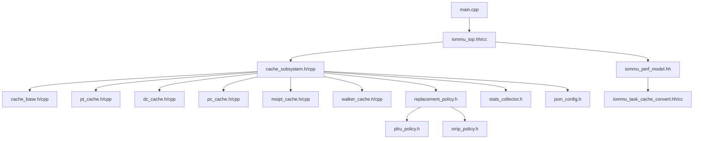
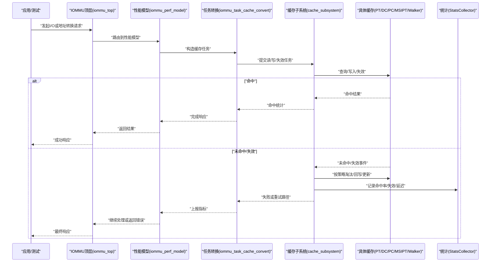
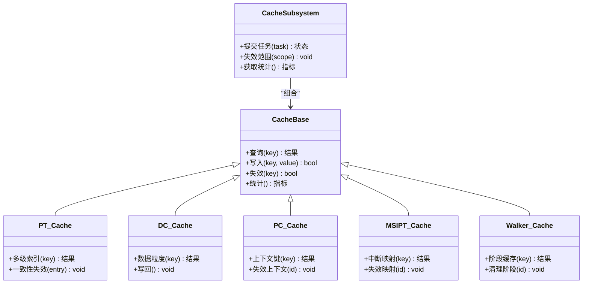
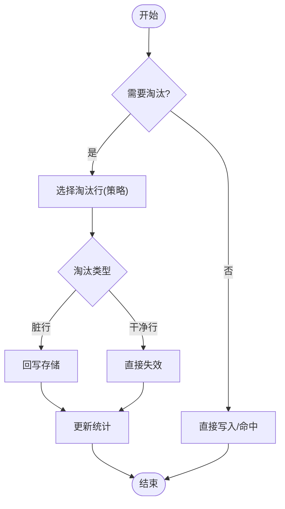
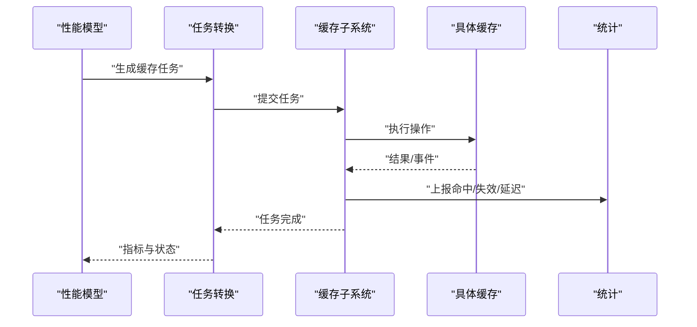
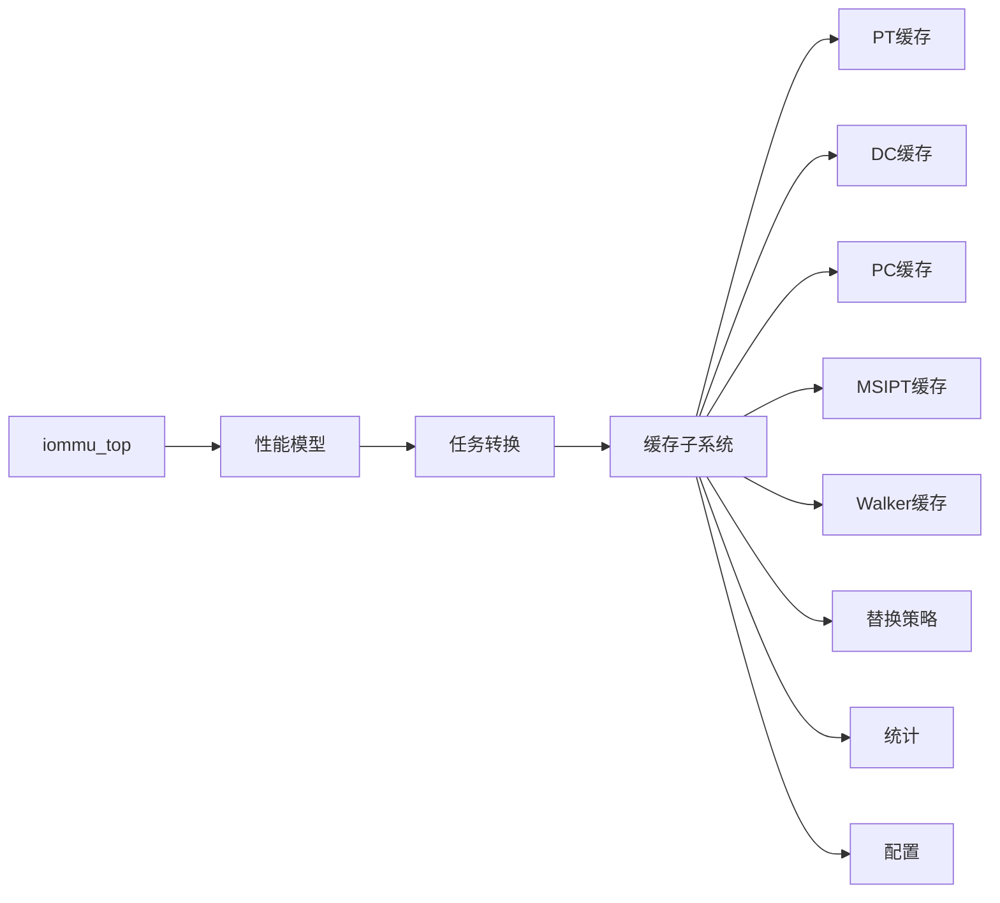

# 场景10缓存失效测试场景

<cite>
**本文引用的文件**   
- [README.md](file://README.md)
- [main.cpp](file://main.cpp)
- [Makefile](file://Makefile)
- [iommu_top.cc](file://iommu/iommu_top.cc)
- [iommu_top.hh](file://iommu/iommu_top.hh)
- [cache_subsystem.h](file://iommu/cache_src/subsystem/cache_subsystem.h)
- [cache_subsystem.cpp](file://iommu/cache_src/subsystem/cache_subsystem.cpp)
- [cache_base.h](file://iommu/cache_src/cache/cache_base.h)
- [cache_base.cpp](file://iommu/cache_src/cache/cache_base.cpp)
- [pt_cache.h](file://iommu/cache_src/cache/pt_cache.h)
- [pt_cache.cpp](file://iommu/cache_src/cache/pt_cache.cpp)
- [dc_cache.h](file://iommu/cache_src/cache/dc_cache.h)
- [dc_cache.cpp](file://iommu/cache_src/cache/dc_cache.cpp)
- [pc_cache.h](file://iommu/cache_src/cache/pc_cache.h)
- [pc_cache.cpp](file://iommu/cache_src/cache/pc_cache.cpp)
- [msipt_cache.h](file://iommu/cache_src/cache/msipt_cache.h)
- [msipt_cache.cpp](file://iommu/cache_src/cache/msipt_cache.cpp)
- [walker_cache.h](file://iommu/cache_src/cache/walker_cache.h)
- [walker_cache.cpp](file://iommu/cache_src/cache/walker_cache.cpp)
- [replacement_policy.h](file://iommu/cache_src/replacement/replacement_policy.h)
- [plru_policy.h](file://iommu/cache_src/replacement/plru_policy.h)
- [srrip_policy.h](file://iommu/cache_src/replacement/srrip_policy.h)
- [stats_collector.h](file://iommu/cache_src/common/stats_collector.h)
- [json_config.h](file://iommu/cache_src/common/json_config.h)
- [types.h](file://iommu/cache_src/common/types.h)
- [iommu_perf_model.hh](file://iommu/iommu_perf_model/iommu_perf_model.hh)
- [iommu_task_cache_convert.hh](file://iommu/iommu_perf_model/iommu_task_cache_convert.hh)
- [iommu_task_cache_convert.cc](file://iommu/iommu_perf_model/iommu_task_cache_convert.cc)
- [test_rp_func.cc](file://rp/test_rp_func.cc)
- [test_rp_rand4k_two_stage_inval_thread.cc](file://rp/test_rp_rand4k_two_stage_inval_thread.cc)
- [s10_sweep.sh](file://tmp/s10_sweep.sh)
</cite>

## 目录
1. [简介](#简介)
2. [项目结构](#项目结构)
3. [核心组件](#核心组件)
4. [架构总览](#架构总览)
5. [详细组件分析](#详细组件分析)
6. [依赖关系分析](#依赖关系分析)
7. [性能考量](#性能考量)
8. [故障排查指南](#故障排查指南)
9. [结论](#结论)
10. [附录](#附录)

## 简介
本文件围绕“场景10：缓存失效测试场景”展开，面向IOMMU模型中的页表与数据相关缓存（PT/PC/DC/MSIPT/Walker等）的失效行为验证。文档从系统架构、组件职责、数据流与控制流入手，结合代码级关系图与流程图，帮助读者理解失效触发路径、一致性约束与统计观测方式，并提供可操作的测试与排障建议。

## 项目结构
仓库采用分层组织：顶层入口与构建脚本位于根目录；IOMMU核心逻辑与性能模型在 iommu/ 下；缓存子系统位于 iommu/cache_src/；替换策略位于 replacement/；公共类型与配置在 common/；测试用例分布在 rp/ 与 tmp/ 下的脚本。

图表来源 
- [main.cpp:1-200](file://main.cpp#L1-L200)
- [iommu_top.hh:1-200](file://iommu/iommu_top.hh#L1-L200)
- [cache_subsystem.h:1-200](file://iommu/cache_src/subsystem/cache_subsystem.h#L1-L200)
- [cache_base.h:1-200](file://iommu/cache_src/cache/cache_base.h#L1-L200)
- [pt_cache.h:1-200](file://iommu/cache_src/cache/pt_cache.h#L1-L200)
- [dc_cache.h:1-200](file://iommu/cache_src/cache/dc_cache.h#L1-L200)
- [pc_cache.h:1-200](file://iommu/cache_src/cache/pc_cache.h#L1-L200)
- [msipt_cache.h:1-200](file://iommu/cache_src/cache/msipt_cache.h#L1-L200)
- [walker_cache.h:1-200](file://iommu/cache_src/cache/walker_cache.h#L1-L200)
- [replacement_policy.h:1-200](file://iommu/cache_src/replacement/replacement_policy.h#L1-L200)
- [plru_policy.h:1-200](file://iommu/cache_src/replacement/plru_policy.h#L1-L200)
- [srrip_policy.h:1-200](file://iommu/cache_src/replacement/srrip_policy.h#L1-L200)
- [stats_collector.h:1-200](file://iommu/cache_src/common/stats_collector.h#L1-200)
- [json_config.h:1-200](file://iommu/cache_src/common/json_config.h#L1-200)
- [iommu_perf_model.hh:1-200](file://iommu/iommu_perf_model/iommu_perf_model.hh#L1-200)
- [iommu_task_cache_convert.hh:1-200](file://iommu/iommu_perf_model/iommu_task_cache_convert.hh#L1-200)

章节来源
- [README.md:1-200](file://README.md#L1-L200)
- [Makefile:1-200](file://Makefile#L1-L200)

## 核心组件
- 缓存子系统（Cache Subsystem）：统一封装PT/PC/DC/MSIPT/Walker等缓存的访问、替换与失效接口，提供统计收集与配置加载能力。
- 基础缓存（Cache Base）：定义通用缓存抽象（索引、命中/未命中、替换策略调用、统计）。
- 具体缓存实现：
  - PT Cache：页表缓存，负责多级页表项的命中加速与一致性。
  - DC Cache：数据缓存，用于数据通路读写命中。
  - PC Cache：页上下文缓存，加速地址转换上下文查找。
  - MSIPT Cache：MSI中断翻译缓存。
  - Walker Cache：Walker阶段缓存，减少重复页表遍历。
- 替换策略（Replacement Policy）：PLRU/SRIP等策略抽象与实现，决定淘汰候选。
- 统计与配置：StatsCollector汇总命中率、延迟、失效次数；JsonConfig加载参数。
- 性能模型与任务转换：将上层请求转换为缓存操作，驱动命中/失效流程并上报指标。

章节来源
- [cache_subsystem.h:1-200](file://iommu/cache_src/subsystem/cache_subsystem.h#L1-L200)
- [cache_base.h:1-200](file://iommu/cache_src/cache/cache_base.h#L1-L200)
- [pt_cache.h:1-200](file://iommu/cache_src/cache/pt_cache.h#L1-L200)
- [dc_cache.h:1-200](file://iommu/cache_src/cache/dc_cache.h#L1-L200)
- [pc_cache.h:1-200](file://iommu/cache_src/cache/pc_cache.h#L1-L200)
- [msipt_cache.h:1-200](file://iommu/cache_src/cache/msipt_cache.h#L1-L200)
- [walker_cache.h:1-200](file://iommu/cache_src/cache/walker_cache.h#L1-L200)
- [replacement_policy.h:1-200](file://iommu/cache_src/replacement/replacement_policy.h#L1-L200)
- [plru_policy.h:1-200](file://iommu/cache_src/replacement/plru_policy.h#L1-L200)
- [srrip_policy.h:1-200](file://iommu/cache_src/replacement/srrip_policy.h#L1-L200)
- [stats_collector.h:1-200](file://iommu/cache_src/common/stats_collector.h#L1-200)
- [json_config.h:1-200](file://iommu/cache_src/common/json_config.h#L1-200)
- [iommu_perf_model.hh:1-200](file://iommu/iommu_perf_model/iommu_perf_model.hh#L1-200)
- [iommu_task_cache_convert.hh:1-200](file://iommu/iommu_perf_model/iommu_task_cache_convert.hh#L1-200)

## 架构总览
下图展示场景10中“缓存失效”的关键路径：上层请求经性能模型转换为缓存操作，进入缓存子系统，命中则返回；未命中或发生一致性事件时触发失效与回写，更新替换状态并上报统计。

图表来源 
- [iommu_top.cc:1-200](file://iommu/iommu_top.cc#L1-L200)
- [iommu_perf_model.hh:1-200](file://iommu/iommu_perf_model/iommu_perf_model.hh#L1-200)
- [iommu_task_cache_convert.hh:1-200](file://iommu/iommu_perf_model/iommu_task_cache_convert.hh#L1-200)
- [cache_subsystem.h:1-200](file://iommu/cache_src/subsystem/cache_subsystem.h#L1-L200)
- [cache_base.h:1-200](file://iommu/cache_src/cache/cache_base.h#L1-L200)
- [stats_collector.h:1-200](file://iommu/cache_src/common/stats_collector.h#L1-200)

## 详细组件分析

### 缓存子系统与基础缓存
- 职责：统一暴露访问接口（查/写/失效），协调替换策略，聚合统计。
- 关键设计：
  - 抽象基类定义通用操作与统计钩子。
  - 子类实现具体缓存语义（如PT的多级索引、DC的数据粒度、Walker的阶段化缓存）。
  - 失效路径需保证一致性：当外部修改页表或上下文时，必须同步使相关缓存条目失效。

图表来源 
- [cache_subsystem.h:1-200](file://iommu/cache_src/subsystem/cache_subsystem.h#L1-L200)
- [cache_base.h:1-200](file://iommu/cache_src/cache/cache_base.h#L1-L200)
- [pt_cache.h:1-200](file://iommu/cache_src/cache/pt_cache.h#L1-L200)
- [dc_cache.h:1-200](file://iommu/cache_src/cache/dc_cache.h#L1-L200)
- [pc_cache.h:1-200](file://iommu/cache_src/cache/pc_cache.h#L1-L200)
- [msipt_cache.h:1-200](file://iommu/cache_src/cache/msipt_cache.h#L1-L200)
- [walker_cache.h:1-200](file://iommu/cache_src/cache/walker_cache.h#L1-L200)

章节来源
- [cache_subsystem.cpp:1-200](file://iommu/cache_src/subsystem/cache_subsystem.cpp#L1-L200)
- [cache_base.cpp:1-200](file://iommu/cache_src/cache/cache_base.cpp#L1-L200)
- [pt_cache.cpp:1-200](file://iommu/cache_src/cache/pt_cache.cpp#L1-L200)
- [dc_cache.cpp:1-200](file://iommu/cache_src/cache/dc_cache.cpp#L1-L200)
- [pc_cache.cpp:1-200](file://iommu/cache_src/cache/pc_cache.cpp#L1-L200)
- [msipt_cache.cpp:1-200](file://iommu/cache_src/cache/msipt_cache.cpp#L1-L200)
- [walker_cache.cpp:1-200](file://iommu/cache_src/cache/walker_cache.cpp#L1-L200)

### 替换策略与失效决策
- 抽象策略接口：定义选择淘汰对象的方法。
- 具体策略：PLRU（伪LRU）、SRIP（近似LRIP）等，影响失效频率与命中率。
- 失效决策流程：当容量不足或一致性要求时，依据策略选择目标行进行淘汰或标记失效。

图表来源 
- [replacement_policy.h:1-200](file://iommu/cache_src/replacement/replacement_policy.h#L1-L200)
- [plru_policy.h:1-200](file://iommu/cache_src/replacement/plru_policy.h#L1-L200)
- [srrip_policy.h:1-200](file://iommu/cache_src/replacement/srrip_policy.h#L1-L200)
- [cache_base.h:1-200](file://iommu/cache_src/cache/cache_base.h#L1-L200)

章节来源
- [plru_policy.h:1-200](file://iommu/cache_src/replacement/plru_policy.h#L1-L200)
- [srrip_policy.h:1-200](file://iommu/cache_src/replacement/srrip_policy.h#L1-L200)

### 性能模型与任务转换
- 性能模型：将IOMMU请求映射为缓存任务，驱动命中/失效路径并采集指标。
- 任务转换：把高层语义（如页表遍历、数据读写）转换为缓存操作（查/写/失效），确保统计口径一致。

图表来源 
- [iommu_perf_model.hh:1-200](file://iommu/iommu_perf_model/iommu_perf_model.hh#L1-L200)
- [iommu_task_cache_convert.hh:1-200](file://iommu/iommu_perf_model/iommu_task_cache_convert.hh#L1-L200)
- [iommu_task_cache_convert.cc:1-200](file://iommu/iommu_perf_model/iommu_task_cache_convert.cc#L1-L200)
- [cache_subsystem.h:1-200](file://iommu/cache_src/subsystem/cache_subsystem.h#L1-L200)
- [stats_collector.h:1-200](file://iommu/cache_src/common/stats_collector.h#L1-200)

章节来源
- [iommu_task_cache_convert.cc:1-200](file://iommu/iommu_perf_model/iommu_task_cache_convert.cc#L1-L200)

### 场景10：缓存失效测试场景
- 目标：验证在页表/上下文/中断映射变更时，相关缓存能正确失效，避免脏读或错误转换。
- 典型步骤：
  1) 预热：构造访问模式，使目标缓存条目命中。
  2) 触发失效：通过页表更新、上下文切换或中断重映射，产生一致性事件。
  3) 验证：检查命中率为零或显著下降，统计显示失效计数增加，后续访问走回退路径。
  4) 回归：再次访问应重新填充缓存且结果正确。
- 参考用例与脚本：
  - 功能与线程化测试：[test_rp_func.cc](file://rp/test_rp_func.cc)、[test_rp_rand4k_two_stage_inval_thread.cc](file://rp/test_rp_rand4k_two_stage_inval_thread.cc)
  - 场景10扫描脚本：[s10_sweep.sh](file://tmp/s10_sweep.sh)

章节来源
- [test_rp_func.cc:1-200](file://rp/test_rp_func.cc#L1-L200)
- [test_rp_rand4k_two_stage_inval_thread.cc:1-200](file://rp/test_rp_rand4k_two_stage_inval_thread.cc#L1-L200)
- [s10_sweep.sh:1-200](file://tmp/s10_sweep.sh#L1-L200)

## 依赖关系分析
- 模块耦合：
  - 顶层模块依赖性能模型与缓存子系统。
  - 缓存子系统依赖各具体缓存与替换策略。
  - 统计与配置被广泛使用，形成横向支撑。
- 潜在风险：
  - 失效范围过大导致命中率骤降。
  - 替换策略选择不当造成抖动。
  - 统计口径不一致导致误判。

图表来源 
- [iommu_top.hh:1-200](file://iommu/iommu_top.hh#L1-L200)
- [iommu_perf_model.hh:1-200](file://iommu/iommu_perf_model/iommu_perf_model.hh#L1-L200)
- [cache_subsystem.h:1-200](file://iommu/cache_src/subsystem/cache_subsystem.h#L1-L200)
- [replacement_policy.h:1-200](file://iommu/cache_src/replacement/replacement_policy.h#L1-L200)
- [stats_collector.h:1-200](file://iommu/cache_src/common/stats_collector.h#L1-200)
- [json_config.h:1-200](file://iommu/cache_src/common/json_config.h#L1-200)

章节来源
- [Makefile:1-200](file://Makefile#L1-L200)

## 性能考量
- 命中率与失效率平衡：过激失效会降低命中率，需结合工作负载调整策略。
- 替换策略选择：PLRU适合热数据稳定场景，SRIP对突发访问更稳健。
- 统计开销：高频统计可能引入额外延迟，建议批量化或异步上报。
- 内存与容量：缓存容量过小导致频繁淘汰，过大则占用资源。

## 故障排查指南
- 现象：命中率异常低或失效计数激增
  - 检查失效触发条件是否过于宽泛。
  - 核对替换策略参数与缓存容量设置。
  - 查看统计输出，定位具体缓存类型与热点键。
- 现象：一致性错误（脏读/错误转换）
  - 确认失效范围是否覆盖所有相关条目。
  - 校验页表/上下文更新路径是否及时通知缓存子系统。
- 工具与用例：
  - 使用场景10扫描脚本进行压力与回归测试。
  - 参考线程化失效用例观察并发下的失效行为。

章节来源
- [s10_sweep.sh:1-200](file://tmp/s10_sweep.sh#L1-L200)
- [test_rp_rand4k_two_stage_inval_thread.cc:1-200](file://rp/test_rp_rand4k_two_stage_inval_thread.cc#L1-L200)

## 结论
场景10聚焦于IOMMU缓存的一致性失效验证。通过统一的缓存子系统、明确的替换策略与完善的统计体系，能够准确刻画失效路径与性能影响。建议在真实工作负载下结合统计与用例进行回归，确保失效范围合理、命中率稳定、一致性无误。

## 附录
- 构建与运行：参考根目录构建脚本与Makefile。
- 配置：通过JSON配置文件调整缓存参数与统计开关。
- 扩展：新增缓存类型需继承基础缓存并实现一致性语义。