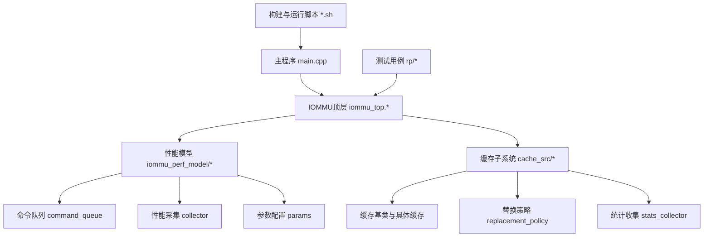
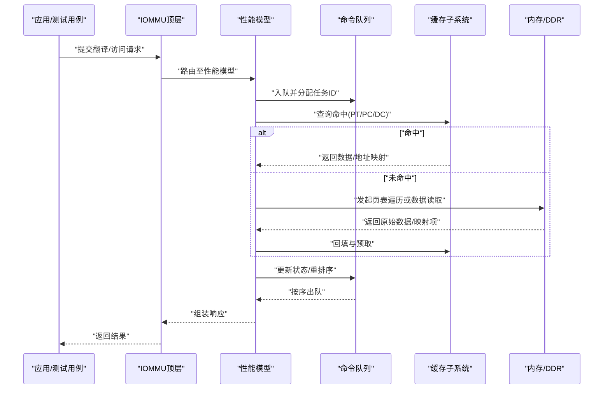
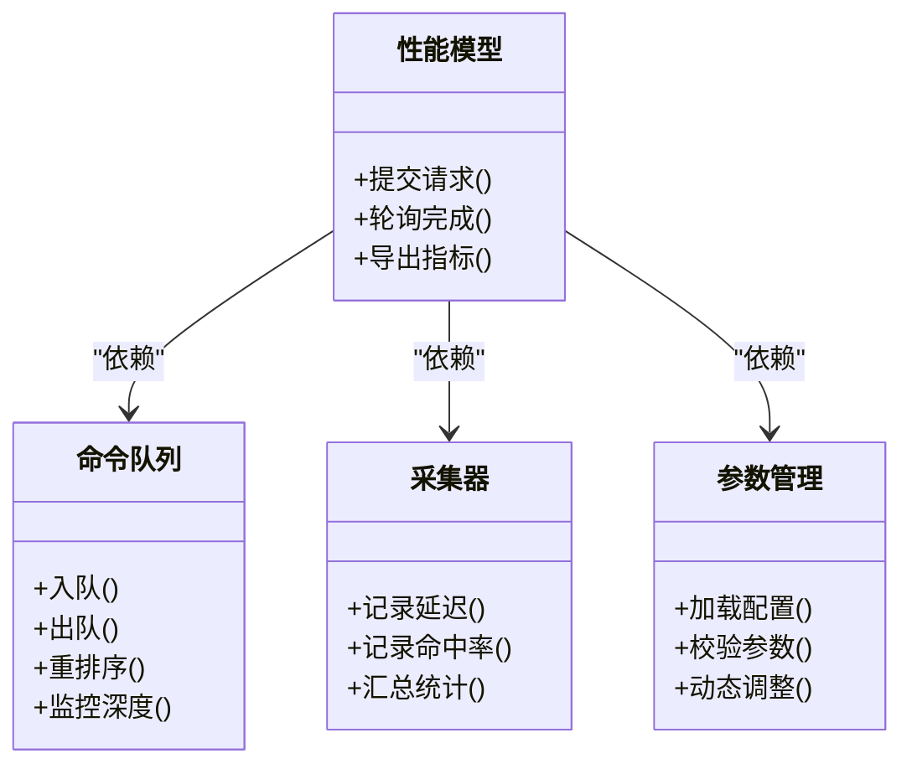
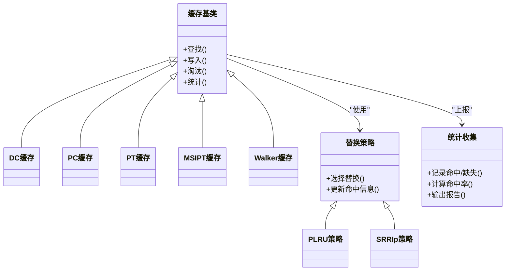
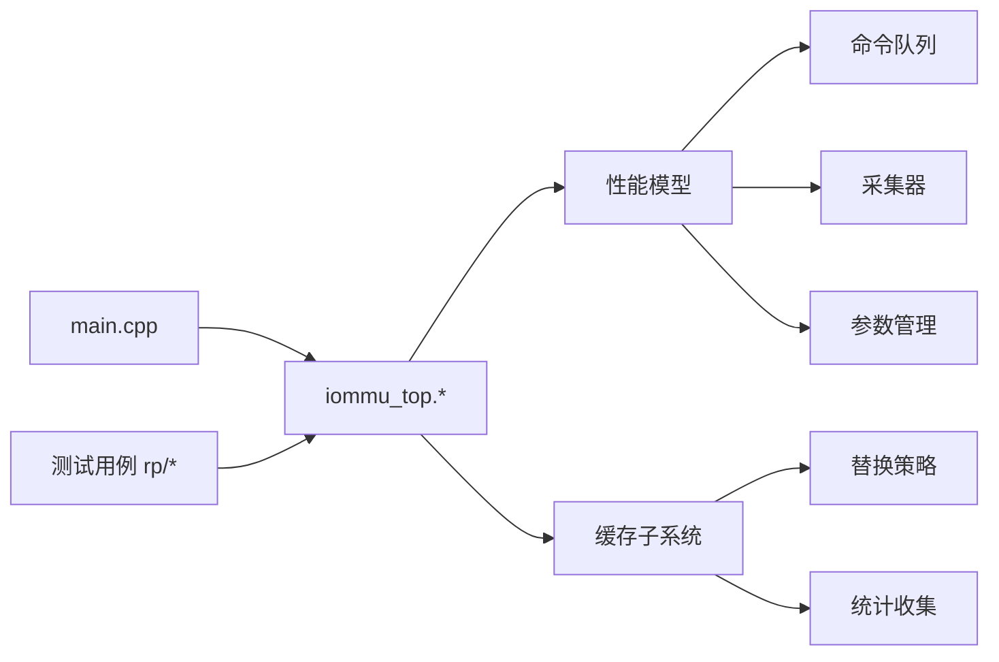

# 场景9高性能测试场景

<cite>
**本文引用的文件**   
- [main.cpp](file://main.cpp)
- [Makefile](file://Makefile)
- [README.md](file://README.md)
- [iommu_top.cc](file://iommu/iommu_top.cc)
- [iommu_top.hh](file://iommu/iommu_top.hh)
- [iommu_perf_model.hh](file://iommu/iommu_perf_model/iommu_perf_model.hh)
- [iommu_command_queue.cc](file://iommu/iommu_perf_model/iommu_command_queue.cc)
- [iommu_perf_collector.cc](file://iommu/iommu_perf_model/iommu_perf_collector.cc)
- [iommu_perf_params.hh](file://iommu/iommu_perf_model/iommu_perf_params.hh)
- [iommu_perf_params_t2.hh](file://iommu/iommu_perf_model/iommu_perf_params_t2.hh)
- [cache_subsystem.h](file://iommu/cache_src/subsystem/cache_subsystem.h)
- [cache_subsystem.cpp](file://iommu/cache_src/subsystem/cache_subsystem.cpp)
- [stats_collector.h](file://iommu/cache_src/common/stats_collector.h)
- [stats_collector.cpp](file://iommu/cache_src/common/stats_collector.cpp)
- [test_rp_rand4k_single_stage_thread.cc](file://rp/test_rp_rand4k_single_stage_thread.cc)
- [test_rp_seq128k_two_stage_thread.cc](file://rp/test_rp_seq128k_two_stage_thread.cc)
- [build_cpp.sh](file://build_cpp.sh)
- [link_and_run.sh](file://link_and_run.sh)
- [run_report.sh](file://run_report.sh)
- [extract_iops.sh](file://extract_iops.sh)
- [concurrency_analysis.sh](file://tmp/concurrency_analysis.sh)
- [calc_stats.sh](file://tmp/calc_stats.sh)
</cite>

## 目录
1. [简介](#简介)
2. [项目结构](#项目结构)
3. [核心组件](#核心组件)
4. [架构总览](#架构总览)
5. [详细组件分析](#详细组件分析)
6. [依赖关系分析](#依赖关系分析)
7. [性能考量](#性能考量)
8. [故障排查指南](#故障排查指南)
9. [结论](#结论)
10. [附录](#附录)

## 简介
本文件聚焦“场景9：高性能测试场景”，围绕IOMMU模型在大规模并发、高吞吐与低延迟条件下的行为展开。文档从系统架构、关键模块、数据流与处理逻辑、集成点、错误处理与性能特征等维度进行系统化说明，并给出可视化图示与可操作的排障建议，帮助读者快速理解与使用该模型进行性能评估与优化。

## 项目结构
仓库采用分层模块化组织：顶层入口负责构建与运行；IOMMU核心功能位于 iommu/ 目录，包含接口定义、功能实现与性能模型；缓存子系统位于 iommu/cache_src/，提供缓存抽象、替换策略与统计收集；PCIe/NOC与SLINK仿真位于对应目录；rp/ 下为多种工作负载与线程化测试用例；tmp/ 下为脚本与分析工具；根目录包含构建脚本与使用说明。

图表来源
- [main.cpp:1-200](file://main.cpp#L1-L200)
- [iommu_top.cc:1-200](file://iommu/iommu_top.cc#L1-L200)
- [iommu_perf_model.hh:1-200](file://iommu/iommu_perf_model/iommu_perf_model.hh#L1-L200)
- [cache_subsystem.h:1-200](file://iommu/cache_src/subsystem/cache_subsystem.h#L1-L200)

章节来源
- [README.md:1-200](file://README.md#L1-L200)
- [Makefile:1-200](file://Makefile#L1-L200)

## 核心组件
- IOMMU顶层模块：统一装配功能路径（翻译、中断、故障、ATC/ATS等）与性能模型，作为仿真入口对外暴露接口。
- 性能模型层：封装命令队列、任务调度、重排序、PTW/XDTW流水线、响应聚合、指标采集与参数管理，支撑高并发下的吞吐与延迟测量。
- 缓存子系统：提供通用缓存抽象、多级缓存（DC/PC/PT/MSIPT/Walker）、替换策略（PLRU/SRRIp）与去重缓冲，提升访存效率与命中率。
- 统计与报告：集中采集各阶段延迟、命中率、队列深度、带宽与IOPS，输出结构化结果供分析。
- 测试用例：覆盖随机4K、顺序128K、两阶段/单阶段、写回等多种模式，支持多线程并发压力。

章节来源
- [iommu_top.hh:1-200](file://iommu/iommu_top.hh#L1-L200)
- [iommu_perf_model.hh:1-200](file://iommu/iommu_perf_model/iommu_perf_model.hh#L1-L200)
- [cache_subsystem.h:1-200](file://iommu/cache_src/subsystem/cache_subsystem.h#L1-L200)
- [stats_collector.h:1-200](file://iommu/cache_src/common/stats_collector.h#L1-L200)

## 架构总览
下图展示场景9中请求从进入IOMMU到返回的端到端流程，以及性能模型与缓存子系统的交互。

图表来源
- [iommu_top.cc:1-200](file://iommu/iommu_top.cc#L1-L200)
- [iommu_command_queue.cc:1-200](file://iommu/iommu_perf_model/iommu_command_queue.cc#L1-L200)
- [cache_subsystem.cpp:1-200](file://iommu/cache_src/subsystem/cache_subsystem.cpp#L1-L200)

## 详细组件分析

### IOMMU顶层模块
- 职责：装配功能路径、初始化性能模型与缓存、暴露统一API、协调中断与故障处理。
- 关键点：对外接口稳定，内部通过性能模型屏蔽复杂流水线细节；对上层仅暴露必要的控制与查询方法。

章节来源
- [iommu_top.hh:1-200](file://iommu/iommu_top.hh#L1-L200)
- [iommu_top.cc:1-200](file://iommu/iommu_top.cc#L1-L200)

### 性能模型层
- 命令队列：维护任务生命周期、优先级与重排序，保证有序返回与背压控制。
- 采集器：记录延迟分布、命中率、队列深度、带宽、IOPS等指标，支持分阶段统计。
- 参数管理：集中管理性能相关参数（队列长度、缓存大小、替换策略、并发度等）。

图表来源
- [iommu_perf_model.hh:1-200](file://iommu/iommu_perf_model/iommu_perf_model.hh#L1-L200)
- [iommu_command_queue.cc:1-200](file://iommu/iommu_perf_model/iommu_command_queue.cc#L1-L200)
- [iommu_perf_collector.cc:1-200](file://iommu/iommu_perf_model/iommu_perf_collector.cc#L1-L200)
- [iommu_perf_params.hh:1-200](file://iommu/iommu_perf_model/iommu_perf_params.hh#L1-L200)
- [iommu_perf_params_t2.hh:1-200](file://iommu/iommu_perf_model/iommu_perf_params_t2.hh#L1-L200)

章节来源
- [iommu_perf_model.hh:1-200](file://iommu/iommu_perf_model/iommu_perf_model.hh#L1-L200)
- [iommu_command_queue.cc:1-200](file://iommu/iommu_perf_model/iommu_command_queue.cc#L1-L200)
- [iommu_perf_collector.cc:1-200](file://iommu/iommu_perf_model/iommu_perf_collector.cc#L1-L200)
- [iommu_perf_params.hh:1-200](file://iommu/iommu_perf_model/iommu_perf_params.hh#L1-L200)
- [iommu_perf_params_t2.hh:1-200](file://iommu/iommu_perf_model/iommu_perf_params_t2.hh#L1-L200)

### 缓存子系统
- 抽象与实现：统一的缓存基类与具体缓存（DC/PC/PT/MSIPT/Walker），支持不同粒度与一致性策略。
- 替换策略：PLRU与SRRIp策略可插拔，便于对比与调优。
- 统计与去重：统计收集贯穿各缓存层级，去重缓冲减少重复访存。

图表来源
- [cache_base.h:1-200](file://iommu/cache_src/cache/cache_base.h#L1-L200)
- [dc_cache.h:1-200](file://iommu/cache_src/cache/dc_cache.h#L1-L200)
- [pc_cache.h:1-200](file://iommu/cache_src/cache/pc_cache.h#L1-L200)
- [pt_cache.h:1-200](file://iommu/cache_src/cache/pt_cache.h#L1-L200)
- [msipt_cache.h:1-200](file://iommu/cache_src/cache/msipt_cache.h#L1-L200)
- [walker_cache.h:1-200](file://iommu/cache_src/cache/walker_cache.h#L1-L200)
- [replacement_policy.h:1-200](file://iommu/cache_src/replacement/replacement_policy.h#L1-L200)
- [plru_policy.h:1-200](file://iommu/cache_src/replacement/plru_policy.h#L1-L200)
- [srrip_policy.h:1-200](file://iommu/cache_src/replacement/srrip_policy.h#L1-L200)
- [stats_collector.h:1-200](file://iommu/cache_src/common/stats_collector.h#L1-L200)

章节来源
- [cache_subsystem.h:1-200](file://iommu/cache_src/subsystem/cache_subsystem.h#L1-L200)
- [cache_subsystem.cpp:1-200](file://iommu/cache_src/subsystem/cache_subsystem.cpp#L1-L200)
- [stats_collector.h:1-200](file://iommu/cache_src/common/stats_collector.h#L1-L200)
- [stats_collector.cpp:1-200](file://iommu/cache_src/common/stats_collector.cpp#L1-L200)

### 测试用例与负载
- 随机4K单阶段：模拟典型页表遍历与数据访问混合负载，验证缓存命中与延迟。
- 顺序128K两阶段：覆盖大页与两级翻译路径，评估跨阶段协作与重排序效果。
- 多线程并发：通过线程化用例放大并发度，观察队列深度、吞吐与尾延迟变化。

章节来源
- [test_rp_rand4k_single_stage_thread.cc:1-200](file://rp/test_rp_rand4k_single_stage_thread.cc#L1-L200)
- [test_rp_seq128k_two_stage_thread.cc:1-200](file://rp/test_rp_seq128k_two_stage_thread.cc#L1-L200)

## 依赖关系分析
- 顶层模块依赖性能模型与缓存子系统，形成“功能-性能-存储”三层解耦。
- 性能模型依赖命令队列、采集器与参数管理，确保可扩展与可观测。
- 缓存子系统依赖替换策略与统计收集，便于策略切换与度量。
- 测试用例依赖顶层接口，驱动端到端场景。

图表来源
- [main.cpp:1-200](file://main.cpp#L1-L200)
- [iommu_top.cc:1-200](file://iommu/iommu_top.cc#L1-L200)
- [iommu_perf_model.hh:1-200](file://iommu/iommu_perf_model/iommu_perf_model.hh#L1-L200)
- [cache_subsystem.h:1-200](file://iommu/cache_src/subsystem/cache_subsystem.h#L1-L200)

章节来源
- [Makefile:1-200](file://Makefile#L1-L200)
- [build_cpp.sh:1-200](file://build_cpp.sh#L1-L200)
- [link_and_run.sh:1-200](file://link_and_run.sh#L1-L200)

## 性能考量
- 并发度与队列深度：在高并发下需平衡队列容量与内存占用，避免过深队列导致尾延迟上升。
- 缓存命中率：合理设置各级缓存大小与替换策略，降低页表遍历与DDR访问次数。
- 重排序与有序性：在保证有序返回的前提下最大化并行度，减少不必要的等待。
- 指标采集开销：采样频率与统计粒度需权衡，避免影响被测对象性能。
- 预热与稳定性：长时运行前进行预热，确保缓存与统计处于稳态后再采集。

[本节为通用指导，不直接分析具体文件]

## 故障排查指南
- 构建失败：检查编译器版本与依赖库，确认Makefile与脚本路径正确。
- 运行时崩溃：启用调试符号，定位异常调用栈；关注队列溢出与越界访问。
- 指标异常：核对采集器开关与采样周期，检查统计口径是否一致。
- 吞吐不达预期：逐步缩小并发度，定位瓶颈在CPU、缓存还是DDR；调整缓存大小与替换策略。
- 日志与脚本：使用提供的脚本提取IOPS、延迟分布与队列深度，辅助定位问题。

章节来源
- [extract_iops.sh:1-200](file://extract_iops.sh#L1-L200)
- [concurrency_analysis.sh:1-200](file://tmp/concurrency_analysis.sh#L1-L200)
- [calc_stats.sh:1-200](file://tmp/calc_stats.sh#L1-L200)
- [run_report.sh:1-200](file://run_report.sh#L1-L200)

## 结论
场景9的高性能测试围绕IOMMU模型在大规模并发下的吞吐与延迟表现展开。通过清晰的层次化架构、可插拔的缓存策略与完善的性能采集体系，能够高效评估与优化系统行为。建议在真实负载下结合多线程用例与脚本工具，持续迭代参数与策略，以获得更稳健的性能结果。

[本节为总结性内容，不直接分析具体文件]

## 附录
- 构建与运行：参考根目录脚本与Makefile，按需选择编译选项与运行参数。
- 常用脚本：extract_iops.sh用于提取IOPS，concurrency_analysis.sh用于并发分析，calc_stats.sh用于统计汇总。
- 扩展方向：增加更多替换策略与缓存层级，完善故障注入与回归测试套件。

[本节为补充信息，不直接分析具体文件]