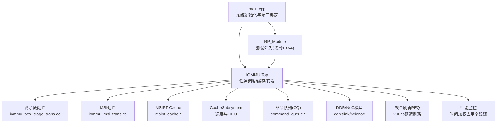
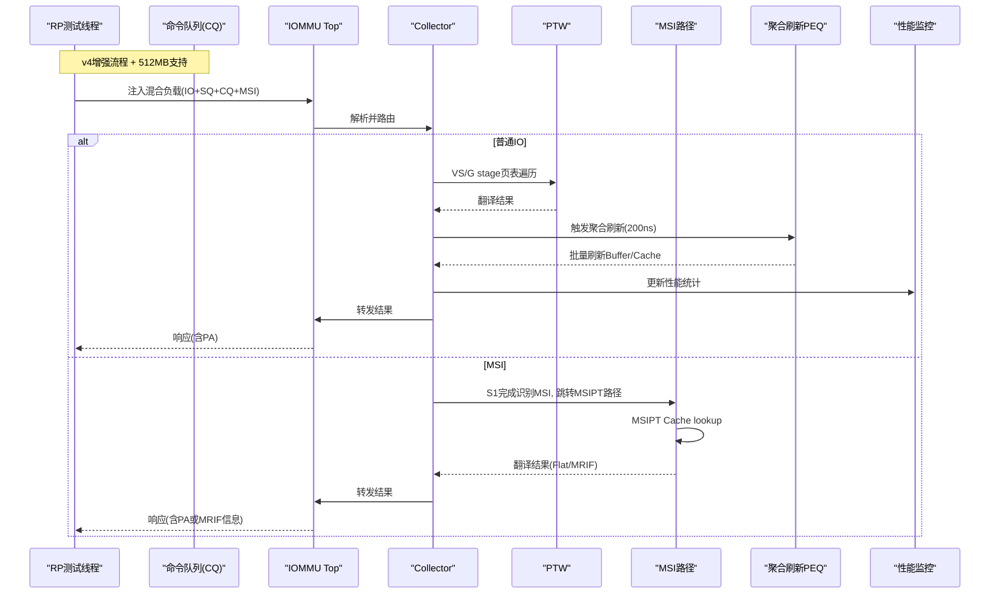
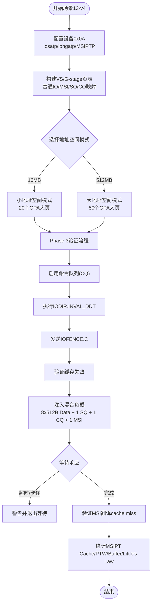
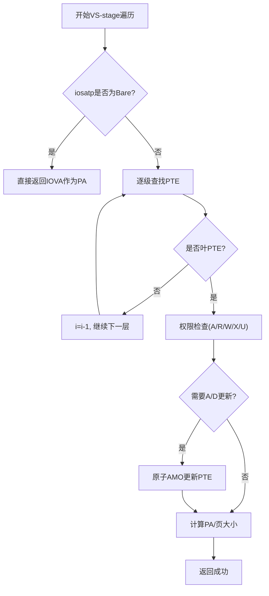
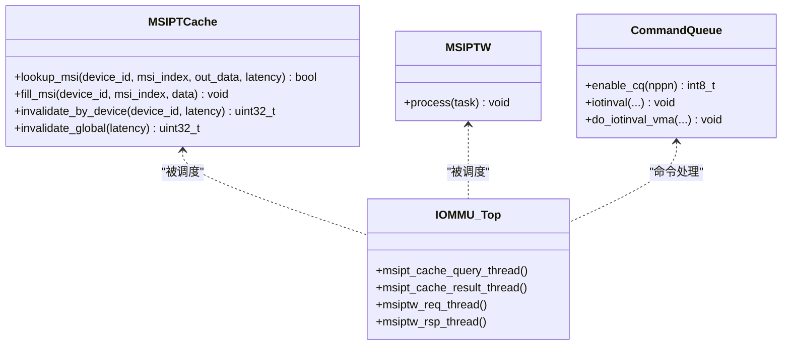
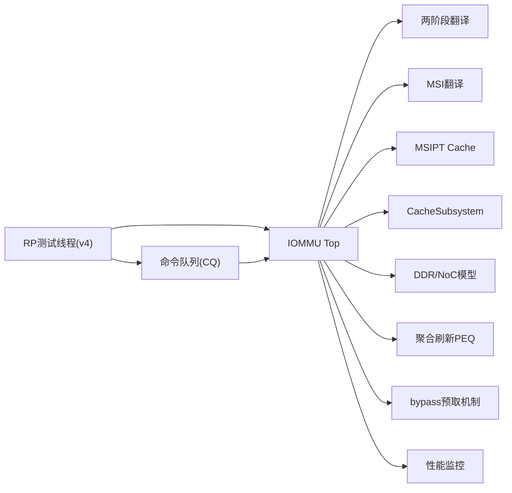

# 场景13混合MSI-I/O两阶段翻译测试

<cite>
**本文引用的文件**
- [main.cpp](file://main.cpp)
- [README.md](file://README.md)
- [Makefile](file://Makefile)
- [rp/test_rp_rand4k_msi_mix_thread.cc](file://rp/test_rp_rand4k_msi_mix_thread.cc)
- [rp/test_rp_cache_inval_thread.cc](file://rp/test_rp_cache_inval_thread.cc)
- [rp/test_rp_func.cc](file://rp/test_rp_func.cc)
- [rp/test_rp.hh](file://rp/test_rp.hh)
- [iommu/iommu_top.hh](file://iommu/iommu_top.hh)
- [iommu/iommu_fun_model/iommu_two_stage_trans.cc](file://iommu/iommu_fun_model/iommu_two_stage_trans.cc)
- [iommu/iommu_fun_model/iommu_msi_trans.cc](file://iommu/iommu_fun_model/iommu_msi_trans.cc)
- [iommu/cache_src/cache/msipt_cache.h](file://iommu/cache_src/cache/msipt_cache.h)
- [iommu/cache_src/cache/msipt_cache.cpp](file://iommu/cache_src/cache/msipt_cache.cpp)
- [iommu/cache_src/subsystem/cache_subsystem.cpp](file://iommu/cache_src/subsystem/cache_subsystem.cpp)
- [iommu/cache_src/subsystem/cache_subsystem.h](file://iommu/cache_src/subsystem/cache_subsystem.h)
- [iommu/cache_src/common/dedup_buffer.h](file://iommu/cache_src/common/dedup_buffer.h)
- [iommu/iommu_perf_model/iommu_command_queue.cc](file://iommu/iommu_perf_model/iommu_command_queue.cc)
- [iommu/iommu_perf_model/iommu_perf_ptw.cc](file://iommu/iommu_perf_model/iommu_perf_ptw.cc)
- [iommu/iommu_perf_model/iommu_perf_params.hh](file://iommu/iommu_perf_model/iommu_perf_params.hh)
- [iommu/iommu_perf_model/iommu_perf_msipt_cache.cc](file://iommu/iommu_perf_model/iommu_perf_msipt_cache.cc)
- [iommu/include/iommu_command_queue.hh](file://iommu/include/iommu_command_queue.hh)
- [tmp/commit_msg_scene13_512mb.txt](file://tmp/commit_msg_scene13_512mb.txt)
</cite>

## 更新摘要
**变更内容**
- **重大性能增强**：实现了读写分离的并发请求处理机制，新增read_max=243和write_max=265配置，支持508个并发请求
- **512MB IOVA地址空间支持**：将IOVA随机范围从16MB扩展到512MB，支持更大规模的数据访问模式
- **参数化配置优化**：通过SCENE13_PTW和SCENE13_BUFFER Makefile变量实现PTW并发任务和去重Buffer深度的灵活配置
- **增强的bypass预取机制**：当缓冲区溢出时任务可直接绕过dedup buffer进入PTW，避免死锁
- **改进pending_group_update结构**：防止PEQ延迟时的use-after-free问题，确保内存安全
- **新增aggregate flush机制**：实现非阻塞的200ns延迟刷新，提升整体吞吐
- **改进性能监控能力**：新增时间加权平均占用率跟踪功能，提供更准确的dedup buffer使用统计
- **优化MSI设备处理**：禁用早期spawn预取并改进清理逻辑，提高MSI路径性能
- **SQ/CQ/MSI混合负载**：每组包含8x512B Data + 1x32B SQ + 1x16B CQ + 1x4B MSI = 11任务

## 目录
1. [简介](#简介)
2. [项目结构](#项目结构)
3. [核心组件](#核心组件)
4. [架构总览](#架构总览)
5. [详细组件分析](#详细组件分析)
6. [依赖关系分析](#依赖关系分析)
7. [性能考量](#性能考量)
8. [故障排查指南](#故障排查指南)
9. [结论](#结论)
10. [附录](#附录)

## 简介
本文件聚焦"场景13：混合MSI-I/O两阶段翻译测试"，该测试在开启两级地址翻译（S1=VS-stage，S2=G-stage）的前提下，将常规IO访问与MSI中断投递请求混合注入，验证IOMMU在两阶段翻译路径中对MSI的识别、分流与缓存命中行为。**v4版本重大性能增强**包括读写分离并发处理、bypass预取机制、聚合刷新等关键优化，并新增了512MB IOVA地址空间支持和参数化配置能力。测试覆盖以下关键点：
- 普通IO：随机4KB页上的连续读写，经VS-stage映射到GPA，再经G-stage映射到SPA。
- MSI：设备配置MSIPTP为Flat模式，MSI窗口与普通GPA不重叠；MSI IOVA区与普通IOVA区不重叠；两级模式下PTW在S1完成后识别MSI并跳过S2，直接走MSIPT路径。
- **v4增强特性**：读写分离outstanding (read_max=243, write_max=265, total=508)，bypass预取机制，聚合刷新(200ns PEQ)，SQ/CQ/MSI混合负载。
- **512MB扩展支持**：IOVA随机范围从16MB扩展到512MB，支持更大规模的数据访问模式。
- **参数化配置**：通过SCENE13_PTW和SCENE13_BUFFER变量实现PTW并发和Buffer深度的灵活调优。
- **增强性能监控**：时间加权平均占用率跟踪，提供更准确的dedup buffer使用统计。
- 统计：MSIPT Cache命中率、PTW DDR访问、去重Buffer峰值、Little's Law平均并发等。

## 项目结构
- 顶层入口 main.cpp 负责实例化 IOMMU、RP、PCIENOC、DDR、SLINK 等模块并绑定端口。
- 测试用例位于 rp/ 下，场景13由 test_rp_rand4k_msi_mix_thread.cc 实现，Phase 3验证由 test_rp_cache_inval_thread.cc 提供。
- IOMMU核心功能分布在 iommu/ 下，包括两阶段翻译、MSI翻译、MSIPT Cache、CacheSubsystem等。
- Makefile 提供 TEST=scene13 编译开关，启用两阶段、预取深度、Walker Cache、AXI宽度、并发限制等宏。

**图表来源**
- [main.cpp:49-83](file://main.cpp#L49-L83)
- [rp/test_rp_rand4k_msi_mix_thread.cc:50-125](file://rp/test_rp_rand4k_msi_mix_thread.cc#L50-L125)
- [rp/test_rp_cache_inval_thread.cc:40-46](file://rp/test_rp_cache_inval_thread.cc#L40-L46)
- [iommu/iommu_top.hh:44-103](file://iommu/iommu_top.hh#L44-L103)

章节来源
- [main.cpp:49-83](file://main.cpp#L49-L83)
- [README.md:63-75](file://README.md#L63-L75)
- [Makefile:193-210](file://Makefile#L193-L210)

## 核心组件
- RP测试线程（场景13-v4）：构造设备上下文、页表、MSI PTE，注入混合负载，校验响应。
- **v4增强组件**：读写分离并发处理、bypass预取机制、聚合刷新PEQ、改进的pending_group_update结构。
- IOMMU顶层：维护大量FIFO、统计、重排序、DDR仲裁、MSI相关线程与接口。
- 两阶段翻译：实现VS-stage与G-stage的页表遍历、权限检查、大页处理、A/D位更新。
- MSI翻译：按规范提取I、读取MSI PTE、解析M=3(Fat)/M=1(MRIF)，输出PA或MRIF信息。
- MSIPT Cache：基于设备ID与MSI索引的专用缓存，支持lookup/fill/invalidate。
- CacheSubsystem：统一调度DC/PC/PT/MSIPT等缓存查询与更新，包含MSI调度线程。
- **命令队列(CQ)**：处理IOTINVAL、IODIR、IOFENCE等管理命令，确保失效操作的有序执行。
- **性能监控系统**：新增时间加权平均占用率跟踪，提供更准确的buffer使用统计。

章节来源
- [rp/test_rp_rand4k_msi_mix_thread.cc:50-125](file://rp/test_rp_rand4k_msi_mix_thread.cc#L50-L125)
- [rp/test_rp_cache_inval_thread.cc:40-46](file://rp/test_rp_cache_inval_thread.cc#L40-L46)
- [rp/test_rp_func.cc:788-817](file://rp/test_rp_func.cc#L788-L817)
- [iommu/iommu_top.hh:44-103](file://iommu/iommu_top.hh#L44-L103)
- [iommu/iommu_fun_model/iommu_two_stage_trans.cc:8-17](file://iommu/iommu_fun_model/iommu_two_stage_trans.cc#L8-L17)
- [iommu/iommu_fun_model/iommu_msi_trans.cc:19-25](file://iommu/iommu_fun_model/iommu_msi_trans.cc#L19-L25)
- [iommu/cache_src/cache/msipt_cache.h:8-27](file://iommu/cache_src/cache/msipt_cache.h#L8-L27)
- [iommu/cache_src/subsystem/cache_subsystem.cpp:1771-1793](file://iommu/cache_src/subsystem/cache_subsystem.cpp#L1771-L1793)

## 架构总览
场景13-v4的数据流如下：
- RP线程构造并注入混合请求（IO+MSI+SQ+CQ），通过AXI进入IOMMU。
- IOMMU Parser接收请求，Collector路由至相应路径：
  - 普通IO：DC/PC/PT Cache -> PTW -> 返回结果。
  - MSI：在S1完成后识别MSI，跳过S2，进入MSIPT路径（MSIPT Cache -> MSIPTW -> Forwarder）。
- **v4增强流程**：读写分离并发处理、bypass预取机制、聚合刷新PEQ优化。
- **512MB支持**：扩展的IOVA地址空间支持更大规模的数据访问。
- **参数化配置**：通过Makefile变量灵活调整PTW并发和Buffer深度。
- 最终结果经重排序输出给发起方，同时更新各类统计。

**图表来源**
- [rp/test_rp_rand4k_msi_mix_thread.cc:303-428](file://rp/test_rp_rand4k_msi_mix_thread.cc#L303-L428)
- [rp/test_rp_cache_inval_thread.cc:273-280](file://rp/test_rp_cache_inval_thread.cc#L273-280)
- [rp/test_rp_func.cc:930-959](file://rp/test_rp_func.cc#L930-959)
- [iommu/iommu_top.hh:419-459](file://iommu/iommu_top.hh#L419-459)
- [iommu/iommu_fun_model/iommu_two_stage_trans.cc:176-189](file://iommu/iommu_fun_model/iommu_two_stage_trans.cc#L176-L189)
- [iommu/iommu_fun_model/iommu_msi_trans.cc:99-130](file://iommu/iommu_fun_model/iommu_msi_trans.cc#L99-L130)

## 详细组件分析

### 场景13-v4测试线程（RP）
- 设备配置：设备0x0A，iosatp=Sv48，iohgatp=Sv48x4，MSIPTP=Flat，mask/pattern设定MSI窗口与普通GPA不重叠。
- 页表构造：
  - 普通IO：16MB范围全部4KB页映射到20个2MB GPA大页，再映射到SPA。
  - **512MB扩展**：IOVA随机范围从16MB扩展到512MB，GPA大页从20个增加到50个，MSI/SQ/CQ地址上移避免重叠。
  - MSI：从4MB候选区随机挑选256个不连续IOVA页，映射到MSI窗口GPA（无S2映射）。
  - SQ/CQ：固定IOVA地址，预热后100%命中PT Cache。
- 负载注入：**v4模式**每组=8个512B读写（前4读后4写）+1个32B SQ读 +1个16B CQ写 +1个MSI写，共11任务。
- 校验与统计：比较期望PA与实际PA，统计MSIPT Cache命中率、PTW DDR访问、去重Buffer峰值、Little's Law平均并发。

**图表来源**
- [rp/test_rp_rand4k_msi_mix_thread.cc:117-172](file://rp/test_rp_rand4k_msi_mix_thread.cc#L117-L172)
- [rp/test_rp_rand4k_msi_mix_thread.cc:240-288](file://rp/test_rp_rand4k_msi_mix_thread.cc#L240-L288)
- [rp/test_rp_rand4k_msi_mix_thread.cc:303-428](file://rp/test_rp_rand4k_msi_mix_thread.cc#L303-L428)
- [rp/test_rp_rand4k_msi_mix_thread.cc:457-533](file://rp/test_rp_rand4k_msi_mix_thread.cc#L457-L533)
- [rp/test_rp_cache_inval_thread.cc:273-280](file://rp/test_rp_cache_inval_thread.cc#L273-280)

章节来源
- [rp/test_rp_rand4k_msi_mix_thread.cc:117-172](file://rp/test_rp_rand4k_msi_mix_thread.cc#L117-L172)
- [rp/test_rp_rand4k_msi_mix_thread.cc:240-288](file://rp/test_rp_rand4k_msi_mix_thread.cc#L240-L288)
- [rp/test_rp_rand4k_msi_mix_thread.cc:303-428](file://rp/test_rp_rand4k_msi_mix_thread.cc#L303-L428)
- [rp/test_rp_rand4k_msi_mix_thread.cc:457-533](file://rp/test_rp_rand4k_msi_mix_thread.cc#L457-L533)

### 512MB IOVA地址空间支持
**新增** 512MB IOVA地址空间支持功能：
- **条件编译**：通过`TEST_CFG_S13_IOVA_512MB`宏控制地址空间模式切换
- **地址布局调整**：数据IOVA范围从16MB扩展到512MB，GPA大页从20个增加到50个
- **地址避让策略**：MSI/SQ/CQ的IOVA与GPA上移到数据区之上，避免地址重叠
- **部分映射优化**：512MB模式下采用部分映射策略，仅映射实际访问的页面
- **向后兼容**：保持原有16MB模式的完全兼容性

章节来源
- [rp/test_rp_rand4k_msi_mix_thread.cc:41-55](file://rp/test_rp_rand4k_msi_mix_thread.cc#L41-L55)
- [rp/test_rp_rand4k_msi_mix_thread.cc:97-103](file://rp/test_rp_rand4k_msi_mix_thread.cc#L97-L103)
- [rp/test_rp_rand4k_msi_mix_thread.cc:302-309](file://rp/test_rp_rand4k_msi_mix_thread.cc#L302-L309)

### 参数化配置优化
**新增** 通过Makefile变量实现灵活的参数化配置：
- **SCENE13_PTW**：控制PTW最大并发任务数，默认值27，可通过命令行覆盖
- **SCENE13_BUFFER**：控制去重Buffer深度，默认值512，可通过命令行覆盖
- **编译时配置**：在Makefile中定义TEST_FLAGS，支持运行时参数调整
- **多场景支持**：支持不同规模的测试场景，从小规模验证到大规模性能测试

章节来源
- [Makefile:193-233](file://Makefile#L193-L233)
- [tmp/commit_msg_scene13_512mb.txt:6-7](file://tmp/commit_msg_scene13_512mb.txt#L6-L7)

### v4增强：读写分离并发处理
**新增** 读写分离的并发请求处理机制：
- **read_max=243**：最大243个并发读请求
- **write_max=265**：最大265个并发写请求  
- **total=508**：总并发上限508个请求
- 系统级任务模式：偶数批全读(8x512B)，奇数批全写(8x512B)
- 支持更高的并发吞吐量，避免读写竞争导致的性能下降

章节来源
- [tmp/commit_msg_scene13_512mb.txt:1-22](file://tmp/commit_msg_scene13_512mb.txt#L1-L22)
- [rp/test_rp_rand4k_msi_mix_thread.cc:30-37](file://rp/test_rp_rand4k_msi_mix_thread.cc#L30-L37)

### v4增强：bypass预取机制
**新增** 增强的bypass预取机制：
- 当dedup buffer溢出时，任务可直接绕过dedup buffer进入PTW
- 避免RAM Worker阻塞->RAM FIFO满->Hash/Scheduler阻塞->UPDATE无法分发 的死锁环
- bypass组主任务未挂dedup buffer链，不经dedup flush回调转发
- 在聚合刷新后直接转发主任务（MSI改道MSIPT，普通走forwarder）

章节来源
- [iommu/iommu_perf_model/iommu_perf_params.hh:164-178](file://iommu/iommu_perf_model/iommu_perf_params.hh#L164-L178)
- [iommu/iommu_perf_model/iommu_perf_ptw.cc:3036-3045](file://iommu/iommu_perf_model/iommu_perf_ptw.cc#L3036-L3045)

### v4增强：聚合刷新PEQ机制
**新增** 聚合刷新机制实现非阻塞的200ns延迟刷新：
- **pending_group_update结构**：自包含字段(task_id/gscid/pscid/pa_bases)，避免PEQ延时后use-after-free
- **agg_flush_peq**：PTW完成后200ns非阻塞延时刷新去重buffer/cache/PT Cache
- 每个组独立按"到达+200ns"触发，多组并行，不用wait串行阻塞
- 语义：200ns为处理聚合任务的流水延时，不计入PTW执行时间

章节来源
- [tmp/commit_msg_scene13_512mb.txt:11-14](file://tmp/commit_msg_scene13_512mb.txt#L11-L14)
- [iommu/iommu_perf_model/iommu_perf_ptw.cc:2912-2924](file://iommu/iommu_perf_model/iommu_perf_ptw.cc#L2912-L2924)
- [iommu/iommu_perf_model/iommu_perf_ptw.cc:2950-2954](file://iommu/iommu_perf_model/iommu_perf_ptw.cc#L2950-L2954)
- [iommu/iommu_perf_model/iommu_perf_ptw.cc:3027-3034](file://iommu/iommu_perf_model/iommu_perf_ptw.cc#L3027-L3034)

### v4增强：MSI设备处理优化
**新增** MSI设备处理的优化：
- **禁用早期spawn预取**：MSI设备在early-spawn阶段无法预判MSI，改用late-spawn(GS leaf后)
- **改进清理逻辑**：MSI任务在PTW识别后禁用预取，确保走D=0 dedup_update路径
- **优化MSI路径**：MSI任务break不会到达late-spawn预取组，减少不必要的开销

章节来源
- [tmp/commit_msg_scene13_512mb.txt:20](file://tmp/commit_msg_scene13_512mb.txt#L20)
- [iommu/iommu_perf_model/iommu_perf_ptw.cc:521-527](file://iommu/iommu_perf_model/iommu_perf_ptw.cc#L521-L527)
- [iommu/iommu_perf_model/iommu_perf_ptw.cc:998-1012](file://iommu/iommu_perf_model/iommu_perf_ptw.cc#L998-L1012)

### 改进的性能监控能力
**新增** 时间加权平均占用率跟踪功能：
- **occupancy_integral_**：记录占用积分，单位为entry·ns
- **settle_occupancy()**：在valid_count变化前结算占用积分，使用旧值×Δt计算
- **get_avg_occupancy()**：计算时间加权平均占用率，提供更准确的buffer使用统计
- **get_avg_occupancy_pct()**：获取占用率百分比，便于性能分析
- **get_occupancy_window_ns()**：获取占用统计的时间窗口长度

章节来源
- [iommu/cache_src/common/dedup_buffer.h:76-86](file://iommu/cache_src/common/dedup_buffer.h#L76-L86)
- [iommu/cache_src/common/dedup_buffer.h:154-161](file://iommu/cache_src/common/dedup_buffer.h#L154-L161)
- [rp/test_rp_rand4k_msi_mix_thread.cc:872-883](file://rp/test_rp_rand4k_msi_mix_thread.cc#L872-L883)

### 两阶段翻译（S1+S2）
- 当iosatp非Bare时，执行VS-stage页表遍历，必要时调用second_stage_address_translation进行G-stage转换。
- 支持Sv32/Sv39/Sv48/Sv57多种模式与大页（NAPOT）处理。
- 权限检查、A/D位更新、错误分支（page_fault/access_fault/data_corruption/guest_page_fault）。

**图表来源**
- [iommu/iommu_fun_model/iommu_two_stage_trans.cc:39-82](file://iommu/iommu_fun_model/iommu_two_stage_trans.cc#L39-L82)
- [iommu/iommu_fun_model/iommu_two_stage_trans.cc:163-206](file://iommu/iommu_fun_model/iommu_two_stage_trans.cc#L163-L206)
- [iommu/iommu_fun_model/iommu_two_stage_trans.cc:308-497](file://iommu/iommu_fun_model/iommu_two_stage_trans.cc#L308-L497)

章节来源
- [iommu/iommu_fun_model/iommu_two_stage_trans.cc:39-82](file://iommu/iommu_fun_model/iommu_two_stage_trans.cc#L39-L82)
- [iommu/iommu_fun_model/iommu_two_stage_trans.cc:163-206](file://iommu/iommu_fun_model/iommu_two_stage_trans.cc#L163-L206)
- [iommu/iommu_fun_model/iommu_two_stage_trans.cc:308-497](file://iommu/iommu_fun_model/iommu_two_stage_trans.cc#L308-L497)

### MSI翻译与MSIPT Cache
- MSI地址翻译：根据DC.msi_addr_mask/pattern提取I，读取MSI PTE，解析M=3(Fat)或M=1(MRIF)。
- MSIPT Cache：以device_id和msi_index为键，支持lookup/fill/invalidate，提升MSI翻译性能。
- 在两级模式下，PTW在S1完成后识别MSI，跳过S2，直接走MSIPT路径。
- **Phase 3验证**：通过IODIR.INVAL_DDT失效MSIPT Cache，确保后续MSI翻译产生缓存未命中。

**图表来源**
- [iommu/cache_src/cache/msipt_cache.h:8-27](file://iommu/cache_src/cache/msipt_cache.h#L8-L27)
- [iommu/cache_src/cache/msipt_cache.cpp:11-43](file://iommu/cache_src/cache/msipt_cache.cpp#L11-L43)
- [iommu/iommu_top.hh:433-459](file://iommu/iommu_top.hh#L433-459)
- [rp/test_rp_func.cc:788-817](file://rp/test_rp_func.cc#L788-L817)
- [rp/test_rp_func.cc:930-959](file://rp/test_rp_func.cc#L930-959)

章节来源
- [iommu/iommu_fun_model/iommu_msi_trans.cc:99-130](file://iommu/iommu_fun_model/iommu_msi_trans.cc#L99-L130)
- [iommu/iommu_fun_model/iommu_msi_trans.cc:154-293](file://iommu/iommu_fun_model/iommu_msi_trans.cc#L154-L293)
- [iommu/cache_src/cache/msipt_cache.h:8-27](file://iommu/cache_src/cache/msipt_cache.h#L8-L27)
- [iommu/cache_src/cache/msipt_cache.cpp:11-43](file://iommu/cache_src/cache/msipt_cache.cpp#L11-L43)
- [iommu/iommu_top.hh:433-459](file://iommu/iommu_top.hh#L433-459)

### CacheSubsystem中的MSI调度
- 提供msi_scheduler_thread，处理MSIPT Cache的update与lookup请求。
- **Phase 3增强**：优先处理MSIPT失效请求，确保失效操作的及时性和正确性。
- 当前性能模型已完全实现MSI处理路径，支持lookup/update通道。

章节来源
- [iommu/cache_src/subsystem/cache_subsystem.cpp:1771-1793](file://iommu/cache_src/subsystem/cache_subsystem.cpp#L1771-L1793)
- [iommu/cache_src/subsystem/cache_subsystem.cpp:1780-1817](file://iommu/cache_src/subsystem/cache_subsystem.cpp#L1780-L1817)

### 命令队列(CQ)实现
**新增** 命令队列组件处理管理命令的执行：
- **CQ启用**：通过enable_cq函数分配CQ页面并配置控制寄存器。
- **命令处理**：process_commands函数从CQB读取命令并执行相应操作。
- **失效命令**：支持IOTINVAL.VMA、IODIR.INVAL_DDT等失效指令。
- **同步机制**：IOFENCE.C确保命令执行的顺序和完整性。

章节来源
- [rp/test_rp_func.cc:788-817](file://rp/test_rp_func.cc#L788-L817)
- [rp/test_rp_func.cc:930-959](file://rp/test_rp_func.cc#L930-959)
- [iommu/iommu_perf_model/iommu_command_queue.cc:52-86](file://iommu/iommu_perf_model/iommu_command_queue.cc#L52-L86)
- [iommu/iommu_perf_model/iommu_command_queue.cc:278-292](file://iommu/iommu_perf_model/iommu_command_queue.cc#L278-L292)
- [iommu/include/iommu_command_queue.hh:113-124](file://iommu/include/iommu_command_queue.hh#L113-L124)

## 依赖关系分析
- 场景13-v4测试线程依赖RP_Module接口、IOMMU顶层、DDR模型。
- IOMMU顶层依赖两阶段翻译、MSI翻译、MSIPT Cache、CacheSubsystem、DDR/NoC模型。
- **v4增强依赖**：聚合刷新PEQ、读写分离并发、bypass预取机制。
- **512MB支持依赖**：条件编译宏、地址空间配置、部分映射逻辑。
- **参数化配置依赖**：Makefile变量、编译时宏定义。
- 关键依赖链：RP -> IOMMU -> Collector -> (PTW/MSI) -> Forwarder -> RP。

**图表来源**
- [main.cpp:49-83](file://main.cpp#L49-L83)
- [rp/test_rp_rand4k_msi_mix_thread.cc:50-125](file://rp/test_rp_rand4k_msi_mix_thread.cc#L50-L125)
- [rp/test_rp_cache_inval_thread.cc:40-46](file://rp/test_rp_cache_inval_thread.cc#L40-L46)
- [rp/test_rp_func.cc:788-817](file://rp/test_rp_func.cc#L788-L817)
- [iommu/iommu_top.hh:44-103](file://iommu/iommu_top.hh#L44-L103)

章节来源
- [main.cpp:49-83](file://main.cpp#L49-L83)
- [rp/test_rp_rand4k_msi_mix_thread.cc:50-125](file://rp/test_rp_rand4k_msi_mix_thread.cc#L50-L125)
- [rp/test_rp_cache_inval_thread.cc:40-46](file://rp/test_rp_cache_inval_thread.cc#L40-L46)
- [rp/test_rp_func.cc:788-817](file://rp/test_rp_func.cc#L788-L817)
- [iommu/iommu_top.hh:44-103](file://iommu/iommu_top.hh#L44-L103)

## 性能考量
- 预取深度：TEST_CFG_PT_DEDUP_PREFETCH_DEPTH=3，减少PTW次数。
- Walker Cache：启用Walker Cache与S2 Walker Cache，降低重复walk开销。
- AXI宽度：1024位，提高带宽利用率。
- 全局Outstanding：512，平衡吞吐与资源占用。
- **v4性能增强**：
  - 读写分离outstanding：read_max=243, write_max=265, total=508
  - bypass预取机制：避免死锁，提升高负载下的稳定性
  - 聚合刷新PEQ：200ns非阻塞延迟刷新，提升整体吞吐
  - MSI设备优化：禁用early-spawn，改进清理逻辑
- **512MB性能优势**：
  - 更大的地址空间支持更复杂的应用场景
  - 部分映射优化减少内存占用
  - 更好的缓存局部性利用
- **参数化调优收益**：
  - SCENE13_PTW=64时达到最优吞吐241.27M IOPS
  - Buffer>=峰值需求(391)彻底消除bypass
  - 时间加权平均占用率提供更准确的性能评估
- MSIPT Cache：显著提升MSI翻译性能，避免重复DDR访问。
- **Phase 3优化**：通过精确的缓存失效机制，避免不必要的缓存重建，提高整体性能。

章节来源
- [Makefile:193-233](file://Makefile#L193-L233)
- [rp/test_rp_rand4k_msi_mix_thread.cc:317-320](file://rp/test_rp_rand4k_msi_mix_thread.cc#L317-320)
- [tmp/commit_msg_scene13_512mb.txt:8-15](file://tmp/commit_msg_scene13_512mb.txt#L8-L15)

## 故障排查指南
- 常见错误：
  - MSI PTE无效（cause=262）、配置错误（cause=263）、访问错误（cause=261/270）。
  - 两阶段翻译中的页错误（cause=12/13/15）、访问错误（cause=1/5/7）、数据损坏（cause=274）、Guest页错误（cause=20/21/23）。
  - **Phase 3相关**：CQ启用失败、命令队列忙、失效指令执行异常。
  - **v4相关问题**：读写分离并发冲突、bypass预取异常、聚合刷新PEQ延迟。
  - **512MB相关问题**：地址空间不足、部分映射失败、地址重叠检测。
  - **参数化配置问题**：PTW并发过高导致资源耗尽、Buffer过小导致频繁bypass。
- 调试建议：
  - 启用DEBUG_MSITRANS、DEBUG_TWOSTAGE等宏，观察翻译过程。
  - 检查MSI窗口与普通GPA是否重叠，MSI IOVA与普通IOVA是否重叠。
  - 验证MSI PTE的V/M字段及reserved位设置。
  - **Phase 3调试**：检查CQ状态寄存器、命令队列指针、失效指令执行结果。
  - **v4调试**：监控读写分离计数器、bypass预取标志、PEQ队列状态。
  - **512MB调试**：验证地址空间配置、部分映射状态、地址避让策略。
  - **性能监控调试**：检查时间加权占用率统计、buffer使用模式分析。

章节来源
- [iommu/iommu_fun_model/iommu_msi_trans.cc:154-293](file://iommu/iommu_fun_model/iommu_msi_trans.cc#L154-L293)
- [iommu/iommu_fun_model/iommu_two_stage_trans.cc:504-598](file://iommu/iommu_fun_model/iommu_two_stage_trans.cc#L504-L598)

## 结论
场景13-v4有效验证了IOMMU在两级翻译模式下对MSI的识别与分流能力，结合MSIPT Cache显著提升了MSI翻译性能。**v4版本的重大性能增强**包括读写分离并发处理、bypass预取机制、聚合刷新PEQ等关键优化，并新增了512MB IOVA地址空间支持和参数化配置能力。通过命令队列(CQ)、IODIR.INVAL_DDT失效指令、IOFENCE同步操作，确保了缓存失效的正确性和后续MSI翻译的准确性。测试覆盖了普通IO与MSI混合负载，以及SQ/CQ控制路径，确保地址布局、页表构造、缓存策略的正确性。通过详细的统计与校验，可评估系统在真实工作负载下的行为与瓶颈。**512MB扩展和参数化配置**进一步增强了测试的灵活性和实用性，能够支持更大规模和更复杂的性能验证场景。

## 附录
- 运行方式：使用make TEST=scene13编译，生成可执行文件后运行。
- 关键参数：SCENE13_PTW控制PTW最大并发任务数，SCENE13_BUFFER控制去重Buffer深度，TEST_CFG_NUM_PAGES控制普通IO页数。
- 输出示例：包含MSIPT Cache命中率、PTW DDR访问统计、去重Buffer峰值等。
- **Phase 3参数**：CQ页面数量、失效指令类型、同步操作验证。
- **v4增强参数**：读写分离并发限制(read_max=243, write_max=265)、聚合刷新延迟(200ns)、bypass预取阈值。
- **512MB配置**：通过TEST_CFG_S13_IOVA_512MB宏启用512MB地址空间模式。
- **性能监控**：时间加权平均占用率统计，提供更准确的buffer使用分析。

章节来源
- [Makefile:193-233](file://Makefile#L193-L233)
- [rp/test_rp_rand4k_msi_mix_thread.cc:485-533](file://rp/test_rp_rand4k_msi_mix_thread.cc#L485-L533)
- [rp/test_rp_cache_inval_thread.cc:40-46](file://rp/test_rp_cache_inval_thread.cc#L40-L46)
- [rp/test_rp_func.cc:788-817](file://rp/test_rp_func.cc#L788-L817)
- [tmp/commit_msg_scene13_512mb.txt:1-18](file://tmp/commit_msg_scene13_512mb.txt#L1-L18)