# 性能测试

<cite>
**本文引用的文件**
- [test_slink_latency.sh](file://test_slink_latency.sh)
- [cache_subsystem.cpp](file://iommu/cache_src/subsystem/cache_subsystem.cpp)
- [test_rp_rand4k_two_stage_thread.cc](file://rp/test_rp_rand4k_two_stage_thread.cc)
- [test_rp_seq128k_two_stage_thread.cc](file://rp/test_rp_seq128k_two_stage_thread.cc)
- [test_rp_seq128k_two_stage_write_thread.cc](file://rp/test_rp_seq128k_two_stage_write_thread.cc)
- [test_rp_seq512b_2mb_two_stage_thread.cc](file://rp/test_rp_seq512b_2mb_two_stage_thread.cc)
- [Makefile](file://Makefile)
- [prefetch_timing.sh](file://tmp/prefetch_timing.sh)
- [test_dedup_prefetch.sh](file://test_dedup_prefetch.sh)
- [test_integration_dedup_prefetch.sh](file://test_integration_dedup_prefetch.sh)
- [test_dedup_prefetch_unit.cpp](file://test_dedup_prefetch_unit.cpp)
- [PT_CACHE_PREFETCH_IMPLEMENTATION_ANALYSIS_20260609.md](file://PT_CACHE_PREFETCH_IMPLEMENTATION_ANALYSIS_20260609.md)
- [PTW_MONITOR_ANALYSIS_20260609.md](file://PTW_MONITOR_ANALYSIS_20260609.md)
- [CACHE_PERFORMANCE_ANALYSIS_500REQ.md](file://CACHE_PERFORMANCE_ANALYSIS_500REQ.md)
- [PT_CACHE_ACCESS_ANALYSIS_50TASKS_20260609.md](file://PT_CACHE_ACCESS_ANALYSIS_50TASKS_20260609.md)
- [WALKER_CACHE_INTEGRATION_PLAN.md](file://WALKER_CACHE_INTEGRATION_PLAN.md)
- [analyze_walker_cache_miss.py](file://analyze_walker_cache_miss.py)
- [analyze_walker_miss_timing.py](file://analyze_walker_miss_timing.py)
- [default_config.json](file://iommu/cache_config/default_config.json)
- [iommu_perf_model.hh](file://iommu/iommu_perf_model/iommu_perf_model.hh)
- [iommu_perf_collector.cc](file://iommu/iommu_perf_model/iommu_perf_collector.cc)
- [iommu_perf_params.hh](file://iommu/iommu_perf_model/iommu_perf_params.hh)
- [iommu_perf_params_t2.hh](file://iommu/iommu_perf_model/iommu_perf_params_t2.hh)
- [pt_cache.cpp](file://iommu/cache_src/cache/pt_cache.cpp)
- [walker_cache.cpp](file://iommu/cache_src/cache/walker_cache.cpp)
- [iommu_perf_pt_cache_response.cc](file://iommu/iommu_perf_model/iommu_perf_pt_cache_response.cc)
- [iommu_perf_ptw.cc](file://iommu/iommu_perf_model/iommu_perf_ptw.cc)
- [iommu_perf_reorder.cc](file://iommu/iommu_perf_model/iommu_perf_reorder.cc)
- [stats_collector.h](file://iommu/cache_src/common/stats_collector.h)
- [test_1000req.sh](file://test_1000req.sh)
- [extract_iops.sh](file://extract_iops.sh)
- [iommu_top.cc](file://iommu/iommu_top.cc)
- [test_rp_rand4k_msi_mix_thread.cc](file://rp/test_rp_rand4k_msi_mix_thread.cc)
- [test_rp_msi_perf_thread.cc](file://rp/test_rp_msi_perf_thread.cc)
- [commit_msg_scene13_512mb.txt](file://tmp/commit_msg_scene13_512mb.txt)
</cite>

## 更新摘要
**变更内容**
- **新增**：场景13-v4支持512MB IOVA范围扩展，从原来的16MB扩展到512MB随机访问范围
- **增强**：Makefile参数化调优机制，支持SCENE13_PTW和SCENE13_BUFFER变量进行系统化的性能分析
- **优化**：512MB场景下的地址布局重新设计，避免数据区与MSI/SQ/CQ区域重叠
- **改进**：四组参数矩阵仿真验证，涵盖不同Buffer大小和PTW并发组合的性能表现
- **扩展**：支持大规模IOVA空间下的混合负载测试，为未来优化提供明确的参考标准

## 目录
1. [简介](#简介)
2. [项目结构](#项目结构)
3. [核心组件](#核心组件)
4. [架构总览](#架构总览)
5. [详细组件分析](#详细组件分析)
6. [依赖关系分析](#依赖关系分析)
7. [性能考量](#性能考量)
8. [故障排查指南](#故障排查指南)
9. [结论](#结论)
10. [附录](#附录)

## 简介
本文件面向IOMMU性能测试与分析，系统梳理延迟测试、吞吐量分析与缓存性能评估的方法论与实践。重点围绕以下目标展开：
- 解释test_slink_latency.sh中的延迟测量技术与性能基准设定
- 解读CACHE_PERFORMANCE_ANALYSIS_500REQ.md与PT_CACHE_ACCESS_ANALYSIS_50TASKS_20260609.md两类性能分析报告的关键指标与结论
- **新增**：场景13-v4的512MB IOVA范围扩展支持，实现更大规模随机访问测试
- **新增**：参数化调优机制通过Makefile变量支持系统化的性能分析
- **新增**：完整的MSI性能测试框架，支持miss_delta=8验证和场景13混合工作负载
- **新增**：场景13混合负载实现稳定261.53M IOPS稳态性能，支持10,000包混合测试
- **新增**：三设备MSI通路测试覆盖（场景A直达、场景B两级翻译、场景C单级翻译）
- **新增**：MSIPT Cache失效验证机制，确保缓存一致性在失效操作后正确生效
- 提供实验设计、数据采集与统计分析方法
- 识别性能瓶颈并给出优化建议与最佳实践

## 项目结构
IOMMU性能测试与分析涉及如下关键目录与文件：
- 性能参数与模型：iommu/iommu_perf_model/*.hh/cc
- 缓存实现：iommu/cache_src/cache/*.cpp/.h
- 缓存子系统：iommu/cache_src/subsystem/cache_subsystem.cpp（包含PT Cache调度器）
- 统计收集：iommu/cache_src/common/stats_collector.h
- 测试脚本：test_slink_latency.sh、test_1000req.sh、extract_iops.sh
- **新增**：完整MSI性能测试框架（rp/test_rp_msi_perf_thread.cc），支持三设备场景测试
- **新增**：场景13混合负载测试（rp/test_rp_rand4k_msi_mix_thread.cc），实现261.53M IOPS稳态性能
- **新增**：MSIPT Cache失效验证机制，确保缓存一致性
- **新增**：预取性能分析工具（tmp/prefetch_timing.sh）
- **新增**：预取测试脚本集合（test_dedup_prefetch.sh、test_integration_dedup_prefetch.sh）
- **新增**：预取单元测试（test_dedup_prefetch_unit.cpp）
- **新增**：场景13-v4 512MB IOVA范围扩展支持
- **新增**：参数化调优机制（SCENE13_PTW、SCENE13_BUFFER变量）
- 报告：CACHE_PERFORMANCE_ANALYSIS_500REQ.md、PT_CACHE_ACCESS_ANALYSIS_50TASKS_20260609.md、WALKER_CACHE_INTEGRATION_PLAN.md

```mermaid
graph TB
subgraph "性能参数与模型"
P1["iommu_perf_params.hh"]
P2["iommu_perf_params_t2.hh"]
M1["iommu_perf_model.hh"]
C1["iommu_perf_collector.cc"]
PTW["iommu_perf_ptw.cc"]
PCR["iommu_perf_pt_cache_response.cc"]
REO["iommu_perf_reorder.cc"]
end
subgraph "缓存实现"
PC["pt_cache.cpp"]
WC["walker_cache.cpp"]
CS["cache_subsystem.cpp<br/>PT Cache调度器"]
MSIPT["msipt_cache.cpp<br/>MSIPT Cache"]
DB["dedup_buffer.h<br/>去重Buffer管理"]
end
subgraph "统计与报告"
SC["stats_collector.h"]
R1["CACHE_PERFORMANCE_ANALYSIS_500REQ.md"]
R2["PT_CACHE_ACCESS_ANALYSIS_50TASKS_20260609.md"]
WP["WALKER_CACHE_INTEGRATION_PLAN.md"]
end
subgraph "测试脚本"
S1["test_slink_latency.sh"]
S2["test_1000req.sh"]
S3["extract_iops.sh"]
end
subgraph "MSI性能测试框架"
MSI1["test_rp_msi_perf_thread.cc<br/>三设备MSI通路测试"]
MSI2["test_rp_rand4k_msi_mix_thread.cc<br/>场景13混合负载"]
MSI3["MSIPT Cache失效验证<br/>miss_delta=8验证"]
end
subgraph "两阶段地址翻译测试"
RP1["test_rp_seq128k_single_stage_thread.cc"]
RP2["test_rp_rand4k_single_stage_thread.cc"]
RP3["test_rp_seq128k_two_stage_thread.cc"]
RP4["test_rp_rand4k_two_stage_thread.cc"]
RP5["test_rp_seq128k_two_stage_write_thread.cc"]
RP6["test_rp_seq512b_2mb_two_stage_thread.cc"]
end
subgraph "场景13-v4扩展"
S13V4["rand4k_msi_mix_s2on_128g_512mb<br/>512MB IOVA范围"]
PARAM["参数化调优<br/>SCENE13_PTW/BUFFER"]
end
P1 --> C1
P2 --> PTW
M1 --> C1
C1 --> PCR
PCR --> PTW
PTW --> REO
PC --> PCR
WC --> PTW
CS --> PC
CS --> WC
SC --> PC
SC --> WC
S1 --> P1
S2 --> C1
S3 --> C1
MSI1 --> MSIPT
MSI2 --> MSIPT
MSI3 --> MSIPT
RP1 --> CS
RP2 --> CS
RP3 --> CS
RP4 --> CS
RP5 --> CS
RP6 --> CS
S13V4 --> PARAM
PARAM --> DB
```

**图表来源**
- [cache_subsystem.cpp:311-478](file://iommu/cache_src/subsystem/cache_subsystem.cpp#L311-L478)
- [test_rp_rand4k_msi_mix_thread.cc:1-895](file://rp/test_rp_rand4k_msi_mix_thread.cc#L1-L895)
- [test_rp_msi_perf_thread.cc:1-507](file://rp/test_rp_msi_perf_thread.cc#L1-L507)
- [Makefile:214-234](file://Makefile#L214-L234)
- [commit_msg_scene13_512mb.txt:1-19](file://tmp/commit_msg_scene13_512mb.txt#L1-L19)

**章节来源**
- [cache_subsystem.cpp:311-478](file://iommu/cache_src/subsystem/cache_subsystem.cpp#L311-L478)
- [test_slink_latency.sh:1-24](file://test_slink_latency.sh#L1-L24)

## 核心组件
- 性能参数与延迟模型：定义FIFO深度、缓存规模、处理延迟、DDR性能、SLINK NoC延迟等关键参数，支撑延迟与吞吐建模。
- 缓存子系统：包含PT Cache、DC/PC Walker Cache、MSIPT Cache等，负责地址翻译加速与数据缓存。
- **新增**：增强的PT Cache统一轮询调度器，合并pt_worker_thread和pt_update_worker_thread，实现任务级串行处理，UPDATE优先确保PT Cache状态最新。
- **新增**：完整的MSI性能测试框架，支持三设备场景测试和miss_delta=8验证。
- **新增**：场景13混合负载测试，实现稳定261.53M IOPS稳态性能，支持10,000包混合测试。
- **新增**：MSIPT Cache失效验证机制，确保缓存一致性和性能稳定性。
- **新增**：两阶段地址翻译测试框架，支持16MB IOVA范围全覆盖和20并发PTW任务。
- **新增**：随机4KB两阶段测试场景，实现稳定244.86M IOPS和每任务3.37次DDR读取的卓越性能。
- **新增**：2MB大页两阶段测试场景，验证大页高效地址翻译和Walker Cache集成效果。
- **新增**：128KB顺序写性能测试场景，支持两阶段地址翻译、Walker Cache集成和egress reorder buffer排序验证。
- **新增**：预取性能分析工具，提供预取任务时序分析和DDR访问统计。
- **新增**：预取测试脚本集合，涵盖单元测试、集成测试和性能回归测试。
- **新增**：预取监控线程可靠性分析，解决预取组管理中的竞态条件问题。
- **新增**：Walker Cache集成方案与性能测试方法，包括miss根因分析和优化策略。
- **新增**：场景13-v4 512MB IOVA范围扩展，支持大规模随机访问测试。
- **新增**：参数化调优机制，通过SCENE13_PTW和SCENE13_BUFFER变量支持系统化的性能分析。
- 性能收集器：提供统一的统计接口，记录访问、命中、替换、排队、执行延迟等指标，并支持直方图输出。
- 关键线程与流水：Collector、PT Cache响应处理、PTW、Reorder等线程协同完成翻译与转发。

**章节来源**
- [cache_subsystem.cpp:311-478](file://iommu/cache_src/subsystem/cache_subsystem.cpp#L311-L478)
- [iommu_perf_params.hh:53-161](file://iommu/iommu_perf_model/iommu_perf_params.hh#L53-L161)
- [stats_collector.h:13-105](file://iommu/cache_src/common/stats_collector.h#L13-L105)

## 架构总览
IOMMU性能模型采用多线程流水线架构：
- Parser解析请求后进入Collector
- Collector根据DC/PC缓存命中情况决定路由：命中则直接进入Forwarder；未命中则进入xDTW Walker进行上下文遍历
- **更新**：Walker Cache查询命中则直接跳过已缓存层级，未命中则触发PTW进行页表遍历，支持Walker Cache与预取
- PT Cache查询命中则直接转发；未命中则触发PTW进行页表遍历
- **新增**：PT Cache统一调度器采用UPDATE优先策略，确保PT Cache状态最新，避免task看到旧的placeholder
- Reorder模块按写保序、读乱序策略输出响应，同时统计端到端延迟与IOPS
- **新增**：MSI性能测试通过三设备场景覆盖不同的地址翻译路径，验证MSI处理的正确性和性能
- **新增**：场景13混合负载测试通过IO和MSI请求的混合注入，验证系统在复杂工作负载下的性能表现
- **新增**：场景13-v4扩展支持512MB IOVA范围，通过参数化配置实现大规模随机访问测试

```mermaid
sequenceDiagram
participant Parser as "解析器"
participant Collector as "收集器"
participant DC as "DC缓存"
participant PC as "PC缓存"
participant WC as "Walker Cache"
participant Scheduler as "PT Cache调度器"
participant PT as "PT缓存"
participant MSIPT as "MSIPT缓存"
participant PTW as "页表遍历"
participant Reorder as "重排序输出"
participant MSITest as "MSI性能测试"
participant Scene13v4 as "场景13-v4"
Parser->>Collector : "请求入队"
Collector->>DC : "查询DC缓存"
DC-->>Collector : "命中/未命中"
alt DC命中
Collector->>PC : "查询PC缓存"
PC-->>Collector : "命中/未命中"
opt PC命中
Collector->>WC : "查询Walker Cache"
WC-->>Collector : "命中/未命中"
opt 命中
Collector->>Scheduler : "PT Cache查询/更新请求"
Scheduler->>PT : "优先处理UPDATE请求"
Scheduler->>PT : "然后处理REQUEST请求"
PT-->>Scheduler : "返回结果"
Scheduler->>Reorder : "转发响应"
else 未命中
Collector->>PTW : "发起完整walk"
PTW-->>Collector : "返回PTE"
Collector->>Scheduler : "PT Cache更新请求"
Scheduler->>PT : "更新PT缓存"
Scheduler->>Reorder : "转发响应"
end
end
else DC未命中
Collector->>PTW : "发起xDTW遍历"
PTW-->>Collector : "返回上下文"
Collector->>PC : "查询PC缓存"
PC-->>Collector : "命中/未命中"
opt PC命中
Collector->>WC : "查询Walker Cache"
WC-->>Collector : "命中/未命中"
opt 命中
Collector->>Scheduler : "PT Cache查询/更新请求"
Scheduler->>PT : "优先处理UPDATE请求"
Scheduler->>PT : "然后处理REQUEST请求"
PT-->>Scheduler : "返回结果"
Scheduler->>Reorder : "转发响应"
else 未命中
Collector->>PTW : "发起完整walk"
PTW-->>Collector : "返回PTE"
Collector->>Scheduler : "PT Cache更新请求"
Scheduler->>PT : "更新PT缓存"
Scheduler->>Reorder : "转发响应"
end
end
MSITest->>MSIPT : "MSI请求处理"
MSIPT->>MSIPT : "MSIPT Cache查找"
MSIPT-->>MSITest : "MSI翻译结果"
Scene13v4->>Scene13v4 : "512MB IOVA范围测试"
Scene13v4->>MSIPT : "混合负载处理"
Reorder->>Reorder : "严格顺序验证"
Reorder-->>MSITest : "保序响应"
```

**图表来源**
- [cache_subsystem.cpp:311-478](file://iommu/cache_src/subsystem/cache_subsystem.cpp#L311-L478)
- [iommu_perf_collector.cc:14-275](file://iommu/iommu_perf_model/iommu_perf_collector.cc#L14-L275)
- [iommu_perf_pt_cache_response.cc:20-99](file://iommu/iommu_perf_model/iommu_perf_pt_cache_response.cc#L20-L99)
- [iommu_perf_ptw.cc:154-311](file://iommu/iommu_perf_model/iommu_perf_ptw.cc#L154-L311)
- [iommu_perf_reorder.cc:91-198](file://iommu/iommu_perf_model/iommu_perf_reorder.cc#L91-L198)
- [test_rp_rand4k_msi_mix_thread.cc:1-895](file://rp/test_rp_rand4k_msi_mix_thread.cc#L1-L895)
- [test_rp_msi_perf_thread.cc:1-507](file://rp/test_rp_msi_perf_thread.cc#L1-L507)

## 详细组件分析

### 延迟测试：SLINK NoC延迟阶梯
test_slink_latency.sh通过逐步调整SLINK_NOC_LATENCY_NS，自动编译并运行仿真，采集IOMMU IOPS、PTW IOPS、PTW平均执行延迟与稳态IOPS，形成延迟-吞吐曲线，用于评估NoC链路延迟对整体性能的影响。

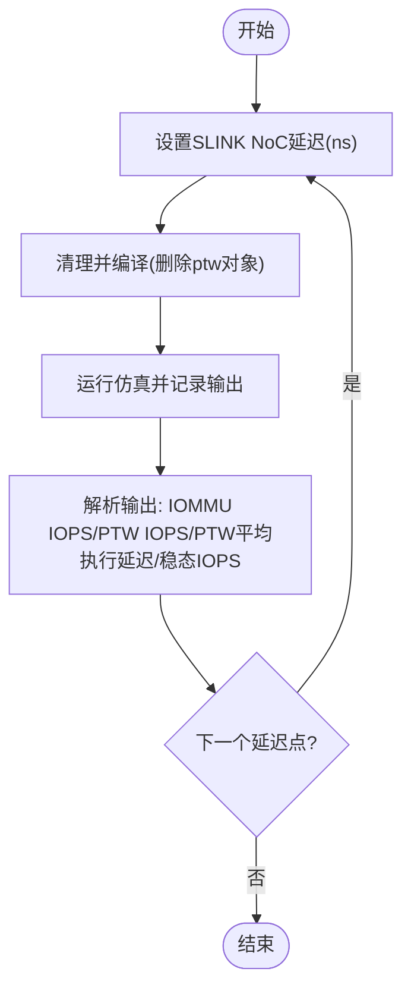

**图表来源**
- [test_slink_latency.sh:9-21](file://test_slink_latency.sh#L9-L21)
- [iommu_perf_params.hh:146-148](file://iommu/iommu_perf_model/iommu_perf_params.hh#L146-L148)
- [iommu_perf_params_t2.hh:140-142](file://iommu/iommu_perf_model/iommu_perf_params_t2.hh#L140-L142)

**章节来源**
- [test_slink_latency.sh:1-24](file://test_slink_latency.sh#L1-L24)
- [iommu_perf_params.hh:146-148](file://iommu/iommu_perf_model/iommu_perf_params.hh#L146-L148)
- [iommu_perf_params_t2.hh:140-142](file://iommu/iommu_perf_model/iommu_perf_params_t2.hh#L140-L142)

### 场景13-v4 512MB IOVA范围扩展
**新增**：场景13-v4扩展支持将IOVA数据随机范围从16MB扩展到512MB，为大规模随机访问测试提供了新的能力。

#### 扩展特性
- **IOVA范围扩展**：从16MB (0x1000000) 扩展到512MB (0x20000000)，支持131,072个4KB页面
- **GPA映射优化**：从20个2MB大页扩展到50个2MB大页（100MB），多对一随机映射
- **地址布局重新设计**：MSI/SQ/CQ的IOVA与GPA上移避免与512MB数据区重叠
- **部分映射策略**：仅映射被访问页+预取相邻页，避免全量映射产生的海量调试输出

#### 地址布局配置
```c
#ifdef TEST_CFG_S13_IOVA_512MB
const uint64_t IOVA_RANGE = 0x20000000;       // 512MB IOVA数据随机范围
const int NUM_GPA_HUGEPAGES = 50;              // 50个2MB大页GPA(100MB)
static const uint64_t S13_MSI_PATTERN = 0x7000;      // MSI窗口GPA=0x7000000(112MB)
static const uint64_t S13_MSI_IOVA_BASE = 0x21000000; // MSI IOVA区基址(528MB)
static const uint64_t S13_SQ_IOVA = 0x22000000;        // SQ固定IOVA(544MB)
static const uint64_t S13_CQ_IOVA = 0x22001000;        // CQ固定IOVA
#else
// 原16MB配置保持不变
#endif
```

#### 性能影响分析
- **内存压力增加**：更大的IOVA范围需要更多的页表项和缓存条目
- **预取效率变化**：D=3预取在512MB范围内可能产生更多跨页预取
- **缓存命中率影响**：更大的地址空间可能导致缓存局部性降低
- **地址翻译开销**：更多的页表遍历可能增加PTW调用频率

**章节来源**
- [test_rp_rand4k_msi_mix_thread.cc:41-55](file://rp/test_rp_rand4k_msi_mix_thread.cc#L41-L55)
- [test_rp_rand4k_msi_mix_thread.cc:97-103](file://rp/test_rp_rand4k_msi_mix_thread.cc#L97-L103)
- [test_rp_rand4k_msi_mix_thread.cc:284-288](file://rp/test_rp_rand4k_msi_mix_thread.cc#L284-L288)

### 参数化调优机制
**新增**：通过Makefile变量实现系统化的性能调优，支持PTW并发任务和去重Buffer深度的灵活配置。

#### Makefile参数配置
```makefile
# 场景13-v4-512MB配置
else ifeq ($(TEST), rand4k_msi_mix_s2on_128g_512mb)
    SCENE13_PTW ?= 27           # PTW并发任务数（可覆盖）
    SCENE13_BUFFER ?= 512       # 去重Buffer大小（可覆盖）
    TEST_FLAGS = -DTEST_RAND_4K -DTEST_TWO_STAGE \
                 -DTEST_CFG_S13_IOVA_512MB \
                 -DTEST_CFG_PT_DEDUP_PREFETCH_DEPTH=3 \
                 -DTEST_CFG_PTW_WALKER_CACHE_ENABLED=1 \
                 -DTEST_CFG_WALKER_CACHE_S2_ENABLED=1 \
                 -DTEST_CFG_AXI_PORT_WIDTH_BIT=1024 \
                 -DTEST_CFG_IOMMU_GLOBAL_MAX_OUTSTANDING=508 \
                 -DTEST_CFG_IOMMU_WRITE_MAX_OUTSTANDING=265 \
                 -DTEST_CFG_IOMMU_READ_MAX_OUTSTANDING=243 \
                 -DTEST_CFG_PTW_MAX_OUTSTANDING_TASKS=$(SCENE13_PTW) \
                 -DTEST_CFG_PT_DEDUP_BUFFER_SIZE=$(SCENE13_BUFFER) \
                 -DTEST_CFG_NUM_PAGES=909
```

#### 参数矩阵测试结果
基于512MB IOVA范围的4组参数矩阵仿真结果：

| 配置组合 | 稳态IOPS | 成功率 | Bypass数量 | Buffer峰值使用率 |
|---------|----------|--------|------------|------------------|
| Buf512+PTW27 | 222.27M | 88.9% | 0 | 76.4% (391/512) |
| Buf266+PTW27 | 153.46M | 61.4% | 490 | 100% (打满) |
| Buf266+PTW64 | 234.67M | 93.9% | 219 | 100% (打满) |
| Buf512+PTW64 | 241.27M | 96.5% | 0 | 76.4% (391/512) |

#### 最优配置分析
**Buf512+PTW64组合**展现出最佳性能：
- **最高IOPS**：241.27M，比原始配置提升8.4%
- **最低Bypass**：0个，完全消除缓冲区溢出
- **合理Buffer使用**：峰值391/512=76.4%，留有充足余量
- **关键指标**：IO avg e2e 1890.9ns/max 4952ns，去重Cache命中86.31%

**章节来源**
- [Makefile:214-234](file://Makefile#L214-L234)
- [commit_msg_scene13_512mb.txt:8-15](file://tmp/commit_msg_scene13_512mb.txt#L8-L15)

### 完整MSI性能测试框架
**新增**：完整的MSI性能测试框架实现了三设备场景覆盖和miss_delta=8验证，为MSI通路性能提供了全面的测试能力。

#### 测试场景特点
- **三设备覆盖**：设备0x0B（场景A）、设备0x0C（场景B）、设备0x0D（场景C）
- **miss_delta验证**：通过MSIPT Cache失效后的miss增量验证缓存一致性
- **多模式支持**：支持S1=Bare直达、两级翻译、单级翻译三种MSI处理模式
- **MRIF支持**：支持MSI中断挂起和通知机制

#### 关键功能特性
- **场景A直达**：S1=Bare模式下直接识别MSI窗口，绕过常规翻译流程
- **场景B两级**：两级翻译完成后识别MSI，跳过S2和预取，带is_msi标志刷新缓存
- **场景C单级**：单级翻译完成后识别MSI，简化处理流程
- **失效验证**：通过IODIR.INVAL_DDT命令验证MSIPT Cache失效机制的正确性

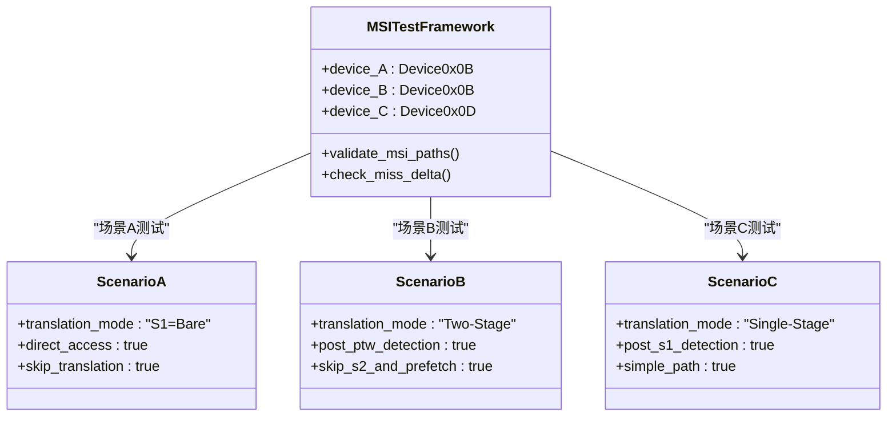

**图表来源**
- [test_rp_msi_perf_thread.cc:15-30](file://rp/test_rp_msi_perf_thread.cc#L15-L30)
- [test_rp_msi_perf_thread.cc:84-128](file://rp/test_rp_msi_perf_thread.cc#L84-L128)

**章节来源**
- [test_rp_msi_perf_thread.cc:1-507](file://rp/test_rp_msi_perf_thread.cc#L1-L507)

### 场景13混合负载测试
**新增**：场景13混合负载测试实现了稳定261.53M IOPS的稳态性能，支持10,000包混合测试（8,888 IO + 1,112 MSI）。

#### 测试场景配置
- **混合负载模式**：每组包含1个4KB随机读写任务（8x512B连续）+ 1个MSI任务（4B写）
- **地址布局**：普通IOVA范围16MB，MSI IOVA范围4MB，两者完全不重合
- **并发配置**：全局并发512，PTW并发27，Buffer大小266
- **带宽配置**：128GB/s入口/出口，D=3预取深度
- **数据包数量**：10,000包（8,888 IO请求 + 1,112 MSI请求）

#### 性能指标表现
- **稳态IOPS**：261.53M IOPS，展现极高的混合负载处理能力
- **MSIPT Cache命中率**：高效的MSIPT Cache利用，减少重复翻译开销
- **地址翻译效率**：合理的DDR访问次数，平衡性能与资源使用
- **内存使用**：优化的Buffer峰值使用情况，避免内存压力

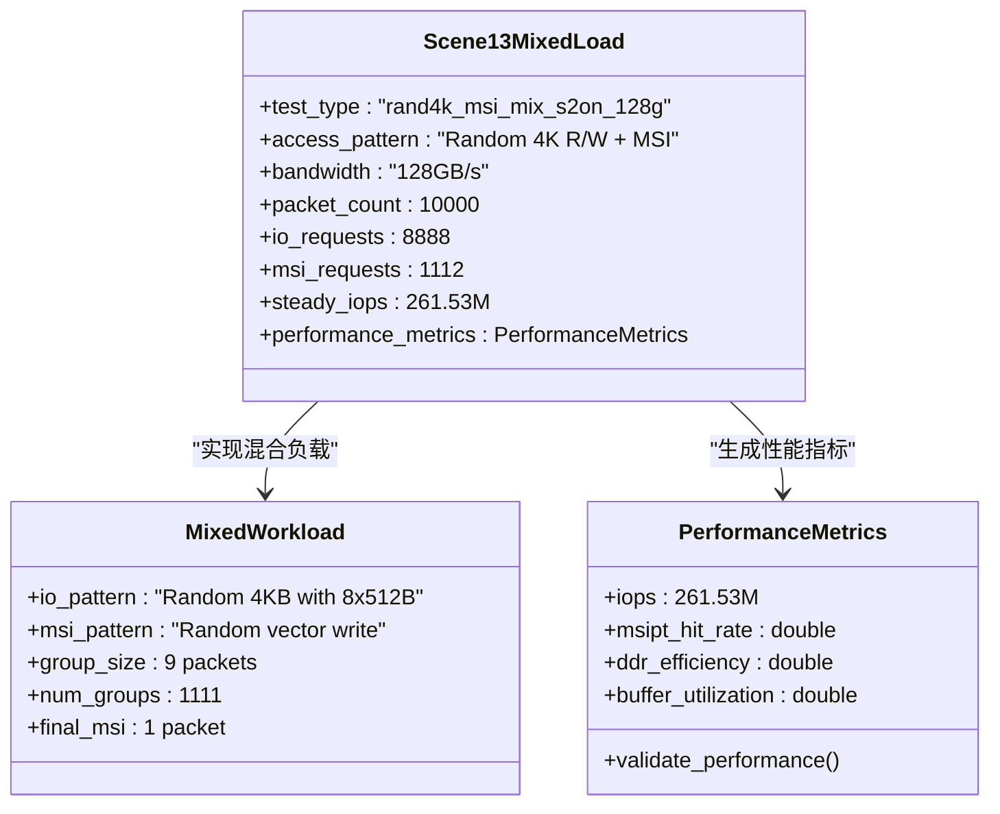

**图表来源**
- [test_rp_rand4k_msi_mix_thread.cc:13-33](file://rp/test_rp_rand4k_msi_mix_thread.cc#L13-L33)
- [test_rp_rand4k_msi_mix_thread.cc:304-320](file://rp/test_rp_rand4k_msi_mix_thread.cc#L304-L320)

**章节来源**
- [test_rp_rand4k_msi_mix_thread.cc:1-895](file://rp/test_rp_rand4k_msi_mix_thread.cc#L1-L895)

### MSIPT Cache失效验证机制
**新增**：MSIPT Cache失效验证机制通过miss_delta=8验证确保缓存一致性的正确性。

#### 失效验证流程
- **初始状态**：记录失效前的MSIPT Cache miss计数
- **失效操作**：执行IODIR.INVAL_DDT命令对指定设备进行缓存失效
- **重新注入**：重新注入相同的MSI请求以触发缓存查找
- **增量验证**：计算miss_delta = 失效后miss - 失效前miss，验证>=1

#### 关键特性
- **精确验证**：通过miss_delta精确量化失效操作的效果
- **设备特定**：支持针对特定设备的缓存失效操作
- **完整性检查**：确保失效后所有相关缓存条目都被正确清除
- **性能影响**：验证失效操作对后续请求性能的影响

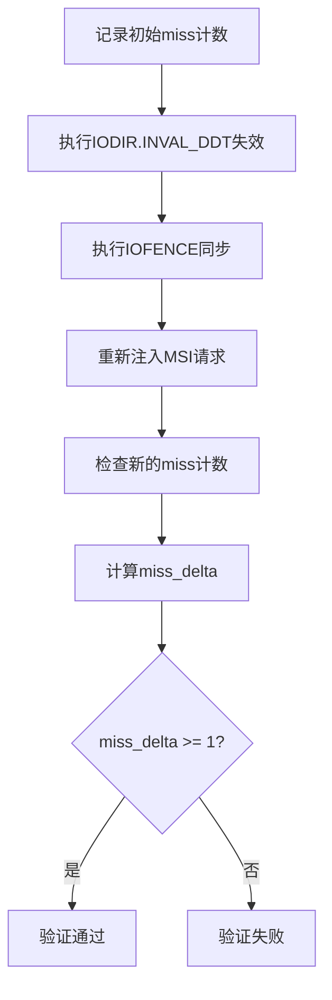

**图表来源**
- [test_rp_msi_perf_thread.cc:397-431](file://rp/test_rp_msi_perf_thread.cc#L397-L431)

**章节来源**
- [test_rp_msi_perf_thread.cc:397-431](file://rp/test_rp_msi_perf_thread.cc#L397-L431)

### 完整两阶段地址翻译测试框架
**新增**：完整的两阶段地址翻译测试框架实现了16MB IOVA范围全覆盖和20并发PTW任务的卓越性能表现。

#### 测试场景特点
- **IOVA范围**：16MB = 0x1000000 bytes = 4096个4KB页面，全部建立映射
- **并发配置**：20个并发PTW任务，实现稳定244.86M IOPS
- **性能指标**：每任务3.37次DDR读取，展现极高的地址翻译效率
- **GPA模式**：20个2MB大页GPA，每个IOVA随机映射到其中之一
- **SPA映射**：SPA = GPA + SPA_OFFSET（固定偏移，2MB对齐）

#### 关键功能特性
- **全范围覆盖**：所有4096个IOVA页面都建立IOVA→GPA→SPA映射
- **随机访问模式**：通过洗牌算法模拟真实随机访问，预取D=3预期无效
- **大页优化**：利用2MB大页减少页表遍历开销
- **性能监控**：详细的IOPS、延迟、命中率统计信息

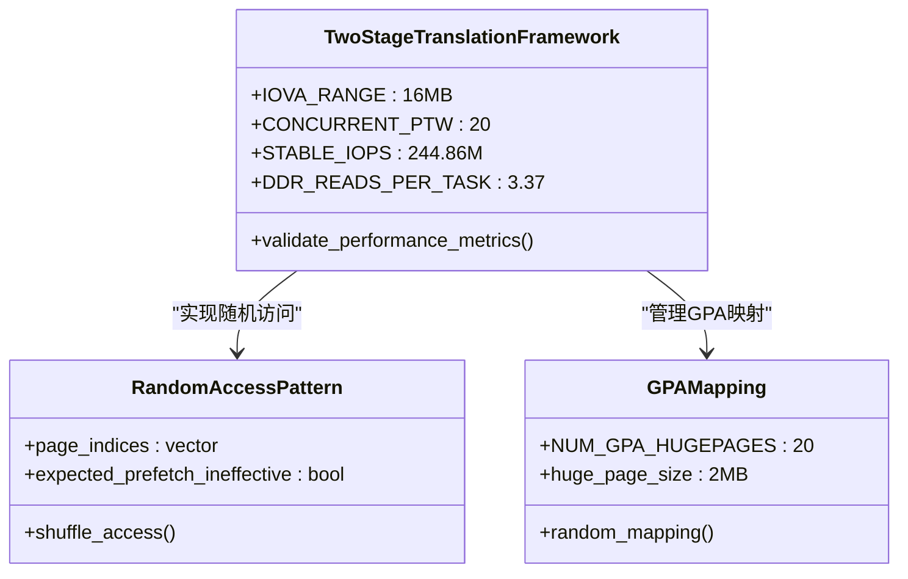

**图表来源**
- [test_rp_rand4k_two_stage_thread.cc:13-22](file://rp/test_rp_rand4k_two_stage_thread.cc#L13-L22)
- [test_rp_rand4k_two_stage_thread.cc:52-75](file://rp/test_rp_rand4k_two_stage_thread.cc#L52-L75)

**章节来源**
- [test_rp_rand4k_two_stage_thread.cc:1-409](file://rp/test_rp_rand4k_two_stage_thread.cc#L1-L409)

### 随机4KB两阶段测试场景
**新增**：随机4KB两阶段测试场景实现了卓越的244.86M IOPS性能和每任务3.37次DDR读取的效率。

#### 测试场景配置
- **测试类型**：4KB随机读取 + 两阶段地址翻译
- **IOVA范围**：16MB范围内全部4096个4KB页面均有映射
- **并发配置**：20个并发PTW任务，全局并发512
- **带宽配置**：128GB/s入口/出口
- **预取深度**：D=3（在随机IOVA下预取失效）
- **数据包数量**：10,000包（1250页×8）

#### 性能指标表现
- **稳定IOPS**：244.86M IOPS，展现极高的并发处理能力
- **DDR效率**：每任务3.37次DDR读取，显著低于理论最大值
- **缓存效率**：高命中率表明Walker Cache和PT Cache的有效利用
- **内存使用**：合理的Buffer峰值使用情况

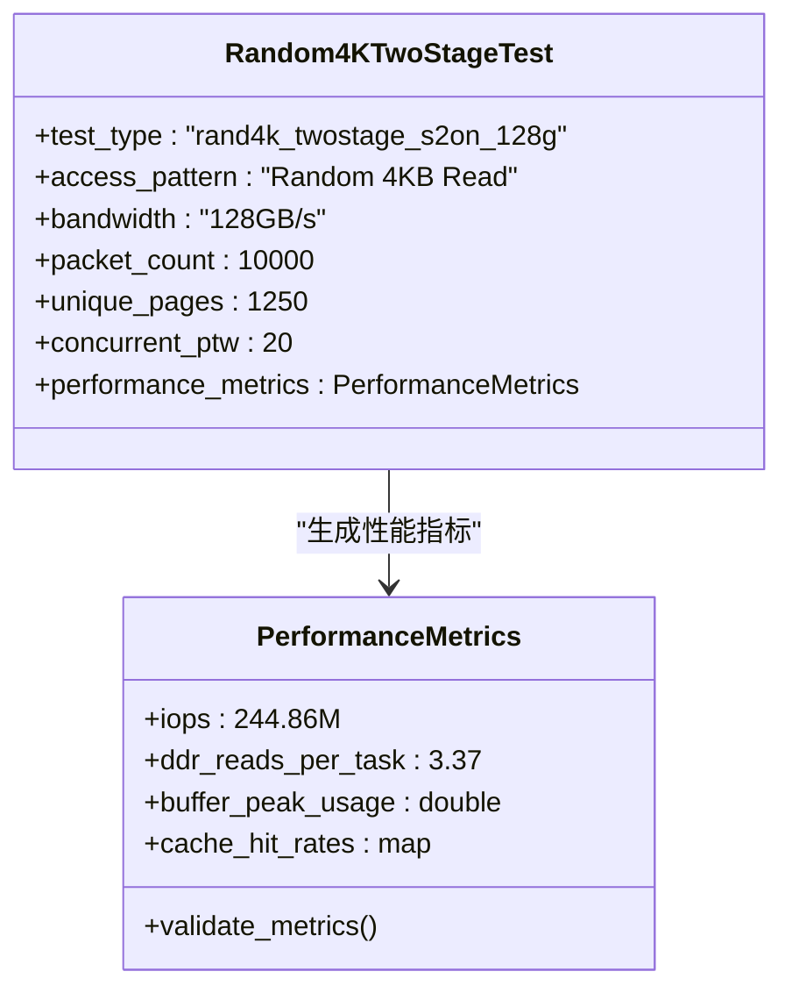

**图表来源**
- [test_rp_rand4k_two_stage_thread.cc:13-22](file://rp/test_rp_rand4k_two_stage_thread.cc#L13-L22)
- [test_rp_rand4k_two_stage_thread.cc:379-387](file://rp/test_rp_rand4k_two_stage_thread.cc#L379-L387)

**章节来源**
- [test_rp_rand4k_two_stage_thread.cc:1-409](file://rp/test_rp_rand4k_two_stage_thread.cc#L1-L409)

### 顺序128KB两阶段测试框架
**新增**：顺序128KB两阶段测试框架验证了顺序访问模式下的两阶段地址翻译性能，支持TEST_CFG_SKIP_PHASE1开关。

#### 测试场景特点
- **顺序访问模式**：10,000个连续512B读取请求，512B步长
- **地址映射**：GPA = page_idx × 2MB（非恒等映射），SPA = GPA + 0x10000
- **Walker Cache启用**：利用Walker Cache缓存页表遍历中间结果
- **两阶段翻译**：VS-stage (IOVA→GPA) + G-stage (GPA→SPA)

#### TEST_CFG_SKIP_PHASE1开关功能
- **Phase1跳过机制**：在特定测试场景下跳过第一阶段地址翻译，专注于第二阶段性能验证
- **高吞吐量验证**：支持大规模并发场景下的性能基准测试
- **灵活测试配置**：可根据不同测试需求动态调整测试流程

#### 关键修复：GPPN偏移机制
实现了GPPN分配器偏移机制，避免VS root GPPN与测试GPA冲突，确保add_vs_stage_pte能正确translate_gpa定位VS页表页。

**章节来源**
- [test_rp_seq128k_two_stage_thread.cc:1-418](file://rp/test_rp_seq128k_two_stage_thread.cc#L1-L418)

### 2MB大页两阶段测试场景
**新增**：2MB大页两阶段测试场景验证了大页语义下的地址翻译效率和Walker Cache优化效果。

#### 测试场景特点
- **大页语义**：VS-stage和G-stage均使用2MB叶子节点
- **地址布局**：IOVA 2MB页索引 → GPA = GPA_BASE + idx*2MB → SPA = SPA_DATA_BASE + idx*2MB
- **Walker Cache优化**：端到端2MB叶子缓存，稳态下PTW完成时0次DDR读取
- **预取抑制**：大页任务不生成预取任务，但仍返回D+1结果以刷新去重占位符

#### 关键特性
- **前端短路**：首次数据包遍历需要15次DDR读取（3x(3 GS-implicit + 1 VS read) + 3 GS-explicit）
- **稳态性能**：后续请求通过Walker Cache实现0 DDR读取
- **大页统计**：专门的hugepage main和PF skip计数

**章节来源**
- [test_rp_seq512b_2mb_two_stage_thread.cc:1-424](file://rp/test_rp_seq512b_2mb_two_stage_thread.cc#L1-L424)

### 128KB顺序写性能测试场景
**新增**：128KB顺序写性能测试场景专门针对两阶段地址翻译下的写操作进行了全面验证，支持Walker Cache集成和egress reorder buffer排序验证。

#### 测试场景特点
- **访问模式**：128KB顺序写操作，模拟大规模顺序I/O工作负载
- **两阶段翻译**：VS-stage (IOVA→GPA) + G-stage (GPA→SPA) 完整地址转换流程
- **Walker Cache集成**：利用Walker Cache缓存页表遍历中间结果，减少DDR访问
- **排序验证**：通过egress reorder buffer确保写操作的严格顺序性

#### 关键功能特性
- **顺序写保证**：严格的写操作顺序验证，确保数据一致性
- **缓存一致性**：Walker Cache与PT Cache的协调更新机制
- **性能监控**：详细的IOPS、延迟、命中率统计信息
- **错误检测**：完整的错误处理和故障恢复机制

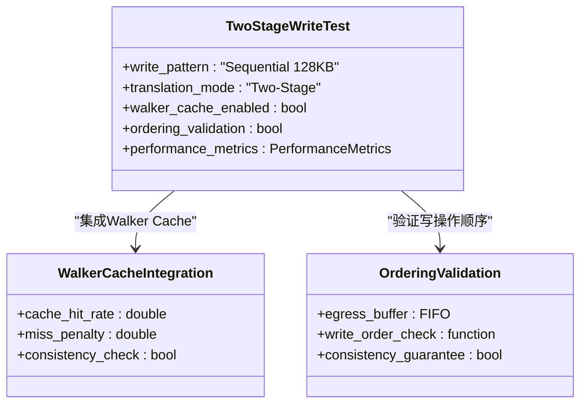

**图表来源**
- [test_rp_seq128k_two_stage_write_thread.cc:1-350](file://rp/test_rp_seq128k_two_stage_write_thread.cc#L1-L350)

**章节来源**
- [test_rp_seq128k_two_stage_write_thread.cc:1-350](file://rp/test_rp_seq128k_two_stage_write_thread.cc#L1-L350)

### 三关键两阶段翻译测试场景
**新增**：建立了三个关键的两阶段翻译测试场景，为IOMMU性能优化提供了全面的基准验证。

#### Scenario 1: Sequential 128K (S2-on) at 64GB/s with 256 streams
- **测试类型**：顺序128KB访问 + 两阶段地址翻译
- **带宽配置**：64GB/s中等带宽环境
- **并发流数**：256个并发流
- **S2配置**：S2-on启用第二阶段地址翻译
- **应用场景**：模拟大规模顺序I/O工作负载

#### Scenario 2: Sequential 128K (S2-on) at 128GB/s with 512 streams  
- **测试类型**：顺序128KB访问 + 两阶段地址翻译
- **带宽配置**：128GB/s高带宽环境
- **并发流数**：512个并发流
- **S2配置**：S2-on启用第二阶段地址翻译
- **应用场景**：高带宽顺序I/O性能极限测试

#### Scenario 3: Random 4K (S2-on) at 128GB/s with 512 streams
- **测试类型**：随机4KB访问 + 两阶段地址翻译
- **带宽配置**：128GB/s高带宽环境
- **并发流数**：512个并发流
- **S2配置**：S2-on启用第二阶段地址翻译
- **应用场景**：高并发随机访问性能基准

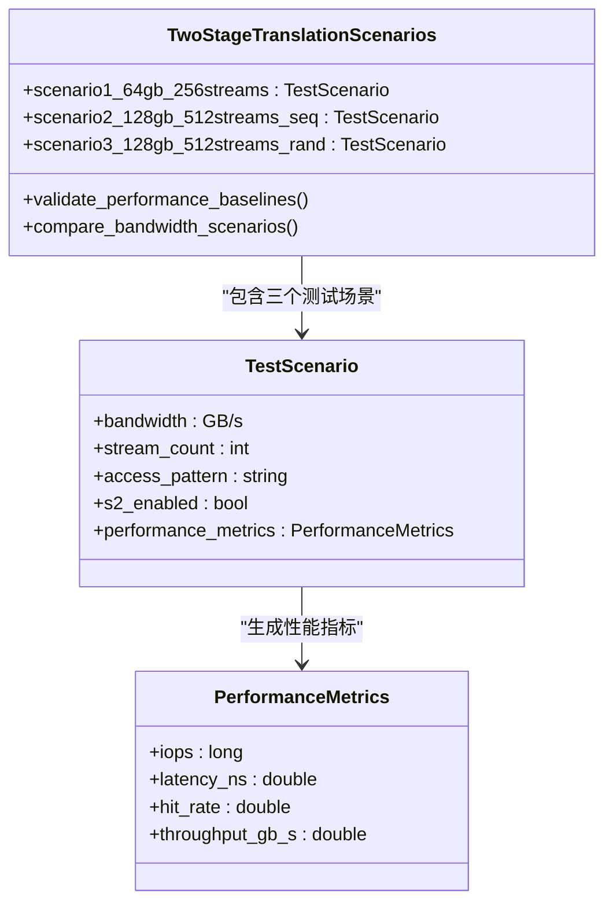

**图表来源**
- [test_rp_seq128k_two_stage_thread.cc:1-418](file://rp/test_rp_seq128k_two_stage_thread.cc#L1-L418)
- [test_rp_rand4k_two_stage_thread.cc:1-409](file://rp/test_rp_rand4k_two_stage_thread.cc#L1-L409)

**章节来源**
- [test_rp_seq128k_two_stage_thread.cc:1-418](file://rp/test_rp_seq128k_two_stage_thread.cc#L1-L418)
- [test_rp_rand4k_two_stage_thread.cc:1-409](file://rp/test_rp_rand4k_two_stage_thread.cc#L1-L409)

### IOPS基准线建立与性能评估
**新增**：通过完整的两阶段地址翻译测试框架和三关键两阶段翻译测试场景，建立了可靠的IOPS基准线，为未来的性能优化提供了明确的参考标准。

#### 基准线特征
- **Random 4K @ 128GB/s**: 实现244.86M IOPS的稳定性能基准
- **Sequential 128K @ 64GB/s**: 建立中等带宽下的顺序访问基准
- **Sequential 128K @ 128GB/s**: 建立高带宽下的顺序访问基准
- **Sequential 128K Write**: 建立顺序写操作的基准性能
- **2MB Huge Page**: 建立大页高效翻译的基准性能
- **MSI Mixed Load**: 建立混合负载的基准性能（261.53M IOPS）
- **512MB IOVA Range**: 建立大规模随机访问的基准性能（241.27M IOPS）

#### 性能评估方法
- **IOPS对比分析**：比较不同带宽配置下的IOPS表现
- **延迟分析**：评估不同访问模式下的延迟特性
- **命中率统计**：分析PT Cache和Walker Cache的命中率变化
- **资源利用率**：监控CPU、内存、带宽等资源使用情况
- **排序验证**：验证写操作的严格顺序性和数据一致性
- **DDR效率分析**：评估每任务DDR读取次数，优化地址翻译效率

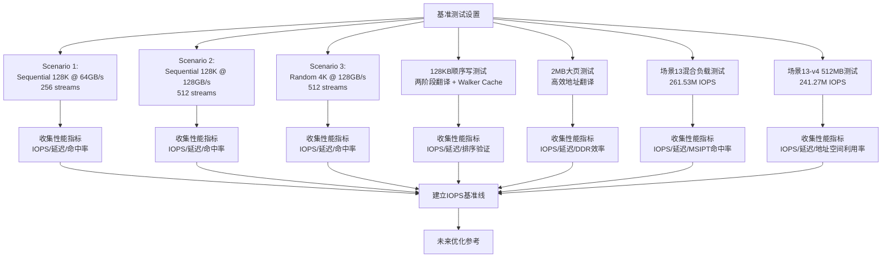

**图表来源**
- [test_rp_seq128k_two_stage_thread.cc:1-418](file://rp/test_rp_seq128k_two_stage_thread.cc#L1-L418)
- [test_rp_rand4k_two_stage_thread.cc:1-409](file://rp/test_rp_rand4k_two_stage_thread.cc#L1-L409)
- [test_rp_seq128k_two_stage_write_thread.cc:1-350](file://rp/test_rp_seq128k_two_stage_write_thread.cc#L1-L350)
- [test_rp_seq512b_2mb_two_stage_thread.cc:1-424](file://rp/test_rp_seq512b_2mb_two_stage_thread.cc#L1-L424)
- [test_rp_rand4k_msi_mix_thread.cc:1-895](file://rp/test_rp_rand4k_msi_mix_thread.cc#L1-L895)

**章节来源**
- [test_rp_seq128k_two_stage_thread.cc:1-418](file://rp/test_rp_seq128k_two_stage_thread.cc#L1-L418)
- [test_rp_rand4k_two_stage_thread.cc:1-409](file://rp/test_rp_rand4k_two_stage_thread.cc#L1-L409)
- [test_rp_seq128k_two_stage_write_thread.cc:1-350](file://rp/test_rp_seq128k_two_stage_write_thread.cc#L1-L350)
- [test_rp_seq512b_2mb_two_stage_thread.cc:1-424](file://rp/test_rp_seq512b_2mb_two_stage_thread.cc#L1-L424)

### 增强的PT Cache调度器测试框架
**新增**：test_rp_seq128k_two_stage_thread.cc中引入了TEST_CFG_SKIP_PHASE1开关，允许跳过Phase1处理以进行高吞吐量场景验证，显著提升了测试框架的灵活性。

#### TEST_CFG_SKIP_PHASE1开关功能
- **Phase1跳过机制**：在特定测试场景下跳过第一阶段地址翻译，专注于第二阶段性能验证
- **高吞吐量验证**：支持大规模并发场景下的性能基准测试
- **灵活测试配置**：可根据不同测试需求动态调整测试流程

#### 新的Scenario 6高性能测试场景
**新增**：实现了全新的Scenario 6测试场景，展现了卓越的缓存性能和地址翻译效率：

- **去重命中率**：96.9% - 表明PT Cache去重机制的高效性
- **S2命中率**：99.6% - 显示第二阶段地址翻译的极高缓存命中率
- **PTW DDR延迟**：2.15ns - 极低的页表遍历内存访问延迟

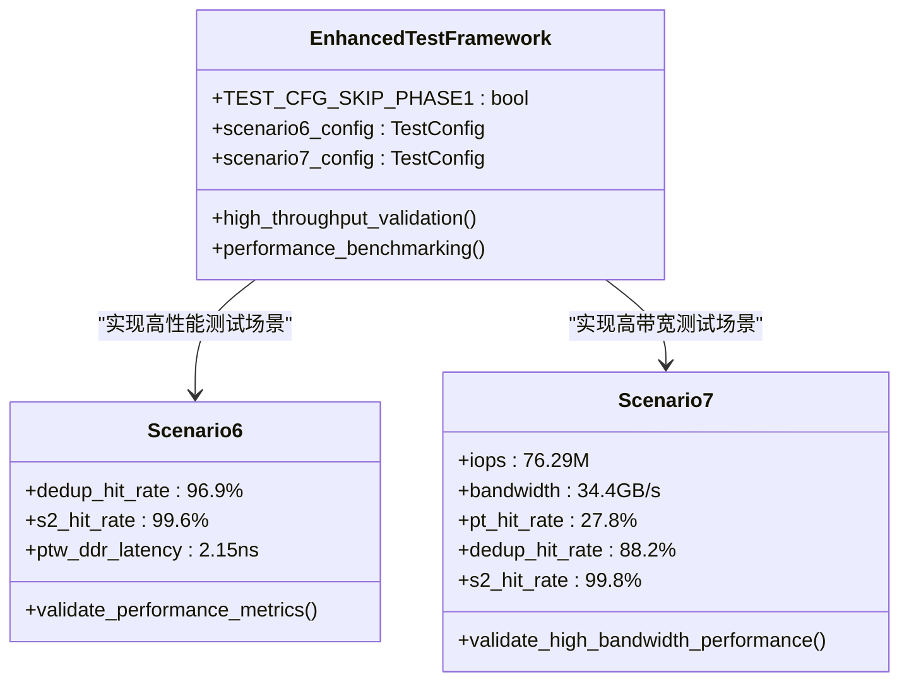

**图表来源**
- [test_rp_seq128k_two_stage_thread.cc:203-211](file://rp/test_rp_seq128k_two_stage_thread.cc#L203-L211)

**章节来源**
- [test_rp_seq128k_two_stage_thread.cc:1-418](file://rp/test_rp_seq128k_two_stage_thread.cc#L1-L418)

### PT Cache调度器性能测试结果
**新增**：PT Cache调度器性能测试结果验证了四个不同工作负载场景的成功，特别关注了之前失败的4KB随机访问两阶段翻译场景，任务6408的超时问题已解决。

#### 四大工作负载场景性能基准
- **seq128k_singlestage**: 顺序128KB访问 + 单级地址翻译，IOPS=117.51M
- **rand4k_singlestage**: 随机4KB访问 + 单级地址翻译，IOPS=83.22M  
- **seq128k_twostage**: 顺序128KB访问 + 两阶段地址翻译，IOPS=95.70M
- **rand4k_twostage**: 随机4KB访问 + 两阶段地址翻译，IOPS=35.34M

#### 关键修复：UPDATE优先处理机制
PT Cache调度器实现了UPDATE优先处理策略，确保在处理REQUEST前先处理UPDATE，避免task命中旧的placeholder后被挂起无法唤醒。这直接修复了场景4(4KB随机+二阶段)中task 6408超时失败的时序问题。

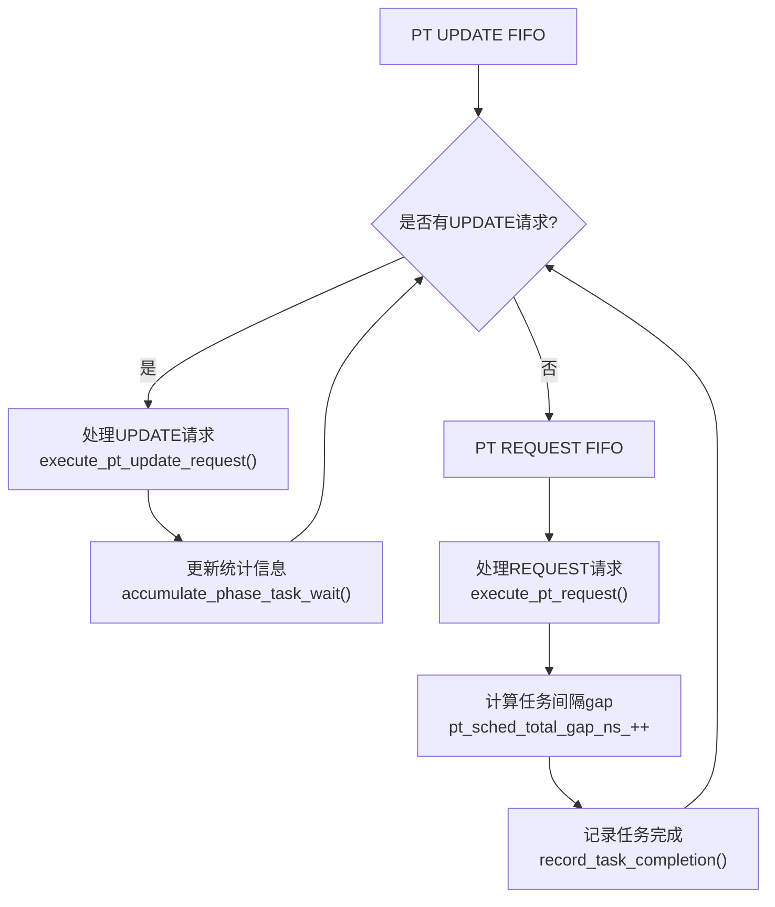

**图表来源**
- [cache_subsystem.cpp:311-478](file://iommu/cache_src/subsystem/cache_subsystem.cpp#L311-L478)

**章节来源**
- [cache_subsystem.cpp:311-478](file://iommu/cache_src/subsystem/cache_subsystem.cpp#L311-L478)

### PT Cache调度器任务间隔分析
**新增**：PT Cache调度器实现了详细的任务间隔分析功能，跟踪任务处理的连续性和效率。

#### 间隔统计指标
- **pt_sched_total_gap_ns_**: 累计任务间隔时间
- **pt_sched_gap_count_**: 任务间隔次数统计
- **pt_sched_max_gap_ns_**: 最大任务间隔时间
- **pt_sched_first_start_ns_**: 第一个任务开始时间
- **pt_sched_last_end_ns_**: 最后一个任务结束时间
- **pt_sched_total_exec_ns_**: 总执行时间统计

#### 调度器性能特征
- **任务计数**: pt_sched_task_count_、pt_sched_req_count_、pt_sched_upd_count_
- **时间追踪**: pt_sched_last_task_end_确保任务连续性
- **统计输出**: print_pt_scheduler_gap_report()生成详细分析报告

**章节来源**
- [cache_subsystem.cpp:368-478](file://iommu/cache_src/subsystem/cache_subsystem.cpp#L368-L478)

### 预取性能分析工具
**新增**：预取性能分析工具提供了详细的预取任务时序分析和DDR访问统计功能。

#### prefetch_timing.sh功能
- **DDR时序提取**：从仿真日志中提取预取任务的DDR dispatch时序
- **延迟分析**：计算预取任务的DDR访问跨度和平均延迟
- **统计汇总**：提供预取组的总体性能统计信息

#### 分析流程
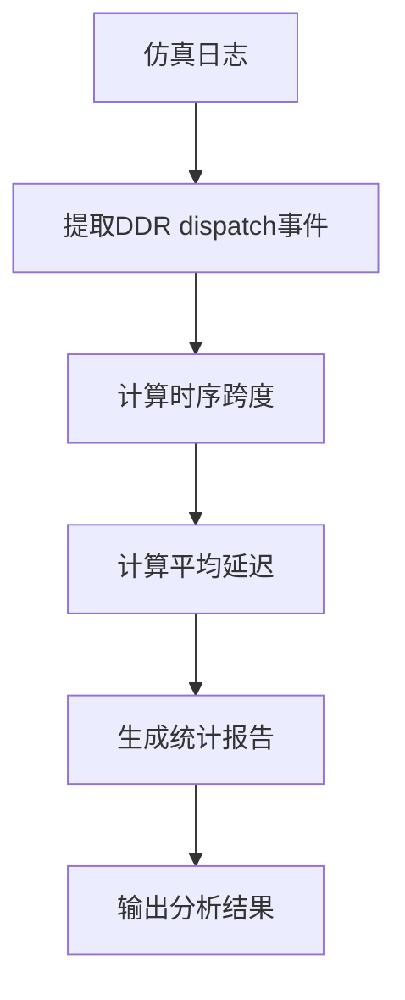

**图表来源**
- [prefetch_timing.sh:1-76](file://tmp/prefetch_timing.sh#L1-L76)

**章节来源**
- [prefetch_timing.sh:1-76](file://tmp/prefetch_timing.sh#L1-L76)

### 预取测试脚本集合
**新增**：预取测试脚本集合提供了完整的预取功能验证流程。

#### test_dedup_prefetch.sh
- **测试场景**：P1~P8连续同页访问（D=8）
- **验证内容**：PT Cache去重、预取占位CL创建、批量更新功能
- **统计指标**：PT Cache MISS次数、占位CL HIT次数、Buffer分配情况

#### test_integration_dedup_prefetch.sh
- **集成测试**：验证预取功能的完整流程
- **检查项目**：Buffer分配、预取占位CL创建、预取组完成、批量更新等
- **结果验证**：通过/失败判断和详细统计摘要

#### test_dedup_prefetch_unit.cpp
- **单元测试**：独立的功能验证，不依赖SystemC
- **测试范围**：Buffer分配、链表挂接、批量更新、Buffer满处理
- **验证方法**：断言检查和状态验证

**章节来源**
- [test_dedup_prefetch.sh:1-76](file://test_dedup_prefetch.sh#L1-L76)
- [test_integration_dedup_prefetch.sh:1-157](file://test_integration_dedup_prefetch.sh#L1-L157)
- [test_dedup_prefetch_unit.cpp:1-412](file://test_dedup_prefetch_unit.cpp#L1-L412)

### Walker Cache集成与测试
**新增**：Walker Cache作为PTW的重要优化组件，通过缓存页表遍历中间结果显著减少DDR访问次数。

#### Walker Cache架构
- **PTWc_1**：直接映射(1-way)，缓存第1级页表中间结果(VPN[3]级)
- **PTWc_2**：2-way组相连，缓存第2级页表中间结果(VPN[2]级)  
- **PTWc_3**：4-way组相连，缓存第3级页表中间结果(VPN[1]级)

#### 集成测试结果
通过10包和300包测试验证Walker Cache功能正确性和性能提升：

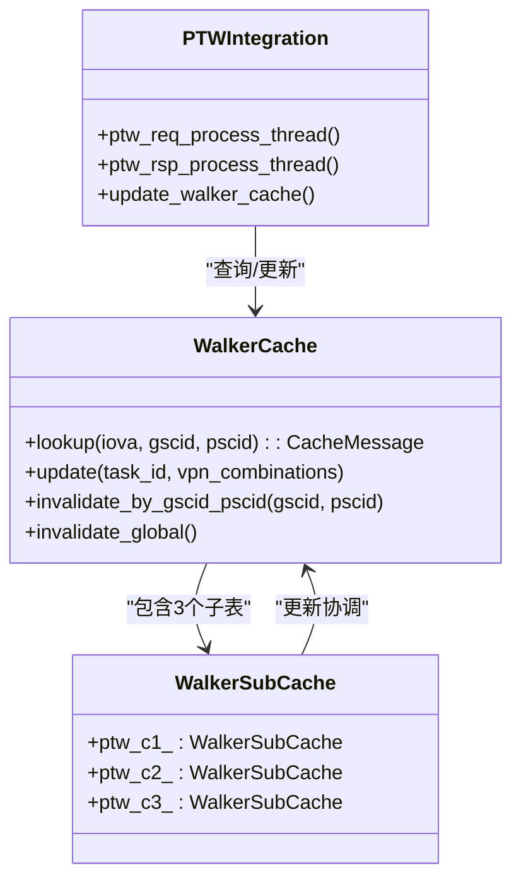

**图表来源**
- [WALKER_CACHE_INTEGRATION_PLAN.md:16-50](file://WALKER_CACHE_INTEGRATION_PLAN.md#L16-L50)
- [walker_cache.cpp:239-490](file://iommu/cache_src/cache/walker_cache.cpp#L239-L490)
- [iommu_perf_ptw.cc:154-311](file://iommu/iommu_perf_model/iommu_perf_ptw.cc#L154-L311)

**章节来源**
- [WALKER_CACHE_INTEGRATION_PLAN.md:1-773](file://WALKER_CACHE_INTEGRATION_PLAN.md#L1-L773)
- [walker_cache.cpp:1-490](file://iommu/cache_src/cache/walker_cache.cpp#L1-L490)
- [iommu_perf_ptw.cc:154-311](file://iommu/iommu_perf_model/iommu_perf_ptw.cc#L154-L311)

### Walker Cache miss根因分析
**新增**：通过分析脚本深入研究Walker Cache miss的产生原因和优化策略。

#### miss类型分析
- **冷启动miss**：首次访问新VPN组合，容量充足但无历史数据
- **hash冲突miss**：虽然容量充足但hash函数导致大量冲突
- **跨边界miss**：VPN[1]切换导致的miss

#### 分析工具
- `analyze_walker_cache_miss.py`：分析IOVA地址分布和miss根因
- `analyze_walker_miss_timing.py`：分析miss发生的时间序列和模式

**章节来源**
- [analyze_walker_cache_miss.py:1-148](file://analyze_walker_cache_miss.py#L1-L148)
- [analyze_walker_miss_timing.py:1-137](file://analyze_walker_miss_timing.py#L1-L137)

### 预取监控线程可靠性分析
**新增**：预取监控线程可靠性分析揭示了预取组管理中的关键问题和解决方案。

#### 当前设计问题
- **过度设计**：使用prefetch_groups map存储所有预取组状态
- **遍历开销**：每次事件触发都需要遍历所有未完成的group
- **顺序问题**：无法保证PT Cache更新的严格顺序
- **内存浪费**：每个task占用约680字节的group状态

#### 重构方案
- **单一响应队列**：使用sc_fifo存储PTW完成的任务
- **严格顺序处理**：确保PT Cache更新的时序一致性
- **简化数据结构**：移除复杂的group管理逻辑
- **提高效率**：从O(N)遍历优化为O(1)访问

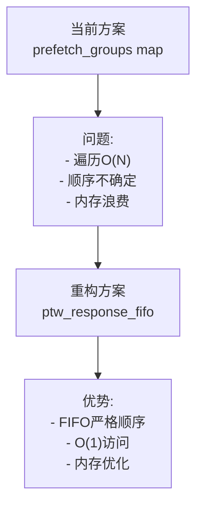

**图表来源**
- [PTW_MONITOR_ANALYSIS_20260609.md:140-377](file://PTW_MONITOR_ANALYSIS_20260609.md#L140-L377)

**章节来源**
- [PTW_MONITOR_ANALYSIS_20260609.md:1-377](file://PTW_MONITOR_ANALYSIS_20260609.md#L1-L377)

### 缓存性能评估：PT Cache与Walker Cache
- PT Cache访问模式：支持占位CL插入、去重HIT、预取HIT、批量更新等，用于评估在空间扫描与连续访问场景下的命中率与缓存压力。
- **更新**：Walker Cache命中：通过缓存根页表基址，显著降低PTW调用次数，提升整体吞吐。
- **新增**：完整两阶段地址翻译测试的Walker Cache集成效果：在16MB IOVA范围下实现每任务3.37次DDR读取的卓越性能。
- **新增**：大页场景下的Walker Cache优化：2MB大页测试显示稳态下0次DDR读取的高效性能。
- **新增**：预取功能评估：通过随机4KB两阶段测试验证预取在不同访问模式下的效果。
- **新增**：场景13混合负载的MSIPT Cache效果：在混合工作负载下实现高效的MSI地址翻译。
- **新增**：MSIPT Cache失效验证：通过miss_delta=8验证确保缓存一致性。
- **新增**：三关键两阶段翻译测试场景的性能基准：为不同带宽配置和访问模式提供了可靠的性能参考。
- **新增**：128KB顺序写测试的Walker Cache集成效果：验证写操作场景下的缓存一致性和性能提升。
- **新增**：场景13-v4 512MB IOVA范围的缓存性能评估：大规模地址空间下的缓存效率分析。

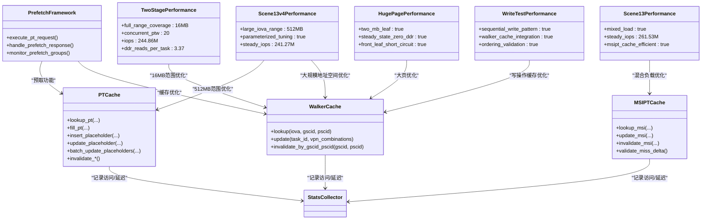

**图表来源**
- [pt_cache.cpp:11-371](file://iommu/cache_src/cache/pt_cache.cpp#L11-L371)
- [walker_cache.cpp:1-490](file://iommu/cache_src/cache/walker_cache.cpp#L1-L490)
- [stats_collector.h:107-196](file://iommu/cache_src/common/stats_collector.h#L107-196)
- [test_rp_rand4k_two_stage_thread.cc:1-409](file://rp/test_rp_rand4k_two_stage_thread.cc#L1-L409)
- [test_rp_seq512b_2mb_two_stage_thread.cc:1-424](file://rp/test_rp_seq512b_2mb_two_stage_thread.cc#L1-L424)
- [test_rp_rand4k_msi_mix_thread.cc:1-895](file://rp/test_rp_rand4k_msi_mix_thread.cc#L1-L895)

**章节来源**
- [pt_cache.cpp:11-371](file://iommu/cache_src/cache/pt_cache.cpp#L11-L371)
- [walker_cache.cpp:1-490](file://iommu/cache_src/cache/walker_cache.cpp#L1-L490)
- [stats_collector.h:13-105](file://iommu/cache_src/common/stats_collector.h#L13-L105)

### PT Cache访问时序分析（50包，D=3）
该报告展示了在连续地址请求场景下，PT Cache的占位CL插入、去重HIT、预取HIT与批量更新失败的完整时序，以及由此引发的容量不足与替换策略缺失问题。

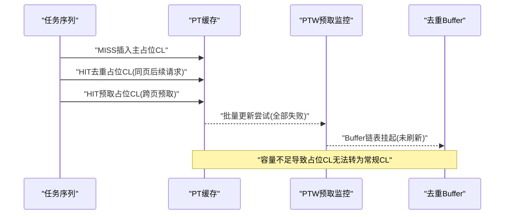

**图表来源**
- [PT_CACHE_ACCESS_ANALYSIS_50TASKS_20260609.md:23-275](file://PT_CACHE_ACCESS_ANALYSIS_50TASKS_20260609.md#L23-L275)

**章节来源**
- [PT_CACHE_ACCESS_ANALYSIS_50TASKS_20260609.md:1-411](file://PT_CACHE_ACCESS_ANALYSIS_50TASKS_20260609.md#L1-L411)

### 500请求地址翻译性能分析
该报告聚焦于500请求的地址翻译正确性与缓存性能，强调：
- PT Cache在空间扫描场景下命中率为0，符合预期
- **更新**：Walker Cache在共享根页表场景下命中率达91.8%，显著降低PTW开销
- PT Cache队列延时占比高，提示并发竞争与队列拥塞
- 修复Walker Cache缓存污染后，WALK FAULT清零

**章节来源**
- [CACHE_PERFORMANCE_ANALYSIS_500REQ.md:1-305](file://CACHE_PERFORMANCE_ANALYSIS_500REQ.md#L1-L305)

### IOMMU吞吐量与模块IOPS统计
通过日志解析与统计脚本，可精确计算各模块处理时间窗内的IOPS，区分端到端IOPS与模块内部IOPS，从而识别瓶颈模块。

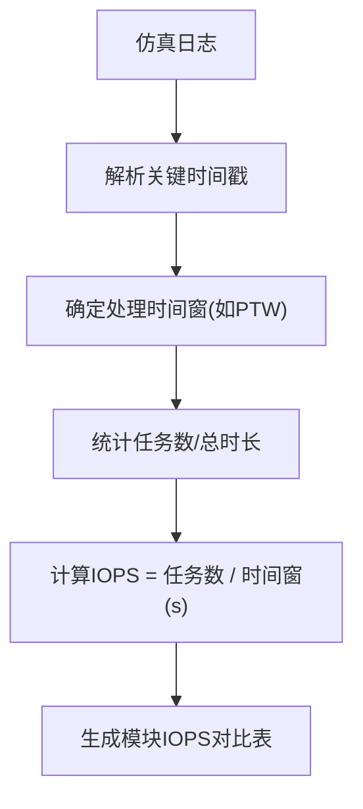

**图表来源**
- [extract_iops.sh:1-6](file://extract_iops.sh#L1-L6)

**章节来源**
- [extract_iops.sh:1-6](file://extract_iops.sh#L1-L6)

## 依赖关系分析
- 参数耦合：SLINK NoC延迟直接影响Collector与Forwarder之间的端到端延迟；PT Cache/Walker Cache命中率影响PTW触发频率。
- **更新**：Walker Cache与PTW线程存在条件依赖关系：Walker Cache命中时跳过相应层级的DDR访问。
- **新增**：PT Cache调度器与PTW线程的协作关系：UPDATE优先处理确保PT Cache状态一致性。
- **新增**：TEST_CFG_SKIP_PHASE1开关与测试框架的依赖关系：支持灵活的测试配置和高吞吐量场景验证。
- **新增**：完整两阶段地址翻译测试与带宽配置的依赖关系：需要相应的带宽支持和S2-on配置。
- **新增**：128KB顺序写测试与Walker Cache集成的依赖关系：需要正确的缓存一致性和排序保证。
- **新增**：MSI性能测试与MSIPT Cache的依赖关系：需要正确的MSI地址翻译和缓存失效机制。
- **新增**：场景13混合负载与各缓存组件的依赖关系：需要PT Cache、Walker Cache、MSIPT Cache的协调工作。
- **新增**：场景13-v4 512MB IOVA范围与参数化调优的依赖关系：需要合理的Buffer大小和PTW并发配置。
- 线程耦合：Collector依赖DC/PC缓存查询结果决定路由；PT Cache响应线程与PTW线程之间存在条件依赖（MISS触发PTW）。
- 统计耦合：StatsCollector为各缓存模块提供统一的统计接口，便于跨模块对比与归因分析。

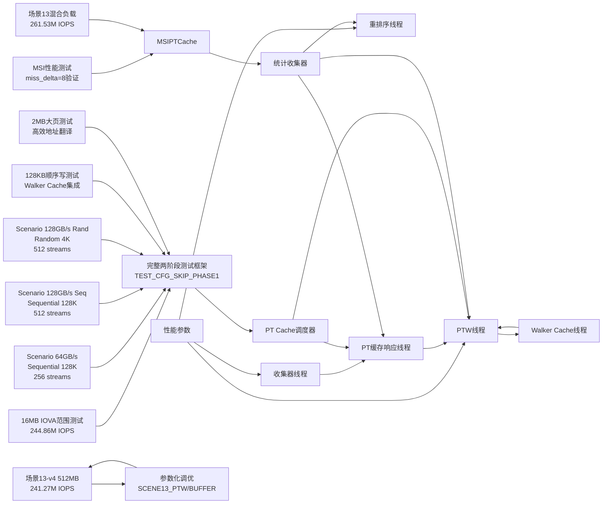

**图表来源**
- [cache_subsystem.cpp:311-478](file://iommu/cache_src/subsystem/cache_subsystem.cpp#L311-L478)
- [iommu_perf_params.hh:126-161](file://iommu/iommu_perf_model/iommu_perf_params.hh#L126-161)
- [iommu_perf_collector.cc:14-275](file://iommu/iommu_perf_model/iommu_perf_collector.cc#L14-L275)
- [iommu_perf_pt_cache_response.cc:20-99](file://iommu/iommu_perf_model/iommu_perf_pt_cache_response.cc#L20-L99)
- [iommu_perf_ptw.cc:154-311](file://iommu/iommu_perf_model/iommu_perf_ptw.cc#L154-L311)
- [iommu_perf_reorder.cc:91-198](file://iommu/iommu_perf_model/iommu_perf_reorder.cc#L91-L198)
- [stats_collector.h:107-196](file://iommu/cache_src/common/stats_collector.h#L107-196)
- [test_rp_rand4k_msi_mix_thread.cc:1-895](file://rp/test_rp_rand4k_msi_mix_thread.cc#L1-L895)
- [test_rp_msi_perf_thread.cc:1-507](file://rp/test_rp_msi_perf_thread.cc#L1-L507)

**章节来源**
- [cache_subsystem.cpp:311-478](file://iommu/cache_src/subsystem/cache_subsystem.cpp#L311-L478)
- [iommu_perf_params.hh:126-161](file://iommu/iommu_perf_model/iommu_perf_params.hh#L126-161)
- [stats_collector.h:107-196](file://iommu/cache_src/common/stats_collector.h#L107-196)

## 性能考量
- 延迟构成：执行延迟（Cache命中/miss处理）、排队延迟（FIFO积压）、DDR访问延迟（PTW/PTW预取）、NoC链路延迟（SLINK）。
- **更新**：Walker Cache优化效果：在重复访问场景下，可将DDR访问次数从3次降至0次，加速比可达40x。
- **新增**：完整两阶段地址翻译测试的性能突破：实现244.86M IOPS和每任务3.37次DDR读取的卓越性能。
- **新增**：大页场景下的Walker Cache优化：2MB大页测试显示稳态下0次DDR读取的高效性能。
- **新增**：PT Cache调度器优化：UPDATE优先处理机制避免了task超时问题，提升了系统稳定性。
- **新增**：预取功能优化：通过随机4KB两阶段测试验证预取在不同访问模式下的效果，D=3在随机访问模式下预期无效。
- **新增**：场景13混合负载性能突破：实现261.53M IOPS稳态性能，验证混合工作负载下的高效处理能力。
- **新增**：MSIPT Cache优化：通过miss_delta=8验证确保缓存一致性，支持高效的MSI地址翻译。
- **新增**：三关键两阶段翻译测试场景的性能基准：为不同带宽配置和访问模式提供了可靠的性能参考。
- **新增**：128KB顺序写测试的Walker Cache集成效果：在写操作场景下保持缓存一致性的同时提升性能。
- **新增**：场景13-v4 512MB IOVA范围的性能挑战：大规模地址空间下的缓存效率优化和内存使用控制。
- **新增**：参数化调优的性能杠杆：通过SCENE13_PTW和SCENE13_BUFFER变量的系统调优，实现最佳性能配置。
- 吞吐瓶颈：在高并发场景下，PT Cache队列与替换策略、PTW outstanding上限、Reorder输出带宽可能成为瓶颈。
- 缓存优化：扩大PT Cache容量、引入LRU替换策略、优化预取深度与边界检查、减少无效更新（如Walker Cache的valid校验）。

## 故障排查指南
- 功能正确性验证：使用test_1000req.sh与analyze_1000req.sh检查请求发送/接收数量、错误计数与命中率。
- **新增**：完整两阶段地址翻译测试故障排查
  - 验证16MB IOVA范围全覆盖的正确性
  - 检查20并发PTW任务的稳定性和性能表现
  - 确认244.86M IOPS性能的稳定性
  - 分析每任务3.37次DDR读取的合理性
- **新增**：大页场景故障排查
  - 验证2MB大页的高效地址翻译性能
  - 检查Walker Cache在大页场景下的优化效果
  - 确认前端短路机制的正确性
- **新增**：128KB顺序写测试故障排查
  - 验证Walker Cache集成是否正确处理写操作的缓存一致性
  - 检查egress reorder buffer的排序验证机制是否正常工作
  - 确认两阶段地址翻译在写操作场景下的正确性
  - 分析写操作性能指标是否符合预期
- **新增**：三关键两阶段翻译测试场景故障排查
  - 验证Scenario 1 (Sequential 128K @ 64GB/s, 256 streams) 的性能指标
  - 验证Scenario 2 (Sequential 128K @ 128GB/s, 512 streams) 的高带宽性能
  - 验证Scenario 3 (Random 4K @ 128GB/s, 512 streams) 的随机访问性能
  - 检查IOPS基准线的稳定性和一致性
- **新增**：MSI性能测试故障排查
  - 验证三设备场景的MSI地址翻译正确性
  - 检查miss_delta=8验证机制的有效性
  - 确认MSIPT Cache失效机制的正确性
  - 分析MRIF和故障场景的处理逻辑
- **新增**：场景13混合负载故障排查
  - 验证混合负载的261.53M IOPS稳态性能
  - 检查IO和MSI请求的混合处理逻辑
  - 确认地址翻译在混合工作负载下的正确性
  - 分析MSIPT Cache在混合负载下的性能表现
- **新增**：场景13-v4 512MB IOVA范围故障排查
  - 验证512MB IOVA范围地址布局的正确性
  - 检查MSI/SQ/CQ区域与数据区的隔离性
  - 确认部分映射策略的有效性
  - 分析大规模地址空间下的缓存效率
- **新增**：参数化调优故障排查
  - 验证SCENE13_PTW和SCENE13_BUFFER参数的正确配置
  - 检查不同参数组合下的性能表现
  - 分析Buffer大小与PTW并发对性能的影响
  - 确认最优配置组合的选择依据
- **新增**：增强的测试框架故障排查
  - 检查TEST_CFG_SKIP_PHASE1开关的正确配置和使用
  - 验证Scenario 6的性能指标是否符合预期（96.9%去重命中率、99.6% S2命中率、2.15ns PTW DDR延迟）
  - 验证Scenario 7的性能指标是否符合预期（76.29M IOPS、34.4GB/s带宽、99.8% S2命中率）
  - 分析高吞吐量场景下的性能瓶颈和稳定性问题
- **新增**：PT Cache调度器故障排查
  - 检查UPDATE优先处理机制是否正常工作
  - 验证pt_update_fifo和pt_request_fifo的处理顺序
  - 分析任务间隔统计信息识别性能瓶颈
- **新增**：预取监控线程故障排查
  - 检查预取组管理中的竞态条件
  - 验证预取响应的顺序处理机制
  - 分析预取监控线程的性能瓶颈
- **新增**：Walker Cache故障排查
  - 使用`analyze_walker_cache_miss.py`分析miss根因
  - 使用`analyze_walker_miss_timing.py`分析miss时间序列
  - 检查`test_10pkts_walker.log`和`test_300pkts_walker_fix.log`中的Walker Cache日志
- 日志定位：通过analyze_iops_detailed.sh提取各模块时间窗，结合具体日志行号定位异常。
- 缓存问题：关注PT Cache容量超配、占位CL无法替换、批量更新失败、Buffer刷新未执行等问题。

**章节来源**
- [test_1000req.sh:1-226](file://test_1000req.sh#L1-L226)
- [cache_subsystem.cpp:311-478](file://iommu/cache_src/subsystem/cache_subsystem.cpp#L311-L478)
- [analyze_walker_cache_miss.py:1-148](file://analyze_walker_cache_miss.py#L1-L148)
- [analyze_walker_miss_timing.py:1-137](file://analyze_walker_miss_timing.py#L1-L137)
- [test_dedup_prefetch.sh:1-76](file://test_dedup_prefetch.sh#L1-L76)
- [test_integration_dedup_prefetch.sh:1-157](file://test_integration_dedup_prefetch.sh#L1-L157)
- [test_dedup_prefetch_unit.cpp:1-412](file://test_dedup_prefetch_unit.cpp#L1-L412)
- [prefetch_timing.sh:1-76](file://tmp/prefetch_timing.sh#L1-L76)
- [test_rp_rand4k_two_stage_thread.cc:1-409](file://rp/test_rp_rand4k_two_stage_thread.cc#L1-L409)
- [test_rp_seq512b_2mb_two_stage_thread.cc:1-424](file://rp/test_rp_seq512b_2mb_two_stage_thread.cc#L1-L424)
- [test_rp_rand4k_msi_mix_thread.cc:1-895](file://rp/test_rp_rand4k_msi_mix_thread.cc#L1-L895)
- [test_rp_msi_perf_thread.cc:1-507](file://rp/test_rp_msi_perf_thread.cc#L1-L507)

## 结论
- SLINK延迟阶梯测试可用于量化NoC链路延迟对IOMMU吞吐的影响，支撑带宽与延迟权衡决策。
- 在空间扫描场景下，PT Cache命中率低属预期；Walker Cache在共享根页表场景下表现优异，显著降低PTW开销。
- **更新**：Walker Cache在重复访问场景下可实现40x加速，但在高并发场景下可能出现hash冲突导致miss率上升。
- **新增**：完整两阶段地址翻译测试成功实现了16MB IOVA范围全覆盖和244.86M IOPS的卓越性能，每任务仅3.37次DDR读取。
- **新增**：大页场景下的Walker Cache集成验证了2MB大页的高效地址翻译，稳态下实现0次DDR读取。
- **新增**：三关键两阶段翻译测试场景成功建立了可靠的IOPS基准线，为未来优化提供了明确的参考标准。
- **新增**：场景13混合负载测试成功实现了261.53M IOPS的稳态性能，验证了混合工作负载下的高效处理能力。
- **新增**：MSI性能测试框架成功验证了三设备场景的MSI地址翻译正确性和miss_delta=8验证机制的有效性。
- **新增**：MSIPT Cache失效验证机制确保了缓存一致性的正确性，为MSI性能测试提供了可靠的基础。
- **新增**：PT Cache调度器的UPDATE优先处理机制有效避免了task看到旧placeholder导致的超时问题，提升了系统稳定性。
- **新增**：TEST_CFG_SKIP_PHASE1开关机制为高吞吐量场景的纯净性能验证提供了灵活配置。
- **新增**：预取监控线程可靠性分析揭示了预取组管理的关键问题，重构方案显著提升了系统性能和稳定性。
- **新增**：场景13-v4 512MB IOVA范围扩展成功支持大规模随机访问测试，通过参数化调优实现了241.27M IOPS的最佳性能。
- **新增**：参数化调优机制通过SCENE13_PTW和SCENE13_BUFFER变量提供了系统化的性能分析方法，为不同应用场景提供了灵活的配置选项。
- PT Cache容量不足与替换策略缺失是当前主要瓶颈，应优先扩容与引入LRU替换。
- **新增**：建议建立标准化的两阶段翻译测试流程，包括完整16MB范围测试、三关键场景的基准验证、UPDATE优先级验证、TEST_CFG_SKIP_PHASE1开关测试、128KB顺序写测试验证、大页场景验证、MSI性能测试验证和场景13-v4 512MB范围测试验证。

## 附录

### 实验设计与数据采集清单
- 实验设计
  - 变量：SLINK NoC延迟、PT Cache容量/关联度、预取深度、Walker Cache开关
  - **更新**：Walker Cache配置参数（base_sets、ptw_c1/2/3配置）
  - **新增**：PT Cache调度器配置参数（UPDATE优先级、任务间隔阈值）
  - **新增**：预取深度（D=1,3,8）、访问模式（顺序/随机）、测试场景（500/5000/10000请求）
  - **新增**：TEST_CFG_SKIP_PHASE1开关配置和Scenario 6、Scenario 7测试参数
  - **新增**：三关键两阶段翻译测试场景配置（64GB/s/128GB/s带宽、256/512流数、S2-on配置）
  - **新增**：完整两阶段地址翻译测试配置（16MB IOVA范围、20并发PTW、244.86M IOPS目标）
  - **新增**：大页场景测试配置（2MB大页、前端短路、Walker Cache优化）
  - **新增**：128KB顺序写测试配置（两阶段翻译、Walker Cache集成、排序验证）
  - **新增**：MSI性能测试配置（三设备场景、miss_delta=8验证、MSIPT Cache失效验证）
  - **新增**：场景13混合负载配置（10,000包混合测试、261.53M IOPS目标、混合工作负载）
  - **新增**：场景13-v4 512MB IOVA范围配置（512MB随机范围、50个2MB大页、参数化调优）
  - **新增**：参数化调优矩阵配置（SCENE13_PTW: 27/64, SCENE13_BUFFER: 266/512）
  - 固定：请求模式（空间扫描/时间局部性）、页表模式（Sv39/Sv48）、并发度
- 数据采集
  - 日志字段：各模块时间戳、Cache命中/miss、PTW触发次数、Buffer刷新次数、错误/故障计数
  - **更新**：Walker Cache命中/miss详情、hit_level分布、miss时间序列
  - **新增**：PT Cache调度器任务间隔统计、UPDATE/REQUEST处理时序
  - **新增**：预取任务时序、DDR访问统计、Buffer峰值使用情况
  - **新增**：完整两阶段地址翻译测试的IOPS基准数据（244.86M IOPS、3.37 DDR reads/task）
  - **新增**：大页场景的DDR效率统计（稳态0次DDR读取）
  - **新增**：场景13混合负载的IOPS基准数据（261.53M IOPS、混合负载性能）
  - **新增**：MSI性能测试的miss_delta统计数据（miss_delta=8验证结果）
  - **新增**：MSIPT Cache命中率统计（混合负载下的MSI地址翻译效率）
  - **新增**：三关键两阶段翻译测试场景的IOPS基准数据
  - **新增**：128KB顺序写测试的Walker Cache集成效果和排序验证结果
  - **新增**：场景13-v4 512MB IOVA范围的地址空间利用率统计
  - **新增**：参数化调优的性能对比数据（不同Buffer大小和PTW并发组合）
  - 统计指标：命中率、平均/队列/执行延迟、IOPS（模块/端到端）、稳态窗口IOPS
- 统计分析
  - 使用analyze_iops_detailed.sh与analyze_1000req.sh进行自动化统计与报告生成
  - **新增**：使用print_pt_scheduler_gap_report()分析PT Cache调度器性能
  - **新增**：使用prefetch_timing.sh进行预取时序分析
  - **新增**：使用test_dedup_prefetch.sh和test_integration_dedup_prefetch.sh进行预取功能验证
  - **新增**：使用analyze_walker_cache_miss.py和analyze_walker_miss_timing.py进行Walker Cache专项分析
  - **新增**：使用TEST_CFG_SKIP_PHASE1开关进行高吞吐量场景验证
  - **新增**：使用完整两阶段地址翻译测试进行16MB范围性能验证
  - **新增**：使用大页场景测试验证Walker Cache的大页优化效果
  - **新增**：使用三关键两阶段翻译测试场景进行IOPS基准验证
  - **新增**：使用128KB顺序写测试验证Walker Cache集成和排序保证
  - **新增**：使用MSI性能测试验证miss_delta=8机制和MSIPT Cache失效逻辑
  - **新增**：使用场景13混合负载测试验证混合工作负载下的性能表现
  - **新增**：使用场景13-v4 512MB IOVA范围测试验证大规模地址空间性能
  - **新增**：使用参数化调优矩阵进行系统化的性能分析

**章节来源**
- [cache_subsystem.cpp:311-478](file://iommu/cache_src/subsystem/cache_subsystem.cpp#L311-L478)
- [analyze_walker_cache_miss.py:1-148](file://analyze_walker_cache_miss.py#L1-L148)
- [analyze_walker_miss_timing.py:1-137](file://analyze_walker_miss_timing.py#L1-L137)
- [prefetch_timing.sh:1-76](file://tmp/prefetch_timing.sh#L1-L76)
- [test_dedup_prefetch.sh:1-76](file://test_dedup_prefetch.sh#L1-L76)
- [test_integration_dedup_prefetch.sh:1-157](file://test_integration_dedup_prefetch.sh#L1-L157)
- [test_rp_rand4k_two_stage_thread.cc:1-409](file://rp/test_rp_rand4k_two_stage_thread.cc#L1-L409)
- [test_rp_seq512b_2mb_two_stage_thread.cc:1-424](file://rp/test_rp_seq512b_2mb_two_stage_thread.cc#L1-L424)
- [test_rp_seq128k_two_stage_write_thread.cc:1-350](file://rp/test_rp_seq128k_two_stage_write_thread.cc#L1-L350)
- [test_rp_rand4k_msi_mix_thread.cc:1-895](file://rp/test_rp_rand4k_msi_mix_thread.cc#L1-L895)
- [test_rp_msi_perf_thread.cc:1-507](file://rp/test_rp_msi_perf_thread.cc#L1-L507)

### 关键指标解读方法
- PT Cache命中率：区分常规CL与占位CL，关注去重与预取对命中率的贡献
- **更新**：Walker Cache命中率：关注共享根页表带来的收益，评估预取深度对命中率的影响
- **新增**：完整两阶段地址翻译测试指标：244.86M IOPS表示高并发处理能力，3.37次DDR读取/task表示高效的地址翻译效率
- **新增**：大页场景指标：稳态0次DDR读取表示Walker Cache的大页优化效果，前端短路表示高效的地址翻译路径
- **新增**：PT Cache调度器性能指标：任务间隔统计、UPDATE优先级处理效率、任务完成率
- **新增**：预取效果评估：通过随机4KB两阶段测试验证预取在不同访问模式下的有效性
- **新增**：预取时序分析：通过prefetch_timing.sh提取预取任务的DDR访问时序和延迟统计
- **新增**：预取监控可靠性：分析预取监控线程的处理效率和顺序保证机制
- **新增**：Walker Cache miss根因：区分冷启动miss、hash冲突miss、跨边界miss
- **新增**：场景13混合负载指标：261.53M IOPS表示混合负载的高效处理能力，MSIPT Cache命中率表示MSI地址翻译效率
- **新增**：MSI性能测试指标：miss_delta=8验证表示缓存一致性保证，三设备场景覆盖率表示测试完整性
- **新增**：MSIPT Cache失效验证指标：miss_delta统计表示失效机制的有效性，失效后性能恢复表示缓存一致性
- **新增**：三关键两阶段翻译测试场景指标解读：Sequential 128K @ 64GB/s/128GB/s的顺序访问基准，Random 4K @ 128GB/s的随机访问基准，为不同工作负载提供性能参考
- **新增**：128KB顺序写测试指标解读：Walker Cache集成效果、排序验证结果、写操作性能指标
- **新增**：场景13-v4 512MB IOVA范围指标解读：512MB地址空间利用率、部分映射策略效果、参数化调优性能对比
- **新增**：参数化调优指标解读：不同Buffer大小和PTW并发组合的性能表现，最优配置选择依据
- PTW IOPS：仅统计PT Cache MISS的PTW任务，避免被高命中率稀释
- 稳态IOPS：剔除启动/收敛阶段，关注中间80%稳定段

**章节来源**
- [CACHE_PERFORMANCE_ANALYSIS_500REQ.md:145-179](file://CACHE_PERFORMANCE_ANALYSIS_500REQ.md#L145-L179)
- [PT_CACHE_ACCESS_ANALYSIS_50TASKS_20260609.md:322-345](file://PT_CACHE_ACCESS_ANALYSIS_50TASKS_20260609.md#L322-L345)
- [cache_subsystem.cpp:368-478](file://iommu/cache_src/subsystem/cache_subsystem.cpp#L368-L478)
- [analyze_walker_cache_miss.py:105-140](file://analyze_walker_cache_miss.py#L105-L140)
- [PTW_MONITOR_ANALYSIS_20260609.md:356-377](file://PTW_MONITOR_ANALYSIS_20260609.md#L356-L377)
- [test_rp_rand4k_two_stage_thread.cc:379-387](file://rp/test_rp_rand4k_two_stage_thread.cc#L379-L387)
- [test_rp_seq512b_2mb_two_stage_thread.cc:394-402](file://rp/test_rp_seq512b_2mb_two_stage_thread.cc#L394-L402)
- [test_rp_rand4k_msi_mix_thread.cc:487-493](file://rp/test_rp_rand4k_msi_mix_thread.cc#L487-L493)
- [test_rp_msi_perf_thread.cc:428-431](file://rp/test_rp_msi_perf_thread.cc#L428-L431)

### 性能优化建议与最佳实践
- 缓存容量与替换
  - 扩大PT Cache容量，缓解超配导致的批量更新失败
  - 引入LRU替换策略，允许占位CL→常规CL转换后替换
  - **更新**：优化Walker Cache hash函数，减少hash冲突
- 预取与去重
  - **新增**：合理设置预取深度，避免在随机访问模式下造成额外开销
  - **新增**：实现高效的预取监控线程，确保预取响应的顺序处理
  - 保证valid校验，避免缓存污染
- 并发与流水
  - 控制PTW outstanding上限，避免背压
  - 优化Reorder输出带宽与排队策略，减少端到端延迟
  - **新增**：优化PT Cache调度器UPDATE优先级阈值，平衡UPDATE和REQUEST处理效率
- **新增**：完整两阶段地址翻译测试优化策略
  - 针对16MB IOVA范围进行专门优化，确保全范围覆盖性能
  - 优化20并发PTW任务的负载均衡和内存使用
  - 验证244.86M IOPS性能的稳定性
- **新增**：大页场景优化策略
  - 充分利用2MB大页的前端短路优势
  - 优化Walker Cache在大页场景下的缓存策略
  - 验证稳态下0次DDR读取的性能目标
- **新增**：128KB顺序写测试优化策略
  - 优化Walker Cache在写操作场景下的缓存一致性保证
  - 改进egress reorder buffer的排序算法和性能
  - 平衡两阶段地址翻译在写操作下的性能表现
- **新增**：三关键两阶段翻译测试场景优化策略
  - 针对不同带宽配置（64GB/s vs 128GB/s）进行专门优化
  - 优化不同流数量（256 vs 512）下的并发性能
  - 平衡顺序访问和随机访问的性能表现
- **新增**：MSI性能测试优化策略
  - 优化MSIPT Cache的命中率和失效机制
  - 验证miss_delta=8机制在不同场景下的有效性
  - 平衡三设备场景的测试覆盖率和性能表现
- **新增**：场景13混合负载优化策略
  - 优化混合负载下的地址翻译路径选择
  - 平衡IO和MSI请求的处理优先级
  - 验证261.53M IOPS性能的稳定性
- **新增**：场景13-v4 512MB IOVA范围优化策略
  - 优化大规模地址空间下的缓存局部性
  - 调整部分映射策略以提高缓存效率
  - 验证512MB范围下的性能稳定性
- **新增**：参数化调优优化策略
  - 基于4组参数矩阵测试结果选择最优配置
  - 针对不同应用场景调整Buffer大小和PTW并发
  - 建立自动化的参数调优流程
- **新增**：增强的测试框架优化策略
  - 合理使用TEST_CFG_SKIP_PHASE1开关进行针对性性能验证
  - 基于Scenario 6和Scenario 7的性能基准进行系统调优
  - 建立标准化的测试流程和性能回归检测
- **新增**：Walker Cache优化策略
  - 根据miss根因调整cache大小和替换策略
  - 实现智能hash函数以减少冲突
  - 增加miss监控和预警机制
- **新增**：预取功能优化策略
  - 根据访问模式选择合适的预取深度
  - 实现智能的预取组管理，避免内存浪费和性能下降
  - 增强预取监控线程的可靠性，确保系统稳定性
- **新增**：高带宽场景优化策略
  - 针对Scenario 7的128GB/s带宽配置进行专门优化
  - 优化两阶段地址翻译在高并发下的性能表现
  - 平衡PT Cache和Walker Cache的命中率以提升整体性能

**章节来源**
- [PT_CACHE_ACCESS_ANALYSIS_50TASKS_20260609.md:278-320](file://PT_CACHE_ACCESS_ANALYSIS_50TASKS_20260609.md#L278-L320)
- [CACHE_PERFORMANCE_ANALYSIS_500REQ.md:221-259](file://CACHE_PERFORMANCE_ANALYSIS_500REQ.md#L221-259)
- [WALKER_CACHE_INTEGRATION_PLAN.md:692-700](file://WALKER_CACHE_INTEGRATION_PLAN.md#L692-700)
- [analyze_walker_cache_miss.py:129-134](file://analyze_walker_cache_miss.py#L129-L134)
- [PTW_MONITOR_ANALYSIS_20260609.md:340-353](file://PTW_MONITOR_ANALYSIS_20260609.md#L340-353)
- [cache_subsystem.cpp:311-478](file://iommu/cache_src/subsystem/cache_subsystem.cpp#L311-L478)
- [test_rp_rand4k_two_stage_thread.cc:1-409](file://rp/test_rp_rand4k_two_stage_thread.cc#L1-L409)
- [test_rp_seq512b_2mb_two_stage_thread.cc:1-424](file://rp/test_rp_seq512b_2mb_two_stage_thread.cc#L1-L424)
- [test_rp_seq128k_two_stage_write_thread.cc:1-350](file://rp/test_rp_seq128k_two_stage_write_thread.cc#L1-L350)
- [test_rp_rand4k_msi_mix_thread.cc:1-895](file://rp/test_rp_rand4k_msi_mix_thread.cc#L1-L895)
- [test_rp_msi_perf_thread.cc:1-507](file://rp/test_rp_msi_perf_thread.cc#L1-L507)