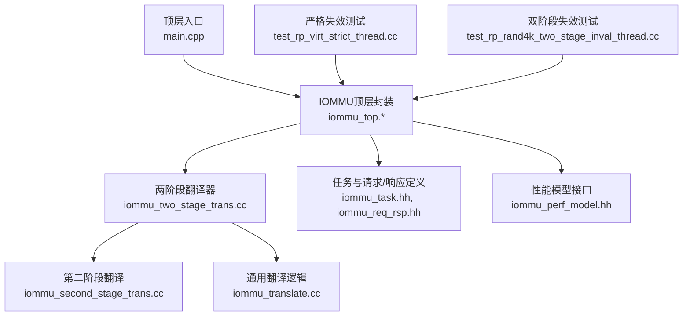
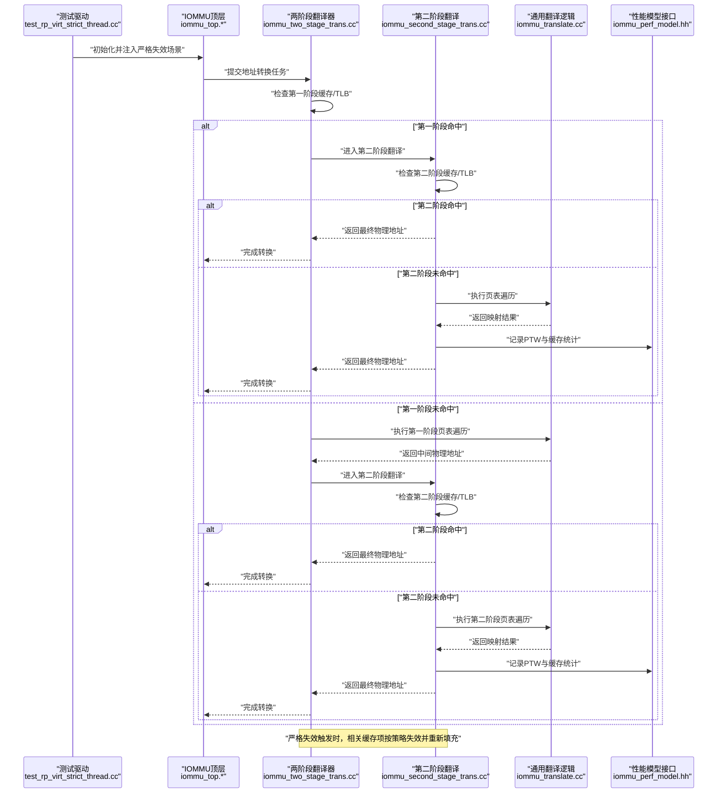
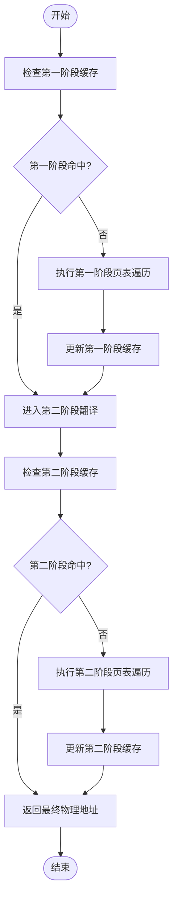
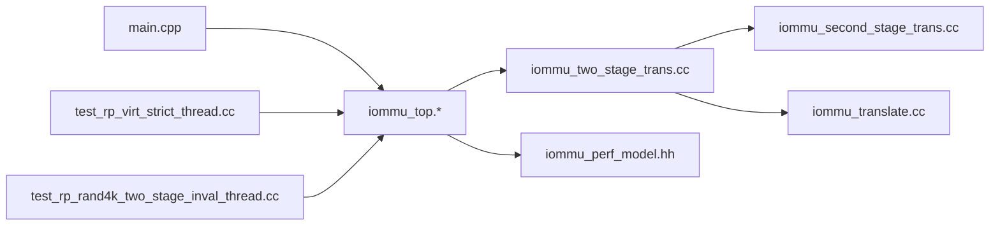

# 虚拟化严格失效两阶段翻译测试 (Scenario 12)

<cite>
**本文引用的文件**   
- [README.md](file://README.md)
- [main.cpp](file://main.cpp)
- [Makefile](file://Makefile)
- [iommu_top.cc](file://iommu/iommu_top.cc)
- [iommu_top.hh](file://iommu/iommu_top.hh)
- [iommu_two_stage_trans.cc](file://iommu/iommu_fun_model/iommu_two_stage_trans.cc)
- [iommu_second_stage_trans.cc](file://iommu/iommu_fun_model/iommu_second_stage_trans.cc)
- [iommu_translate.cc](file://iommu/iommu_fun_model/iommu_translate.cc)
- [iommu_task.hh](file://iommu/include/iommu_task.hh)
- [iommu_req_rsp.hh](file://iommu/include/iommu_req_rsp.hh)
- [iommu_perf_model.hh](file://iommu/iommu_perf_model/iommu_perf_model.hh)
- [test_rp_virt_strict_thread.cc](file://rp/test_rp_virt_strict_thread.cc)
- [test_rp_rand4k_two_stage_inval_thread.cc](file://rp/test_rp_rand4k_two_stage_inval_thread.cc)
- [build_cpp.sh](file://build_cpp.sh)
- [compile_and_test.sh](file://compile_and_test.sh)
</cite>

## 目录
1. [简介](#简介)
2. [项目结构](#项目结构)
3. [核心组件](#核心组件)
4. [架构总览](#架构总览)
5. [详细组件分析](#详细组件分析)
6. [依赖关系分析](#依赖关系分析)
7. [性能考量](#性能考量)
8. [故障排查指南](#故障排查指南)
9. [结论](#结论)
10. [附录](#附录)

## 简介
本文件围绕“虚拟化严格失效两阶段翻译测试（Scenario 12）”展开，聚焦于IOMMU在虚拟化场景下的严格失效策略与两级地址翻译流程。该场景强调：
- 严格的页表失效语义：当页表项被更新或失效时，相关缓存必须按规范失效，保证后续访问看到最新映射。
- 两阶段翻译：第一阶段为虚拟地址到中间物理地址的转换，第二阶段为中间物理地址到最终物理地址的转换。
- 模型验证：通过功能模型与性能模型的协同，验证严格失效在两阶段翻译中的正确性与一致性。

## 项目结构
仓库采用分层模块化组织，核心包括：
- IOMMU顶层入口与配置
- 功能模型（翻译、中断、ATC/ATS等）
- 性能模型（队列、重排序、PTW、缓存子系统）
- 测试用例（单/双阶段、严格/惰性失效、随机/顺序访问模式）
- 构建与脚本工具

图表来源
- [main.cpp:1-200](file://main.cpp#L1-L200)
- [iommu_top.hh:1-200](file://iommu/iommu_top.hh#L1-L200)
- [iommu_two_stage_trans.cc:1-200](file://iommu/iommu_fun_model/iommu_two_stage_trans.cc#L1-L200)
- [iommu_second_stage_trans.cc:1-200](file://iommu/iommu_fun_model/iommu_second_stage_trans.cc#L1-L200)
- [iommu_translate.cc:1-200](file://iommu/iommu_fun_model/iommu_translate.cc#L1-L200)
- [iommu_task.hh:1-200](file://iommu/include/iommu_task.hh#L1-L200)
- [iommu_req_rsp.hh:1-200](file://iommu/include/iommu_req_rsp.hh#L1-L200)
- [iommu_perf_model.hh:1-200](file://iommu/iommu_perf_model/iommu_perf_model.hh#L1-L200)
- [test_rp_virt_strict_thread.cc:1-200](file://rp/test_rp_virt_strict_thread.cc#L1-L200)
- [test_rp_rand4k_two_stage_inval_thread.cc:1-200](file://rp/test_rp_rand4k_two_stage_inval_thread.cc#L1-L200)

章节来源
- [README.md:1-200](file://README.md#L1-L200)
- [Makefile:1-200](file://Makefile#L1-L200)

## 核心组件
- 顶层封装与调度：负责初始化、参数解析、事件循环与模块装配。
- 两阶段翻译器：协调第一、第二阶段翻译，处理TLB/页表缓存失效与一致性。
- 第二阶段翻译：实现中间物理地址到最终物理地址的转换，包含对设备上下文与页表的访问。
- 通用翻译逻辑：抽象出地址转换的核心算法与边界条件处理。
- 任务与请求/响应：定义IOMMU内部任务类型、请求/响应格式与状态机。
- 性能模型接口：提供队列、重排序、PTW、缓存子系统等的性能统计与行为建模。

章节来源
- [iommu_top.cc:1-300](file://iommu/iommu_top.cc#L1-L300)
- [iommu_top.hh:1-300](file://iommu/iommu_top.hh#L1-L300)
- [iommu_two_stage_trans.cc:1-300](file://iommu/iommu_fun_model/iommu_two_stage_trans.cc#L1-L300)
- [iommu_second_stage_trans.cc:1-300](file://iommu/iommu_fun_model/iommu_second_stage_trans.cc#L1-L300)
- [iommu_translate.cc:1-300](file://iommu/iommu_fun_model/iommu_translate.cc#L1-L300)
- [iommu_task.hh:1-300](file://iommu/include/iommu_task.hh#L1-L300)
- [iommu_req_rsp.hh:1-300](file://iommu/include/iommu_req_rsp.hh#L1-L300)
- [iommu_perf_model.hh:1-300](file://iommu/iommu_perf_model/iommu_perf_model.hh#L1-L300)

## 架构总览
下图展示了两阶段翻译在严格失效场景下的整体数据流与控制流：请求进入后，先进行第一阶段翻译，命中则进入第二阶段；若任一阶段未命中或需要失效，则触发相应的页表遍历与缓存失效流程，确保一致性。

图表来源
- [test_rp_virt_strict_thread.cc:1-200](file://rp/test_rp_virt_strict_thread.cc#L1-L200)
- [iommu_top.cc:1-300](file://iommu/iommu_top.cc#L1-L300)
- [iommu_two_stage_trans.cc:1-300](file://iommu/iommu_fun_model/iommu_two_stage_trans.cc#L1-L300)
- [iommu_second_stage_trans.cc:1-300](file://iommu/iommu_fun_model/iommu_second_stage_trans.cc#L1-L300)
- [iommu_translate.cc:1-300](file://iommu/iommu_fun_model/iommu_translate.cc#L1-L300)
- [iommu_perf_model.hh:1-300](file://iommu/iommu_perf_model/iommu_perf_model.hh#L1-L300)

## 详细组件分析

### 两阶段翻译器（Strict Invalidate + Two-Stage）
- 职责：协调第一、第二阶段翻译，维护跨阶段的缓存一致性，处理严格失效语义。
- 关键流程：
  - 接收来自顶层的任务，判断是否命中各阶段缓存。
  - 未命中时调用通用翻译逻辑进行页表遍历。
  - 严格失效触发时，按粒度与范围失效相关缓存项，并保证后续访问的一致性。
- 数据结构：包含阶段状态、缓存索引、失效标记与统计信息。
- 复杂度：页表遍历深度与层级相关，通常为O(log N)，缓存命中显著降低平均延迟。

图表来源
- [iommu_two_stage_trans.cc:1-300](file://iommu/iommu_fun_model/iommu_two_stage_trans.cc#L1-L300)
- [iommu_translate.cc:1-300](file://iommu/iommu_fun_model/iommu_translate.cc#L1-L300)

章节来源
- [iommu_two_stage_trans.cc:1-300](file://iommu/iommu_fun_model/iommu_two_stage_trans.cc#L1-L300)
- [iommu_translate.cc:1-300](file://iommu/iommu_fun_model/iommu_translate.cc#L1-L300)

### 第二阶段翻译（Intermediate to Final Physical Address）
- 职责：将中间物理地址转换为最终物理地址，处理设备上下文、页表权限与属性。
- 关键流程：
  - 根据设备上下文查找第二阶段页表基址。
  - 遍历页表获取映射，必要时触发缺页或错误处理。
  - 更新第二阶段缓存并记录性能指标。
- 错误处理：非法访问、权限不足、页表损坏等异常路径。

章节来源
- [iommu_second_stage_trans.cc:1-300](file://iommu/iommu_fun_model/iommu_second_stage_trans.cc#L1-L300)

### 通用翻译逻辑（Page Table Walk & Validation）
- 职责：实现通用的页表遍历、校验与属性提取。
- 关键点：支持多级页表、不同粒度、属性位（如AD位）的处理。
- 优化：预取、批量遍历、缓存友好访问模式。

章节来源
- [iommu_translate.cc:1-300](file://iommu/iommu_fun_model/iommu_translate.cc#L1-L300)

### 任务与请求/响应模型
- 任务类型：读/写、DMA、页表遍历、失效通知等。
- 请求/响应格式：包含地址、长度、权限、上下文ID、状态码等。
- 状态机：从提交、排队、执行到完成的完整生命周期。

章节来源
- [iommu_task.hh:1-300](file://iommu/include/iommu_task.hh#L1-L300)
- [iommu_req_rsp.hh:1-300](file://iommu/include/iommu_req_rsp.hh#L1-L300)

### 性能模型接口
- 职责：提供队列长度、重排序深度、PTW延迟、缓存命中率等统计。
- 使用方式：在关键路径插入采样点，聚合输出报告。
- 扩展性：支持自定义计数器与事件钩子。

章节来源
- [iommu_perf_model.hh:1-300](file://iommu/iommu_perf_model/iommu_perf_model.hh#L1-L300)

## 依赖关系分析
- 顶层模块依赖翻译器与性能模型接口。
- 两阶段翻译器依赖第二阶段翻译与通用翻译逻辑。
- 测试用例依赖顶层模块以注入场景与验证结果。
- 构建系统依赖编译脚本与Makefile规则。

图表来源
- [main.cpp:1-200](file://main.cpp#L1-L200)
- [iommu_top.hh:1-200](file://iommu/iommu_top.hh#L1-L200)
- [iommu_two_stage_trans.cc:1-200](file://iommu/iommu_fun_model/iommu_two_stage_trans.cc#L1-L200)
- [iommu_second_stage_trans.cc:1-200](file://iommu/iommu_fun_model/iommu_second_stage_trans.cc#L1-L200)
- [iommu_translate.cc:1-200](file://iommu/iommu_fun_model/iommu_translate.cc#L1-L200)
- [iommu_perf_model.hh:1-200](file://iommu/iommu_perf_model/iommu_perf_model.hh#L1-L200)
- [test_rp_virt_strict_thread.cc:1-200](file://rp/test_rp_virt_strict_thread.cc#L1-L200)
- [test_rp_rand4k_two_stage_inval_thread.cc:1-200](file://rp/test_rp_rand4k_two_stage_inval_thread.cc#L1-L200)

章节来源
- [Makefile:1-200](file://Makefile#L1-L200)
- [build_cpp.sh:1-200](file://build_cpp.sh#L1-L200)
- [compile_and_test.sh:1-200](file://compile_and_test.sh#L1-L200)

## 性能考量
- 页表遍历深度与内存访问模式直接影响延迟，建议优化缓存局部性。
- 严格失效可能增加缓存缺失率，需权衡一致性与吞吐。
- 性能模型可用于定位瓶颈，如队列阻塞、PTW热点、缓存冲突。
- 建议结合统计报告调整队列大小、替换策略与预取阈值。

## 故障排查指南
- 常见问题：
  - 严格失效未生效：检查失效范围与粒度是否正确。
  - 两阶段不一致：确认跨阶段缓存同步机制。
  - 性能退化：分析PTW次数、缓存命中率与队列深度。
- 调试步骤：
  - 启用详细日志与性能计数器。
  - 使用测试用例复现问题，逐步缩小范围。
  - 对比功能模型与性能模型输出，定位差异。

章节来源
- [test_rp_virt_strict_thread.cc:1-200](file://rp/test_rp_virt_strict_thread.cc#L1-L200)
- [test_rp_rand4k_two_stage_inval_thread.cc:1-200](file://rp/test_rp_rand4k_two_stage_inval_thread.cc#L1-L200)

## 结论
虚拟化严格失效两阶段翻译测试验证了IOMMU在复杂虚拟化场景下的正确性与性能表现。通过模块化设计与性能模型支撑，能够有效识别与优化潜在瓶颈，确保严格失效语义与高效地址转换的平衡。

## 附录
- 构建与运行：参考构建脚本与测试脚本，快速搭建环境并执行场景。
- 扩展建议：新增失效策略、缓存算法或性能指标时，遵循现有接口与数据流设计。