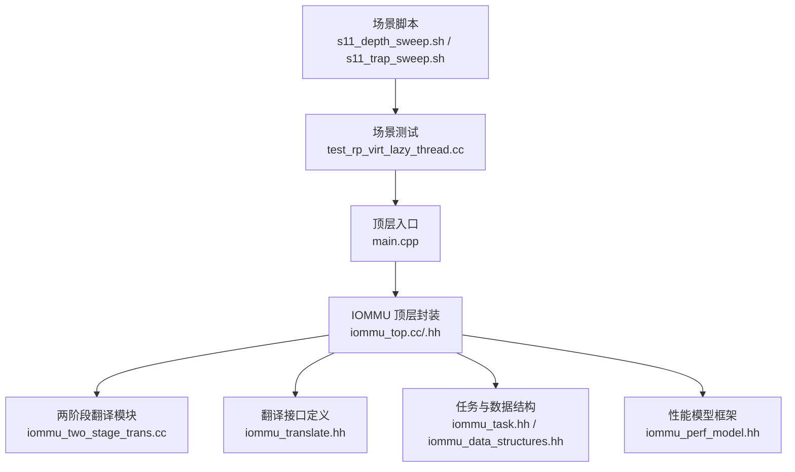
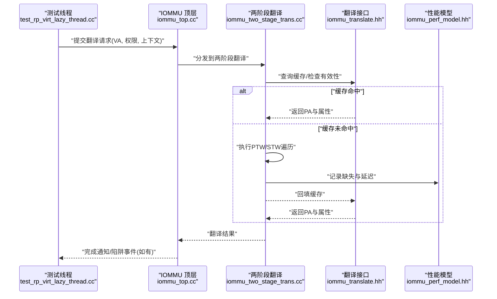
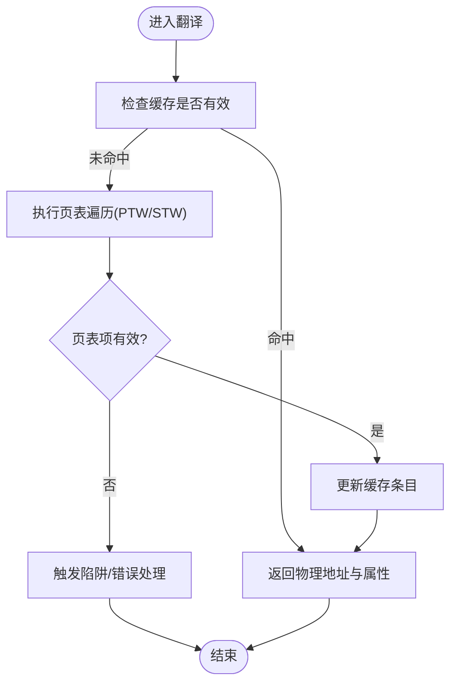
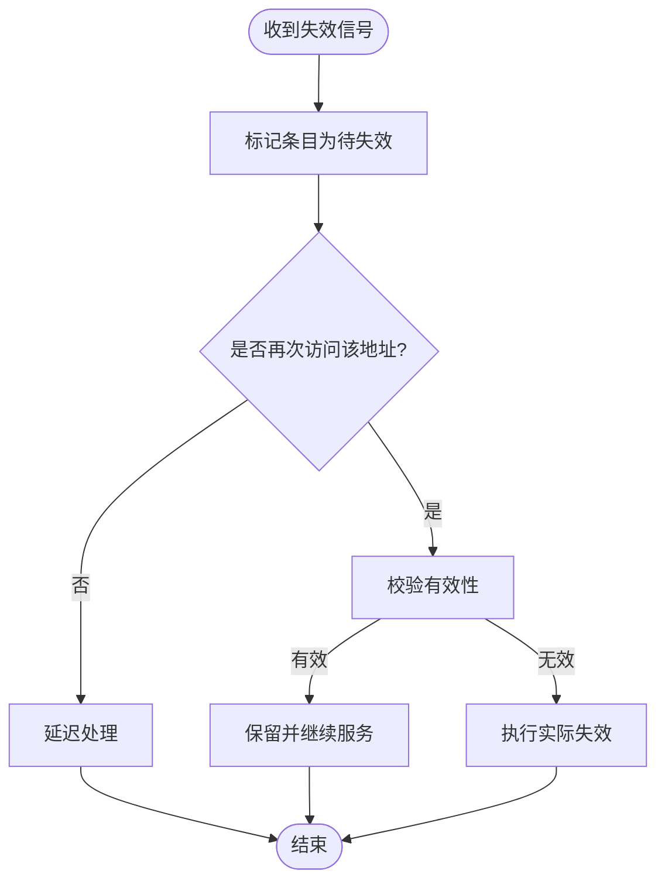
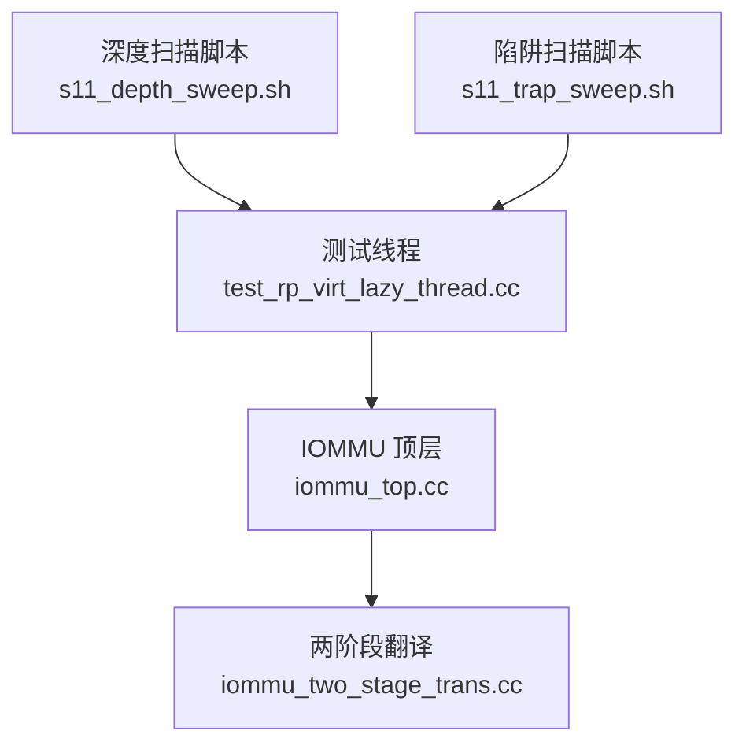
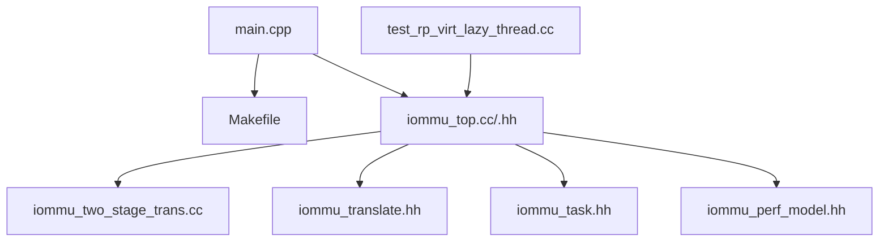

# 虚拟化懒失效两阶段翻译测试 (Scenario 11)

<cite>
**本文引用的文件**   
- [main.cpp](file://main.cpp)
- [Makefile](file://Makefile)
- [README.md](file://README.md)
- [rp/test_rp_virt_lazy_thread.cc](file://rp/test_rp_virt_lazy_thread.cc)
- [iommu/iommu_top.cc](file://iommu/iommu_top.cc)
- [iommu/iommu_top.hh](file://iommu/iommu_top.hh)
- [iommu/iommu_fun_model/iommu_two_stage_trans.cc](file://iommu/iommu_fun_model/iommu_two_stage_trans.cc)
- [iommu/iommu_perf_model/iommu_perf_model.hh](file://iommu/iommu_perf_model/iommu_perf_model.hh)
- [iommu/include/iommu_translate.hh](file://iommu/include/iommu_translate.hh)
- [iommu/include/iommu_task.hh](file://iommu/include/iommu_task.hh)
- [tmp/s11_depth_sweep.sh](file://tmp/s11_depth_sweep.sh)
- [tmp/s11_trap_sweep.sh](file://tmp/s11_trap_sweep.sh)
</cite>

## 目录
1. [简介](#简介)
2. [项目结构](#项目结构)
3. [核心组件](#核心组件)
4. [架构总览](#架构总览)
5. [详细组件分析](#详细组件分析)
6. [依赖关系分析](#依赖关系分析)
7. [性能考量](#性能考量)
8. [故障排查指南](#故障排查指南)
9. [结论](#结论)
10. [附录](#附录)

## 简介
本文件围绕“虚拟化懒失效两阶段翻译测试（Scenario 11）”展开，聚焦于 IOMMU 在虚拟化场景下的两级地址翻译流程与缓存/失效策略的协同。该场景重点验证：
- 二级页表遍历（STW）与一级页表遍历（PTW）的协作
- 懒失效（Lazy Invalidate）策略对翻译路径命中率和吞吐的影响
- 不同页表深度、陷阱触发条件对延迟与吞吐的综合影响

文档从系统架构、关键组件、数据流、错误处理、性能特征等方面给出系统化说明，并配合图示帮助读者快速理解实现要点与测试方法。

## 项目结构
仓库采用分层模块化组织：
- iommu：IOMMU 功能模型与性能模型的核心实现，包含翻译、中断、命令队列、寄存器、任务与数据结构等
- rp：各类回归与场景测试，包括单/双阶段、顺序/随机访问、虚拟化严格/懒失效线程化测试等
- tmp：脚本与辅助工具，用于参数扫描、统计分析与可视化
- ddr/pcienoc/slink：外围子系统测试桩或驱动模拟
- 顶层：构建脚本、入口 main、报告与分析脚本

图表来源
- [main.cpp:1-200](file://main.cpp#L1-L200)
- [iommu/iommu_top.cc:1-200](file://iommu/iommu_top.cc#L1-L200)
- [iommu/iommu_top.hh:1-200](file://iommu/iommu_top.hh#L1-L200)
- [iommu/iommu_fun_model/iommu_two_stage_trans.cc:1-200](file://iommu/iommu_fun_model/iommu_two_stage_trans.cc#L1-L200)
- [iommu/include/iommu_translate.hh:1-200](file://iommu/include/iommu_translate.hh#L1-L200)
- [iommu/include/iommu_task.hh:1-200](file://iommu/include/iommu_task.hh#L1-L200)
- [iommu/iommu_perf_model/iommu_perf_model.hh:1-200](file://iommu/iommu_perf_model/iommu_perf_model.hh#L1-L200)
- [rp/test_rp_virt_lazy_thread.cc:1-200](file://rp/test_rp_virt_lazy_thread.cc#L1-L200)
- [tmp/s11_depth_sweep.sh:1-200](file://tmp/s11_depth_sweep.sh#L1-L200)
- [tmp/s11_trap_sweep.sh:1-200](file://tmp/s11_trap_sweep.sh#L1-L200)

章节来源
- [README.md:1-200](file://README.md#L1-L200)
- [Makefile:1-200](file://Makefile#L1-L200)

## 核心组件
- IOMMU 顶层封装（iommu_top）：负责初始化、配置、任务调度与对外接口聚合
- 两阶段翻译（two_stage_trans）：协调一级/二级页表遍历，管理缓存命中/缺失与失效策略
- 翻译接口（translate）：抽象翻译请求、响应、状态机与事件上报
- 任务与数据结构（task/data_structures）：描述翻译任务、上下文、页表项、缓存条目等
- 性能模型（perf_model）：统计指标采集、延迟分布、命中率、吞吐等

章节来源
- [iommu/iommu_top.cc:1-200](file://iommu/iommu_top.cc#L1-L200)
- [iommu/iommu_top.hh:1-200](file://iommu/iommu_top.hh#L1-L200)
- [iommu/iommu_fun_model/iommu_two_stage_trans.cc:1-200](file://iommu/iommu_fun_model/iommu_two_stage_trans.cc#L1-L200)
- [iommu/include/iommu_translate.hh:1-200](file://iommu/include/iommu_translate.hh#L1-L200)
- [iommu/include/iommu_task.hh:1-200](file://iommu/include/iommu_task.hh#L1-L200)
- [iommu/iommu_perf_model/iommu_perf_model.hh:1-200](file://iommu/iommu_perf_model/iommu_perf_model.hh#L1-L200)

## 架构总览
下图展示 Scenario 11 的整体调用链与数据流：测试线程生成虚拟地址访问请求，经 IOMMU 顶层进入两阶段翻译模块；若缓存未命中则触发 PTW/STW 遍历，必要时产生陷阱；最终返回物理地址并更新缓存。

图表来源
- [rp/test_rp_virt_lazy_thread.cc:1-200](file://rp/test_rp_virt_lazy_thread.cc#L1-L200)
- [iommu/iommu_top.cc:1-200](file://iommu/iommu_top.cc#L1-L200)
- [iommu/iommu_fun_model/iommu_two_stage_trans.cc:1-200](file://iommu/iommu_fun_model/iommu_two_stage_trans.cc#L1-L200)
- [iommu/include/iommu_translate.hh:1-200](file://iommu/include/iommu_translate.hh#L1-L200)
- [iommu/iommu_perf_model/iommu_perf_model.hh:1-200](file://iommu/iommu_perf_model/iommu_perf_model.hh#L1-L200)

## 详细组件分析

### 两阶段翻译器（Two-Stage Translator）
职责与行为：
- 根据当前上下文选择一级/二级页表基址与权限掩码
- 优先查询各级缓存（如 PT Cache、Walker Cache），命中即返回
- 未命中时按页表层级逐层遍历，构造/更新缓存条目
- 遇到权限不足、页不存在、标志位异常等触发陷阱或错误路径
- 与懒失效策略联动：在特定条件下延迟失效，提高后续命中概率

图表来源
- [iommu/iommu_fun_model/iommu_two_stage_trans.cc:1-200](file://iommu/iommu_fun_model/iommu_two_stage_trans.cc#L1-L200)
- [iommu/include/iommu_translate.hh:1-200](file://iommu/include/iommu_translate.hh#L1-L200)

章节来源
- [iommu/iommu_fun_model/iommu_two_stage_trans.cc:1-200](file://iommu/iommu_fun_model/iommu_two_stage_trans.cc#L1-L200)
- [iommu/include/iommu_translate.hh:1-200](file://iommu/include/iommu_translate.hh#L1-L200)

### 懒失效策略（Lazy Invalidate）
关键点：
- 在检测到页表项被修改或TLB/缓存一致性需求时，不立即广播失效，而是标记为“待失效”
- 结合访问模式与负载压力，推迟失效以降低开销
- 当再次访问相关地址时，进行按需校验与必要时的局部失效

图表来源
- [rp/test_rp_virt_lazy_thread.cc:1-200](file://rp/test_rp_virt_lazy_thread.cc#L1-L200)
- [iommu/iommu_fun_model/iommu_two_stage_trans.cc:1-200](file://iommu/iommu_fun_model/iommu_two_stage_trans.cc#L1-L200)

章节来源
- [rp/test_rp_virt_lazy_thread.cc:1-200](file://rp/test_rp_virt_lazy_thread.cc#L1-L200)
- [iommu/iommu_fun_model/iommu_two_stage_trans.cc:1-200](file://iommu/iommu_fun_model/iommu_two_stage_trans.cc#L1-L200)

### 场景测试与脚本（Scenario 11）
- 测试线程 test_rp_virt_lazy_thread.cc：并发生成虚拟化访问请求，覆盖懒失效路径与两阶段翻译
- 深度扫描脚本 s11_depth_sweep.sh：调整页表深度参数，观察命中率与延迟变化
- 陷阱扫描脚本 s11_trap_sweep.sh：注入不同陷阱条件，评估错误路径与恢复机制

图表来源
- [rp/test_rp_virt_lazy_thread.cc:1-200](file://rp/test_rp_virt_lazy_thread.cc#L1-L200)
- [iommu/iommu_top.cc:1-200](file://iommu/iommu_top.cc#L1-L200)
- [iommu/iommu_fun_model/iommu_two_stage_trans.cc:1-200](file://iommu/iommu_fun_model/iommu_two_stage_trans.cc#L1-L200)
- [tmp/s11_depth_sweep.sh:1-200](file://tmp/s11_depth_sweep.sh#L1-L200)
- [tmp/s11_trap_sweep.sh:1-200](file://tmp/s11_trap_sweep.sh#L1-L200)

章节来源
- [rp/test_rp_virt_lazy_thread.cc:1-200](file://rp/test_rp_virt_lazy_thread.cc#L1-L200)
- [tmp/s11_depth_sweep.sh:1-200](file://tmp/s11_depth_sweep.sh#L1-L200)
- [tmp/s11_trap_sweep.sh:1-200](file://tmp/s11_trap_sweep.sh#L1-L200)

## 依赖关系分析
- 顶层入口 main.cpp 通过 Makefile 构建目标，加载 IOMMU 顶层模块
- IOMMU 顶层依赖翻译接口、任务结构与性能模型
- 两阶段翻译依赖缓存子系统与页表遍历逻辑
- 测试线程依赖顶层接口以提交请求并收集结果

图表来源
- [main.cpp:1-200](file://main.cpp#L1-L200)
- [Makefile:1-200](file://Makefile#L1-L200)
- [iommu/iommu_top.cc:1-200](file://iommu/iommu_top.cc#L1-L200)
- [iommu/iommu_top.hh:1-200](file://iommu/iommu_top.hh#L1-L200)
- [iommu/iommu_fun_model/iommu_two_stage_trans.cc:1-200](file://iommu/iommu_fun_model/iommu_two_stage_trans.cc#L1-L200)
- [iommu/include/iommu_translate.hh:1-200](file://iommu/include/iommu_translate.hh#L1-L200)
- [iommu/include/iommu_task.hh:1-200](file://iommu/include/iommu_task.hh#L1-L200)
- [iommu/iommu_perf_model/iommu_perf_model.hh:1-200](file://iommu/iommu_perf_model/iommu_perf_model.hh#L1-L200)
- [rp/test_rp_virt_lazy_thread.cc:1-200](file://rp/test_rp_virt_lazy_thread.cc#L1-L200)

章节来源
- [main.cpp:1-200](file://main.cpp#L1-L200)
- [Makefile:1-200](file://Makefile#L1-L200)

## 性能考量
- 缓存命中率：懒失效策略在高频访问模式下可显著提升命中率，但需平衡一致性成本
- 页表深度：更深页表增加遍历次数，可能降低吞吐；可通过预取与批量填充缓解
- 陷阱频率：过多陷阱会打断流水线，应优化触发条件与恢复路径
- 并发度：多线程访问需保证缓存一致性与锁粒度合理，避免热点竞争

[本节为通用指导，不直接分析具体文件]

## 故障排查指南
常见问题与定位建议：
- 翻译失败：检查页表项有效性、权限掩码与上下文配置
- 频繁陷阱：确认懒失效标记是否正确清理，是否存在不一致的页表更新
- 性能退化：分析缓存命中率、遍历深度与并发冲突
- 构建问题：核对 Makefile 目标与依赖库版本

章节来源
- [iommu/iommu_fun_model/iommu_two_stage_trans.cc:1-200](file://iommu/iommu_fun_model/iommu_two_stage_trans.cc#L1-L200)
- [rp/test_rp_virt_lazy_thread.cc:1-200](file://rp/test_rp_virt_lazy_thread.cc#L1-L200)

## 结论
Scenario 11 通过虚拟化懒失效与两阶段翻译的组合，验证了在高并发与复杂访问模式下的 IOMMU 性能与正确性。合理的懒失效策略与缓存设计能够在保持一致性的前提下提升吞吐与降低延迟。建议在实际部署中结合工作负载特性调优页表深度、缓存大小与失效阈值。

[本节为总结性内容，不直接分析具体文件]

## 附录
- 构建与运行：参考 Makefile 与顶层脚本，确保依赖库与编译器环境正确
- 参数扫描：使用 s11_depth_sweep.sh 与 s11_trap_sweep.sh 进行参数空间探索
- 数据分析：结合性能模型输出，关注命中率、延迟分布与陷阱统计

[本节为补充信息，不直接分析具体文件]