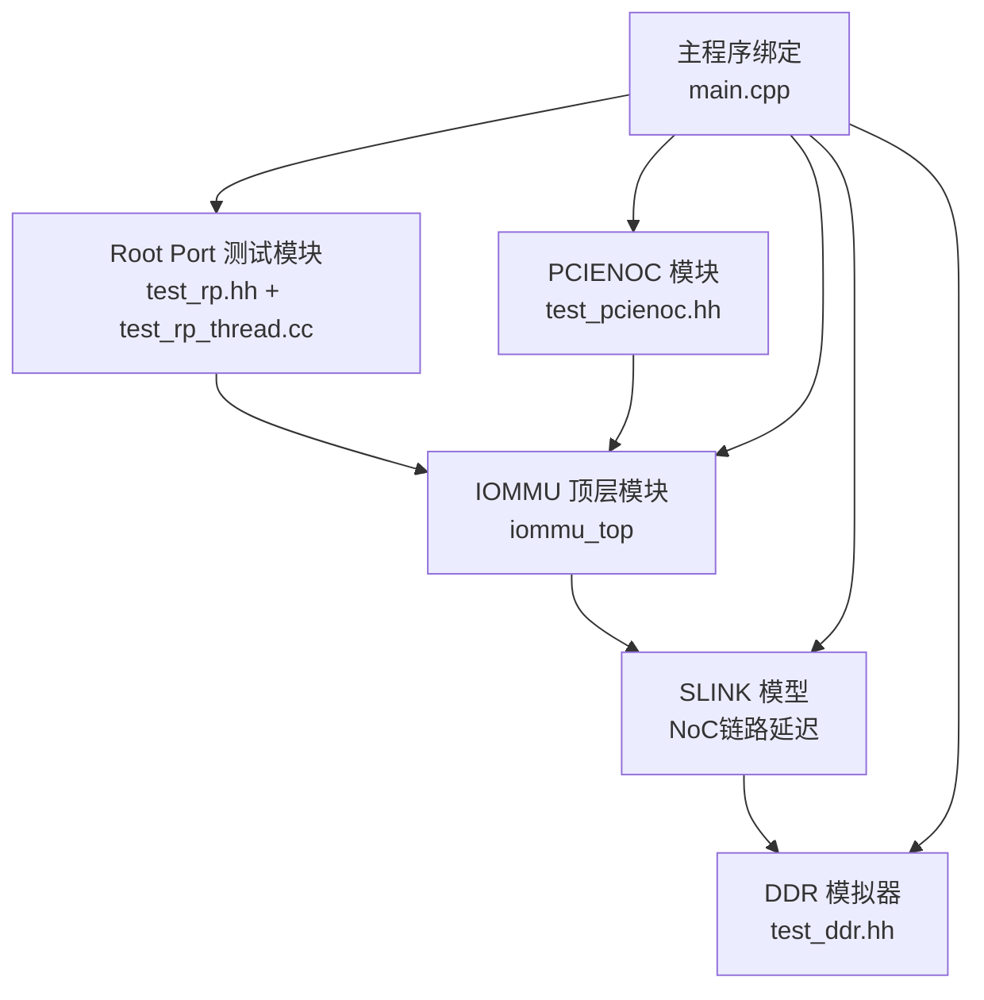
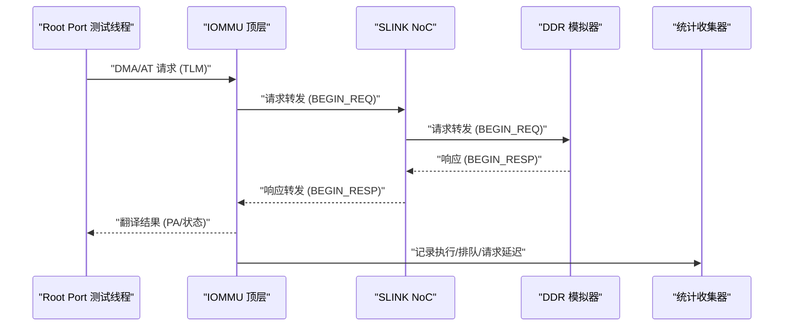
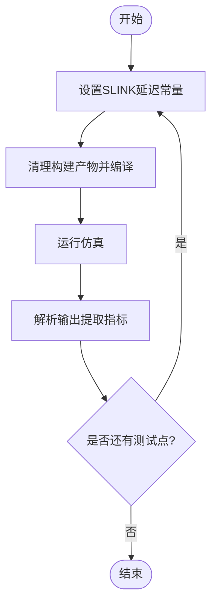
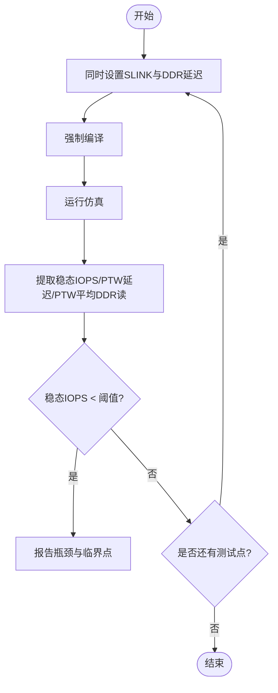
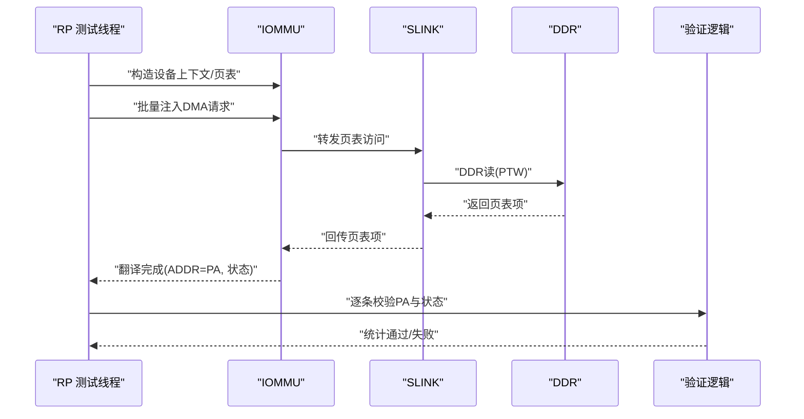
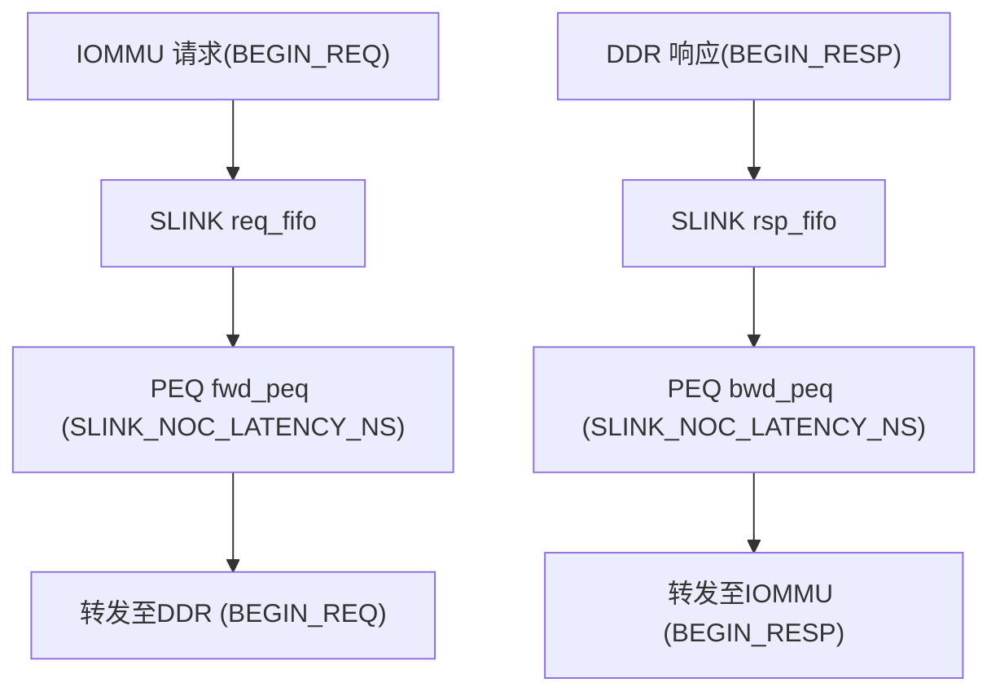
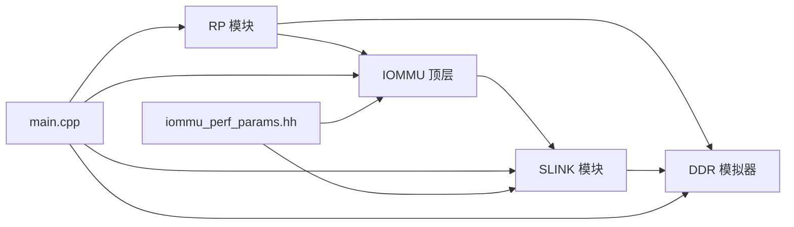

# 接口测试

<cite>
**本文引用的文件**
- [test_slink_latency.sh](file://test_slink_latency.sh)
- [test_slink_verify.sh](file://test_slink_verify.sh)
- [test_rp_thread.cc](file://rp/test_rp_thread.cc)
- [test_rp_sv48_bare_thread.cc](file://rp/test_rp_sv48_bare_thread.cc)
- [test_rp.hh](file://rp/test_rp.hh)
- [test_slink.cc](file://slink/test_slink.cc)
- [test_slink.hh](file://slink/test_slink.hh)
- [iommu_perf_params.hh](file://iommu/iommu_perf_model/iommu_perf_params.hh)
- [test_ddr.hh](file://ddr/test_ddr.hh)
- [main.cpp](file://main.cpp)
- [iommu_perf_model.hh](file://iommu/iommu_perf_model/iommu_perf_model.hh)
- [stats_collector.cpp](file://iommu/cache_src/common/stats_collector.cpp)
- [stats_collector.h](file://iommu/cache_src/common/stats_collector.h)
- [Makefile](file://Makefile)
</cite>

## 目录
1. [简介](#简介)
2. [项目结构](#项目结构)
3. [核心组件](#核心组件)
4. [架构总览](#架构总览)
5. [详细组件分析](#详细组件分析)
6. [依赖关系分析](#依赖关系分析)
7. [性能考量](#性能考量)
8. [故障排查指南](#故障排查指南)
9. [结论](#结论)
10. [附录](#附录)

## 简介
本文件面向IOMMU接口测试，系统化阐述以下内容：
- SLINK接口延迟测试与验证测试的实现原理、测试指标与执行流程
- Root Port线程测试(thread)的设计思路，涵盖Sv39与Sv48 Bare两种地址转换模式下的测试场景
- 接口测试的数据流、通信协议与验证方法
- 配置参数、执行流程与性能指标分析
- 接口兼容性测试、协议正确性验证与边界条件测试的实施策略

## 项目结构
该仓库采用SystemC/TLM建模，接口测试由多模块协同完成：
- 主控与绑定：main.cpp负责实例化IOMMU、RP、PCIENOC、SLINK、DDR等模块并建立连接
- SLINK模块：模拟NoC链路，对IOMMU与DDR之间的页表/目录表访问进行管道延迟建模
- Root Port测试：通过RP模块发起翻译请求，覆盖不同地址转换模式与访问模式
- 性能参数：iommu_perf_params.hh集中定义SLINK延迟、缓存与带宽等关键参数
- 统计输出：通过统计收集器输出IOPS、平均执行延迟、缓存命中率等指标

**图示来源**
- [main.cpp:39-94](file://main.cpp#L39-L94)
- [test_slink.cc:6-26](file://slink/test_slink.cc#L6-L26)
- [test_rp.hh:54-94](file://rp/test_rp.hh#L54-L94)

**章节来源**
- [main.cpp:39-94](file://main.cpp#L39-L94)
- [test_slink.cc:6-26](file://slink/test_slink.cc#L6-L26)
- [test_rp.hh:54-94](file://rp/test_rp.hh#L54-L94)

## 核心组件
- SLINK模块：以FIFO与PEQ实现双向流水线延迟，模拟NoC往返延迟
- Root Port测试模块：构造设备上下文、页表映射，注入DMA/AT请求并校验响应
- 性能参数：集中于iommu_perf_params.hh，包含SLINK延迟、缓存深度、带宽与延迟等
- 统计输出：通过统计收集器记录执行/排队/请求延迟，计算IOPS与命中率

**章节来源**
- [test_slink.cc:28-117](file://slink/test_slink.cc#L28-L117)
- [test_rp_thread.cc:13-368](file://rp/test_rp_thread.cc#L13-L368)
- [iommu_perf_params.hh:146-152](file://iommu/iommu_perf_model/iommu_perf_params.hh#L146-L152)
- [stats_collector.cpp:498-505](file://iommu/cache_src/common/stats_collector.cpp#L498-L505)

## 架构总览
下图展示接口测试的关键交互路径：RP发起请求至IOMMU，IOMMU经SLINK访问DDR进行页表遍历，响应沿反向路径回传；统计信息在IOMMU内部收集并汇总。

**图示来源**
- [test_slink.cc:32-116](file://slink/test_slink.cc#L32-L116)
- [test_rp_thread.cc:214-292](file://rp/test_rp_thread.cc#L214-L292)
- [stats_collector.cpp:498-505](file://iommu/cache_src/common/stats_collector.cpp#L498-L505)

## 详细组件分析

### SLINK延迟测试(test_slink_latency.sh)
- 目标：评估不同SLINK延迟对IOMMU吞吐与PTW性能的影响
- 方法：循环调整SLINK_NOC_LATENCY_NS，强制重建PTW模块，运行仿真并提取指标
- 关键指标：
  - IOMMU IOPS：总体任务吞吐
  - PTW IOPS：页表遍历吞吐
  - PTW 平均执行延迟：PTW纯执行时间
  - 稳态IOPS：跳过首尾10%后的稳定窗口吞吐
- 执行流程：
  1) 替换iommu_perf_params.hh中的SLINK延迟常量
  2) 清理构建产物，编译并运行仿真
  3) 解析输出日志提取上述指标并打印

**图示来源**
- [test_slink_latency.sh:9-21](file://test_slink_latency.sh#L9-L21)
- [iommu_perf_params.hh:146-147](file://iommu/iommu_perf_model/iommu_perf_params.hh#L146-L147)

**章节来源**
- [test_slink_latency.sh:1-24](file://test_slink_latency.sh#L1-L24)
- [iommu_perf_params.hh:146-147](file://iommu/iommu_perf_model/iommu_perf_params.hh#L146-L147)

### SLINK验证测试(test_slink_verify.sh)
- 目标：验证PTW延迟与IOPS随SLINK变化的预期关系，定位潜在瓶颈
- 方法：同步修改SLINK与DDR侧延迟参数，运行仿真并进行一致性检查
- 关键指标与验证：
  - 稳态IOPS低于阈值(如120M/s)即判定为瓶颈
  - PTW平均执行延迟与DDR读次数的乘积作为理论PTW延迟的验证依据
- 执行流程：
  1) 同步更新SLINK与DDR延迟参数
  2) 强制编译，运行仿真
  3) 提取稳态IOPS、PTW平均执行延迟、PTW平均DDR读次数
  4) 若稳态IOPS低于阈值则提前终止并报告临界点

**图示来源**
- [test_slink_verify.sh:11-51](file://test_slink_verify.sh#L11-L51)
- [test_ddr.hh:20-22](file://ddr/test_ddr.hh#L20-L22)

**章节来源**
- [test_slink_verify.sh:1-54](file://test_slink_verify.sh#L1-L54)
- [test_ddr.hh:20-22](file://ddr/test_ddr.hh#L20-L22)

### Root Port测试(thread)设计思路
- 设计目标：验证IOMMU在不同地址转换模式下的翻译正确性与时序行为
- 场景一：Sv39 + iohgatp=Bare 的随机4KB读测试
  - 构造16MB页表范围，选择500个唯一页面并打乱访问顺序，每页8次请求(共4000次)
  - 验证：每个请求的PA与期望一致，统计通过率
  - 特点：随机访问下预取效果有限，验证去重与缓存命中策略
- 场景二：Sv48 + iohgatp=Bare 的连续1000写测试
  - 构造4级页表(125页)，连续512B步进，共1000次写请求
  - 验证：PA映射正确，统计通过率
  - 特点：Sv48层级更深，验证多级页表遍历与缓存策略
- 线程模型：
  - RP_Module包含三个线程：主线程发起请求、线程2/3用于并发验证
  - 使用非阻塞nb_transport_fw注入请求，回调中累积响应计数并通知

**图示来源**
- [test_rp_thread.cc:57-367](file://rp/test_rp_thread.cc#L57-L367)
- [test_rp_sv48_bare_thread.cc:46-210](file://rp/test_rp_sv48_bare_thread.cc#L46-L210)
- [test_rp.hh:96-145](file://rp/test_rp.hh#L96-L145)

**章节来源**
- [test_rp_thread.cc:13-368](file://rp/test_rp_thread.cc#L13-L368)
- [test_rp_sv48_bare_thread.cc:16-210](file://rp/test_rp_sv48_bare_thread.cc#L16-L210)
- [test_rp.hh:54-145](file://rp/test_rp.hh#L54-L145)

### SLINK模块数据流与通信协议
- 协议要点：
  - 使用TLM nb_transport_fw/nb_transport_bw进行异步请求/响应
  - 请求路径：IOMMU → SLINK → DDR；响应路径：DDR → SLINK → IOMMU
  - 通过FIFO与PEQ引入固定延迟，模拟NoC往返时延
- 关键实现：
  - 请求/响应FIFO深度与PEQ延迟可调，便于评估不同SLINK延迟对系统性能的影响
  - 输出线程在PEQ到期后转发至对应方向的socket

**图示来源**
- [test_slink.cc:32-116](file://slink/test_slink.cc#L32-L116)
- [test_slink.hh:21-55](file://slink/test_slink.hh#L21-L55)
- [iommu_perf_params.hh:146-147](file://iommu/iommu_perf_model/iommu_perf_params.hh#L146-L147)

**章节来源**
- [test_slink.cc:28-117](file://slink/test_slink.cc#L28-L117)
- [test_slink.hh:16-55](file://slink/test_slink.hh#L16-L55)

### 接口测试配置参数与执行流程
- 关键参数：
  - SLINK单向延迟：SLINK_NOC_LATENCY_NS（影响PTW与整体吞吐）
  - 稳态采样窗口：STEADY_STATE_START_PERCENT/STEADY_STATE_END_PERCENT（跳过首尾10%）
  - 缓存与FIFO深度：PT_CACHE_SIZE/ASSOC/LINE_SIZE、各模块FIFO深度等
  - 带宽与并发：AXI端口带宽、最大并发任务数、DDR最大未完成请求数
- 执行流程（以test_slink_latency.sh为例）：
  1) 修改SLINK延迟常量
  2) 清理构建产物并编译
  3) 运行仿真生成输出
  4) 解析输出提取IOPS、PTW延迟、稳态IOPS等指标

**章节来源**
- [iommu_perf_params.hh:74-152](file://iommu/iommu_perf_model/iommu_perf_params.hh#L74-L152)
- [test_slink_latency.sh:9-21](file://test_slink_latency.sh#L9-L21)
- [Makefile:38-49](file://Makefile#L38-L49)

### 性能指标分析
- IOPS计算：
  - 使用“纯执行时间”窗口计算IOPS，避免排队与空闲时间对分母的高估
  - PT Cache IOPS与RAM端口利用率由统计收集器输出
- 延迟分解：
  - 平均执行延迟、队列等待延迟、请求总延迟
  - PTW平均执行延迟与DDR读次数的乘积用于理论验证
- 命中率与去重：
  - PT Cache命中率、预取准确率、VA去重与预取深度参数

**章节来源**
- [stats_collector.cpp:498-505](file://iommu/cache_src/common/stats_collector.cpp#L498-L505)
- [stats_collector.h:71-104](file://iommu/cache_src/common/stats_collector.h#L71-L104)
- [test_slink_verify.sh:36-39](file://test_slink_verify.sh#L36-L39)

### 接口兼容性测试与协议正确性验证
- 兼容性测试：
  - 不同地址转换模式：Sv39、Sv48、Bare
  - 不同访问类型：读/写/执行、随机/顺序
  - 不同负载规模：小批量(1000)与大批量(4000)请求
- 协议正确性验证：
  - TLM阶段流转：BEGIN_REQ/END_REQ/BEGIN_RESP/END_RESP
  - 回调通知：nb_transport_bw中响应计数与事件通知
  - 结果校验：ADDR字段为期望PA，状态为成功

**章节来源**
- [test_rp_thread.cc:214-331](file://rp/test_rp_thread.cc#L214-L331)
- [test_rp_sv48_bare_thread.cc:124-190](file://rp/test_rp_sv48_bare_thread.cc#L124-L190)
- [test_rp.hh:96-141](file://rp/test_rp.hh#L96-L141)

### 边界条件测试
- 地址边界：
  - Canonical地址检查与Sv39/Sv48/Sv57的符号扩展规则
- 缓存边界：
  - FIFO深度与最大并发限制，避免溢出与死锁
- 延迟边界：
  - SLINK延迟从低(如150ns)到高(如20000ns)的阶梯测试
- 功能边界：
  - ATS消息处理、MSI地址识别、进程/设备上下文配置检查

**章节来源**
- [iommu_perf_model.hh:111-133](file://iommu/iommu_perf_model/iommu_perf_model.hh#L111-L133)
- [iommu_perf_params.hh:74-152](file://iommu/iommu_perf_model/iommu_perf_params.hh#L74-L152)
- [test_slink_verify.sh:11-51](file://test_slink_verify.sh#L11-L51)

## 依赖关系分析
- 组件耦合：
  - RP模块依赖IOMMU与DDR模块指针，通过socket进行解耦
  - SLINK模块仅依赖性能参数常量，便于独立调节SLINK延迟
- 外部依赖：
  - SystemC/TLM库、编译器优化标志
  - 构建脚本根据TEST变量选择不同测试线程源文件

**图示来源**
- [main.cpp:49-80](file://main.cpp#L49-L80)
- [test_rp.hh:62-65](file://rp/test_rp.hh#L62-L65)
- [test_slink.cc:6-26](file://slink/test_slink.cc#L6-L26)
- [iommu_perf_params.hh:146-147](file://iommu/iommu_perf_model/iommu_perf_params.hh#L146-L147)

**章节来源**
- [main.cpp:49-80](file://main.cpp#L49-L80)
- [Makefile:38-49](file://Makefile#L38-L49)

## 性能考量
- SLINK延迟对吞吐与延迟的影响显著，需结合稳态IOPS与PTW平均执行延迟综合评估
- 预取与去重策略在顺序访问场景下收益明显，在随机访问场景下受限
- FIFO深度与并发限制是瓶颈定位的关键，需确保未完成请求数不超过DDR与各模块上限

## 故障排查指南
- 常见问题：
  - 无进度或卡死：检查nb_transport_bw回调是否被正确触发，响应计数是否递增
  - 稳态IOPS异常低：检查SLINK延迟设置、DDR延迟、缓存参数与FIFO深度
  - PA不匹配：核对设备上下文与页表映射，确认地址转换模式与偏移
- 定位手段：
  - 使用验证脚本自动检测稳态IOPS阈值
  - 查看统计输出中的PTW平均执行延迟与DDR读次数
  - 对比理论PTW延迟与实测值，辅助判断瓶颈位置

**章节来源**
- [test_rp_thread.cc:270-292](file://rp/test_rp_thread.cc#L270-L292)
- [test_slink_verify.sh:36-49](file://test_slink_verify.sh#L36-L49)
- [stats_collector.cpp:498-505](file://iommu/cache_src/common/stats_collector.cpp#L498-L505)

## 结论
本文系统梳理了IOMMU接口测试的实现与分析方法，重点覆盖：
- SLINK延迟测试与验证测试的指标与流程
- Root Port在Sv39与Sv48 Bare模式下的测试场景
- 接口数据流、通信协议与验证方法
- 配置参数、执行流程与性能指标分析
- 兼容性、协议正确性与边界条件的测试策略

建议在回归测试中持续运行上述脚本与场景，结合统计输出与阈值告警，形成稳定的性能基线与问题预警机制。

## 附录
- 关键参数速查：
  - SLINK单向延迟：SLINK_NOC_LATENCY_NS
  - 稳态采样窗口：STEADY_STATE_START_PERCENT/STEADY_STATE_END_PERCENT
  - PT Cache参数：PT_CACHE_SIZE/ASSOC/LINE_SIZE、去重与预取深度
  - 带宽与并发：AXI端口带宽、最大并发任务数、DDR最大未完成请求数

**章节来源**
- [iommu_perf_params.hh:74-152](file://iommu/iommu_perf_model/iommu_perf_params.hh#L74-L152)