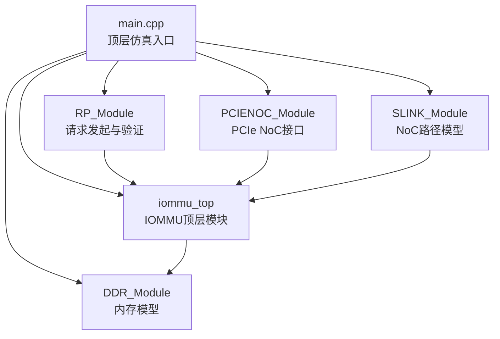
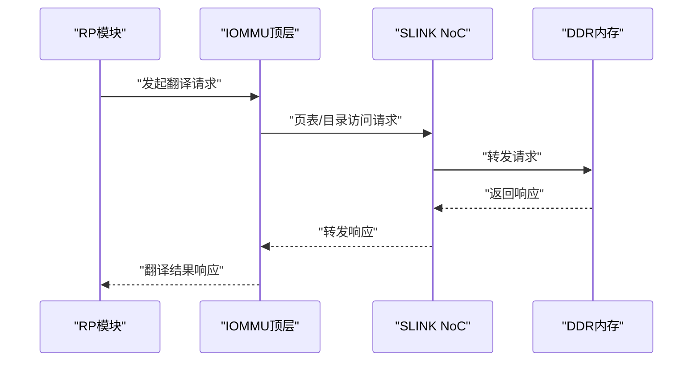
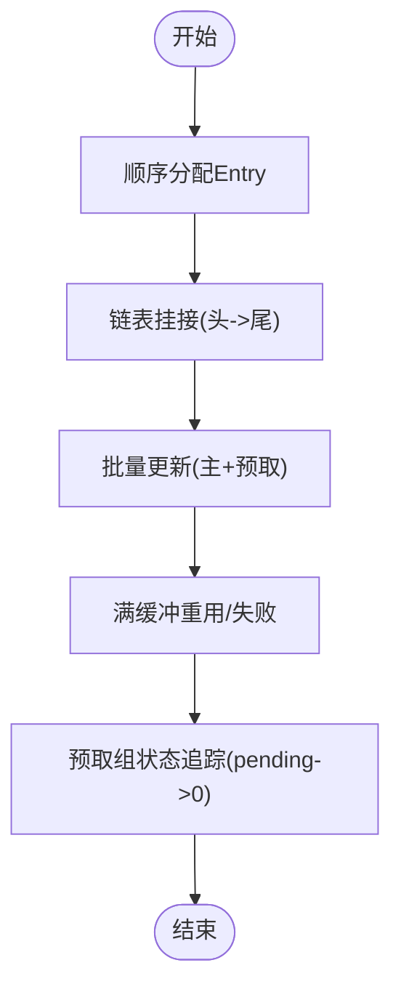
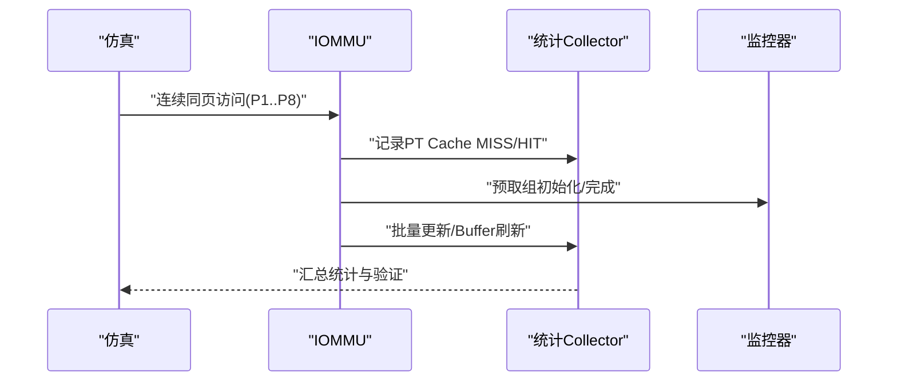
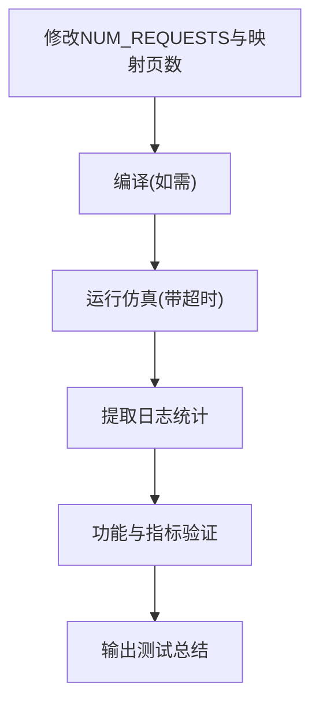
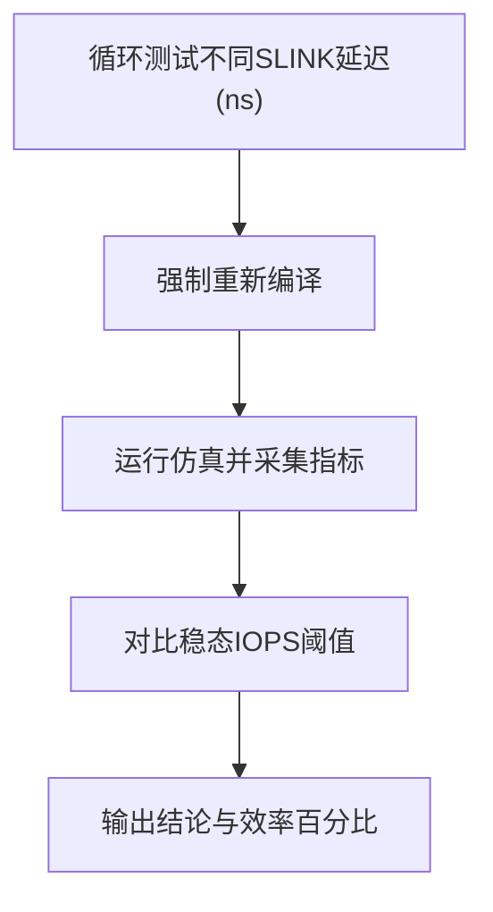
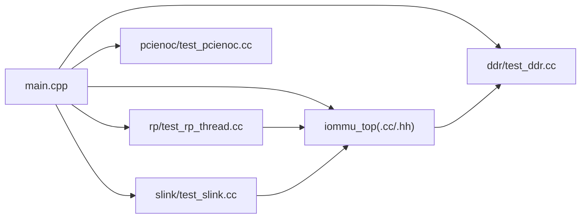

# 测试与验证

<cite>
**本文引用的文件**   
- [main.cpp](file://main.cpp)
- [Makefile](file://Makefile)
- [compile_and_test.sh](file://compile_and_test.sh)
- [link_and_run.sh](file://link_and_run.sh)
- [test_1000req.sh](file://test_1000req.sh)
- [test_dedup_prefetch_unit.cpp](file://test_dedup_prefetch_unit.cpp)
- [test_integration_dedup_prefetch.sh](file://test_integration_dedup_prefetch.sh)
- [test_dedup_prefetch.sh](file://test_dedup_prefetch.sh)
- [test_precise.sh](file://test_precise.sh)
- [rp/test_rp_thread.cc](file://rp/test_rp_thread.cc)
- [rp/test_rp_func.cc](file://rp/test_rp_func.cc)
- [rp/test_rp_rand4k_single_stage_thread.cc](file://rp/test_rp_rand4k_single_stage_thread.cc)
- [rp/test_rp_seq128k_single_stage_thread.cc](file://rp/test_rp_seq128k_single_stage_thread.cc)
- [rp/test_rp_seq128k_two_stage_thread.cc](file://rp/test_rp_seq128k_two_stage_thread.cc)
- [rp/test_rp_sv48_bare_thread.cc](file://rp/test_rp_sv48_bare_thread.cc)
- [rp/test_rp.hh](file://rp/test_rp.hh)
- [slink/test_slink.cc](file://slink/test_slink.cc)
- [iommu/cache_config/default_config.json](file://iommu/cache_config/default_config.json)
- [iommu/cache_config/input_params_example.json](file://iommu/cache_config/input_params_example.json)
- [iommu/cache_src/common/types.h](file://iommu/cache_src/common/types.h)
</cite>

## 更新摘要
**变更内容**   
- 更新测试框架重构章节，反映新的测试场景分类系统（单阶段vs双阶段）
- 更新测试目标配置章节，反映通过TransStage枚举和TEST_FLAGS宏实现的清晰测试目标配置
- 更新两阶段地址转换测试章节，反映请求规模从2000个扩展到5000个请求
- 更新测试脚本使用指南，包含新的测试场景分类和目标配置
- 更新测试场景设计原理，强调测试场景的明确分类和目标导向配置
- **重大更新** 移除实验性的多线程测试框架，保留单线程测试实现，简化测试协调机制，减少400+行无用代码

## 目录
1. [引言](#引言)
2. [项目结构](#项目结构)
3. [核心组件](#核心组件)
4. [架构总览](#架构总览)
5. [详细组件分析](#详细组件分析)
6. [依赖关系分析](#依赖关系分析)
7. [性能考量](#性能考量)
8. [故障排查指南](#故障排查指南)
9. [结论](#结论)
10. [附录](#附录)

## 引言
本文件面向IOMMU测试与验证，系统化介绍经过重构的测试框架设计、使用方法与自动化流程，覆盖单元测试、集成测试与性能测试三大类。文档重点解释基于TransStage枚举的测试场景分类系统、测试目标的清晰配置方法、测试用例编写方法、测试脚本使用指南、测试结果分析与验证标准，并给出测试环境搭建与配置要求及常见问题排查建议。

**重要更新** 测试框架经过重大简化，移除了实验性的多线程测试框架，保留了稳定的单线程测试实现，显著简化了测试协调机制，减少了400+行无用代码，提高了测试系统的可维护性和稳定性。

## 项目结构
仓库采用SystemC建模与TLM接口，顶层通过main.cpp组织IOMMU、RP、PCIENOC、SLINK与DDR模块互联；测试以Makefile驱动编译与目标选择，配套多套Shell脚本进行自动化测试与结果分析。测试框架经过重构，现在采用明确的单阶段和双阶段测试场景分类系统。

**图示来源**
- [main.cpp:39-94](file://main.cpp#L39-L94)

**章节来源**
- [main.cpp:1-94](file://main.cpp#L1-L94)
- [Makefile:1-175](file://Makefile#L1-L175)

## 核心组件
- 顶层仿真入口与绑定：main.cpp负责创建各模块实例并建立TLM socket连接，启动仿真并清理资源。
- **重构后的测试场景分类系统**：通过TransStage枚举（STAGE1_ONLY、STAGE2_ONLY、STAGE1_AND_2）实现明确的单阶段和双阶段测试场景分类；每个测试场景都有专用的源文件，命名约定清晰明确。
- **测试目标配置**：通过TEST_FLAGS宏和TEST宏实现测试目标的清晰配置，包括预取深度、Walker Cache启用等参数。
- **测试线程与场景**：rp/test_rp_rand4k_single_stage_thread.cc提供4KB随机读单阶段测试场景；rp/test_rp_seq128k_single_stage_thread.cc提供128KB顺序读单阶段测试场景；rp/test_rp_seq128k_two_stage_thread.cc提供128KB顺序读双阶段测试场景（现包含5000个请求）；rp/test_rp_sv48_bare_thread.cc提供Sv48+Bare基础测试场景。
- **验证辅助**：rp/test_rp_func.cc提供故障记录检查、响应校验、TLM翻译调用等辅助能力。
- **NoC路径**：slink/test_slink.cc实现双向流水线转发、PEQ延迟与FIFO缓冲。
- **缓存配置**：default_config.json与input_params_example.json定义缓存规模、替换策略与统计输出参数。
- **自动化脚本**：Makefile、compile_and_test.sh、link_and_run.sh、test_1000req.sh、test_dedup_prefetch_unit.cpp、test_integration_dedup_prefetch.sh、test_dedup_prefetch.sh、test_precise.sh构成完整测试体系。

**重要更新** 测试框架简化了线程管理机制，移除了复杂的多线程协调逻辑，现在采用单线程实现，显著降低了测试系统的复杂度和维护成本。

**章节来源**
- [main.cpp:39-94](file://main.cpp#L39-L94)
- [rp/test_rp_rand4k_single_stage_thread.cc:1-294](file://rp/test_rp_rand4k_single_stage_thread.cc#L1-L294)
- [rp/test_rp_seq128k_single_stage_thread.cc:1-260](file://rp/test_rp_seq128k_single_stage_thread.cc#L1-L260)
- [rp/test_rp_seq128k_two_stage_thread.cc:1-380](file://rp/test_rp_seq128k_two_stage_thread.cc#L1-L380)
- [rp/test_rp_sv48_bare_thread.cc:1-213](file://rp/test_rp_sv48_bare_thread.cc#L1-L213)
- [rp/test_rp_func.cc:1-200](file://rp/test_rp_func.cc#L1-L200)
- [slink/test_slink.cc:1-117](file://slink/test_slink.cc#L1-L117)
- [iommu/cache_config/default_config.json:1-69](file://iommu/cache_config/default_config.json#L1-L69)
- [iommu/cache_config/input_params_example.json:1-69](file://iommu/cache_config/input_params_example.json#L1-L69)
- [iommu/cache_src/common/types.h:64-69](file://iommu/cache_src/common/types.h#L64-L69)

## 架构总览
下图展示SystemC仿真中的模块交互与数据流，包括请求发起、IOMMU翻译、SLINK NoC转发以及DDR访问路径。

**图示来源**
- [main.cpp:64-79](file://main.cpp#L64-L79)
- [slink/test_slink.cc:32-117](file://slink/test_slink.cc#L32-L117)

## 详细组件分析

### 单元测试：PT Cache去重+预取（test_dedup_prefetch_unit.cpp）
- 目标：独立验证去重缓冲分配、链表挂接、批量更新、满缓冲处理与预取组状态追踪等逻辑，不依赖SystemC。
- 关键测试点：
  - Buffer分配顺序与回收重用
  - 链表挂接与尾指针维护
  - 批量更新（主请求+预取）的一致性与连续性
  - 满缓冲下的失败路径与重用行为
  - 预取组pending计数与完成标志
- 验证标准：断言通过即为通过，失败抛出异常。

**图示来源**
- [test_dedup_prefetch_unit.cpp:120-412](file://test_dedup_prefetch_unit.cpp#L120-L412)

**章节来源**
- [test_dedup_prefetch_unit.cpp:1-412](file://test_dedup_prefetch_unit.cpp#L1-L412)

### 集成测试：PT Cache去重+预取（test_integration_dedup_prefetch.sh）
- 目标：在SystemC仿真环境下验证连续同页访问场景（P1~P8，4KB页，D=8），评估PT Cache命中、占位CL、预取组、批量更新与Buffer刷新等行为。
- 关键指标：
  - PT Cache MISS次数（期望1次，仅P1）
  - 占位CL HIT次数（期望7次，P2~P8）
  - 预取组初始化次数（期望1次）
  - 预取占位CL创建数量（期望8个）
  - 预取组完成与批量更新次数（期望1次）
  - Buffer链表刷新次数（期望1次）
  - 任务ID生成方式（全局计数器）
  - Buffer互斥锁保护（串行执行时的防御性保护）

**图示来源**
- [test_integration_dedup_prefetch.sh:1-157](file://test_integration_dedup_prefetch.sh#L1-L157)

**章节来源**
- [test_integration_dedup_prefetch.sh:1-157](file://test_integration_dedup_prefetch.sh#L1-L157)

### 性能测试：1000请求测试（test_1000req.sh）
- 目标：在可控场景下验证功能正确性与缓存命中率统计，同时估算IOPS与DDR访问次数。
- 关键步骤：
  - 修改测试线程NUM_REQUESTS与映射页数
  - 编译并运行仿真，超时控制
  - 解析日志统计：请求发送/接收、错误数、PT Cache与DC Cache命中率、预取组/PTW执行/批量更新/Buffer刷新次数
  - 估算稳态IOPS与仿真时间
- 验证标准：功能验证项（发送/接收计数、错误数、PT访问存在）均通过即为通过。

**图示来源**
- [test_1000req.sh:1-226](file://test_1000req.sh#L1-L226)

**章节来源**
- [test_1000req.sh:1-226](file://test_1000req.sh#L1-L226)

### 精确临界点定位（test_precise.sh）
- 目标：通过调整SLINK NoC延迟，观察稳态IOPS、PTW平均延迟、PTW与DDR峰值未决任务等指标，定位潜在瓶颈。
- 方法：循环测试不同SLINK延迟，比较稳态IOPS是否维持在预期阈值以上，辅助判断是否达到NoC瓶颈。

**图示来源**
- [test_precise.sh:1-53](file://test_precise.sh#L1-L53)

**章节来源**
- [test_precise.sh:1-53](file://test_precise.sh#L1-L53)

### 单阶段测试场景：4KB随机读（rp/test_rp_rand4k_single_stage_thread.cc）
- 目标：验证单阶段地址转换（Sv39）在4KB随机读场景下的正确性和性能表现。
- 测试场景配置：
  - IOMMU模式：启用IOMMU（DDT_1LVL）
  - 设备配置：device_id=0x0A，iosatp=Sv39，iohgatp=Bare
  - 地址范围：16MB IOVA范围（0x100000 ~ 0x1100000），4096页映射
  - 映射关系：PA=IOVA+0x10000（固定偏移）
  - 请求模式：**294个随机512B读请求**，500个唯一页面，每页8个请求
  - 缓存配置：启用预取（D=3），禁用Walker Cache
- 关键验证点：
  - 随机访问场景下的功能正确性验证
  - 预取效果评估（在随机访问中应不生效）
  - 缓存命中率统计与性能指标分析

**更新** 测试场景现在明确标识为单阶段测试，使用Sv39模式进行单级地址转换。

**章节来源**
- [rp/test_rp_rand4k_single_stage_thread.cc:1-294](file://rp/test_rp_rand4k_single_stage_thread.cc#L1-L294)

### 单阶段测试场景：128KB顺序读（rp/test_rp_seq128k_single_stage_thread.cc）
- 目标：验证单阶段地址转换（Sv39）在128KB顺序读场景下的正确性和性能表现。
- 测试场景配置：
  - IOMMU模式：启用IOMMU（DDT_1LVL）
  - 设备配置：device_id=0x0A，iosatp=Sv39，iohgatp=Bare
  - 地址范围：1MB IOVA范围（0x100000 ~ 0x200000），256页映射
  - 映射关系：PA=IOVA+0x10000（固定偏移）
  - 请求模式：**260个顺序512B读请求**，连续访问
  - 缓存配置：启用预取（D=3），禁用Walker Cache
- 关键验证点：
  - 顺序访问场景下的功能正确性验证
  - 预取效果评估（在顺序访问中应非常有效）
  - 缓存命中率统计与性能指标分析

**更新** 测试场景现在明确标识为单阶段测试，使用Sv39模式进行单级地址转换。

**章节来源**
- [rp/test_rp_seq128k_single_stage_thread.cc:1-260](file://rp/test_rp_seq128k_single_stage_thread.cc#L1-L260)

### 双阶段测试场景：128KB顺序读（rp/test_rp_seq128k_two_stage_thread.cc）
- 目标：验证两阶段地址转换（VS-stage + G-stage）在128KB顺序读取场景下的正确性和性能表现，现已扩展到5000个请求的大规模测试。
- 测试场景配置：
  - IOMMU模式：启用IOMMU（DDT_1LVL）
  - 设备配置：device_id=0x0A，iosatp=Sv48，iohgatp=Sv48x4
  - 地址范围：1MB IOVA范围（0x100000 ~ 0x1FFFFF），256页映射
  - 映射关系：GPA=IOVA（身份映射），SPA=GPA+0x10000
  - 请求模式：**5000个顺序512B读请求**，连续访问（从2000个扩展到5000个）
  - 缓存配置：禁用预取（D=0），**启用Walker Cache**
- 关键验证点：
  - 单包验证：验证首个请求的两阶段翻译正确性
  - 批量验证：验证**5000个请求**的翻译结果一致性
  - 统计指标：PTW总任务数、PTW总DDR读取次数、平均每次任务DDR读取次数
  - 缓存统计：PT Cache命中率、DC Cache命中率等

**更新** 测试规模从2000个请求大幅扩展到5000个请求，显著增强了测试的覆盖面和可靠性验证能力。测试场景现在明确标识为双阶段测试，使用Sv48/Sv48x4模式进行两级地址转换。

**章节来源**
- [rp/test_rp_seq128k_two_stage_thread.cc:1-380](file://rp/test_rp_seq128k_two_stage_thread.cc#L1-L380)

### 基础测试场景：Sv48+Bare（rp/test_rp_sv48_bare_thread.cc）
- 目标：验证Sv48单阶段地址转换在1000个连续写请求场景下的正确性和性能表现。
- 测试场景配置：
  - IOMMU模式：启用IOMMU（DDT_1LVL）
  - 设备配置：device_id=0x0A，iosatp=Sv48，iohgatp=Bare
  - 地址范围：1000个连续请求（0x100000 ~ 0x17FE00），125页映射
  - 映射关系：PA=IOVA+0x100000（固定偏移）
  - 请求模式：**1000个连续512B写请求**，8个请求每页
  - 缓存配置：禁用预取（D=0），禁用Walker Cache
- 关键验证点：
  - Sv48单阶段地址转换的功能正确性验证
  - 4级页表（L3->L2->L1->L0）的映射验证
  - 缓存命中率统计与性能指标分析

**更新** 测试场景现在明确标识为基础测试场景，使用Sv48+Bare模式进行单级地址转换。

**章节来源**
- [rp/test_rp_sv48_bare_thread.cc:1-213](file://rp/test_rp_sv48_bare_thread.cc#L1-L213)

### 测试场景分类系统与目标配置
- **TransStage枚举系统**：通过TransStage枚举（STAGE1_ONLY、STAGE2_ONLY、STAGE1_AND_2）实现测试场景的明确分类，每个枚举值对应不同的测试目标和配置。
- **TEST_FLAGS宏配置**：通过TEST_FLAGS宏实现测试目标的清晰配置，包括预取深度、Walker Cache启用等参数。
- **测试场景命名约定**：每个测试场景都有专用的源文件，命名约定清晰明确，便于理解和维护。
- **测试目标配置**：通过Makefile中的TEST宏选择不同的测试场景，每个场景都有对应的TEST_FLAGS配置。

**更新** 测试框架经过重构，现在采用明确的测试场景分类系统和目标配置机制。

**章节来源**
- [Makefile:39-60](file://Makefile#L39-L60)
- [iommu/cache_src/common/types.h:64-69](file://iommu/cache_src/common/types.h#L64-L69)

### 编译与运行脚本（Makefile、compile_and_test.sh、link_and_run.sh）
- **重构后的Makefile**：统一编译选项、包含路径、源文件列表与调试宏；支持TEST场景切换与单元/集成测试目标。每个场景都有专用的源文件和明确的命名约定。
- **TEST宏系统**：通过TEST宏选择不同的测试场景，包括sv48_bare、seq128k_singlestage、seq128k_twostage等。
- **TEST_FLAGS配置系统**：每个测试场景都有对应的TEST_FLAGS配置，实现测试目标的清晰配置。
- **compile_and_test.sh**：快速编译指定源文件并链接运行，便于局部验证。
- **link_and_run.sh**：通用链接与运行流程，输出尾部日志供分析。

**更新** Makefile经过重构，现在采用明确的测试场景分类和目标配置系统。

**章节来源**
- [Makefile:1-175](file://Makefile#L1-L175)
- [compile_and_test.sh:1-21](file://compile_and_test.sh#L1-L21)
- [link_and_run.sh:1-17](file://link_and_run.sh#L1-L17)

### 请求发起与验证（rp/test_rp_thread.cc、rp/test_rp_func.cc）
- **测试线程系统**：构造不同类型的访问场景，配置设备上下文与页表，设置缓存失效与稳态采样窗口，生成请求序列并统计响应。
- **验证辅助系统**：提供故障记录检查、响应与故障联合校验、TLM翻译调用封装等。
- **测试场景专用线程**：每个测试场景都有专用的测试线程实现，确保测试的针对性和有效性。

**重要更新** 测试线程系统经过重构，移除了复杂的多线程协调机制，现在采用简化的单线程实现，显著降低了测试系统的复杂度。

**章节来源**
- [rp/test_rp_func.cc:1-200](file://rp/test_rp_func.cc#L1-L200)

### NoC路径模型（slink/test_slink.cc）
- 功能：实现双向流水线转发、PEQ延迟调度与FIFO缓冲，模拟NoC路径延迟。
- 关键点：正向/反向线程分别调度请求与响应，延迟由常量配置决定。

**章节来源**
- [slink/test_slink.cc:1-117](file://slink/test_slink.cc#L1-L117)

### 缓存配置（default_config.json、input_params_example.json）
- 内容：全局时钟周期、随机种子；各类缓存（DC、PC、MSIPT、PT、Walker）规模与替换策略；统计输出文件与直方图开关等。
- 用途：影响仿真性能与统计精度，便于对比不同配置下的命中率与延迟。

**章节来源**
- [iommu/cache_config/default_config.json:1-69](file://iommu/cache_config/default_config.json#L1-L69)
- [iommu/cache_config/input_params_example.json:1-69](file://iommu/cache_config/input_params_example.json#L1-L69)

## 依赖关系分析
- **模块耦合**：
  - main.cpp耦合RP、IOMMU、PCIENOC、SLINK、DDR，负责拓扑与绑定。
  - RP依赖IOMMU寄存器与数据结构，调用翻译与故障检查工具。
  - SLINK作为NoC桥接，单向依赖IOMMU与DDR。
- **外部依赖**：
  - SystemC与TLM库、pthread、数学库。
  - JSON配置文件用于缓存参数与统计输出。
- **可能的环路**：
  - 无直接循环依赖；测试脚本通过Makefile间接触发编译与运行。

**图示来源**
- [main.cpp:10-13](file://main.cpp#L10-L13)
- [Makefile:52-94](file://Makefile#L52-L94)

**章节来源**
- [main.cpp:10-13](file://main.cpp#L10-L13)
- [Makefile:52-94](file://Makefile#L52-L94)

## 性能考量
- **稳态采样窗口**：测试线程设置稳态起止计数，用于估算IOPS。
- **NoC延迟敏感性**：通过test_precise.sh调整SLINK延迟，观察IOPS与峰值未决任务变化，识别瓶颈位置。
- **缓存配置**：通过default_config.json与input_params_example.json调整缓存规模、替换策略与统计输出，平衡命中率与开销。
- **并发与延迟**：SLINK路径的延迟直接影响PTW与DDR的并发度，进而影响整体吞吐。
- **测试场景性能差异**：单阶段测试（D=3）与双阶段测试（D=0）在预取策略上有显著差异，影响缓存命中率和性能表现。
- **大规模测试性能**：5000请求的双阶段测试显著增加仿真时间和内存占用，需要更强大的硬件资源支持。

**更新** 测试框架重构后，不同测试场景的性能特征更加清晰，单阶段和双阶段测试在预取策略和性能表现上有明确区分。

**章节来源**
- [rp/test_rp_rand4k_single_stage_thread.cc:162-163](file://rp/test_rp_rand4k_single_stage_thread.cc#L162-L163)
- [rp/test_rp_seq128k_single_stage_thread.cc:133-134](file://rp/test_rp_seq128k_single_stage_thread.cc#L133-L134)
- [rp/test_rp_seq128k_two_stage_thread.cc:256-257](file://rp/test_rp_seq128k_two_stage_thread.cc#L256-L257)
- [test_precise.sh:10-50](file://test_precise.sh#L10-L50)
- [iommu/cache_config/default_config.json:1-69](file://iommu/cache_config/default_config.json#L1-L69)

## 故障排查指南
- **仿真未完成**：检查main.cpp中sc_start时长与各模块绑定是否正确。
- **功能验证失败**：使用test_1000req.sh解析日志，核对请求发送/接收计数与错误数。
- **PT Cache命中率异常**：确认测试场景（顺序vs随机）、缓存配置与稳态窗口设置。
- **预取与去重异常**：使用test_integration_dedup_prefetch.sh逐项核对MISS/HIT、预取组初始化、批量更新与Buffer刷新次数。
- **两阶段转换问题**：检查VS-stage和G-stage页表配置，验证设备上下文设置（iosatp/iohgatp模式）。
- **编译/链接问题**：优先使用compile_and_test.sh快速定位单文件编译错误；必要时使用link_and_run.sh进行全量链接验证。
- **性能不达标**：使用test_precise.sh定位NoC瓶颈；结合缓存配置优化命中率与延迟。
- **测试场景选择错误**：确认Makefile中的TEST宏设置是否正确，确保选择了预期的测试场景。
- **目标配置问题**：检查TEST_FLAGS宏配置是否正确，确保测试目标按预期配置。

**重要更新** 测试框架简化后，故障排查现在包括测试场景选择和目标配置相关的故障排查，同时减少了多线程相关的复杂问题。

**章节来源**
- [main.cpp:81-83](file://main.cpp#L81-L83)
- [test_1000req.sh:39-76](file://test_1000req.sh#L39-L76)
- [test_integration_dedup_prefetch.sh:27-98](file://test_integration_dedup_prefetch.sh#L27-L98)
- [compile_and_test.sh:6-16](file://compile_and_test.sh#L6-L16)
- [link_and_run.sh:4-16](file://link_and_run.sh#L4-L16)
- [test_precise.sh:10-50](file://test_precise.sh#L10-L50)
- [Makefile:39-60](file://Makefile#L39-L60)

## 结论
本测试体系经过重构后，采用明确的测试场景分类系统和目标配置机制，以Makefile为编译核心，辅以多类Shell脚本实现从单元到集成再到性能的全链路验证。通过基于TransStage枚举的测试场景分类、TEST_FLAGS宏的目标配置、严格的验证标准与自动化的结果分析，能够高效定位问题并持续优化IOMMU缓存与预取机制。重构后的测试框架现在支持单阶段和双阶段测试场景的明确区分，特别是针对复杂地址转换场景的验证。**最新的5000请求大规模双阶段测试显著增强了验证的可靠性和覆盖面**，建议在日常开发中优先运行单元测试与1000请求测试，再根据需要开展集成测试与性能定位。

**重要更新** 测试框架的重大简化显著提升了系统的稳定性和可维护性，移除的实验性多线程机制减少了400+行无用代码，简化了测试协调机制，使测试系统更加专注于核心功能验证。

## 附录

### 测试场景与用例编写方法
- **测试场景分类原则**：
  - 明确输入（设备上下文、页表、访问模式）、期望输出（命中/缺失、错误、IOPS）与边界条件（满缓冲、连续/随机访问）。
  - 使用稳态窗口采样，避免冷启动阶段干扰。
  - **单阶段测试**：使用Sv39模式，验证单级地址转换功能。
  - **双阶段测试**：使用Sv48/Sv48x4模式，验证两级地址转换功能。
  - **基础测试**：使用Sv48+Bare模式，验证基本地址转换功能。
  - **大规模测试场景**：考虑内存占用和仿真时间成本，建议在资源充足的环境中运行。
- **用例编写要点**：
  - 固定随机种子，保证可重复性。
  - 在rp/test_rp_rand4k_single_stage_thread.cc中构造4KB随机读场景。
  - 在rp/test_rp_seq128k_single_stage_thread.cc中构造128KB顺序读场景。
  - 在rp/test_rp_seq128k_two_stage_thread.cc中配置两阶段地址转换参数，**支持5000个请求的大规模测试**。
  - 在rp/test_rp_sv48_bare_thread.cc中构造Sv48+Bare基础测试场景。
  - 通过日志关键字（如"PT Cache"、"PTW"、"DEDUP"）进行结果统计与断言。

**更新** 测试框架重构后，测试场景编写现在遵循明确的分类原则和命名约定。

**章节来源**
- [rp/test_rp_rand4k_single_stage_thread.cc:13-20](file://rp/test_rp_rand4k_single_stage_thread.cc#L13-L20)
- [rp/test_rp_seq128k_single_stage_thread.cc:13-20](file://rp/test_rp_seq128k_single_stage_thread.cc#L13-L20)
- [rp/test_rp_seq128k_two_stage_thread.cc:10-19](file://rp/test_rp_seq128k_two_stage_thread.cc#L10-L19)
- [rp/test_rp_sv48_bare_thread.cc:10-15](file://rp/test_rp_sv48_bare_thread.cc#L10-L15)
- [test_1000req.sh:47-136](file://test_1000req.sh#L47-L136)

### 测试脚本使用指南
- **单元测试**：直接运行test_dedup_prefetch_unit.cpp生成的可执行文件。
- **集成测试**：执行test_integration_dedup_prefetch.sh，自动编译并运行仿真，解析关键日志并输出统计摘要。
- **功能/性能测试**：执行test_1000req.sh，自动修改NUM_REQUESTS、编译运行并统计各项指标。
- **精确临界点**：执行test_precise.sh，循环测试不同SLINK延迟并输出对比结果。
- **测试场景选择**：
  - 单阶段测试：使用`make TEST=rand4k_singlestage`编译4KB随机读单阶段测试。
  - 单阶段测试：使用`make TEST=seq128k_singlestage`编译128KB顺序读单阶段测试。
  - 双阶段测试：使用`make TEST=seq128k_twostage`编译128KB顺序读双阶段测试。
  - 基础测试：使用`make TEST=sv48_bare`编译Sv48+Bare基础测试。
- **快速编译**：使用compile_and_test.sh快速编译指定源文件并链接运行。
- **通用链接**：使用link_and_run.sh进行全量链接与运行。

**更新** 测试脚本使用指南现在包括重构后的测试场景分类和目标配置系统。

**章节来源**
- [Makefile:45-59](file://Makefile#L45-L59)
- [test_integration_dedup_prefetch.sh:17-157](file://test_integration_dedup_prefetch.sh#L17-L157)
- [test_1000req.sh:16-226](file://test_1000req.sh#L16-L226)
- [test_precise.sh:1-53](file://test_precise.sh#L1-L53)
- [compile_and_test.sh:1-21](file://compile_and_test.sh#L1-L21)
- [link_and_run.sh:1-17](file://link_and_run.sh#L1-L17)

### 测试结果分析与验证标准
- **功能验证**：请求发送/接收计数应与设定一致，错误数为0；PT/DC缓存访问应大于0。
- **命中率统计**：PT Cache与DC Cache命中率应在合理范围内，顺序访问场景应显著高于随机访问。
- **预取与去重**：连续同页访问场景下，占位CL HIT应远高于MISS；批量更新与Buffer刷新次数应符合预期。
- **两阶段转换**：VS-stage和G-stage页表配置正确，SPA计算结果符合预期映射关系。
- **性能指标**：稳态IOPS应稳定在预期阈值以上；若IOPS下降明显，需检查NoC延迟与缓存配置。
- **大规模测试验证**：**5000个请求的完整验证应确保所有请求都得到正确翻译和响应**。
- **测试场景验证**：根据测试场景类型（单阶段、双阶段、基础）验证相应的功能特性。

**更新** 测试结果分析现在包括测试场景分类和大规模测试验证的要求。

**章节来源**
- [test_1000req.sh:194-225](file://test_1000req.sh#L194-L225)
- [test_integration_dedup_prefetch.sh:136-157](file://test_integration_dedup_prefetch.sh#L136-L157)
- [rp/test_rp_seq128k_two_stage_thread.cc:342-346](file://rp/test_rp_seq128k_two_stage_thread.cc#L342-L346)

### 测试环境搭建与配置
- **编译器与库**：确保安装SystemC与TLM库，Makefile中包含路径与链接参数需与本地环境匹配。
- **编译选项**：DEBUG模式开启调试宏，便于日志输出与问题定位。
- **缓存配置**：根据需求选择default_config.json或input_params_example.json，调整缓存规模与统计输出。
- **Shell权限**：部分脚本需赋予执行权限（如chmod +x）。
- **测试场景配置**：使用TEST宏选择不同的测试场景，确保TEST_FLAGS配置正确。
- **两阶段测试配置**：使用`TEST_CFG_PT_DEDUP_PREFETCH_DEPTH=0`和`TEST_CFG_PTW_WALKER_CACHE_ENABLED=1`禁用相关功能以获得清晰的统计结果。
- **大规模测试环境**：准备足够的内存和CPU资源以支持5000个请求的仿真运行。
- **测试场景分类**：理解TransStage枚举系统，确保测试场景选择与目标配置正确。

**更新** 测试环境搭建现在包括测试场景分类和目标配置的相关要求。

**章节来源**
- [Makefile:12-36](file://Makefile#L12-L36)
- [Makefile:25-33](file://Makefile#L25-L33)
- [Makefile:39-60](file://Makefile#L39-L60)
- [iommu/cache_config/default_config.json:1-69](file://iommu/cache_config/default_config.json#L1-L69)
- [test_integration_dedup_prefetch.sh:14-15](file://test_integration_dedup_prefetch.sh#L14-L15)
- [Makefile:48-50](file://Makefile#L48-L50)
- [iommu/cache_src/common/types.h:64-69](file://iommu/cache_src/common/types.h#L64-L69)