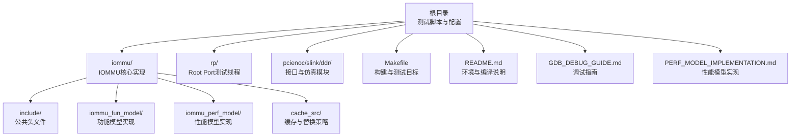
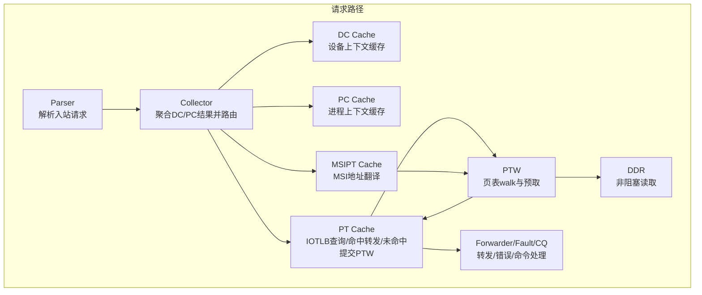
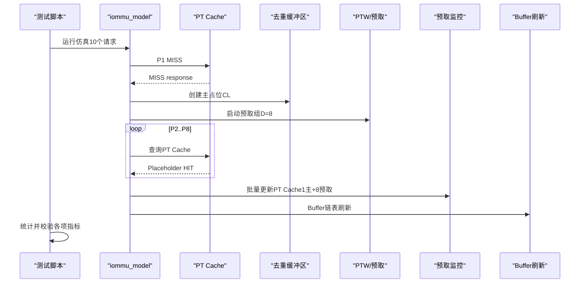
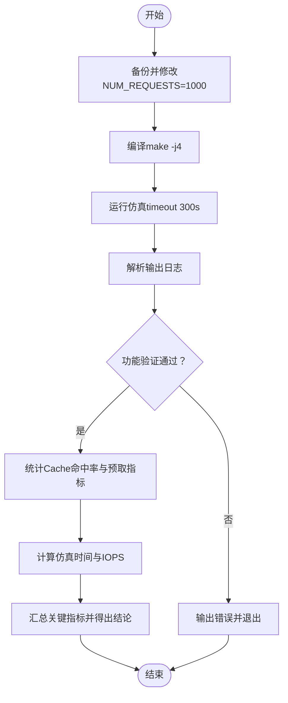
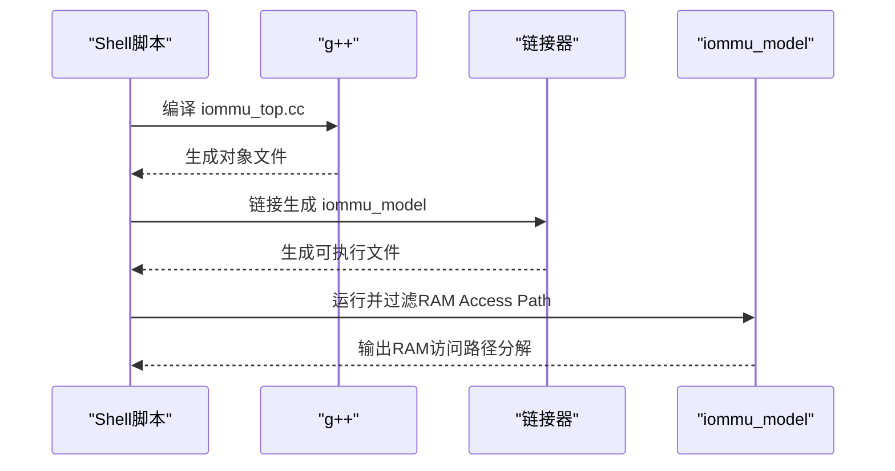
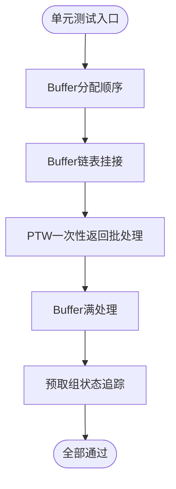
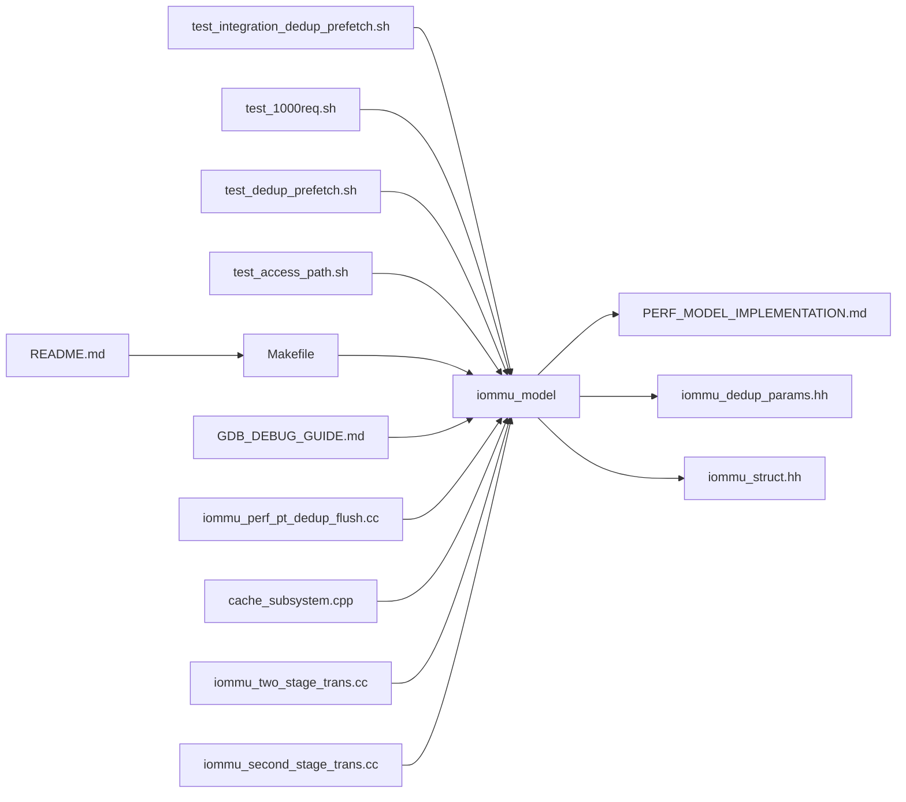

# 集成测试

<cite>
**本文引用的文件**
- [test_integration_dedup_prefetch.sh](file://test_integration_dedup_prefetch.sh)
- [test_1000req.sh](file://test_1000req.sh)
- [test_access_path.sh](file://test_access_path.sh)
- [test_dedup_prefetch.sh](file://test_dedup_prefetch.sh)
- [test_dedup_prefetch_unit.cpp](file://test_dedup_prefetch_unit.cpp)
- [Makefile](file://Makefile)
- [README.md](file://README.md)
- [GDB_DEBUG_GUIDE.md](file://GDB_DEBUG_GUIDE.md)
- [PERF_MODEL_IMPLEMENTATION.md](file://PERF_MODEL_IMPLEMENTATION.md)
- [iommu_dedup_params.hh](file://iommu/include/iommu_dedup_params.hh)
- [iommu_struct.hh](file://iommu/include/iommu_struct.hh)
- [test_rp_thread.cc](file://rp/test_rp_thread.cc)
- [iommu_perf_pt_dedup_flush.cc](file://iommu/perform_model/iommu_perf_pt_dedup_flush.cc)
- [cache_subsystem.cpp](file://iommu/cache_src/subsystem/cache_subsystem.cpp)
- [iommu_two_stage_trans.cc](file://iommu/iommu_fun_model/iommu_two_stage_trans.cc)
- [iommu_second_stage_trans.cc](file://iommu/iommu_fun_model/iommu_second_stage_trans.cc)
</cite>

## 目录
1. [简介](#简介)
2. [项目结构](#项目结构)
3. [核心组件](#核心组件)
4. [架构总览](#架构总览)
5. [详细组件分析](#详细组件分析)
6. [依赖关系分析](#依赖关系分析)
7. [性能考量](#性能考量)
8. [故障排查指南](#故障排查指南)
9. [结论](#结论)
10. [附录](#附录)

## 简介
本文件面向IOMMU集成测试，围绕以下目标展开：
- 全面解读test_integration_dedup_prefetch.sh集成测试脚本的工作原理与测试流程，重点验证PT Cache去重与预取（D=8）在连续同页访问场景下的整体行为。
- 解释test_1000req.sh大规模请求测试的设计思路与性能验证策略，涵盖功能正确性、Cache命中率、批处理更新与IOPS估算。
- 说明test_access_path.sh访问路径测试的实现机制与验证标准，聚焦RAM访问路径分解的可观测性。
- 提供测试执行步骤、参数配置与结果分析方法，并给出测试环境准备、测试数据生成与自动化测试流程的最佳实践。

**更新** 本次更新重点关注PT缓存去重系统的关键bug修复，特别是PA计算逻辑和dedup flush操作中的地址计算问题，确保在单阶段和两阶段地址转换场景下的一致性。

## 项目结构
本项目采用SystemC建模，测试脚本位于根目录，核心IOMMU实现位于iommu/子目录，测试数据与线程位于rp/等目录。Makefile统一编译构建，README提供环境与编译说明，GDB_DEBUG_GUIDE提供调试方法，PERF_MODEL_IMPLEMENTATION.md描述性能模型实现细节。

**图示来源**
- [Makefile:1-164](file://Makefile#L1-L164)
- [README.md:1-92](file://README.md#L1-L92)

**章节来源**
- [README.md:1-92](file://README.md#L1-L92)
- [Makefile:1-164](file://Makefile#L1-L164)

## 核心组件
- 集成测试脚本test_integration_dedup_prefetch.sh：验证PT Cache去重+预取在连续同页访问（D=8）场景下的关键指标，包括PT Cache MISS、占位CL HIT、预取组初始化、预取占位CL创建、预取组完成、批量更新PT Cache、Buffer链表刷新、task_id生成方式与互斥锁保护。
- 大规模请求测试test_1000req.sh：通过修改NUM_REQUESTS=1000，验证功能正确性（请求/响应计数、错误数）、PT Cache与DC Cache命中率、预取组与批处理更新统计、Buffer刷新统计、仿真时间与IOPS估算。
- 访问路径测试test_access_path.sh：编译并运行iommu_model，提取"RAM Access Path Breakdown"段落，用于验证内存访问路径分解的可观测性。
- 单元测试test_dedup_prefetch_unit.cpp：独立于SystemC，验证Buffer分配顺序、链表挂接、PTW一次性返回（批处理）、Buffer满处理与预取组状态追踪。
- Makefile与README：提供编译、测试目标与环境要求；GDB_DEBUG_GUIDE提供调试方法；PERF_MODEL_IMPLEMENTATION.md提供性能模型实现背景。

**章节来源**
- [test_integration_dedup_prefetch.sh:1-157](file://test_integration_dedup_prefetch.sh#L1-L157)
- [test_1000req.sh:1-226](file://test_1000req.sh#L1-L226)
- [test_access_path.sh:1-17](file://test_access_path.sh#L1-L17)
- [test_dedup_prefetch_unit.cpp:1-412](file://test_dedup_prefetch_unit.cpp#L1-L412)
- [Makefile:1-164](file://Makefile#L1-L164)
- [README.md:1-92](file://README.md#L1-L92)
- [GDB_DEBUG_GUIDE.md:1-206](file://GDB_DEBUG_GUIDE.md#L1-L206)
- [PERF_MODEL_IMPLEMENTATION.md:1-227](file://PERF_MODEL_IMPLEMENTATION.md#L1-L227)

## 架构总览
IOMMU模型由Parser、Collector、DC/PC Cache、PT Cache、MSIPT Cache、xDTW、PTW、Forwarder/Fault/CQ等模块构成，采用多线程并发处理请求，支持非阻塞DDR访问与Walker Cache加速。集成测试关注PT Cache去重与预取在真实请求流中的协同表现。

**图示来源**
- [PERF_MODEL_IMPLEMENTATION.md:14-97](file://PERF_MODEL_IMPLEMENTATION.md#L14-L97)

**章节来源**
- [PERF_MODEL_IMPLEMENTATION.md:1-227](file://PERF_MODEL_IMPLEMENTATION.md#L1-L227)

## 详细组件分析

### 组件A：PT Cache去重+预取集成测试（test_integration_dedup_prefetch.sh）
- 测试场景：P1~P8连续同页访问（4KB页，D=8），验证去重与预取的端到端行为。
- 关键验证点：
  - PT Cache MISS次数：期望1次（P1首次访问）。
  - 占位CL HIT次数：期望7次（P2~P8命中占位CL）。
  - 预取组初始化：期望1次（PTW进入预取模式）。
  - 预取占位CL创建：期望8个（1主+8预取）。
  - 预取组完成：期望1次（ALL COMPLETED）。
  - 批量更新PT Cache：期望1次（batch update completed）。
  - Buffer链表刷新：期望1次（Chain flush completed）。
  - task_id生成方式：期望使用全局计数器（prefetch_task_id=...）。
  - Buffer互斥锁保护：检查pt_dedup_buffer_mtx.lock是否存在。
- 输出与统计：脚本将关键日志行计数并汇总，最终统计通过项数并给出结论。

**图示来源**
- [test_integration_dedup_prefetch.sh:17-157](file://test_integration_dedup_prefetch.sh#L17-L157)

**章节来源**
- [test_integration_dedup_prefetch.sh:1-157](file://test_integration_dedup_prefetch.sh#L1-L157)

### 组件B：大规模请求测试（test_1000req.sh）
- 设计思路：通过修改NUM_REQUESTS=1000，结合test_rp_thread.cc中的测试场景，验证功能正确性与性能指标。
- 关键验证点：
  - 功能验证：请求发送数=1000、响应接收数=1000、错误数=0、PT Cache至少有一次访问。
  - Cache命中率统计：PT Cache与DC Cache的HIT/MISS/总计与命中率。
  - 预取与批处理：预取组完成数、PTW执行次数、批量更新次数、Buffer刷新次数。
  - 性能指标：仿真时间与IOPS估算（稳态窗口80%-90%）。
- 数据来源：脚本解析iommu_model输出中的日志关键字，统计并汇总关键指标。

**图示来源**
- [test_1000req.sh:16-226](file://test_1000req.sh#L16-L226)
- [test_rp_thread.cc:199-225](file://rp/test_rp_thread.cc#L199-L225)

**章节来源**
- [test_1000req.sh:1-226](file://test_1000req.sh#L1-L226)
- [test_rp_thread.cc:1-200](file://rp/test_rp_thread.cc#L1-L200)

### 组件C：访问路径测试（test_access_path.sh）
- 实现机制：设置编译标志，编译iommu_top.cc并链接SystemC库，运行iommu_model，使用grep提取"RAM Access Path Breakdown"段落。
- 验证标准：确认输出包含RAM访问路径分解信息，用于验证内存访问路径的可观测性与一致性。

**图示来源**
- [test_access_path.sh:1-17](file://test_access_path.sh#L1-L17)

**章节来源**
- [test_access_path.sh:1-17](file://test_access_path.sh#L1-L17)

### 组件D：单元测试（test_dedup_prefetch_unit.cpp）
- 目标：在不依赖SystemC的前提下，验证Buffer分配顺序、链表挂接、PTW一次性返回（批处理）、Buffer满处理与预取组状态追踪。
- 关键断言：分配顺序连续、链表尾标记与next指针正确、批量更新条目均为常规CL且IOVA/PPN连续、Buffer满时分配失败但释放后可重用、预取组pending归零且completed置位。

**图示来源**
- [test_dedup_prefetch_unit.cpp:120-412](file://test_dedup_prefetch_unit.cpp#L120-L412)

**章节来源**
- [test_dedup_prefetch_unit.cpp:1-412](file://test_dedup_prefetch_unit.cpp#L1-L412)

### 组件E：参数与数据结构支撑（iommu_dedup_params.hh、iommu_struct.hh）
- 参数支撑：定义去重Buffer容量、预取深度（DEFAULT_PREFETCH_DEPTH=8）、页大小（4KB）、PTE有效性标记等。
- 结构支撑：iommu_struct.hh定义IOMMU实例结构体，包含寄存器文件、缓存、ITAG跟踪等，为测试脚本解析日志提供背景知识。

**章节来源**
- [iommu_dedup_params.hh:1-92](file://iommu/include/iommu_dedup_params.hh#L1-L92)
- [iommu_struct.hh:1-102](file://iommu/include/iommu_struct.hh#L1-L102)

### 组件F：关键bug修复与地址计算优化

**更新** 本次更新重点反映了PT缓存去重系统的关键bug修复，主要包括：

#### PA计算逻辑修正
- **单阶段地址转换**：使用vs_pte.PPN作为页基址，计算PA = (vs_pte.PPN << 12) | offset
- **两阶段地址转换**：使用g_pte.PPN作为最终SPA，计算PA = (g_pte.PPN << 12) | offset
- **兼容性保证**：通过pt_updates[i].pa的页基址确保在两种转换模式下的一致性

#### dedup flush操作优化
- **核心算法改进**：先释放Buffer Entry，再写FIFO，避免FIFO阻塞影响其他任务分配
- **地址计算准确性**：使用group_iovas精确匹配IOVA，确保同页场景下的正确性
- **时序安全性**：通过扫描Buffer避免时序竞争，使用forwarded_task_ids防止重复转发

#### flush策略对比
- **flush_dedup_buffer_chain**：基于Buffer链表指针的高效路径，适用于正常预取场景
- **flush_dedup_buffer_by_iova**：基于IOVA扫描的兜底路径，避免时序竞争和重复转发问题

**章节来源**
- [iommu_perf_pt_dedup_flush.cc:150-347](file://iommu/perform_model/iommu_perf_pt_dedup_flush.cc#L150-L347)
- [cache_subsystem.cpp:649-886](file://iommu/cache_src/subsystem/cache_subsystem.cpp#L649-L886)
- [iommu_two_stage_trans.cc:1-38](file://iommu/iommu_fun_model/iommu_two_stage_trans.cc#L1-L38)
- [iommu_second_stage_trans.cc:413-423](file://iommu/iommu_fun_model/iommu_second_stage_trans.cc#L413-L423)

## 依赖关系分析
- 测试脚本依赖可执行文件iommu_model，Makefile提供编译与测试目标；README提供环境与编译说明；GDB_DEBUG_GUIDE提供调试方法；PERF_MODEL_IMPLEMENTATION.md提供性能模型实现背景。
- test_1000req.sh通过修改test_rp_thread.cc中的NUM_REQUESTS实现大规模请求测试；test_integration_dedup_prefetch.sh与test_dedup_prefetch.sh均依赖iommu_model输出的日志关键字进行统计与校验。

**图示来源**
- [Makefile:1-164](file://Makefile#L1-L164)
- [README.md:1-92](file://README.md#L1-L92)
- [GDB_DEBUG_GUIDE.md:1-206](file://GDB_DEBUG_GUIDE.md#L1-L206)
- [PERF_MODEL_IMPLEMENTATION.md:1-227](file://PERF_MODEL_IMPLEMENTATION.md#L1-L227)
- [iommu_dedup_params.hh:1-92](file://iommu/include/iommu_dedup_params.hh#L1-L92)
- [iommu_struct.hh:1-102](file://iommu/include/iommu_struct.hh#L1-L102)

**章节来源**
- [Makefile:1-164](file://Makefile#L1-L164)
- [README.md:1-92](file://README.md#L1-L92)
- [GDB_DEBUG_GUIDE.md:1-206](file://GDB_DEBUG_GUIDE.md#L1-L206)
- [PERF_MODEL_IMPLEMENTATION.md:1-227](file://PERF_MODEL_IMPLEMENTATION.md#L1-L227)

## 性能考量
- 预取深度（D=8）在连续同页访问场景下显著提升命中率，减少PT Cache MISS与PTW执行次数，同时通过批量更新降低PT Cache写放大。
- 大规模请求测试（1000req）通过稳态窗口（80%-90%）估算IOPS，评估系统在持续负载下的吞吐能力。
- Walker Cache与非阻塞DDR访问有助于降低延迟与提高并发处理能力。
- **新增优化**：flush操作的先释放后写入策略提高了系统的并发处理能力和资源利用率。

**章节来源**
- [test_integration_dedup_prefetch.sh:1-157](file://test_integration_dedup_prefetch.sh#L1-L157)
- [test_1000req.sh:166-182](file://test_1000req.sh#L166-L182)
- [PERF_MODEL_IMPLEMENTATION.md:100-129](file://PERF_MODEL_IMPLEMENTATION.md#L100-L129)
- [iommu_perf_pt_dedup_flush.cc:150-154](file://iommu/perform_model/iommu_perf_pt_dedup_flush.cc#L150-L154)

## 故障排查指南
- 环境与编译：确保在WSL中使用SystemC库，按README与Makefile进行编译；必要时使用GDB_DEBUG_GUIDE.md进行调试。
- 日志关键字：集成测试脚本依赖特定日志关键字进行统计，若日志缺失或格式变化，需检查编译选项与调试宏定义。
- 性能异常：若IOPS偏低或命中率异常，检查预取深度、批量更新频率与Walker Cache配置；核对test_rp_thread.cc中的访问模式与NUM_REQUESTS设置。
- **新增故障排查**：如遇dedup flush相关问题，检查Buffer链表完整性、IOVA匹配准确性以及PA计算逻辑的一致性。

**章节来源**
- [README.md:7-16](file://README.md#L7-L16)
- [GDB_DEBUG_GUIDE.md:1-206](file://GDB_DEBUG_GUIDE.md#L1-L206)
- [test_1000req.sh:166-182](file://test_1000req.sh#L166-L182)
- [iommu_perf_pt_dedup_flush.cc:160-197](file://iommu/perform_model/iommu_perf_pt_dedup_flush.cc#L160-L197)

## 结论
- test_integration_dedup_prefetch.sh成功验证了PT Cache去重与预取在连续同页访问场景下的协同效果，关键指标均符合预期。
- test_1000req.sh展示了大规模请求下的功能正确性与性能指标，为后续优化提供量化依据。
- test_access_path.sh提供了RAM访问路径的可观测性验证手段。
- **关键修复**：PA计算逻辑和dedup flush操作的bug修复确保了单阶段和两阶段地址转换场景下的一致性和可靠性。
- 建议在回归测试中持续运行上述脚本，并结合单元测试与调试工具，确保功能与性能稳定。

## 附录

### 执行步骤与参数配置
- 集成测试（去重+预取）：
  - 确保已编译生成iommu_model；
  - 直接运行test_integration_dedup_prefetch.sh，脚本内部会超时控制与日志统计。
- 大规模请求测试（1000req）：
  - 修改NUM_REQUESTS=1000（脚本已自动处理备份与替换）；
  - 执行编译（make -j4）；
  - 运行test_1000req.sh，解析输出并统计关键指标。
- 访问路径测试：
  - 设置编译标志并编译链接；
  - 运行iommu_model并通过grep提取RAM访问路径分解。
- 单元测试：
  - 使用Makefile目标test_dedup_unit编译并运行。

**章节来源**
- [test_integration_dedup_prefetch.sh:11-157](file://test_integration_dedup_prefetch.sh#L11-L157)
- [test_1000req.sh:16-31](file://test_1000req.sh#L16-L31)
- [test_access_path.sh:4-17](file://test_access_path.sh#L4-L17)
- [Makefile:139-160](file://Makefile#L139-L160)

### 结果分析方法
- 集成测试：以日志关键字计数为核心，逐项比对期望值，统计通过项数并得出结论。
- 1000req测试：功能验证（请求/响应计数、错误数）、Cache命中率、预取与批处理统计、Buffer刷新统计、仿真时间与IOPS估算。
- 访问路径测试：确认输出包含RAM访问路径分解信息。

**章节来源**
- [test_integration_dedup_prefetch.sh:27-157](file://test_integration_dedup_prefetch.sh#L27-L157)
- [test_1000req.sh:39-226](file://test_1000req.sh#L39-L226)
- [test_access_path.sh:15-17](file://test_access_path.sh#L15-L17)

### 测试环境准备与最佳实践
- 环境要求：WSL2、Ubuntu、SystemC库、GCC/G++、GNU Make。
- 编译建议：默认DEBUG=1便于调试；发布版本DEBUG=0以获得更好性能。
- 自动化流程：将测试脚本纳入CI流水线，设定超时与日志归档；对关键指标建立阈值报警。
- 数据生成：利用test_rp_thread.cc中的访问模式与NUM_REQUESTS参数生成不同规模与模式的测试数据。
- **新增最佳实践**：在进行dedup相关测试时，特别关注PA计算的一致性和flush操作的时序安全性。

**章节来源**
- [README.md:7-16](file://README.md#L7-L16)
- [Makefile:25-33](file://Makefile#L25-L33)
- [test_rp_thread.cc:199-225](file://rp/test_rp_thread.cc#L199-L225)
- [iommu_perf_pt_dedup_flush.cc:150-154](file://iommu/perform_model/iommu_perf_pt_dedup_flush.cc#L150-L154)