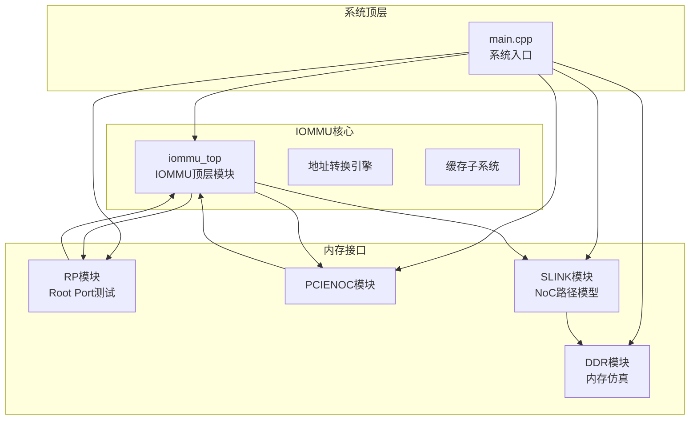
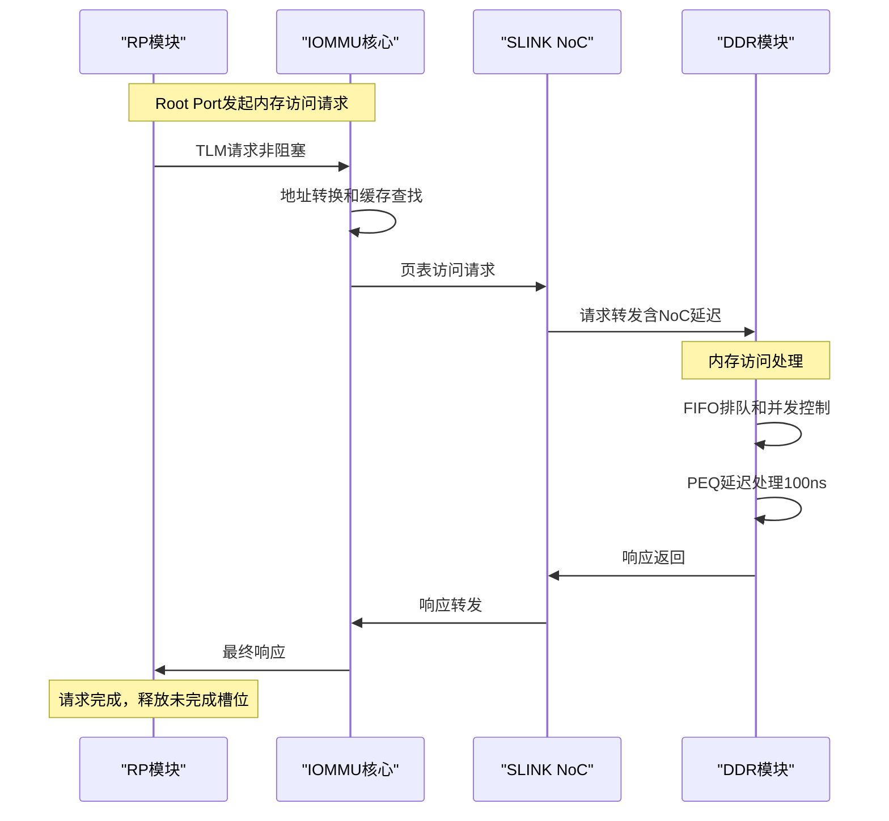
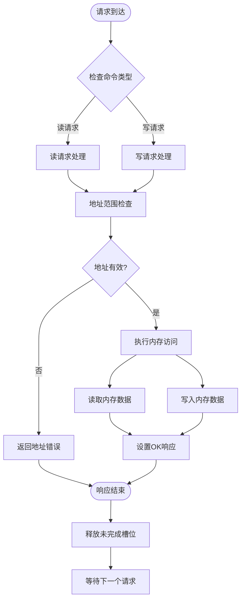
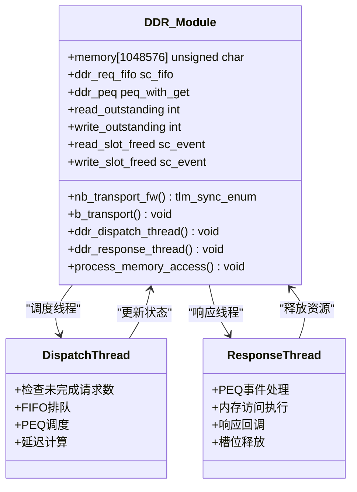
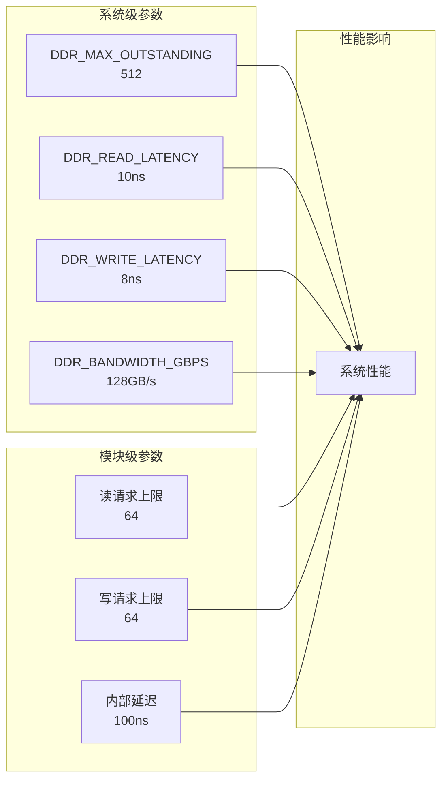
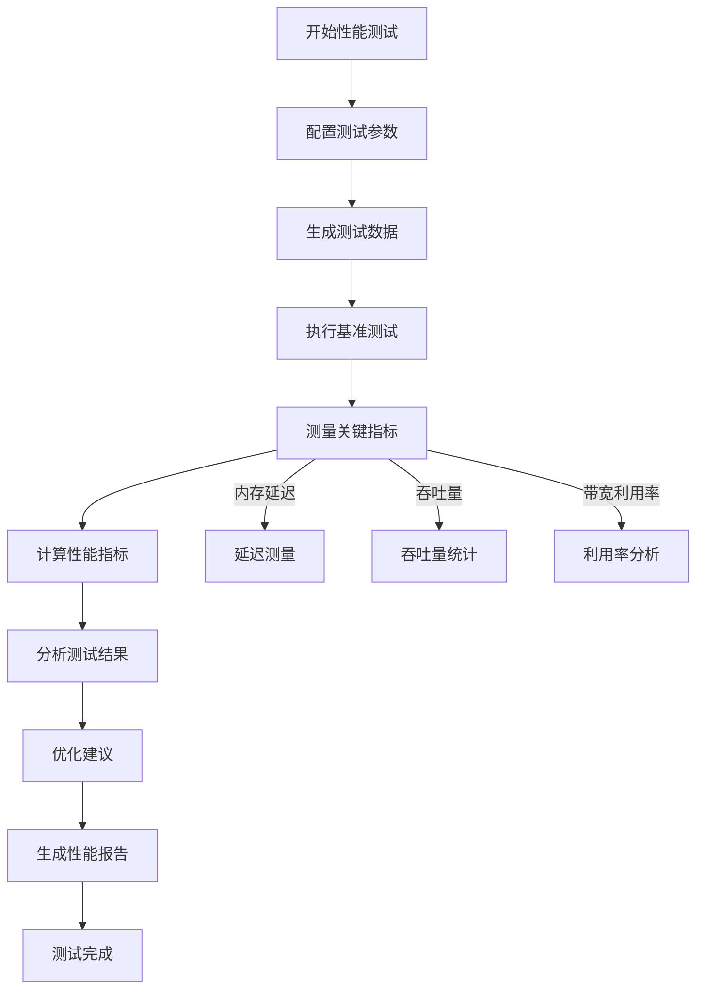
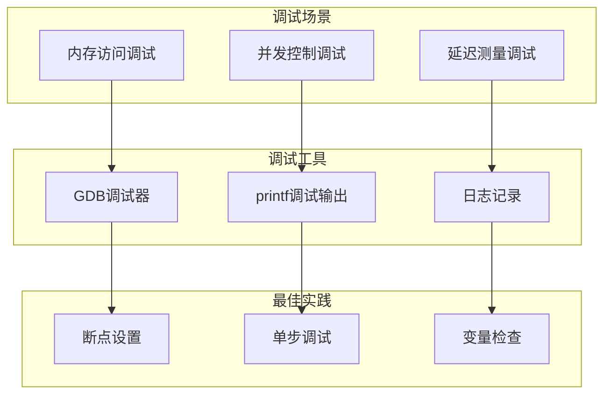

# DDR内存测试模块

<cite>
**本文档引用的文件**
- [test_ddr.cc](file://ddr/test_ddr.cc)
- [test_ddr.hh](file://ddr/test_ddr.hh)
- [main.cpp](file://main.cpp)
- [iommu_perf_params.hh](file://iommu/iommu_perf_model/iommu_perf_params.hh)
- [README.md](file://README.md)
- [GDB_DEBUG_GUIDE.md](file://GDB_DEBUG_GUIDE.md)
</cite>

## 更新摘要
**变更内容**
- 更新了DDR模块配置参数的关注点，从综合性能测试框架转向具体的DDR模块配置
- 新增了系统级性能参数与DDR模块配置的关系分析
- 更新了内存访问模式和并发控制机制的描述
- 增强了调试工具和故障排查指南

## 目录
1. [简介](#简介)
2. [项目结构](#项目结构)
3. [核心组件](#核心组件)
4. [架构概览](#架构概览)
5. [详细组件分析](#详细组件分析)
6. [配置参数详解](#配置参数详解)
7. [性能考量](#性能考量)
8. [故障排查指南](#故障排查指南)
9. [结论](#结论)

## 简介
本文件为RISC-V IOMMU项目中的DDR内存测试模块提供全面的技术文档。该模块实现了基于SystemC和TLM（Transaction Level Modeling）的DDR内存仿真，专注于DDR模块的配置管理和性能参数设置。文档重点涵盖DDR_Module类的配置参数、内存访问处理流程、并发控制机制，以及与系统级性能参数的集成关系。

**更新** 本版本重点关注DDR模块的具体配置而非综合性能测试框架，强调模块化配置和参数管理的重要性。

## 项目结构
该项目采用分层模块化设计，主要包含以下核心模块：
- **ddr/**: DDR内存仿真模块，包含test_ddr.cc和test_ddr.hh
- **iommu/**: IOMMU核心实现模块，包含地址转换、缓存、性能模型等功能
- **rp/**: Root Port测试模块，负责生成IOMMU测试请求
- **pcienoc/**: PCIe NoC接口模块
- **slink/**: SLINK NoC路径模型，连接IOMMU和DDR的页表访问

**图表来源**
- [main.cpp:39-94](file://main.cpp#L39-L94)

**章节来源**
- [README.md:63-76](file://README.md#L63-L76)
- [main.cpp:39-94](file://main.cpp#L39-L94)

## 核心组件
DDR内存测试模块的核心组件包括：

### DDR_Module类
- **内存存储**: 1MB的模拟DDR内存空间
- **并发控制**: 分离的读写未完成请求数量控制
- **延迟处理**: 100ns内部延迟的PEQ调度
- **接口支持**: 多个TLM简单目标socket

### 关键配置参数
- **最大未完成请求数**: 读写均为64个
- **内部延迟**: 100纳秒（固定）
- **内存容量**: 1MB（1024×1024字节）
- **FIFO深度**: 512个请求队列深度

**章节来源**
- [test_ddr.hh:17-61](file://ddr/test_ddr.hh#L17-L61)
- [test_ddr.cc:8-26](file://ddr/test_ddr.cc#L8-L26)

## 架构概览
DDR模块在整个IOMMU系统中扮演着关键角色，负责处理来自不同源的内存访问请求：

**图表来源**
- [test_ddr.cc:28-43](file://ddr/test_ddr.cc#L28-L43)
- [test_ddr.cc:55-89](file://ddr/test_ddr.cc#L55-L89)
- [test_ddr.cc:94-127](file://ddr/test_ddr.cc#L94-L127)

## 详细组件分析

### 内存访问处理流程
DDR模块实现了完整的内存读写处理流程：

**图表来源**
- [test_ddr.cc:132-153](file://ddr/test_ddr.cc#L132-L153)
- [test_ddr.cc:138-143](file://ddr/test_ddr.cc#L138-L143)

### 并发控制机制
DDR模块采用了双线程架构来处理并发请求：

**图表来源**
- [test_ddr.hh:17-61](file://ddr/test_ddr.hh#L17-L61)
- [test_ddr.cc:55-89](file://ddr/test_ddr.cc#L55-L89)
- [test_ddr.cc:94-127](file://ddr/test_ddr.cc#L94-L127)

### 内存访问模式设计
DDR模块支持多种内存访问模式：

1. **单字节访问**: 最小数据粒度，最高灵活性
2. **多字节批量访问**: 提高吞吐量，减少事务开销
3. **连续地址访问**: 模拟真实应用的内存访问模式
4. **随机地址访问**: 测试内存控制器的寻址能力

**章节来源**
- [test_ddr.cc:132-153](file://ddr/test_ddr.cc#L132-L153)
- [test_ddr.cc:145-149](file://ddr/test_ddr.cc#L145-L149)

## 配置参数详解

### DDR模块配置参数
DDR模块的配置参数直接影响其性能和行为：

| 参数类别 | 参数名称 | 值 | 描述 |
|---------|---------|----|------|
| 内存容量 | DDR_MEMORY_SIZE | 1MB | 模拟内存空间大小 |
| 并发控制 | DDR_READ_MAX_OUTSTANDING | 64 | 读请求最大未完成数 |
| 并发控制 | DDR_WRITE_MAX_OUTSTANDING | 64 | 写请求最大未完成数 |
| 延迟控制 | DDR_INTERNAL_LATENCY_NS | 100ns | 固定内部处理延迟 |
| FIFO深度 | DDR_REQ_FIFO_DEPTH | 512 | 请求队列深度 |
| 事件通知 | SLOT_EVENTS | read/write | 槽位释放通知 |

### 系统级性能参数集成
DDR模块配置与系统级性能参数存在密切关系：

**图表来源**
- [iommu_perf_params.hh:78-82](file://iommu/iommu_perf_model/iommu_perf_params.hh#L78-L82)
- [test_ddr.hh:20-22](file://ddr/test_ddr.hh#L20-L22)

**章节来源**
- [iommu_perf_params.hh:78-82](file://iommu/iommu_perf_model/iommu_perf_params.hh#L78-L82)
- [test_ddr.hh:20-25](file://ddr/test_ddr.hh#L20-L25)

### 内存延迟测量
DDR模块实现了精确的延迟测量机制：

| 流程阶段 | 延迟类型 | 延迟值 | 描述 |
|---------|---------|--------|------|
| 请求到达 | 到达时间戳 | 系统时间 | 记录请求进入时间 |
| 调度处理 | 队列等待 | 动态计算 | FIFO排队等待时间 |
| 内部处理 | 固定延迟 | 100ns | PEQ延迟处理 |
| 响应返回 | 响应时间 | 系统时间 | 记录响应完成时间 |

**章节来源**
- [test_ddr.cc:74-84](file://ddr/test_ddr.cc#L74-L84)
- [test_ddr.cc:99-108](file://ddr/test_ddr.cc#L99-L108)

## 性能考量

### 内存访问性能优化建议

1. **并发请求优化**
   - 合理设置读写未完成请求数上限
   - 优化FIFO深度以平衡延迟和吞吐量
   - 使用PEQ实现精确的延迟控制

2. **内存布局优化**
   - 连续内存访问模式优于随机访问
   - 批量数据传输比小块传输更高效
   - 避免跨页边界访问

3. **系统级优化**
   - SLINK NoC路径的延迟优化
   - IOMMU缓存命中率提升
   - 减少不必要的地址转换

### 性能基准测试方法

**图表来源**
- [test_ddr.cc:74-84](file://ddr/test_ddr.cc#L74-L84)
- [test_ddr.cc:99-108](file://ddr/test_ddr.cc#L99-L108)

## 故障排查指南

### 常见问题及解决方案

1. **内存访问错误**
   - **症状**: 地址越界错误，响应状态异常
   - **原因**: 访问超出1MB内存范围
   - **解决方案**: 检查地址计算逻辑，确保地址在有效范围内

2. **并发冲突**
   - **症状**: 请求阻塞，未完成请求数超过限制
   - **原因**: 读写请求过多，超出64个限制
   - **解决方案**: 优化请求频率，调整并发参数

3. **延迟异常**
   - **症状**: 响应时间过长或过短
   - **原因**: PEQ调度问题或事件通知异常
   - **解决方案**: 检查PEQ事件处理，验证延迟计算

### 调试工具和技巧

**图表来源**
- [GDB_DEBUG_GUIDE.md:36-68](file://GDB_DEBUG_GUIDE.md#L36-L68)
- [test_ddr.cc:77-84](file://ddr/test_ddr.cc#L77-L84)

**章节来源**
- [GDB_DEBUG_GUIDE.md:69-102](file://GDB_DEBUG_GUIDE.md#L69-L102)
- [test_ddr.cc:138-143](file://ddr/test_ddr.cc#L138-L143)

### 数据完整性验证机制

1. **地址范围验证**
   - 检查访问地址是否在1MB范围内
   - 防止内存越界访问

2. **响应状态检查**
   - TLM_OK_RESPONSE表示成功
   - TLM_ADDRESS_ERROR_RESPONSE表示地址错误
   - TLM_GENERIC_ERROR_RESPONSE表示其他错误

3. **内存一致性检查**
   - 读写操作的数据一致性验证
   - 内存内容的完整性检查

**章节来源**
- [test_ddr.cc:138-152](file://ddr/test_ddr.cc#L138-L152)

## 结论
DDR内存测试模块为RISC-V IOMMU系统提供了完整的内存访问验证能力。通过精确的并发控制、延迟测量和数据完整性验证，该模块能够有效评估IOMMU系统的内存子系统性能。模块采用的PEQ调度机制和事件驱动架构确保了高精度的时间控制和良好的系统性能。

**更新** 本版本强调了DDR模块配置参数的重要性，这些参数直接影响系统的整体性能表现。通过合理配置DDR模块参数，可以有效提升IOMMU系统的内存访问效率和稳定性。

未来可以考虑的改进方向包括：
- 增加更多内存访问模式的支持
- 实现更精细的性能统计功能
- 优化内存布局以支持更大的内存容量
- 增强错误检测和恢复机制
- 提供动态参数调整能力

该模块为IOMMU系统的开发和调试提供了重要的基础设施支持，是整个系统验证流程中不可或缺的一部分。