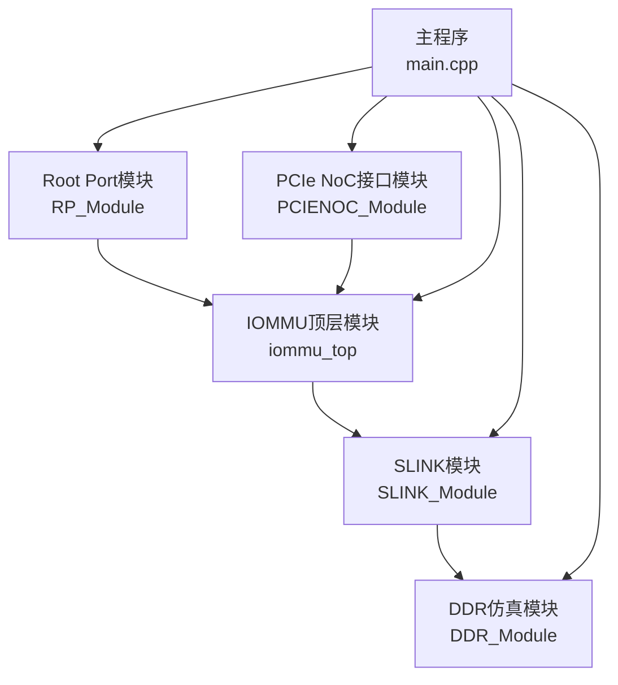
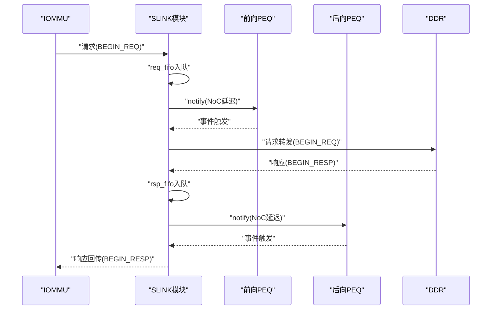
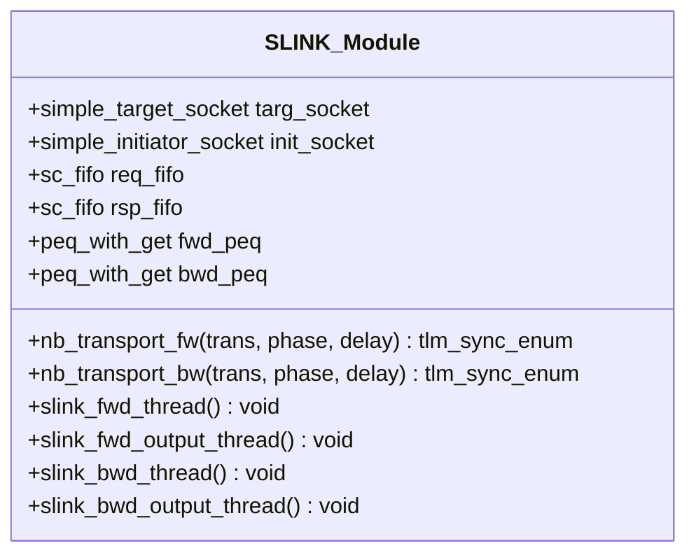
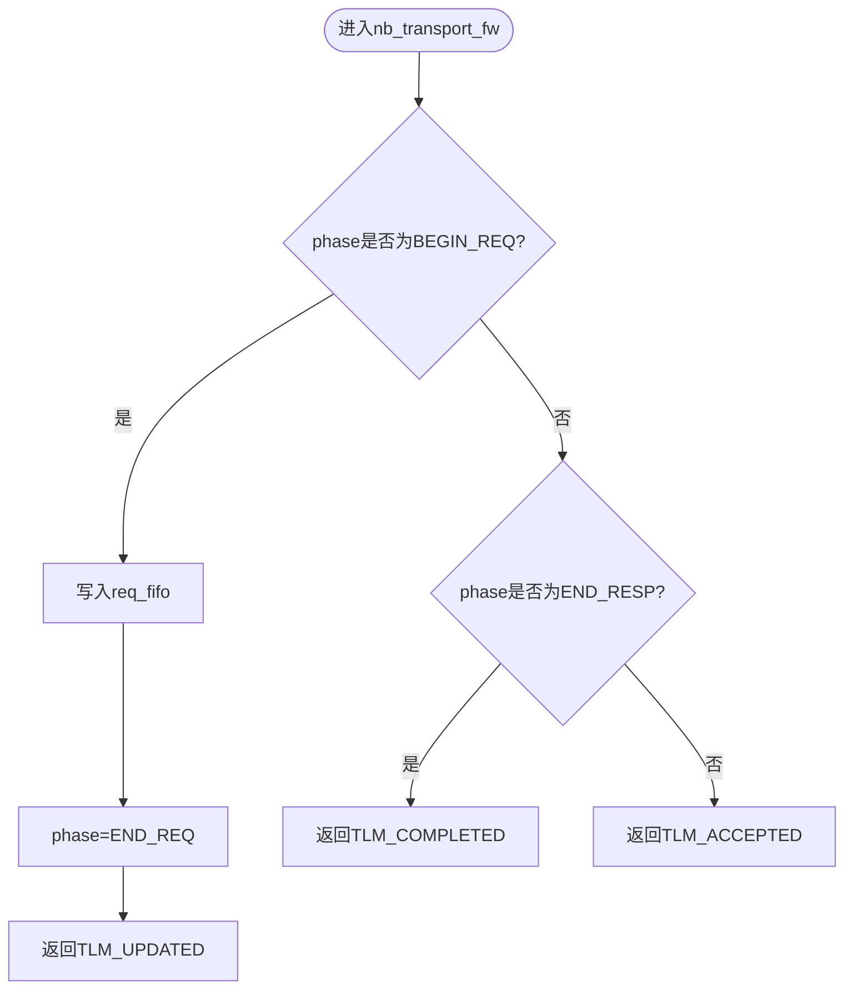
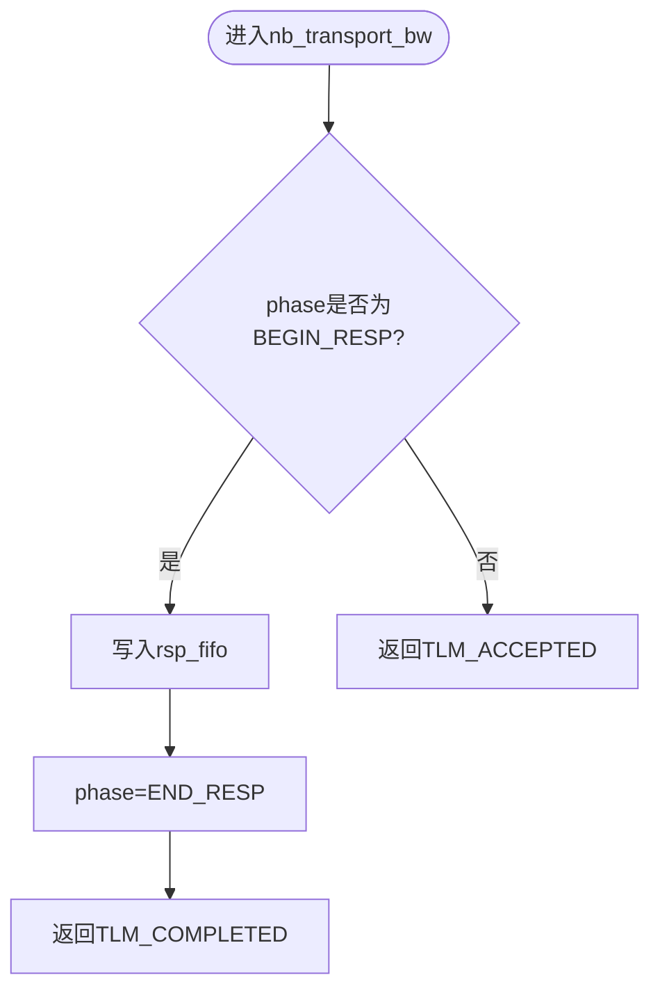
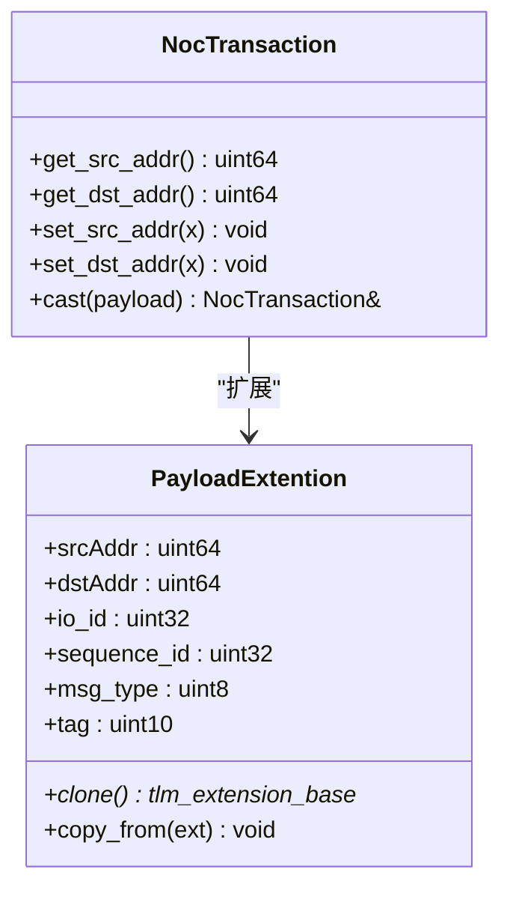
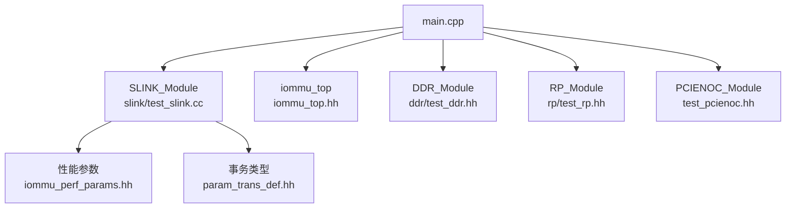

# NoC路径测试模块

<cite>
**本文引用的文件**
- [test_slink.cc](file://slink/test_slink.cc)
- [test_slink.hh](file://slink/test_slink.hh)
- [iommu_perf_params.hh](file://iommu\iommu_perf_model\iommu_perf_params.hh)
- [param_trans_def.hh](file://iommu\include\param_trans_def.hh)
- [main.cpp](file://main.cpp)
- [README.md](file://README.md)
- [Makefile](file://Makefile)
- [CACHE_PERFORMANCE_ANALYSIS_500REQ.md](file://CACHE_PERFORMANCE_ANALYSIS_500REQ.md)
- [PERF_MODEL_IMPLEMENTATION.md](file://PERF_MODEL_IMPLEMENTATION.md)
- [iommu_struct.hh](file://iommu\include\iommu_struct.hh)
- [iommu_top.hh](file://iommu\iommu_top.hh)
- [test_pcienoc.hh](file://pcienoc\test_pcienoc.hh)
</cite>

## 目录
1. [简介](#简介)
2. [项目结构](#项目结构)
3. [核心组件](#核心组件)
4. [架构概览](#架构概览)
5. [详细组件分析](#详细组件分析)
6. [依赖关系分析](#依赖关系分析)
7. [性能考量](#性能考量)
8. [故障排查指南](#故障排查指南)
9. [结论](#结论)
10. [附录](#附录)

## 简介
本文件为RISC-V IOMMU项目中NoC（片上网络）路径测试模块的综合技术文档，聚焦于SLINK模块对IOMMU与DDR之间页表/目录表访问路径的建模与验证。文档涵盖以下主题：
- 路径模型验证：请求与响应双向流水线、PEQ延迟、FIFO深度与背压控制
- 延迟测量：NoC单向延迟参数、流水线阶段时序、端到端时延评估
- 网络拓扑测试：IOMMU→SLINK→DDR的端口绑定、并发限制与流量控制
- 测试用例设计：基于SystemC/TLM的非阻塞传输回调、事务扩展与序列化
- 连通性与数据传输验证：请求转发、响应回传、时序一致性
- 网络拥塞检测：FIFO深度、outstanding计数、PEQ事件驱动
- 配置参数与场景设计：参数文件、构建选项、测试场景切换
- 性能优化建议：缓冲区深度、流水线延迟、并行度与带宽利用
- 故障诊断与监控：事件与计数器、日志与调试宏

## 项目结构
SLINK模块位于独立的slink目录，通过SystemC与TLM接口连接IOMMU与DDR，形成“IOMMU→SLINK→DDR”的NoC路径。主程序负责实例化各模块并建立绑定关系。

**图表来源**
- [main.cpp:64-79](file://main.cpp#L64-L79)
- [test_slink.hh:23-28](file://slink/test_slink.hh#L23-L28)

**章节来源**
- [README.md:63-76](file://README.md#L63-L76)
- [main.cpp:39-94](file://main.cpp#L39-L94)

## 核心组件
- SLINK模块：封装NoC路径的请求/响应双向流水线，使用FIFO与PEQ实现延迟建模与异步转发。
- 参数与类型：通过性能参数文件提供NoC延迟、FIFO深度、带宽与并发限制等关键参数。
- 事务扩展：NocTransaction与PayloadExtention扩展承载源/目的地址、消息类型、序列号等元数据。
- 主程序绑定：在main.cpp中完成IOMMU与SLINK、SLINK与DDR之间的socket绑定，形成端到端路径。

**章节来源**
- [test_slink.hh:21-55](file://slink/test_slink.hh#L21-L55)
- [iommu_perf_params.hh:140-142](file://iommu\iommu_perf_model\iommu_perf_params.hh#L140-L142)
- [param_trans_def.hh:104-128](file://iommu\include\param_trans_def.hh#L104-L128)
- [main.cpp:64-71](file://main.cpp#L64-L71)

## 架构概览
SLINK模块采用双工流水线设计：
- 请求路径：IOMMU发起的请求经由req_fifo排队，随后通过fwd_peq引入NoC延迟，再由init_socket转发至DDR。
- 响应路径：DDR返回的响应经由rsp_fifo排队，通过bwd_peq引入NoC延迟，再由targ_socket回传给IOMMU。
- 时序控制：PEQ事件驱动，确保延迟的精确建模；FIFO深度与outstanding计数避免拥塞。

**图表来源**
- [test_slink.cc:66-87](file://slink/test_slink.cc#L66-L87)
- [test_slink.cc:94-115](file://slink/test_slink.cc#L94-L115)

**章节来源**
- [test_slink.cc:6-26](file://slink/test_slink.cc#L6-L26)
- [test_slink.cc:66-115](file://slink/test_slink.cc#L66-L115)

## 详细组件分析

### SLINK模块类图
SLINK_Module封装了目标/发起socket、内部FIFO与PEQ，以及四条处理线程，分别负责请求与响应的入队、延迟与转发。

**图表来源**
- [test_slink.hh:21-55](file://slink/test_slink.hh#L21-L55)

**章节来源**
- [test_slink.hh:21-55](file://slink/test_slink.hh#L21-L55)

### 请求路径处理流程
- 回调处理：当收到IOMMU的BEGIN_REQ时，将事务指针写入req_fifo，并立即返回END_REQ。
- 入队与延迟：slink_fwd_thread循环读取req_fifo并将事务通知到fwd_peq，延迟时间为SLINK_NOC_LATENCY_NS。
- 输出转发：slink_fwd_output_thread等待fwd_peq事件，取出事务并通过init_socket以BEGIN_REQ转发至DDR。

**图表来源**
- [test_slink.cc:32-44](file://slink/test_slink.cc#L32-L44)

**章节来源**
- [test_slink.cc:32-44](file://slink/test_slink.cc#L32-L44)
- [test_slink.cc:66-87](file://slink/test_slink.cc#L66-L87)

### 响应路径处理流程
- 回调处理：当收到DDR的BEGIN_RESP时，将事务写入rsp_fifo，并立即返回END_RESP。
- 入队与延迟：slink_bwd_thread循环读取rsp_fifo并将事务通知到bwd_peq，延迟时间为SLINK_NOC_LATENCY_NS。
- 输出回传：slink_bwd_output_thread等待bwd_peq事件，取出事务并通过targ_socket以BEGIN_RESP回传给IOMMU。

**图表来源**
- [test_slink.cc:51-59](file://slink/test_slink.cc#L51-L59)

**章节来源**
- [test_slink.cc:51-59](file://slink/test_slink.cc#L51-L59)
- [test_slink.cc:94-115](file://slink/test_slink.cc#L94-L115)

### 事务扩展与路径测试
NocTransaction与PayloadExtention扩展提供源/目的地址、消息类型、序列号等字段，便于路径测试中追踪事务流向与验证数据完整性。

**图表来源**
- [param_trans_def.hh:104-128](file://iommu\include\param_trans_def.hh#L104-L128)

**章节来源**
- [param_trans_def.hh:12-58](file://iommu\include\param_trans_def.hh#L12-L58)
- [param_trans_def.hh:104-128](file://iommu\include\param_trans_def.hh#L104-L128)

### 路径测试用例设计与验证
- 路径模型验证：通过PEQ延迟与FIFO深度验证NoC路径的时序与吞吐。
- 路径选择验证：确认请求与响应均经由SLINK模块转发，未绕过。
- 性能测量方法：结合性能参数文件中的SLINK_NOC_LATENCY_NS进行端到端时延评估；通过outstanding计数与FIFO深度监控拥塞风险。
- 数据传输验证：利用NocTransaction扩展字段校验源/目的地址与消息类型一致性。
- 网络拓扑测试：在main.cpp中完成socket绑定，验证IOMMU→SLINK→DDR链路连通性。

**章节来源**
- [iommu_perf_params.hh:140-142](file://iommu\iommu_perf_model\iommu_perf_params.hh#L140-L142)
- [main.cpp:64-71](file://main.cpp#L64-L71)
- [param_trans_def.hh:104-128](file://iommu\include\param_trans_def.hh#L104-L128)

## 依赖关系分析
SLINK模块与系统其他组件的依赖关系如下：

**图表来源**
- [test_slink.cc:1-10](file://slink/test_slink.cc#L1-L10)
- [iommu_perf_params.hh:1-10](file://iommu\iommu_perf_model\iommu_perf_params.hh#L1-L10)
- [param_trans_def.hh:1-10](file://iommu\include\param_trans_def.hh#L1-L10)
- [main.cpp:9-13](file://main.cpp#L9-L13)

**章节来源**
- [test_slink.cc:1-10](file://slink/test_slink.cc#L1-L10)
- [iommu_perf_params.hh:1-10](file://iommu\iommu_perf_model\iommu_perf_params.hh#L1-L10)
- [param_trans_def.hh:1-10](file://iommu\include\param_trans_def.hh#L1-L10)
- [main.cpp:9-13](file://main.cpp#L9-L13)

## 性能考量
- NoC延迟建模：SLINK_NOC_LATENCY_NS定义了单向NoC延迟，请求与响应通路各引入一次该延迟，总延迟为两倍。
- FIFO深度与并发：req_fifo与rsp_fifo深度均为256，匹配IOMMU master outstanding；DDR侧FIFO深度更大以应对walk并发。
- 带宽与延迟：性能参数文件提供端口带宽与延迟计算公式，可用于评估路径吞吐与排队时延。
- 缓存与Walker优化：参考性能分析文档，Walker Cache显著降低PTW DDR访问次数，PT Cache在空间扫描场景命中率为0属预期。

**章节来源**
- [iommu_perf_params.hh:140-142](file://iommu\iommu_perf_model\iommu_perf_params.hh#L140-L142)
- [iommu_perf_params.hh:40-49](file://iommu\iommu_perf_model\iommu_perf_params.hh#L40-L49)
- [iommu_perf_params.hh:88-101](file://iommu\iommu_perf_model\iommu_perf_params.hh#L88-L101)
- [CACHE_PERFORMANCE_ANALYSIS_500REQ.md:13-305](file://CACHE_PERFORMANCE_ANALYSIS_500REQ.md#L13-L305)

## 故障排查指南
- 连通性测试：确认main.cpp中的socket绑定正确，IOMMU的axi_master_1_to_cmn_rnd_socket绑定到SLINK的targ_socket，SLINK的init_socket绑定到DDR的axi_slave_from_cmn_rnd_1_socket。
- 数据传输验证：通过NocTransaction扩展字段核对源/目的地址与消息类型，确保请求与响应路径一致。
- 网络拥塞检测：监控FIFO深度与outstanding计数，若出现持续积压或超阈值，考虑增大FIFO深度或调整并发限制。
- 调试与日志：启用DEBUG宏以获得更详细的仿真输出，便于定位时序与路径问题。

**章节来源**
- [main.cpp:64-71](file://main.cpp#L64-L71)
- [param_trans_def.hh:104-128](file://iommu\include\param_trans_def.hh#L104-L128)
- [Makefile:23-30](file://Makefile#L23-L30)

## 结论
SLINK模块通过PEQ与FIFO实现了对IOMMU→DDR页表访问路径的精确时序建模，结合性能参数文件与事务扩展，能够有效支撑NoC路径的连通性、数据传输与性能评估。通过对FIFO深度、outstanding计数与延迟参数的合理配置，可在保证吞吐的同时避免拥塞。建议在实际部署中结合Walker Cache与缓存策略进一步优化端到端时延。

## 附录

### 配置参数与测试场景
- 性能参数：SLINK_NOC_LATENCY_NS、FIFO深度、端口带宽与并发限制等。
- 构建选项：DEBUG开关、测试场景切换（TEST=sv39_bare或sv48_bare）。
- 测试场景：通过Makefile选择不同的测试线程文件，支持Sv39与Sv48 Bare模式。

**章节来源**
- [iommu_perf_params.hh:140-142](file://iommu\iommu_perf_model\iommu_perf_params.hh#L140-L142)
- [Makefile:3-40](file://Makefile#L3-L40)
- [README.md:17-54](file://README.md#L17-L54)

### 结果分析工具与参考
- 性能分析报告：包含Walker Cache命中率、PT Cache命中率与延时统计，指导缓存与路径优化。
- 性能模型实现：提供SPEC v4实现细节与模块划分，便于理解与扩展。

**章节来源**
- [CACHE_PERFORMANCE_ANALYSIS_500REQ.md:1-305](file://CACHE_PERFORMANCE_ANALYSIS_500REQ.md#L1-L305)
- [PERF_MODEL_IMPLEMENTATION.md:1-227](file://PERF_MODEL_IMPLEMENTATION.md#L1-L227)