# PCIENOC测试模块

<cite>
**本文档引用的文件**
- [test_pcienoc.cc](file://pcienoc/test_pcienoc.cc)
- [test_pcienoc.hh](file://pcienoc/test_pcienoc.hh)
- [test_rp_func.cc](file://rp/test_rp_func.cc)
- [test_rp_thread.cc](file://rp/test_rp_thread.cc)
- [test_rp.hh](file://rp/test_rp.hh)
- [iommu_struct.hh](file://iommu/iommu_struct.hh)
- [param_trans_def.hh](file://iommu/param_trans_def.hh)
- [iommu_registers.hh](file://iommu/iommu_registers.hh)
- [iommu_req_rsp.hh](file://iommu/iommu_req_rsp.hh)
- [iommu_ats.hh](file://iommu/iommu_ats.hh)
- [iommu_ats.cc](file://iommu/iommu_ats.cc)
- [iommu_translate.cc](file://iommu/iommu_translate.cc)
- [iommu_ref_api.cc](file://iommu/iommu_ref_api.cc)
</cite>

## 目录
1. [简介](#简介)
2. [项目结构](#项目结构)
3. [核心组件](#核心组件)
4. [架构概览](#架构概览)
5. [详细组件分析](#详细组件分析)
6. [依赖关系分析](#依赖关系分析)
7. [性能考虑](#性能考虑)
8. [故障排除指南](#故障排除指南)
9. [结论](#结论)

## 简介

PCIENOC测试模块是基于SystemC和TLM（Transactional Library Model）构建的PCIe网络接口测试框架。该模块旨在验证PCIe总线通信协议的正确性和可靠性，特别专注于PCIe ATS（Address Translation Services）消息处理、设备枚举配置以及事务层消息路由机制。

本测试模块通过模拟PCIe网络环境，实现了对IOMMU（Input-Output Memory Management Unit）功能的全面测试，包括地址转换、权限控制、故障处理等关键特性。模块采用分层设计，将PCIe协议栈的不同层次分离，便于独立测试和验证。

## 项目结构

项目采用模块化组织方式，主要包含以下核心目录：

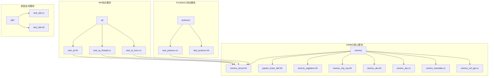

**图表来源**
- [test_pcienoc.hh:1-21](file://pcienoc/test_pcienoc.hh#L1-L21)
- [test_rp.hh:1-112](file://rp/test_rp.hh#L1-L112)
- [iommu_struct.hh:1-102](file://iommu/iommu_struct.hh#L1-L102)

**章节来源**
- [test_pcienoc.hh:1-21](file://pcienoc/test_pcienoc.hh#L1-L21)
- [test_rp.hh:1-112](file://rp/test_rp.hh#L1-L112)
- [iommu_struct.hh:1-102](file://iommu/iommu_struct.hh#L1-L102)

## 核心组件

### PCIENOC测试模块

PCIENOC测试模块提供了PCIe网络接口的测试框架，其核心组件包括：

#### 主要类结构

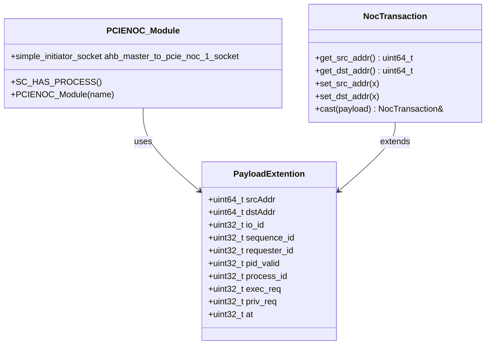

**图表来源**
- [test_pcienoc.hh:10-19](file://pcienoc/test_pcienoc.hh#L10-L19)
- [param_trans_def.hh:12-97](file://iommu/param_trans_def.hh#L12-L97)

#### 关键特性

1. **Socket接口设计**：提供AHB到PCIe NOC的主设备socket接口
2. **Payload扩展**：支持PCIe ATS消息的完整元数据传递
3. **系统C集成**：完全兼容SystemC仿真环境

### RP测试模块

RP（Root Port）测试模块是PCIENOC的核心测试组件，负责模拟PCIe根端口行为：

#### 测试功能矩阵

| 测试类别 | 功能描述 | 实现方法 |
|---------|----------|----------|
| 设备枚举 | PCIe设备发现和配置 | `add_device()`函数 |
| 地址转换 | IOVA到PA的地址翻译 | `send_translation_request_rp()` |
| ATS消息处理 | PCIe ATS消息生成和验证 | `handle_page_request()` |
| 故障检测 | 内存访问异常和数据损坏 | `check_faults_rp()` |
| 缓存管理 | TLB和页表缓存失效 | `iotinval()` |

**章节来源**
- [test_rp_func.cc:170-198](file://rp/test_rp_func.cc#L170-L198)
- [test_rp_func.cc:200-288](file://rp/test_rp_func.cc#L200-L288)
- [test_rp_func.cc:80-168](file://rp/test_rp_func.cc#L80-L168)

## 架构概览

PCIENOC测试模块采用分层架构设计，确保各组件职责清晰、耦合度低：

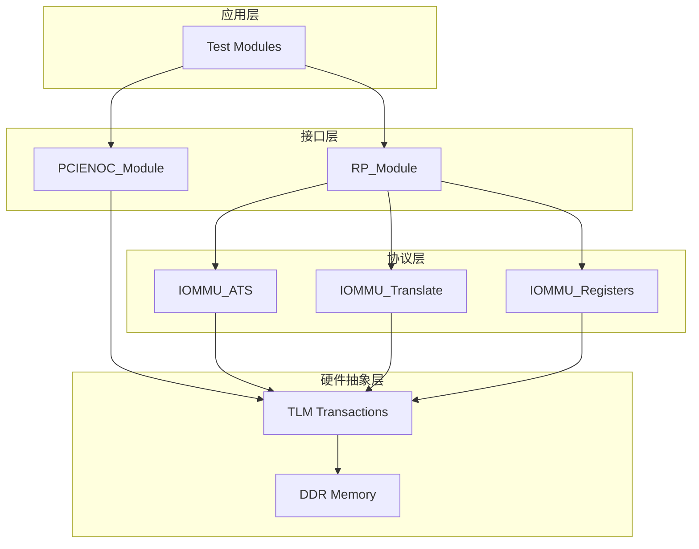

**图表来源**
- [test_rp.hh:54-71](file://rp/test_rp.hh#L54-L71)
- [test_pcienoc.hh:10-19](file://pcienoc/test_pcienoc.hh#L10-L19)
- [iommu_struct.hh:42-99](file://iommu/iommu_struct.hh#L42-L99)

### 数据流架构

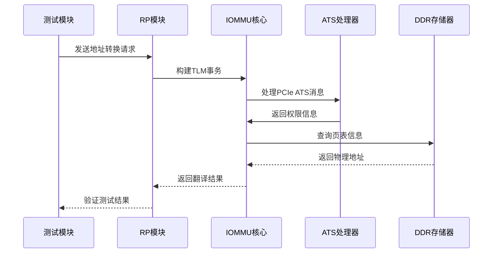

**图表来源**
- [test_rp_func.cc:28-78](file://rp/test_rp_func.cc#L28-L78)
- [iommu_translate.cc:85-112](file://iommu/iommu_translate.cc#L85-L112)

## 详细组件分析

### ATS消息处理机制

ATS（Address Translation Services）是PCIe协议中的关键功能，用于动态地址转换和权限管理。

#### ATS消息类型

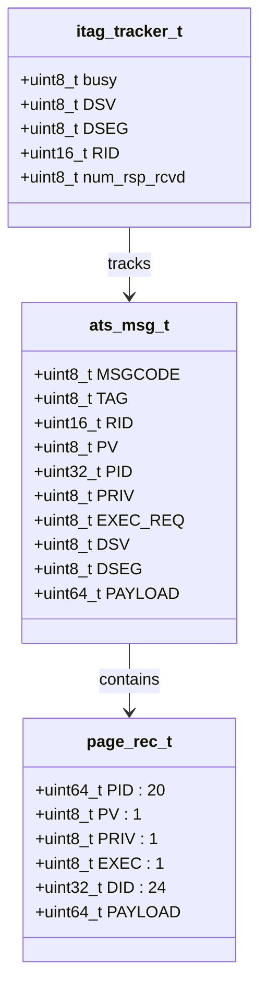

**图表来源**
- [iommu_ats.hh:47-91](file://iommu/iommu_ats.hh#L47-L91)
- [iommu_ats.hh:7-19](file://iommu/iommu_ats.hh#L7-L19)

#### ATS消息处理流程

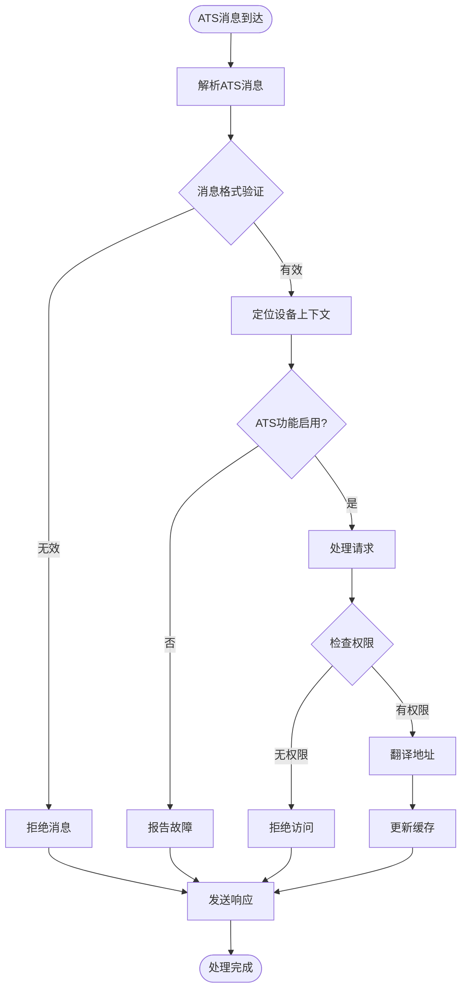

**图表来源**
- [iommu_ats.cc:96-200](file://iommu/iommu_ats.cc#L96-L200)
- [iommu_ats.cc:169-184](file://iommu/iommu_ats.cc#L169-L184)

**章节来源**
- [iommu_ats.hh:1-98](file://iommu/iommu_ats.hh#L1-L98)
- [iommu_ats.cc:1-200](file://iommu/iommu_ats.cc#L1-L200)

### 设备枚举和配置测试

设备枚举测试模块负责验证PCIe设备的发现、配置和状态管理：

#### 设备上下文配置

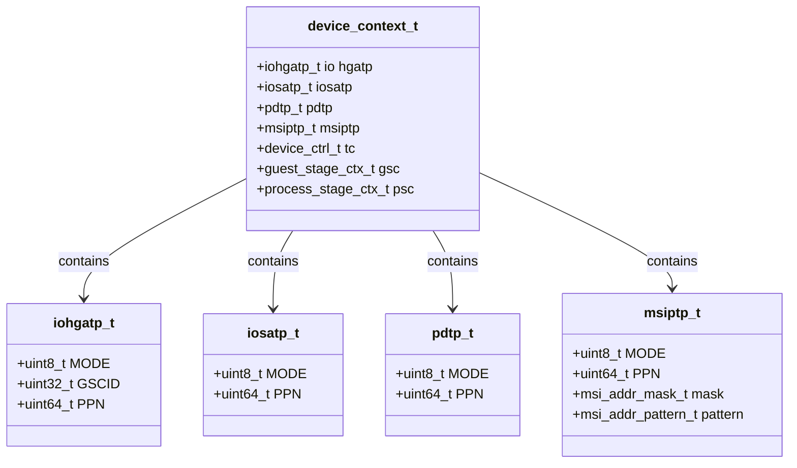

**图表来源**
- [test_rp_func.cc:200-288](file://rp/test_rp_func.cc#L200-L288)

#### 设备配置流程

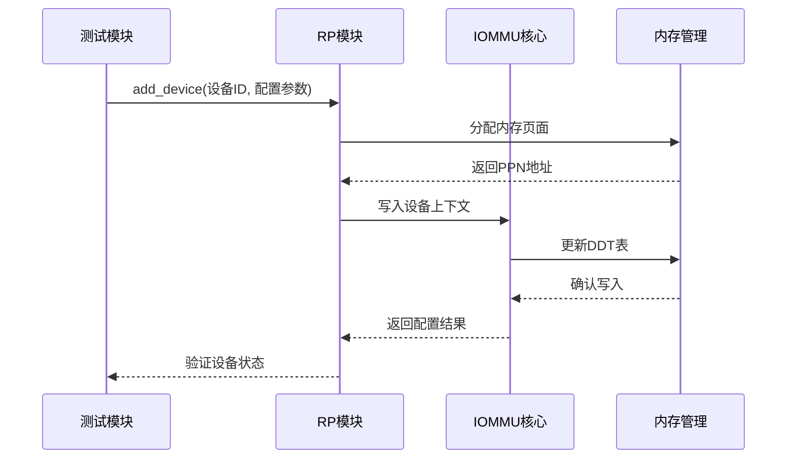

**图表来源**
- [test_rp_func.cc:200-288](file://rp/test_rp_func.cc#L200-L288)

**章节来源**
- [test_rp_func.cc:200-288](file://rp/test_rp_func.cc#L200-L288)

### 事务层消息路由机制

事务层负责PCIe消息的路由和转发，确保请求-响应的正确匹配：

#### 请求-响应匹配机制

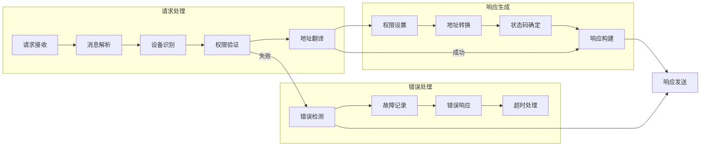

**图表来源**
- [iommu_translate.cc:85-112](file://iommu/iommu_translate.cc#L85-L112)
- [iommu_translate.cc:533-599](file://iommu/iommu_translate.cc#L533-L599)

#### 错误处理和超时管理

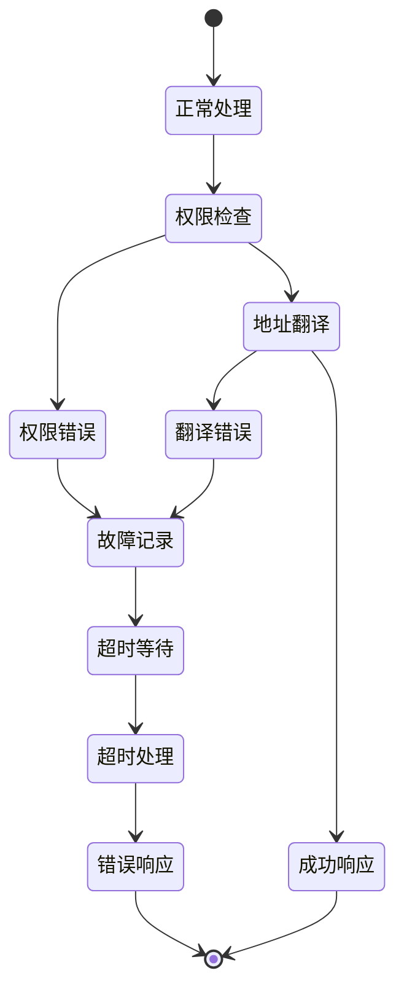

**图表来源**
- [iommu_translate.cc:654-706](file://iommu/iommu_translate.cc#L654-L706)

**章节来源**
- [iommu_translate.cc:85-706](file://iommu/iommu_translate.cc#L85-L706)

## 依赖关系分析

PCIENOC测试模块的依赖关系体现了清晰的分层架构：

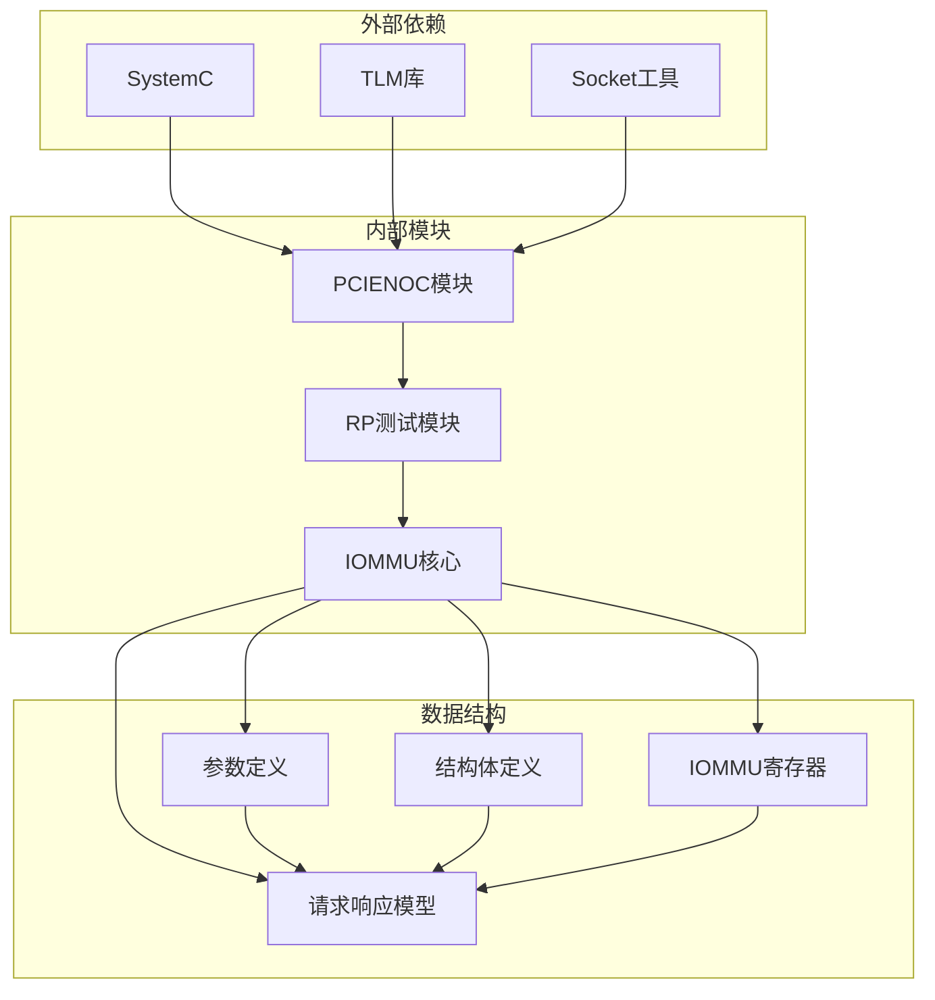

**图表来源**
- [test_pcienoc.hh:4-8](file://pcienoc/test_pcienoc.hh#L4-L8)
- [test_rp.hh:4-15](file://rp/test_rp.hh#L4-L15)
- [param_trans_def.hh:1-130](file://iommu/param_trans_def.hh#L1-L130)

### 组件耦合度分析

| 组件 | 内聚性 | 耦合度 | 说明 |
|------|--------|--------|------|
| PCIENOC_Module | 高 | 低 | 专门负责PCIe网络接口，职责单一 |
| RP_Module | 中 | 中 | 需要与IOMMU和DDR交互，但保持接口清晰 |
| IOMMU核心模块 | 高 | 低 | 功能完整且模块化设计 |
| ATS处理器 | 高 | 低 | 专注于ATS消息处理，接口明确 |

**章节来源**
- [test_pcienoc.hh:1-21](file://pcienoc/test_pcienoc.hh#L1-L21)
- [test_rp.hh:54-112](file://rp/test_rp.hh#L54-L112)
- [iommu_struct.hh:42-99](file://iommu/iommu_struct.hh#L42-L99)

## 性能考虑

PCIENOC测试模块在设计时充分考虑了性能优化：

### 并发处理机制

1. **多线程测试**：RP模块使用SystemC线程进行并发测试执行
2. **异步消息处理**：ATS消息采用异步处理模式
3. **缓存优化**：实现TLB和页表缓存机制

### 内存管理策略

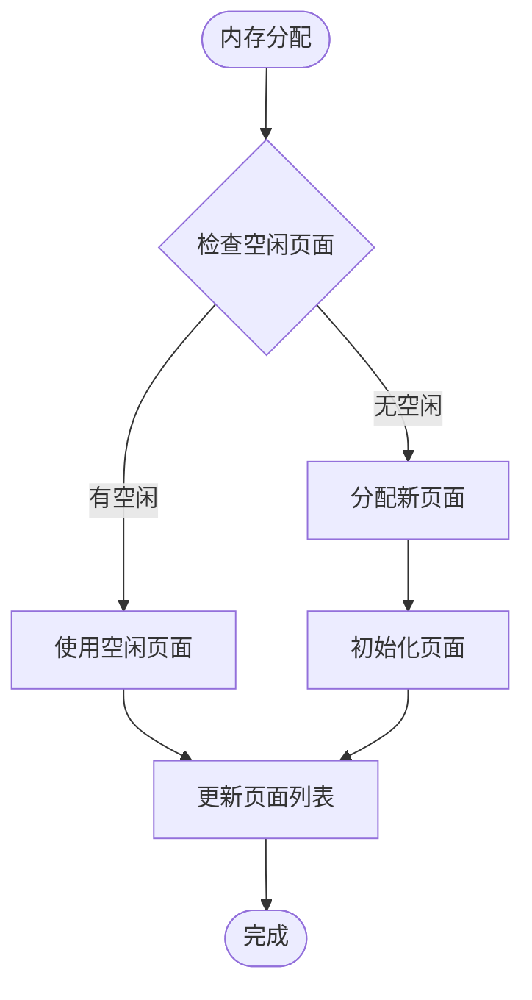

**图表来源**
- [test_rp_func.cc:290-301](file://rp/test_rp_func.cc#L290-L301)

### 性能优化建议

1. **批量测试执行**：通过RP模块的线程机制实现并发测试
2. **缓存预热**：在测试前预加载常用页表项
3. **内存池管理**：实现高效的内存分配和回收机制

## 故障排除指南

### 常见问题诊断

#### ATS消息处理故障

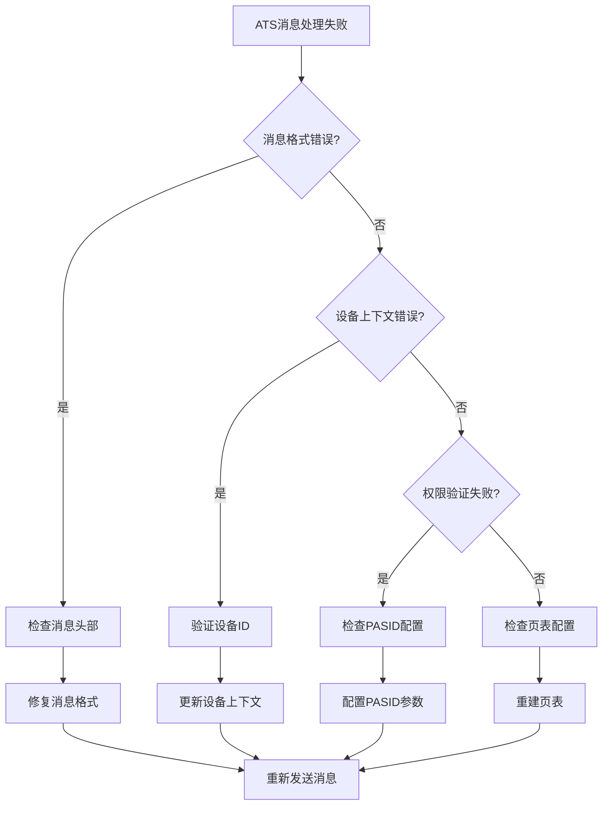

**图表来源**
- [iommu_ats.cc:169-184](file://iommu/iommu_ats.cc#L169-L184)
- [test_rp_func.cc:81-121](file://rp/test_rp_func.cc#L81-L121)

#### 地址转换故障

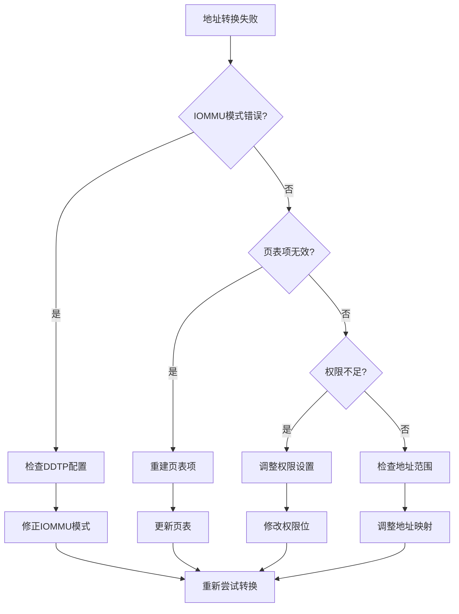

**图表来源**
- [iommu_translate.cc:94-112](file://iommu/iommu_translate.cc#L94-L112)
- [test_rp_func.cc:123-168](file://rp/test_rp_func.cc#L123-L168)

**章节来源**
- [iommu_ats.cc:96-200](file://iommu/iommu_ats.cc#L96-L200)
- [iommu_translate.cc:85-706](file://iommu/iommu_translate.cc#L85-L706)
- [test_rp_func.cc:81-168](file://rp/test_rp_func.cc#L81-L168)

## 结论

PCIENOC测试模块是一个功能完整、设计合理的PCIe网络接口测试框架。通过采用分层架构和模块化设计，该模块能够有效地验证PCIe协议的各项功能，特别是ATS消息处理、设备枚举配置和事务层消息路由机制。

### 主要优势

1. **架构清晰**：分层设计使得各组件职责明确，易于维护和扩展
2. **功能完整**：覆盖了PCIe协议的主要功能点，包括ATS、地址转换、权限控制等
3. **测试全面**：提供了从基础功能到复杂场景的全方位测试能力
4. **性能优化**：采用了多种性能优化策略，确保测试效率

### 应用价值

该测试模块不仅适用于PCIe网络接口的开发和验证，还可以作为其他基于SystemC的硬件仿真项目的参考模板。通过标准化的接口设计和完善的测试机制，为复杂的硬件系统验证提供了可靠的技术支撑。