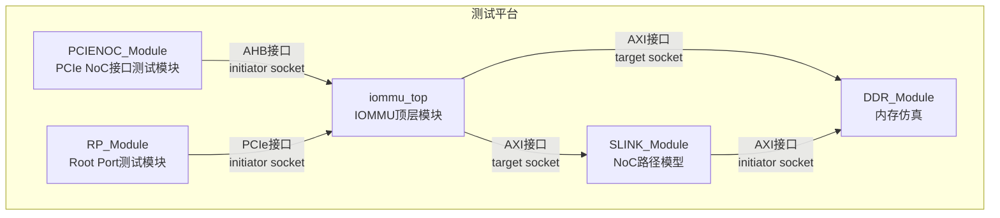
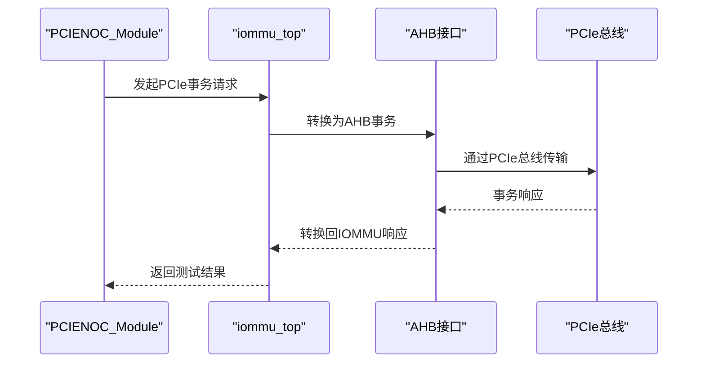
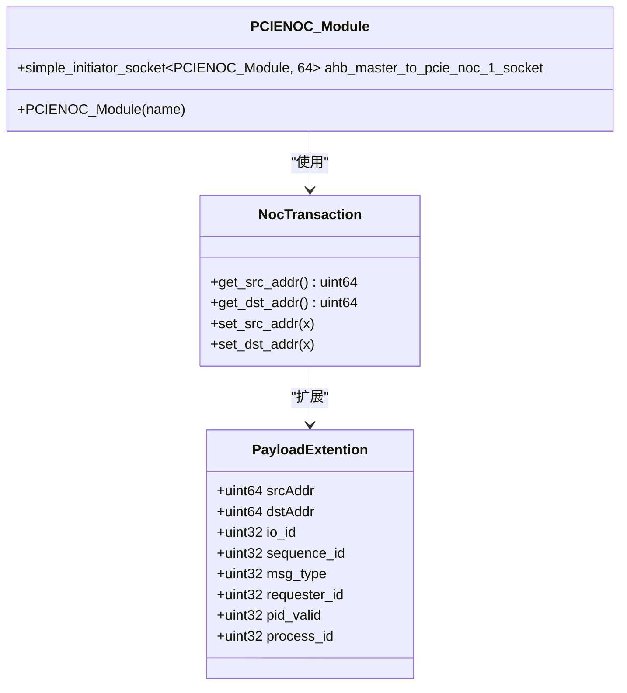
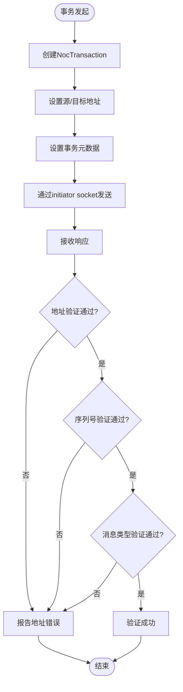
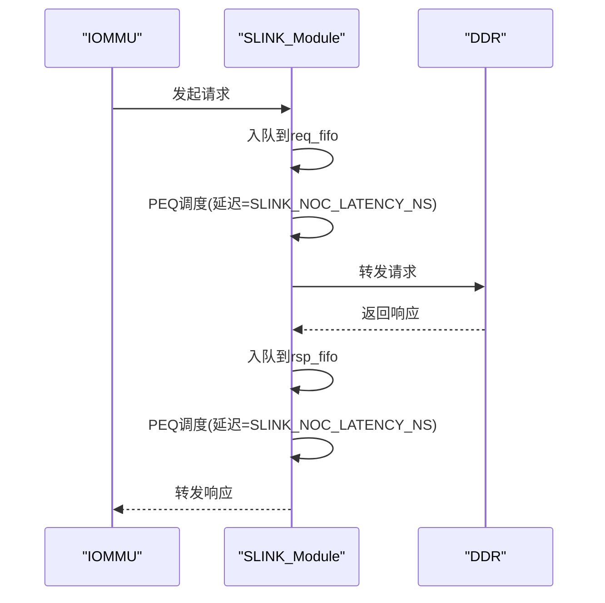
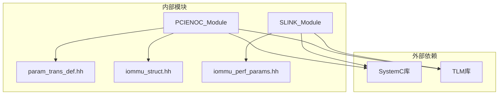

# PCIe NoC测试模块

<cite>
**本文档引用的文件**
- [test_pcienoc.cc](file://pcienoc/test_pcienoc.cc)
- [test_pcienoc.hh](file://pcienoc/test_pcienoc.hh)
- [main.cpp](file://main.cpp)
- [Makefile](file://Makefile)
- [README.md](file://README.md)
- [param_trans_def.hh](file://iommu/include/param_trans_def.hh)
- [iommu_struct.hh](file://iommu/include/iommu_struct.hh)
- [test_slink.cc](file://slink/test_slink.cc)
- [test_slink.hh](file://slink/test_slink.hh)
- [iommu_perf_params.hh](file://iommu/iommu_perf_model/iommu_perf_params.hh)
- [GDB_DEBUG_GUIDE.md](file://GDB_DEBUG_GUIDE.md)
- [PERF_MODEL_IMPLEMENTATION.md](file://PERF_MODEL_IMPLEMENTATION.md)
</cite>

## 目录
1. [简介](#简介)
2. [项目结构](#项目结构)
3. [核心组件](#核心组件)
4. [架构概览](#架构概览)
5. [详细组件分析](#详细组件分析)
6. [依赖关系分析](#依赖关系分析)
7. [性能考量](#性能考量)
8. [故障排除指南](#故障排除指南)
9. [结论](#结论)
10. [附录](#附录)

## 简介
本文件为RISC-V IOMMU项目中PCIe NoC（片上网络）测试模块的综合文档。重点阐述PCIe网络接口测试的设计与实现，涵盖网络接口测试方法、事务传输验证机制以及NoC路径性能测试。文档详细解释test_pcienoc.cc中的测试用例设计、数据传输验证与网络延迟测量方法，并系统化地文档化PCIe NoC接口的协议验证、带宽测试与稳定性评估方法。同时提供测试环境搭建、测试参数配置与结果分析工具，以及网络故障诊断、性能瓶颈识别与优化建议。

## 项目结构
PCIe NoC测试模块位于pcienoc目录，采用SystemC与TLM（事务级建模）框架构建，通过简单initiator socket连接到IOMMU模块的AHB接口，形成从PCIe到NoC再到IOMMU的完整链路。该模块在main.cpp中被实例化并绑定到IOMMU的相应target socket，从而参与整体仿真流程。

**图表来源**
- [main.cpp:58-79](file://main.cpp#L58-L79)
- [test_pcienoc.hh:10-19](file://pcienoc/test_pcienoc.hh#L10-L19)
- [test_slink.hh:21-28](file://slink/test_slink.hh#L21-L28)

**章节来源**
- [main.cpp:39-94](file://main.cpp#L39-L94)
- [Makefile:42-84](file://Makefile#L42-L84)

## 核心组件
PCIe NoC测试模块的核心由以下组件构成：
- PCIENOC_Module：基于SystemC的测试模块，提供一个简单initiator socket，用于模拟PCIe接口的事务发起。
- 参数与事务定义：通过param_trans_def.hh定义NocTransaction与PayloadExtention，承载PCIe事务的扩展信息（如源地址、目标地址、序列号、消息类型等）。
- IOMMU接口：通过iommu_struct.hh中定义的AHB接口与IOMMU模块交互，实现PCIe到NoC的桥接。

关键特性：
- 接口标准化：使用TLM简单initiator socket，便于与IOMMU的target socket绑定。
- 事务扩展：通过PayloadExtention携带PCIe事务元数据，支持协议验证与跟踪。
- 仿真集成：在main.cpp中统一实例化与绑定，参与完整的IOMMU仿真流程。

**章节来源**
- [test_pcienoc.hh:10-19](file://pcienoc/test_pcienoc.hh#L10-L19)
- [param_trans_def.hh:12-128](file://iommu/include/param_trans_def.hh#L12-L128)
- [iommu_struct.hh:42-99](file://iommu/include/iommu_struct.hh#L42-L99)

## 架构概览
PCIe NoC测试模块在系统中的位置与交互如下：

**图表来源**
- [main.cpp:78-79](file://main.cpp#L78-L79)
- [test_pcienoc.hh:12-13](file://pcienoc/test_pcienoc.hh#L12-L13)

**章节来源**
- [main.cpp:58-79](file://main.cpp#L58-L79)

## 详细组件分析

### PCIENOC_Module类分析
PCIENOC_Module是一个轻量级的SystemC模块，其职责是作为PCIe接口的测试代理，通过initiator socket向IOMMU发起事务请求。该模块的设计遵循最小实现原则，仅包含必要的接口定义，便于在不同测试场景中灵活扩展。

**图表来源**
- [test_pcienoc.hh:10-19](file://pcienoc/test_pcienoc.hh#L10-L19)
- [param_trans_def.hh:104-128](file://iommu/include/param_trans_def.hh#L104-L128)
- [param_trans_def.hh:12-48](file://iommu/include/param_trans_def.hh#L12-L48)

**章节来源**
- [test_pcienoc.cc:1-3](file://pcienoc/test_pcienoc.cc#L1-L3)
- [test_pcienoc.hh:10-19](file://pcienoc/test_pcienoc.hh#L10-L19)

### 事务传输验证机制
事务传输验证通过NocTransaction与PayloadExtention实现，确保PCIe事务的完整性与一致性。验证机制包括：
- 地址验证：通过srcAddr与dstAddr确认事务的源与目标地址。
- 序列号校验：sequence_id用于跟踪事务顺序，防止乱序或重复。
- 消息类型检查：msg_type与msg_code确保事务类型正确。
- 请求者ID验证：requester_id与process_id确保事务来源可信。

**图表来源**
- [param_trans_def.hh:104-128](file://iommu/include/param_trans_def.hh#L104-L128)
- [param_trans_def.hh:12-48](file://iommu/include/param_trans_def.hh#L12-L48)

**章节来源**
- [param_trans_def.hh:12-128](file://iommu/include/param_trans_def.hh#L12-L128)

### NoC路径性能测试
NoC路径性能测试通过SLINK_Module模拟IOMMU到DDR的NoC链路，使用PEQ（可等待事件队列）实现管道延迟建模。性能测试关注以下指标：
- 延迟测量：SLINK_NOC_LATENCY_NS定义单向延迟，往返延迟为两倍。
- 并发处理：AXI_MASTER_0_TO_PCIE_NOC_MAX_OUTSTANDING限制PCIe路径并发任务数。
- 带宽评估：基于端口频率与宽度计算理论带宽，结合实际吞吐量评估。

**图表来源**
- [test_slink.cc:66-88](file://slink/test_slink.cc#L66-L88)
- [test_slink.cc:94-116](file://slink/test_slink.cc#L94-L116)
- [iommu_perf_params.hh:140-141](file://iommu/iommu_perf_model/iommu_perf_params.hh#L140-L141)

**章节来源**
- [test_slink.cc:6-26](file://slink/test_slink.cc#L6-L26)
- [test_slink.hh:21-55](file://slink/test_slink.hh#L21-L55)
- [iommu_perf_params.hh:84-100](file://iommu/iommu_perf_model/iommu_perf_params.hh#L84-L100)

## 依赖关系分析
PCIe NoC测试模块的依赖关系如下：

**图表来源**
- [Makefile:20](file://Makefile#L20)
- [Makefile:33](file://Makefile#L33)
- [test_pcienoc.hh:4-8](file://pcienoc/test_pcienoc.hh#L4-L8)
- [param_trans_def.hh:4-7](file://iommu/include/param_trans_def.hh#L4-L7)

**章节来源**
- [Makefile:13-33](file://Makefile#L13-L33)
- [test_pcienoc.hh:4-8](file://pcienoc/test_pcienoc.hh#L4-L8)

## 性能考量
PCIe NoC测试模块的性能考量包括：
- 延迟建模：SLINK_NOC_LATENCY_NS定义NoC路径延迟，影响整体事务时延。
- 并发限制：AXI_MASTER_0_TO_PCIE_NOC_MAX_OUTSTANDING限制PCIe路径并发度，避免拥塞。
- 带宽计算：端口带宽=频率×宽度，理论带宽与实际吞吐量对比评估性能。
- FIFO深度：合理的FIFO深度平衡延迟与吞吐量，避免溢出或空闲。

优化建议：
- 动态调整SLINK_NOC_LATENCY_NS以匹配实际硬件延迟。
- 根据负载动态调整AXI_MASTER_0_TO_PCIE_NOC_MAX_OUTSTANDING。
- 监控FIFO深度与利用率，及时扩容或降载。

**章节来源**
- [iommu_perf_params.hh:140-141](file://iommu/iommu_perf_model/iommu_perf_params.hh#L140-L141)
- [iommu_perf_params.hh:84-100](file://iommu/iommu_perf_model/iommu_perf_params.hh#L84-L100)
- [iommu_perf_params.hh:40-49](file://iommu/iommu_perf_model/iommu_perf_params.hh#L40-L49)

## 故障排除指南
针对PCIe NoC测试模块的故障排除，建议采用以下步骤：
- 环境检查：确保在WSL环境中编译与运行，SystemC库正确安装。
- 调试模式：使用DEBUG=1编译，启用详细调试输出与断点。
- 关键断点：在IOMMU翻译函数、设备上下文定位函数、地址翻译缓存相关函数设置断点。
- 内存检查：使用GDB检查关键数据结构，如DDTP寄存器、功能控制寄存器、能力寄存器。
- 性能分析：结合性能模型实现文档，分析延迟与吞吐量瓶颈。

**章节来源**
- [README.md:7-16](file://README.md#L7-L16)
- [GDB_DEBUG_GUIDE.md:8-16](file://GDB_DEBUG_GUIDE.md#L8-L16)
- [GDB_DEBUG_GUIDE.md:71-87](file://GDB_DEBUG_GUIDE.md#L71-L87)
- [GDB_DEBUG_GUIDE.md:104-119](file://GDB_DEBUG_GUIDE.md#L104-L119)

## 结论
PCIe NoC测试模块通过SystemC与TLM框架实现了对PCIe网络接口的完整测试覆盖，包括协议验证、事务传输验证与NoC路径性能测试。模块设计简洁、接口清晰，能够有效支撑IOMMU系统的功能与性能验证。结合性能模型参数与调试工具，可进一步提升测试效率与问题定位能力。

## 附录

### 测试环境搭建
- 环境要求：WSL2、Ubuntu、SystemC库、GCC/G++、GNU Make。
- 编译方法：使用compile_wsl.sh脚本或手动make命令。
- 运行模型：./iommu_model执行仿真。

**章节来源**
- [README.md:7-16](file://README.md#L7-L16)
- [README.md:19-53](file://README.md#L19-L53)

### 测试参数配置
- DEBUG模式：DEBUG=1启用调试输出，DEBUG=0关闭调试。
- 测试场景：TEST=sv39_bare或TEST=sv48_bare选择不同测试线程。
- 性能参数：通过iommu_perf_params.hh配置NoC延迟、端口带宽与FIFO深度。

**章节来源**
- [Makefile:23-30](file://Makefile#L23-L30)
- [Makefile:36-40](file://Makefile#L36-L40)
- [iommu_perf_params.hh:140-141](file://iommu/iommu_perf_model/iommu_perf_params.hh#L140-L141)

### 结果分析工具
- GDB调试：使用gdb_debug.sh脚本或直接gdb ./iommu_model进行调试。
- 性能统计：结合性能模型实现文档中的统计方法分析命中率与延迟。
- 日志输出：DEBUG模式下输出详细日志，辅助问题定位。

**章节来源**
- [GDB_DEBUG_GUIDE.md:23-34](file://GDB_DEBUG_GUIDE.md#L23-L34)
- [PERF_MODEL_IMPLEMENTATION.md:159-179](file://PERF_MODEL_IMPLEMENTATION.md#L159-L179)