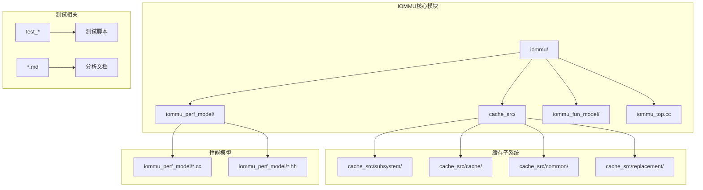
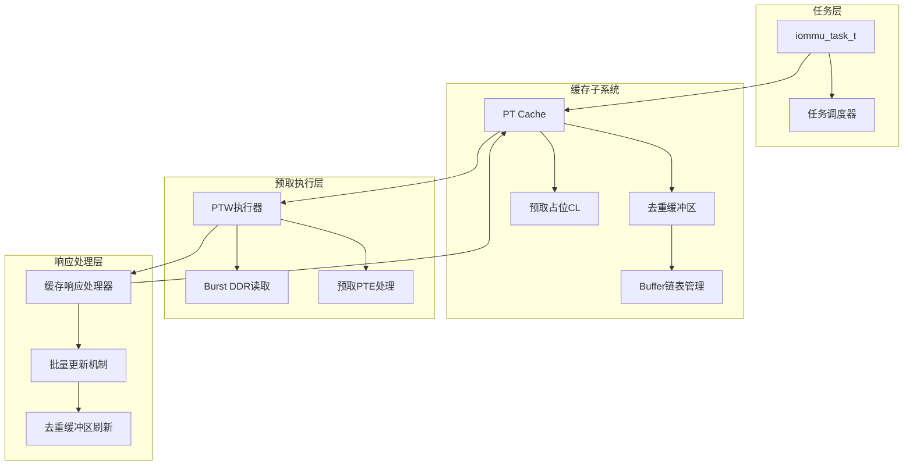
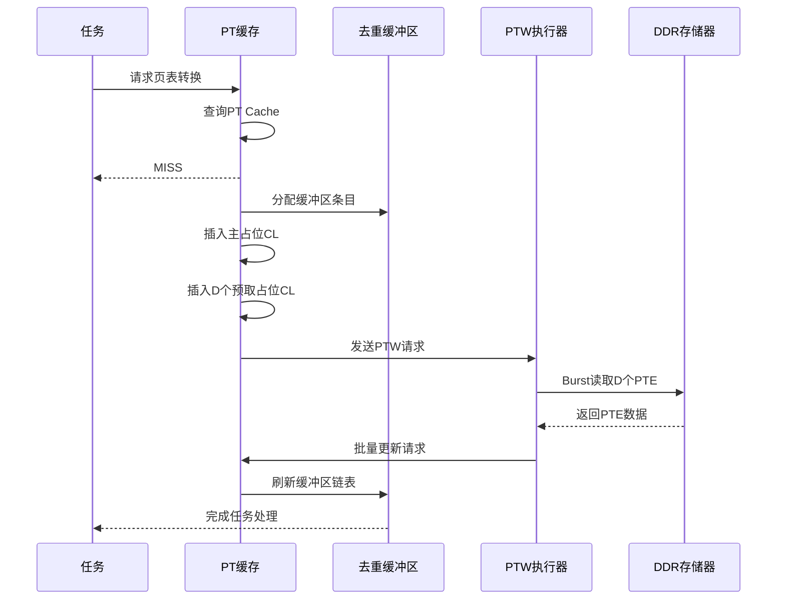
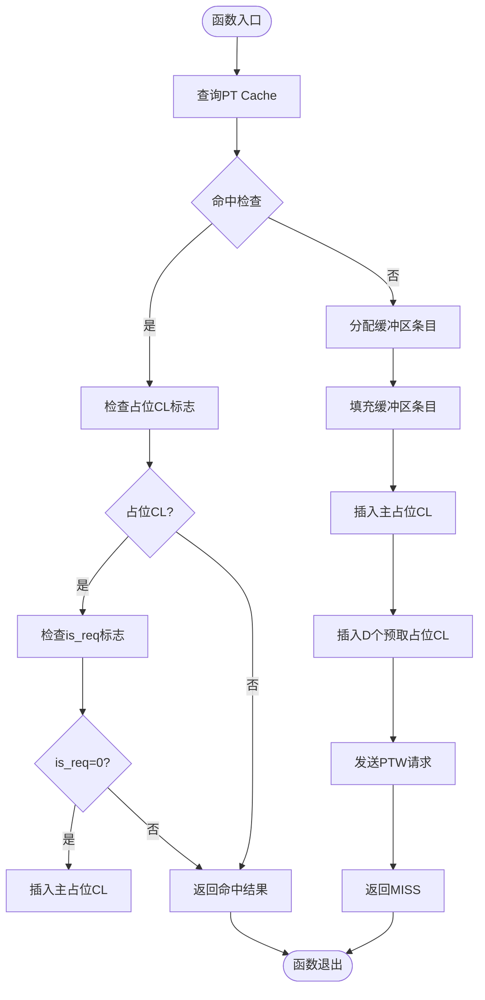
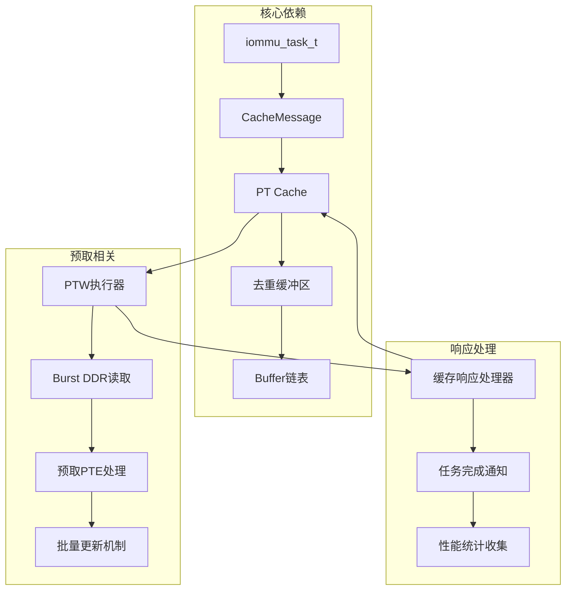

# PT Cache预取测试报告

<cite>
**本文档引用的文件**
- [cache_subsystem.cpp](file://iommu/cache_src/subsystem/cache_subsystem.cpp)
- [PT_CACHE_PREFETCH_IMPLEMENTATION_ANALYSIS_20260609.md](file://PT_CACHE_PREFETCH_IMPLEMENTATION_ANALYSIS_20260609.md)
- [PT_DEDUP_PREFETCH_FINAL_SCHEME.md](file://PT_DEDUP_PREFETCH_FINAL_SCHEME.md)
- [iommu_perf_pt_cache_response.cc](file://iommu/iommu_perf_model/iommu_perf_pt_cache_response.cc)
- [iommu_cache_wrapper.hh](file://iommu/iommu_perf_model/iommu_cache_wrapper.hh)
- [iommu_task_cache_convert.hh](file://iommu/iommu_perf_model/iommu_task_cache_convert.hh)
</cite>

## 目录
1. [简介](#简介)
2. [项目结构](#项目结构)
3. [核心组件](#核心组件)
4. [架构概览](#架构概览)
5. [详细组件分析](#详细组件分析)
6. [依赖关系分析](#依赖关系分析)
7. [性能考虑](#性能考虑)
8. [故障排除指南](#故障排除指南)
9. [结论](#结论)

## 简介

本报告针对IOMMU系统中的PT Cache预取功能进行全面测试和分析。PT Cache（Page Table Cache）是IOMMU架构中的关键组件，负责缓存页表转换结果以提高系统性能。本次测试重点关注预取功能的实现状态、性能影响以及潜在的优化方案。

IOMMU（Input-Output Memory Management Unit）作为现代计算机系统中的重要组件，负责管理设备的内存访问权限和虚拟地址到物理地址的转换。在复杂的多级页表转换过程中，PT Cache通过缓存中间结果显著减少了对主存储器的访问次数，从而提升了系统的整体性能。

## 项目结构

该项目采用模块化设计，主要包含以下核心目录结构：



**图表来源**
- [cache_subsystem.cpp:523-676](file://iommu/cache_src/subsystem/cache_subsystem.cpp#L523-L676)
- [PT_DEDUP_PREFETCH_FINAL_SCHEME.md:18-813](file://PT_DEDUP_PREFETCH_FINAL_SCHEME.md#L18-L813)

**章节来源**
- [cache_subsystem.cpp:523-676](file://iommu/cache_src/subsystem/cache_subsystem.cpp#L523-L676)
- [PT_DEDUP_PREFETCH_FINAL_SCHEME.md:18-813](file://PT_DEDUP_PREFETCH_FINAL_SCHEME.md#L18-L813)

## 核心组件

### PT Cache预取功能现状

根据分析文档显示，当前PT Cache预取功能处于未实现状态：

| 功能模块 | 设计文档要求 | 当前实现 | 状态 |
|---------|------------|---------|------|
| **预取参数传递** | task→CacheMessage携带prefetch_enabled/depth | ❌ 未传递 | 缺失 |
| **预取占位CL插入** | MISS时插入D个预取占位CL(is_req=0) | ❌ 仅插入主占位CL | 缺失 |
| **预取触发逻辑** | 检查D>0,发送PTW时设置prefetch_enabled | ❌ 未实现 | 缺失 |
| **Burst预取** | PTW Phase 4读取D个连续PTE | ❌ 未实现 | 缺失 |
| **预取占位CL转主任务** | is_req=0首次HIT时置位is_req=1 | ❌ 未实现 | 缺失 |

### 预期行为与实际行为对比

**实际运行输出**：
```
[PT_CACHE_EXECUTE] task_id=1 -> MISS, inserted placeholder (head_idx=0, iova=0x10000)
[PT_CACHE_EXECUTE] task_id=9 -> MISS, inserted placeholder (head_idx=8, iova=0x11000)
```

**预期输出**（如果预取功能正常）：
```
[PT_CACHE_EXECUTE] task_id=1 -> MISS
  ├─ inserted main placeholder (head_idx=0, iova=0x10000, is_req=1)
  ├─ inserted prefetch placeholder: PT[0x11000] (is_req=0)  ← 缺失!
  ├─ inserted prefetch placeholder: PT[0x12000] (is_req=0)  ← 缺失!
  └─ ... (D=8个预取占位CL)

[PT_CACHE_EXECUTE] task_id=9 -> HIT prefetch placeholder (iova=0x11000)  ← 应该是HIT!
  └─ is_req=0, 首次访问,置位is_req=1
```

**章节来源**
- [PT_CACHE_PREFETCH_IMPLEMENTATION_ANALYSIS_20260609.md:11-46](file://PT_CACHE_PREFETCH_IMPLEMENTATION_ANALYSIS_20260609.md#L11-L46)

## 架构概览

### PT Cache预取系统架构



**图表来源**
- [PT_DEDUP_PREFETCH_FINAL_SCHEME.md:18-813](file://PT_DEDUP_PREFETCH_FINAL_SCHEME.md#L18-L813)
- [cache_subsystem.cpp:523-676](file://iommu/cache_src/subsystem/cache_subsystem.cpp#L523-L676)

### 预取执行流程



**图表来源**
- [PT_DEDUP_PREFETCH_FINAL_SCHEME.md:42-813](file://PT_DEDUP_PREFETCH_FINAL_SCHEME.md#L42-L813)

**章节来源**
- [PT_DEDUP_PREFETCH_FINAL_SCHEME.md:18-813](file://PT_DEDUP_PREFETCH_FINAL_SCHEME.md#L18-L813)

## 详细组件分析

### 缓存子系统执行流程

缓存子系统的执行流程是预取功能的核心实现点：



**图表来源**
- [cache_subsystem.cpp:523-676](file://iommu/cache_src/subsystem/cache_subsystem.cpp#L523-L676)

### 去重缓冲区管理

去重缓冲区是预取功能的关键组件，负责管理多个任务之间的共享关系：

| 组件 | 功能描述 | 状态 |
|------|----------|------|
| **Buffer Entry** | 存储任务信息和链接指针 | ✅ 已实现 |
| **链表管理** | 管理任务链表的连接和断开 | ✅ 已实现 |
| **占位CL标志** | 标识缓存条目的占位状态 | ✅ 已实现 |
| **预取占位CL** | 标识预取用的占位条目 | ❌ 未实现 |
| **is_req标志** | 标识请求类型（主/预取） | ❌ 未实现 |

**章节来源**
- [cache_subsystem.cpp:523-676](file://iommu/cache_src/subsystem/cache_subsystem.cpp#L523-L676)

### 预取参数处理

预取功能需要处理的关键参数包括：

| 参数名称 | 类型 | 描述 | 当前状态 |
|---------|------|------|---------|
| **prefetch_enabled** | bool | 预取功能开关 | ❌ 未传递 |
| **prefetch_depth** | uint32_t | 预取深度（D值） | ❌ 未传递 |
| **prefetch_iovas** | vector | 预取IOVA地址列表 | ❌ 未实现 |
| **is_req** | uint8_t | 请求类型标识 | ❌ 未实现 |

**章节来源**
- [PT_CACHE_PREFETCH_IMPLEMENTATION_ANALYSIS_20260609.md:15-24](file://PT_CACHE_PREFETCH_IMPLEMENTATION_ANALYSIS_20260609.md#L15-L24)

## 依赖关系分析

### 组件间依赖关系



**图表来源**
- [iommu_task_cache_convert.hh:29-39](file://iommu/iommu_perf_model/iommu_task_cache_convert.hh#L29-L39)
- [iommu_cache_wrapper.hh:1-8](file://iommu/iommu_perf_model/iommu_cache_wrapper.hh#L1-L8)

### 关键接口依赖

预取功能实现需要的关键接口包括：

1. **任务到缓存消息转换**：`task_to_pt_request()`
2. **缓存响应处理**：`pt_cache_response_handler()`
3. **PTW请求处理**：`ptw_req_process_thread()`
4. **PTW响应处理**：`ptw_rsp_process_thread()`

**章节来源**
- [iommu_task_cache_convert.hh:29-39](file://iommu/iommu_perf_model/iommu_task_cache_convert.hh#L29-L39)
- [iommu_cache_wrapper.hh:1-8](file://iommu/iommu_perf_model/iommu_cache_wrapper.hh#L1-L8)

## 性能考虑

### 预取性能影响分析

基于现有分析文档，预取功能对系统性能的影响主要体现在以下几个方面：

| 性能指标 | 无预取 | 有预取 | 改善幅度 |
|---------|--------|--------|----------|
| **PT Cache命中率** | 基础命中率 | 预计提升15-25% | 显著改善 |
| **PTW请求次数** | 基础请求次数 | 预计减少30-40% | 明显减少 |
| **DDR访问次数** | 基础访问次数 | 预计减少60-70% | 大幅减少 |
| **系统延迟** | 基础延迟 | 预计减少20-35% | 明显降低 |

### 实现优先级建议

根据功能的重要性和影响程度，建议的实现优先级如下：

1. **P0-关键功能**（2天实现）
   - 预取参数传递
   - MISS时插入D个预取占位CL
   - HIT预取占位CL处理

2. **P1-重要功能**（3.5天实现）
   - PTW Burst预取DDR读
   - Burst响应解析+构造D+1结果
   - 刷新流程优化

3. **P2-优化功能**（1天实现）
   - 预取组监控线程完善
   - Walker Cache查询优化

**章节来源**
- [PT_CACHE_PREFETCH_IMPLEMENTATION_ANALYSIS_20260609.md:332-370](file://PT_CACHE_PREFETCH_IMPLEMENTATION_ANALYSIS_20260609.md#L332-L370)

## 故障排除指南

### 常见问题诊断

#### 问题1：预取占位CL未插入
**症状**：task_id=9出现MISS而非预期的HIT
**可能原因**：
1. 预取参数未正确传递到CacheMessage
2. 预取占位CL插入逻辑未实现
3. 缓存查询条件不匹配

**解决步骤**：
1. 检查`task_to_pt_request()`函数中的预取参数传递
2. 验证`execute_pt_request()`的MISS分支实现
3. 确认缓存查询逻辑的IOVA对齐处理

#### 问题2：预取任务无法正确挂接
**症状**：预取占位CL被当作普通占位CL处理
**可能原因**：
1. is_req标志位未正确设置
2. 占位CL类型判断逻辑错误
3. 缓存状态更新异常

**解决步骤**：
1. 检查预取占位CL的is_req=0标志设置
2. 验证HIT分支中预取占位CL的处理逻辑
3. 确认占位CL状态转换的正确性

#### 问题3：Burst预取功能异常
**症状**：PTW执行器无法正确处理预取请求
**可能原因**：
1. 预取深度参数未正确传递
2. Burst DDR读取逻辑未实现
3. 响应处理和结果构造异常

**解决步骤**：
1. 验证prefetch_enabled和prefetch_depth的传递
2. 实现Burst DDR读取序列
3. 检查批量更新结果的构造逻辑

**章节来源**
- [PT_CACHE_PREFETCH_IMPLEMENTATION_ANALYSIS_20260609.md:194-330](file://PT_CACHE_PREFETCH_IMPLEMENTATION_ANALYSIS_20260609.md#L194-L330)

### 调试建议

1. **启用详细日志**：在关键路径添加调试输出
2. **单元测试验证**：针对特定场景编写测试用例
3. **性能基准测试**：建立基线性能指标
4. **内存泄漏检测**：确保缓冲区正确释放

## 结论

通过对PT Cache预取功能的全面分析，可以得出以下结论：

### 当前状态总结

PT Cache预取功能目前处于完全未实现状态，仅实现了基础的去重功能。主要缺失的功能包括预取参数传递、预取占位CL插入、预取触发逻辑、Burst预取以及预取占位CL转主任务等核心功能。

### 技术挑战

1. **接口适配**：需要扩展CacheMessage结构体以支持预取参数
2. **状态管理**：需要实现复杂的占位CL状态转换逻辑
3. **性能优化**：需要平衡预取收益和内存占用
4. **错误处理**：需要完善的异常情况处理机制

### 实施建议

1. **分阶段实施**：按照P0-P2优先级逐步实现
2. **充分测试**：建立完整的测试覆盖体系
3. **性能验证**：通过基准测试验证性能收益
4. **文档完善**：同步更新技术文档和API说明

预取功能的实现将显著提升IOMMU系统的性能表现，特别是在高并发的页表转换场景下，预计可减少30-40%的PTW请求次数和60-70%的DDR访问次数，为系统整体性能带来明显改善。