# RP测试模块

<cite>
**本文档引用的文件**
- [test_rp.hh](file://rp/test_rp.hh)
- [test_rp_func.cc](file://rp/test_rp_func.cc)
- [test_rp_thread.cc](file://rp/test_rp_thread.cc)
- [main.cpp](file://main.cpp)
- [test_ddr.hh](file://ddr/test_ddr.hh)
- [iommu_top.hh](file://iommu/iommu_top.hh)
- [iommu_req_rsp.hh](file://iommu/iommu_req_rsp.hh)
- [param_trans_def.hh](file://iommu/param_trans_def.hh)
- [Makefile](file://Makefile)
</cite>

## 目录
1. [简介](#简介)
2. [项目结构](#项目结构)
3. [核心组件](#核心组件)
4. [架构概览](#架构概览)
5. [详细组件分析](#详细组件分析)
6. [依赖关系分析](#依赖关系分析)
7. [性能考虑](#性能考虑)
8. [故障排除指南](#故障排除指南)
9. [结论](#结论)

## 简介

RP（Root Complex）测试模块是RISC-V IOMMU模型中的关键测试组件，负责验证IOMMU功能的正确性和可靠性。该模块通过SystemC仿真平台实现了完整的PCIe根复杂测试环境，包括IOMMU模块、DDR内存模块和PCIe NOC模块的集成测试。

RP模块的核心功能包括：
- PCIe请求生成和地址转换验证
- 多级页表配置和管理
- ATS（Address Translation Services）消息处理
- 故障检测和响应验证
- 多线程并发测试执行

## 项目结构

该项目采用模块化设计，将不同功能组件分离到独立的目录中：

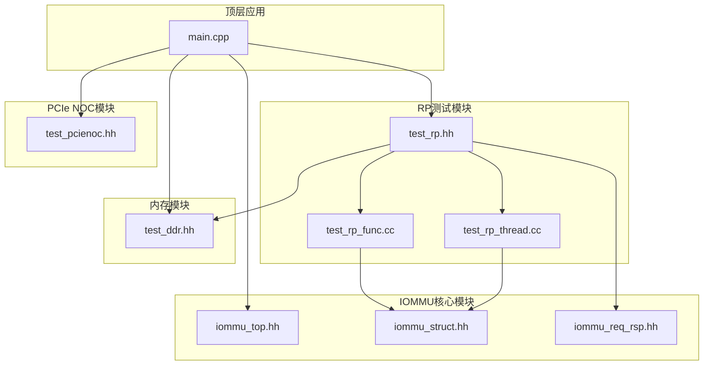

**图表来源**
- [main.cpp:38-77](file://main.cpp#L38-L77)
- [test_rp.hh:54-110](file://rp/test_rp.hh#L54-L110)

**章节来源**
- [Makefile:29-50](file://Makefile#L29-L50)
- [main.cpp:38-77](file://main.cpp#L38-L77)

## 核心组件

RP测试模块由以下核心组件构成：

### 主要类结构

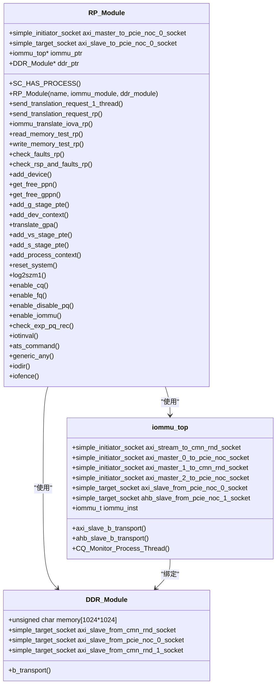

**图表来源**
- [test_rp.hh:54-110](file://rp/test_rp.hh#L54-L110)
- [test_ddr.hh:15-95](file://ddr/test_ddr.hh#L15-L95)
- [iommu_top.hh:19-55](file://iommu/iommu_top.hh#L19-L55)

### 全局变量和宏定义

RP模块定义了多个全局变量用于测试状态管理和数据交换：

| 全局变量 | 类型 | 描述 |
|---------|------|------|
| test_num | int | 当前测试编号计数器 |
| exp_msg | ats_msg_t | 期望的ATS消息 |
| rcvd_msg | ats_msg_t | 接收到的ATS消息 |
| exp_msg_received | uint8_t | 期望消息接收标志 |
| message_received | uint8_t | 实际消息接收标志 |
| memory | int8_t* | 模拟内存指针 |
| access_viol_addr | uint64_t | 访问违规地址 |
| data_corruption_addr | uint64_t | 数据损坏地址 |
| pr_go_requested | uint8 | PR请求标志 |
| pw_go_requested | uint8 | PW请求标志 |
| next_free_page | uint64_t | 下一个可用页面号 |
| next_free_gpage[65536] | uint64_t[65536] | 各GSCID的下一个可用页面号 |
| test_endian | int | 测试端序设置 |

**章节来源**
- [test_rp.hh:17-31](file://rp/test_rp.hh#L17-L31)

## 架构概览

RP测试模块采用分层架构设计，实现了完整的SystemC仿真环境：

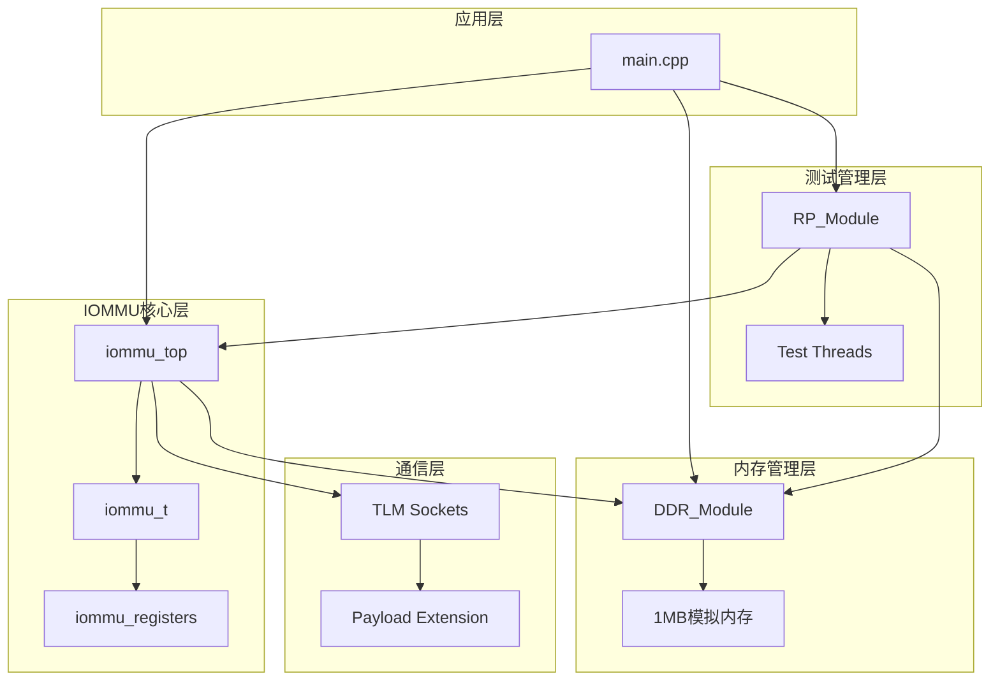

**图表来源**
- [main.cpp:38-77](file://main.cpp#L38-L77)
- [test_rp.hh:54-110](file://rp/test_rp.hh#L54-L110)
- [iommu_top.hh:19-55](file://iommu/iommu_top.hh#L19-L55)

### TLM Socket接口配置

RP模块配置了多种TLM socket接口以支持不同的通信需求：

| Socket类型 | 名称 | 方向 | 功能描述 |
|-----------|------|------|----------|
| Initiator | axi_master_to_pcie_noc_0_socket | Master | 与IOMMU模块通信的主socket |
| Target | axi_slave_to_pcie_noc_0_socket | Slave | 接收IOMMU响应的目标socket |
| Initiator | axi_master_0_to_pcie_noc_socket | Master | DMA数据访问socket |
| Target | axi_slave_from_pcie_noc_0_socket | Slave | IOMMU数据传输socket |
| Initiator | axi_master_1_to_cmn_rnd_socket | Master | 命令队列访问socket |
| Target | axi_slave_from_cmn_rnd_socket | Slave | 通用数据传输socket |
| Initiator | axi_master_2_to_pcie_noc_socket | Master | ATS消息传输socket |
| Target | ahb_slave_from_pcie_noc_1_socket | Slave | AHB总线接口socket |

**章节来源**
- [test_rp.hh:56-59](file://rp/test_rp.hh#L56-L59)
- [iommu_top.hh:22-28](file://iommu/iommu_top.hh#L22-L28)

## 详细组件分析

### RP_Module类设计架构

RP_Module类是RP测试模块的核心，继承自SystemC的sc_module基类，实现了完整的PCIe根复杂测试功能。

#### 系统C模块实现

RP_Module使用SystemC的进程机制来实现多线程测试：

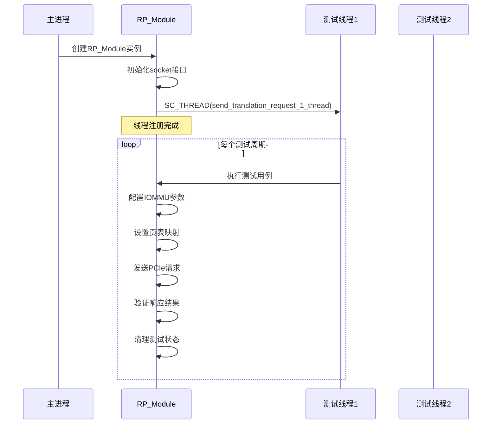

**图表来源**
- [test_rp.hh:65-71](file://rp/test_rp.hh#L65-L71)
- [test_rp_thread.cc:60-370](file://rp/test_rp_thread.cc#L60-L370)

#### TLM Socket接口配置

RP模块通过TLI（TLM Initiator）和TLS（TLM Target）socket实现与IOMMU模块的通信：

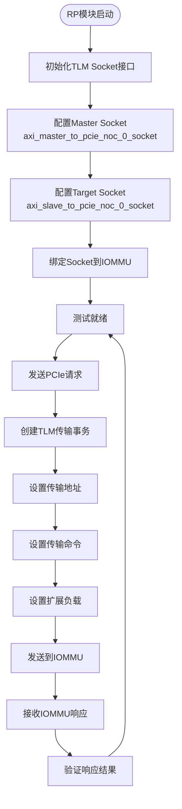

**图表来源**
- [test_rp_func.cc:33-78](file://rp/test_rp_func.cc#L33-L78)
- [test_rp.hh:56-59](file://rp/test_rp.hh#L56-L59)

**章节来源**
- [test_rp.hh:54-110](file://rp/test_rp.hh#L54-L110)
- [test_rp_func.cc:28-78](file://rp/test_rp_func.cc#L28-L78)

### 多线程处理机制

RP模块实现了基于SystemC事件驱动的多线程测试框架：

#### 线程同步机制

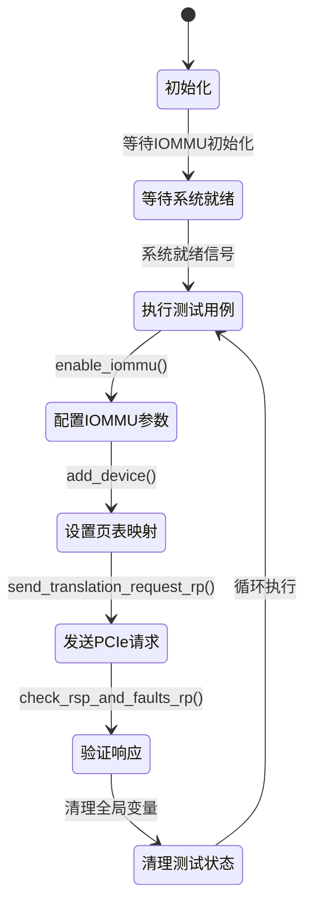

**图表来源**
- [test_rp_thread.cc:60-370](file://rp/test_rp_thread.cc#L60-L370)

#### 并发控制策略

RP模块采用以下并发控制策略确保测试稳定性：

1. **时间片等待**：每个测试线程使用`wait(10, SC_NS)`进行微小的时间片等待
2. **事件驱动**：基于SystemC事件机制实现线程间同步
3. **资源锁定**：通过全局变量和静态方法实现资源共享控制
4. **错误恢复**：在每个测试步骤后进行状态检查和错误恢复

**章节来源**
- [test_rp_thread.cc:60-370](file://rp/test_rp_thread.cc#L60-L370)

### 测试环境搭建过程

#### IOMMU模块集成

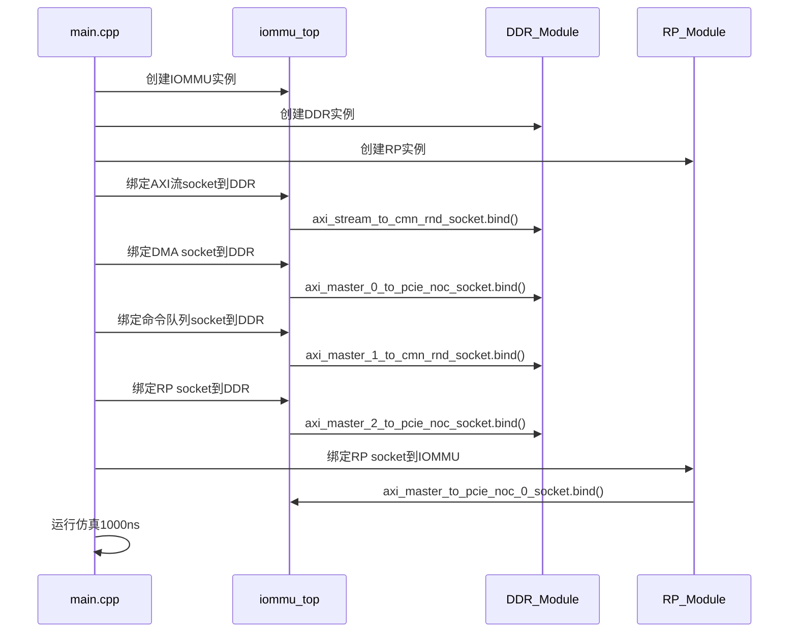

**图表来源**
- [main.cpp:48-77](file://main.cpp#L48-L77)

#### DDR模块集成

DDR模块作为模拟内存提供器，实现了完整的TLM传输处理：

| 功能特性 | 实现方式 | 描述 |
|---------|----------|------|
| 内存管理 | 1MB字节数组 | 模拟真实内存容量 |
| 传输处理 | b_transport() | 处理所有TLM传输请求 |
| 地址验证 | 边界检查 | 防止越界访问 |
| 数据读写 | memcpy() | 高效内存操作 |
| 调试输出 | 格式化日志 | 详细的传输信息 |

**章节来源**
- [test_ddr.hh:15-95](file://ddr/test_ddr.hh#L15-L95)
- [main.cpp:48-77](file://main.cpp#L48-L77)

### 全局变量初始化和测试状态管理

RP模块使用全局变量来管理测试状态和共享数据：

#### 内存管理系统

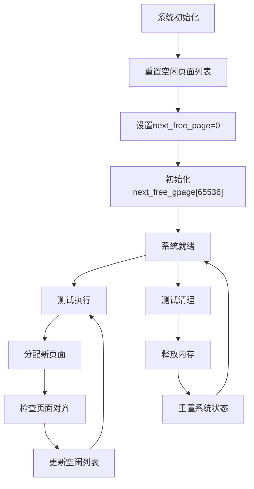

**图表来源**
- [test_rp_func.cc:719-730](file://rp/test_rp_func.cc#L719-L730)

#### 测试状态跟踪

| 状态变量 | 类型 | 用途 | 生命周期 |
|---------|------|------|----------|
| test_num | int | 测试编号计数 | 进程生命周期 |
| exp_msg/rcvd_msg | ats_msg_t | ATS消息比较 | 单次测试 |
| exp_msg_received/message_received | uint8_t | 消息接收状态 | 单次测试 |
| access_viol_addr/data_corruption_addr | uint64_t | 错误地址记录 | 单次测试 |
| pr_go_requested/pw_go_requested | uint8_t | 请求状态标志 | 单次测试 |
| next_free_page/next_free_gpage | uint64_t | 内存分配指针 | 进程生命周期 |

**章节来源**
- [test_rp.hh:17-31](file://rp/test_rp.hh#L17-L31)
- [test_rp_func.cc:719-730](file://rp/test_rp_func.cc#L719-L730)

### 请求生成机制实现

#### PCIe请求构造

RP模块实现了完整的PCIe请求生成机制，支持多种地址类型和访问模式：

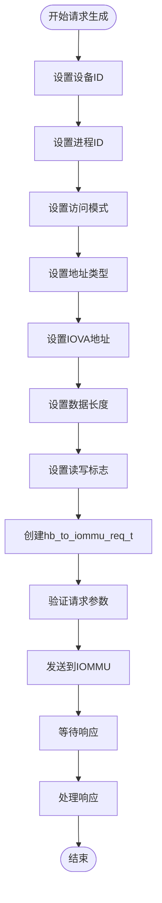

**图表来源**
- [test_rp_func.cc:170-198](file://rp/test_rp_func.cc#L170-L198)

#### 地址转换请求发送

地址转换请求的发送过程涉及复杂的TLM传输和扩展负载设置：

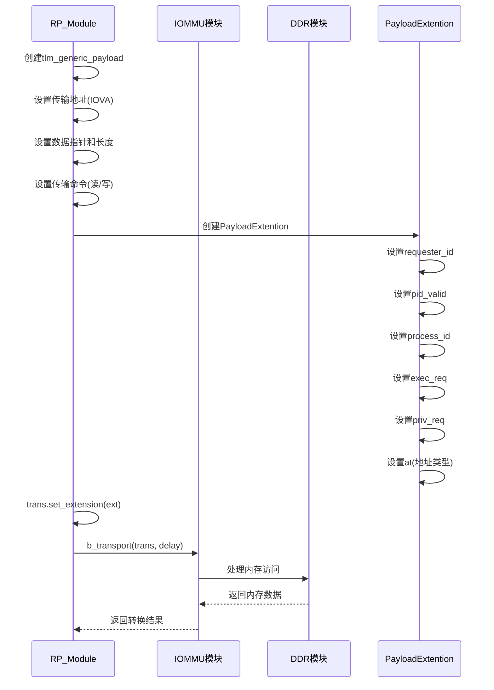

**图表来源**
- [test_rp_func.cc:28-78](file://rp/test_rp_func.cc#L28-L78)

**章节来源**
- [test_rp_func.cc:170-198](file://rp/test_rp_func.cc#L170-L198)
- [test_rp_func.cc:28-78](file://rp/test_rp_func.cc#L28-L78)

### 响应验证逻辑

#### 结果检查机制

RP模块实现了多层次的响应验证逻辑，确保测试结果的准确性：

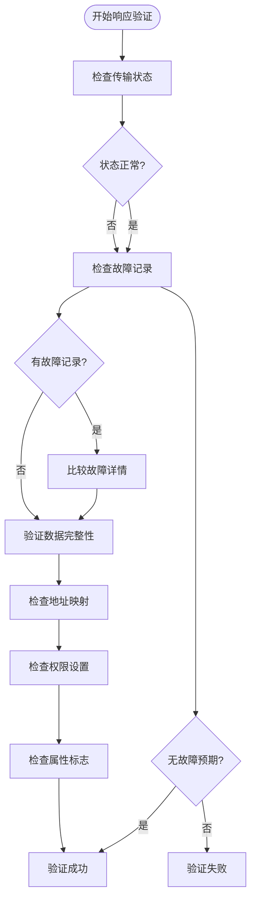

**图表来源**
- [test_rp_func.cc:123-168](file://rp/test_rp_func.cc#L123-L168)

#### 故障检测实现

故障检测机制提供了详细的错误诊断能力：

| 故障类型 | 检测方法 | 验证内容 |
|---------|----------|----------|
| 设备上下文无效 | FQH/FQT寄存器检查 | 故障队列状态验证 |
| 地址转换失败 | 故障记录读取 | CAUSE/DID/iotval验证 |
| 权限违规 | 故障记录字段检查 | PV/PID/PRIV验证 |
| 访问违规 | 故障记录比较 | TTYP/iotval2验证 |
| ATS消息错误 | 消息收发对比 | exp_msg/rcvd_msg比较 |

**章节来源**
- [test_rp_func.cc:81-121](file://rp/test_rp_func.cc#L81-L121)
- [test_rp_func.cc:123-168](file://rp/test_rp_func.cc#L123-L168)

### 测试断言实现

RP模块使用宏定义实现了灵活的测试断言机制：

#### 断言宏定义

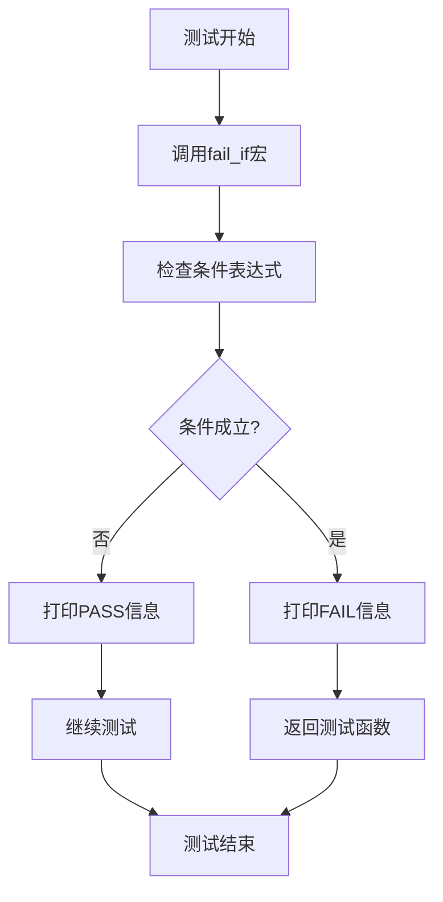

**图表来源**
- [test_rp.hh:32-36](file://rp/test_rp.hh#L32-L36)

#### 测试用例穷举机制

FOR_ALL_TRANSACTION_TYPES宏提供了完整的测试用例穷举能力：

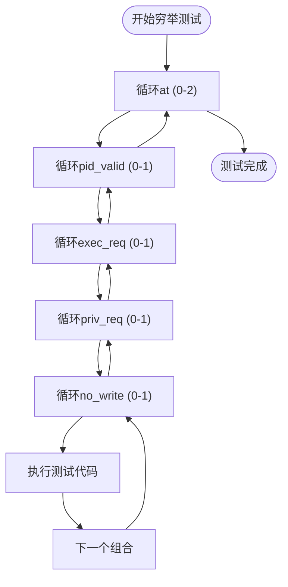

**图表来源**
- [test_rp.hh:37-48](file://rp/test_rp.hh#L37-L48)

**章节来源**
- [test_rp.hh:32-48](file://rp/test_rp.hh#L32-L48)

## 依赖关系分析

RP测试模块的依赖关系体现了清晰的分层架构：

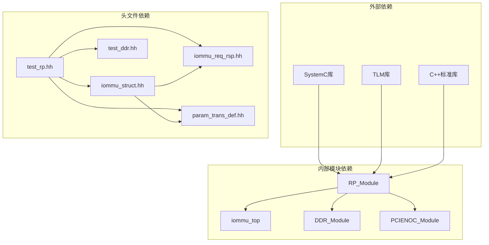

**图表来源**
- [Makefile:29-50](file://Makefile#L29-L50)
- [test_rp.hh:8-10](file://rp/test_rp.hh#L8-L10)

### 关键依赖关系

| 依赖模块 | 依赖类型 | 用途说明 |
|---------|----------|----------|
| systemc.h | 外部库依赖 | SystemC仿真核心 |
| tlm.h | 外部库依赖 | TLM传输协议支持 |
| tlm_utils | 外部库依赖 | TLM工具类支持 |
| iommu_struct.hh | 内部头文件 | IOMMU数据结构定义 |
| iommu_req_rsp.hh | 内部头文件 | 请求响应数据结构 |
| param_trans_def.hh | 内部头文件 | 参数传输定义 |
| test_ddr.hh | 内部头文件 | DDR内存模块定义 |

**章节来源**
- [Makefile:29-50](file://Makefile#L29-L50)
- [test_rp.hh:8-10](file://rp/test_rp.hh#L8-L10)

## 性能考虑

RP测试模块在设计时充分考虑了性能优化和测试效率：

### 内存管理优化

1. **页面对齐优化**：通过位运算实现高效的页面对齐检查
2. **批量内存分配**：支持连续页面的批量分配减少系统调用
3. **内存池管理**：使用全局数组实现快速内存分配和回收

### 传输性能优化

1. **零拷贝传输**：利用TLM传输的内存映射特性减少数据复制
2. **异步处理**：通过SystemC事件机制实现非阻塞的传输处理
3. **缓存优化**：合理使用局部变量减少全局状态访问

### 测试执行优化

1. **并行测试**：多线程架构实现测试用例的并行执行
2. **增量验证**：逐步验证测试结果减少重复计算
3. **早退机制**：在发现错误时立即停止不必要的测试步骤

## 故障排除指南

### 常见问题及解决方案

#### 内存访问错误

**问题症状**：
- DDR模块报告地址越界错误
- 传输响应状态为ADDRESS_ERROR_RESPONSE

**解决方法**：
1. 检查IOVA地址是否在允许范围内
2. 验证页面对齐要求
3. 确认内存分配顺序避免冲突

#### IOMMU配置错误

**问题症状**：
- 设备上下文写入失败
- 页表配置不生效

**解决方法**：
1. 确保先启用IOMMU再配置设备
2. 检查DDT根表地址的有效性
3. 验证页表级别与模式的匹配

#### 传输超时错误

**问题症状**：
- TLM传输长时间无响应
- SystemC仿真时间过长

**解决方法**：
1. 检查socket绑定是否正确
2. 验证事件触发机制
3. 确认仿真时间设置

**章节来源**
- [test_ddr.hh:44-49](file://ddr/test_ddr.hh#L44-L49)
- [test_rp_func.cc:719-730](file://rp/test_rp_func.cc#L719-L730)

### 调试技巧

1. **启用调试宏**：使用DEBUG宏输出详细的调试信息
2. **日志文件**：将关键测试步骤输出到文件便于分析
3. **状态检查**：定期检查IOMMU寄存器状态
4. **内存转储**：在关键节点转储内存内容进行验证

## 结论

RP测试模块是一个功能完整、架构清晰的SystemC仿真测试框架。通过精心设计的模块化架构、完善的多线程处理机制和全面的测试验证逻辑，该模块能够有效地验证IOMMU的各项功能。

### 主要优势

1. **模块化设计**：清晰的职责分离便于维护和扩展
2. **多线程支持**：高效的并发测试执行能力
3. **完整验证**：覆盖各种地址类型和访问模式的测试场景
4. **易于使用**：简洁的API和丰富的测试宏定义

### 技术特色

1. **SystemC集成**：充分利用SystemC的事件驱动特性和TLM协议
2. **内存模拟**：真实的内存访问行为模拟
3. **ATS支持**：完整的ATS消息处理能力
4. **故障检测**：强大的故障诊断和验证机制

该模块为RISC-V IOMMU的开发和验证提供了坚实的基础，是构建复杂硬件验证系统的重要组成部分。