# Root Port测试模块

<cite>
**本文档引用的文件**
- [test_rp_thread.cc](file://rp/test_rp_thread.cc)
- [test_rp_sv48_bare_thread.cc](file://rp/test_rp_sv48_bare_thread.cc)
- [test_rp_func.cc](file://rp/test_rp_func.cc)
- [test_rp.hh](file://rp/test_rp.hh)
- [iommu_struct.hh](file://iommu/include/iommu_struct.hh)
- [iommu_registers.hh](file://iommu/include/iommu_registers.hh)
- [main.cpp](file://main.cpp)
- [README.md](file://README.md)
</cite>

## 目录
1. [简介](#简介)
2. [项目结构](#项目结构)
3. [核心组件](#核心组件)
4. [架构概览](#架构概览)
5. [详细组件分析](#详细组件分析)
6. [依赖关系分析](#依赖关系分析)
7. [性能考虑](#性能考虑)
8. [故障排除指南](#故障排除指南)
9. [结论](#结论)

## 简介

Root Port测试模块是RISC-V IOMMU项目中的关键测试框架，专门用于验证IOMMU在PCIe根端口场景下的地址转换功能。该模块通过模拟真实的设备请求生成、地址转换测试和并发处理验证，确保IOMMU能够正确处理各种复杂的内存管理场景。

该测试模块主要包含三个核心测试文件：
- `test_rp_thread.cc`：单设备1000请求测试和2000请求并发测试
- `test_rp_sv48_bare_thread.cc`：Sv48 Bare模式测试实现
- `test_rp_func.cc`：功能测试方法和验证逻辑

## 项目结构

Root Port测试模块位于项目根目录的`rp/`子目录中，与IOMMU核心实现模块并列组织：

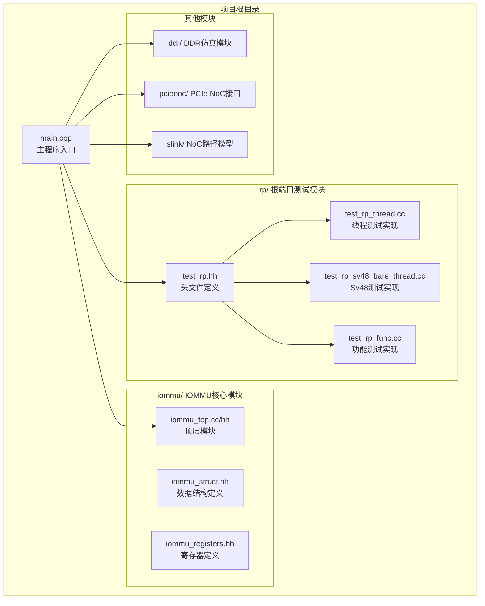

**图表来源**
- [main.cpp:39-94](file://main.cpp#L39-L94)
- [test_rp.hh:54-184](file://rp/test_rp.hh#L54-L184)

**章节来源**
- [main.cpp:39-94](file://main.cpp#L39-L94)
- [README.md:63-76](file://README.md#L63-L76)

## 核心组件

Root Port测试模块的核心组件是一个名为`RP_Module`的SystemC模块，它负责模拟PCIe根端口并与IOMMU进行交互。

### 主要组件职责

1. **设备上下文管理**：创建和配置不同类型的设备上下文
2. **地址转换测试**：生成各种类型的内存访问请求
3. **并发处理验证**：测试多线程和高并发场景下的稳定性
4. **故障检测**：验证IOMMU的错误处理机制

### 关键数据结构

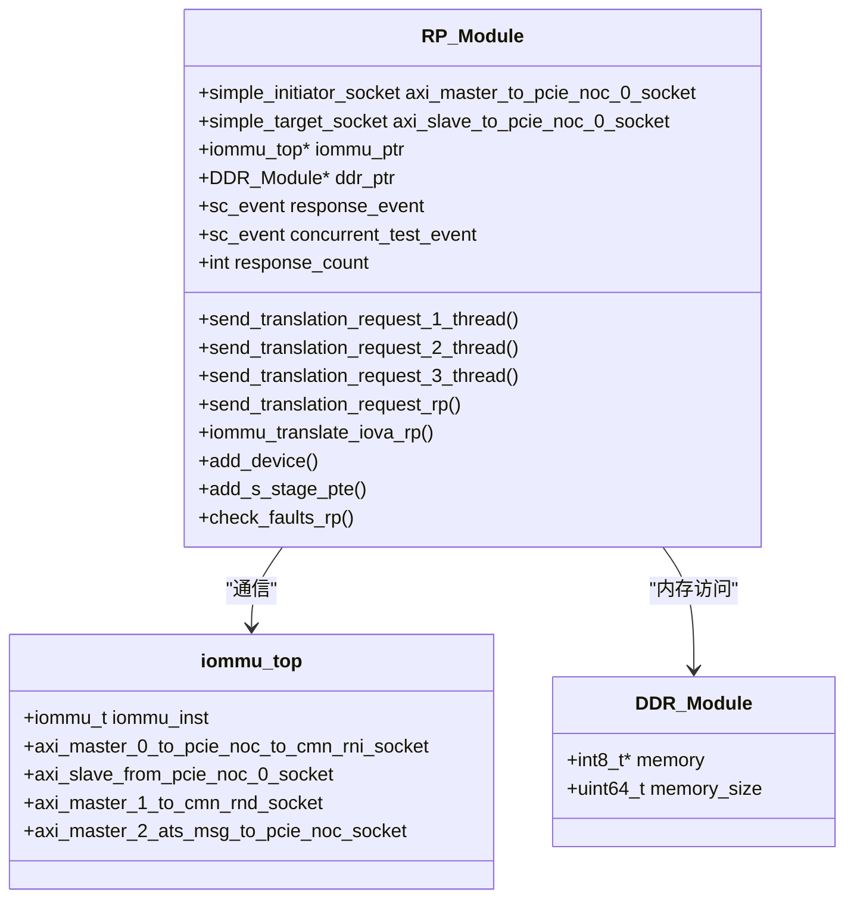

**图表来源**
- [test_rp.hh:54-184](file://rp/test_rp.hh#L54-L184)
- [iommu_struct.hh:42-102](file://iommu/include/iommu_struct.hh#L42-L102)

**章节来源**
- [test_rp.hh:54-184](file://rp/test_rp.hh#L54-L184)
- [iommu_struct.hh:42-102](file://iommu/include/iommu_struct.hh#L42-L102)

## 架构概览

Root Port测试模块采用分层架构设计，通过SystemC的事件驱动机制实现异步通信：

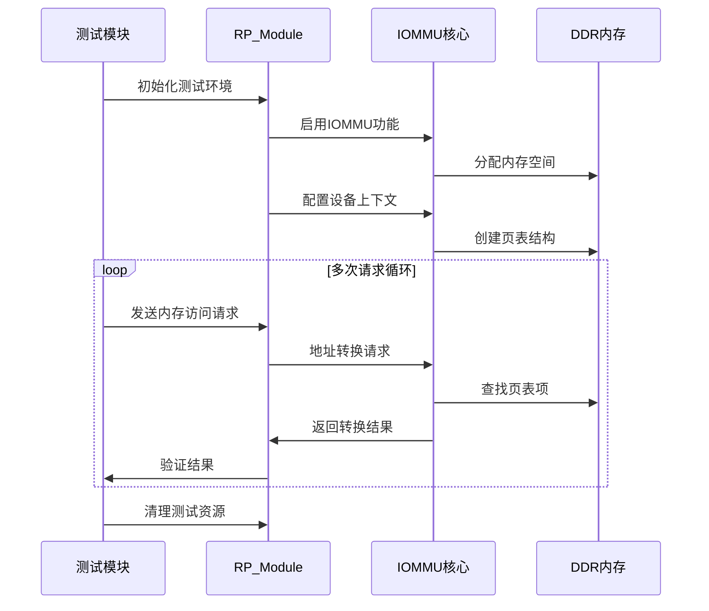

**图表来源**
- [test_rp_thread.cc:10-190](file://rp/test_rp_thread.cc#L10-L190)
- [test_rp_func.cc:28-89](file://rp/test_rp_func.cc#L28-L89)

## 详细组件分析

### 单设备1000请求测试

该测试场景模拟单个设备（设备ID 0x0A）在1000次连续内存访问中的地址转换行为：

#### 测试流程设计

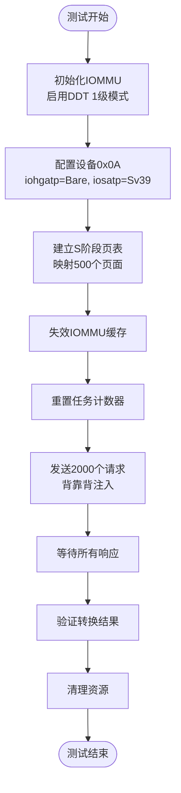

**图表来源**
- [test_rp_thread.cc:44-190](file://rp/test_rp_thread.cc#L44-L190)

#### 请求生成策略

测试采用背靠背（back-to-back）方式发送请求，不设置人工延迟，让FIFO的缓冲压力自然地控制注入速率。每个请求的IOVA地址以512字节步长递增，期望的物理地址（PA）等于IOVA加上0x10000偏移量。

**章节来源**
- [test_rp_thread.cc:92-134](file://rp/test_rp_thread.cc#L92-L134)

### 2000请求并发测试

该测试场景验证IOMMU在高并发条件下的稳定性和性能表现：

#### 并发处理机制

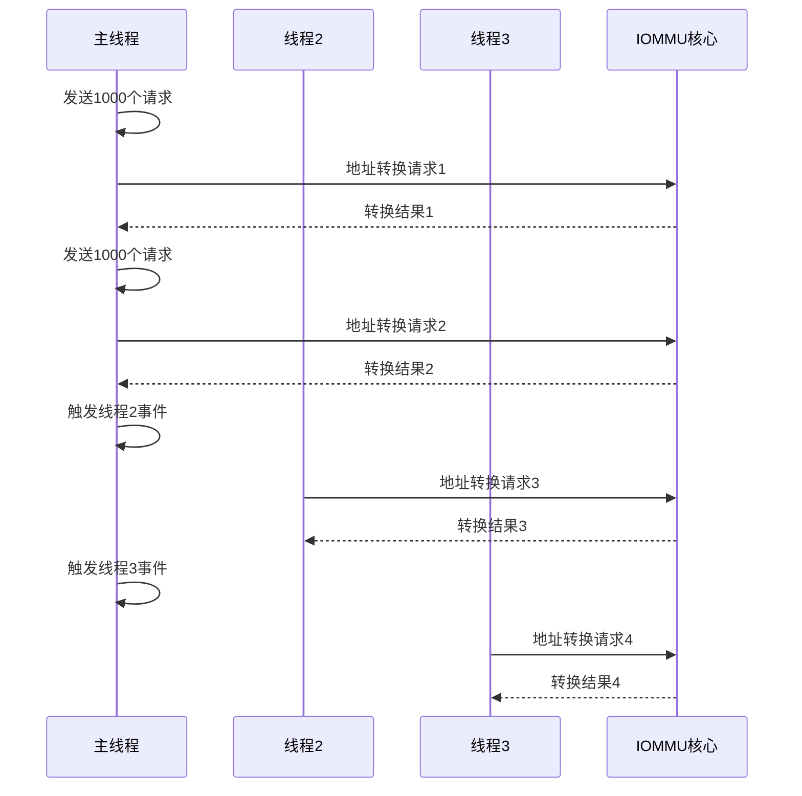

**图表来源**
- [test_rp_thread.cc:192-300](file://rp/test_rp_thread.cc#L192-L300)

#### 线程同步机制

测试使用SystemC事件系统实现线程间的同步：
- `concurrent_test_event`：触发并发测试线程
- `response_count_event`：通知响应计数变化
- `response_event`：接收单个响应

**章节来源**
- [test_rp_thread.cc:192-300](file://rp/test_rp_thread.cc#L192-L300)
- [test_rp.hh:70-76](file://rp/test_rp.hh#L70-L76)

### Sv48 Bare模式测试

该测试场景专门验证Sv48（四级页表）和Bare模式组合的地址转换功能：

#### 页表结构设计

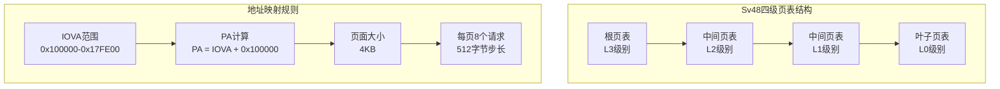

**图表来源**
- [test_rp_sv48_bare_thread.cc:62-96](file://rp/test_rp_sv48_bare_thread.cc#L62-L96)

#### 测试参数配置

- **IOVA范围**：0x100000 到 0x17FE00
- **请求数量**：1000个连续请求
- **页面映射**：125个页面（1000/8=125）
- **地址转换模式**：Sv48 + Bare
- **数据类型**：连续写操作（WRITE）

**章节来源**
- [test_rp_sv48_bare_thread.cc:16-230](file://rp/test_rp_sv48_bare_thread.cc#L16-L230)

### 功能测试方法和验证逻辑

#### 设备上下文配置

测试模块提供了灵活的设备上下文配置功能，支持多种页表模式的组合：

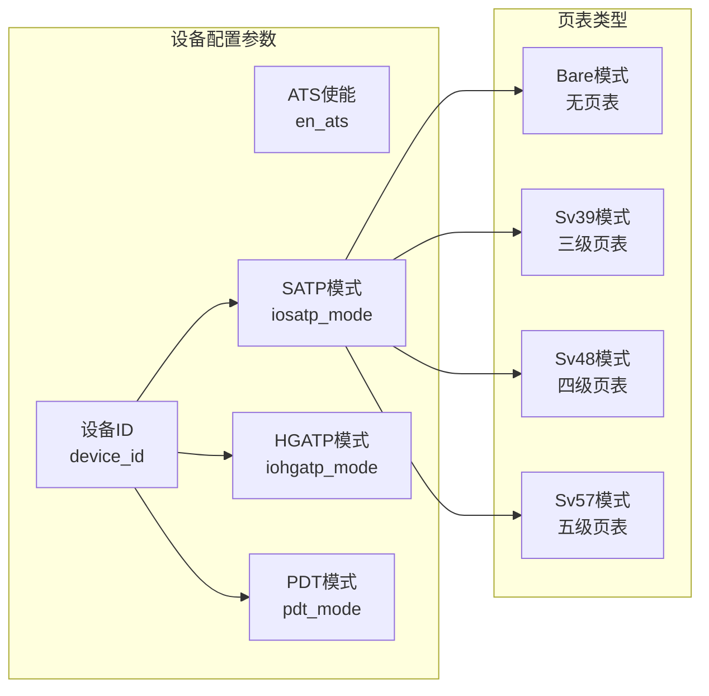

**图表来源**
- [test_rp_func.cc:211-299](file://rp/test_rp_func.cc#L211-L299)

#### 故障检测机制

测试模块实现了完善的故障检测和验证逻辑：

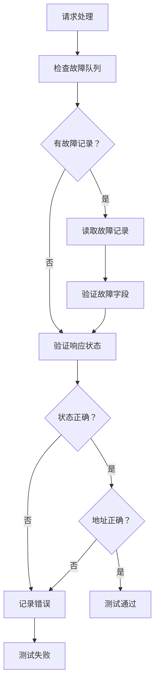

**图表来源**
- [test_rp_func.cc:92-179](file://rp/test_rp_func.cc#L92-L179)

**章节来源**
- [test_rp_func.cc:92-179](file://rp/test_rp_func.cc#L92-L179)
- [test_rp_func.cc:211-299](file://rp/test_rp_func.cc#L211-L299)

## 依赖关系分析

Root Port测试模块与IOMMU核心模块之间存在紧密的依赖关系：

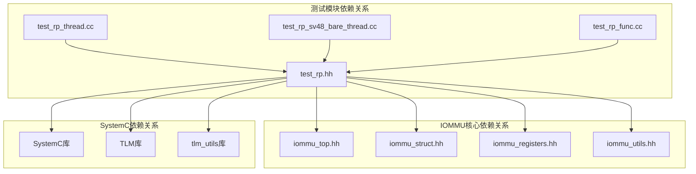

**图表来源**
- [test_rp.hh:1-184](file://rp/test_rp.hh#L1-L184)
- [iommu_struct.hh:1-102](file://iommu/include/iommu_struct.hh#L1-L102)
- [iommu_registers.hh:1-200](file://iommu/include/iommu_registers.hh#L1-L200)

### 关键依赖点

1. **SystemC模块绑定**：测试模块通过socket接口与IOMMU核心进行通信
2. **内存管理**：测试模块直接访问DDR内存进行页表和设备上下文的读写
3. **寄存器访问**：通过寄存器定义文件访问IOMMU的各种控制寄存器
4. **数据结构共享**：测试模块使用IOMMU定义的数据结构进行页表操作

**章节来源**
- [test_rp.hh:62-65](file://rp/test_rp.hh#L62-L65)
- [iommu_registers.hh:23-170](file://iommu/include/iommu_registers.hh#L23-L170)

## 性能考虑

### 缓存统计和性能监控

测试模块集成了全面的性能监控功能：

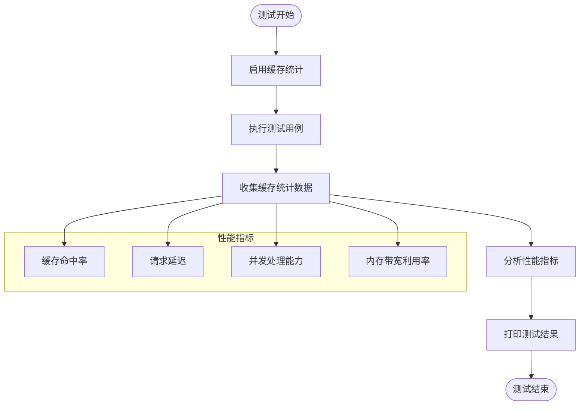

**图表来源**
- [test_rp_thread.cc:182-183](file://rp/test_rp_thread.cc#L182-L183)
- [test_rp_sv48_bare_thread.cc:203-204](file://rp/test_rp_sv48_bare_thread.cc#L203-L204)

### 并发处理优化

测试模块通过以下机制优化并发处理性能：

1. **背靠背请求注入**：减少人工延迟，让硬件FIFO自然控制流量
2. **事件驱动架构**：使用SystemC事件系统实现高效的异步通信
3. **批量响应处理**：通过计数器机制批量处理多个响应
4. **内存预分配**：预先分配页表和设备上下文内存，减少运行时开销

**章节来源**
- [test_rp_thread.cc:131-134](file://rp/test_rp_thread.cc#L131-L134)
- [test_rp_func.cc:301-312](file://rp/test_rp_func.cc#L301-L312)

## 故障排除指南

### 常见问题诊断

#### 测试失败排查

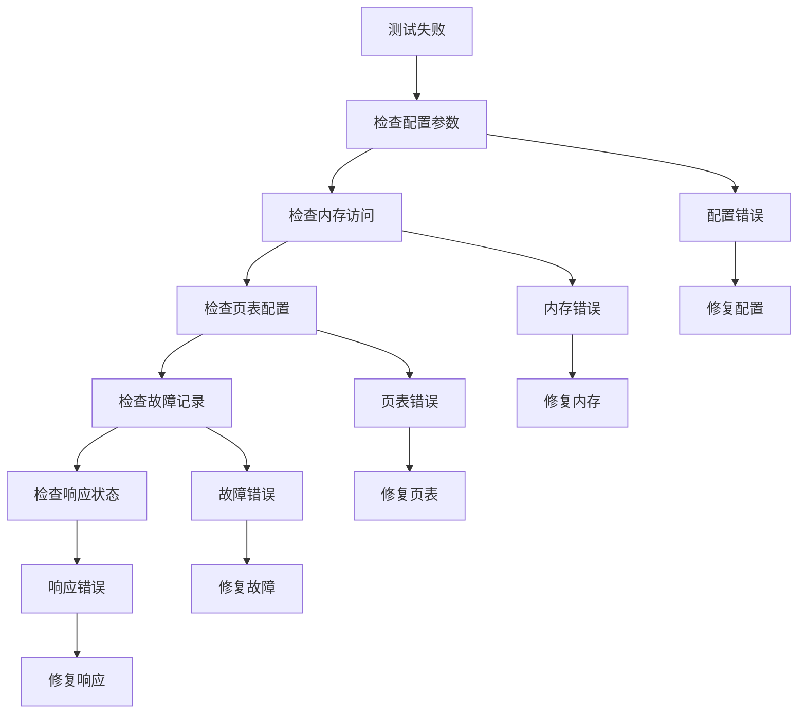

#### 调试信息收集

测试模块提供了丰富的调试输出信息：

1. **IOMMU模式信息**：显示当前IOMMU的工作模式
2. **页表配置详情**：显示页表的创建和映射过程
3. **请求处理状态**：跟踪每个请求的发送和接收状态
4. **缓存统计信息**：提供详细的缓存命中率统计

**章节来源**
- [test_rp_thread.cc:24-37](file://rp/test_rp_thread.cc#L24-L37)
- [test_rp_func.cc:11-26](file://rp/test_rp_func.cc#L11-L26)

### 环境配置要求

#### 系统要求

- **操作系统**：WSL2（Windows Subsystem for Linux）
- **编译器**：GCC/G++ 支持 C++11
- **SystemC版本**：2.3.x
- **内存要求**：至少4GB RAM（用于大型测试场景）

#### 编译配置

```bash
# 推荐的编译选项
make clean
make DEBUG=1

# 或者使用编译脚本
chmod +x compile_wsl.sh
./compile_wsl.sh
```

**章节来源**
- [README.md:7-16](file://README.md#L7-L16)
- [README.md:17-53](file://README.md#L17-L53)

## 结论

Root Port测试模块为RISC-V IOMMU项目提供了全面的功能验证框架。通过精心设计的测试场景，该模块能够有效验证IOMMU在各种复杂场景下的地址转换能力和稳定性。

### 主要成就

1. **多模式支持**：成功验证了Bare、Sv39、Sv48等多种页表模式
2. **高并发测试**：通过2000请求并发测试验证了IOMMU的并发处理能力
3. **完整功能覆盖**：从基础地址转换到高级故障处理的全方位验证
4. **性能监控集成**：内置缓存统计和性能分析功能

### 技术创新

1. **事件驱动架构**：利用SystemC的事件系统实现高效的异步通信
2. **灵活的测试配置**：支持多种页表模式和设备配置的动态切换
3. **完善的验证机制**：集成了故障检测、响应验证和性能监控功能
4. **可扩展的设计**：模块化的架构便于添加新的测试场景和验证逻辑

该测试模块为IOMMU的开发和验证提供了坚实的基础，确保了系统的可靠性和性能表现。