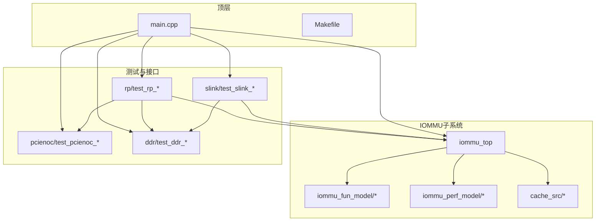
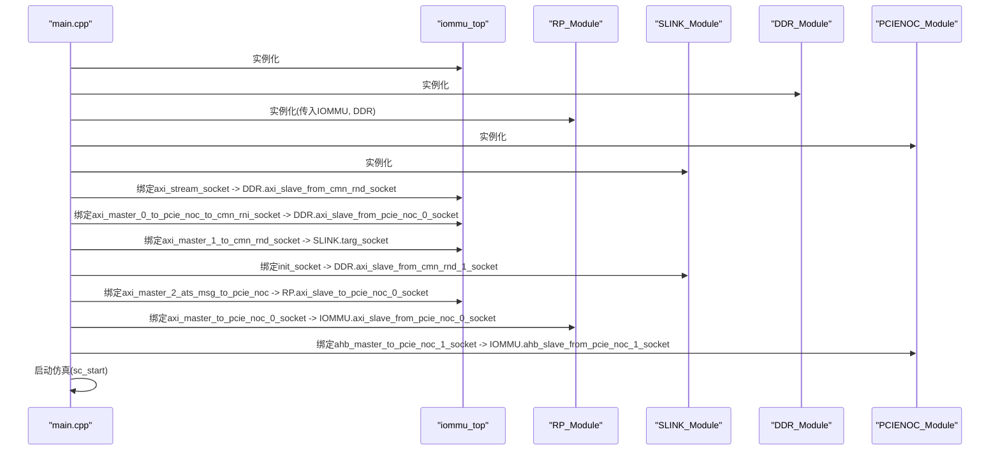
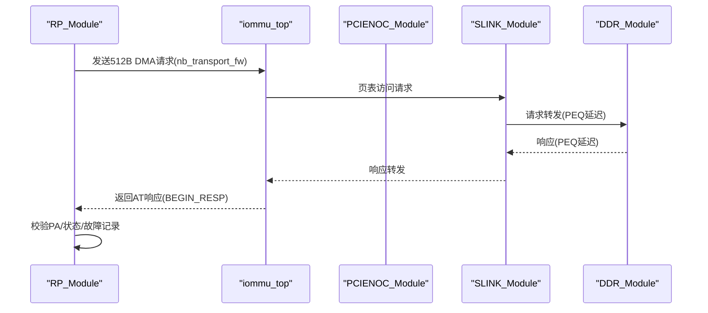
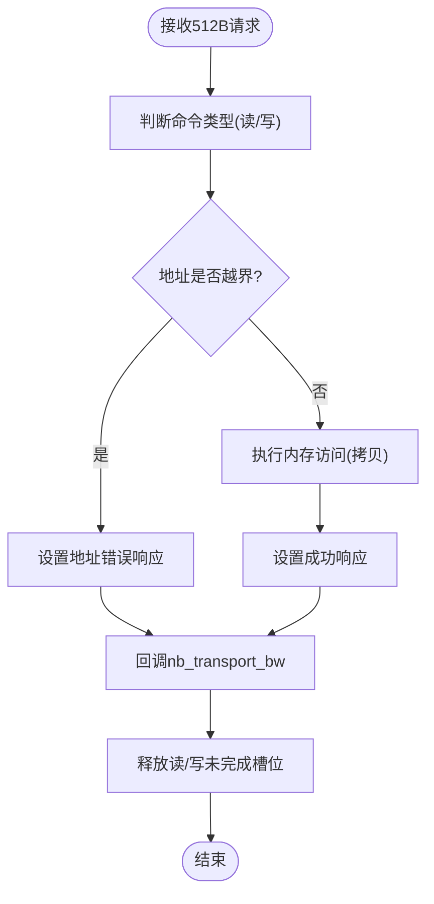
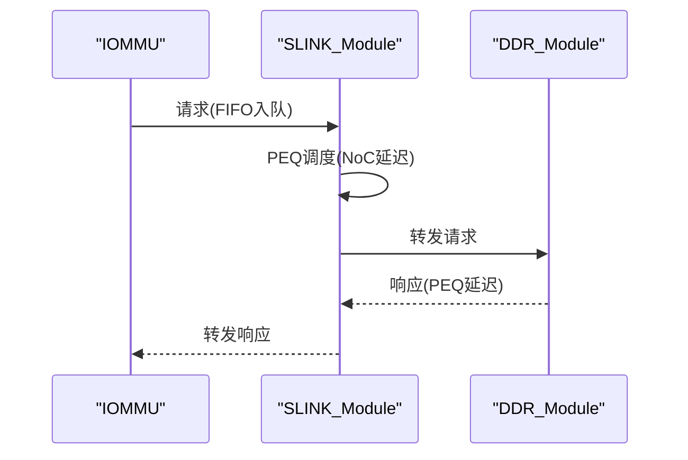
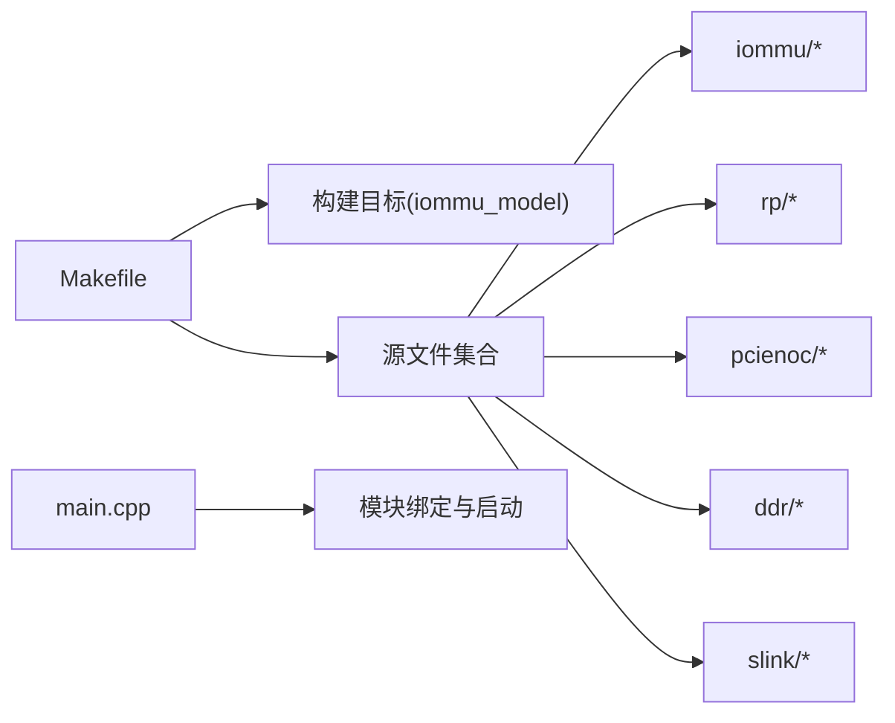
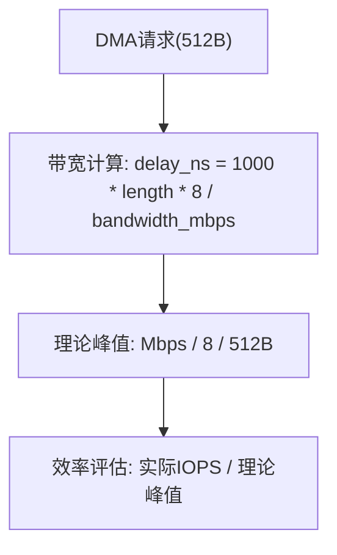

# 测试框架

<cite>
**本文引用的文件**
- [main.cpp](file://main.cpp)
- [Makefile](file://Makefile)
- [README.md](file://README.md)
- [rp/test_rp.hh](file://rp/test_rp.hh)
- [rp/test_rp_func.cc](file://rp/test_rp_func.cc)
- [rp/test_rp_thread.cc](file://rp/test_rp_thread.cc)
- [rp/test_rp_sv48_bare_thread.cc](file://rp/test_rp_sv48_bare_thread.cc)
- [ddr/test_ddr.hh](file://ddr/test_ddr.hh)
- [ddr/test_ddr.cc](file://ddr/test_ddr.cc)
- [slink/test_slink.hh](file://slink/test_slink.hh)
- [slink/test_slink.cc](file://slink/test_slink.cc)
- [pcienoc/test_pcienoc.cc](file://pcienoc/test_pcienoc.cc)
- [pcienoc/test_pcienoc.hh](file://pcienoc/test_pcienoc.hh)
- [iommu_perf_model/iommu_perf_reorder.cc](file://iommu/iommu_perf_model/iommu_perf_reorder.cc)
- [iommu_perf_model/iommu_perf_params.hh](file://iommu/iommu_perf_model/iommu_perf_params.hh)
- [iommu_top.cc](file://iommu/iommu_top.cc)
</cite>

## 目录
1. [简介](#简介)
2. [项目结构](#项目结构)
3. [核心组件](#核心组件)
4. [架构总览](#架构总览)
5. [详细组件分析](#详细组件分析)
6. [依赖关系分析](#依赖关系分析)
7. [性能考量](#性能考量)
8. [故障排除指南](#故障排除指南)
9. [结论](#结论)
10. [附录](#附录)

## 简介
本测试框架面向RISC-V IOMMU系统，围绕以下测试模块设计与实现：
- Root Port测试：通过RP模块向IOMMU发起设备请求，验证地址转换（单级/两级）、故障记录与响应一致性。**更新**：现在使用512字节DMA载荷大小，更好地模拟真实DMA流量模式。
- PCIe NoC测试：PCIENOC模块作为接口占位，配合绑定关系验证端口连接与消息通路。
- DDR内存测试：通过DDR模块模拟物理内存与延迟，验证读写事务、并发上限控制与响应顺序。
- NoC路径测试：通过SLINK模块对IOMMU到DDR的页表访问路径进行流水线延迟建模与转发验证。

测试脚本支持多场景编译与运行，提供自动化测试流程、测试数据生成与验证机制，并给出回归测试策略与性能基准方法。

## 项目结构
项目采用按功能域分层的组织方式：
- 根目录包含顶层入口、构建脚本与测试线程选择逻辑。
- iommu/：IOMMU核心实现与性能模型。
- rp/：Root Port测试模块与测试线程。
- pcienoc/：PCIe NoC接口模块（接口定义）。
- ddr/：DDR内存仿真模块。
- slink/：NoC路径模型（IOMMU到DDR的页表访问路径）。

图表来源
- [main.cpp:39-94](file://main.cpp#L39-L94)
- [Makefile:42-84](file://Makefile#L42-L84)

章节来源
- [README.md:63-76](file://README.md#L63-L76)
- [Makefile:1-132](file://Makefile#L1-L132)

## 核心组件
- RP模块（Root Port）
  - 提供发送翻译请求、设备上下文与页表配置、故障检查与响应校验等能力。
  - 支持多线程并发测试场景，使用事件同步与计数器跟踪响应。
  - **更新**：现在使用512字节DMA载荷大小，模拟更接近真实系统的DMA流量模式。
- DDR模块
  - 模拟1MB内存空间，支持读写事务、并发上限控制、排队延迟与响应回调。
- SLINK模块（NoC路径）
  - 对IOMMU到DDR的页表访问路径进行流水线延迟建模，分别在请求与响应方向引入PEQ延迟。
- PCIENOC模块
  - 接口占位，提供与IOMMU的绑定关系以验证端口连通性。

章节来源
- [rp/test_rp.hh:54-184](file://rp/test_rp.hh#L54-L184)
- [ddr/test_ddr.hh:17-64](file://ddr/test_ddr.hh#L17-L64)
- [slink/test_slink.hh:21-58](file://slink/test_slink.hh#L21-L58)
- [pcienoc/test_pcienoc.hh:10-21](file://pcienoc/test_pcienoc.hh#L10-L21)

## 架构总览
系统通过SystemC TLM 2.0接口互联，主程序负责实例化各模块并建立绑定关系，随后启动仿真。

图表来源
- [main.cpp:49-80](file://main.cpp#L49-L80)

章节来源
- [main.cpp:39-94](file://main.cpp#L39-L94)

## 详细组件分析

### Root Port测试（设备请求生成与地址转换）
- 设备上下文与页表配置
  - 支持不同模式组合（如Sv39/Bare、Sv48/Bare），动态分配页框并写入PTE，同时进行读回验证。
  - 提供设备目录树（DDT）遍历与创建，确保设备上下文落盘与一致性。
- 地址转换与响应校验
  - 通过非阻塞接口发送请求，等待响应事件；支持批量并发注入与响应计数统计。
  - 提供故障记录检查函数，核对故障队列头尾索引、记录内容与类型。
- 并发与同步
  - 多线程场景下使用事件与计数器协调，避免竞态；必要时使用阻塞接口规避竞争条件。
- **更新**：DMA载荷大小从16字节增加到512字节，更好地模拟真实DMA流量模式，提高测试的代表性。

图表来源
- [rp/test_rp_func.cc:28-89](file://rp/test_rp_func.cc#L28-L89)
- [slink/test_slink.cc:66-88](file://slink/test_slink.cc#L66-L88)
- [ddr/test_ddr.cc:94-127](file://ddr/test_ddr.cc#L94-L127)

章节来源
- [rp/test_rp_func.cc:11-89](file://rp/test_rp_func.cc#L11-L89)
- [rp/test_rp_func.cc:92-179](file://rp/test_rp_func.cc#L92-L179)
- [rp/test_rp_func.cc:211-299](file://rp/test_rp_func.cc#L211-L299)

### PCIe NoC测试（网络接口测试与事务传输验证）
- 接口绑定验证
  - 通过PCIENOC模块的initiator socket与IOMMU target socket绑定，验证端口连通性与消息通路。
- 事务传输
  - 该模块当前为接口定义，实际NoC行为由绑定关系与上层IOMMU/ATS路径驱动。

章节来源
- [pcienoc/test_pcienoc.hh:10-21](file://pcienoc/test_pcienoc.hh#L10-L21)
- [main.cpp:78-79](file://main.cpp#L78-L79)

### DDR内存测试（内存访问测试与带宽控制验证）
- 内存访问
  - 支持读写事务，地址越界检测与响应状态设置。
- 并发与延迟
  - 分别维护读/写未完成计数与事件，超过上限时阻塞注入；内部PEQ引入固定延迟后返回响应。
- 带宽控制
  - 通过最大未完成请求数限制与队列深度控制背压，模拟真实内存带宽与排队行为。

图表来源
- [ddr/test_ddr.cc:132-152](file://ddr/test_ddr.cc#L132-L152)

章节来源
- [ddr/test_ddr.cc:8-26](file://ddr/test_ddr.cc#L8-L26)
- [ddr/test_ddr.cc:55-89](file://ddr/test_ddr.cc#L55-L89)
- [ddr/test_ddr.cc:94-127](file://ddr/test_ddr.cc#L94-L127)
- [ddr/test_ddr.cc:132-152](file://ddr/test_ddr.cc#L132-L152)

### NoC路径测试（路径模型验证与延迟测量）
- 路径建模
  - 请求与响应方向均使用FIFO与PEQ，分别引入固定NoC延迟，保证时序与顺序。
- 延迟测量
  - 通过PEQ触发时间戳与进程调度，可评估路径延迟与吞吐；结合测试线程的批量注入可观察背压与排队效应。

图表来源
- [slink/test_slink.cc:66-116](file://slink/test_slink.cc#L66-L116)

章节来源
- [slink/test_slink.cc:6-26](file://slink/test_slink.cc#L6-L26)
- [slink/test_slink.cc:66-116](file://slink/test_slink.cc#L66-L116)

## 依赖关系分析
- 构建依赖
  - Makefile统一编译IOMMU功能模块、性能模型、缓存子系统、测试线程与仿真模块。
  - 通过TEST变量选择不同测试线程源文件（Sv39 Bare或Sv48 Bare）。
- 运行时依赖
  - main.cpp中完成模块实例化与绑定，随后启动仿真。

图表来源
- [Makefile:42-84](file://Makefile#L42-L84)
- [main.cpp:49-80](file://main.cpp#L49-L80)

章节来源
- [Makefile:1-132](file://Makefile#L1-L132)
- [main.cpp:39-94](file://main.cpp#L39-L94)

## 性能考量
- 缓存命中率与统计
  - 测试线程在完成后调用缓存统计打印，可用于评估不同页表模式（Sv39/Sv48）与并发场景下的缓存表现。
- 延迟与吞吐
  - SLINK的PEQ延迟与DDR的内部延迟共同决定端到端时延；可通过调整延迟参数与并发度评估系统瓶颈。
- 带宽与背压
  - DDR的最大未完成请求数与队列深度限制了注入速率，有助于模拟真实内存带宽约束。
- **更新**：性能模型现在使用512字节作为标准载荷大小进行带宽计算，更准确地反映真实DMA流量的带宽需求。

图表来源
- [iommu/iommu_perf_model/iommu_perf_reorder.cc:168-172](file://iommu/iommu_perf_model/iommu_perf_reorder.cc#L168-L172)
- [iommu/iommu_top.cc:587-596](file://iommu/iommu_top.cc#L587-L596)

章节来源
- [rp/test_rp_thread.cc:183-183](file://rp/test_rp_thread.cc#L183-L183)
- [rp/test_rp_sv48_bare_thread.cc:204-204](file://rp/test_rp_sv48_bare_thread.cc#L204-L204)
- [slink/test_slink.cc:6-26](file://slink/test_slink.cc#L6-L26)
- [ddr/test_ddr.cc:20-22](file://ddr/test_ddr.cc#L20-L22)
- [iommu/iommu_perf_model/iommu_perf_reorder.cc:168-172](file://iommu/iommu_perf_model/iommu_perf_reorder.cc#L168-L172)
- [iommu/iommu_top.cc:587-596](file://iommu/iommu_top.cc#L587-L596)

## 故障排除指南
- 编译与运行环境
  - 必须在WSL环境中使用SystemC库与GCC/G++编译，确保路径与库链接正确。
- 调试输出
  - 默认启用大量DEBUG宏，可在RP/SLINK/DDR等模块中查看详细日志，定位问题。
- 常见问题
  - 地址越界：DDR模块会设置地址错误响应，检查IOVA映射与页表配置。
  - 响应不一致：核对故障记录检查函数与期望类型，确保设备上下文与页表写入正确。
  - 并发竞态：使用阻塞接口或事件同步避免响应事件竞争。
- **更新**：DMA载荷大小变更可能导致带宽计算差异，注意检查性能统计数据中的理论峰值与实际效率。

章节来源
- [README.md:7-16](file://README.md#L7-L16)
- [ddr/test_ddr.cc:138-143](file://ddr/test_ddr.cc#L138-L143)
- [rp/test_rp_func.cc:92-132](file://rp/test_rp_func.cc#L92-L132)

## 结论
本测试框架通过RP/DDR/SLINK/PCIENOC四大模块协同，覆盖了RISC-V IOMMU的地址转换、NoC路径与内存访问等关键路径。**更新**：payload大小从16字节增加到512字节，使测试更贴近真实DMA流量模式，提高了测试的有效性和代表性。借助多场景测试线程与统计输出，能够有效评估不同页表模式与并发条件下的性能与稳定性，并为回归测试与性能基准提供基础。

## 附录

### 测试脚本使用方法
- 编译
  - 使用编译脚本或直接执行make，默认启用调试模式；也可指定DEBUG=0进行发布模式编译。
- 运行
  - 编译成功后运行可执行文件，仿真启动后按测试线程逻辑自动执行。
- 场景切换
  - 通过TEST变量选择不同测试线程源文件（Sv39 Bare或Sv48 Bare）。

章节来源
- [README.md:17-54](file://README.md#L17-L54)
- [Makefile:36-40](file://Makefile#L36-L40)
- [main.cpp:82-83](file://main.cpp#L82-L83)

### 测试数据生成与验证机制
- 数据生成
  - RP模块动态分配页框并写入PTE，同时进行读回验证；设备上下文与进程上下文也通过类似方式生成。
  - **更新**：现在使用512字节DMA载荷大小，提供更真实的DMA流量模拟。
- 验证机制
  - 校验PA与状态一致性；通过故障记录检查函数核对故障类型与字段；并发场景下统计通过数量与失败详情。

章节来源
- [rp/test_rp_func.cc:402-475](file://rp/test_rp_func.cc#L402-L475)
- [rp/test_rp_func.cc:619-704](file://rp/test_rp_func.cc#L619-L704)
- [rp/test_rp_func.cc:92-132](file://rp/test_rp_func.cc#L92-L132)

### 自动化测试流程与回归策略
- 自动化
  - 通过Makefile统一编译与运行，测试线程在仿真中自动执行，结束后打印统计信息。
- 回归策略
  - 基于不同页表模式与并发场景的测试线程，定期运行以监控性能与稳定性变化。
- **更新**：新的512字节载荷大小可能影响性能指标，需要重新评估理论峰值与实际效率。

章节来源
- [Makefile:100-105](file://Makefile#L100-L105)
- [rp/test_rp_thread.cc:180-189](file://rp/test_rp_thread.cc#L180-L189)
- [rp/test_rp_sv48_bare_thread.cc:206-210](file://rp/test_rp_sv48_bare_thread.cc#L206-L210)

### 性能基准测试方法
- 带宽计算
  - 使用公式：delay_ns = 1000.0 × data_length_bytes × 8 / bandwidth_mbps
  - 理论峰值：bandwidth_mbps / 8 / 512B
  - 效率：实际IOPS / 理论峰值
- IOPS采样
  - 跳过前10%和后10%，只统计中间80%稳定段的IOPS
  - 稳态窗口：#10% ~ #90%的时间段

章节来源
- [iommu/iommu_perf_model/iommu_perf_reorder.cc:168-172](file://iommu/iommu_perf_model/iommu_perf_reorder.cc#L168-L172)
- [iommu/iommu_top.cc:587-596](file://iommu/iommu_top.cc#L587-L596)
- [iommu/iommu_perf_model/iommu_perf_params.hh:88-101](file://iommu/iommu_perf_model/iommu_perf_params.hh#L88-L101)