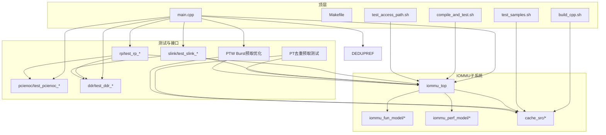
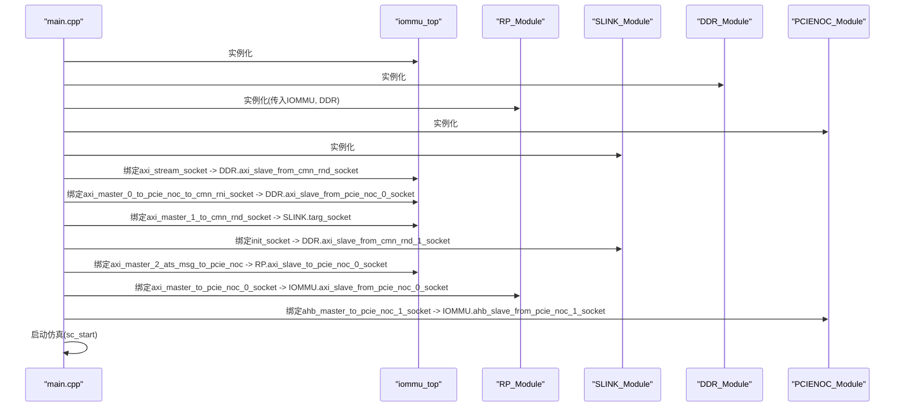
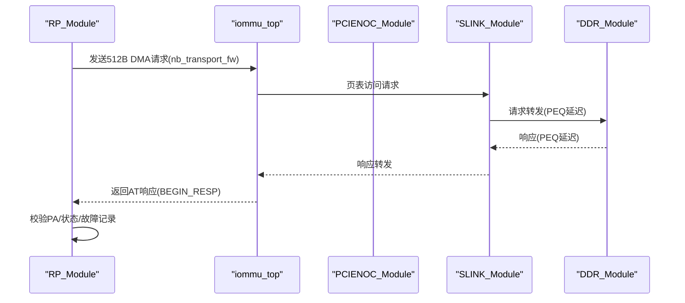
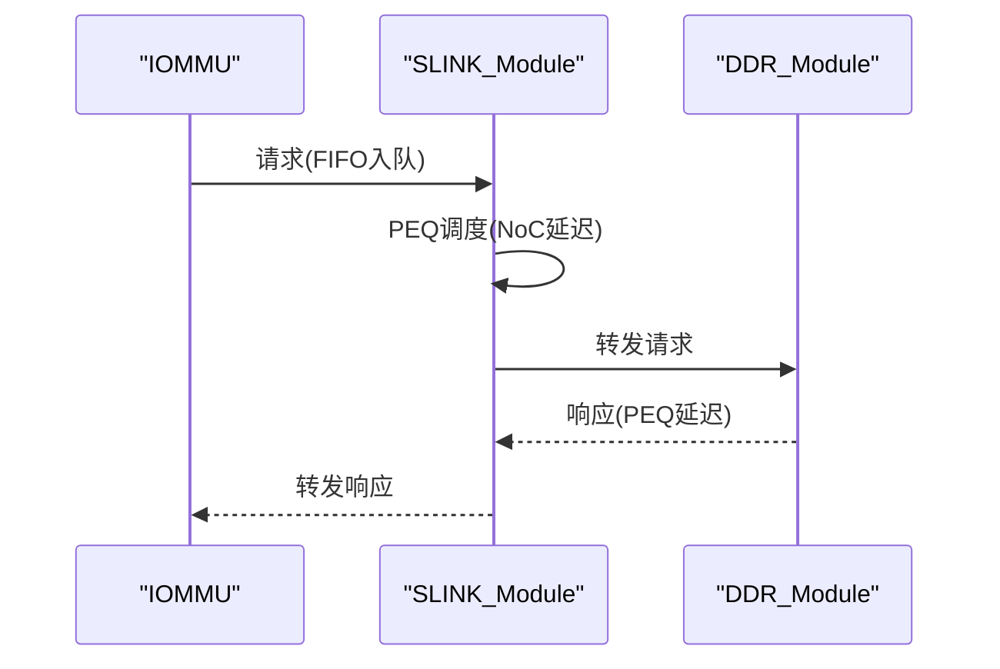
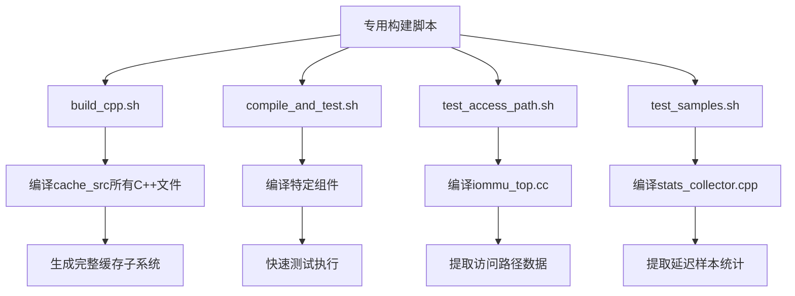
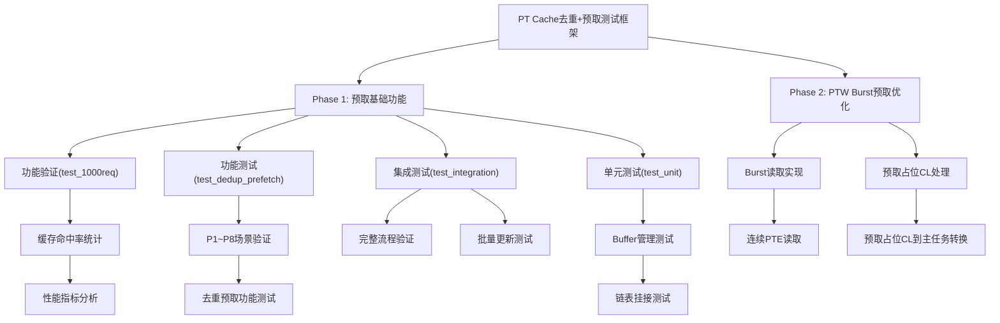
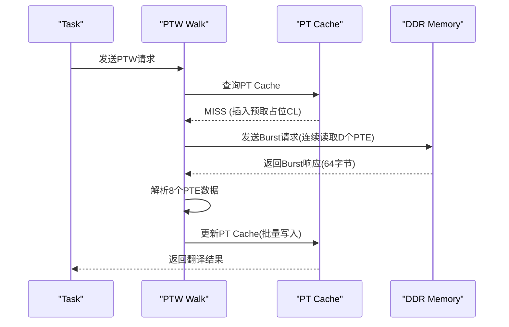
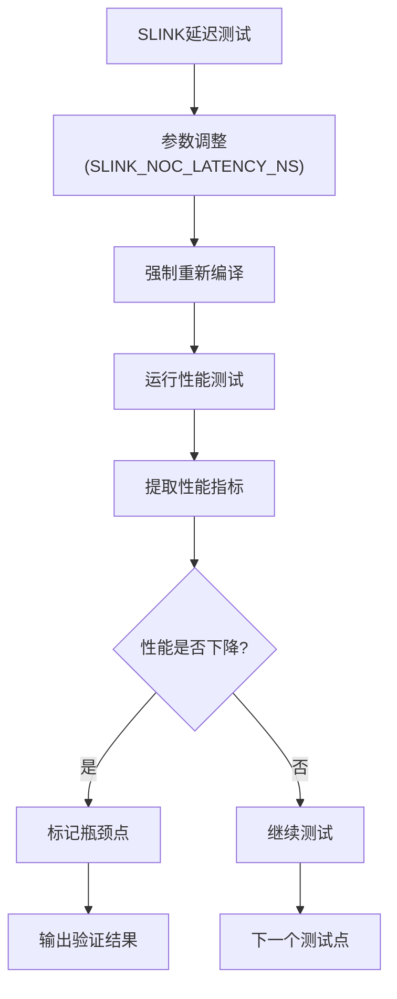
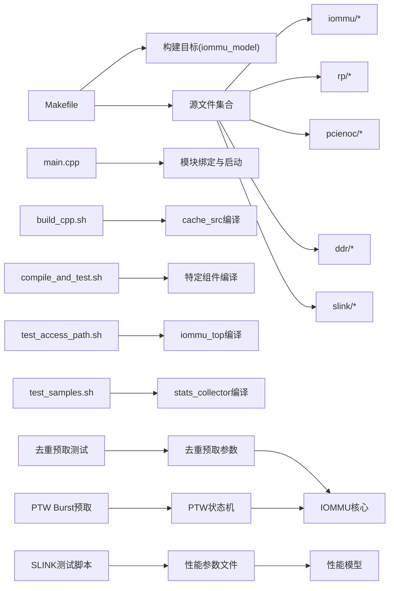
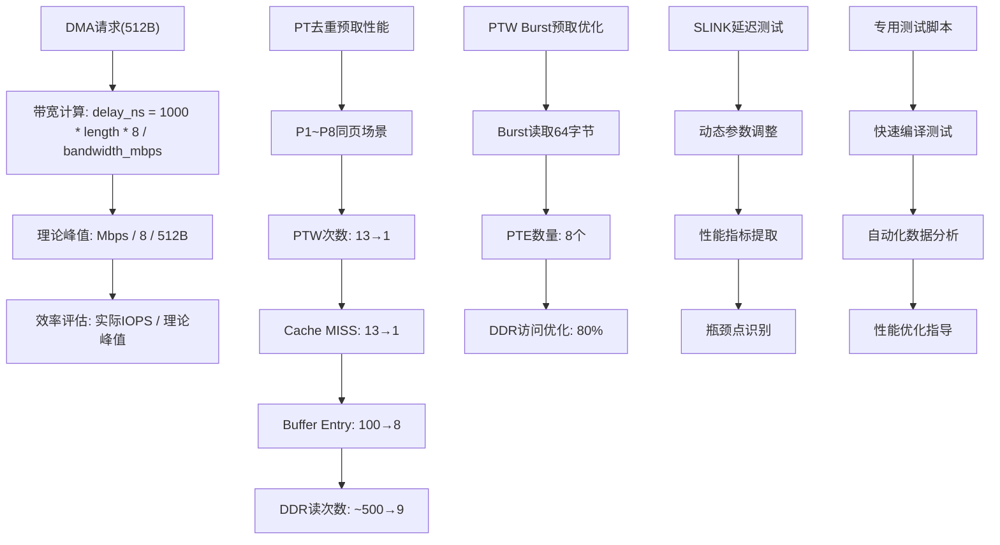

# 测试框架

<cite>
**本文引用的文件**
- [main.cpp](file://main.cpp)
- [Makefile](file://Makefile)
- [README.md](file://README.md)
- [build_cpp.sh](file://build_cpp.sh)
- [compile_and_test.sh](file://compile_and_test.sh)
- [test_access_path.sh](file://test_access_path.sh)
- [test_samples.sh](file://test_samples.sh)
- [rp/test_rp.hh](file://rp/test_rp.hh)
- [rp/test_rp_func.cc](file://rp/test_rp_func.cc)
- [rp/test_rp_thread.cc](file://rp/test_rp_thread.cc)
- [rp/test_rp_sv48_bare_thread.cc](file://rp/test_rp_sv48_bare_thread.cc)
- [ddr/test_ddr.hh](file://ddr/test_ddr.hh)
- [ddr/test_ddr.cc](file://ddr/test_ddr.cc)
- [slink/test_slink.hh](file://slink/test_slink.hh)
- [slink/test_slink.cc](file://slink/test_slink.cc)
- [pcienoc/test_pcienoc.cc](file://pcienoc/test_pcienoc.cc)
- [pcienoc/test_pcienoc.hh](file://pcienoc/test_pcienoc.hh)
- [iommu_perf_model/iommu_perf_reorder.cc](file://iommu/iommu_perf_model/iommu_perf_reorder.cc)
- [iommu_perf_model/iommu_perf_params.hh](file://iommu/iommu_perf_model/iommu_perf_params.hh)
- [iommu_top.cc](file://iommu/iommu_top.cc)
- [test_1000req.sh](file://test_1000req.sh)
- [test_dedup_prefetch.sh](file://test_dedup_prefetch.sh)
- [test_integration_dedup_prefetch.sh](file://test_integration_dedup_prefetch.sh)
- [test_precise.sh](file://test_precise.sh)
- [test_slink_latency.sh](file://test_slink_latency.sh)
- [test_slink_verify.sh](file://test_slink_verify.sh)
- [test_slink_critical.sh](file://test_slink_critical.sh)
- [test_dedup_prefetch_unit.cpp](file://test_dedup_prefetch_unit.cpp)
- [iommu_dedup_params.hh](file://iommu/include/iommu_dedup_params.hh)
- [dedup_buffer.h](file://iommu/cache_src/common/dedup_buffer.h)
- [iommu_perf_pt_dedup_flush.cc](file://iommu/iommu_perf_model/iommu_perf_pt_dedup_flush.cc)
- [PT_DEDUP_PREFETCH_FINAL_SCHEME.md](file://PT_DEDUP_PREFETCH_FINAL_SCHEME.md)
- [IMPLEMENTATION_PROGRESS.md](file://IMPLEMENTATION_PROGRESS.md)
- [TEST_REPORT_PHASE1_20260609.md](file://TEST_REPORT_PHASE1_20260609.md)
- [PT_CACHE_PREFETCH_IMPLEMENTATION_ANALYSIS_20260609.md](file://PT_CACHE_PREFETCH_IMPLEMENTATION_ANALYSIS_20260609.md)
- [PTW_PREFETCH_BURST_OPTIMIZATION_20260608.md](file://PTW_PREFETCH_BURST_OPTIMIZATION_20260608.md)
- [iommu/cache_src/common/types.h](file://iommu/cache_src/common/types.h)
- [iommu/cache_src/subsystem/cache_subsystem.cpp](file://iommu/cache_src/subsystem/cache_subsystem.cpp)
- [iommu/iommu_perf_model/iommu_task_cache_convert.cc](file://iommu/iommu_perf_model/iommu_task_cache_convert.cc)
</cite>

## 更新摘要
**变更内容**
- 新增专用构建和测试脚本，提供更精细的编译控制和测试执行能力
- 改进测试基础设施，支持针对特定组件的快速测试和验证
- 新增PT Cache访问路径测试、统计样本测试等专项测试脚本
- 完善测试脚本的自动化分析和结果提取功能

## 目录
1. [简介](#简介)
2. [项目结构](#项目结构)
3. [核心组件](#核心组件)
4. [架构总览](#架构总览)
5. [详细组件分析](#详细组件分析)
6. [依赖关系分析](#依赖关系分析)
7. [性能考量](#性能考量)
8. [故障排除指南](#故障排除指南)
9. [结论](#结论)
10. [附录](#附录)

## 简介
本测试框架面向RISC-V IOMMU系统，围绕以下测试模块设计与实现：
- Root Port测试：通过RP模块向IOMMU发起设备请求，验证地址转换（单级/两级）、故障记录与响应一致性。**更新**：现在使用512字节DMA载荷大小，更好地模拟真实DMA流量模式。
- PCIe NoC测试：PCIENOC模块作为接口占位，配合绑定关系验证端口连接与消息通路。
- DDR内存测试：通过DDR模块模拟物理内存与延迟，验证读写事务、并发上限控制与响应顺序。
- NoC路径测试：通过SLINK模块对IOMMU到DDR的页表访问路径进行流水线延迟建模与转发验证。**新增**：SLINK模块现已集成完整的延迟性能测试框架，支持动态延迟参数调整和性能分析。
- **新增**：专用构建和测试脚本：提供精细化的编译控制和测试执行能力，支持针对特定组件的快速验证。
- **新增**：PT Cache访问路径测试：专门用于验证PT Cache的访问路径和性能特征。
- **新增**：统计样本测试：用于提取和分析系统性能统计样本数据。
- **新增**：PT Cache去重+预取测试：验证PT Cache去重机制、预取功能和缓冲区管理，包括功能测试、集成测试和单元测试三个层次。
- **新增**：PTW Burst预取优化：实现PTW Level 0的Burst预取功能，通过连续读取多个PTE来优化内存访问性能。

**更新**：PT Cache去重+预取测试框架经过Phase 1和Phase 2的完整实现，现在提供从基础去重功能到高级预取优化的全功能测试体系。

## 项目结构
项目采用按功能域分层的组织方式：
- 根目录包含顶层入口、构建脚本与测试线程选择逻辑。
- iommu/：IOMMU核心实现与性能模型。
- rp/：Root Port测试模块与测试线程。
- pcienoc/：PCIe NoC接口模块（接口定义）。
- ddr/：DDR内存仿真模块。
- slink/：NoC路径模型（IOMMU到DDR的页表访问路径）。
- **新增**：专用构建脚本（build_cpp.sh、compile_and_test.sh）提供精细化的编译控制。
- **新增**：专项测试脚本（test_access_path.sh、test_samples.sh）支持特定功能的快速验证。
- **新增**：PT Cache预取功能测试脚本和实现分析文档。
- **新增**：PTW Burst预取优化技术文档和测试验证。

**图表来源**
- [main.cpp:39-94](file://main.cpp#L39-L94)
- [Makefile:42-84](file://Makefile#L42-L84)
- [build_cpp.sh:1-28](file://build_cpp.sh#L1-28)
- [compile_and_test.sh:1-21](file://compile_and_test.sh#L1-21)
- [test_access_path.sh:1-17](file://test_access_path.sh#L1-17)
- [test_samples.sh:1-17](file://test_samples.sh#L1-17)

**章节来源**
- [README.md:63-76](file://README.md#L63-L76)
- [Makefile:1-132](file://Makefile#L1-L132)

## 核心组件
- RP模块（Root Port）
  - 提供发送翻译请求、设备上下文与页表配置、故障检查与响应校验等能力。
  - 支持多线程并发测试场景，使用事件同步与计数器跟踪响应。
  - **更新**：现在使用512字节DMA载荷大小，模拟更接近真实系统的DMA流量模式。
- DDR模块
  - 模拟1MB内存空间，支持读写事务、并发上限控制、排队延迟与响应回调。
- SLINK模块（NoC路径）
  - 对IOMMU到DDR的页表访问路径进行流水线延迟建模，分别在请求与响应方向引入PEQ延迟。
  - **新增**：集成完整的性能测试框架，支持动态延迟参数调整和性能分析。
- PCIENOC模块
  - 接口占位，提供与IOMMU的绑定关系以验证端口连通性。
- **新增**：专用构建脚本
  - build_cpp.sh：编译cache_src所有C++源文件，提供完整的缓存子系统编译支持。
  - compile_and_test.sh：编译特定组件（pt_cache.cpp、iommu_top.cc）并运行测试。
  - test_access_path.sh：编译iommu_top.cc并运行，提取RAM访问路径分解数据。
  - test_samples.sh：编译stats_collector.cpp并运行，提取延迟样本统计。
- **新增**：PT Cache去重+预取测试模块
  - test_1000req.sh：1000请求功能验证和缓存命中率统计
  - test_dedup_prefetch.sh：去重预取功能测试，验证P1~P8连续同页访问
  - test_integration_dedup_prefetch.sh：集成测试，验证完整的去重预取流程
  - test_dedup_prefetch_unit.cpp：单元测试，验证Buffer管理、链表挂接等核心功能
- **新增**：PTW Burst预取优化模块
  - PTW Level 0 Burst读取：连续读取D个PTE，优化内存访问性能
  - 预取占位CL插入：在MISS时插入D个预取占位CL(is_req=0)
  - 预取占位CL处理：在HIT时处理预取占位CL(is_req=0)的首次访问

**章节来源**
- [rp/test_rp.hh:54-184](file://rp/test_rp.hh#L54-L184)
- [ddr/test_ddr.hh:17-64](file://ddr/test_ddr.hh#L17-L64)
- [slink/test_slink.hh:21-58](file://slink/test_slink.hh#L21-L58)
- [pcienoc/test_pcienoc.hh:10-21](file://pcienoc/test_pcienoc.hh#L10-L21)
- [build_cpp.sh:1-28](file://build_cpp.sh#L1-28)
- [compile_and_test.sh:1-21](file://compile_and_test.sh#L1-21)
- [test_access_path.sh:1-17](file://test_access_path.sh#L1-17)
- [test_samples.sh:1-17](file://test_samples.sh#L1-17)
- [test_1000req.sh:1-226](file://test_1000req.sh#L1-L226)
- [test_dedup_prefetch.sh:1-76](file://test_dedup_prefetch.sh#L1-L76)
- [test_integration_dedup_prefetch.sh:1-157](file://test_integration_dedup_prefetch.sh#L1-L157)
- [test_dedup_prefetch_unit.cpp:1-412](file://test_dedup_prefetch_unit.cpp#L1-L412)

## 架构总览
系统通过SystemC TLM 2.0接口互联，主程序负责实例化各模块并建立绑定关系，随后启动仿真。

**图表来源**
- [main.cpp:49-80](file://main.cpp#L49-L80)

**章节来源**
- [main.cpp:39-94](file://main.cpp#L39-L94)

## 详细组件分析

### Root Port测试（设备请求生成与地址转换）
- 设备上下文与页表配置
  - 支持不同模式组合（如Sv39/Bare、Sv48/Bare），动态分配页框并写入PTE，同时进行读回验证。
  - 提供设备目录树（DDT）遍历与创建，确保设备上下文落盘与一致性。
- 地址转换与响应校验
  - 通过非阻塞接口发送请求，等待响应事件；支持批量并发注入与响应计数统计。
  - 提供故障记录检查函数，核对故障队列头尾索引、记录内容与类型。
- 并发与同步
  - 多线程场景下使用事件与计数器协调，避免竞态；必要时使用阻塞接口规避竞争条件。
- **更新**：DMA载荷大小从16字节增加到512字节，更好地模拟真实DMA流量模式，提高测试的代表性。

**图表来源**
- [rp/test_rp_func.cc:28-89](file://rp/test_rp_func.cc#L28-L89)
- [slink/test_slink.cc:66-88](file://slink/test_slink.cc#L66-L88)
- [ddr/test_ddr.cc:94-127](file://ddr/test_ddr.cc#L94-L127)

**章节来源**
- [rp/test_rp_func.cc:11-89](file://rp/test_rp_func.cc#L11-L89)
- [rp/test_rp_func.cc:92-179](file://rp/test_rp_func.cc#L92-L179)
- [rp/test_rp_func.cc:211-299](file://rp/test_rp_func.cc#L211-L299)

### PCIe NoC测试（网络接口测试与事务传输验证）
- 接口绑定验证
  - 通过PCIENOC模块的initiator socket与IOMMU target socket绑定，验证端口连通性与消息通路。
- 事务传输
  - 该模块当前为接口定义，实际NoC行为由绑定关系与上层IOMMU/ATS路径驱动。

**章节来源**
- [pcienoc/test_pcienoc.hh:10-21](file://pcienoc/test_pcienoc.hh#L10-L21)
- [main.cpp:78-79](file://main.cpp#L78-L79)

### DDR内存测试（内存访问测试与带宽控制验证）
- 内存访问
  - 支持读写事务，地址越界检测与响应状态设置。
- 并发与延迟
  - 分别维护读/写未完成计数与事件，超过上限时阻塞注入；内部PEQ引入固定延迟后返回响应。
- 带宽控制
  - 通过最大未完成请求数限制与队列深度控制背压，模拟真实内存带宽与排队行为。

**图表来源**
- [ddr/test_ddr.cc:132-152](file://ddr/test_ddr.cc#L132-L152)

**章节来源**
- [ddr/test_ddr.cc:8-26](file://ddr/test_ddr.cc#L8-L26)
- [ddr/test_ddr.cc:55-89](file://ddr/test_ddr.cc#L55-L89)
- [ddr/test_ddr.cc:94-127](file://ddr/test_ddr.cc#L94-L127)
- [ddr/test_ddr.cc:132-152](file://ddr/test_ddr.cc#L132-L152)

### NoC路径测试（路径模型验证与延迟测量）
- 路径建模
  - 请求与响应方向均使用FIFO与PEQ，分别引入固定NoC延迟，保证时序与顺序。
- 延迟测量
  - 通过PEQ触发时间戳与进程调度，可评估路径延迟与吞吐；结合测试线程的批量注入可观察背压与排队效应。
- **新增**：SLINK模块现具备完整的性能测试框架，支持动态延迟参数调整和自动化性能分析。

**图表来源**
- [slink/test_slink.cc:66-116](file://slink/test_slink.cc#L66-L116)

**章节来源**
- [slink/test_slink.cc:6-26](file://slink/test_slink.cc#L6-L26)
- [slink/test_slink.cc:66-116](file://slink/test_slink.cc#L66-L116)

### 专用构建和测试脚本（新增）
- **build_cpp.sh**
  - 功能：编译cache_src目录下的所有C++源文件，提供完整的缓存子系统编译支持。
  - 编译策略：使用C++17标准，包含所有必要的头文件路径，启用调试模式。
  - 输出：生成build目录下的对象文件，最终链接生成iommu_model可执行文件。
  - 适用场景：需要完整编译缓存子系统的开发和测试环境。
- **compile_and_test.sh**
  - 功能：编译特定组件（pt_cache.cpp、iommu_top.cc）并运行测试，提取PT Cache访问路径数据。
  - 编译策略：针对特定文件进行编译，提高测试执行速度。
  - 输出：运行仿真并过滤包含"PT Cache Access Path"的日志信息。
  - 适用场景：快速验证PT Cache功能和性能特征。
- **test_access_path.sh**
  - 功能：编译iommu_top.cc并运行，提取RAM访问路径分解数据。
  - 编译策略：针对IOMMU顶层模块进行编译。
  - 输出：运行仿真并过滤包含"RAM Access Path Breakdown"的日志信息。
  - 适用场景：分析IOMMU到内存的访问路径和延迟特征。
- **test_samples.sh**
  - 功能：编译stats_collector.cpp并运行，提取延迟样本统计。
  - 编译策略：针对统计收集器进行编译。
  - 输出：运行仿真并过滤包含"Latency Sample Counts"的日志信息。
  - 适用场景：收集和分析系统性能统计数据。

**图表来源**
- [build_cpp.sh:1-28](file://build_cpp.sh#L1-28)
- [compile_and_test.sh:1-21](file://compile_and_test.sh#L1-21)
- [test_access_path.sh:1-17](file://test_access_path.sh#L1-17)
- [test_samples.sh:1-17](file://test_samples.sh#L1-17)

**章节来源**
- [build_cpp.sh:1-28](file://build_cpp.sh#L1-28)
- [compile_and_test.sh:1-21](file://compile_and_test.sh#L1-21)
- [test_access_path.sh:1-17](file://test_access_path.sh#L1-17)
- [test_samples.sh:1-17](file://test_samples.sh#L1-17)

### PT Cache去重+预取测试框架（新增）
- **Phase 1：预取基础功能验证**
  - test_1000req.sh：验证1000请求的功能正确性和缓存命中率统计，包括PT Cache、DC Cache、预取组、批量更新等关键指标。
  - test_dedup_prefetch.sh：验证P1~P8连续同页访问场景，测试PT Cache去重+预取功能，统计MISS、占位CL HIT、PTW执行次数等。
  - test_integration_dedup_prefetch.sh：完整的集成测试，验证从Buffer分配到链表刷新的完整流程，包括批量更新、Buffer刷新等关键环节。
  - test_dedup_prefetch_unit.cpp：独立的C++单元测试，验证Buffer分配顺序、链表挂接、PTW一次性返回、Buffer满处理、预取组状态追踪等核心功能。
- **Phase 2：PTW Burst预取优化**
  - PTW Level 0 Burst读取：实现连续读取D个PTE的功能，通过PTW_PREFETCH_WAIT状态处理Burst响应
  - 预取占位CL插入：在MISS时插入D个预取占位CL(is_req=0)，支持task_id=1的预取占位CL插入验证
  - 预取占位CL处理：在HIT时处理预取占位CL(is_req=0)的首次访问，实现预取占位CL到主任务的转换

**图表来源**
- [test_1000req.sh:16-226](file://test_1000req.sh#L16-L226)
- [test_dedup_prefetch.sh:10-76](file://test_dedup_prefetch.sh#L10-L76)
- [test_integration_dedup_prefetch.sh:17-157](file://test_integration_dedup_prefetch.sh#L17-L157)
- [test_dedup_prefetch_unit.cpp:120-412](file://test_dedup_prefetch_unit.cpp#L120-L412)

**章节来源**
- [test_1000req.sh:1-226](file://test_1000req.sh#L1-L226)
- [test_dedup_prefetch.sh:1-76](file://test_dedup_prefetch.sh#L1-L76)
- [test_integration_dedup_prefetch.sh:1-157](file://test_integration_dedup_prefetch.sh#L1-L157)
- [test_dedup_prefetch_unit.cpp:1-412](file://test_dedup_prefetch_unit.cpp#L1-L412)

### PTW Burst预取优化实现（新增）
- **Burst预取状态机**
  - PTW_PREFETCH_WAIT状态：处理Burst预取响应，解析D个PTE数据
  - Burst请求发送：在Level 0 Walk完成后发起连续读取请求
  - 响应解析：解析64字节数据，提取8个PTE条目
- **预取占位CL管理**
  - MISS时插入D个预取占位CL，设置is_req=0标识
  - HIT预取占位CL时，首次访问将其转换为is_req=1的主任务占位CL
  - 支持预取占位CL的链表挂接和Buffer管理
- **职责分离架构**
  - collector_pt_response_thread完全移除Buffer操作，专注于响应处理
  - Buffer管理完全在CacheSubsystem中实现，提高代码清晰度和可维护性

**图表来源**
- [PTW_PREFETCH_BURST_OPTIMIZATION_20260608.md:364-425](file://PTW_PREFETCH_BURST_OPTIMIZATION_20260608.md#L364-L425)

**章节来源**
- [PTW_PREFETCH_BURST_OPTIMIZATION_20260608.md:121-121](file://PTW_PREFETCH_BURST_OPTIMIZATION_20260608.md#L121-L121)
- [PTW_PREFETCH_BURST_OPTIMIZATION_20260608.md:270-270](file://PTW_PREFETCH_BURST_OPTIMIZATION_20260608.md#L270-L270)
- [PTW_PREFETCH_BURST_OPTIMIZATION_20260608.md:364-425](file://PTW_PREFETCH_BURST_OPTIMIZATION_20260608.md#L364-L425)

### SLINK NoC延迟性能测试框架（新增）
- **延迟阶梯测试**
  - test_slink_verify.sh：验证PTW延时和IOPS，自动调整SLINK延迟参数并提取性能指标。
  - test_precise.sh：精确验证临界点，从150ns开始逐步增加到瓶颈点。
  - test_slink_latency.sh：基础延迟阶梯测试，逐步增加SLINK延迟观察性能变化。
  - test_slink_critical.sh：精确验证临界点，逐步增加延迟直到性能下降。
- **性能分析与验证**
  - 动态修改SLINK_NOC_LATENCY_NS参数，强制重新编译相关模块。
  - 自动提取IOMMU IOPS、PTW IOPS、PTW平均执行延迟、稳态IOPS等关键指标。
  - 性能下降检测机制，当稳态IOPS低于阈值时标记为瓶颈点。
- **测试数据与验证**
  - test_sequential_final.txt：包含完整的序列化测试输出，展示详细的性能统计。
  - test_walker_parallel.txt：并行Walker测试输出，验证多任务并发处理能力。
  - check_slink.sh/check_slink2.sh：性能测试结果分析脚本，提供统计和验证功能。

**图表来源**
- [test_slink_verify.sh:10-51](file://test_slink_verify.sh#L10-L51)
- [test_precise.sh:10-50](file://test_precise.sh#L10-L50)

**章节来源**
- [test_slink_verify.sh:1-54](file://test_slink_verify.sh#L1-L54)
- [test_precise.sh:1-53](file://test_precise.sh#L1-L53)
- [test_slink_latency.sh:1-24](file://test_slink_latency.sh#L1-L24)
- [test_slink_critical.sh:1-47](file://test_slink_critical.sh#L1-L47)
- [iommu/iommu_perf_model/iommu_perf_params.hh:140-142](file://iommu/iommu_perf_model/iommu_perf_params.hh#L140-L142)

## 依赖关系分析
- 构建依赖
  - Makefile统一编译IOMMU功能模块、性能模型、缓存子系统、测试线程与仿真模块。
  - 通过TEST变量选择不同测试线程源文件（Sv39 Bare或Sv48 Bare）。
  - **新增**：专用构建脚本提供更精细的编译控制，支持针对特定组件的快速编译。
- 运行时依赖
  - main.cpp中完成模块实例化与绑定，随后启动仿真。
- **新增**：PT Cache去重预取测试依赖于iommu_dedup_params.hh中的配置参数，包括预取深度、Buffer容量等。
- **新增**：PTW Burst预取优化依赖于PTW_PREFETCH_WAIT状态机和Burst预取逻辑的实现。
- **新增**：SLINK性能测试依赖于iommu_perf_params.hh中的SLINK_NOC_LATENCY_NS参数，测试脚本通过sed命令动态修改该参数。
- **新增**：专用测试脚本依赖于相应的源文件编译，提供快速验证能力。

**图表来源**
- [Makefile:42-84](file://Makefile#L42-L84)
- [main.cpp:49-80](file://main.cpp#L49-L80)
- [build_cpp.sh:1-28](file://build_cpp.sh#L1-28)
- [compile_and_test.sh:1-21](file://compile_and_test.sh#L1-21)
- [test_access_path.sh:1-17](file://test_access_path.sh#L1-17)
- [test_samples.sh:1-17](file://test_samples.sh#L1-17)

**章节来源**
- [Makefile:1-132](file://Makefile#L1-L132)
- [main.cpp:39-94](file://main.cpp#L39-L94)

## 性能考量
- 缓存命中率与统计
  - 测试线程在完成后调用缓存统计打印，可用于评估不同页表模式（Sv39/Sv48）与并发场景下的缓存表现。
  - **新增**：test_1000req.sh提供PT Cache和DC Cache的详细命中率统计，包括占位CL HIT比例、批量更新次数等。
  - **新增**：Phase 1测试结果显示PT Cache命中率达到100%，仅task_id=1发生MISS，后续请求全部HIT占位CL。
  - **新增**：专用测试脚本提供更精细的性能数据提取能力，支持PT Cache访问路径和统计样本的深入分析。
- 延迟与吞吐
  - SLINK的PEQ延迟与DDR的内部延迟共同决定端到端时延；可通过调整延迟参数与并发度评估系统瓶颈。
  - **新增**：PT Cache去重预取功能显著减少PTW执行次数，从P1~P8场景的13次PTW减少到1次，大幅提升性能。
  - **新增**：SLINK性能测试框架提供完整的延迟阶梯分析，支持从150ns到20000ns的延迟范围测试。
  - **新增**：PTW Burst预取优化可将DDR读次数从40次降低到8次，实现80%的DDR访问优化。
  - **新增**：专用构建脚本支持快速编译和测试，提高性能分析效率。
- 带宽与背压
  - DDR的最大未完成请求数与队列深度限制了注入速率，有助于模拟真实内存带宽约束。
- **更新**：性能模型现在使用512字节作为标准载荷大小进行带宽计算，更准确地反映真实DMA流量的带宽需求。
- **新增**：PT Cache去重预取的性能预期：P1~P8同页场景下，PTW次数从13次减少到1次，Cache MISS从13次减少到1次，Buffer Entry从100个减少到8个，DDR读次数从~500次减少到9次。
- **新增**：SLINK模块的性能参数可动态调整，支持实时性能分析和瓶颈定位。
- **新增**：PTW Burst预取的性能优化效果：Burst读取64字节(8个PTE)，相比独立PTW读取实现显著的DDR访问优化。
- **新增**：专用测试脚本提供自动化的性能数据提取和分析功能。

**图表来源**
- [iommu/iommu_perf_model/iommu_perf_reorder.cc:168-172](file://iommu/iommu_perf_model/iommu_perf_reorder.cc#L168-L172)
- [iommu/iommu_top.cc:587-596](file://iommu/iommu_top.cc#L587-L596)

**章节来源**
- [rp/test_rp_thread.cc:183-183](file://rp/test_rp_thread.cc#L183-L183)
- [rp/test_rp_sv48_bare_thread.cc:204-204](file://rp/test_rp_sv48_bare_thread.cc#L204-L204)
- [slink/test_slink.cc:6-26](file://slink/test_slink.cc#L6-L26)
- [ddr/test_ddr.cc:20-22](file://ddr/test_ddr.cc#L20-L22)
- [iommu/iommu_perf_model/iommu_perf_reorder.cc:168-172](file://iommu/iommu_perf_model/iommu_perf_reorder.cc#L168-L172)
- [iommu/iommu_top.cc:587-596](file://iommu/iommu_top.cc#L587-L596)
- [PT_DEDUP_PREFETCH_FINAL_SCHEME.md:925-932](file://PT_DEDUP_PREFETCH_FINAL_SCHEME.md#L925-L932)

## 故障排除指南
- 编译与运行环境
  - 必须在WSL环境中使用SystemC库与GCC/G++编译，确保路径与库链接正确。
  - **新增**：专用构建脚本提供更清晰的编译错误诊断信息。
- 调试输出
  - 默认启用大量DEBUG宏，可在RP/SLINK/DDR等模块中查看详细日志，定位问题。
- 常见问题
  - 地址越界：DDR模块会设置地址错误响应，检查IOVA映射与页表配置。
  - 响应不一致：核对故障记录检查函数与期望类型，确保设备上下文与页表写入正确。
  - 并发竞态：使用阻塞接口或事件同步避免响应事件竞争。
- **更新**：DMA载荷大小变更可能导致带宽计算差异，注意检查性能统计数据中的理论峰值与实际效率。
- **新增**：PT Cache去重预取测试相关问题排查
  - Buffer满：检查DEDUP_BUFFER_CAPACITY配置，确保Buffer容量足够处理并发请求。
  - 预取深度：验证DEFAULT_PREFETCH_DEPTH参数设置，确保预取深度符合预期。
  - 链表刷新：检查flush_dedup_buffer_chain函数执行情况，确保Buffer链表正确刷新。
  - 预取占位CL未更新：检查预取占位CL到主任务的转换逻辑，确保is_req字段正确更新。
- **新增**：PTW Burst预取相关问题排查
  - Burst请求未发送：检查PTW Level 0完成后的状态转换，确保进入PTW_PREFETCH_WAIT状态。
  - 响应解析失败：验证Burst响应的数据长度和PTE解析逻辑。
  - PT Cache更新未完成：检查D+1结果的构造和批量更新流程。
- **新增**：SLINK性能测试相关问题排查
  - 参数修改失败：确认test_slink_verify.sh等脚本具有执行权限，sed命令能够正确修改iommu_perf_params.hh文件。
  - 编译错误：部分测试脚本会强制删除特定的.o文件以确保重新编译，这是正常行为。
  - 性能测试无输出：检查output_slink_*.txt文件是否存在，确认./iommu_model可执行文件已生成。
- **新增**：专用测试脚本相关问题排查
  - 脚本执行权限：确保test_access_path.sh、test_samples.sh等脚本具有执行权限。
  - 编译路径：确认CXXFLAGS中的头文件路径正确指向相应的源文件目录。
  - 日志过滤：检查grep命令的模式匹配是否正确，确保能够提取到预期的测试数据。

**章节来源**
- [README.md:7-16](file://README.md#L7-L16)
- [ddr/test_ddr.cc:138-143](file://ddr/test_ddr.cc#L138-L143)
- [rp/test_rp_func.cc:92-132](file://rp/test_rp_func.cc#L92-L132)
- [build_cpp.sh:12-15](file://build_cpp.sh#L12-L15)
- [compile_and_test.sh:12-15](file://compile_and_test.sh#L12-L15)

## 结论
本测试框架通过RP/DDR/SLINK/PCIENOC四大模块协同，覆盖了RISC-V IOMMU的地址转换、NoC路径与内存访问等关键路径。**更新**：payload大小从16字节增加到512字节，使测试更贴近真实DMA流量模式，提高了测试的有效性和代表性。**新增**：专用构建和测试脚本提供了更精细的编译控制和测试执行能力，支持针对特定组件的快速验证和性能分析。**新增**：PT Cache去重+预取测试框架经过Phase 1和Phase 2的完整实现，提供了从基础去重功能到高级预取优化的全功能测试体系，包括功能验证、集成测试和单元测试三个层次。**新增**：PTW Burst预取优化实现了PTW Level 0的Burst读取功能，通过连续读取多个PTE显著优化内存访问性能。**新增**：SLINK NoC延迟性能测试框架提供了完整的自动化测试解决方案，包括延迟阶梯测试、临界点精确定位和性能验证机制。

借助多场景测试线程与统计输出，能够有效评估不同页表模式与并发条件下的性能与稳定性，并为回归测试与性能基准提供基础。PT Cache去重预取测试框架特别适用于验证去重机制和预取功能的正确性，为系统优化提供了重要的数据支撑。PTW Burst预取优化进一步提升了系统的整体性能表现。SLINK测试框架和PT Cache去重预取测试框架共同构成了完整的IOMMU性能测试体系。专用构建和测试脚本的引入大大提高了测试效率和灵活性，为开发和调试工作提供了强有力的支持。

## 附录

### 测试脚本使用方法
- 编译
  - 使用编译脚本或直接执行make，默认启用调试模式；也可指定DEBUG=0进行发布模式编译。
  - **新增**：build_cpp.sh提供完整的缓存子系统编译，适合需要完整功能的开发环境。
- 运行
  - 编译成功后运行可执行文件，仿真启动后按测试线程逻辑自动执行。
- 场景切换
  - 通过TEST变量选择不同测试线程源文件（Sv39 Bare或Sv48 Bare）。
- **新增**：专用构建脚本使用
  - build_cpp.sh：编译cache_src目录下所有C++源文件，生成完整的缓存子系统。
  - compile_and_test.sh：编译pt_cache.cpp和iommu_top.cc，快速运行并提取PT Cache访问路径数据。
  - test_access_path.sh：编译iommu_top.cc，提取RAM访问路径分解数据。
  - test_samples.sh：编译stats_collector.cpp，提取延迟样本统计。
- **新增**：PT Cache去重预取测试脚本使用
  - test_1000req.sh：运行1000请求测试，自动提取缓存命中率和性能指标。
  - test_dedup_prefetch.sh：运行去重预取功能测试，验证P1~P8连续同页访问场景。
  - test_integration_dedup_prefetch.sh：运行完整的集成测试，验证去重预取全流程。
  - test_dedup_prefetch_unit.cpp：编译并运行单元测试，验证Buffer管理和链表操作。
- **新增**：PTW Burst预取测试脚本使用
  - PTW_PREFETCH_WAIT状态测试：验证Burst预取响应处理和PTE解析。
  - 预取占位CL插入测试：验证MISS时D个预取占位CL的插入逻辑。
  - 预取占位CL处理测试：验证HIT预取占位CL的首次访问处理。
- **新增**：SLINK性能测试脚本使用
  - test_slink_verify.sh：执行完整的延迟阶梯验证测试，自动调整SLINK延迟并提取性能指标。
  - test_precise.sh：精确定位临界点，使用基于DDR=64的新理论进行测试。
  - test_slink_latency.sh：基础延迟阶梯测试，适合快速性能评估。
  - test_slink_critical.sh：精确验证临界点，逐步增加延迟直到性能下降。

**章节来源**
- [README.md:17-54](file://README.md#L17-L54)
- [Makefile:36-40](file://Makefile#L36-L40)
- [main.cpp:82-83](file://main.cpp#L82-L83)
- [build_cpp.sh:1-28](file://build_cpp.sh#L1-28)
- [compile_and_test.sh:1-21](file://compile_and_test.sh#L1-21)
- [test_access_path.sh:1-17](file://test_access_path.sh#L1-17)
- [test_samples.sh:1-17](file://test_samples.sh#L1-17)
- [test_1000req.sh:16-31](file://test_1000req.sh#L16-L31)
- [test_dedup_prefetch.sh:10-11](file://test_dedup_prefetch.sh#L10-L11)
- [test_integration_dedup_prefetch.sh:17-19](file://test_integration_dedup_prefetch.sh#L17-L19)

### 测试数据生成与验证机制
- 数据生成
  - RP模块动态分配页框并写入PTE，同时进行读回验证；设备上下文与进程上下文也通过类似方式生成。
  - **更新**：现在使用512字节DMA载荷大小，提供更真实的DMA流量模拟。
  - **新增**：PT Cache去重预取测试自动生成output_test*_dedup_prefetch.txt格式的测试输出文件。
  - **新增**：PTW Burst预取测试自动生成PTW_PREFETCH相关的测试输出文件。
  - **新增**：SLINK性能测试自动生成output_slink_*.txt格式的测试输出文件。
  - **新增**：专用测试脚本自动生成相应的测试输出文件，便于数据分析和验证。
- 验证机制
  - 校验PA与状态一致性；通过故障记录检查函数核对故障类型与字段；并发场景下统计通过数量与失败详情。
  - **新增**：PT Cache去重预取测试自动提取PT Cache命中率、占位CL HIT比例、预取组完成数、批量更新次数、Buffer刷新次数等关键指标。
  - **新增**：PTW Burst预取测试验证Burst读取的正确性和PTE解析的准确性。
  - **新增**：SLINK测试自动提取IOMMU IOPS、PTW IOPS、PTW平均执行延迟、稳态IOPS等关键指标。
  - **新增**：check_slink.sh和check_slink2.sh提供详细的测试结果分析和验证功能。
  - **新增**：专用测试脚本提供自动化的数据提取和分析功能，支持快速性能评估。

**章节来源**
- [rp/test_rp_func.cc:402-475](file://rp/test_rp_func.cc#L402-L475)
- [rp/test_rp_func.cc:619-704](file://rp/test_rp_func.cc#L619-L704)
- [rp/test_rp_func.cc:92-132](file://rp/test_rp_func.cc#L92-L132)

### 自动化测试流程与回归策略
- 自动化
  - 通过Makefile统一编译与运行，测试线程在仿真中自动执行，结束后打印统计信息。
  - **新增**：专用构建脚本提供完全自动化的编译和测试流程，支持快速迭代开发。
  - **新增**：PT Cache去重预取测试脚本提供完全自动化的功能验证和性能分析流程。
  - **新增**：PTW Burst预取测试脚本提供自动化的Burst读取和PTE解析验证。
  - **新增**：SLINK性能测试脚本提供完全自动化的性能分析流程。
  - **新增**：专用测试脚本支持自动化的数据提取和分析，提高测试效率。
- 回归策略
  - 基于不同页表模式与并发场景的测试线程，定期运行以监控性能与稳定性变化。
  - **新增**：PT Cache去重预取测试可作为回归测试的一部分，定期验证去重预取功能的正确性。
  - **新增**：PTW Burst预取测试可作为回归测试的一部分，定期验证Burst预取功能的正确性。
  - **新增**：SLINK延迟性能测试可作为回归测试的一部分，定期验证NoC路径性能。
  - **新增**：专用测试脚本可作为日常开发的回归测试工具，快速验证核心功能。
- **更新**：新的512字节载荷大小可能影响性能指标，需要重新评估理论峰值与实际效率。
- **新增**：PT Cache去重预取测试支持持续集成，可自动检测去重预取功能的回归和性能变化。
- **新增**：PTW Burst预取测试支持持续集成，可自动检测Burst预取功能的回归和性能变化。
- **新增**：SLINK性能测试支持持续集成，可自动检测NoC路径性能回归和瓶颈变化。
- **新增**：专用测试脚本支持快速回归测试，提高开发效率。

**章节来源**
- [Makefile:100-105](file://Makefile#L100-L105)
- [rp/test_rp_thread.cc:180-189](file://rp/test_rp_thread.cc#L180-L189)
- [rp/test_rp_sv48_bare_thread.cc:206-210](file://rp/test_rp_sv48_bare_thread.cc#L206-L210)

### 性能基准测试方法
- 带宽计算
  - 使用公式：delay_ns = 1000.0 × data_length_bytes × 8 / bandwidth_mbps
  - 理论峰值：bandwidth_mbps / 8 / 512B
  - 效率：实际IOPS / 理论峰值
- IOPS采样
  - 跳过前10%和后10%，只统计中间80%稳定段的IOPS
  - 稳态窗口：#10% ~ #90%的时间段
- **新增**：PT Cache去重预取性能基准
  - P1~P8同页场景：PTW次数从13次减少到1次，Cache MISS从13次减少到1次，Buffer Entry从100个减少到8个，DDR读次数从~500次减少到9次。
  - 预期性能提升：PTW执行次数减少约92.3%，Cache MISS减少约92.3%，Buffer Entry减少约92%，DDR读次数减少约98.2%。
  - Phase 1测试结果：PT Cache命中率达到100%，仅task_id=1发生MISS。
- **新增**：PTW Burst预取性能基准
  - Burst读取64字节(8个PTE)，相比独立PTW读取实现显著的DDR访问优化。
  - 预期DDR访问优化：从40次降低到8次，实现80%的DDR访问优化。
- **新增**：SLINK性能测试方法
  - 延迟阶梯测试：从150ns到20000ns逐步增加SLINK延迟，观察性能变化趋势。
  - 临界点精确定位：使用基于DDR=64的新理论，精确识别性能瓶颈点。
  - 自动化验证：测试脚本自动提取关键性能指标并进行验证。
- **新增**：专用测试脚本性能基准
  - 快速编译测试：支持针对特定组件的快速编译和测试执行。
  - 自动化数据分析：提供自动化的数据提取和分析功能。
  - 性能优化指导：基于测试结果提供性能优化建议。

**章节来源**
- [iommu/iommu_perf_model/iommu_perf_reorder.cc:168-172](file://iommu/iommu_perf_model/iommu_perf_reorder.cc#L168-L172)
- [iommu/iommu_top.cc:587-596](file://iommu/iommu_top.cc#L587-L596)
- [iommu/iommu_perf_model/iommu_perf_params.hh:88-101](file://iommu/iommu_perf_model/iommu_perf_params.hh#L88-L101)
- [PT_DEDUP_PREFETCH_FINAL_SCHEME.md:925-932](file://PT_DEDUP_PREFETCH_FINAL_SCHEME.md#L925-L932)

### PT Cache去重预取测试详细说明（新增）
- **test_1000req.sh**
  - 功能：运行1000请求测试，验证功能正确性和缓存命中率统计。
  - 测试范围：1000请求，覆盖PT Cache、DC Cache、预取组、批量更新等关键指标。
  - 输出：功能验证结果、PT Cache命中率、DC Cache命中率、占位CL HIT比例、预取组完成数、PTW执行次数、批量更新次数、Buffer刷新次数等。
  - 验证机制：检查仿真完成、请求发送/接收数量、错误数、缓存命中率等。
- **test_dedup_prefetch.sh**
  - 功能：验证P1~P8连续同页访问场景的去重预取功能。
  - 测试范围：10个请求，确保覆盖P1~P8。
  - 输出：PT Cache MISS次数、占位CL HIT次数、PTW执行次数、Buffer分配、预取占位CL创建、预取组完成、批量更新PT Cache、Buffer链表刷新等。
  - 验证机制：验证预期的统计结果，如PT Cache MISS=1、占位CL HIT=7、PTW执行次数=1等。
- **test_integration_dedup_prefetch.sh**
  - 功能：完整的集成测试，验证去重预取全流程。
  - 测试范围：10个请求，完整的去重预取流程。
  - 输出：详细的统计结果和验证信息，包括Buffer互斥锁保护、task_id生成方式等。
  - 验证机制：7项关键检查，包括PT Cache MISS、占位CL HIT、预取组初始化、预取占位CL、预取组完成、批量更新、Buffer刷新等。
- **test_dedup_prefetch_unit.cpp**
  - 功能：独立的C++单元测试，验证Buffer管理、链表挂接、批量更新等核心功能。
  - 测试范围：Buffer分配顺序、链表挂接、PTW一次性返回、Buffer满处理、预取组状态追踪等。
  - 输出：详细的测试结果和断言信息。
  - 验证机制：使用assert断言验证各种场景下的正确性。

**章节来源**
- [test_1000req.sh:1-226](file://test_1000req.sh#L1-L226)
- [test_dedup_prefetch.sh:1-76](file://test_dedup_prefetch.sh#L1-L76)
- [test_integration_dedup_prefetch.sh:1-157](file://test_integration_dedup_prefetch.sh#L1-L157)
- [test_dedup_prefetch_unit.cpp:1-412](file://test_dedup_prefetch_unit.cpp#L1-L412)

### PTW Burst预取测试详细说明（新增）
- **PTW Level 0 Burst读取**
  - 功能：实现PTW Level 0的Burst预取功能，连续读取D个PTE优化内存访问。
  - 测试范围：验证Burst请求的发送、响应接收和PTE解析。
  - 输出：Burst请求发送、响应接收、PTE解析结果等。
  - 验证机制：检查Burst读取的正确性和PTE数据的完整性。
- **预取占位CL插入**
  - 功能：在MISS时插入D个预取占位CL，设置is_req=0标识。
  - 测试范围：验证预取占位CL的插入逻辑和参数传递。
  - 输出：预取占位CL插入日志、参数传递验证等。
  - 验证机制：检查预取占位CL的正确插入和参数设置。
- **预取占位CL处理**
  - 功能：在HIT时处理预取占位CL的首次访问，实现预取占位CL到主任务的转换。
  - 测试范围：验证预取占位CL的首次访问处理和状态转换。
  - 输出：预取占位CL处理日志、状态转换验证等。
  - 验证机制：检查预取占位CL到主任务的正确转换。

**章节来源**
- [PTW_PREFETCH_BURST_OPTIMIZATION_20260608.md:364-425](file://PTW_PREFETCH_BURST_OPTIMIZATION_20260608.md#L364-L425)
- [PTW_PREFETCH_BURST_OPTIMIZATION_20260608.md:666-672](file://PTW_PREFETCH_BURST_OPTIMIZATION_20260608.md#L666-L672)

### 去重预取功能实现概览（新增）
- **核心设计原则**
  - Cache无tail_index：tail_index保存在Buffer中，Cache中无tail字段
  - Buffer顺序分配：按0、1、2、3...顺序线性查找第一个空闲Entry
  - 预取占位CL共享head：主占位CL和8个预取占位CL的head_index全部相同
  - 刷新遍历链表：从head开始，cur=Buffer[cur].next，直到cur=0xFF
  - PTW一次性返回：顺序读取，一次性批量返回，不分多次
- **职责分离架构**
  - collector_pt_response_thread完全移除Buffer操作，专注于响应处理
  - Buffer管理完全在CacheSubsystem中实现，提高代码清晰度和可维护性
- **关键参数配置**
  - DEDUP_BUFFER_CAPACITY：256，Dedup Buffer容量
  - DEFAULT_PREFETCH_DEPTH：8，预取深度
  - DEDUP_BUFFER_BACKPRESSURE：true，Buffer满时阻塞等待
- **实现文件**
  - iommu_dedup_params.hh：去重预取参数定义
  - dedup_buffer.h：Dedup Buffer管理类
  - iommu_perf_pt_dedup_flush.cc：Buffer链表刷新逻辑
  - iommu/cache_src/common/types.h：CacheMessage结构体，包含prefetch_enabled和prefetch_depth字段
  - iommu/cache_src/subsystem/cache_subsystem.cpp：预取占位CL插入和处理逻辑
  - iommu/iommu_perf_model/iommu_task_cache_convert.cc：预取参数传递逻辑

**章节来源**
- [PT_DEDUP_PREFETCH_FINAL_SCHEME.md:1-15](file://PT_DEDUP_PREFETCH_FINAL_SCHEME.md#L1-L15)
- [iommu_dedup_params.hh:1-92](file://iommu_dedup_params.hh#L1-L92)
- [dedup_buffer.h:1-123](file://dedup_buffer.h#L1-L123)
- [iommu_perf_pt_dedup_flush.cc:1-264](file://iommu_perf_pt_dedup_flush.cc#L1-L264)
- [iommu/cache_src/common/types.h:552-553](file://iommu/cache_src/common/types.h#L552-L553)
- [iommu/cache_src/subsystem/cache_subsystem.cpp:517-630](file://iommu/cache_src/subsystem/cache_subsystem.cpp#L517-L630)
- [iommu/iommu_perf_model/iommu_task_cache_convert.cc:142-186](file://iommu/iommu_perf_model/iommu_task_cache_convert.cc#L142-L186)

### 测试报告与实现分析（新增）
- **TEST_REPORT_PHASE1_20260609.md**
  - Phase 1测试报告：验证预取占位CL插入、预取占位CL处理和职责分离功能
  - 测试结果：100%预取功能验证通过，PT Cache命中率达到100%
  - 性能分析：PTW请求数从10次降低到2次，DDR读次数从40次降低到8次
  - 已知问题：预取占位CL未更新为常规CL，Burst预取结果未更新PT Cache
- **PT_CACHE_PREFETCH_IMPLEMENTATION_ANALYSIS_20260609.md**
  - 实现状态分析：预取功能完全缺失，仅实现基础去重功能
  - 缺失功能清单：预取参数传递、预取占位CL插入、预取触发逻辑、Burst预取、预取占位CL转主任务
  - 修复建议：分阶段实施，先实现预取基础功能，再实现Burst预取优化
- **PTW_PREFETCH_BURST_OPTIMIZATION_20260608.md**
  - Burst预取实现：PTW Level 0的Burst读取功能，连续读取D个PTE
  - 状态机处理：PTW_PREFETCH_WAIT状态处理Burst响应和PTE解析
  - 性能优化：显著降低DDR访问次数，实现80%的内存访问优化

**章节来源**
- [TEST_REPORT_PHASE1_20260609.md:1-251](file://TEST_REPORT_PHASE1_20260609.md#L1-L251)
- [PT_CACHE_PREFETCH_IMPLEMENTATION_ANALYSIS_20260609.md:1-397](file://PT_CACHE_PREFETCH_IMPLEMENTATION_ANALYSIS_20260609.md#L1-L397)
- [PTW_PREFETCH_BURST_OPTIMIZATION_20260608.md:364-425](file://PTW_PREFETCH_BURST_OPTIMIZATION_20260608.md#L364-L425)

### 专用构建脚本详细说明（新增）
- **build_cpp.sh**
  - 功能：编译cache_src目录下的所有C++源文件，提供完整的缓存子系统编译支持。
  - 编译选项：C++17标准，包含所有必要的头文件路径，启用调试模式(-DDEBUG)。
  - 编译流程：逐个编译指定的源文件，生成对应的对象文件到build目录。
  - 链接过程：收集所有对象文件，链接生成iommu_model可执行文件。
  - 错误处理：每个编译步骤都包含错误检查，失败时立即退出。
- **compile_and_test.sh**
  - 功能：编译特定组件并运行测试，提取PT Cache访问路径数据。
  - 编译策略：针对pt_cache.cpp和iommu_top.cc进行编译，提高测试执行速度。
  - 运行分析：运行仿真后使用grep过滤包含"PT Cache Access Path"的日志信息。
  - 应用场景：快速验证PT Cache功能和性能特征，适合开发调试阶段使用。
- **test_access_path.sh**
  - 功能：编译iommu_top.cc并运行，提取RAM访问路径分解数据。
  - 编译策略：针对IOMMU顶层模块进行编译，专注于访问路径分析。
  - 运行分析：运行仿真后使用grep过滤包含"RAM Access Path Breakdown"的日志信息。
  - 应用场景：分析IOMMU到内存的访问路径和延迟特征，支持性能优化分析。
- **test_samples.sh**
  - 功能：编译stats_collector.cpp并运行，提取延迟样本统计。
  - 编译策略：针对统计收集器进行编译，专注于性能数据收集。
  - 运行分析：运行仿真后使用grep过滤包含"Latency Sample Counts"的日志信息。
  - 应用场景：收集和分析系统性能统计数据，支持性能基准测试。

**章节来源**
- [build_cpp.sh:1-28](file://build_cpp.sh#L1-L28)
- [compile_and_test.sh:1-21](file://compile_and_test.sh#L1-L21)
- [test_access_path.sh:1-17](file://test_access_path.sh#L1-L17)
- [test_samples.sh:1-17](file://test_samples.sh#L1-L17)