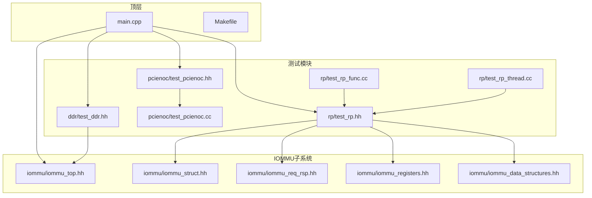
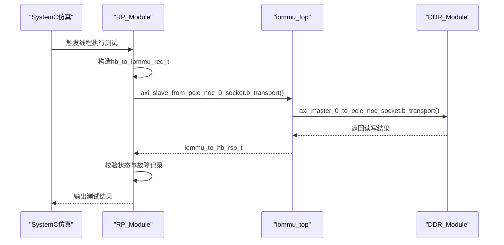
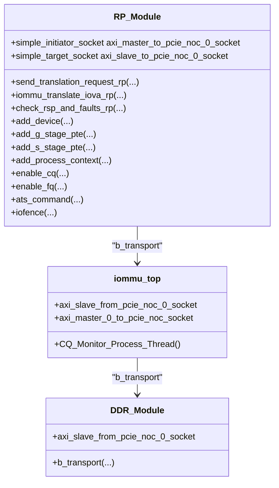
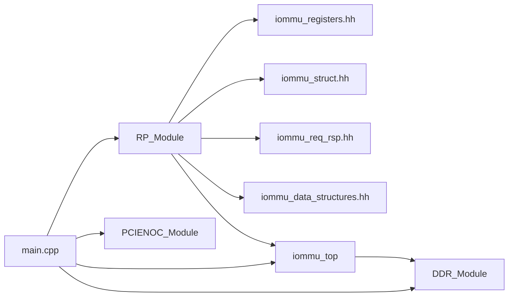

# 测试框架

<cite>
**本文引用的文件列表**
- [main.cpp](file://main.cpp)
- [Makefile](file://Makefile)
- [rp/test_rp.hh](file://rp/test_rp.hh)
- [rp/test_rp_func.cc](file://rp/test_rp_func.cc)
- [rp/test_rp_thread.cc](file://rp/test_rp_thread.cc)
- [pcienoc/test_pcienoc.hh](file://pcienoc/test_pcienoc.hh)
- [pcienoc/test_pcienoc.cc](file://pcienoc/test_pcienoc.cc)
- [ddr/test_ddr.hh](file://ddr/test_ddr.hh)
- [iommu/iommu_top.hh](file://iommu/iommu_top.hh)
- [iommu/iommu_struct.hh](file://iommu/iommu_struct.hh)
- [iommu/iommu_req_rsp.hh](file://iommu/iommu_req_rsp.hh)
- [iommu/iommu_registers.hh](file://iommu/iommu_registers.hh)
- [iommu/iommu_data_structures.hh](file://iommu/iommu_data_structures.hh)
</cite>

## 目录
1. [简介](#简介)
2. [项目结构](#项目结构)
3. [核心组件](#核心组件)
4. [架构总览](#架构总览)
5. [详细组件分析](#详细组件分析)
6. [依赖关系分析](#依赖关系分析)
7. [性能考量](#性能考量)
8. [故障排查指南](#故障排查指南)
9. [结论](#结论)
10. [附录](#附录)

## 简介
本测试框架围绕RISC-V IOMMU模型构建，重点覆盖以下方面：
- Root Complex（RP）测试模块：负责发起地址转换请求、配置IOMMU设备上下文、页表、命令队列与故障队列，并验证响应与故障记录。
- PCIe网络接口模块（PCIENOC）：作为PCIe侧接口的占位模块，当前实现为空，用于后续扩展。
- DDR内存模块：提供SystemC TLM 2.0目标端口，模拟物理内存读写与边界检查。
- 主程序与编译：通过SystemC仿真驱动RP线程执行测试序列，绑定各模块间Socket完成端口互联。

该框架采用SystemC/TLm进行时序建模，结合宏与工具函数实现测试用例的生成、请求构造、响应校验与故障记录核对，支持多设备、多级页表与不同地址翻译模式的组合测试。

## 项目结构
仓库采用按功能域分层组织：
- 根目录包含主程序入口与构建脚本
- iommu 子目录包含IOMMU核心实现与数据结构
- rp 子目录包含RP测试模块的头文件与实现
- pcienoc 子目录包含PCIENOC接口模块
- ddr 子目录包含DDR内存模拟模块

图表来源
- [main.cpp:38-87](file://main.cpp#L38-L87)
- [Makefile:29-50](file://Makefile#L29-L50)
- [rp/test_rp.hh:54-112](file://rp/test_rp.hh#L54-L112)
- [rp/test_rp_func.cc:1-100](file://rp/test_rp_func.cc#L1-L100)
- [rp/test_rp_thread.cc:60-372](file://rp/test_rp_thread.cc#L60-L372)
- [pcienoc/test_pcienoc.hh:10-21](file://pcienoc/test_pcienoc.hh#L10-L21)
- [pcienoc/test_pcienoc.cc:1-3](file://pcienoc/test_pcienoc.cc#L1-L3)
- [ddr/test_ddr.hh:15-96](file://ddr/test_ddr.hh#L15-L96)
- [iommu/iommu_top.hh:19-57](file://iommu/iommu_top.hh#L19-L57)
- [iommu/iommu_struct.hh:42-102](file://iommu/iommu_struct.hh#L42-L102)
- [iommu/iommu_req_rsp.hh:13-105](file://iommu/iommu_req_rsp.hh#L13-L105)
- [iommu/iommu_registers.hh:1-200](file://iommu/iommu_registers.hh#L1-L200)
- [iommu/iommu_data_structures.hh:1-200](file://iommu/iommu_data_structures.hh#L1-L200)

章节来源
- [main.cpp:38-87](file://main.cpp#L38-L87)
- [Makefile:29-50](file://Makefile#L29-L50)

## 核心组件
- RP_Module（RP测试模块）
  - 提供发送地址转换请求、读写内存、页表与设备上下文配置、命令队列与故障队列使能、ATS命令与无效化命令等接口
  - 通过SystemC线程驱动测试流程，封装TLM事务构造与IOMMU交互
- PCIENOC_Module（PCIENOC接口模块）
  - 当前为空实现，预留PCIe侧接口Socket
- DDR_Module（DDR内存模块）
  - 实现TLM b_transport，提供1MB模拟内存，支持读写与越界检测
- iommu_top（IOMMU顶层模块）
  - 提供多个initiator/target Socket，注册中断事件，绑定各子模块行为

章节来源
- [rp/test_rp.hh:54-112](file://rp/test_rp.hh#L54-L112)
- [rp/test_rp_func.cc:11-198](file://rp/test_rp_func.cc#L11-L198)
- [rp/test_rp_thread.cc:60-372](file://rp/test_rp_thread.cc#L60-L372)
- [pcienoc/test_pcienoc.hh:10-21](file://pcienoc/test_pcienoc.hh#L10-L21)
- [pcienoc/test_pcienoc.cc:1-3](file://pcienoc/test_pcienoc.cc#L1-L3)
- [ddr/test_ddr.hh:15-96](file://ddr/test_ddr.hh#L15-L96)
- [iommu/iommu_top.hh:19-57](file://iommu/iommu_top.hh#L19-L57)

## 架构总览
RP测试线程在SystemC仿真时间轴上周期性触发，构造请求参数，调用RP接口函数，通过TLm Socket与IOMMU交互，再读取寄存器与内存中的故障记录进行断言。DDR模块作为物理内存承载者，提供读写服务与边界保护。

图表来源
- [rp/test_rp_func.cc:28-78](file://rp/test_rp_func.cc#L28-L78)
- [rp/test_rp_func.cc:170-198](file://rp/test_rp_func.cc#L170-L198)
- [rp/test_rp_thread.cc:267-289](file://rp/test_rp_thread.cc#L267-L289)
- [ddr/test_ddr.hh:38-94](file://ddr/test_ddr.hh#L38-L94)
- [iommu/iommu_top.hh:22-28](file://iommu/iommu_top.hh#L22-L28)

## 详细组件分析

### RP测试模块（RP_Module）
- 功能职责
  - 请求生成：构造请求结构体，填充设备ID、进程ID、权限标志、地址类型、IOVA、长度与读写/AMO类型
  - 事务发送：通过TLm Socket发起b_transport，携带扩展载荷（如PID有效、特权请求、执行请求、地址类型等）
  - 响应与故障验证：读取IOMMU寄存器与内存中的故障队列，比对故障原因、设备ID、iotval、iotval2与TTYP
  - 设备与页表配置：添加设备上下文、进程上下文；根据模式建立G-stage/S-stage/PDT页表项；分配连续物理页
  - 命令队列/故障队列使能：配置队列基址与大小，等待就绪状态
  - ATS与无效化：发送ATS命令与无效化命令，刷新缓存
- 关键接口与流程
  - send_translation_request_rp：组装请求并调用iommu_translate_iova_rp
  - iommu_translate_iova_rp：构造TLm事务，设置命令、地址、长度与扩展，调用b_transport
  - check_rsp_and_faults_rp：根据请求类型推导期望TTYP，校验状态与故障记录
  - add_device/add_g_stage_pte/add_s_stage_pte/add_process_context：按模式建立页表与上下文
  - enable_cq/enable_fq：配置命令队列/故障队列并等待启用完成
- 多线程与并发
  - 使用SC_THREAD定义线程，内部通过wait进行时间推进
  - 通过全局变量与静态局部变量保存测试状态，注意多线程场景下的竞态风险
- 错误处理
  - 对TLm越界访问返回错误响应
  - 对故障队列空/满与记录不匹配进行失败判定
  - 对页表walk失败与无效PTE进行失败判定

图表来源
- [rp/test_rp.hh:54-112](file://rp/test_rp.hh#L54-L112)
- [rp/test_rp_func.cc:28-198](file://rp/test_rp_func.cc#L28-L198)
- [rp/test_rp_thread.cc:60-372](file://rp/test_rp_thread.cc#L60-L372)
- [iommu/iommu_top.hh:19-57](file://iommu/iommu_top.hh#L19-L57)
- [ddr/test_ddr.hh:15-96](file://ddr/test_ddr.hh#L15-L96)

章节来源
- [rp/test_rp.hh:54-112](file://rp/test_rp.hh#L54-L112)
- [rp/test_rp_func.cc:11-198](file://rp/test_rp_func.cc#L11-L198)
- [rp/test_rp_thread.cc:60-372](file://rp/test_rp_thread.cc#L60-L372)

### PCIe网络接口模块（PCIENOC_Module）
- 当前实现
  - 仅声明initiator socket，未实现b_transport处理
- 用途
  - 作为PCIe侧接口占位，便于后续扩展PCIe协议模拟与消息收发
- 建议
  - 在扩展时实现AHB/PCIe协议适配，支持ATS/PR/GPIn消息与MSI转发

章节来源
- [pcienoc/test_pcienoc.hh:10-21](file://pcienoc/test_pcienoc.hh#L10-L21)
- [pcienoc/test_pcienoc.cc:1-3](file://pcienoc/test_pcienoc.cc#L1-L3)

### DDR内存模块（DDR_Module）
- 功能
  - 提供TLM b_transport，支持读写事务与地址越界检测
  - 对DC（设备上下文）写入/读取进行额外日志输出
- 边界与健壮性
  - 越界访问返回地址错误响应
  - 读写数据前16字节打印，便于调试

章节来源
- [ddr/test_ddr.hh:15-96](file://ddr/test_ddr.hh#L15-L96)

### IOMMU顶层模块（iommu_top）
- 功能
  - 定义多个TLm Socket，注册b_transport回调
  - 提供命令队列监控线程与事件敏感机制
- 与测试交互
  - RP通过Socket发起请求，IOMMU在b_transport中完成地址翻译与响应生成

章节来源
- [iommu/iommu_top.hh:19-57](file://iommu/iommu_top.hh#L19-L57)

### 请求/响应与寄存器/数据结构
- 请求/响应
  - 请求结构体包含设备ID、进程ID、权限标志、地址类型、IOVA、长度与读写/AMO类型
  - 响应结构体包含状态码与翻译结果字段（PPN、属性、是否MSI等）
- 寄存器与数据结构
  - 寄存器偏移与CSR字段定义，用于队列使能、故障记录与能力查询
  - 设备上下文、进程上下文、页表项（G/S/PDT）等数据结构

章节来源
- [iommu/iommu_req_rsp.hh:13-105](file://iommu/iommu_req_rsp.hh#L13-L105)
- [iommu/iommu_registers.hh:1-200](file://iommu/iommu_registers.hh#L1-L200)
- [iommu/iommu_data_structures.hh:1-200](file://iommu/iommu_data_structures.hh#L1-L200)

## 依赖关系分析
- 模块耦合
  - RP_Module依赖IOMMU数据结构与寄存器定义，通过TLm Socket与IOMMU交互
  - IOMMU与DDR通过Socket连接，形成“RP/PCIENOC -> IOMMU -> DDR”的链路
- 外部依赖
  - SystemC/TLm运行时
  - 编译器与链接器（pthread、m）

图表来源
- [rp/test_rp.hh:8-11](file://rp/test_rp.hh#L8-L11)
- [rp/test_rp_func.cc:1-6](file://rp/test_rp_func.cc#L1-L6)
- [rp/test_rp_thread.cc:1-5](file://rp/test_rp_thread.cc#L1-L5)
- [iommu/iommu_struct.hh:26-37](file://iommu/iommu_struct.hh#L26-L37)
- [iommu/iommu_req_rsp.hh:36-102](file://iommu/iommu_req_rsp.hh#L36-L102)
- [iommu/iommu_registers.hh:1-200](file://iommu/iommu_registers.hh#L1-L200)
- [iommu/iommu_data_structures.hh:1-200](file://iommu/iommu_data_structures.hh#L1-L200)
- [main.cpp:9-12](file://main.cpp#L9-L12)

章节来源
- [main.cpp:9-12](file://main.cpp#L9-L12)
- [rp/test_rp.hh:8-11](file://rp/test_rp.hh#L8-L11)

## 性能考量
- 仿真时间推进
  - 线程内使用wait进行时间推进，避免忙轮询
- 访问模式
  - 读写内存与寄存器采用顺序访问，建议在大规模测试中合并事务以减少Socket往返
- 日志输出
  - 大量printf会降低仿真速度，建议在性能测试时关闭或减少日志级别

## 故障排查指南
- 常见问题
  - TLm地址越界：检查IOVA与长度是否超过模拟内存大小
  - 故障队列为空/记录不匹配：确认IOMMU已启用且队列配置正确
  - 页表walk失败：检查设备上下文与页表根PPN配置
- 排查步骤
  - 启用调试宏，观察RP/IOMMU/DDR日志
  - 核对寄存器CSR状态（队列使能、busy位）
  - 验证页表项V位与PPN有效性
  - 使用最小化用例定位问题

章节来源
- [ddr/test_ddr.hh:44-49](file://ddr/test_ddr.hh#L44-L49)
- [rp/test_rp_func.cc:81-121](file://rp/test_rp_func.cc#L81-L121)
- [rp/test_rp_thread.cc:115-127](file://rp/test_rp_thread.cc#L115-L127)

## 结论
该测试框架通过SystemC/TLm实现了RP侧地址转换请求的完整闭环测试，覆盖多设备、多级页表与不同地址翻译模式。PCIENOC模块作为接口占位，为后续PCIe协议模拟奠定基础。建议在扩展PCIe消息处理的同时，完善多线程同步与并发控制，提升测试稳定性与可维护性。

## 附录

### 测试用例设计原则
- 功能测试用例
  - 覆盖不同地址类型（未翻译、已翻译、ATS请求）、读写/AMO、权限与执行标志
  - 验证成功路径与典型故障路径（如Unsupported Request、Completer Abort）
- 边界条件测试
  - 越界访问、页表根PPN越界、无效PTE、空故障队列
- 性能测试方案
  - 批量事务吞吐、队列深度与延迟测量、页表命中率统计

### 多线程测试实现要点
- 线程同步
  - 使用wait进行时间推进，避免竞争条件
  - 对共享状态（如全局变量）进行加锁或避免共享
- 并发控制
  - 控制事务并发度，避免TLm端口拥塞
- 稳定性保证
  - 逐步增加复杂度，先验证单设备/单模式，再扩展至多设备/多模式组合

### 测试自动化与持续集成
- 自动化
  - 使用Makefile统一编译与链接，确保依赖一致
  - 在CI中固定SystemC版本与编译选项
- 回归测试
  - 将RP线程中的多设备/多模式组合作为回归用例
  - 对关键路径（页表walk、故障记录、队列使能）进行回归