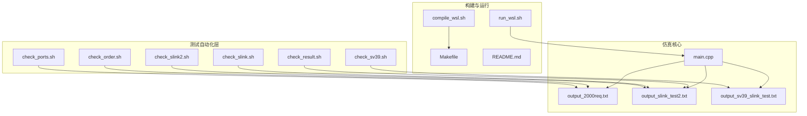
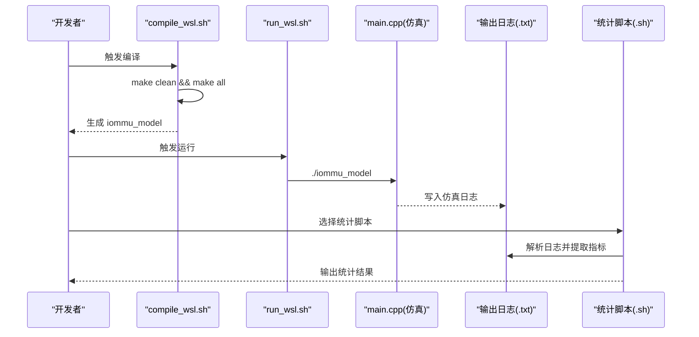
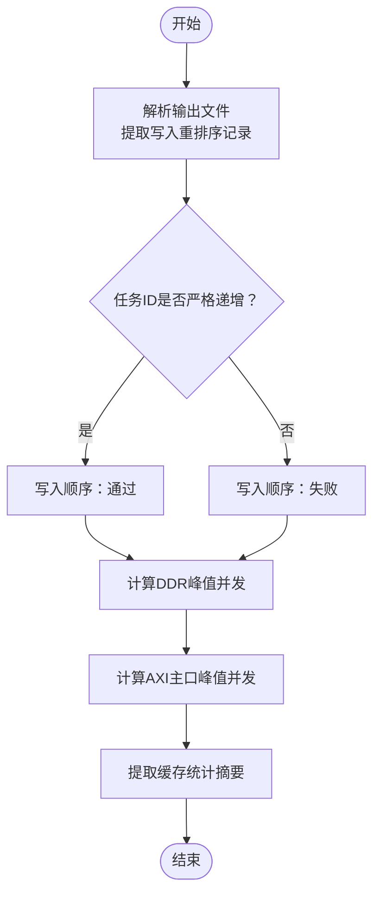
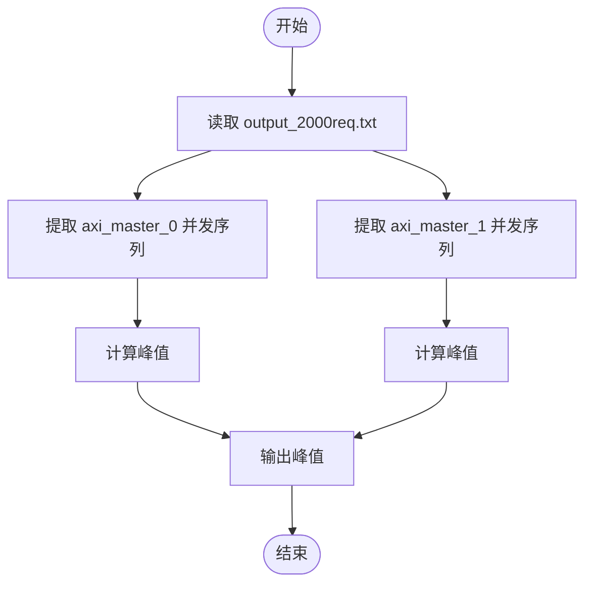
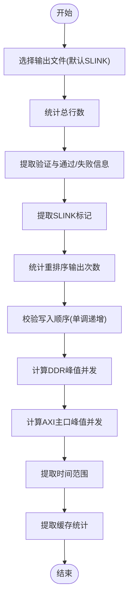
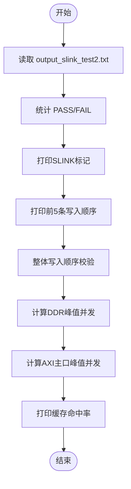
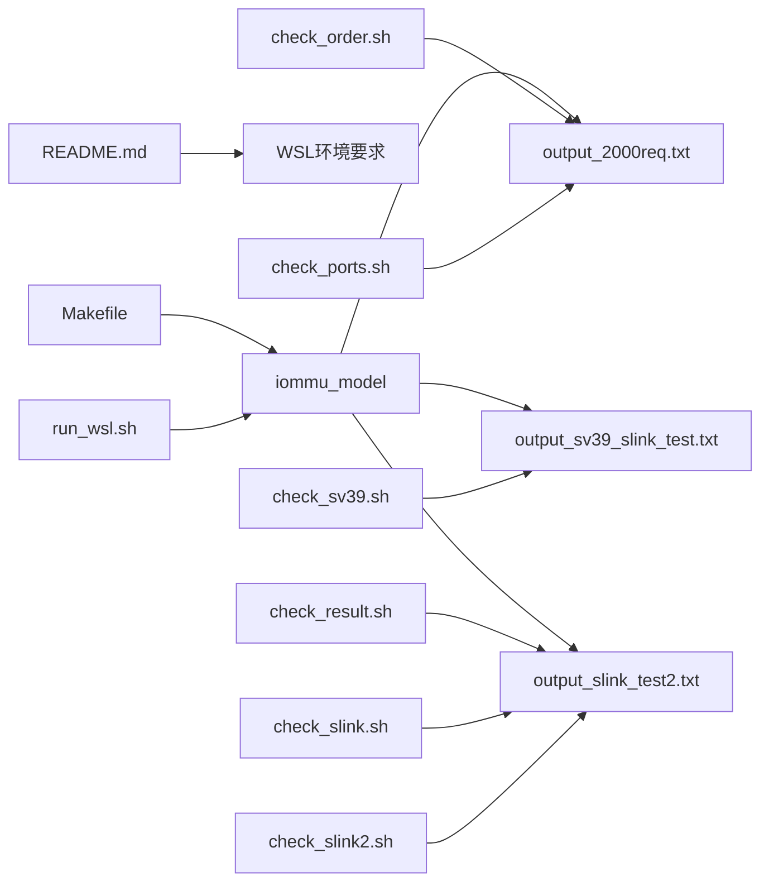

# 测试自动化工具

<cite>
**本文引用的文件**
- [check_order.sh](file://check_order.sh)
- [check_ports.sh](file://check_ports.sh)
- [check_result.sh](file://check_result.sh)
- [check_slink.sh](file://check_slink.sh)
- [check_slink2.sh](file://check_slink2.sh)
- [check_sv39.sh](file://check_sv39.sh)
- [run_wsl.sh](file://run_wsl.sh)
- [compile_wsl.sh](file://compile_wsl.sh)
- [Makefile](file://Makefile)
- [README.md](file://README.md)
- [main.cpp](file://main.cpp)
- [output_2000req.txt](file://output_2000req.txt)
- [output_slink_test2.txt](file://output_slink_test2.txt)
- [output_sv39_slink_test.txt](file://output_sv39_slink_test.txt)
</cite>

## 目录
1. [简介](#简介)
2. [项目结构](#项目结构)
3. [核心组件](#核心组件)
4. [架构总览](#架构总览)
5. [详细组件分析](#详细组件分析)
6. [依赖关系分析](#依赖关系分析)
7. [性能考量](#性能考量)
8. [故障排除指南](#故障排除指南)
9. [结论](#结论)
10. [附录](#附录)

## 简介
本文件面向RISC-V IOMMU项目的测试自动化工具，系统性梳理与说明四类Shell脚本测试工具的设计目标、输入输出、参数配置与使用场景，并给出自动化测试流程、批量执行与结果汇总方法。同时覆盖测试环境自动配置、测试数据生成与报告生成的建议方案，以及工具定制化与扩展开发指南及常见问题排查技巧。

## 项目结构
本项目采用SystemC仿真框架，测试自动化围绕以下关键文件与输出展开：
- 编译与运行脚本：compile_wsl.sh、run_wsl.sh
- 测试统计脚本：check_order.sh、check_ports.sh、check_result.sh、check_slink.sh、check_slink2.sh、check_sv39.sh
- 构建配置：Makefile
- 仿真入口与模块绑定：main.cpp
- 示例输出日志：output_2000req.txt、output_slink_test2.txt、output_sv39_slink_test.txt

**图示来源**
- [compile_wsl.sh:1-15](file://compile_wsl.sh#L1-L15)
- [run_wsl.sh:1-16](file://run_wsl.sh#L1-L16)
- [Makefile:1-132](file://Makefile#L1-L132)
- [README.md:1-92](file://README.md#L1-L92)
- [main.cpp:1-94](file://main.cpp#L1-L94)
- [output_2000req.txt:1-200](file://output_2000req.txt#L1-L200)
- [output_slink_test2.txt:1-200](file://output_slink_test2.txt#L1-L200)
- [output_sv39_slink_test.txt:1-200](file://output_sv39_slink_test.txt#L1-L200)

**章节来源**
- [README.md:1-92](file://README.md#L1-L92)
- [Makefile:1-132](file://Makefile#L1-L132)
- [main.cpp:1-94](file://main.cpp#L1-L94)

## 核心组件
本节对四个核心测试脚本进行功能与参数说明，帮助快速定位适用场景与输出解读。

- check_order.sh
  - 功能：顺序验证与并发统计
  - 输入：可选参数为输出文件名，默认读取 output_2000req.txt
  - 输出：写入顺序检查、DDR并发峰值、AXI主口并发峰值、缓存命中率摘要
  - 适用场景：验证写入顺序单调递增、评估NoC与DDR链路并发压力、查看缓存命中情况

- check_ports.sh
  - 功能：端口并发峰值统计
  - 输入：固定读取 output_2000req.txt
  - 输出：axi_master_0（PCIe NoC）与 axi_master_1（DDR CMN）的峰值并发
  - 适用场景：快速评估两条主口链路的并发上限

- check_result.sh
  - 功能：通用结果验证与统计
  - 输入：可选参数为输出文件名，默认读取 output_slink_peq_test.txt
  - 输出：文件行数、验证通过/失败计数、SLINK标记、重排序计数、写入顺序校验、DDR峰值并发、AXI主口峰值、时间范围、缓存统计
  - 适用场景：综合评估SLINK路径测试结果与性能指标

- check_slink.sh
  - 功能：SLINK路径测试结果统计
  - 输入：固定读取 output_slink_test2.txt
  - 输出：PASS/FAIL计数、SLINK标记、前五条写入顺序、整体写入顺序校验、DDR峰值并发、AXI主口峰值、缓存命中率
  - 适用场景：SLINK路径专项验证与性能汇总

- check_slink2.sh
  - 功能：SLINK路径测试辅助统计
  - 输入：固定读取 output_slink_test2.txt
  - 输出：总行数、包含“PASS/FAIL”的行号、重排序输出次数、RP请求发送次数、任务完成次数、最后若干行、时间范围与响应时间
  - 适用场景：辅助定位测试结束状态、统计关键事件发生频次

- check_sv39.sh
  - 功能：SV39路径测试结果验证
  - 输入：固定读取 output_sv39_slink_test.txt
  - 输出：验证信息、重排序计数、写入顺序校验
  - 适用场景：SV39地址转换路径专项验证

**章节来源**
- [check_order.sh:1-30](file://check_order.sh#L1-L30)
- [check_ports.sh:1-13](file://check_ports.sh#L1-L13)
- [check_result.sh:1-41](file://check_result.sh#L1-L41)
- [check_slink.sh:1-35](file://check_slink.sh#L1-L35)
- [check_slink2.sh:1-32](file://check_slink2.sh#L1-L32)
- [check_sv39.sh:1-14](file://check_sv39.sh#L1-L14)

## 架构总览
下图展示测试自动化工具在系统中的位置与交互关系：构建与运行脚本负责生成可执行文件并驱动仿真；仿真输出作为各统计脚本的输入；统计脚本汇总关键指标形成报告。

**图示来源**
- [compile_wsl.sh:1-15](file://compile_wsl.sh#L1-L15)
- [run_wsl.sh:1-16](file://run_wsl.sh#L1-L16)
- [Makefile:1-132](file://Makefile#L1-L132)
- [main.cpp:1-94](file://main.cpp#L1-L94)
- [output_2000req.txt:1-200](file://output_2000req.txt#L1-L200)
- [output_slink_test2.txt:1-200](file://output_slink_test2.txt#L1-L200)
- [output_sv39_slink_test.txt:1-200](file://output_sv39_slink_test.txt#L1-L200)

## 详细组件分析

### check_order.sh：顺序验证与并发统计
- 设计要点
  - 顺序验证：从日志中提取写入重排序记录，按任务ID判断是否严格单调递增
  - 并发统计：解析DDR调度与AXI主口并发字段，计算峰值未完成事务数
  - 缓存统计：提取缓存统计摘要行，便于对比不同配置的命中率
- 参数与用法
  - 位置：脚本第一行定义默认输出文件名，支持外部传参覆盖
  - 建议：在批量测试时统一命名输出文件，便于脚本自动识别
- 输出解读
  - 写入顺序：通过“严格单调递增”或“顺序破坏”提示判断
  - 并发峰值：分别给出PCIe NoC与DDR CMN链路的峰值并发
  - 缓存命中：结合历史日志对比不同策略的命中率变化

**图示来源**
- [check_order.sh:1-30](file://check_order.sh#L1-L30)
- [output_2000req.txt:1-200](file://output_2000req.txt#L1-L200)

**章节来源**
- [check_order.sh:1-30](file://check_order.sh#L1-L30)

### check_ports.sh：端口并发峰值检查
- 设计要点
  - 固定读取 output_2000req.txt
  - 分别统计 axi_master_0（PCIe NoC）与 axi_master_1（DDR CMN）的峰值并发
- 参数与用法
  - 无需参数，直接运行即可
- 输出解读
  - 两条主口的峰值并发值可用于评估NoC带宽与DDR控制器负载

**图示来源**
- [check_ports.sh:1-13](file://check_ports.sh#L1-L13)
- [output_2000req.txt:1-200](file://output_2000req.txt#L1-L200)

**章节来源**
- [check_ports.sh:1-13](file://check_ports.sh#L1-L13)

### check_result.sh：通用结果验证与统计
- 设计要点
  - 统一入口：支持传参指定输出文件，默认读取 SLINK 相关测试输出
  - 多维度统计：验证通过/失败、SLINK标记、重排序计数、写入顺序、DDR与AXI主口峰值、时间范围、缓存统计
- 参数与用法
  - 可选参数：输出文件名
  - 建议：在批量测试中为不同场景命名输出文件，便于脚本自动识别
- 输出解读
  - 验证结果：快速定位测试是否通过
  - 性能指标：结合峰值并发与缓存命中率评估系统性能

**图示来源**
- [check_result.sh:1-41](file://check_result.sh#L1-L41)
- [output_slink_test2.txt:1-200](file://output_slink_test2.txt#L1-L200)

**章节来源**
- [check_result.sh:1-41](file://check_result.sh#L1-L41)

### check_slink.sh：SLINK路径测试统计
- 设计要点
  - 固定读取 output_slink_test2.txt
  - 统计 PASS/FAIL 数量、SLINK 标记、写入顺序前五条、整体顺序校验、DDR与AXI主口峰值、缓存命中率
- 参数与用法
  - 无需参数，直接运行
- 输出解读
  - 适合SLINK路径专项验证，快速判断整体通过率与关键性能指标

**图示来源**
- [check_slink.sh:1-35](file://check_slink.sh#L1-L35)
- [output_slink_test2.txt:1-200](file://output_slink_test2.txt#L1-L200)

**章节来源**
- [check_slink.sh:1-35](file://check_slink.sh#L1-L35)

### check_slink2.sh：SLINK路径辅助统计
- 设计要点
  - 提供更细粒度的统计项：总行数、包含“PASS/FAIL”的行号、重排序输出次数、RP请求发送次数、任务完成次数、最后若干行、时间范围与响应时间
- 参数与用法
  - 无需参数，直接运行
- 输出解读
  - 适合定位测试结束状态、统计关键事件发生频次，辅助分析测试完整性

**章节来源**
- [check_slink2.sh:1-32](file://check_slink2.sh#L1-L32)

### check_sv39.sh：SV39路径测试验证
- 设计要点
  - 固定读取 output_sv39_slink_test.txt
  - 统计验证信息、重排序计数、写入顺序校验
- 参数与用法
  - 无需参数，直接运行
- 输出解读
  - 适合SV39地址转换路径专项验证

**章节来源**
- [check_sv39.sh:1-14](file://check_sv39.sh#L1-L14)

## 依赖关系分析
- 构建与运行
  - compile_wsl.sh 依赖 Makefile 的编译规则，生成 iommu_model
  - run_wsl.sh 依赖 main.cpp 的仿真入口，驱动系统级连接与仿真
- 日志与统计
  - 各统计脚本均以输出日志为输入，解析特定关键字与数值字段
  - 不同脚本针对不同测试场景的日志格式进行适配

**图示来源**
- [Makefile:1-132](file://Makefile#L1-L132)
- [README.md:1-92](file://README.md#L1-L92)
- [run_wsl.sh:1-16](file://run_wsl.sh#L1-L16)
- [main.cpp:1-94](file://main.cpp#L1-L94)
- [output_2000req.txt:1-200](file://output_2000req.txt#L1-L200)
- [output_slink_test2.txt:1-200](file://output_slink_test2.txt#L1-L200)
- [output_sv39_slink_test.txt:1-200](file://output_sv39_slink_test.txt#L1-L200)

**章节来源**
- [Makefile:1-132](file://Makefile#L1-L132)
- [README.md:1-92](file://README.md#L1-L92)
- [run_wsl.sh:1-16](file://run_wsl.sh#L1-L16)
- [main.cpp:1-94](file://main.cpp#L1-L94)

## 性能考量
- 日志规模与解析效率
  - 输出日志通常较大，建议在批量测试时按场景命名文件，避免跨场景解析带来的额外开销
- 关键字段提取策略
  - 使用正则与流式处理（grep/awk/sed）可显著降低内存占用
- 并发与带宽评估
  - axi_master_0（PCIe NoC）与 axi_master_1（DDR CMN）的峰值并发可作为链路瓶颈的指示器
- 缓存命中率
  - 结合不同配置的历史日志对比，有助于评估缓存策略的有效性

## 故障排除指南
- 环境与依赖
  - 必须在WSL环境中编译与运行，确保SystemC库与编译器可用
  - 若编译失败，检查Makefile中的SystemC路径与编译选项
- 可执行文件缺失
  - run_wsl.sh 会在找不到 iommu_model 时提示先执行编译
- 日志文件缺失
  - 统计脚本默认读取固定文件名，若测试未生成对应日志，需确认仿真是否正常结束
- 输出格式不匹配
  - 不同测试场景的日志格式存在差异，应选择与之对应的统计脚本，避免误读

**章节来源**
- [README.md:1-92](file://README.md#L1-L92)
- [run_wsl.sh:1-16](file://run_wsl.sh#L1-L16)
- [Makefile:1-132](file://Makefile#L1-L132)

## 结论
本测试自动化工具通过一组轻量Shell脚本，实现了对RISC-V IOMMU仿真输出的高效解析与统计。check_order.sh与check_ports.sh适用于基础顺序与端口并发验证；check_result.sh、check_slink.sh与check_sv39.sh提供面向不同测试场景的综合统计；check_slink2.sh补充了辅助统计能力。配合compile_wsl.sh与run_wsl.sh，可形成从编译、运行到统计的完整自动化闭环。

## 附录

### 自动化测试流程与批量执行建议
- 流程设计
  - 编译阶段：调用 compile_wsl.sh 生成 iommu_model
  - 运行阶段：调用 run_wsl.sh 生成输出日志
  - 统计阶段：按场景选择对应统计脚本，汇总关键指标
- 批量执行
  - 将不同测试场景的日志文件命名规范化（如以测试类型+参数命名），统计脚本可据此自动识别
  - 使用循环遍历日志文件，逐个执行统计脚本并合并输出
- 结果汇总
  - 将各脚本输出重定向至统一报告文件，或导出为表格/图表便于对比

### 测试环境自动配置
- 环境要求
  - WSL2 + Ubuntu + SystemC + GCC/G++ + GNU Make
  - README.md 中提供了编译与运行的步骤说明
- 脚本前置检查
  - run_wsl.sh 与 compile_wsl.sh 已内置基本的文件与依赖检查，建议沿用

**章节来源**
- [README.md:1-92](file://README.md#L1-L92)
- [compile_wsl.sh:1-15](file://compile_wsl.sh#L1-L15)
- [run_wsl.sh:1-16](file://run_wsl.sh#L1-L16)