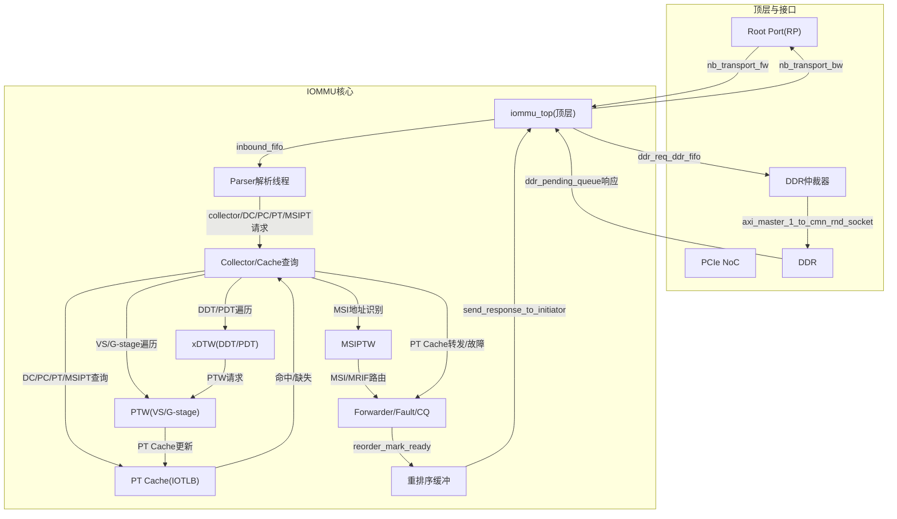
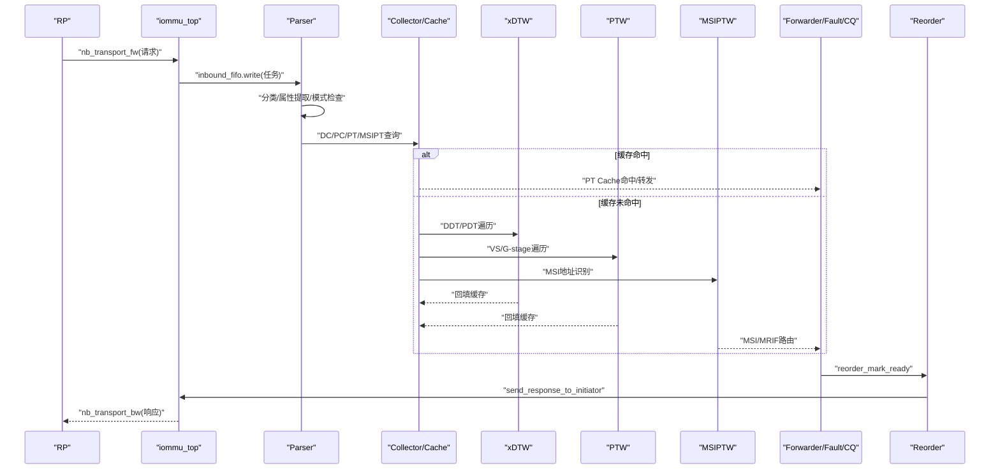
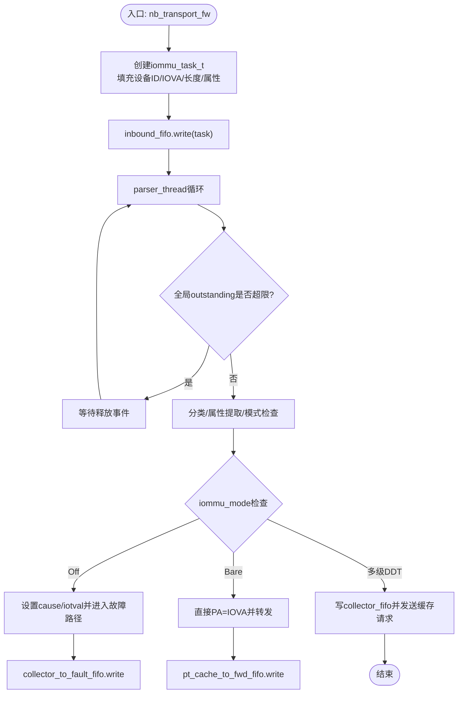
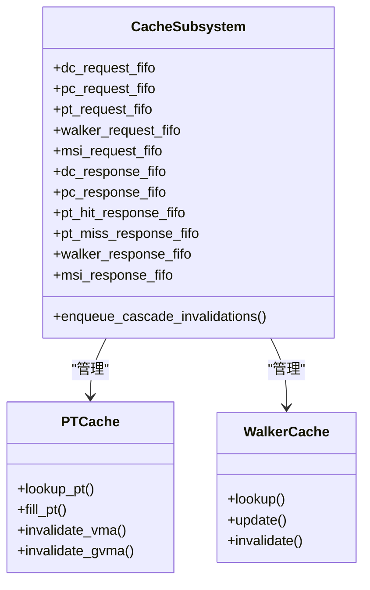
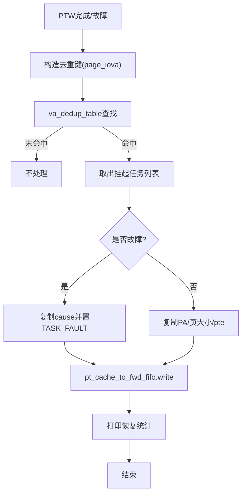
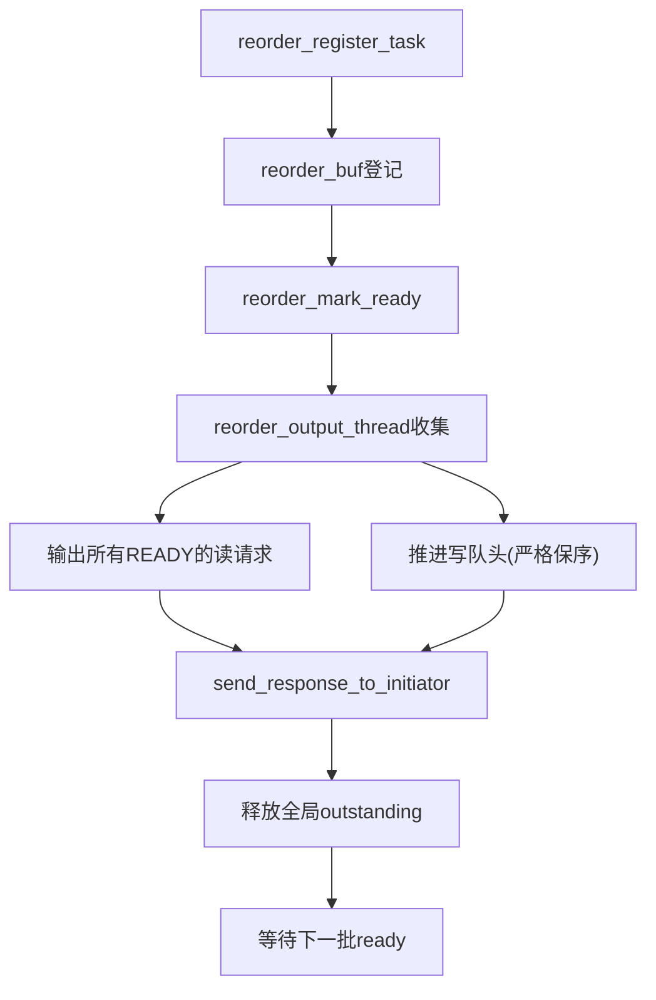
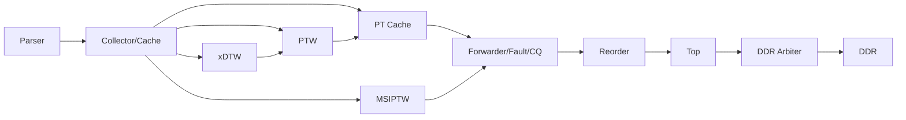

# 数据流架构设计

<cite>
**本文引用的文件**
- [README.md](file://README.md)
- [iommu_top.cc](file://iommu/iommu_top.cc)
- [iommu_task.hh](file://iommu/include/iommu_task.hh)
- [iommu_data_structures.hh](file://iommu/include/iommu_data_structures.hh)
- [iommu_perf_parser.cc](file://iommu/iommu_perf_model/iommu_perf_parser.cc)
- [iommu_perf_model.hh](file://iommu/iommu_perf_model/iommu_perf_model.hh)
- [iommu_perf_reorder.cc](file://iommu/iommu_perf_model/iommu_perf_reorder.cc)
- [iommu_perf_forwarder_fault_cq.cc](file://iommu/iommu_perf_model/iommu_perf_forwarder_fault_cq.cc)
- [cache_subsystem.h](file://iommu/cache_src/subsystem/cache_subsystem.h)
- [pt_cache.h](file://iommu/cache_src/cache/pt_cache.h)
- [iommu_perf_params.hh](file://iommu/iommu_perf_model/iommu_perf_params.hh)
</cite>

## 目录
1. [引言](#引言)
2. [项目结构](#项目结构)
3. [核心组件](#核心组件)
4. [架构总览](#架构总览)
5. [详细组件分析](#详细组件分析)
6. [依赖关系分析](#依赖关系分析)
7. [性能考量](#性能考量)
8. [故障排查指南](#故障排查指南)
9. [结论](#结论)
10. [附录](#附录)

## 引言
本文件面向RISC-V IOMMU数据流架构，系统性阐述从设备请求到最终响应的完整数据流路径与处理过程。重点覆盖Parser解析、缓存查询、地址转换、数据转发、VA去重、重排序缓冲、同步与异步机制，并对关键数据结构（如iommu_task_t、ddr_req_entry_t等）进行文档化说明。同时提供性能分析与优化策略，帮助读者理解流水线深度、缓冲区大小等参数的调优要点。

## 项目结构
该项目采用SystemC建模，IOMMU核心位于iommu目录，包含功能模型与性能模型两套实现；顶层模块负责端口回调、仲裁与重排序；缓存子系统提供DC/PC/PT/MSIPT/Walker等多级缓存与失效流水线；性能模型通过线程化管道模拟真实流水线行为。

图表来源
- [iommu_top.cc:127-190](file://iommu/iommu_top.cc#L127-L190)
- [iommu_perf_parser.cc:9-121](file://iommu/iommu_perf_model/iommu_perf_parser.cc#L9-L121)
- [cache_subsystem.h:34-65](file://iommu/cache_src/subsystem/cache_subsystem.h#L34-L65)

章节来源
- [README.md:1-92](file://README.md#L1-L92)
- [iommu_top.cc:127-190](file://iommu/iommu_top.cc#L127-L190)

## 核心组件
- 顶层模块：负责端口回调、任务创建、DDR仲裁、重排序输出、统计打印等。
- Parser线程：解析设备请求，分类事务类型，提取访问属性，检查模式合法性，分发到Collector与缓存查询。
- Collector/缓存子系统：协调DC/PC/PT/MSIPT/Walker缓存查询与更新，驱动Walker遍历页表。
- Walker(XDTW/PTW/MSIPTW)：执行DDT/PDT/VS/G-stage/MSI页表遍历，读写内存，回填缓存。
- Forwarder/Fault/CQ：生成响应、处理故障、向RP或IMSIC/MRIF转发。
- 重排序缓冲：按写保序、读乱序策略输出响应，维护全局outstanding控制。

章节来源
- [iommu_top.cc:1-583](file://iommu/iommu_top.cc#L1-L583)
- [cache_subsystem.h:1-161](file://iommu/cache_src/subsystem/cache_subsystem.h#L1-L161)

## 架构总览
IOMMU数据流遵循“入口解析—上下文查询—页表遍历—缓存回填—转发/故障—重排序输出”的主干流程。Parser在入口处完成基本分类与合法性检查；随后通过缓存子系统进行上下文与页表缓存查询；若缓存未命中，则由Walker发起内存访问；最终由Forwarder/Fault/CQ生成响应并通过重排序缓冲保证有序输出。

图表来源
- [iommu_perf_parser.cc:9-121](file://iommu/iommu_perf_model/iommu_perf_parser.cc#L9-L121)
- [iommu_top.cc:417-443](file://iommu/iommu_top.cc#L417-L443)
- [iommu_perf_forwarder_fault_cq.cc:13-53](file://iommu/iommu_perf_model/iommu_perf_forwarder_fault_cq.cc#L13-L53)

## 详细组件分析

### Parser解析与路由
- 入口反压：当全局outstanding达到上限时等待释放事件。
- 任务创建：从nb_transport_fw提取PayloadExtension，填充iommu_task_t并写入inbound_fifo。
- 解析步骤：分类事务类型、提取访问属性、检查iommu_mode(Bare/Off/多级DDT)、提取DDI、合法性校验。
- 分发：写入collector_fifo，并向缓存子系统发送DC/PC/PT/MSIPT请求。

图表来源
- [iommu_top.cc:127-190](file://iommu/iommu_top.cc#L127-L190)
- [iommu_perf_parser.cc:9-121](file://iommu/iommu_perf_model/iommu_perf_parser.cc#L9-L121)

章节来源
- [iommu_top.cc:127-190](file://iommu/iommu_top.cc#L127-L190)
- [iommu_perf_parser.cc:9-121](file://iommu/iommu_perf_model/iommu_perf_parser.cc#L9-L121)

### 缓存子系统与Walker
- 缓存子系统对外提供多路请求/响应FIFO，分别对应DC/PC/PT/MSIPT/Walker，避免串行化瓶颈。
- PT Cache作为IOTLB，支持按gscid/pscid/IOVA查询与失效；Walker Cache支持轮询调度。
- Walker(XDTW/PTW/MSIPTW)负责遍历页表，读取PTE，必要时更新A/D位，并回填缓存。

图表来源
- [cache_subsystem.h:18-81](file://iommu/cache_src/subsystem/cache_subsystem.h#L18-L81)
- [pt_cache.h:8-54](file://iommu/cache_src/cache/pt_cache.h#L8-L54)

章节来源
- [cache_subsystem.h:1-161](file://iommu/cache_src/subsystem/cache_subsystem.h#L1-L161)
- [pt_cache.h:1-59](file://iommu/cache_src/cache/pt_cache.h#L1-L59)

### VA去重表与批量恢复
- VA去重表以(gscid, pscid, 页基址)为键，记录同一页面的挂起任务集合。
- PT Cache命中时若发现去重命中，直接复制翻译结果并批量转发，避免重复PTW。
- PTW完成后，按页粒度恢复挂起任务，复制PA/页大小/pte等字段，再写入pt_cache_to_fwd_fifo。

图表来源
- [iommu_top.cc:465-517](file://iommu/iommu_top.cc#L465-L517)

章节来源
- [iommu_top.cc:465-517](file://iommu/iommu_top.cc#L465-L517)

### 重排序缓冲与有序输出
- 入口注册：parser_thread在inbound_fifo读取任务后，将其登记到reorder_buf，写请求按到达顺序入队。
- 标记就绪：Forwarder/Fault/CQ线程调用reorder_mark_ready，将任务标记为ready。
- 输出策略：读请求可乱序输出；写请求严格按队头保序输出；每输出一次释放全局outstanding。
- 并发控制：出口端口与DDR仲裁均有限流，防止拥塞。

图表来源
- [iommu_perf_reorder.cc:18-183](file://iommu/iommu_perf_model/iommu_perf_reorder.cc#L18-L183)

章节来源
- [iommu_perf_reorder.cc:18-183](file://iommu/iommu_perf_model/iommu_perf_reorder.cc#L18-L183)

### 关键数据结构与传递
- iommu_task_t：承载任务全生命周期状态，包含身份字段（设备ID、进程ID、IOVA、长度、访问类型）、分类字段（TTYP、读写执行权限）、上下文字段（DC/PC/iosatp/iohgatp/PSCV/GV等）、翻译结果字段（PA/GPA/页大小/pte/故障原因等）、管道状态与Walker上下文等。
- ddr_req_entry_t：描述一次DDR请求，包含task_id、目标地址、大小、是否写以及写数据缓冲。
- collector_entry_t：用于Collector侧的任务聚合状态跟踪。
- walk_context_t：Walker遍历过程的上下文，包括遍历类型、阶段、层级、索引、读地址/大小、中间PPN缓存等。

章节来源
- [iommu_task.hh:120-212](file://iommu/include/iommu_task.hh#L120-L212)
- [iommu_task.hh:226-261](file://iommu/include/iommu_task.hh#L226-L261)
- [iommu_task.hh:75-118](file://iommu/include/iommu_task.hh#L75-L118)

### 故障处理与命令队列
- Forwarder/Fault/CQ线程负责将故障上报至IOMMU内部故障记录，并依据ATS/非ATS与故障码生成相应响应状态。
- 命令队列与无效化控制在顶层模块中维护，支持全局/地址范围/上下文粒度的失效。

章节来源
- [iommu_perf_forwarder_fault_cq.cc:121-178](file://iommu/iommu_perf_model/iommu_perf_forwarder_fault_cq.cc#L121-L178)
- [iommu_top.cc:40-38](file://iommu/iommu_top.cc#L40-L38)

## 依赖关系分析
- 顶层模块依赖缓存子系统与Walker模块，通过FIFO进行解耦。
- Parser依赖性能模型辅助函数（分类、VPN提取、MSI判断等）。
- Forwarder/Fault/CQ依赖重排序模块与顶层响应发送接口。
- DDR仲裁器聚合来自各Walker与控制路径的请求，统一调度到AXI主口。

图表来源
- [iommu_perf_parser.cc:9-121](file://iommu/iommu_perf_model/iommu_perf_parser.cc#L9-L121)
- [cache_subsystem.h:34-65](file://iommu/cache_src/subsystem/cache_subsystem.h#L34-L65)
- [iommu_perf_forwarder_fault_cq.cc:13-53](file://iommu/iommu_perf_model/iommu_perf_forwarder_fault_cq.cc#L13-L53)
- [iommu_top.cc:267-389](file://iommu/iommu_top.cc#L267-L389)

章节来源
- [iommu_perf_parser.cc:9-121](file://iommu/iommu_perf_model/iommu_perf_parser.cc#L9-L121)
- [cache_subsystem.h:1-161](file://iommu/cache_src/subsystem/cache_subsystem.h#L1-L161)
- [iommu_perf_forwarder_fault_cq.cc:13-53](file://iommu/iommu_perf_model/iommu_perf_forwarder_fault_cq.cc#L13-L53)
- [iommu_top.cc:267-389](file://iommu/iommu_top.cc#L267-L389)

## 性能考量
- 流水线深度与延迟
  - Parser/Collector/Cache命中延迟、Walker每次访问延迟、Forwarder延迟等参数可在性能参数文件中调整。
  - FIFO深度直接影响背压与吞吐，需结合outstanding上限与端口带宽综合评估。
- 缓冲区大小
  - DDR相关FIFO深度较大（如PTW请求/响应、PT Cache转发等），以匹配高并发与长尾延迟。
  - 入站FIFO与重排序FIFO较小，有助于限制全局outstanding与内存占用。
- 并发与限流
  - 全局outstanding上限与端口并发上限共同决定系统峰值吞吐与稳定性。
  - DDR仲裁采用优先级与轮询策略，兼顾控制路径与数据路径。
- VA去重与Walker Cache
  - 启用VA去重可显著减少重复PTW任务；Walker Cache可降低高频页表访问延迟。
- 参数调优建议
  - 高并发读场景：适当增大读请求重排序队列与端口带宽，降低Forwarder延迟。
  - 高并发写场景：严格保序输出，适度提升写队列容量与端口并发上限。
  - 长尾延迟敏感：提高PT Cache/Walker Cache容量与关联度，降低miss率。

章节来源
- [iommu_perf_params.hh:1-160](file://iommu/iommu_perf_model/iommu_perf_params.hh#L1-L160)

## 故障排查指南
- 常见故障类型
  - iommu_mode=Off：所有入站事务禁止，直接进入故障路径。
  - Bare模式下出现Translated/ATS：非法组合，触发故障。
  - DDI宽度不匹配：根据当前DDT模式校验DDI高位，不合法则故障。
- 调试要点
  - 观察Parser输出日志，确认事务分类与属性提取是否正确。
  - 检查Collector到Cache的请求/响应FIFO是否阻塞，定位瓶颈。
  - 关注DDR仲裁器与端口并发事件，排查背压与拥塞。
  - 使用统计打印查看VA去重命中率与IOPS，评估优化效果。

章节来源
- [iommu_perf_parser.cc:31-98](file://iommu/iommu_perf_model/iommu_perf_parser.cc#L31-L98)
- [iommu_top.cc:522-582](file://iommu/iommu_top.cc#L522-L582)

## 结论
该IOMMU数据流架构通过清晰的模块划分与严格的背压控制，实现了从设备请求到响应输出的高效处理。Parser负责入口解析与合法性检查，缓存子系统与Walker协同完成上下文与页表查询，Forwarder/Fault/CQ统一生成响应，重排序缓冲保障有序输出。VA去重与Walker Cache进一步提升了吞吐与低延迟表现。通过合理设置FIFO深度、outstanding上限与端口带宽，可针对不同工作负载实现最佳性能。

## 附录
- 关键宏与枚举
  - 事务类型与访问属性：在性能模型中定义，用于Parser分类与属性提取。
  - Walker类型与阶段：区分DDT/PDT/VS/G-stage/MSIPT遍历的不同阶段。
  - 源模块标识：用于DDR仲裁器区分xDTW/PTW/MSIPTW/控制路径请求。

章节来源
- [iommu_task.hh:14-74](file://iommu/include/iommu_task.hh#L14-L74)
- [iommu_perf_model.hh:7-55](file://iommu/iommu_perf_model/iommu_perf_model.hh#L7-L55)