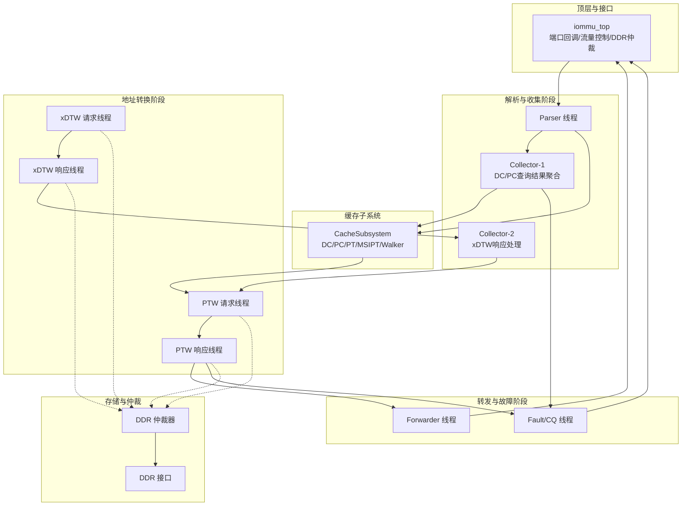
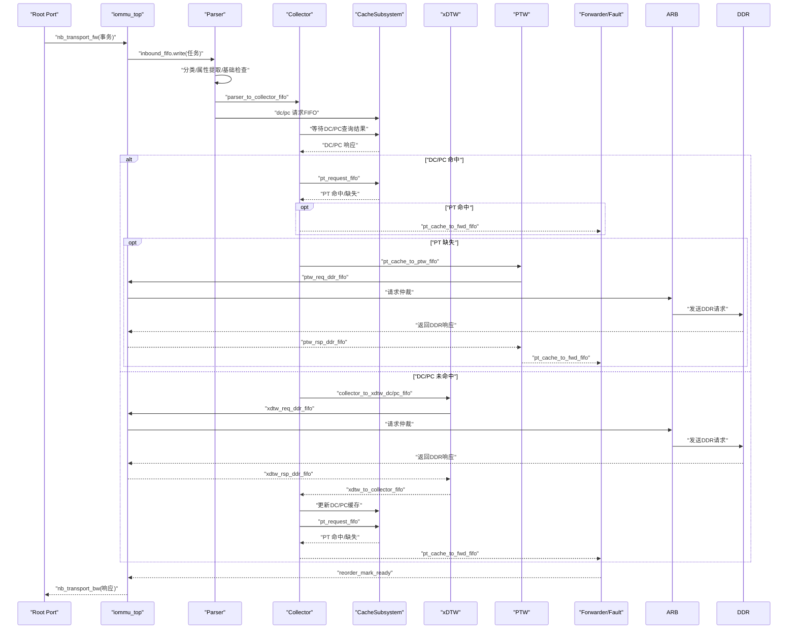
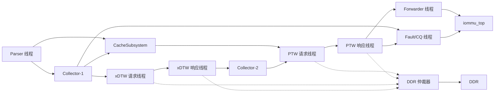

# 流水线架构设计

<cite>
**本文档引用的文件**
- [README.md](file://README.md)
- [iommu_top.cc](file://iommu\iommu_top.cc)
- [iommu_task.hh](file://iommu\include\iommu_task.hh)
- [iommu_perf_model.hh](file://iommu\iommu_perf_model\iommu_perf_model.hh)
- [iommu_perf_parser.cc](file://iommu\iommu_perf_model\iommu_perf_parser.cc)
- [iommu_perf_collector.cc](file://iommu\iommu_perf_model\iommu_perf_collector.cc)
- [cache_subsystem.h](file://iommu\cache_src\subsystem\cache_subsystem.h)
- [iommu_perf_forwarder_fault_cq.cc](file://iommu\iommu_perf_model\iommu_perf_forwarder_fault_cq.cc)
- [iommu_perf_ptw.cc](file://iommu\iommu_perf_model\iommu_perf_ptw.cc)
- [iommu_perf_xdtw.cc](file://iommu\iommu_perf_model\iommu_perf_xdtw.cc)
</cite>

## 目录
1. [引言](#引言)
2. [项目结构](#项目结构)
3. [核心组件](#核心组件)
4. [架构总览](#架构总览)
5. [详细组件分析](#详细组件分析)
6. [依赖关系分析](#依赖关系分析)
7. [性能考虑](#性能考虑)
8. [故障排查指南](#故障排查指南)
9. [结论](#结论)
10. [附录](#附录)

## 引言
本文件面向RISC-V IOMMU流水线架构，系统性阐述基于SystemC实现的20个独立线程构成的并行处理流水线的设计理念、阶段划分、职责分工、数据流转、背压与流量控制、性能优化与瓶颈分析，以及调试与监控方法。该流水线严格遵循RISC-V IOMMU规范的阶段划分，包括Parser、Collector、CacheSubsystem、xDTW、PTW、Forwarder、Fault等核心阶段，通过sc_fifo队列实现解耦与并行，配合PEQ（过程事件队列）实现管道级延迟建模。

## 项目结构
项目采用模块化分层组织，顶层模块负责端口回调、流量控制、DDR仲裁与任务生命周期管理；功能模块按阶段拆分为多个独立线程，每个线程专注单一职责并通过FIFO传递数据。Cache子系统对外暴露请求/响应/更新/失效等多路FIFO，避免单点瓶颈。

**图表来源**
- [iommu_top.cc:127-190](file://iommu\iommu_top.cc#L127-L190)
- [iommu_perf_parser.cc:9-122](file://iommu\iommu_perf_model\iommu_perf_parser.cc#L9-L122)
- [iommu_perf_collector.cc:14-271](file://iommu\iommu_perf_model\iommu_perf_collector.cc#L14-L271)
- [cache_subsystem.h:34-65](file://iommu\cache_src\subsystem\cache_subsystem.h#L34-L65)
- [iommu_perf_xdtw.cc:12-132](file://iommu\iommu_perf_model\iommu_perf_xdtw.cc#L12-L132)
- [iommu_perf_ptw.cc:13-31](file://iommu\iommu_perf_model\iommu_perf_ptw.cc#L13-L31)
- [iommu_perf_forwarder_fault_cq.cc:13-53](file://iommu\iommu_perf_model\iommu_perf_forwarder_fault_cq.cc#L13-L53)

**章节来源**
- [README.md:63-76](file://README.md#L63-L76)
- [iommu_top.cc:1-583](file://iommu\iommu_top.cc#L1-L583)

## 核心组件
- 任务模型与状态机：统一的任务结构体承载解析、上下文、翻译结果与流水线状态，贯穿全阶段。
- 阶段化流水线：Parser、Collector、CacheSubsystem、xDTW、PTW、Forwarder、Fault七大阶段，每个阶段由1-3个线程组成。
- 队列与背压：广泛使用sc_fifo进行阶段间解耦；通过outstanding计数、优先级仲裁与事件通知实现背压与流量控制。
- PEQ延迟建模：PTW请求/响应阶段使用PEQ实现非阻塞的管道延迟，提升并行度与精度。

**章节来源**
- [iommu_task.hh:14-42](file://iommu\include\iommu_task.hh#L14-L42)
- [iommu_task.hh:121-212](file://iommu\include\iommu_task.hh#L121-L212)
- [iommu_perf_model.hh:1-197](file://iommu\iommu_perf_model\iommu_perf_model.hh#L1-L197)

## 架构总览
流水线自入口Root Port接收TLM事务，Parser完成分类与基础检查后，进入Collector阶段并发查询DC/PC缓存；若缓存命中，直接路由到PT缓存查询；若未命中，则触发xDTW（设备/进程上下文）或PTW（页表）遍历。PTW遍历过程中可能触发G-stage隐式/显式翻译，期间通过Walker Cache加速。翻译完成后进入Forwarder阶段生成响应，Fault阶段统一记录并分类错误。

**图表来源**
- [iommu_top.cc:127-190](file://iommu\iommu_top.cc#L127-L190)
- [iommu_perf_parser.cc:9-122](file://iommu\iommu_perf_model\iommu_perf_parser.cc#L9-L122)
- [iommu_perf_collector.cc:14-271](file://iommu\iommu_perf_model\iommu_perf_collector.cc#L14-L271)
- [iommu_perf_xdtw.cc:12-132](file://iommu\iommu_perf_model\iommu_perf_xdtw.cc#L12-L132)
- [iommu_perf_ptw.cc:13-31](file://iommu\iommu_perf_model\iommu_perf_ptw.cc#L13-L31)
- [iommu_perf_forwarder_fault_cq.cc:13-53](file://iommu\iommu_perf_model\iommu_perf_forwarder_fault_cq.cc#L13-L53)

## 详细组件分析

### Parser 阶段（1线程）
- 职责：解析入口事务，提取访问属性与事务类型，执行基础合法性检查（模式、设备ID宽度等），将任务写入Collector与Cache请求队列。
- 关键流程：
  - 全局outstanding反压：当超过阈值时等待释放事件。
  - 分类与属性提取：调用性能模型中的分类与VPN提取函数。
  - 模式检查：Off/Bare模式分支处理。
  - 写入队列：parser_to_collector_fifo、dc_request_fifo、pc_request_fifo。
- 背压与容量：通过全局outstanding上限与事件通知实现反压。

**章节来源**
- [iommu_perf_parser.cc:9-122](file://iommu\iommu_perf_model\iommu_perf_parser.cc#L9-L122)
- [iommu_perf_model.hh:7-41](file://iommu\iommu_perf_model\iommu_perf_model.hh#L7-L41)

### Collector 阶段（2线程）
- Collector-1（聚合线程）：汇聚Parser与Cache查询结果，完成DC/PC上下文配置与路由决策，必要时触发xDTW遍历。
- Collector-2（xDTW响应线程）：处理xDTW遍历结果，更新DC/PC缓存，继续后续路由。
- 关键流程：
  - 等待Parser与Cache响应，构建pending表。
  - DC/PC命中：执行步骤7-16的规则检查与配置，最终调用configure_and_route进入PT缓存查询。
  - DC/PC未命中：设置walk类型，维护outstanding计数，写入xDTW队列。
  - xDTW完成：更新DC/PC缓存，继续后续流程。
- 背压与容量：分别维护DC/PC最大并发遍历上限，完成即通知释放。

**章节来源**
- [iommu_perf_collector.cc:14-271](file://iommu\iommu_perf_model\iommu_perf_collector.cc#L14-L271)
- [iommu_perf_collector.cc:277-453](file://iommu\iommu_perf_model\iommu_perf_collector.cc#L277-L453)

### CacheSubsystem 阶段（多线程）
- 对外接口：dc/pc/pt/msipt/walker请求/响应/更新/失效多路FIFO，避免单点串行化。
- 内部实现：各缓存组件独立工作线程，支持lookup/update/invalidation轮询调度，减少互锁风险。
- 与上游对接：Parser/Collector通过请求FIFO提交查询，响应FIFO返回结果；PT更新通过pt_update_fifo写回。

**章节来源**
- [cache_subsystem.h:34-65](file://iommu\cache_src\subsystem\cache_subsystem.h#L34-L65)
- [cache_subsystem.h:110-125](file://iommu\cache_src\subsystem\cache_subsystem.h#L110-L125)

### xDTW 阶段（2线程）
- xDTW请求线程：初始化DDT/PDT遍历上下文，发送首块DDR请求，维护outstanding计数。
- xDTW响应线程：解析DDR响应，推进遍历状态机，完成DC/PC读取与校验，写回Collector。
- 关键流程：
  - DDT：1/2/3级索引，逐级读取，到达叶节点后读取DC。
  - PDT：1/2/3级索引，逐级读取，到达叶节点后读取PC。
  - 故障：非法位、保留位、越界等均触发故障。
- 背压与容量：分别维护DC/PC outstanding上限，完成即通知。

**章节来源**
- [iommu_perf_xdtw.cc:12-132](file://iommu\iommu_perf_model\iommu_perf_xdtw.cc#L12-L132)
- [iommu_perf_xdtw.cc:138-367](file://iommu\iommu_perf_model\iommu_perf_xdtw.cc#L138-L367)

### PTW 阶段（2线程 + PEQ）
- PTW请求线程：应用outstanding控制，将任务通过PEQ延迟后进入处理线程。
- PTW处理线程：Bare模式快速路径、VS/GS隐式/显式遍历、A/D位更新、Walker Cache交互、最终生成PA。
- 关键流程：
  - Bare模式：直接计算GPA/PA，必要时G-stage显式翻译。
  - VS遍历：权限检查、超页对齐、A/D位处理、GS隐式翻译。
  - GS遍历：权限检查、超页对齐、A/D位处理。
  - Walker Cache：命中则从缓存起点继续，未命中则从最高级开始。
- 背压与容量：PTW总outstanding上限，任务完成事件通知。

**章节来源**
- [iommu_perf_ptw.cc:13-31](file://iommu\iommu_perf_model\iommu_perf_ptw.cc#L13-L31)
- [iommu_perf_ptw.cc:37-207](file://iommu\iommu_perf_model\iommu_perf_ptw.cc#L37-L207)
- [iommu_perf_ptw.cc:213-31](file://iommu\iommu_perf_model\iommu_perf_ptw.cc#L213-L31)
- [iommu_perf_ptw.cc:226-807](file://iommu\iommu_perf_model\iommu_perf_ptw.cc#L226-L807)

### Forwarder/Fault/CQ 阶段（3线程）
- PT Forwarder：从PT缓存转发路径读取任务，生成响应并标记reorder ready。
- MSIPT Forwarder：根据MSI/MRIF标志路由到IMSIC或DMA路径，生成响应并标记reorder ready。
- Fault/CQ：记录故障、分类响应（ATS/非ATS），生成错误响应并标记reorder ready。

**章节来源**
- [iommu_perf_forwarder_fault_cq.cc:13-53](file://iommu\iommu_perf_model\iommu_perf_forwarder_fault_cq.cc#L13-L53)
- [iommu_perf_forwarder_fault_cq.cc:62-114](file://iommu\iommu_perf_model\iommu_perf_forwarder_fault_cq.cc#L62-L114)
- [iommu_perf_forwarder_fault_cq.cc:121-179](file://iommu\iommu_perf_model\iommu_perf_forwarder_fault_cq.cc#L121-L179)

### 顶层与DDR仲裁（1模块）
- 顶层模块负责Root Port回调、b_transport兼容、流量控制（入口带宽、DDR带宽）、DDR仲裁与响应路由。
- DDR仲裁器：控制全局与主口outstanding，优先级（控制路径优先，xDTW/PTW/MSIPTW轮询），避免拥塞。

**章节来源**
- [iommu_top.cc:127-190](file://iommu\iommu_top.cc#L127-L190)
- [iommu_top.cc:195-262](file://iommu\iommu_top.cc#L195-L262)
- [iommu_top.cc:267-389](file://iommu\iommu_top.cc#L267-L389)

## 依赖关系分析

**图表来源**
- [iommu_perf_parser.cc:9-122](file://iommu\iommu_perf_model\iommu_perf_parser.cc#L9-L122)
- [iommu_perf_collector.cc:14-271](file://iommu\iommu_perf_model\iommu_perf_collector.cc#L14-L271)
- [iommu_perf_xdtw.cc:12-132](file://iommu\iommu_perf_model\iommu_perf_xdtw.cc#L12-L132)
- [iommu_perf_ptw.cc:13-31](file://iommu\iommu_perf_model\iommu_perf_ptw.cc#L13-L31)
- [iommu_perf_forwarder_fault_cq.cc:13-53](file://iommu\iommu_perf_model\iommu_perf_forwarder_fault_cq.cc#L13-L53)
- [iommu_top.cc:267-389](file://iommu\iommu_top.cc#L267-L389)

**章节来源**
- [cache_subsystem.h:34-65](file://iommu\cache_src\subsystem\cache_subsystem.h#L34-L65)
- [iommu_top.cc:267-389](file://iommu\iommu_top.cc#L267-L389)

## 性能考虑
- 并行度与解耦：各阶段通过独立线程与sc_fifo解耦，最大化并行；Cache子系统多路FIFO避免串行化。
- PEQ延迟建模：PTW请求/响应阶段使用PEQ，非阻塞地引入固定延迟，提升仿真精度与并行度。
- Walker Cache：PTW阶段可选启用，命中时从缓存起点继续，显著降低DDR访问次数。
- 流量控制：全局outstanding、各阶段outstanding上限、仲裁器优先级与事件通知共同实现背压，防止拥塞。
- 带宽控制：入口与DDR主口带宽限制通过延时模拟，避免过载。
- 统计与可观测性：顶层提供缓存命中/缺失统计、VA去重统计、IOPS统计与端口平均带宽统计，便于性能分析。

**章节来源**
- [iommu_perf_ptw.cc:105-122](file://iommu\iommu_perf_model\iommu_perf_ptw.cc#L105-L122)
- [iommu_top.cc:522-582](file://iommu\iommu_top.cc#L522-L582)

## 故障排查指南
- 调试入口：顶层模块提供丰富的printf与统计输出，便于定位阶段与任务ID。
- 常见故障类型：
  - Parser阶段：模式禁用（Off）、Bare模式不支持的事务类型、设备ID宽度不匹配。
  - xDTW阶段：DDT/PDT条目无效或配置错误。
  - PTW阶段：PTE非法、权限不符、超页对齐错误、A/D位更新失败。
  - Fault/CQ阶段：ATS请求分类与响应生成。
- 定位建议：
  - 依据任务ID串联各阶段日志，确认故障发生阶段。
  - 检查outstanding计数与事件通知，确认背压是否导致延迟。
  - 利用统计输出评估缓存命中率与VA去重收益，识别热点与瓶颈。

**章节来源**
- [iommu_perf_parser.cc:33-98](file://iommu\iommu_perf_model\iommu_perf_parser.cc#L33-L98)
- [iommu_perf_xdtw.cc:174-236](file://iommu\iommu_perf_model\iommu_perf_xdtw.cc#L174-L236)
- [iommu_perf_ptw.cc:267-340](file://iommu\iommu_perf_model\iommu_perf_ptw.cc#L267-L340)
- [iommu_perf_forwarder_fault_cq.cc:121-179](file://iommu\iommu_perf_model\iommu_perf_forwarder_fault_cq.cc#L121-L179)

## 结论
该流水线通过明确的阶段划分与严格的并行解耦，实现了高吞吐、低延迟的IOMMU地址翻译与响应生成。借助PEQ延迟建模、Walker Cache、多路FIFO与完善的背压机制，系统在仿真精度与性能之间取得良好平衡。建议在实际部署中结合统计输出持续优化缓存参数与仲裁策略，进一步提升整体吞吐与稳定性。

## 附录
- 任务生命周期：创建（入口回调）→ Parser → Collector → Cache/Subsystem → xDTW/PTW → Forwarder → 完成（reorder输出）。
- 队列容量设计原则：以阶段吞吐与延迟为目标，结合outstanding上限与事件通知，确保无死锁与低延迟。
- 调试与监控：利用顶层统计输出与阶段日志，结合GDB调试指南进行断点与变量检查。