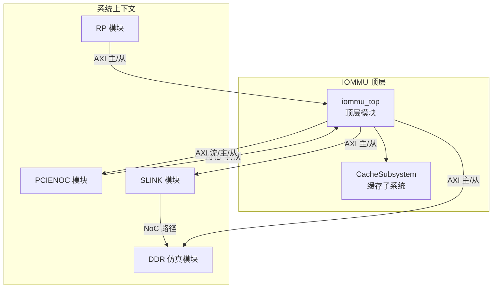
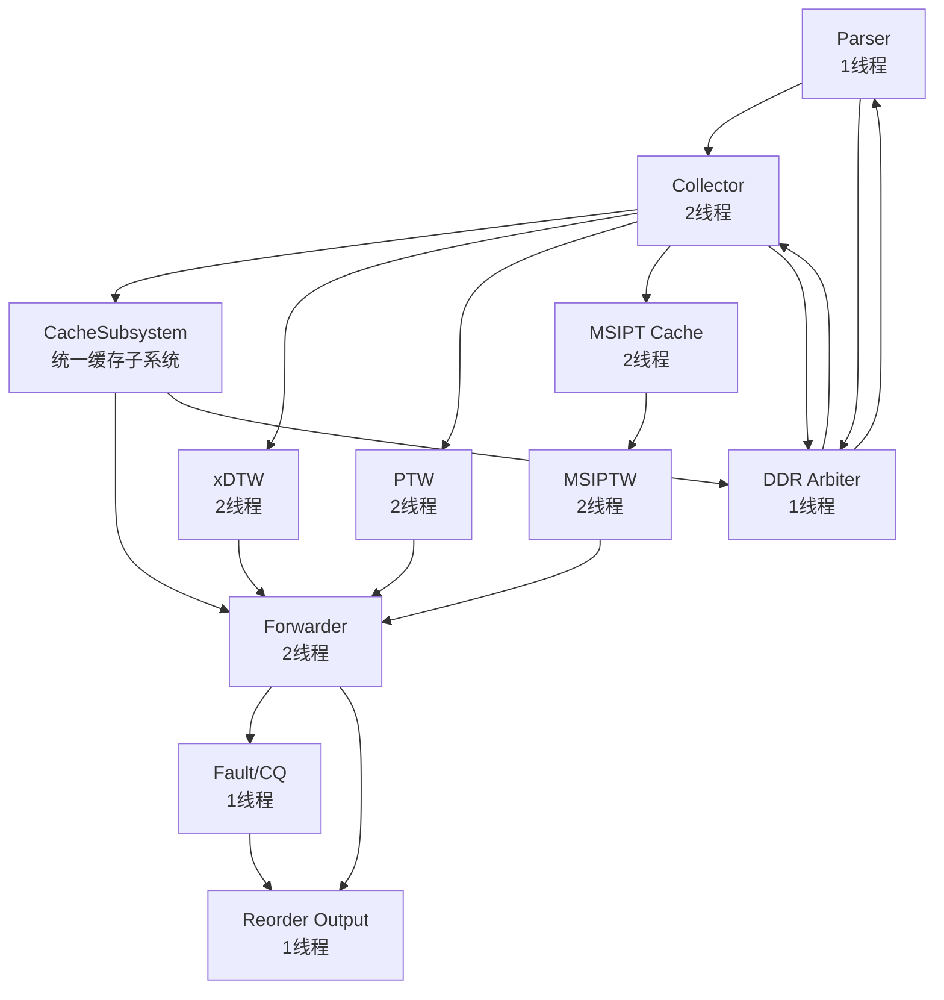
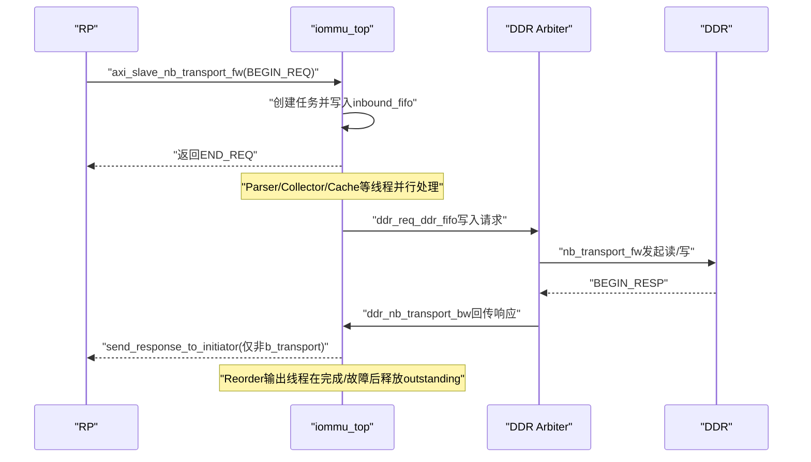
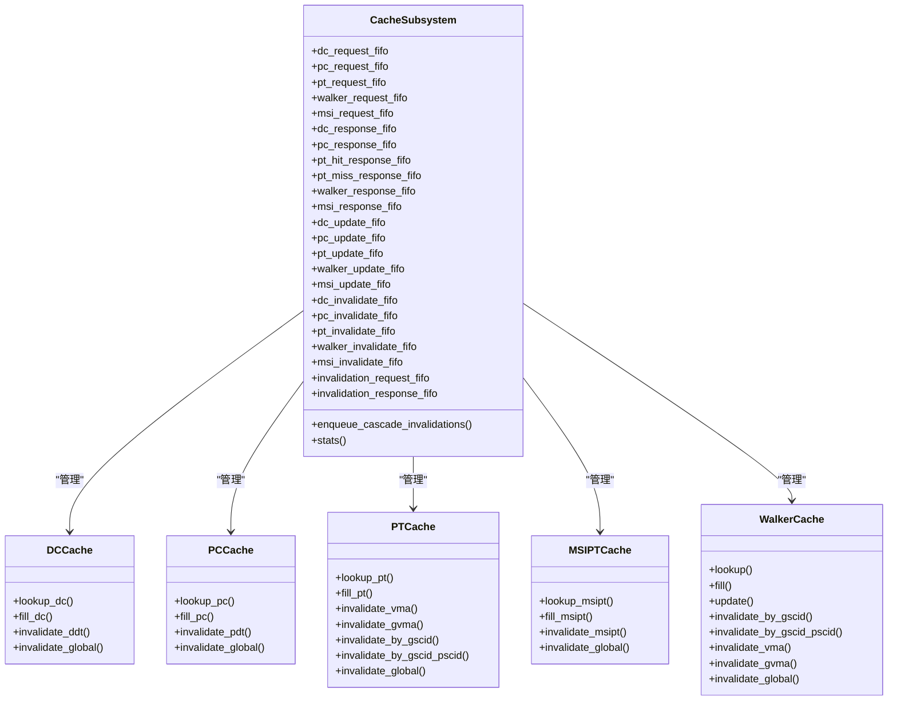
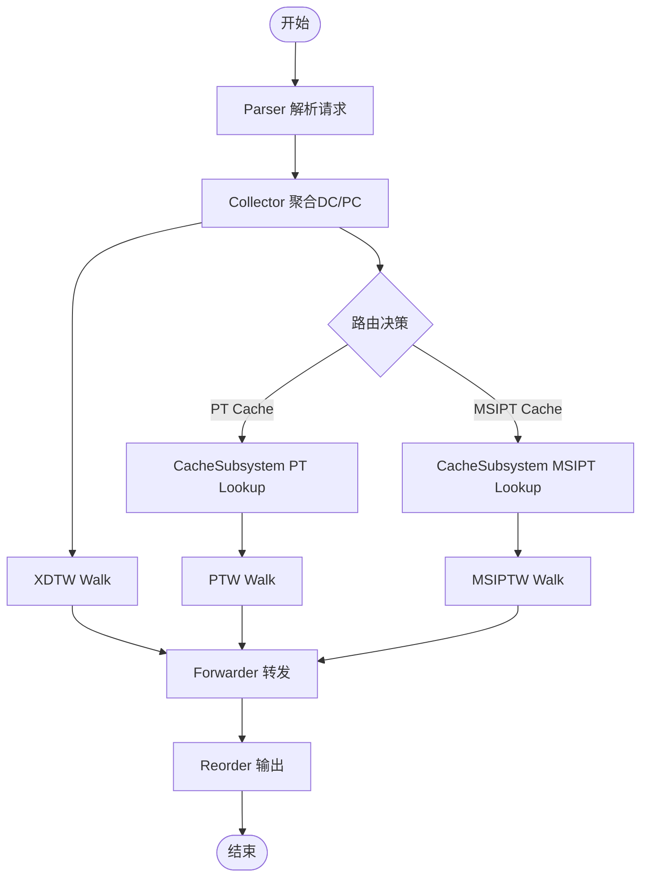
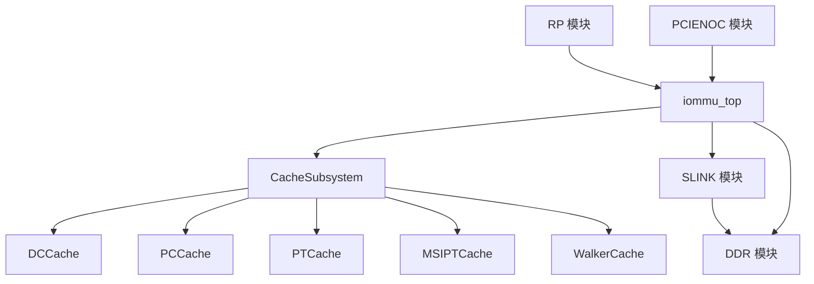

# 系统架构设计

<cite>
**本文引用的文件**
- [iommu_top.cc](file://iommu/iommu_top.cc)
- [iommu_top.hh](file://iommu/iommu_top.hh)
- [main.cpp](file://main.cpp)
- [README.md](file://README.md)
- [PERF_MODEL_IMPLEMENTATION.md](file://PERF_MODEL_IMPLEMENTATION.md)
- [cache_subsystem.h](file://iommu/cache_src/subsystem/cache_subsystem.h)
- [types.h](file://iommu/cache_src/common/types.h)
- [dc_cache.h](file://iommu/cache_src/cache/dc_cache.h)
- [pt_cache.h](file://iommu/cache_src/cache/pt_cache.h)
- [walker_cache.h](file://iommu/cache_src/cache/walker_cache.h)
- [iommu_struct.hh](file://iommu/include/iommu_struct.hh)
- [iommu_task.hh](file://iommu/include/iommu_task.hh)
</cite>

## 目录
1. [简介](#简介)
2. [项目结构](#项目结构)
3. [核心组件](#核心组件)
4. [架构总览](#架构总览)
5. [详细组件分析](#详细组件分析)
6. [依赖分析](#依赖分析)
7. [性能考量](#性能考量)
8. [故障排查指南](#故障排查指南)
9. [结论](#结论)
10. [附录](#附录)

## 简介
本文件面向RISC-V IOMMU系统，围绕“20个独立线程构成的并行处理流水线”这一核心目标，系统化梳理顶层模块iommu_top的设计理念、组件交互关系、数据流与控制流，并结合CacheSubsystem的统一缓存子系统，给出架构视图、流程图与序列图。文档同时覆盖系统边界、集成模式、数据传递协议、同步机制、技术决策与权衡、基础设施与可扩展性、部署拓扑以及安全、监控与灾难恢复等横切关注点。

## 项目结构
- 顶层模块：iommu_top.cc/hh，负责系统初始化、TLM回调、FIFO管道、DDR仲裁、重排序输出、VA去重恢复、统计打印等。
- 性能模型实现：PERF_MODEL_IMPLEMENTATION.md明确列出20个线程的职责与模块归属，涵盖Parser、Collector、DC/PC/PT/MSIPT Cache、xDTW、PTW、Forwarder/Fault/CQ等。
- 缓存子系统：cache_subsystem.h定义CacheSubsystem对外的请求/响应FIFO接口，内部封装DC/PC/PT/MSIPT/Walker Cache及其调度线程。
- 数据结构与任务：iommu_task.hh定义统一的任务状态机、Walker上下文、DDR请求/响应结构等；types.h定义CacheMessage及各类缓存数据结构。
- 系统绑定：main.cpp展示RP、PCIENOC、DDR、SLINK与IOMMU之间的Socket绑定关系，形成完整的系统上下文。

**图表来源**
- [main.cpp:50-79](file://main.cpp#L50-L79)
- [iommu_top.hh:44-52](file://iommu/iommu_top.hh#L44-L52)

**章节来源**
- [README.md:63-76](file://README.md#L63-L76)
- [PERF_MODEL_IMPLEMENTATION.md:180-194](file://PERF_MODEL_IMPLEMENTATION.md#L180-L194)

## 核心组件
- 顶层模块 iommu_top
  - 初始化与复位：before_end_of_elaboration完成能力集、模式、寄存器等初始化。
  - TLM回调：axi_slave_nb_transport_fw接收RP请求，ddr_nb_transport_bw接收DDR响应。
  - 管道FIFO：inbound_fifo、parser_to_collector_fifo、collector_to_*、pt_cache_to_*、msipt_cache_to_*等。
  - DDR仲裁：ddr_arbiter_thread统一调度XDTW/PTW/MSIPTW与控制路径请求。
  - 输出重排序：reorder_output_thread保证写请求有序输出，读请求可达即输出。
  - VA去重：va_dedup_recover在PTW完成后批量恢复同页挂起任务。
  - 统计：print_cache_statistics打印Cache命中/未命中与VA去重统计。
- CacheSubsystem
  - 对外接口：dc_request_fifo/pc_request_fifo/pt_request_fifo/walker_request_fifo/msi_request_fifo；以及对应的响应与更新、失效接口。
  - 内部组件：DCCache、PCCache、PTCache、MSIPTCache、WalkerCache。
  - 调度：walker_scheduler_thread替代原有三个worker线程，轮询lookup/update/invalidates避免死锁。
- 数据结构与任务
  - iommu_task_t：统一任务状态机、Walker上下文、翻译结果字段、TLM指针等。
  - CacheMessage：统一的缓存请求/响应/失效消息，承载路由键与payload。
  - DDR请求/响应：ddr_req_entry_t/ddr_rsp_entry_t/ddr_pending_entry_t/ctrl_path_ddr_req_t。

**章节来源**
- [iommu_top.cc:9-38](file://iommu/iommu_top.cc#L9-L38)
- [iommu_top.cc:130-189](file://iommu/iommu_top.cc#L130-L189)
- [iommu_top.cc:194-261](file://iommu/iommu_top.cc#L194-L261)
- [iommu_top.cc:266-387](file://iommu/iommu_top.cc#L266-L387)
- [iommu_top.cc:392-412](file://iommu/iommu_top.cc#L392-L412)
- [iommu_top.cc:417-441](file://iommu/iommu_top.cc#L417-L441)
- [iommu_top.cc:446-458](file://iommu/iommu_top.cc#L446-L458)
- [iommu_top.cc:463-515](file://iommu/iommu_top.cc#L463-L515)
- [iommu_top.cc:520-539](file://iommu/iommu_top.cc#L520-L539)
- [cache_subsystem.h:20-84](file://iommu/cache_src/subsystem/cache_subsystem.h#L20-L84)
- [types.h:476-549](file://iommu/cache_src/common/types.h#L476-L549)
- [iommu_task.hh:121-212](file://iommu/include/iommu_task.hh#L121-L212)

## 架构总览
IOMMU采用“20线程并行流水线 + 统一缓存子系统”的架构。Parser负责请求分类与上下文提取；Collector汇聚DC/PC结果并决定路由；CacheSubsystem承担DC/PC/PT/MSIPT/Walker Cache的查询、更新与失效；XDTW/PTW/MSIPTW分别处理DDT/PDT与VS/G-stage页表walk；Forwarder/Fault/CQ负责DMA转发、故障与命令队列处理；DDR Arbiter统一调度内存访问；Reorder输出线程保障有序性；VA去重减少重复walk。

**图表来源**
- [PERF_MODEL_IMPLEMENTATION.md:14-97](file://PERF_MODEL_IMPLEMENTATION.md#L14-L97)
- [cache_subsystem.h:20-84](file://iommu/cache_src/subsystem/cache_subsystem.h#L20-L84)
- [iommu_top.hh:202-251](file://iommu/iommu_top.hh#L202-L251)

## 详细组件分析

### 顶层模块 iommu_top：设计理念与组件交互
- 设计理念
  - 分层解耦：将Parser/Collector/CacheSubsystem/XDTW/PTW/MSIPT/Forwarder/Fault/CQ/DDRArbiter/Reorder等划分为独立线程，通过FIFO与PEQ解耦。
  - 统一接口：TLM nb_transport用于高性能路径，b_transport用于寄存器访问（非性能路径）。
  - 可扩展性：CacheSubsystem抽象出统一的请求/响应/更新/失效接口，便于新增缓存或替换实现。
  - 可观测性：VA去重、Cache命中统计、重排序、事件驱动的完成信号。
- 组件交互
  - RP通过axi_slave_from_pcie_noc_0_socket发起请求，顶层通过axi_slave_nb_transport_fw接入inbound_fifo。
  - Parser/Collector/CacheSubsystem/XDTW/PTW/MSIPT/MSIPTW/Forwarder/Fault/CQ/DDRArbiter/Reorder线程并行运行。
  - DDR Arbiter统一调度XDTW/PTW/MSIPTW与控制路径请求，通过ddr_nb_transport_bw回传响应。
  - Reorder输出线程在完成或故障后按task_id输出，释放全局outstanding。

**图表来源**
- [iommu_top.cc:130-189](file://iommu/iommu_top.cc#L130-L189)
- [iommu_top.cc:194-261](file://iommu/iommu_top.cc#L194-L261)
- [iommu_top.cc:392-412](file://iommu/iommu_top.cc#L392-L412)

**章节来源**
- [iommu_top.cc:9-38](file://iommu/iommu_top.cc#L9-L38)
- [iommu_top.cc:417-441](file://iommu/iommu_top.cc#L417-L441)
- [iommu_top.cc:463-515](file://iommu/iommu_top.cc#L463-L515)
- [iommu_top.cc:520-539](file://iommu/iommu_top.cc#L520-L539)

### CacheSubsystem：统一缓存子系统
- 设计要点
  - 对外暴露多路请求/响应FIFO，避免单FIFO串行化瓶颈。
  - 内部Worker线程负责lookup/update/invalidates，Walker Cache采用统一调度线程。
  - 支持级联失效：DC/PC失效后向PT/Walker/MSIPT推送失效消息。
  - 统一统计：StatsCollector记录任务完成时间与延迟。
- 关键接口
  - 请求：dc_request_fifo/pc_request_fifo/pt_request_fifo/walker_request_fifo/msi_request_fifo
  - 响应：dc_response_fifo/pc_response_fifo/pt_hit_response_fifo/pt_miss_response_fifo/walker_response_fifo/msi_response_fifo
  - 更新：dc_update_fifo/pc_update_fifo/pt_update_fifo/walker_update_fifo/msi_update_fifo
  - 失效：dc_invalidate_fifo/pc_invalidate_fifo/pt_invalidate_fifo/walker_invalidate_fifo/msi_invalidate_fifo
  - 全局失效：invalidation_request_fifo/invalidation_response_fifo

**图表来源**
- [cache_subsystem.h:20-84](file://iommu/cache_src/subsystem/cache_subsystem.h#L20-L84)
- [cache_subsystem.h:99-125](file://iommu/cache_src/subsystem/cache_subsystem.h#L99-L125)
- [dc_cache.h:8-31](file://iommu/cache_src/cache/dc_cache.h#L8-L31)
- [pt_cache.h:8-54](file://iommu/cache_src/cache/pt_cache.h#L8-L54)

**章节来源**
- [cache_subsystem.h:20-84](file://iommu/cache_src/subsystem/cache_subsystem.h#L20-L84)
- [types.h:476-549](file://iommu/cache_src/common/types.h#L476-L549)

### 并行流水线：Parser、Collector、CacheSubsystem等
- Parser（1线程）
  - 从inbound_fifo读取任务，解析IOVA、长度、权限等，生成任务状态与上下文。
- Collector（2线程）
  - 线程1：监听parser_to_collector_fifo、dc_cache_to_collector_fifo、pc_cache_to_collector_fifo，按task_id聚合DC/PC结果，决定路由（PT Cache或MSIPT Cache）。
  - 线程2：处理xDTW返回的DC/PC walk结果，更新DC/PC Cache，执行配置验证与MSI判断。
- CacheSubsystem（统一接口）
  - Parser/Collector通过CacheMessage写入对应请求FIFO；Cache内部Worker线程执行lookup/update/invalidates；响应通过独立FIFO返回，避免串行化。
- XDTW（2线程）
  - req_thread：计算DDT/PDT索引，发起DDR读。
  - rsp_thread：解析DDTE/PDTE，检查V位，读取完整DC/PC。
- PTW（2线程）
  - req_thread：优先处理Cache失效命令，查询Walker Cache，根据命中情况确定walk起始层级，发起DDR读。
  - rsp_thread：解析PTE，非叶节点更新Walker Cache并继续walk，叶节点进行权限检查与PA计算，必要时触发G-stage翻译。
- MSIPT（2线程）与MSIPTW（2线程）
  - MSIPT查询MSI页表缓存，命中则路由输出；未命中则MSIPTW发起DDR读，解析MSI PTE，判断M字段，路由输出。
- Forwarder（2线程）
  - PT路径：将PA写入axi_master_0_to_pcie_noc_socket。
  - MSI路径：将MSI结果写入axi_stream_socket或通过MRIF原子OR写入axi_master_1。
- Fault/CQ（1线程）
  - 生成fault record，写入FQ；处理CQ命令，发送Cache Invalidation。
- DDR Arbiter（1线程）
  - 统一调度XDTW/PTW/MSIPTW与控制路径请求，维护全局outstanding计数，避免拥塞。
- Reorder（1线程）
  - 写请求按task_id单调保序输出；读请求到达即输出；输出后释放全局outstanding。

**图表来源**
- [PERF_MODEL_IMPLEMENTATION.md:14-97](file://PERF_MODEL_IMPLEMENTATION.md#L14-L97)
- [cache_subsystem.h:20-84](file://iommu/cache_src/subsystem/cache_subsystem.h#L20-L84)
- [iommu_top.cc:417-441](file://iommu/iommu_top.cc#L417-L441)

**章节来源**
- [PERF_MODEL_IMPLEMENTATION.md:14-97](file://PERF_MODEL_IMPLEMENTATION.md#L14-L97)
- [iommu_top.cc:266-387](file://iommu/iommu_top.cc#L266-L387)

### 数据流与控制流
- 数据流
  - 入站请求：RP -> iommu_top.inbound_fifo -> Parser -> Collector -> CacheSubsystem/PTW/MSIPTW -> Forwarder -> Reorder -> RP。
  - DDR访问：XDTW/PTW/MSIPTW/控制路径 -> ddr_req_ddr_fifo -> DDR Arbiter -> DDR -> ddr_nb_transport_bw -> ddr_rsp_ddr_fifo。
- 控制流
  - 事件驱动：PEQ（ptw_req_peq/ptw_rsp_peq）、sc_event（slot_freed、task_completed、reorder_ready等）协调各线程。
  - 流控：全局outstanding计数、FIFO深度限制、DDR最大并发限制、带宽延迟模拟。
  - 同步：Mutex保护共享结构（pending_tasks、pt_cache_pending_tasks、va_dedup_table等）。

**章节来源**
- [iommu_top.cc:130-189](file://iommu/iommu_top.cc#L130-L189)
- [iommu_top.cc:194-261](file://iommu/iommu_top.cc#L194-L261)
- [iommu_top.hh:100-192](file://iommu/iommu_top.hh#L100-L192)

### 技术决策与权衡
- 采用CacheSubsystem统一缓存接口，避免FIFO串行化瓶颈，提升并发度。
- Walker Cache集成在PTW中，减少额外模块复杂度，提高命中率。
- VA去重机制显著降低重复walk，减少DDR访问与延迟。
- 重排序输出确保写请求有序，兼顾读请求可达性与时序一致性。
- TLM非阻塞接口用于高性能路径，b_transport保留寄存器访问兼容性。

**章节来源**
- [PERF_MODEL_IMPLEMENTATION.md:100-129](file://PERF_MODEL_IMPLEMENTATION.md#L100-L129)
- [iommu_top.cc:463-515](file://iommu/iommu_top.cc#L463-L515)
- [iommu_top.cc:392-412](file://iommu/iommu_top.cc#L392-L412)

## 依赖分析
- 模块耦合
  - iommu_top与CacheSubsystem通过FIFO接口松耦合；内部通过CacheMessage统一消息格式。
  - Parser/Collector与CacheSubsystem之间通过CacheMessage路由键（device_id/process_id/gscid/pscid/iova等）定位缓存条目。
  - PTW与Walker Cache紧密协作，Walker Cache命中时缩短walk路径。
- 外部依赖
  - SystemC/TLM库用于事件驱动与Socket通信。
  - main.cpp中的RP/PCIENOC/DDR/SLINK模块通过Socket绑定与IOMMU互联。

**图表来源**
- [main.cpp:50-79](file://main.cpp#L50-L79)
- [cache_subsystem.h:93-97](file://iommu/cache_src/subsystem/cache_subsystem.h#L93-L97)

**章节来源**
- [main.cpp:50-79](file://main.cpp#L50-L79)
- [cache_subsystem.h:93-97](file://iommu/cache_src/subsystem/cache_subsystem.h#L93-L97)

## 性能考量
- 并发度：20个独立线程并行处理，FIFO深度与PEQ配合实现非阻塞延迟。
- 缓存命中：DC/PC/PT/MSIPT/Walker Cache命中率直接影响延迟与吞吐。
- DDR带宽：通过带宽延迟模拟与outstanding计数控制，避免拥塞。
- VA去重：显著减少重复walk，降低DDR访问与整体延迟。
- 统计与可观测性：Cache命中/未命中统计、VA去重统计、任务trace与latency直方图。

**章节来源**
- [PERF_MODEL_IMPLEMENTATION.md:100-129](file://PERF_MODEL_IMPLEMENTATION.md#L100-L129)
- [iommu_top.cc:520-539](file://iommu/iommu_top.cc#L520-L539)

## 故障排查指南
- 寄存器访问
  - 使用ahb_slave_b_transport进行b_transport寄存器访问，若返回错误响应，检查PayloadExtension是否正确附加。
- DDR响应异常
  - 若出现“pending queue is empty”，检查ddr_pending_queue与source_module映射是否一致。
- outstanding溢出
  - 检查axi_master_1_to_cmn_rnd_outstanding与slot_freed事件通知是否匹配。
- 任务状态卡滞
  - 检查parser/collector/forwarder/fault线程是否正常推进task_state，必要时开启任务trace。
- VA去重问题
  - 检查va_dedup_table的key构造（gscid/pscid/page_iova）与恢复逻辑。

**章节来源**
- [iommu_top.cc:74-125](file://iommu/iommu_top.cc#L74-L125)
- [iommu_top.cc:194-261](file://iommu/iommu_top.cc#L194-L261)
- [iommu_top.cc:266-387](file://iommu/iommu_top.cc#L266-L387)
- [iommu_top.cc:463-515](file://iommu/iommu_top.cc#L463-L515)

## 结论
本系统以“20线程并行流水线 + 统一缓存子系统”为核心，通过TLM非阻塞接口、事件驱动与FIFO解耦，实现了高性能、可扩展的RISC-V IOMMU地址翻译与转发。CacheSubsystem抽象了DC/PC/PT/MSIPT/Walker Cache的统一接口，结合VA去重、重排序与DDR仲裁，显著提升了吞吐与命中率。系统边界清晰，集成模式稳定，具备良好的可维护性与扩展性。

## 附录
- 基础设施要求
  - 必须在WSL环境中编译与运行，SystemC库安装于/usr目录，GCC/G++与GNU Make可用。
- 部署拓扑
  - RP通过AXI与IOMMU互联，PCIENOC通过AHB与IOMMU互联，SLINK经NoC连接DDR，IOMMU通过AXI主/从与外部设备通信。
- 安全、监控与灾难恢复
  - 安全：权限检查贯穿PTW/Forwarder阶段，MSI路径支持MRIF原子OR。
  - 监控：Cache命中统计、VA去重统计、任务trace与latency直方图。
  - 灾难恢复：全局outstanding计数与slot释放事件确保资源回收，避免死锁。

**章节来源**
- [README.md:7-16](file://README.md#L7-L16)
- [README.md:55-62](file://README.md#L55-L62)
- [main.cpp:50-79](file://main.cpp#L50-L79)