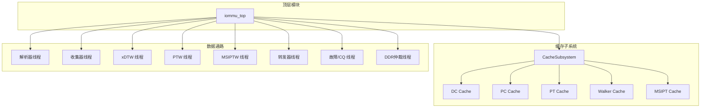
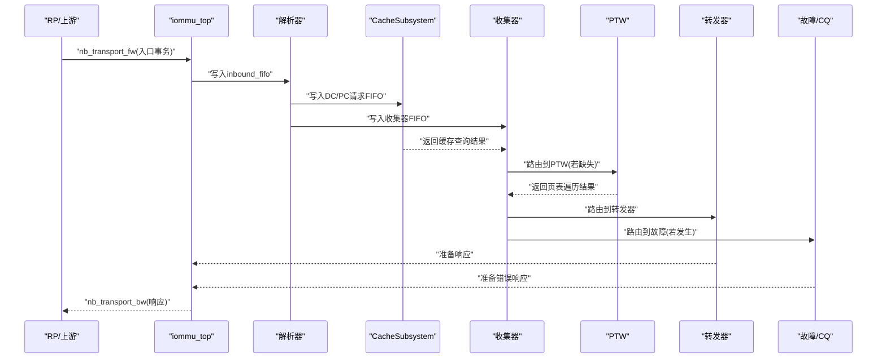
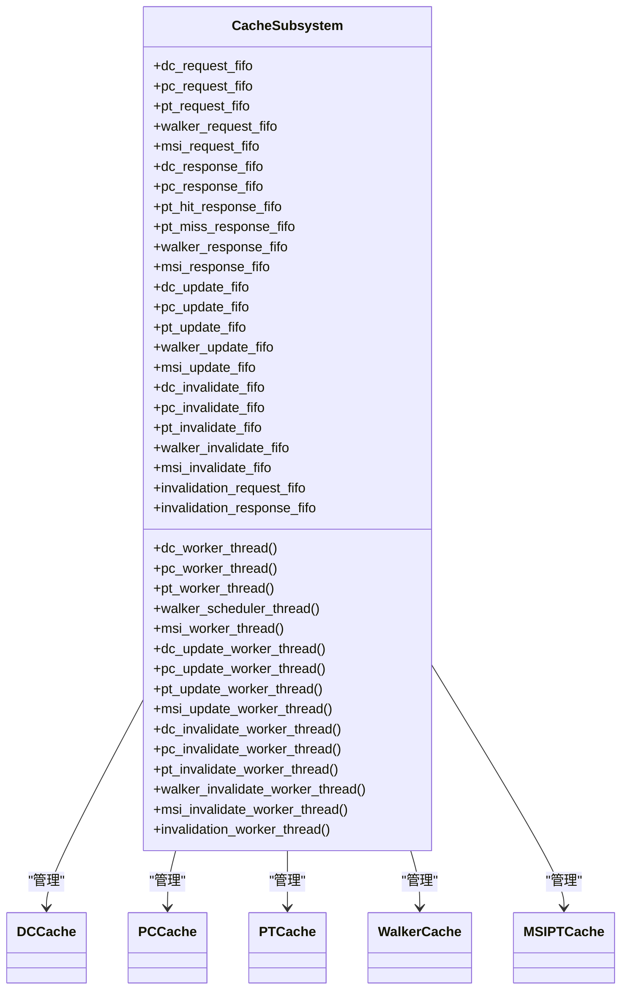
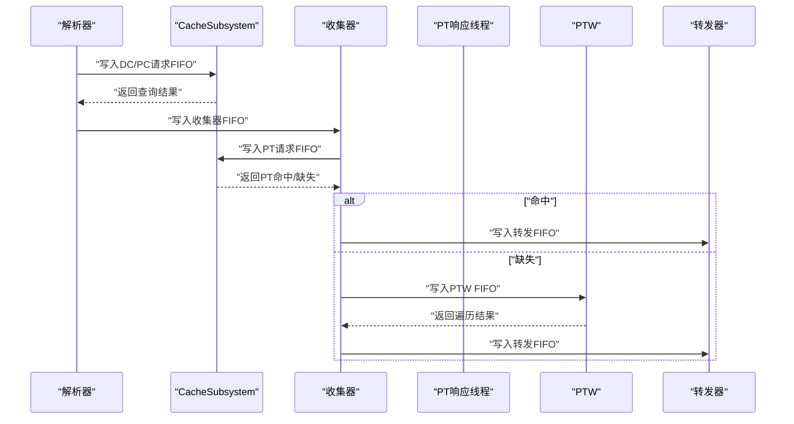
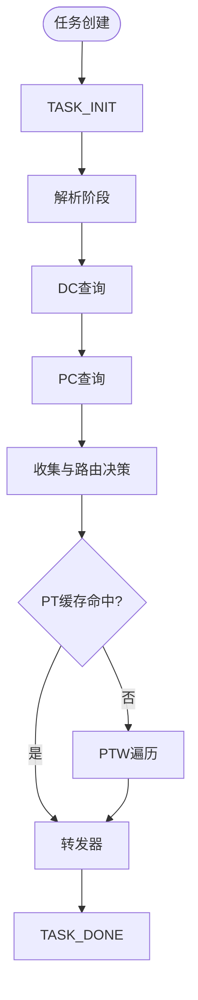
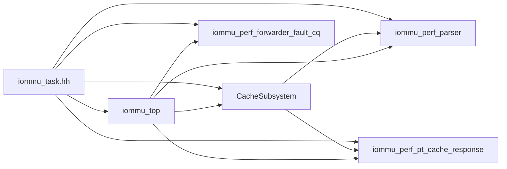

# 组件交互机制

<cite>
**本文档引用的文件**
- [iommu_top.hh](file://iommu/iommu_top.hh)
- [iommu_top.cc](file://iommu/iommu_top.cc)
- [cache_subsystem.h](file://iommu/cache_src/subsystem/cache_subsystem.h)
- [cache_subsystem.cpp](file://iommu/cache_src/subsystem/cache_subsystem.cpp)
- [types.h](file://iommu/cache_src/common/types.h)
- [iommu_task.hh](file://iommu/include/iommu_task.hh)
- [iommu_perf_parser.cc](file://iommu/iommu_perf_model/iommu_perf_parser.cc)
- [iommu_perf_pt_cache_response.cc](file://iommu/iommu_perf_model/iommu_perf_pt_cache_response.cc)
- [iommu_perf_forwarder_fault_cq.cc](file://iommu/iommu_perf_model/iommu_perf_forwarder_fault_cq.cc)
- [iommu_faults.cc](file://iommu/iommu_fun_model/iommu_faults.cc)
- [iommu_perf_model.hh](file://iommu/iommu_perf_model/iommu_perf_model.hh)
- [iommu_struct.hh](file://iommu/include/iommu_struct.hh)
</cite>

## 目录
1. [简介](#简介)
2. [项目结构](#项目结构)
3. [核心组件](#核心组件)
4. [架构总览](#架构总览)
5. [详细组件分析](#详细组件分析)
6. [依赖关系分析](#依赖关系分析)
7. [性能考量](#性能考量)
8. [故障处理与异常恢复指南](#故障处理与异常恢复指南)
9. [结论](#结论)
10. [附录](#附录)

## 简介
本文件面向RISC-V IOMMU组件的交互机制，聚焦于CacheSubsystem与各线程模块之间的协作方式，涵盖缓存查询、更新、失效的协调机制；组件间的数据传递协议（任务结构体、状态同步、事件通知）；初始化顺序与依赖关系；错误处理与异常恢复；以及资源共享与同步原语的使用。文档通过系统化的架构图、序列图与流程图，帮助读者快速理解复杂的交互流程。

## 项目结构
IOMMU系统采用SystemC模块化设计，核心由顶层模块iommu_top驱动，内部包含解析器、缓存子系统、收集器、页表遍历器（PTW）、MSI页表遍历器（MSIPTW）、转发器、故障处理与命令队列等线程模块。缓存子系统（CacheSubsystem）封装DC/PC/PT/Walker/MSIPT五类缓存，对外提供统一的请求/响应FIFO接口，内部通过专用worker线程实现查询、更新、失效操作，并支持级联失效与全局失效流水线。

图表来源
- [iommu_top.hh:41-382](file://iommu/iommu_top.hh#L41-L382)
- [cache_subsystem.h:20-161](file://iommu/cache_src/subsystem/cache_subsystem.h#L20-L161)

章节来源
- [iommu_top.hh:41-382](file://iommu/iommu_top.hh#L41-L382)
- [cache_subsystem.h:20-161](file://iommu/cache_src/subsystem/cache_subsystem.h#L20-L161)

## 核心组件
- 顶层模块iommu_top：负责注册TLM回调、创建CacheSubsystem、管理全局FIFO与事件、维护重排序缓冲、发起DDR仲裁、处理入口/响应回调与统计打印。
- CacheSubsystem：统一管理DC/PC/PT/Walker/MSIPT五类缓存，提供请求/响应FIFO接口，内部通过worker线程执行查询/更新/失效，并支持级联失效与全局失效流水线。
- 任务结构iommu_task_t：贯穿全链路的状态机载体，承载设备/进程上下文、翻译结果、页表遍历上下文、DDR请求/响应等数据。
- 性能模型线程：解析器、收集器、xDTW、PTW、MSIPTW、转发器、故障/CQ、DDR仲裁等，均以SystemC线程形式实现，通过sc_fifo进行解耦。

章节来源
- [iommu_top.hh:41-382](file://iommu/iommu_top.hh#L41-L382)
- [cache_subsystem.h:20-161](file://iommu/cache_src/subsystem/cache_subsystem.h#L20-L161)
- [iommu_task.hh:121-212](file://iommu/include/iommu_task.hh#L121-L212)

## 架构总览
IOMMU采用“解析-缓存-收集-遍历-转发/故障”的流水线架构。解析器将入口事务转换为任务并写入收集器与缓存请求FIFO；缓存子系统并行执行查询/更新/失效；收集器协调上下文与路由决策；PTW/MSIPTW负责页表遍历；转发器生成响应；故障线程记录故障并分类处理；DDR仲裁线程统一调度内存访问。

图表来源
- [iommu_top.cc:130-190](file://iommu/iommu_top.cc#L130-L190)
- [iommu_perf_parser.cc:9-122](file://iommu/iommu_perf_model/iommu_perf_parser.cc#L9-L122)
- [cache_subsystem.cpp:282-320](file://iommu/cache_src/subsystem/cache_subsystem.cpp#L282-L320)
- [iommu_perf_forwarder_fault_cq.cc:13-114](file://iommu/iommu_perf_model/iommu_perf_forwarder_fault_cq.cc#L13-L114)

章节来源
- [iommu_top.cc:130-190](file://iommu/iommu_top.cc#L130-L190)
- [iommu_perf_parser.cc:9-122](file://iommu/iommu_perf_model/iommu_perf_parser.cc#L9-L122)
- [cache_subsystem.cpp:282-320](file://iommu/cache_src/subsystem/cache_subsystem.cpp#L282-L320)
- [iommu_perf_forwarder_fault_cq.cc:13-114](file://iommu/iommu_perf_model/iommu_perf_forwarder_fault_cq.cc#L13-L114)

## 详细组件分析

### CacheSubsystem与各线程模块的协作
- 查询路径：解析器将任务转换为CacheMessage并写入相应请求FIFO（如dc_request_fifo、pc_request_fifo、pt_request_fifo），CacheSubsystem的worker线程读取请求并执行查询，将结果写回对应的响应FIFO（如dc_response_fifo、pc_response_fifo、pt_hit_response_fifo/pt_miss_response_fifo）。
- 更新路径：收集器或遍历器在成功获取上下文后，将CacheMessage写入update FIFO（如dc_update_fifo、pc_update_fifo、pt_update_fifo），由对应worker线程执行更新。
- 失效路径：当需要失效时，上层模块将CacheMessage写入invalidate FIFO（如dc_invalidate_fifo、pc_invalidate_fifo、pt_invalidate_fifo），CacheSubsystem内部worker线程执行失效，并在必要时通过级联机制向其他缓存推送失效消息。
- Walker Cache调度：采用统一的轮询调度线程，依次处理lookup→update→invalidate，避免互锁死锁。

图表来源
- [cache_subsystem.h:20-161](file://iommu/cache_src/subsystem/cache_subsystem.h#L20-L161)
- [cache_subsystem.cpp:102-170](file://iommu/cache_src/subsystem/cache_subsystem.cpp#L102-L170)

章节来源
- [cache_subsystem.h:20-161](file://iommu/cache_src/subsystem/cache_subsystem.h#L20-L161)
- [cache_subsystem.cpp:282-483](file://iommu/cache_src/subsystem/cache_subsystem.cpp#L282-L483)

### 解析器与缓存查询/更新/失效的协调
- 解析器线程：从入口FIFO读取任务，进行分类与属性提取，随后写入收集器FIFO，并将任务转换为CacheMessage写入CacheSubsystem的请求FIFO。
- 收集器线程：在收到DC/PC查询结果后，决定后续路由（PT Cache或PTW），并在需要时触发更新/失效。
- PT Cache响应线程：从CacheSubsystem的PT命中/缺失响应FIFO读取结果，结合VA去重表决定是否直接转发或下发PTW。

图表来源
- [iommu_perf_parser.cc:9-122](file://iommu/iommu_perf_model/iommu_perf_parser.cc#L9-L122)
- [cache_subsystem.cpp:306-320](file://iommu/cache_src/subsystem/cache_subsystem.cpp#L306-L320)
- [iommu_perf_pt_cache_response.cc:13-109](file://iommu/iommu_perf_model/iommu_perf_pt_cache_response.cc#L13-L109)

章节来源
- [iommu_perf_parser.cc:9-122](file://iommu/iommu_perf_model/iommu_perf_parser.cc#L9-L122)
- [iommu_perf_pt_cache_response.cc:13-109](file://iommu/iommu_perf_model/iommu_perf_pt_cache_response.cc#L13-L109)

### 任务结构体的传递与状态同步
- 任务状态机：从TASK_INIT到TASK_DONE，贯穿解析、缓存查询、收集、遍历、转发、故障等阶段，每个阶段通过状态字段与FIFO进行解耦。
- 重排序缓冲：在入口注册任务并申请全局outstanding槽，在转发/故障完成后由重排序线程统一输出，保证写请求按task_id保序。
- 事件与互斥：使用sc_event与sc_mutex实现跨线程同步，如DDR pending队列、VA去重表、重排序缓冲、缓存互斥等。

图表来源
- [iommu_task.hh:15-42](file://iommu/include/iommu_task.hh#L15-L42)
- [iommu_top.cc:394-414](file://iommu/iommu_top.cc#L394-L414)

章节来源
- [iommu_task.hh:15-42](file://iommu/include/iommu_task.hh#L15-L42)
- [iommu_top.cc:394-414](file://iommu/iommu_top.cc#L394-L414)

### 初始化顺序与依赖关系
- before_end_of_elaboration：完成IOMMU实例复位与能力寄存器配置，设置DDT模式等。
- 构造函数：创建CacheSubsystem实例，注册TLM回调，注册所有SystemC线程，初始化FIFO深度与计数器。
- 回调函数：nb_transport_fw用于入口事务接入，nb_transport_bw用于DDR响应回传，b_transport用于历史兼容路径。

章节来源
- [iommu_top.cc:9-38](file://iommu/iommu_top.cc#L9-L38)
- [iommu_top.hh:283-375](file://iommu/iommu_top.hh#L283-L375)
- [iommu_top.cc:130-190](file://iommu/iommu_top.cc#L130-L190)

### 错误处理与异常恢复
- 故障分类与响应：故障线程根据cause码分类，非ATS请求返回GENERIC_ERROR，ATS请求根据特定cause码返回OK或ERROR；同时调用report_fault记录故障队列。
- 故障队列策略：受fqcsr控制，满队列或内存访问错误时设置溢出/内存访问故障标志并生成中断；DTF位控制是否上报某些类型的故障。
- 异常恢复：通过清除相关标志位（如fqmf、fqof）由软件恢复；重排序缓冲确保写保序，避免乱序引发的复杂性。

章节来源
- [iommu_perf_forwarder_fault_cq.cc:121-179](file://iommu/iommu_perf_model/iommu_perf_forwarder_fault_cq.cc#L121-L179)
- [iommu_faults.cc:8-160](file://iommu/iommu_fun_model/iommu_faults.cc#L8-L160)

### 资源共享与同步机制
- 互斥锁：iommu_cache_mtx、walker_cache_mtx用于保护缓存访问；ddr_queue_mtx用于DDR pending队列；reorder_mtx用于重排序缓冲；va_dedup_mtx用于VA去重表。
- 事件：ddr_pending_freed_event、axi_master_1_slot_freed_event、reorder_ready_event等用于跨线程通知。
- FIFO：大量使用sc_fifo进行无阻塞解耦，配合nb_read/data_written_event实现非阻塞读写与事件驱动。

章节来源
- [iommu_top.hh:181-200](file://iommu/iommu_top.hh#L181-L200)
- [cache_subsystem.cpp:182-192](file://iommu/cache_src/subsystem/cache_subsystem.cpp#L182-L192)

## 依赖关系分析
- CacheSubsystem对外暴露统一的请求/响应FIFO，内部通过worker线程实现查询/更新/失效，避免了跨模块耦合。
- 任务结构体iommu_task_t作为跨模块数据载体，贯穿解析、缓存、收集、遍历、转发、故障等阶段。
- 顶层模块iommu_top承担调度职责，注册回调、管理FIFO与事件、维护统计与重排序。

图表来源
- [iommu_task.hh:121-212](file://iommu/include/iommu_task.hh#L121-L212)
- [iommu_top.hh:41-382](file://iommu/iommu_top.hh#L41-L382)
- [cache_subsystem.h:20-161](file://iommu/cache_src/subsystem/cache_subsystem.h#L20-L161)

章节来源
- [iommu_task.hh:121-212](file://iommu/include/iommu_task.hh#L121-L212)
- [iommu_top.hh:41-382](file://iommu/iommu_top.hh#L41-L382)
- [cache_subsystem.h:20-161](file://iommu/cache_src/subsystem/cache_subsystem.h#L20-L161)

## 性能考量
- 流水线深度：解析、缓存查询、收集、遍历、转发、故障等多阶段并行，FIFO深度与延迟参数（如PARSER_DELAY、FORWARDER_DELAY、PTW_COMPUTE_DELAY等）直接影响吞吐与延迟。
- 命中率统计：顶层模块提供命中率统计接口，CacheSubsystem内部StatsCollector记录延迟直方图与任务追踪，便于性能分析。
- 去重优化：PT Cache VA去重表减少重复遍历，显著降低PTW压力与IOPS消耗。

章节来源
- [iommu_top.cc:522-582](file://iommu/iommu_top.cc#L522-L582)
- [types.h:591-612](file://iommu/cache_src/common/types.h#L591-L612)

## 故障处理与异常恢复指南
- 故障记录：report_fault根据DTF、cause、iotval等参数写入故障队列，受fqcsr控制；满队列或内存访问错误时设置相应标志位。
- ATS故障分类：区分成功（R=W=0）与失败（Completer Abort/Unsupported Request）两类响应。
- 恢复步骤：清除fqmf/fqof标志位，修复队列配置后继续工作；检查DTF设置以决定是否上报特定故障。

章节来源
- [iommu_faults.cc:8-160](file://iommu/iommu_fun_model/iommu_faults.cc#L8-L160)
- [iommu_perf_forwarder_fault_cq.cc:121-179](file://iommu/iommu_perf_model/iommu_perf_forwarder_fault_cq.cc#L121-L179)

## 结论
本文档系统梳理了RISC-V IOMMU在CacheSubsystem与各线程模块之间的交互机制，明确了数据传递协议、状态同步与事件通知、初始化顺序与依赖关系、错误处理与异常恢复，以及资源共享与同步原语的使用。通过架构图、序列图与流程图，有助于开发者快速理解并优化IOMMU性能与稳定性。

## 附录
- 关键宏与参数：FIFO深度、带宽限制、延迟参数等在头文件中集中定义，便于仿真参数调整。
- 配置文件：CacheSubsystem支持从JSON配置加载缓存参数，便于不同场景下的性能与容量权衡。

章节来源
- [iommu_top.hh:283-375](file://iommu/iommu_top.hh#L283-L375)
- [cache_subsystem.cpp:102-170](file://iommu/cache_src/subsystem/cache_subsystem.cpp#L102-L170)