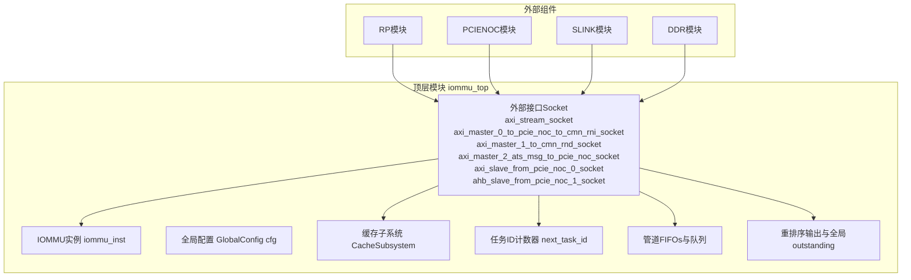
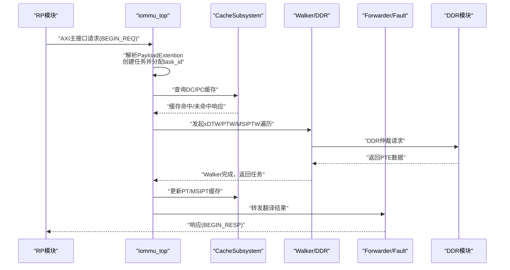
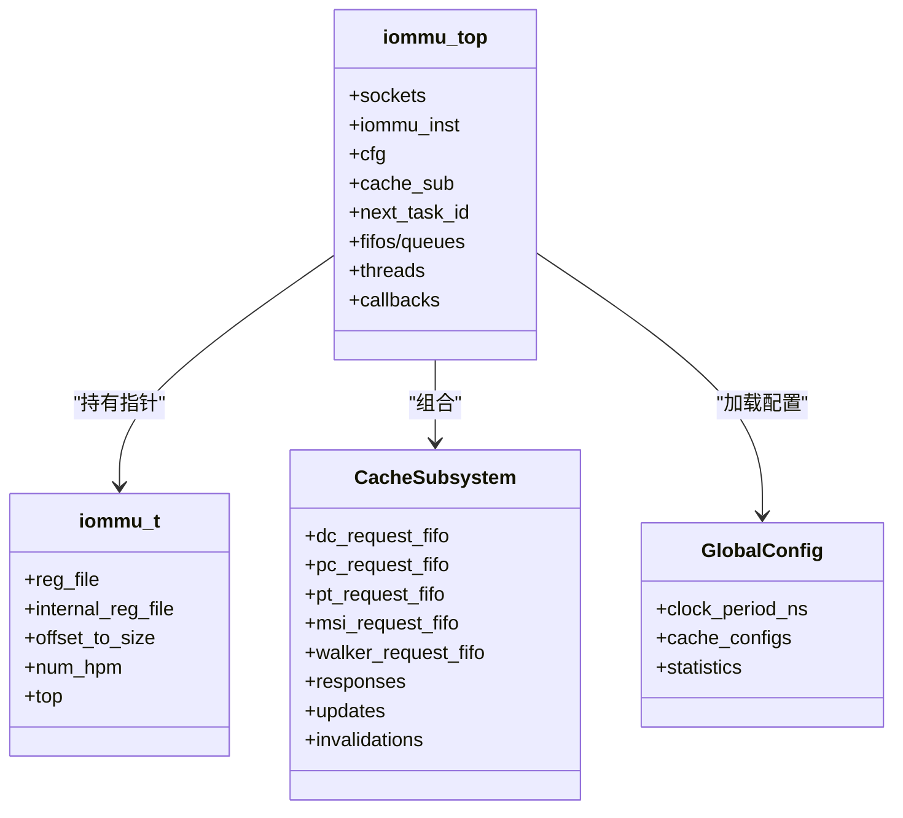

# 顶层模块设计

<cite>
**本文档引用的文件**
- [iommu_top.hh](file://iommu/iommu_top.hh)
- [iommu_top.cc](file://iommu/iommu_top.cc)
- [iommu_struct.hh](file://iommu/include/iommu_struct.hh)
- [iommu_perf_model.hh](file://iommu/include/iommu_perf_model.hh)
- [cache_subsystem.h](file://iommu/cache_src/subsystem/cache_subsystem.h)
- [default_config.json](file://iommu/cache_config/default_config.json)
- [iommu_task.hh](file://iommu/include/iommu_task.hh)
- [iommu_perf_params.hh](file://iommu/iommu_perf_model/iommu_perf_params.hh)
- [param_trans_def.hh](file://iommu/include\param_trans_def.hh)
- [main.cpp](file://main.cpp)
</cite>

## 目录
1. [引言](#引言)
2. [项目结构](#项目结构)
3. [核心组件](#核心组件)
4. [架构概览](#架构概览)
5. [详细组件分析](#详细组件分析)
6. [依赖关系分析](#依赖关系分析)
7. [性能考量](#性能考量)
8. [故障排查指南](#故障排查指南)
9. [结论](#结论)

## 引言
本文件面向RISC-V IOMMU顶层模块iommu_top，提供全面的架构文档。内容涵盖顶层模块的设计理念、核心职责、系统边界、外部接口socket设计、全局配置系统GlobalConfig的加载与使用、任务ID计数器next_task_id的管理与线程安全保护机制，以及顶层模块如何协调缓存子系统、性能模型等子系统的协同工作。同时给出与其他系统组件的集成方式与接口规范，帮助开发者快速理解并正确使用该顶层模块。

## 项目结构
顶层模块iommu_top位于iommu目录下，采用SystemC建模，结合TLM（Transaction-Level Modeling）接口实现与外部组件的解耦连接。其核心职责是作为IOMMU功能与性能模型的统一入口，协调解析、缓存、页表遍历、MSI处理、故障处理、DDR仲裁与重排序输出等子系统。

图表来源
- [iommu_top.hh:41-361](file://iommu/iommu_top.hh#L41-L361)
- [main.cpp:39-94](file://main.cpp#L39-L94)

章节来源
- [iommu_top.hh:41-361](file://iommu/iommu_top.hh#L41-L361)
- [main.cpp:39-94](file://main.cpp#L39-L94)

## 核心组件
- 外部接口Socket：提供与RP、PCIENOC、SLINK、DDR等外部模块的TLM接口，支持AXI主从接口与PCIe NoC接口。
- IOMMU实例iommu_inst：承载寄存器文件、上下文缓存、全局参数等状态，顶层模块通过指针回连到自身以实现跨模块通信。
- 全局配置GlobalConfig：从JSON配置文件加载，驱动缓存子系统的参数与统计配置。
- 缓存子系统CacheSubsystem：统一管理DC/PC/PT/MSIPT/Walker缓存，提供查询、更新、失效的独立FIFO接口。
- 任务ID计数器next_task_id与线程安全：通过sc_mutex保护，确保多线程环境下任务ID唯一性。
- 管道FIFOs与队列：覆盖解析、缓存、Walker、Forwarder、Fault、DDR仲裁等全链路数据流。
- 重排序输出与全局outstanding：保证写请求保序输出，读请求可乱序，全局outstanding控制背压。

章节来源
- [iommu_top.hh:44-196](file://iommu/iommu_top.hh#L44-L196)
- [iommu_top.cc:9-38](file://iommu/iommu_top.cc#L9-L38)
- [cache_subsystem.h:18-84](file://iommu/cache_src/subsystem/cache_subsystem.h#L18-L84)

## 架构概览
顶层模块采用“管道+并行线程”的设计，将IOMMU翻译流程分解为多个阶段，每个阶段由独立线程处理，并通过FIFO进行解耦。缓存子系统通过显式的请求/响应FIFO与顶层模块对接，避免共享状态带来的互斥开销。全局配置系统通过JSON参数驱动缓存容量、替换策略、统计输出等行为。

图表来源
- [iommu_top.cc:130-189](file://iommu/iommu_top.cc#L130-L189)
- [iommu_top.cc:392-412](file://iommu/iommu_top.cc#L392-L412)
- [cache_subsystem.h:33-65](file://iommu/cache_src/subsystem/cache_subsystem.h#L33-L65)

## 详细组件分析

### 外部接口Socket设计与连接关系
- AXI主接口：
  - axi_stream_socket：用于MSI数据传输至IMSIC。
  - axi_master_0_to_pcie_noc_to_cmn_rni_socket：DMA数据与RP访问PCIe NoC。
  - axi_master_1_to_cmn_rnd_socket：SLINK NoC到DDR的页表/目录表访问路径。
  - axi_master_2_ats_msg_to_pcie_noc_socket：ATS消息回传至RP。
- AXI从接口：
  - axi_slave_from_pcie_noc_0_socket：RP发起的请求入口。
  - ahb_slave_from_pcie_noc_1_socket：AHB寄存器访问（非性能路径）。
- 连接关系：
  - RP模块通过axi_master_to_pcie_noc_0_socket绑定到axi_slave_from_pcie_noc_0_socket。
  - PCIENOC模块通过ahb_master_to_pcie_noc_1_socket绑定到ahb_slave_from_pcie_noc_1_socket。
  - SLINK模块经由axi_master_1_to_cmn_rnd_socket连接至DDR模块，形成NoC路径。
  - MSI数据经axi_stream_socket直接连接至DDR模块。

章节来源
- [iommu_top.hh:44-52](file://iommu/iommu_top.hh#L44-L52)
- [main.cpp:64-79](file://main.cpp#L64-L79)

### 全局配置系统GlobalConfig的加载与使用
- 加载方式：通过静态函数load_config从JSON文件default_config.json加载，包含时钟周期、随机种子、缓存参数、替换策略、统计输出等。
- 使用方式：
  - 顶层模块构造时创建CacheSubsystem(cfg)，并将配置传递给缓存子系统。
  - 性能参数（如FIFO深度、带宽、并发限制等）在iommu_perf_params.hh中集中定义，顶层模块在初始化时读取这些参数。
- 配置示例要点：
  - 缓存规模：DC/PC/MSIPT/PT/Walker Cache的sets、ways、replacement策略。
  - 统计输出：统计文件名、延迟直方图、任务追踪级别等。

章节来源
- [iommu_top.hh:56-60](file://iommu/iommu_top.hh#L56-L60)
- [default_config.json:1-69](file://iommu/cache_config/default_config.json#L1-L69)
- [cache_subsystem.h:30](file://iommu/cache_src/subsystem/cache_subsystem.h#L30-L31)
- [iommu_perf_params.hh:6-160](file://iommu/iommu_perf_model/iommu_perf_params.hh#L6-L160)

### 任务ID计数器next_task_id的管理与线程安全
- 初始化：在构造函数中初始化为1。
- 分配机制：在回调函数中（nb_transport_fw与b_transport兼容路径）加锁分配下一个ID，确保多线程并发安全。
- 线程安全：使用sc_mutex task_id_mtx保护next_task_id的原子递增。
- 生命周期：任务完成并通过Forwarder/Fault线程处理后，顶层模块负责释放任务对象（除b_transport路径的兼容处理）。

章节来源
- [iommu_top.hh:65-68](file://iommu/iommu_top.hh#L65-L68)
- [iommu_top.cc:89-91](file://iommu/iommu_top.cc#L89-L91)
- [iommu_top.cc:147-149](file://iommu/iommu_top.cc#L147-L149)

### 顶层模块如何协调各子系统
- 解析与路由：接收外部请求后，解析PayloadExtention，创建任务并写入inbound_fifo，随后进入解析与路由阶段。
- 缓存子系统：通过CacheSubsystem提供的独立请求/响应FIFO与各缓存交互，避免共享状态竞争，提升并行度。
- Walker与DDR：通过独立的req/rsp FIFO与DDR仲裁器协作，控制outstanding与带宽，确保背压与公平性。
- 重排序输出：写请求按task_id保序输出，读请求可乱序，全局outstanding在重排序完成后释放，防止资源泄漏。
- 故障处理：Fault线程统一处理翻译失败与中断上报，确保一致性。

章节来源
- [iommu_top.cc:130-189](file://iommu/iommu_top.cc#L130-L189)
- [iommu_top.cc:266-387](file://iommu/iommu_top.cc#L266-L387)
- [cache_subsystem.h:33-65](file://iommu/cache_src/subsystem/cache_subsystem.h#L33-L65)
- [iommu_top.hh:176-196](file://iommu/iommu_top.hh#L176-L196)

### 顶层模块与其他系统组件的集成方式与接口规范
- 与RP模块集成：通过TLM接口绑定，RP发起的请求经axi_slave_from_pcie_noc_0_socket进入IOMMU，响应经axi_stream_socket或axi_master_0_to_pcie_noc_to_cmn_rni_socket返回。
- 与PCIENOC模块集成：AHB接口绑定ahb_slave_from_pcie_noc_1_socket，用于寄存器访问。
- 与SLINK/DDR集成：axi_master_1_to_cmn_rnd_socket经SLINK NoC连接至DDR，形成页表/目录表访问路径。
- 接口规范：
  - AXI主接口：支持读写AMO，带宽参数在param_trans_def.hh与iommu_perf_params.hh中定义。
  - 回调接口：nb_transport_fw/bw用于异步事务，b_transport用于兼容旧测试路径。
  - PayloadExtention：携带设备ID、PASID、地址类型等扩展信息。

章节来源
- [main.cpp:64-79](file://main.cpp#L64-L79)
- [param_trans_def.hh:10-130](file://iommu/include\param_trans_def.hh#L10-L130)
- [iommu_perf_params.hh:88-101](file://iommu/iommu_perf_model/iommu_perf_params.hh#L88-L101)

## 依赖关系分析
顶层模块与各子系统的依赖关系如下：

图表来源
- [iommu_top.hh:54-60](file://iommu/iommu_top.hh#L54-L60)
- [iommu_struct.hh:42-99](file://iommu/include/iommu_struct.hh#L42-L99)
- [cache_subsystem.h:20-84](file://iommu/cache_src/subsystem/cache_subsystem.h#L20-L84)

章节来源
- [iommu_top.hh:54-60](file://iommu/iommu_top.hh#L54-L60)
- [iommu_struct.hh:42-99](file://iommu/include/iommu_struct.hh#L42-L99)
- [cache_subsystem.h:20-84](file://iommu/cache_src/subsystem/cache_subsystem.h#L20-L84)

## 性能考量
- FIFO深度与背压：各阶段FIFO深度在iommu_perf_params.hh中集中定义，避免瓶颈传播，确保流水线稳定。
- 并发限制：AXI Master端口与DDR仲裁器设置最大outstanding，防止拥塞与死锁。
- 带宽控制：通过带宽延迟公式动态引入延迟，模拟真实硬件带宽限制。
- 重排序与全局outstanding：写请求保序输出，全局outstanding在重排序后释放，平衡吞吐与资源占用。
- 缓存命中率统计：顶层模块提供打印接口，结合CacheSubsystem内部统计，便于性能分析与优化。

章节来源
- [iommu_perf_params.hh:6-160](file://iommu/iommu_perf_model/iommu_perf_params.hh#L6-L160)
- [iommu_top.cc:518-539](file://iommu/iommu_top.cc#L518-L539)

## 故障排查指南
- DDR响应异常：当收到DDR响应但pending队列为空时，会打印错误日志并返回END_RESP，检查上游请求是否正确入队。
- 任务ID冲突：若出现重复task_id，检查task_id_mtx是否正确加锁与解锁。
- FIFO溢出：若某阶段FIFO满导致阻塞，检查上游生产者与下游消费者速率匹配，必要时增大FIFO深度。
- 重排序卡顿：若写请求长时间无法输出，检查全局outstanding是否被释放，确认重排序线程正常运行。
- 配置不一致：若缓存行为异常，核对default_config.json与iommu_perf_params.hh中的参数是否匹配。

章节来源
- [iommu_top.cc:194-261](file://iommu/iommu_top.cc#L194-L261)
- [iommu_top.cc:89-91](file://iommu/iommu_top.cc#L89-L91)
- [iommu_perf_params.hh:78-108](file://iommu/iommu_perf_model/iommu_perf_params.hh#L78-L108)

## 结论
iommu_top通过清晰的管道化设计与严格的线程安全机制，实现了高性能、可扩展的RISC-V IOMMU仿真模型。其对外提供标准TLM接口，对内通过CacheSubsystem与Walker/DDR仲裁器实现高并行度与低耦合。配合JSON配置系统与性能参数集中管理，顶层模块能够灵活适配不同场景需求，并为后续功能扩展与优化奠定坚实基础。