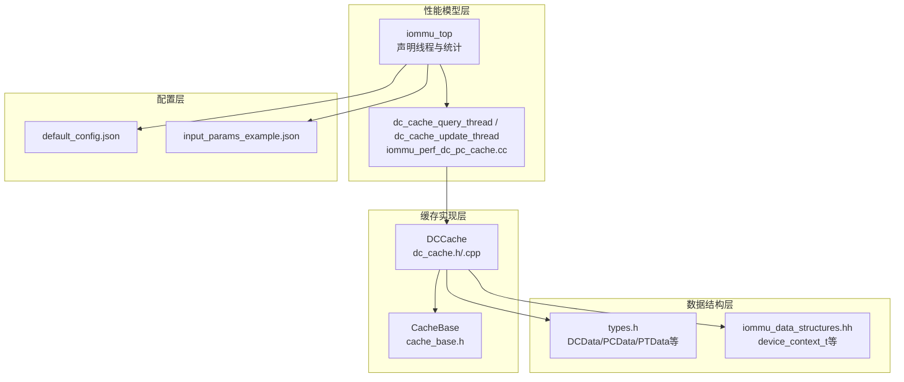
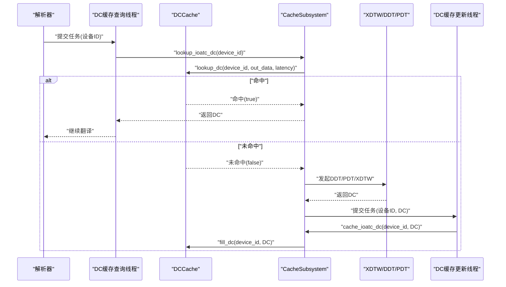
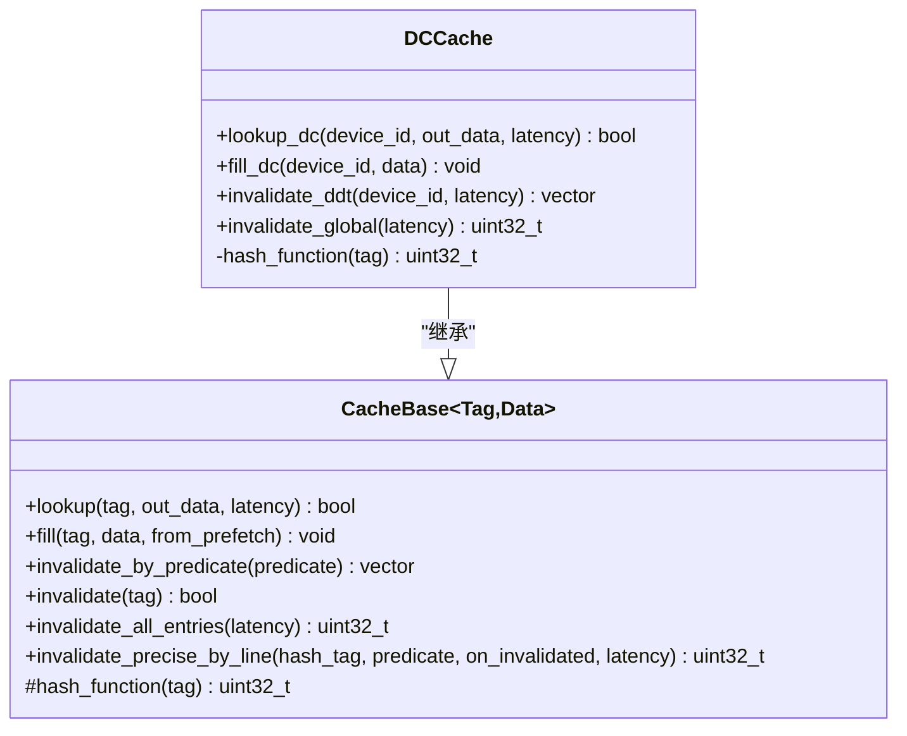
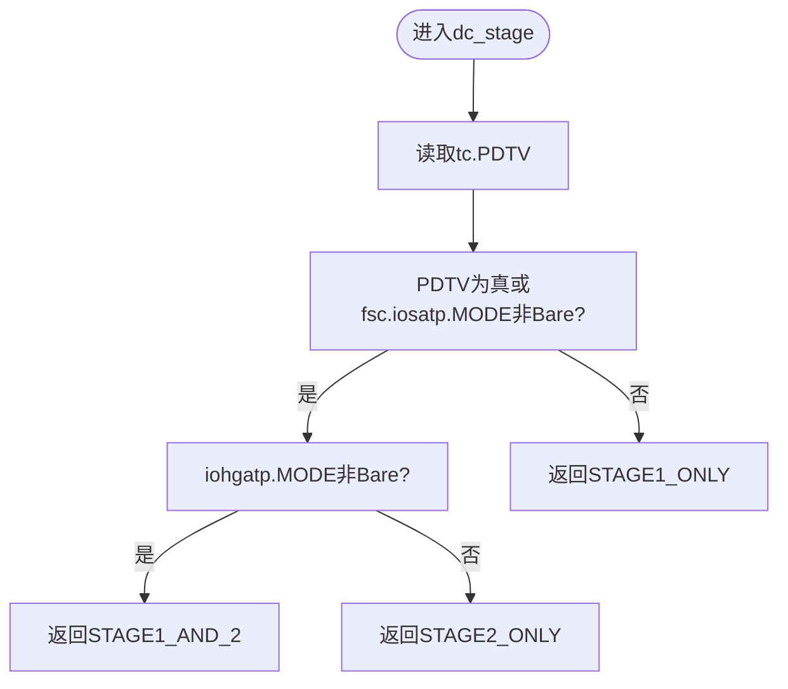
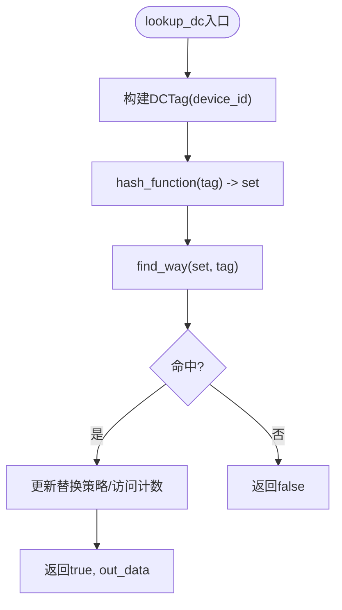
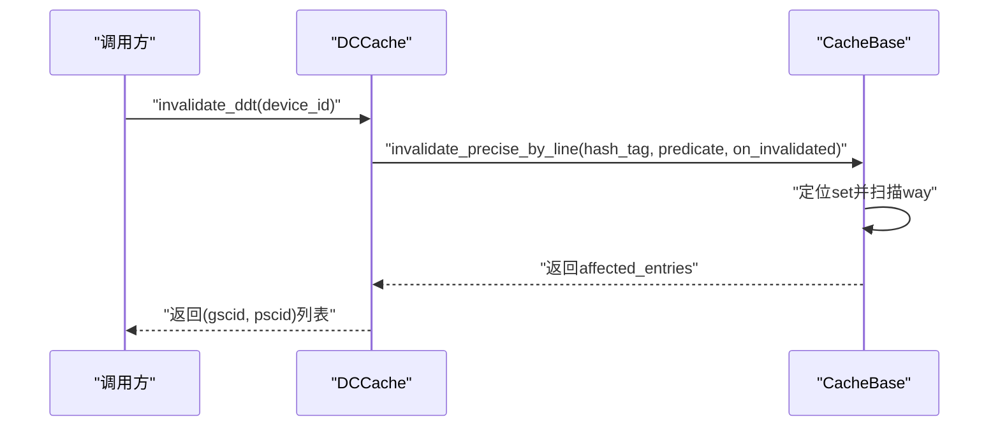
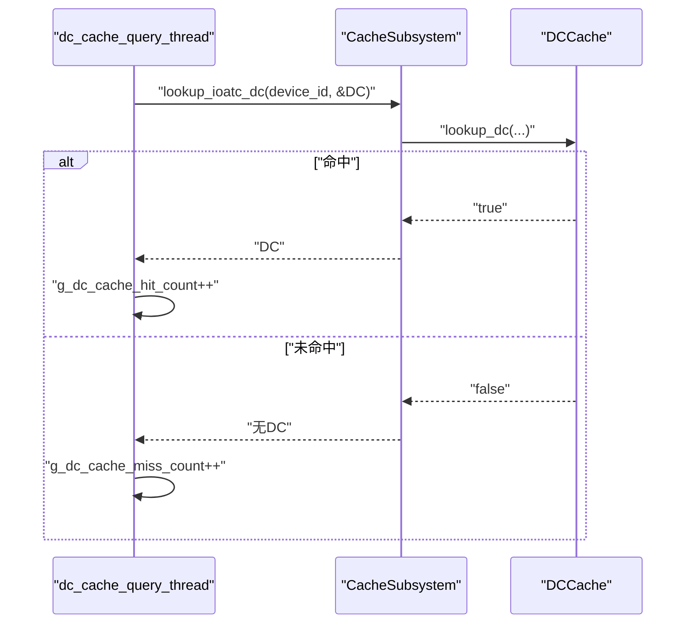
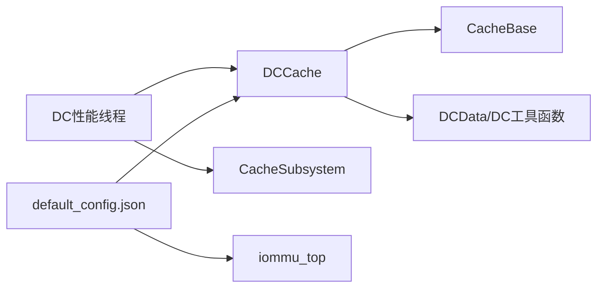

# DC缓存（设备上下文缓存）

<cite>
**本文引用的文件**
- [dc_cache.h](file://iommu/cache_src/cache/dc_cache.h)
- [dc_cache.cpp](file://iommu/cache_src/cache/dc_cache.cpp)
- [cache_base.h](file://iommu/cache_src/cache/cache_base.h)
- [types.h](file://iommu/cache_src/common/types.h)
- [iommu_data_structures.hh](file://iommu/include/iommu_data_structures.hh)
- [iommu_struct.hh](file://iommu/include/iommu_struct.hh)
- [iommu_perf_dc_pc_cache.cc](file://iommu/iommu_perf_model/iommu_perf_dc_pc_cache.cc)
- [default_config.json](file://iommu/cache_config/default_config.json)
- [input_params_example.json](file://iommu/cache_config/input_params_example.json)
- [iommu_top.hh](file://iommu/iommu_top.hh)
</cite>

## 目录
1. [简介](#简介)
2. [项目结构](#项目结构)
3. [核心组件](#核心组件)
4. [架构总览](#架构总览)
5. [详细组件分析](#详细组件分析)
6. [依赖关系分析](#依赖关系分析)
7. [性能考量](#性能考量)
8. [故障排查指南](#故障排查指南)
9. [结论](#结论)
10. [附录](#附录)

## 简介
本文件面向IOMMU中的DC缓存（设备上下文缓存），系统性阐述其在IOMMU地址翻译流水线中的关键作用：设备上下文的快速检索、存储组织与一致性维护。DC缓存以设备ID为索引，承载设备上下文（Device Context, DC）数据，支撑第一/第二阶段地址翻译所需的软上下文信息（如GSCID、PSCID、翻译控制与模式等）。本文将从数据结构、索引与查找策略、有效性检查与更新、失效传播机制、配置参数与性能调优等方面进行深入解析，并给出使用示例与常见问题解决方案。

## 项目结构
围绕DC缓存的关键代码分布在以下模块：
- 缓存实现层：DCCache类及其基类CacheBase，负责缓存查询、填充与失效。
- 数据结构层：设备上下文DC的规范定义与工具函数，提供有效性、阶段判断等辅助能力。
- 性能模型层：DC/PC缓存查询与更新的性能线程，模拟命中/未命中与延迟。
- 配置层：JSON配置文件，定义缓存容量、替换策略与性能参数。
- 顶层集成：iommu_top中声明了DC缓存查询与更新线程，以及缓存统计变量。

**图表来源**
- [dc_cache.h:1-36](file://iommu/cache_src/cache/dc_cache.h#L1-L36)
- [dc_cache.cpp:1-53](file://iommu/cache_src/cache/dc_cache.cpp#L1-L53)
- [cache_base.h:1-746](file://iommu/cache_src/cache/cache_base.h#L1-L746)
- [types.h:266-288](file://iommu/cache_src/common/types.h#L266-L288)
- [iommu_data_structures.hh:324-335](file://iommu/include/iommu_data_structures.hh#L324-L335)
- [iommu_perf_dc_pc_cache.cc:11-64](file://iommu/iommu_perf_model/iommu_perf_dc_pc_cache.cc#L11-L64)
- [iommu_top.hh:34-42](file://iommu/iommu_top.hh#L34-L42)
- [default_config.json:20-24](file://iommu/cache_config/default_config.json#L20-L24)
- [input_params_example.json:20-24](file://iommu/cache_config/input_params_example.json#L20-L24)

**章节来源**
- [dc_cache.h:1-36](file://iommu/cache_src/cache/dc_cache.h#L1-L36)
- [cache_base.h:26-264](file://iommu/cache_src/cache/cache_base.h#L26-L264)
- [types.h:266-288](file://iommu/cache_src/common/types.h#L266-L288)
- [iommu_data_structures.hh:324-335](file://iommu/include/iommu_data_structures.hh#L324-L335)
- [iommu_perf_dc_pc_cache.cc:11-64](file://iommu/iommu_perf_model/iommu_perf_dc_pc_cache.cc#L11-L64)
- [default_config.json:20-24](file://iommu/cache_config/default_config.json#L20-L24)
- [input_params_example.json:20-24](file://iommu/cache_config/input_params_example.json#L20-L24)
- [iommu_top.hh:34-42](file://iommu/iommu_top.hh#L34-L42)

## 核心组件
- DCCache：DC缓存的具体实现，继承自CacheBase，提供基于设备ID的查询、填充与精确失效接口。
- CacheBase：通用缓存基类，封装查找、填充、失效、替换算法与仲裁延迟建模。
- DCData/DC：设备上下文数据类型与工具函数，提供有效性检查、GSCID/PSCID提取、阶段判断等。
- 性能线程：DC缓存查询与更新线程，记录命中/未命中与延迟，驱动缓存生命周期。
- 配置参数：JSON配置文件定义缓存容量、替换策略与性能参数，支持全局时钟周期与各阶段延迟。

**章节来源**
- [dc_cache.h:8-31](file://iommu/cache_src/cache/dc_cache.h#L8-L31)
- [cache_base.h:26-264](file://iommu/cache_src/cache/cache_base.h#L26-L264)
- [types.h:266-288](file://iommu/cache_src/common/types.h#L266-L288)
- [iommu_perf_dc_pc_cache.cc:11-64](file://iommu/iommu_perf_model/iommu_perf_dc_pc_cache.cc#L11-L64)
- [default_config.json:20-24](file://iommu/cache_config/default_config.json#L20-L24)

## 架构总览
DC缓存在IOMMU中的位置与交互如下：
- 查询路径：解析器将设备ID送入DC缓存查询线程，线程调用lookup_ioatc_dc进行查询，命中则返回DC，未命中则进入DDT/PDT/XDTW流程。
- 更新路径：XDTW完成后，线程调用cache_ioatc_dc将DC写回缓存，确保后续请求命中。
- 失效路径：当DDT命令触发无效化时，DC缓存按设备ID精确失效，返回受影响的(gscid, pscid)列表用于级联失效。

**图表来源**
- [iommu_perf_dc_pc_cache.cc:11-64](file://iommu/iommu_perf_model/iommu_perf_dc_pc_cache.cc#L11-L64)
- [dc_cache.cpp:11-22](file://iommu/cache_src/cache/dc_cache.cpp#L11-L22)
- [iommu_top.hh:309-311](file://iommu/iommu_top.hh#L309-L311)

**章节来源**
- [iommu_perf_dc_pc_cache.cc:11-64](file://iommu/iommu_perf_model/iommu_perf_dc_pc_cache.cc#L11-L64)
- [dc_cache.cpp:11-22](file://iommu/cache_src/cache/dc_cache.cpp#L11-L22)
- [iommu_top.hh:309-311](file://iommu/iommu_top.hh#L309-L311)

## 详细组件分析

### DCCache类与接口
- 查询接口：lookup_dc(device_id, out_data, latency)基于设备ID进行缓存查找。
- 填充接口：fill_dc(device_id, DCData)将新DC写入缓存。
- 失效接口：invalidate_ddt(device_id, latency)按设备ID精确失效，返回受影响的(gscid, pscid)列表用于级联。
- 全局失效：invalidate_global(latency)清空所有DC缓存条目。
- 散列函数：hash_function(tag)使用设备ID高16位与中8位的组合进行混合，掩码为set数量-1，确保均匀分布。

**图表来源**
- [dc_cache.h:8-31](file://iommu/cache_src/cache/dc_cache.h#L8-L31)
- [cache_base.h:26-264](file://iommu/cache_src/cache/cache_base.h#L26-L264)

**章节来源**
- [dc_cache.h:11-27](file://iommu/cache_src/cache/dc_cache.h#L11-L27)
- [dc_cache.cpp:11-50](file://iommu/cache_src/cache/dc_cache.cpp#L11-L50)
- [cache_base.h:71-74](file://iommu/cache_src/cache/cache_base.h#L71-L74)

### 设备上下文数据结构与有效性
- DCData类型：基于全局命名空间的device_context_t，包含tc/iohgatp/ta/fsc/msi字段。
- 有效性检查：dc_valid(data)依据tc.V判断DC是否有效。
- 上下文标识：dc_gscid(data)/dc_pscid(data)分别提取GSCID与PSCID。
- 阶段判断：dc_stage(data)根据PDTV与MODE推导一阶/二阶/两级翻译场景。
- 辅助构造：make_dc_data(...)用于生成标准DC模板，便于测试与仿真。

**图表来源**
- [types.h:270-288](file://iommu/cache_src/common/types.h#L270-L288)
- [iommu_data_structures.hh:324-335](file://iommu/include/iommu_data_structures.hh#L324-L335)

**章节来源**
- [types.h:266-288](file://iommu/cache_src/common/types.h#L266-L288)
- [iommu_data_structures.hh:324-335](file://iommu/include/iommu_data_structures.hh#L324-L335)

### 查找策略与散列函数
- 索引键：DCTag包含device_id，作为缓存标签。
- 散列策略：hash_function对device_id进行位混合，掩码为num_sets-1，减少冲突。
- 查找流程：CacheBase::lookup先计算set，再在set内线性比较tag命中，命中后更新替换策略计数与访问计数。

**图表来源**
- [dc_cache.cpp:11-16](file://iommu/cache_src/cache/dc_cache.cpp#L11-L16)
- [cache_base.h:267-306](file://iommu/cache_src/cache/cache_base.h#L267-L306)
- [cache_base.h:607-614](file://iommu/cache_src/cache/cache_base.h#L607-L614)

**章节来源**
- [dc_cache.cpp:11-16](file://iommu/cache_src/cache/dc_cache.cpp#L11-L16)
- [cache_base.h:267-306](file://iommu/cache_src/cache/cache_base.h#L267-L306)
- [cache_base.h:607-614](file://iommu/cache_src/cache/cache_base.h#L607-L614)

### 失效传播机制
- 精确失效：invalidate_ddt按设备ID定位set，扫描该set内匹配的条目，回调收集(gscid, pscid)用于级联失效。
- 全局失效：invalidate_all_entries遍历全表，清空所有有效条目并统计受影响数量。
- 失效延迟：CacheBase对失效操作进行仲裁与延迟建模，确保多操作并发下的公平性与正确性。

**图表来源**
- [dc_cache.cpp:24-45](file://iommu/cache_src/cache/dc_cache.cpp#L24-L45)
- [cache_base.h:571-604](file://iommu/cache_src/cache/cache_base.h#L571-L604)

**章节来源**
- [dc_cache.cpp:24-45](file://iommu/cache_src/cache/dc_cache.cpp#L24-L45)
- [cache_base.h:571-604](file://iommu/cache_src/cache/cache_base.h#L571-L604)

### 性能模型与统计
- 查询线程：dc_cache_query_thread读取任务，调用lookup_ioatc_dc，记录命中/未命中与延迟，更新命中/未命中计数。
- 更新线程：dc_cache_update_thread在XDTW完成后写回DC，保持缓存新鲜度。
- 统计变量：g_dc_cache_hit_count/g_dc_cache_miss_count在顶层声明，用于全局统计。

**图表来源**
- [iommu_perf_dc_pc_cache.cc:11-42](file://iommu/iommu_perf_model/iommu_perf_dc_pc_cache.cc#L11-L42)
- [dc_cache.cpp:11-16](file://iommu/cache_src/cache/dc_cache.cpp#L11-L16)

**章节来源**
- [iommu_perf_dc_pc_cache.cc:11-42](file://iommu/iommu_perf_model/iommu_perf_dc_pc_cache.cc#L11-L42)
- [iommu_top.hh:34-42](file://iommu/iommu_top.hh#L34-L42)

## 依赖关系分析
- DCCache依赖CacheBase提供的通用缓存框架（查找、填充、失效、替换与仲裁）。
- DCCache使用DCData类型与工具函数（有效性、GSCID/PSCID提取、阶段判断）。
- 性能线程通过CacheSubsystem接口与DCCache交互，形成查询/更新闭环。
- 配置文件通过GlobalConfig注入缓存容量、替换策略与性能参数。

**图表来源**
- [dc_cache.h:8-31](file://iommu/cache_src/cache/dc_cache.h#L8-L31)
- [cache_base.h:26-264](file://iommu/cache_src/cache/cache_base.h#L26-L264)
- [types.h:266-288](file://iommu/cache_src/common/types.h#L266-L288)
- [iommu_perf_dc_pc_cache.cc:11-64](file://iommu/iommu_perf_model/iommu_perf_dc_pc_cache.cc#L11-L64)
- [default_config.json:20-24](file://iommu/cache_config/default_config.json#L20-L24)

**章节来源**
- [dc_cache.h:8-31](file://iommu/cache_src/cache/dc_cache.h#L8-L31)
- [cache_base.h:26-264](file://iommu/cache_src/cache/cache_base.h#L26-L264)
- [types.h:266-288](file://iommu/cache_src/common/types.h#L266-L288)
- [iommu_perf_dc_pc_cache.cc:11-64](file://iommu/iommu_perf_model/iommu_perf_dc_pc_cache.cc#L11-L64)
- [default_config.json:20-24](file://iommu/cache_config/default_config.json#L20-L24)

## 性能考量
- 缓存容量：num_sets与num_ways决定缓存规模与冲突概率。增大num_sets可降低冲突，但增加比较开销；增大num_ways可提升命中率但增加比较与替换成本。
- 替换策略：默认PLRU，支持SRRIP（需配置srrip_m_bits）。SRRIP在大容量缓存中通常优于PLRU，但配置复杂度更高。
- 延迟建模：hash_latency、read_set_latency、compare_latency、fill_compute_index_*、write_way_latency等参数直接影响命中/未命中延迟。合理设置可平衡吞吐与延迟。
- 仲裁与公平性：Lookup/Fill/Invalidate三类操作采用WRR仲裁，避免饥饿；arbiter_latency_cycles影响排队等待时间。
- 预取与命中：命中路径可区分预取命中，有助于统计预取效果；未命中路径需关注XDTW/DDT/PDT开销。

[本节为通用性能指导，无需特定文件引用]

## 故障排查指南
- 命中率偏低
  - 检查num_sets是否过小导致高冲突；适当增大num_sets或切换SRRIP策略。
  - 检查设备ID分布是否集中，必要时调整散列函数或引入更细粒度索引。
- 未命中频繁
  - 关注XDTW/DDT/PDT路径延迟，确认DC是否及时写回缓存。
  - 检查invalidate_ddt是否正确传播(gscid, pscid)以触发级联失效。
- 延迟异常
  - 核对cache_timing参数（hash/read_set/compare等），确保与目标时钟周期一致。
  - 检查仲裁延迟与排队时间统计，避免瓶颈在RAM端口争用。
- 配置不生效
  - 确认JSON配置文件路径与字段名称正确，GlobalConfig加载流程无误。

**章节来源**
- [default_config.json:7-18](file://iommu/cache_config/default_config.json#L7-L18)
- [cache_base.h:154-214](file://iommu/cache_src/cache/cache_base.h#L154-L214)
- [cache_base.h:627-741](file://iommu/cache_src/cache/cache_base.h#L627-L741)

## 结论
DC缓存通过简洁而高效的索引与查找机制，显著降低了IOMMU地址翻译路径上的DC访问延迟。结合合理的容量与替换策略、完善的失效传播与性能建模，可在保证吞吐的同时维持稳定的命中率。通过JSON配置与性能线程，系统提供了灵活的调优手段与可观测性，便于在不同工作负载下获得最佳性能。

[本节为总结性内容，无需特定文件引用]

## 附录

### DC缓存配置参数说明
- 缓存容量
  - num_sets：缓存组数，决定set数量。
  - num_ways：每组关联条目数，决定冲突槽位数。
- 替换策略
  - replacement：可选"plru"或"srrip"；SRRIP需配置srrip_m_bits。
- 性能参数
  - arbiter_latency_cycles/hash_latency_cycles/read_set_latency_cycles/compare_latency_cycles/update_way_select_latency_cycles/fill_compute_index_*_cycles/write_way_latency_cycles/invalidation_compare_per_way_cycles：用于建模各阶段延迟与仲裁等待。

**章节来源**
- [default_config.json:20-24](file://iommu/cache_config/default_config.json#L20-L24)
- [default_config.json:7-18](file://iommu/cache_config/default_config.json#L7-L18)
- [cache_base.h:584-600](file://iommu/cache_src/cache/cache_base.h#L584-L600)

### 使用示例（概念性）
- 查询DC：解析器将设备ID送入DC缓存查询线程，线程调用lookup_ioatc_dc，命中则继续翻译，未命中则走XDTW/DDT/PDT路径。
- 更新DC：XDTW完成后，线程调用cache_ioatc_dc写回DC，确保后续命中。
- 失效DC：当DDT命令触发无效化时，按设备ID精确失效，返回(gscid, pscid)列表用于级联。

**章节来源**
- [iommu_perf_dc_pc_cache.cc:11-64](file://iommu/iommu_perf_model/iommu_perf_dc_pc_cache.cc#L11-L64)
- [dc_cache.cpp:11-45](file://iommu/cache_src/cache/dc_cache.cpp#L11-L45)