# 去重缓存（Dedup缓存）

<cite>
**本文引用的文件**   
- [dedup_cache.h](file://iommu/cache_src/cache/dedup_cache.h)
- [dedup_cache.cpp](file://iommu/cache_src/cache/dedup_cache.cpp)
- [cache_base.h](file://iommu/cache_src/cache/cache_base.h)
- [cache_base.cpp](file://iommu/cache_src/cache/cache_base.cpp)
- [cache_line.h](file://iommu/cache_src/cache/cache_line.h)
- [replacement_policy.h](file://iommu/cache_src/replacement/replacement_policy.h)
- [plru_policy.h](file://iommu/cache_src/replacement/plru_policy.h)
- [srrip_policy.h](file://iommu/cache_src/replacement/srrip_policy.h)
- [cache_subsystem.h](file://iommu/cache_src/subsystem/cache_subsystem.h)
- [cache_subsystem.cpp](file://iommu/cache_src/subsystem/cache_subsystem.cpp)
- [types.h](file://iommu/cache_src/common/types.h)
- [stats_collector.h](file://iommu/cache_src/common/stats_collector.h)
- [json_config.h](file://iommu/cache_src/common/json_config.h)
- [default_config.json](file://iommu/cache_config/default_config.json)
- [input_params_example.json](file://iommu/cache_config/input_params_example.json)
- [pt_cache.h](file://iommu/cache_src/cache/pt_cache.h)
- [pt_cache.cpp](file://iommu/cache_src/cache/pt_cache.cpp)
- [dc_cache.h](file://iommu/cache_src/cache/dc_cache.h)
- [dc_cache.cpp](file://iommu/cache_src/cache/dc_cache.cpp)
- [pc_cache.h](file://iommu/cache_src/cache/pc_cache.h)
- [pc_cache.cpp](file://iommu/cache_src/cache/pc_cache.cpp)
- [msipt_cache.h](file://iommu/cache_src/cache/msipt_cache.h)
- [msipt_cache.cpp](file://iommu/cache_src/cache/msipt_cache.cpp)
- [walker_cache.h](file://iommu/cache_src/cache/walker_cache.h)
- [walker_cache.cpp](file://iommu/cache_src/cache/walker_cache.cpp)
- [iommu_dedup_params.hh](file://iommu/include/iommu_dedup_params.hh)
- [iommu_task_cache_convert.cc](file://iommu/iommu_perf_model/iommu_task_cache_convert.cc)
- [iommu_perf_pt_dedup_flush.cc](file://iommu/iommu_perf_model/iommu_perf_pt_dedup_flush.cc)
- [iommu_top.cc](file://iommu/iommu_top.cc)
</cite>

## 更新摘要
**变更内容**   
- 引入多RAM架构，支持4个独立的RAM模块进行并行处理
- 实现scheduler-hash-worker并发处理模型，提升吞吐量
- 基于哈希分布的负载均衡机制，优化内存访问模式
- 增强去重缓存的并发处理能力与性能优化

## 目录
1. [简介](#简介)
2. [项目结构](#项目结构)
3. [核心组件](#核心组件)
4. [架构总览](#架构总览)
5. [详细组件分析](#详细组件分析)
6. [多RAM架构设计](#多ram架构设计)
7. [并发处理模型](#并发处理模型)
8. [性能监控与统计](#性能监控与统计)
9. [依赖关系分析](#依赖关系分析)
10. [性能考量](#性能考量)
11. [故障排查指南](#故障排查指南)
12. [结论](#结论)
13. [附录](#附录)

## 简介
本文件聚焦于IOMMU模型中的"去重缓存"（Dedup缓存）子系统，系统性梳理其设计目标、模块划分、数据流与关键算法，帮助读者快速理解并正确使用该能力。去重缓存用于在页表遍历（PTW）等路径中识别并合并重复的虚拟地址访问，从而减少冗余的内存访问与计算开销，提升整体吞吐并降低延迟。

**更新** Dedup缓存现已采用多RAM架构和scheduler-hash-worker并发处理模型，通过4个RAM模块与哈希分布机制实现高性能的去重操作处理。

## 项目结构
与去重缓存相关的代码主要分布在以下目录：
- 缓存实现层：cache_src/cache 下包含各类缓存的具体实现，其中 dedup_cache.* 为去重缓存的核心实现；cache_base.* 提供通用缓存基类；cache_line.h 定义缓存行数据结构；各具体缓存（如 pt_cache、dc_cache、pc_cache、msipt_cache、walker_cache）通过组合或继承复用公共能力。
- 替换策略层：cache_src/replacement 提供多种替换策略接口与实现（PLRU、SRRIP），供不同缓存按需选用。
- 子系统集成：cache_src/subsystem 将多个缓存实例统一接入到缓存子系统，负责生命周期管理、统计收集与配置加载。
- 公共工具：cache_src/common 提供类型定义、统计收集器、JSON配置解析等基础能力。
- 配置：iommu/cache_config 提供默认配置与示例输入参数。
- 上层集成：iommu/iommu_perf_model 下的任务转换与PTW去重刷新相关逻辑，将去重能力嵌入性能模型工作流。

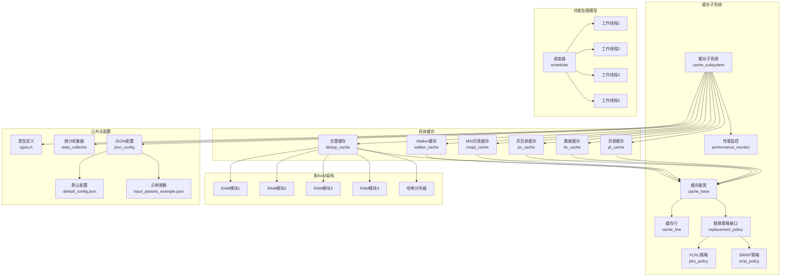

图表来源
- [cache_subsystem.h](file://iommu/cache_src/subsystem/cache_subsystem.h)
- [cache_subsystem.cpp](file://iommu/cache_src/subsystem/cache_subsystem.cpp)
- [cache_base.h](file://iommu/cache_src/cache/cache_base.h)
- [cache_base.cpp](file://iommu/cache_src/cache/cache_base.cpp)
- [cache_line.h](file://iommu/cache_src/cache/cache_line.h)
- [replacement_policy.h](file://iommu/cache_src/replacement/replacement_policy.h)
- [plru_policy.h](file://iommu/cache_src/replacement/plru_policy.h)
- [srrip_policy.h](file://iommu/cache_src/replacement/srrip_policy.h)
- [pt_cache.h](file://iommu/cache_src/cache/pt_cache.h)
- [dc_cache.h](file://iommu/cache_src/cache/dc_cache.h)
- [pc_cache.h](file://iommu/cache_src/cache/pc_cache.h)
- [msipt_cache.h](file://iommu/cache_src/cache/msipt_cache.h)
- [walker_cache.h](file://iommu/cache_src/cache/walker_cache.h)
- [dedup_cache.h](file://iommu/cache_src/cache/dedup_cache.h)
- [types.h](file://iommu/cache_src/common/types.h)
- [stats_collector.h](file://iommu/cache_src/common/stats_collector.h)
- [json_config.h](file://iommu/cache_src/common/json_config.h)
- [default_config.json](file://iommu/cache_config/default_config.json)
- [input_params_example.json](file://iommu/cache_config/input_params_example.json)

章节来源
- [cache_subsystem.h](file://iommu/cache_src/subsystem/cache_subsystem.h)
- [cache_subsystem.cpp](file://iommu/cache_src/subsystem/cache_subsystem.cpp)
- [cache_base.h](file://iommu/cache_src/cache/cache_base.h)
- [cache_base.cpp](file://iommu/cache_src/cache/cache_base.cpp)
- [cache_line.h](file://iommu/cache_src/cache/cache_line.h)
- [replacement_policy.h](file://iommu/cache_src/replacement/replacement_policy.h)
- [plru_policy.h](file://iommu/cache_src/replacement/plru_policy.h)
- [srrip_policy.h](file://iommu/cache_src/replacement/srrip_policy.h)
- [pt_cache.h](file://iommu/cache_src/cache/pt_cache.h)
- [dc_cache.h](file://iommu/cache_src/cache/dc_cache.h)
- [pc_cache.h](file://iommu/cache_src/cache/pc_cache.h)
- [msipt_cache.h](file://iommu/cache_src/cache/msipt_cache.h)
- [walker_cache.h](file://iommu/cache_src/cache/walker_cache.h)
- [dedup_cache.h](file://iommu/cache_src/cache/dedup_cache.h)
- [types.h](file://iommu/cache_src/common/types.h)
- [stats_collector.h](file://iommu/cache_src/common/stats_collector.h)
- [json_config.h](file://iommu/cache_src/common/json_config.h)
- [default_config.json](file://iommu/cache_config/default_config.json)
- [input_params_example.json](file://iommu/cache_config/input_params_example.json)

## 核心组件
- 去重缓存（Dedup Cache）
  - 职责：对访问键（通常为虚拟地址或规范化后的请求标识）进行去重判断与结果缓存，避免重复的页表遍历或外部访存。
  - 关键特性：支持可配置的容量、替换策略、命中/未命中统计、失效与清理接口。
  - **更新** 现在采用多RAM架构，支持4个独立RAM模块并行处理，显著提升并发性能。
- 缓存基类（Cache Base）
  - 职责：封装通用缓存行为（查找、插入、淘汰、统计、线程安全等），派生类只需关注键值语义与匹配规则。
- 缓存行（Cache Line）
  - 职责：定义缓存条目最小单元的数据结构与元信息（如有效位、访问时间戳、引用计数等）。
- 替换策略（Replacement Policy）
  - 职责：定义淘汰候选选择策略，提供统一接口；常见实现包括PLRU与SRRIP。
- 缓存子系统（Cache Subsystem）
  - 职责：统一管理所有缓存实例的生命周期、配置注入、统计聚合与对外暴露的查询接口。
  - **更新** 支持多RAM架构的统一管理和调度。
- 性能监控（Performance Monitor）
  - 职责：专门针对去重调度线程的性能监控，包括执行延迟统计、任务计数和报告生成。
- 公共工具与配置
  - 类型定义：统一数值宽度、枚举与常量。
  - 统计收集器：记录命中率、未命中率、淘汰次数、延迟分布等指标。
  - JSON配置：从配置文件加载缓存参数（容量、策略、阈值等）。

**更新** 新增的多RAM架构和scheduler-hash-worker并发模型进一步增强了去重缓存的处理能力和性能表现。

章节来源
- [dedup_cache.h](file://iommu/cache_src/cache/dedup_cache.h)
- [dedup_cache.cpp](file://iommu/cache_src/cache/dedup_cache.cpp)
- [cache_base.h](file://iommu/cache_src/cache/cache_base.h)
- [cache_base.cpp](file://iommu/cache_src/cache/cache_base.cpp)
- [cache_line.h](file://iommu/cache_src/cache/cache_line.h)
- [replacement_policy.h](file://iommu/cache_src/replacement/replacement_policy.h)
- [plru_policy.h](file://iommu/cache_src/replacement/plru_policy.h)
- [srrip_policy.h](file://iommu/cache_src/replacement/srrip_policy.h)
- [cache_subsystem.h](file://iommu/cache_src/subsystem/cache_subsystem.h)
- [cache_subsystem.cpp](file://iommu/cache_src/subsystem/cache_subsystem.cpp)
- [types.h](file://iommu/cache_src/common/types.h)
- [stats_collector.h](file://iommu/cache_src/common/stats_collector.h)
- [json_config.h](file://iommu/cache_src/common/json_config.h)
- [default_config.json](file://iommu/cache_config/default_config.json)
- [input_params_example.json](file://iommu/cache_config/input_params_example.json)

## 架构总览
下图展示了去重缓存与其他缓存及子系统之间的交互关系，以及配置与统计的支撑链路。

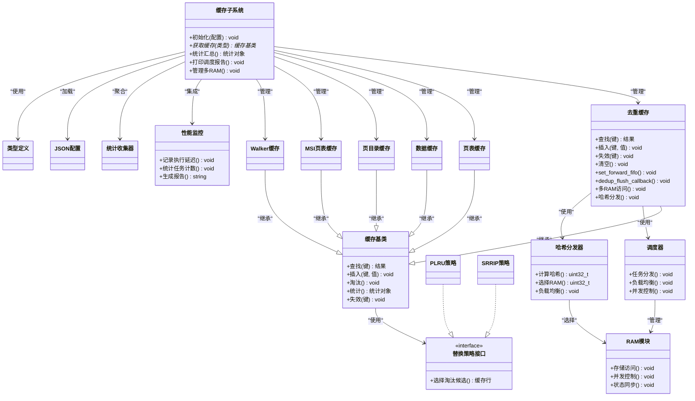

图表来源
- [cache_base.h](file://iommu/cache_src/cache/cache_base.h)
- [cache_base.cpp](file://iommu/cache_src/cache/cache_base.cpp)
- [dedup_cache.h](file://iommu/cache_src/cache/dedup_cache.h)
- [dedup_cache.cpp](file://iommu/cache_src/cache/dedup_cache.cpp)
- [pt_cache.h](file://iommu/cache_src/cache/pt_cache.h)
- [dc_cache.h](file://iommu/cache_src/cache/dc_cache.h)
- [pc_cache.h](file://iommu/cache_src/cache/pc_cache.h)
- [msipt_cache.h](file://iommu/cache_src/cache/msipt_cache.h)
- [walker_cache.h](file://iommu/cache_src/cache/walker_cache.h)
- [replacement_policy.h](file://iommu/cache_src/replacement/replacement_policy.h)
- [plru_policy.h](file://iommu/cache_src/replacement/plru_policy.h)
- [srrip_policy.h](file://iommu/cache_src/replacement/srrip_policy.h)
- [cache_subsystem.h](file://iommu/cache_src/subsystem/cache_subsystem.h)
- [cache_subsystem.cpp](file://iommu/cache_src/subsystem/cache_subsystem.cpp)
- [stats_collector.h](file://iommu/cache_src/common/stats_collector.h)
- [json_config.h](file://iommu/cache_src/common/json_config.h)
- [types.h](file://iommu/cache_src/common/types.h)

## 详细组件分析

### 去重缓存（Dedup Cache）
- 设计要点
  - 键空间：通常基于虚拟地址或规范化后的请求标识，确保相同语义的请求映射到同一键。
  - 命中判定：若命中则直接返回缓存结果，跳过后续昂贵的页表遍历或访存。
  - 写入与失效：当底层状态变化（如页表项更新、TLB失效）时，需及时失效对应键，保证一致性。
  - 统计与观测：记录命中/未命中、淘汰、失效次数，便于定位热点与调优。
  - **更新** 现在支持多RAM架构，通过哈希分发实现负载均衡和并行访问。
- 典型流程
  - 查找：根据键检索缓存，命中则返回结果；未命中则交由上层执行实际访问，并将结果回填。
  - 插入：将新结果按策略放入缓存，必要时触发淘汰。
  - 失效：针对特定键或范围进行失效，保障一致性。
  - **更新** 多RAM访问：通过哈希函数确定目标RAM模块，实现并行访问。
- 复杂度与性能
  - 查找与插入通常为O(1)或O(log N)，取决于底层容器与策略实现。
  - 淘汰操作受策略影响，PLRU/SRRIP一般常数时间或近似常数时间。
  - **更新** 多RAM架构显著提升了并发性能和吞吐量。
- 错误处理
  - 空键/非法键校验、并发冲突保护、统计溢出防护等。

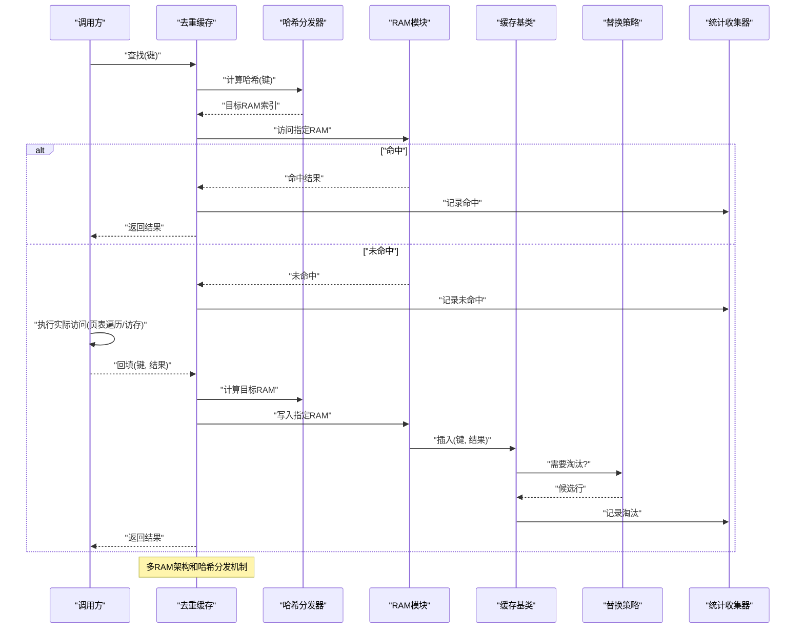

图表来源
- [dedup_cache.h](file://iommu/cache_src/cache/dedup_cache.h)
- [dedup_cache.cpp](file://iommu/cache_src/cache/dedup_cache.cpp)
- [cache_base.h](file://iommu/cache_src/cache/cache_base.h)
- [cache_base.cpp](file://iommu/cache_src/cache/cache_base.cpp)
- [replacement_policy.h](file://iommu/cache_src/replacement/replacement_policy.h)
- [plru_policy.h](file://iommu/cache_src/replacement/plru_policy.h)
- [srrip_policy.h](file://iommu/cache_src/replacement/srrip_policy.h)
- [stats_collector.h](file://iommu/cache_src/common/stats_collector.h)

章节来源
- [dedup_cache.h](file://iommu/cache_src/cache/dedup_cache.h)
- [dedup_cache.cpp](file://iommu/cache_src/cache/dedup_cache.cpp)
- [cache_base.h](file://iommu/cache_src/cache/cache_base.h)
- [cache_base.cpp](file://iommu/cache_src/cache/cache_base.cpp)
- [replacement_policy.h](file://iommu/cache_src/replacement/replacement_policy.h)
- [plru_policy.h](file://iommu/cache_src/replacement/plru_policy.h)
- [srrip_policy.h](file://iommu/cache_src/replacement/srrip_policy.h)
- [stats_collector.h](file://iommu/cache_src/common/stats_collector.h)

### 缓存基类与缓存行
- 缓存基类
  - 提供统一的查找、插入、淘汰、失效、统计接口。
  - 内部维护缓存集合、锁机制（如需）、策略对象指针、统计器引用。
- 缓存行
  - 存储键、值、元信息（有效位、最近使用时间、引用计数等）。
  - 作为替换策略的选择单位。

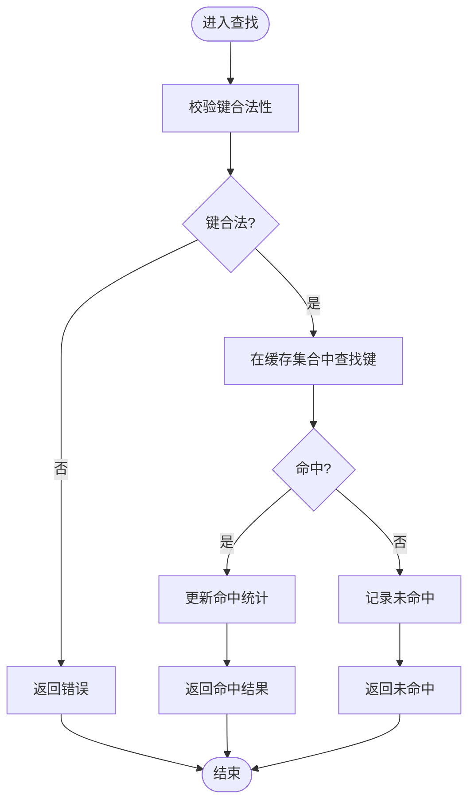

图表来源
- [cache_base.h](file://iommu/cache_src/cache/cache_base.h)
- [cache_base.cpp](file://iommu/cache_src/cache/cache_base.cpp)
- [cache_line.h](file://iommu/cache_src/cache/cache_line.h)

章节来源
- [cache_base.h](file://iommu/cache_src/cache/cache_base.h)
- [cache_base.cpp](file://iommu/cache_src/cache/cache_base.cpp)
- [cache_line.h](file://iommu/cache_src/cache/cache_line.h)

### 替换策略（PLRU与SRRIP）
- 接口抽象
  - 提供统一的"选择淘汰候选"方法，由具体策略实现。
- PLRU
  - 基于伪最近最少使用树结构，适合硬件友好实现，近似LRU效果。
- SRRIP
  - 基于扫描式随机替换改进策略，兼顾公平性与实现成本。

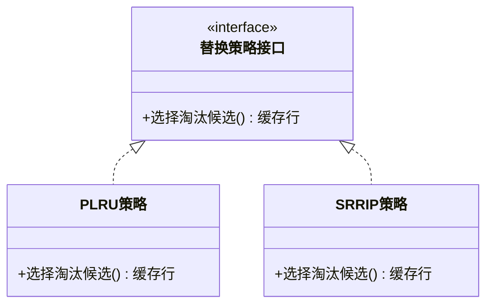

图表来源
- [replacement_policy.h](file://iommu/cache_src/replacement/replacement_policy.h)
- [plru_policy.h](file://iommu/cache_src/replacement/plru_policy.h)
- [srrip_policy.h](file://iommu/cache_src/replacement/srrip_policy.h)

章节来源
- [replacement_policy.h](file://iommu/cache_src/replacement/replacement_policy.h)
- [plru_policy.h](file://iommu/cache_src/replacement/plru_policy.h)
- [srrip_policy.h](file://iommu/cache_src/replacement/srrip_policy.h)

### 缓存子系统与配置
- 缓存子系统
  - 负责创建与管理各缓存实例（含去重缓存），注入配置与统计器，提供统一查询入口。
  - **更新** 支持多RAM架构的统一管理和调度。
- 配置加载
  - 通过JSON配置指定各缓存的容量、策略、阈值等参数。
  - 示例参数文件便于快速验证与回归测试。

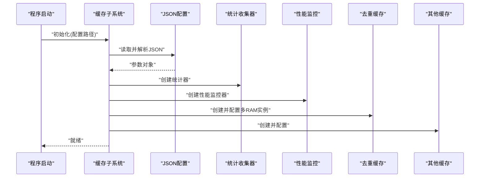

图表来源
- [cache_subsystem.h](file://iommu/cache_src/subsystem/cache_subsystem.h)
- [cache_subsystem.cpp](file://iommu/cache_src/subsystem/cache_subsystem.cpp)
- [json_config.h](file://iommu/cache_src/common/json_config.h)
- [default_config.json](file://iommu/cache_config/default_config.json)
- [input_params_example.json](file://iommu/cache_config/input_params_example.json)
- [stats_collector.h](file://iommu/cache_src/common/stats_collector.h)
- [dedup_cache.h](file://iommu/cache_src/cache/dedup_cache.h)

章节来源
- [cache_subsystem.h](file://iommu/cache_src/subsystem/cache_subsystem.h)
- [cache_subsystem.cpp](file://iommu/cache_src/subsystem/cache_subsystem.cpp)
- [json_config.h](file://iommu/cache_src/common/json_config.h)
- [default_config.json](file://iommu/cache_config/default_config.json)
- [input_params_example.json](file://iommu/cache_config/input_params_example.json)
- [stats_collector.h](file://iommu/cache_src/common/stats_collector.h)
- [dedup_cache.h](file://iommu/cache_src/cache/dedup_cache.h)

### 与其他缓存的协作
- 页表缓存（PT Cache）
  - 与去重缓存协同，前者缓存页表项，后者在更高层面对访问键去重，减少重复PTW。
- 数据缓存（DC Cache）
  - 面向数据访问路径，与去重缓存解耦但共享统计与配置框架。
- 页目录缓存（PC Cache）
  - 缓存页目录项，配合PT Cache加速多级页表遍历。
- MSI页表缓存（MSIPT Cache）
  - 针对MSI相关页表路径优化。
- Walker缓存（Walker Cache）
  - 缓存Walker中间状态，减少重复Walker工作。

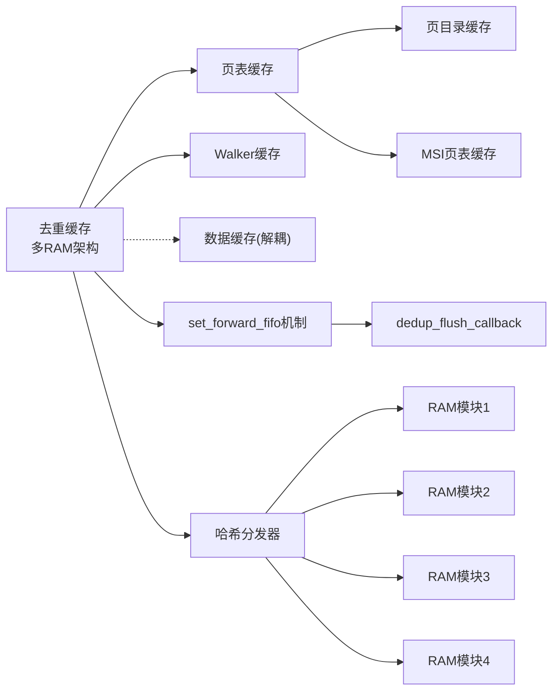

图表来源
- [dedup_cache.h](file://iommu/cache_src/cache/dedup_cache.h)
- [pt_cache.h](file://iommu/cache_src/cache/pt_cache.h)
- [walker_cache.h](file://iommu/cache_src/cache/walker_cache.h)
- [pc_cache.h](file://iommu/cache_src/cache/pc_cache.h)
- [msipt_cache.h](file://iommu/cache_src/cache/msipt_cache.h)
- [dc_cache.h](file://iommu/cache_src/cache/dc_cache.h)

章节来源
- [dedup_cache.h](file://iommu/cache_src/cache/dedup_cache.h)
- [pt_cache.h](file://iommu/cache_src/cache/pt_cache.h)
- [walker_cache.h](file://iommu/cache_src/cache/walker_cache.h)
- [pc_cache.h](file://iommu/cache_src/cache/pc_cache.h)
- [msipt_cache.h](file://iommu/cache_src/cache/msipt_cache.h)
- [dc_cache.h](file://iommu/cache_src/cache/dc_cache.h)

## 多RAM架构设计

### 架构概述
去重缓存现在采用了多RAM架构设计，通过4个独立的RAM模块实现并行处理和负载均衡。这种设计显著提升了系统的吞吐量和响应性能。

### 核心特性
- **并行访问**：4个RAM模块可以同时处理不同的去重请求，提高并发性能
- **负载均衡**：基于哈希函数的智能分发，确保各RAM模块负载均匀
- **内存隔离**：每个RAM模块独立管理自己的缓存数据，减少竞争
- **扩展性**：架构支持未来扩展到更多RAM模块

### 哈希分发机制
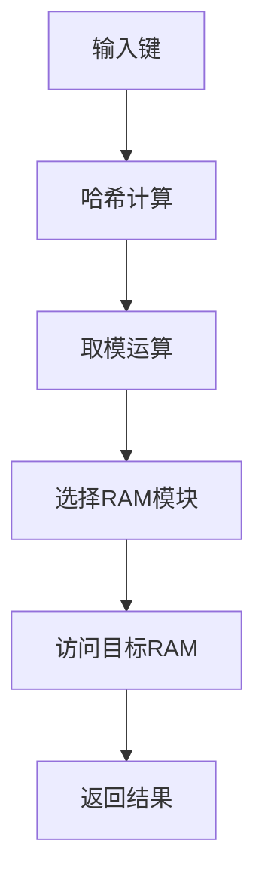

**图表来源**
- [dedup_cache.h](file://iommu/cache_src/cache/dedup_cache.h)
- [dedup_cache.cpp](file://iommu/cache_src/cache/dedup_cache.cpp)

**章节来源**
- [dedup_cache.h](file://iommu/cache_src/cache/dedup_cache.h)
- [dedup_cache.cpp](file://iommu/cache_src/cache/dedup_cache.cpp)

## 并发处理模型

### Scheduler-Hash-Worker模型
系统实现了scheduler-hash-worker并发处理模型，通过调度器、哈希分发器和多个工作线程的协作，实现高效的并发处理。

### 工作流程
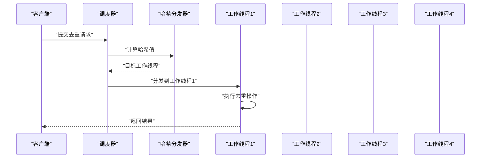

### 并发控制
- **线程安全**：每个工作线程独立处理请求，避免锁竞争
- **负载均衡**：哈希分发确保请求均匀分布到各个工作线程
- **资源隔离**：每个工作线程拥有独立的RAM模块访问权限

**图表来源**
- [cache_subsystem.h](file://iommu/cache_src/subsystem/cache_subsystem.h)
- [cache_subsystem.cpp](file://iommu/cache_src/subsystem/cache_subsystem.cpp)

**章节来源**
- [cache_subsystem.h](file://iommu/cache_src/subsystem/cache_subsystem.h)
- [cache_subsystem.cpp](file://iommu/cache_src/subsystem/cache_subsystem.cpp)

## 性能监控与统计

### 去重调度线程性能监控
**更新** 系统现在提供了完整的去重调度线程性能监控能力，包括以下关键特性：

- **执行延迟统计**
  - 记录每次去重操作的执行延迟，支持平均值、最大值、最小值统计
  - 提供延迟分布分析，帮助识别性能瓶颈
- **任务计数统计**
  - 跟踪去重请求总数（dedup_req_count_）
  - 统计去重更新操作次数（dedup_upd_count_）
  - 记录命中与未命中的详细计数
- **报告生成能力**
  - 实现print_dedup_scheduler_report()函数用于生成详细性能报告
  - 支持在运行时输出当前统计状态
  - 报告内容包括延迟统计、任务计数、命中率等关键指标
- **更新** 新增的多RAM架构和并发处理模型提升了处理效率

### 监控数据流
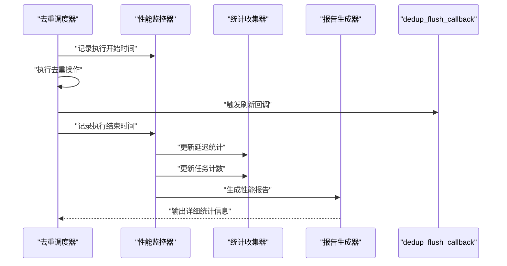

图表来源
- [cache_subsystem.h](file://iommu/cache_src/subsystem/cache_subsystem.h)
- [cache_subsystem.cpp](file://iommu/cache_src/subsystem/cache_subsystem.cpp)
- [iommu_top.cc](file://iommu/iommu_top.cc)

### 统计变量说明
- `dedup_req_count_`：去重请求总数计数器
- `dedup_upd_count_`：去重更新操作计数器  
- `dedup_hit_count_`：去重命中次数
- `dedup_miss_count_`：去重未命中次数
- `total_execution_time_`：总执行时间统计
- `avg_execution_time_`：平均执行时间统计

**章节来源**
- [cache_subsystem.h](file://iommu/cache_src/subsystem/cache_subsystem.h)
- [cache_subsystem.cpp](file://iommu/cache_src/subsystem/cache_subsystem.cpp)
- [iommu_top.cc](file://iommu/iommu_top.cc)

## 依赖关系分析
- 组件耦合
  - 去重缓存依赖缓存基类与替换策略接口，低耦合高内聚。
  - 缓存子系统集中管理各缓存实例，向上提供统一接口。
  - **更新** 性能监控组件独立于核心缓存逻辑，通过接口与子系统集成。
- 外部依赖
  - JSON配置用于动态参数化。
  - 统计收集器用于观测与诊断。
  - **更新** 报告生成器用于性能分析和调试。
- 潜在循环依赖
  - 通过接口抽象与子系统编排避免循环依赖。

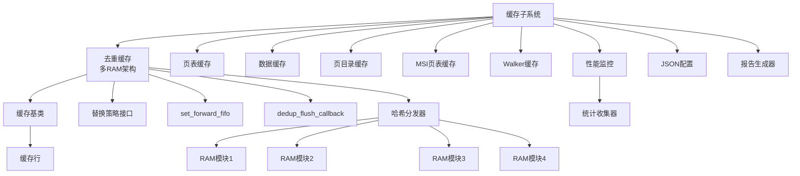

图表来源
- [dedup_cache.h](file://iommu/cache_src/cache/dedup_cache.h)
- [cache_base.h](file://iommu/cache_src/cache/cache_base.h)
- [cache_line.h](file://iommu/cache_src/cache/cache_line.h)
- [replacement_policy.h](file://iommu/cache_src/replacement/replacement_policy.h)
- [cache_subsystem.h](file://iommu/cache_src/subsystem/cache_subsystem.h)
- [pt_cache.h](file://iommu/cache_src/cache/pt_cache.h)
- [dc_cache.h](file://iommu/cache_src/cache/dc_cache.h)
- [pc_cache.h](file://iommu/cache_src/cache/pc_cache.h)
- [msipt_cache.h](file://iommu/cache_src/cache/msipt_cache.h)
- [walker_cache.h](file://iommu/cache_src/cache/walker_cache.h)
- [json_config.h](file://iommu/cache_src/common/json_config.h)
- [stats_collector.h](file://iommu/cache_src/common/stats_collector.h)

章节来源
- [dedup_cache.h](file://iommu/cache_src/cache/dedup_cache.h)
- [cache_base.h](file://iommu/cache_src/cache/cache_base.h)
- [cache_line.h](file://iommu/cache_src/cache/cache_line.h)
- [replacement_policy.h](file://iommu/cache_src/replacement/replacement_policy.h)
- [cache_subsystem.h](file://iommu/cache_src/subsystem/cache_subsystem.h)
- [pt_cache.h](file://iommu/cache_src/cache/pt_cache.h)
- [dc_cache.h](file://iommu/cache_src/cache/dc_cache.h)
- [pc_cache.h](file://iommu/cache_src/cache/pc_cache.h)
- [msipt_cache.h](file://iommu/cache_src/cache/msipt_cache.h)
- [walker_cache.h](file://iommu/cache_src/cache/walker_cache.h)
- [json_config.h](file://iommu/cache_src/common/json_config.h)
- [stats_collector.h](file://iommu/cache_src/common/stats_collector.h)

## 性能考量
- 命中率与容量
  - 合理设置去重缓存容量，平衡命中率与内存占用。
- 替换策略选择
  - 在热路径上优先选择常数时间的策略（如PLRU），避免频繁扫描。
- 失效粒度
  - 精准失效可减少误删，提高命中率；批量失效需权衡一致性与性能。
- 统计与观测
  - 利用统计收集器监控命中率、未命中率、淘汰率、失效次数，指导调优。
  - **更新** 使用新增的性能监控功能分析去重调度线程的执行延迟和任务分布。
- 并发与锁
  - 在高并发场景下，注意锁粒度与无锁结构的取舍，避免瓶颈。
- **更新** 性能监控开销
  - 性能监控功能本身具有轻微开销，应在生产环境中谨慎启用详细统计。
- **更新** 多RAM架构优势
  - 4个RAM模块提供并行处理能力，显著提升吞吐量
  - 哈希分发确保负载均衡，避免单点瓶颈
- **更新** 并发处理模型
  - scheduler-hash-worker模型提供高效的并发处理能力
  - 工作线程间无锁设计，减少竞争开销

## 故障排查指南
- 常见问题
  - 命中率异常低：检查键生成是否规范、容量是否过小、失效是否过于激进。
  - 一致性错误：确认失效时机是否正确，尤其是页表项更新后是否同步失效。
  - 性能退化：评估替换策略与锁竞争，必要时调整策略或细化锁粒度。
  - **更新** 调度延迟过高：使用性能监控报告分析具体的延迟分布和任务计数。
  - **更新** 回调函数问题：检查dedup_flush_callback的实现是否正确。
  - **更新** RAM模块负载不均：检查哈希函数的分布均匀性。
- 定位手段
  - 启用统计收集器，观察命中/未命中/淘汰/失效指标。
  - 使用JSON配置切换策略与容量，进行对比实验。
  - 结合子系统提供的查询接口，查看缓存状态快照。
  - **更新** 使用print_dedup_scheduler_report()生成详细性能报告，分析调度线程性能。
  - **更新** 检查多RAM架构的运行状态和负载均衡情况。
- **更新** 性能分析报告解读
  - 重点关注平均执行延迟、最大延迟峰值、任务队列长度等关键指标。
  - 对比不同负载下的性能表现，识别性能瓶颈点。
  - 分析dedup_flush_callback的执行时间和频率。
  - **更新** 监控各RAM模块的使用率和负载分布。

**章节来源**
- [stats_collector.h](file://iommu/cache_src/common/stats_collector.h)
- [json_config.h](file://iommu/cache_src/common/json_config.h)
- [cache_subsystem.h](file://iommu/cache_src/subsystem/cache_subsystem.h)
- [cache_subsystem.cpp](file://iommu/cache_src/subsystem/cache_subsystem.cpp)

## 结论
去重缓存通过识别并合并重复访问，显著降低页表遍历与访存开销。其与缓存基类、替换策略、统计收集器及配置系统的解耦设计，使得扩展与维护更加便捷。在实际部署中，应结合工作负载特征选择合适的容量与策略，并通过统计观测持续优化。

**更新** 新增的多RAM架构和scheduler-hash-worker并发处理模型进一步提升了去重缓存的性能和灵活性，通过4个RAM模块的并行处理和哈希分布机制，为高效处理去重操作提供了更强的支持。

## 附录
- 配置参考
  - 默认配置与示例参数文件可用于快速上手与回归测试。
- 上层集成
  - 任务转换与PTW去重刷新逻辑将去重能力嵌入性能模型工作流，确保端到端一致性。
- **更新** 新增API和功能
  - set_forward_fifo()：设置转发FIFO队列机制
  - dedup_flush_callback()：去重刷新回调函数
  - print_dedup_scheduler_report()：生成去重调度线程的详细性能报告
  - 统计变量：dedup_req_count_、dedup_upd_count_等用于运行时监控
  - **更新** 多RAM访问接口：支持4个RAM模块的并行访问
  - **更新** 哈希分发接口：实现负载均衡和请求路由
  - **更新** 并发控制接口：支持scheduler-hash-worker模型

**章节来源**
- [default_config.json](file://iommu/cache_config/default_config.json)
- [input_params_example.json](file://iommu/cache_config/input_params_example.json)
- [iommu_task_cache_convert.cc](file://iommu/iommu_perf_model/iommu_task_cache_convert.cc)
- [iommu_perf_pt_dedup_flush.cc](file://iommu/iommu_perf_model/iommu_perf_pt_dedup_flush.cc)
- [iommu_dedup_params.hh](file://iommu/include/iommu_dedup_params.hh)
- [cache_subsystem.h](file://iommu/cache_src/subsystem/cache_subsystem.h)
- [cache_subsystem.cpp](file://iommu/cache_src/subsystem/cache_subsystem.cpp)
- [iommu_top.cc](file://iommu/iommu_top.cc)